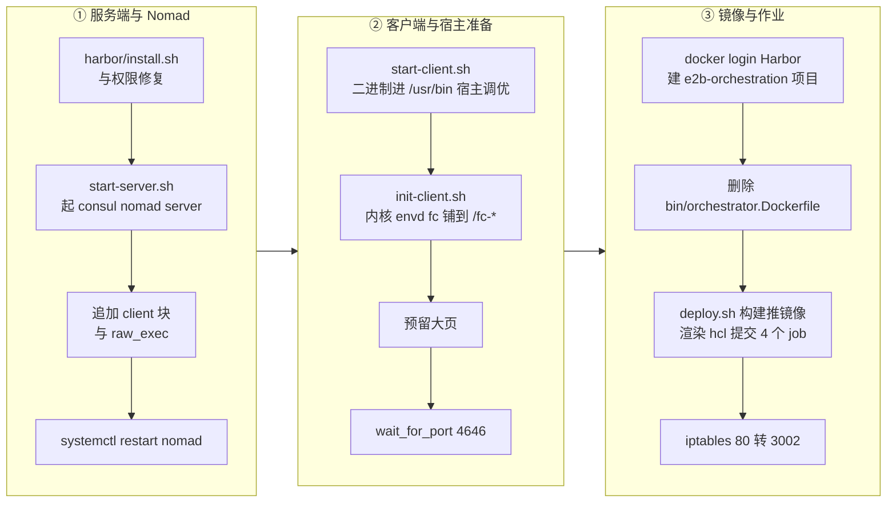

# 80 · 部署形态三：单机离线 RPM

> 上游 2026.09 的部署形态假设有 GCP、有外网、有 Terraform 和 Packer。把同一套代码搬到一台
> 不能联网的 aarch64 服务器上，这些假设一条都不成立。单机离线版的答案是一个 RPM 包加两条命令：
> 包里装齐所有二进制与脚本，两条命令把宿主机改造成一朵「单机云」。本篇讲这个交付物的构建模型、
> 目录布局、安装流程，以及它为了「一台机器」放弃了什么。
>
> **读者**：需要在受限环境里落地 e2b 的系统工程师。
> **预备**：[第 09 篇 §2](09-nomad-consul-terraform.md#2-nomad-的模型)、
> [第 64 篇 §2](64-nomad-jobs.md#2-读一份-jobspec-要看的六件事)、[第 67 篇 §4](67-arm-port-overview.md#4-四个仓库与交付形态)。
> **代码**：`e2b-infra.spec`、`e2b-deploy/build.sh`、`e2b-deploy/dep/*`

---

## 0. 本篇要回答的问题

1. 为什么单机离线版选 RPM 作为交付物，它相对 Helm 和 Nomad 多节点形态换来了什么、失去了什么？
2. 「纯净 tarball + 单一补丁位 + 二进制 Source」这个构建模型是怎么运作的，代价在哪里？
3. 一次 Go 构建在完全断网的机器上怎么完成？工具链和依赖分别从哪来？
4. `/opt/e2b-infra` 里的东西分别来自哪一层，为什么 `rpm -Uvh` 之后必须重放一遍覆盖层？
5. `build.sh -i` 和 `build.sh -s` 各自在系统里改了什么，哪些改动是持久的、哪些重启即失？
6. 为什么单机形态上 orchestrator 和 template-manager 是同一个进程，这个合并的边界在哪里？

---

## 1. 约束先于设计

上游的部署路径在[第 63 篇 §6](63-gcp-terraform.md#6-磁盘镜像与节点启动脚本)里讲过：Terraform 建网络与
托管服务，Packer 烤一张装好 Consul / Nomad / gcsfuse 的机器镜像，实例启动时由 user-data 跑
`start-client.sh`，脚本用 `gsutil` 从公共 bucket 拉内核与 Firecracker，用 `gcsfuse` 把对象存储
挂成本地目录。这条路径每一步都要么依赖 GCP 的某个 API，要么依赖公网。

单机离线版的目标环境把这些前提逐条抽掉：一台鲲鹏服务器，openEuler，没有外网，没有对象存储服务，
没有托管数据库，也没有第二台机器可以承担控制面。剩下的能力只有：一个可用的 yum 源和 pip 源、
一份自备的 docker、以及本机的 KVM。

在这样的约束下，「部署」这件事被重新定义为两个问题：**怎么把编译产物送到机器上**，
以及**怎么把这台机器改造成 e2b 期待的运行环境**。RPM 回答第一个，`build.sh` 回答第二个。

三种部署形态的取舍可以并排看：

| 维度 | Helm / Kubernetes（[第 78 篇](78-helm-k8s-deployment.md#1-这不是一份通用-chart)） | Nomad 多节点（[第 79 篇](79-nomad-multinode-deployment.md#2-四类节点与它们跑什么)） | 单机离线 RPM（本篇） |
|---|---|---|---|
| 前置设施 | 一个 k8s 集群 | 多台机器 + 外部 Postgres / Harbor / MinIO | 一台机器，全部自建 |
| 交付物 | 容器镜像 + Chart | 二进制 + job 模板 | 一个 rpm |
| 控制面 | k8s | Consul + Nomad，server 与 client 分离 | Consul + Nomad，server 与 client 同机 |
| 联网要求 | 拉镜像 | 拉镜像与依赖 | 仅 yum / pip |
| 可扩展性 | 水平扩节点 | 水平扩节点 | 无，容量等于这台机器 |
| 故障域 | 每层独立 | 控制面与数据面独立 | 全部在一台机器上 |

最后一行是代价：单机形态没有任何冗余，宿主机重启等于全部沙箱丢失，Nomad 的调度语义退化成
「在本机起进程」。换来的是部署复杂度从「一套基础设施」压缩到「一个包两条命令」。

---

## 2. RPM 的构建模型

`e2b-infra.spec` 的结构是标准 RPM，但它承载的东西比通常的 Go 项目 spec 多得多。

### 2.1 Source 清单

| 编号 | 内容 | 在包里的去处 |
|---|---|---|
| `Source0` | 上游 2026.09 源码 tarball（含 vendor 目录） | 构建输入 |
| `Source1` | glibc 版 busybox（arm64） | `%prep` 拷进模板构建器的嵌入目录 |
| `Source2` / `Source3` | goose 迁移工具，arm64 / x86 各一份 | `bin/goose`，按架构选 |
| `Source4` / `Source5` / `Source6` | 客户机内核 vmlinux，arm / x86 / openEuler 变体 | `bin/vmlinux.bin` 及 `.openeuler` |
| `Source7` | `patch_e2b.py`，SDK 的 https→http 改写脚本 | `/opt/e2b-infra/patch_e2b.py` |
| `Source8` | ARM 版 Firecracker 二进制 | `bin/firecracker`，仅 aarch64 |
| `Source9` | `e2b-deploy.tar.gz`，部署脚本包 | 整体铺进 `/opt/e2b-infra/` |
| 无编号 | `tools-arm64.tar.gz` / `tools-amd64.tar.gz`，离线 Go 工具链 | `%prep` 解到 `%{_builddir}/go-toolchain` |
| `Patch1` | `0001-adapted-for-arm-architecture.patch` | `%autosetup -p1` 应用 |

这里有两个值得注意的形状。

**一个补丁位。** spec 只声明 `Patch1`，ARM 适配的全部改动（架构适配、去 GCP 化、存储 provider、
埋点、参数放宽、部署物料）合成一份 diff。收益是版本关系简单：源码包永远是纯净的上游 tag，
下游状态完全落在一个文件里，`git diff` 一条命令就能看出下游改了什么。代价是这份补丁很大，
一旦某个 hunk 与新版上游冲突，`%prep` 直接失败，而失败点是补丁行号，不是逻辑单元；
补丁的重新生成流程在[第 85 篇 §2](85-dev-workflow-and-packaging.md#2-纯净-tarball-加单一补丁)。

**二进制进 Source。** 内核、Firecracker、busybox、goose 都是预编译产物，以 Source 的身份进包。
这不是通常的 RPM 做法——正常的包会让这些东西成为依赖或者在 `%build` 里编译。这里这么做的理由是
它们本身就编不出来：客户机内核来自单独的内核仓库，Firecracker 来自分叉的 Rust 项目
（[第 70 篇 §3](70-firecracker-fork.md#3-在-aarch64-上构建)），在目标机上重建它们要引入一整条工具链。
代价是这些二进制的来源与可复现性不在这个 spec 里，包的完整性只能靠外部约定保证。

### 2.2 `%prep` 与 `%build`

```spec
%autosetup -p1 -n e2b-infra-%{tag}
cp %{SOURCE1} packages/orchestrator/internal/template/build/core/systeminit/
mkdir -p %{_builddir}/go-toolchain
%ifarch aarch64
    tar -xf %{_sourcedir}/tools-arm64.tar.gz -C %{_builddir}/go-toolchain
%endif
tar -xf %{SOURCE9} -C %{_builddir}
```

`%autosetup -p1` 解包并应用补丁。随后 busybox 被拷进
`packages/orchestrator/internal/template/build/core/systeminit/`——模板构建器把它作为沙箱 rootfs
的 init 使用，为什么必须是 glibc 版见[第 74 篇 §2.3](74-template-build-on-arm.md#23-135-与-1361-的差别在-libc不在版本号)。

这两行的**顺序**是一条不写在任何地方的隐式依赖。补丁自己也往同一个目录放了一个
`busybox_1.35_arm64`，但那份不是二进制：它是一个下载失败留下的 3611 字节 HTML 落地页
（[第 74 篇 §2.2](74-template-build-on-arm.md#22-补丁里的两个占位文件)）。
`busybox.go` 用 `//go:embed busybox_1.35_arm64` 把这个文件名编进 orchestrator，
所以真正决定产物的是「谁最后写了这个路径」。`cp` 排在 `%autosetup` 之后，
恰好把占位内容盖成实物，RPM 这条路径因此永远是对的。
代价是这条不变量只由两行的先后次序维持：把 `cp` 挪到 `%autosetup` 之前、
或者绕开 spec 直接对补丁树 `go build`，都会编出一个 init 是 HTML 的 orchestrator，
而且编译、打包、部署三步全部成功，失败推迟到第一次构建模板时 guest 起不来。
`busybox.go` 的 `init()` 不做 ELF 校验，全链路上没有任何一处会发现这件事。

Go 工具链的解压路径用的是 `%{_sourcedir}` 而不是 `%{SOURCEn}`，因为它没有 Source 编号。
效果上等价，但它不出现在 Source 清单里，构建机上少放这个文件会在 `%build` 阶段才报错，
而不是在 `%prep` 的解包检查里。

---

## 3. 离线构建怎么做到

`%build` 只有几行，但每一行都在解一个联网问题：

```bash
export GOROOT=%{_builddir}/go-toolchain/go
export PATH=$GOROOT/bin:$PATH
export GOFLAGS=-mod=vendor
rm -f go.work go.work.sum
```

**工具链。** `GOROOT` 指向刚解出来的 tarball，构建机不需要装 golang，也不需要与 spec 约定 Go 版本。
`BuildRequires` 里只有 `make` 和 `gcc`。

**依赖。** `GOFLAGS=-mod=vendor` 让 `go build` 只看源码树里的 `vendor/` 目录，不访问
`proxy.golang.org`，也不读模块缓存。这要求 Source0 的 tarball 必须带 vendor——上游 tag 的
GitHub 归档不带，所以这个 tarball 是下游重新打的，用 git-lfs 管理，体积一百多兆。
代价是依赖变更的成本变高：改一次 `go.mod` 就得在有网机器上 `go mod vendor` 之后重打源码包，
否则构建会停在 `cannot find module providing package`。

**workspace。** 上游用 `go.work` 把 `packages/*` 组织成一个 Go workspace。workspace 模式与
`-mod=vendor` 互斥，所以构建前把 `go.work` 与 `go.work.sum` 删掉，各模块退回独立构建。
这也是为什么 `%build` 要逐个 `pushd` 进 `packages/api`、`packages/client-proxy`、`packages/envd`、
`packages/db`、`packages/orchestrator` 再 `make build`，而不能在根目录一次编完。

`seed-db` 是个例外，它不走 Makefile，单独用 `CGO_ENABLED=0 go build` 编出来——它要在
`deploy.sh` 里以裸进程形式跑，静态链接省掉运行时的 glibc 版本问题。

**镜像。** 离线构建解决的是 Go 二进制，容器镜像是另一回事。`%install` 把
`packages/{api,client-proxy,envd,db,orchestrator}/Dockerfile` 装成 `bin/*.Dockerfile`，
把编译好的二进制装成 `bin/<name>`，两者同在 `bin/` 目录下。部署时 `e2b-deploy/dep/deploy.sh`
以 `./bin` 为构建上下文逐个 `docker build`，Dockerfile 里只剩 `COPY <binary> /usr/bin/<binary>`
一类的动作，不再有编译阶段。`deploy.sh` 还显式设了 `DOCKER_BUILDKIT=0`，注释说明是本机 buildx
插件与 docker daemon 版本不兼容，退回传统构建器。

---

## 4. `/opt/e2b-infra` 与三层叠加

`%install` 把所有东西扁平地铺进一个前缀：

```text
/opt/e2b-infra/
├── bin/                     # RPM 唯一的产物目录
│   ├── api  client-proxy  envd  orchestrator  fc-netns-exec
│   ├── seed-db  goose
│   ├── vmlinux.bin  vmlinux.bin.openeuler  firecracker
│   ├── api.Dockerfile  client-proxy.Dockerfile
│   ├── db-migrator.Dockerfile  orchestrator.Dockerfile
│   ├── migrations/          # packages/db/migrations
│   └── migrations-clickhouse/
├── nomad/                   # 上游 job 模板，envsubst 的输入
│   ├── api.hcl  edge.hcl  redis.hcl  template-manager.hcl
│   └── orchestrator.hcl  clickhouse.hcl  loki.hcl  ...（备用）
├── start-server.sh  start-client.sh  init-client.sh
├── run-consul.sh    run-nomad.sh
├── install-consul.sh install-nomad.sh nomad.service
├── deploy.sh  env.template  patch_e2b.py
├── helm/                    # k8s 形态的 Chart，见第 78 篇
├── build.sh                 # 来自 Source9
└── dep/                     # 来自 Source9：增强版脚本 + 配置 + 离线大件
    ├── start-client.sh  init-client.sh  start-server.sh
    ├── run-consul.sh    run-nomad.sh    deploy.sh
    ├── template-manager.hcl  .env  nginx.conf  daemon.json  minio.service
    └── connection_config.py  code_interpreter_sync.py  ...（SDK 覆盖件）
```

注意顶层与 `dep/` 里有一批**同名脚本**。这不是冗余，而是分层：

- 顶层的 `start-client.sh`、`run-nomad.sh`、`deploy.sh` 来自源码树
  `iac/provider-gcp/nomad-cluster/scripts/` 与 `.github/actions/host-init/`，是上游脚本经 ARM 补丁
  改造后的版本；
- `dep/` 里的同名文件是单机形态的进一步增强版，由 `build.sh -i` 的 `install_e2b()` 逐个 `cp -f`
  覆盖到顶层。

这就构成了一套三层叠加：**RPM 铺底 → dep 覆盖层 → 运行期 bootstrap 产物**。第三层指的是
ACL token、渲染出的 `rendered/*.hcl`、Harbor 的安装目录这些运行时才产生的状态，它们不在
`%files` 里，RPM 不管。

`%files` 的清单就是升级语义：列进去的路径 `rpm -Uvh` 一律替换，没列的一律不动。
于是有一个必须记住的后果：**升级 RPM 会把顶层脚本打回上游版，覆盖层需要重放**。
包括 `dep/` 本身也在 `%files` 里，升级会把它重置成仓库基线——所以重放覆盖层时要避开
`dep/.env`，否则真实的 Nomad ACL token 会被冲成占位符。这套操作的清单在
`single-node-offline-deploy.md` §5.0，本篇不复制。

同一个道理还有一个更隐蔽的实例：`start-client.sh` 会把 `bin/orchestrator` 拷成
`/usr/bin/orchestrator` 和 `/usr/bin/template-manager`，而 `/usr/bin` 在 `%files` 之外。
升级 RPM 只换了 `/opt/e2b-infra/bin/orchestrator`，实际被 Nomad 拉起的那两个副本纹丝不动。
这是单机形态最容易踩的一个坑：包升级了，跑着的还是旧二进制，且没有任何报错。

---

## 5. `build.sh -i`：把宿主机改造成依赖环境

`build.sh` 的入口是 getopt，`-i` 映射到 `install()`。它做的事情可以按「在系统里留下了什么」来读：

| 步骤 | 函数 | 在系统里改了什么 | 持久性 |
|---|---|---|---|
| 1 | `check_host_ip` | 校验 `dep/.env` 的 `SERVER_IP` 确实是本机地址，否则直接退出 | 无 |
| 2 | `yum_install` | 装 `curl unzip jq tar rsync` 与 `dnsmasq` | 持久 |
| 3 | — | `setenforce 0` | 重启失效，不改 `/etc/selinux/config` |
| 4 | `install_postgre` | 起 `postgres` 容器，`--restart=always`，映射 5432 | 持久 |
| 5 | `install_minio` | `minio` 二进制进 `/usr/local/bin`，`minio.service` 进 systemd，数据目录 `/root/data/minio` | 持久 |
| 6 | `install_harbor` | 解压离线安装包到 `$WORK_DIR/harbor`，生成 `harbor.yml`：关 HTTPS、hostname 改本机 IP、HTTP 端口 2900。**不启动** | 文件持久 |
| 7 | `install_nginx` | yum 装 nginx，自签证书写入 `/etc/nginx/ssl/`、系统信任库 `/etc/pki/ca-trust/`、`/etc/docker/certs.d/harbor:443/` | 持久 |
| 8 | `install_e2b` | pip 装 SDK；dep 覆盖层刷到顶层；consul / nomad 的 zip 拷进 `/tmp`；SDK 文件覆盖 + `patch_e2b.py`；dnsmasq 加 `address=/.e2b.app/127.0.0.1` | 持久 |

几处细节值得单独说。

**Harbor 装一半。** `install_harbor` 只解压和改配置，真正的 `install.sh` 留到 `-s` 阶段跑。
推论：Harbor 的启动依赖 docker 与端口，放在 `-s` 里可以和后面的 `docker login`、创建项目连成一段。

**证书装三处。** 自签证书同时进 nginx、系统 CA 信任库和 docker 的 certs.d。三处的消费者不同：
nginx 用它做 TLS 终止，模板构建器走 Go 的 `crypto/x509` 读系统信任库，docker daemon 读 certs.d。
少装一处就会在某一条路径上报证书错误。

**zip 拷进 `/tmp` 是离线安装的关键。** `install_e2b` 把
`dep/consul_1.21.4_linux_arm64.zip` 拷成 `/tmp/consul.zip`，把 nomad 的 zip 拷进 `/tmp`；
而 `dep/install-consul.sh` 与 `dep/install-nomad.sh` 相对上游只改了两处：下载前先检查目标文件
是否已存在，存在就跳过 `curl`；以及把 `install_dependencies`（apt-get / yum 联网装包）注释掉。
两处一配合，`--version 1.21.4` 这样的调用就在断网机器上原样跑通了，脚本本身的结构没动。

**SDK 侧的覆盖有顺序要求。** `install_e2b` 先跑 `dep/e2b-sdk-checkpoint/install.py` 整文件铺
site-packages，再跑 `patch_e2b.py` 做 https→http 的全局替换；顺序反了后一步会把前一步铺进去的
文件改回 https。SDK 改动本身见[第 83 篇 §5](83-sdk-adaptation.md#5-五个覆盖文件各做了什么)。

---

## 6. `build.sh -s`：从空机器到可用集群

`start()` 是一条长链，中间任何一步失败都会让后面的步骤看起来莫名其妙。



几个结构性的点：

**server 与 client 是同一个 Nomad agent。** `start-server.sh` 先由 `run-nomad.sh --server` 生成
`/etc/nomad.d/default.hcl` 并起 systemd 单元，然后 `append_nomad_client_config()`
往同一个配置文件追加一个 `client` 块和 `raw_exec` 插件配置，再 `systemctl restart nomad`。
追加的 client 块里还写死了 `network_speed = 1000` 并 pin 了持有 `SERVER_IP` 的网卡——
Nomad 的网络指纹会枚举每一张网卡并探测链路速率，在有大量 veth 的机器上要跑几分钟，
而 4646 端口要等指纹跑完才监听，表现就是 `wait_for_port 4646` 像挂住了。

**ACL token 的持久化是下游补的。** 上游的 `run-nomad.sh` 在 bootstrap 之后把 token 写回 `.env`。
单机版把它同时写进 `$data_dir/acl.token`（Consul 侧是 `/opt/consul/acl.token`），
因为 `.env` 属于 `%files`，`rpm -Uvh` 或者再跑一次 `build.sh -i` 都会把它重置成占位符。
重跑 `-s` 时脚本先探测是否已有 leader，有就跳过 bootstrap 并从这个文件恢复 token。

**deploy.sh 只提交四个 job。** `nomad/*.hcl` 全部经 `envsubst` 渲染到 `rendered/`，
但真正提交的只有 `redis`、`template-manager`、`edge`、`api`。没提交的包括：
`orchestrator.hcl`（与 template-manager 合并，见下一节）、`clickhouse.hcl`、`loki.hcl`、
`logs-collector.hcl`、`otel-collector.hcl`（单机上关掉了可观测栈），以及
`docker-reverse-proxy.hcl`——单机形态直接用 Harbor 作为镜像仓库，不需要那一层带鉴权的反向代理，
它的职责与上游用法见[第 57 篇 §1](57-docker-reverse-proxy.md#1-问题镜像要从用户的机器走到构建节点)。

**最后两步是数据面的收尾。** `deploy.sh` 在 job 提交之后检查 `teams` 表里有没有 `E2B` 团队，
没有就喂一个邮箱给 `seed-db` 造出团队、access token 与 API key，写进 `/root/.e2b/config.json`；
再把 `base_v1` 档位的 `concurrent_instances` 与 `max_length_hours` 直接 UPDATE 成 10000。
后者是把上游的配额语义在单机上整个让开，档位机制本身见[第 16 篇 §6](16-auth-and-multitenancy.md#6-tier-与配额额度在哪几步被检查)。
`iptables` 把 80 重定向到 3002 属于流量层，完整链路在[第 81 篇 §3](81-single-node-traffic.md#3-改道层iptables-的两条-redirect)。

---

## 7. 一个进程，两个角色

上游把 orchestrator 和 template-manager 拆成两个 Nomad job，分别跑在 `default` 与 `build`
两个 node pool 上（[第 25 篇 §2](25-orchestrator-process.md#2-一个二进制两种角色)、[第 46 篇 §1](46-template-manager-service.md#1-一个二进制两个角色)）。
它们本来就是同一个二进制的两种运行模式，由环境变量 `ORCHESTRATOR_SERVICES` 选择：上游的
`orchestrator.hcl` 里是 `"orchestrator"`，`template-manager.hcl` 里是 `"template-manager"`。

单机形态只有一台机器，两个 node pool 会落在同一个节点上，拆成两个 job 只是多一个进程和一份
内存开销。于是 `dep/template-manager.hcl` 把它改成：

```hcl
ORCHESTRATOR_SERVICES = "orchestrator,template-manager"
```

配套的动作有三处。`start-client.sh` 把同一个 `bin/orchestrator` 拷成 `/usr/bin/orchestrator`
和 `/usr/bin/template-manager` 两个文件名；`.env` 里 `ORCHESTRATOR_PORT` 与
`TEMPLATE_MANAGER_PORT` 都是 5008，两个服务在同一个 gRPC 端口上注册；`build.sh -s` 在调用
`deploy.sh` 之前删掉 `bin/orchestrator.Dockerfile`，让循环不去构建那个用不上的镜像。

驱动是 `raw_exec`，不是 docker。原因是 orchestrator 要开 `/dev/kvm`、建 netns、挂 hugetlbfs、
操作 NBD 设备，容器化只会不断往里加特权。代价是 Nomad 的资源约束语义在这里意义有限，
job 里写的 `memory = 262144`（256 GiB）不是配额而是一个不希望触发的上限：`raw_exec` 会把它写成
任务 cgroup 的硬上限，而这个 cgroup 里还包含它拉起的每一个 Firecracker 的客户机内存和写在 tmpfs
上的模板缓存，值给小了会在构建模板起第二个沙箱时被 cgroup OOM 直接杀掉。
`kill_timeout` 也从默认 5 s 放宽到 30 s，为的是让 orchestrator 退出前有时间拆掉网络槽位暖池里的
netns 与 iptables 规则；拆不完的部分会永久留在宿主机上。

这个 job 里还有一处需要单独记住的取值：

```hcl
STORAGE_PROVIDER = "Local"
```

它是硬编码的，不走 `${STORAGE_PROVIDER}` 插值——而 `dep/.env` 里的
`STORAGE_PROVIDER=MinioBucket` 会经 `envsubst` 进入 `api.hcl`。也就是说 api 侧按 MinIO 解析存储路径，
而真正读写模板与快照产物的 orchestrator 用的是本地文件系统。这条取值链的完整讨论在
[第 75 篇 §6](75-minio-storage.md#6-三种部署形态各用哪个-provider)，产物落在哪里的结论也在那里。

---

## 8. 宿主初始化脚本的三代

`init-client.sh` 是本篇里最能说明「移植」是怎么发生的一个文件。它在上游是
`.github/actions/host-init/init-client.sh`，一个用于 CI 的宿主初始化动作；ARM 补丁改造了它；
`dep/` 里又在补丁版之上做了第三轮修改。RPM 把补丁版装到 `/opt/e2b-infra/init-client.sh`，
`build.sh -i` 再用 dep 版覆盖上去。同一条链也发生在 `start-client.sh` 上，
后者在上游是一个 Terraform 模板（带 `%{ if LOCAL_SSD }` 这类插值），补丁把模板语法和 GCP 分支
整段删掉，变成一个可以直接 `bash` 的脚本。

三代之间的差异可以按「保留 / 改写 / 删除」来读：

| 上游的做法 | ARM 适配版 | 单机离线版（dep） |
|---|---|---|
| `gsutil` 拉内核与 Firecracker、`gcsfuse` 挂 bucket | 改成从 `/opt/e2b-infra/bin/` 拷贝 | 同上，并在 firecracker 缺失时明确报错 |
| 内核目录由 bucket 决定 | 建 `vmlinux-6.1.158` 与 `vmlinux-6.6.0-132.0.0` 两个目录 | 增加 `vmlinux-6.1.102`，三个目录指向同一份二进制 |
| `modprobe nbd nbds_max=4096` | 保留 | **删除**，改由 `modules-load.d` / `modprobe.d` 开机加载自编译模块 |
| 大页写 `/proc/sys/vm/nr_hugepages` | 改写 `/sys/kernel/mm/hugepages/hugepages-2048kB/` | 改回 `/proc/sys/vm/`，页大小从 `Hugepagesize` 动态读 |
| `grep MemTotal /proc/meminfo` | 保留 | 改为按字段名精确匹配的 awk |
| swap 100 GiB、无幂等保护 | 加存在性判断 | 1 GiB，且 fstab / tmpfs / sysctl 全部改成幂等 |
| 末尾调用 `run-consul.sh` / `run-nomad.sh` | 保留 | **注释掉**，客户端配置改由 `build.sh` 追加 |

三条改动值得展开。

**nbd 模块的加载被移出脚本。** 上游 `modprobe nbd nbds_max=4096` 是幂等的（模块已加载时
modprobe 直接返回），但单机部署用的是自己编译的 nbd 模块，脚本里原本的 `rmmod` + `insmod`
在模块已加载时会失败。于是加载动作整个移出脚本，改成一次性固化到系统模块目录，开机自动加载。
这把一个「每次部署都做」的动作变成了「装机时做一次」的前置条件——好处是重跑 `-s` 不会碰内核模块，
代价是这个前置条件如果没做，失败会发生在很远的地方（沙箱起不来，而不是脚本报错）。
模块参数与宿主内核要求见[第 82 篇 §3](82-host-kernel-nbd-hugepages.md#3-nbd设备号就是并发上限)。

**大页的路径来回改了两次。** ARM 补丁把写入路径从 `/proc/sys/vm/nr_hugepages` 换成
`/sys/kernel/mm/hugepages/hugepages-2048kB/nr_hugepages`，同时保留了上游硬编码的
`hugepage_size_in_mib=2`。dep 版把路径改回 `/proc/sys/vm/`，但把页大小改成从 `/proc/meminfo`
的 `Hugepagesize` 字段读取，并且用 KiB 而不是 MiB 做除法。原因写在注释里：
arm64 的 64 KiB 页内核上默认大页是 512 MiB，写死 2 MiB 会算出错误的页数，而先折算成 MiB 会在
大页小于 1 MiB 的配置下整除成 0。这是同一个问题的两种修法——补丁版把路径钉死在 2 MiB 池上，
dep 版让计算适应实际页大小。两者在 4 KiB 页内核上等价，在 64 KiB 页内核上只有后者是对的。
大页在内存后端里的作用见[第 32 篇 §5](32-memory-prefetch-and-hugepages.md#5-大页改变了哪些量)。

**`/proc/meminfo` 的解析。** 鲲鹏上的 openEuler 内核会多出一行 `RemoteMemTotal`，
`grep MemTotal` 会同时匹配两行，变量变成多行字符串，后面每一处算术展开都报语法错误。
改成 `awk '$1 == "MemTotal:"'` 只是一行改动，但它是「上游的假设在这个平台上不成立」的典型样本：
上游没写错，只是没有遇到过字段名不唯一的 `/proc/meminfo`。

---

## 9. 已知的坑

这些不是缺陷清单，是这个形态本身的边界，完整的技术债清单在
[第 86 篇 §7](86-known-issues-and-debt.md#8-汇总表)。

**docker 需要自备。** `install()` 里的 `install_docker` 被注释掉了，`dep/docker-25.0.5.tgz`
和 `dep/daemon.json` 仍在包里但不会被用到。这意味着 docker 的版本、`insecure-registries`
都由部署者负责。`dep/daemon.json` 里的 `insecure-registries` 写的是一个具体 IP（`173.118.9.2:2900`），
和 `dep/.env` 的 `SERVER_IP` 一样是需要按机器修改的样例值——只是 `.env` 有
`check_host_ip()` 做校验，`daemon.json` 没有。Harbor 走 HTTP 的 2900 端口，
`insecure-registries` 少配一条，表现是模板构建时推拉镜像失败。

**SELinux 只是临时关闭。** `setenforce 0` 不写 `/etc/selinux/config`，宿主机重启后策略恢复
enforcing。沙箱要做的动作（NBD 设备、netns、`raw_exec`、hugetlbfs）没有对应的 SELinux 策略，
重启后如果忘了再关一次，失败点会散落在各处。

**大页与 iptables 是运行期状态。** 大页预留写在 `/proc/sys/vm/` 下，重启归零；
`iptables` 的 80→3002 规则同样不持久。它们都由 `-s` 重新建立，而 `-s` 是「全新搭集群」的重路径。

**同名文件的两份 `.env`。** `build.sh` 读 `dep/.env`，`deploy.sh` 读顶层 `.env`，
后者的 token 是运行期 bootstrap 写回去的真值。两份文件同名不同角色，重放覆盖层时唯独不能拷
`dep/.env`。

**默认凭据。** Harbor 的 `admin/Harbor12345`、MinIO 的 `minioadmin/minioadmin`、
Postgres 的 `postgres/local` 都是硬编码在脚本和 `.env` 里的。在隔离网络里这是可接受的取舍，
但它是取舍，不是设计。

**RPM 里的补丁比 ARM 适配版基线新。** 本书讲的「ARM 适配版」定在补丁的一个确定版本上，
而 RPM 打包时用的 `0001-adapted-for-arm-architecture.patch` 是它之后的一次修订，
两者并不逐字节相同。差别不只是行号：至少有一个部件只存在于 RPM 这一侧。
`packages/orchestrator/cmd/fc-netns-exec` 是一个静态编译的小程序，
做的事是 `setns` 进指定的 netns 再 `execve` 目标命令，替掉原来那串
`unshare` + `ip netns exec` 的进程链（动机与效果见
[第 71 篇 §9](71-orchestrator-arm-fc-changes.md#9-参数总表)提到的 FC 启动路径）。
它经 `%build` 的 `make build` 产出，被 `%install` 的
`packages/*/bin/*` 循环收进 `/opt/e2b-infra/bin/fc-netns-exec`，
由 `dep/template-manager.hcl` 的 `E2B_FC_NETNS_EXEC_HELPER` 指向。

这一项有两处值得记住。其一，**默认就是开的**：orchestrator 配置里这个字段的
`envDefault` 直接写成 `/opt/e2b-infra/bin/fc-netns-exec`，不设环境变量即启用；
要退回旧路径得显式把它设成 `disabled` 或 `ip-netns-exec`。
其二，**启用前不校验二进制**：代码只比较这三个字符串，不做 `os.Stat`，
文件缺失时失败发生在拉起沙箱的 shell 里，表现为 `command not found`。
把这两点合起来看：一个升级只换了 `/opt/e2b-infra/bin/` 却漏掉这个文件的部署，
会在完全正常的启动日志之后于第一次建沙箱时失败。收录见
[第 86 篇 §6](86-known-issues-and-debt.md#6-部署sdk-与工具链侧的条目)。

**文档里的 SDK 版本口径不一致。** `README.md` 要求 `e2b-2.20.0`，
而 `docs/zh/install.md` 与 `docs/zh/usage.md` 的 `pip install e2b==2.15.3` 写的是另一个版本，
两处的 `e2b_code_interpreter` 倒都是 `2.4.1`。`build.sh -i` 装的是哪一份取决于随包的 wheel，
而 SDK 覆盖层（§5 里 `install.py` 加 `patch_e2b.py` 那一步）是按具体文件路径铺的，
版本对不上时覆盖会落空或报错。配套关系见
[第 83 篇 §4](83-sdk-adaptation.md#4-覆盖层怎么落到-site-packages)。

---

## 10. 小结

- 单机离线版把上游的「基础设施即代码」换成了「一个包加两条命令」，代价是没有任何冗余：
  容量、故障域、可扩展性全部等于这一台机器。
- RPM 的构建模型是纯净上游 tarball + 单一补丁位 + 预编译二进制 Source。单一补丁位让下游状态
  可见且易于重生成，代价是补丁大、冲突时定位到行而不是逻辑单元。
- `%prep` 里「先 `%autosetup` 打补丁、再 `cp %{SOURCE1}`」的顺序是一条隐式不变量：
  补丁自带的同名 busybox 是下载失败留下的 HTML，靠这次覆盖才变成真二进制，
  而全链路没有任何一处做 ELF 校验。
- RPM 分发的补丁比本书基线的 ARM 适配版新，`fc-netns-exec` 只存在于前者：
  它由 `E2B_FC_NETNS_EXEC_HELPER` 的 `envDefault` 默认开启，且启用前不检查文件是否存在。
- 离线构建靠三件事成立：`vendor/` 进源码包、Go 工具链以 tarball 随包分发、删掉 `go.work` 让
  `-mod=vendor` 生效。依赖变更因此必须回到有网机器上重新 `go mod vendor`。
- `/opt/e2b-infra` 是三层叠加：RPM 铺底、`dep/` 覆盖层、运行期 bootstrap 产物。`%files` 决定了
  升级只替换前两层，所以 `rpm -Uvh` 之后必须重放覆盖层，且 `/usr/bin` 下的两个二进制副本
  RPM 完全不管。
- `build.sh -i` 建依赖环境（Postgres、MinIO、Harbor、nginx、dnsmasq、SDK），`build.sh -s`
  建控制面与数据面（Consul、Nomad server+client 合体、宿主调优、镜像、四个 job、初始用户）。
  两者之间还夹着一个脚本不负责的前置条件：自编译 nbd 模块。
- orchestrator 与 template-manager 在单机形态上合并成一个 `raw_exec` 进程，由
  `ORCHESTRATOR_SERVICES="orchestrator,template-manager"` 驱动，共用 5008 端口；
  该 job 硬编码 `STORAGE_PROVIDER=Local`，与 api 侧的 `MinioBucket` 并不一致。
- 宿主初始化脚本经历了「上游 → ARM 补丁 → dep 覆盖层」三代，每一代的改动都对应一个具体的
  平台假设被打破：GCP 存储、固定 2 MiB 大页、唯一的 `MemTotal` 字段名、可重复执行的 `insmod`。

---

## 延伸阅读 / 下一篇

- [第 81 篇 §5](81-single-node-traffic.md#5-三类流量的完整链路)：dnsmasq、iptables、nginx 三段分流的完整链路。
- [第 82 篇 §2](82-host-kernel-nbd-hugepages.md#2-kvm-与-devkvm)：nbd 模块、大页、KVM 权限的具体要求。
- [第 85 篇 §3](85-dev-workflow-and-packaging.md#3-两条开发线)：补丁的重生成与两条迭代线。
- [第 75 篇 §6](75-minio-storage.md#6-三种部署形态各用哪个-provider)：`STORAGE_PROVIDER` 取值链与产物落点。
- [第 78 篇 §5](78-helm-k8s-deployment.md#5-与-nomad-形态的概念对照)、
  [第 79 篇 §8](79-nomad-multinode-deployment.md#8-与相邻两种形态的关系)：另外两种形态的对照。
- 操作步骤不在本书范围内，见仓库里的 `single-node-offline-deploy.md` 与 `deploy-docs/01`–`deploy-docs/06`。
