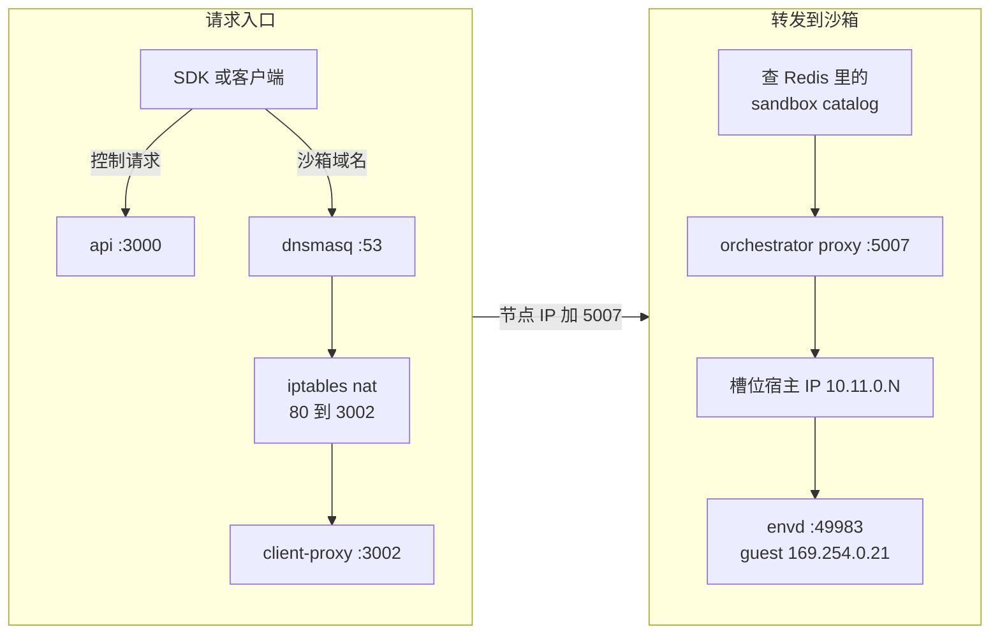
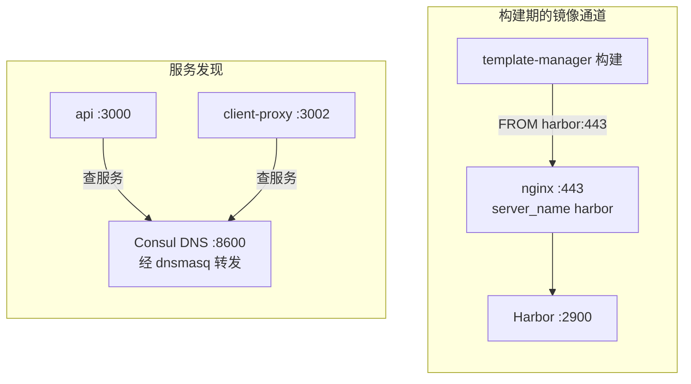

# 81 · 单机流量架构

> 上游的入口是三层云基础设施：Cloudflare 的通配 DNS、GCP 全局 HTTPS 负载均衡、集群内的 Traefik。
> 单机离线版一样都没有，却要保住同一套对外语义 —— 通配子域寻址、干净的 URL、内部服务动态寻址。
> 本篇讲它是怎么用 dnsmasq、iptables 与 nginx 三样宿主机原生工具把这套语义补回来的，以及补得不完整的地方在哪。
>
> **读者**：部署与运维工程师、要在私有环境复现这套部署的系统工程师。
> **预备**：[第 10 篇 §4](10-system-architecture.md#4-端口表)、
> [第 53 篇 §3](53-client-proxy-edge.md#3-域名解析从-host-头到-sandboxid-与端口)、[第 80 篇 §6](80-single-node-rpm.md#6-buildsh--s从空机器到可用集群)。
> **代码**：`e2b-deploy/build.sh`、`e2b-deploy/dep/start-client.sh`、`e2b-deploy/dep/nginx.conf`、
> `e2b-deploy/dep/harbor.cnf`、`e2b-deploy/dep/daemon.json`、`e2b-deploy/dep/.env`、
> `packages/shared/pkg/proxy/host.go`、`packages/client-proxy/internal/proxy/proxy.go`、
> `packages/orchestrator/internal/proxy/proxy.go`

---

## 0. 本篇要回答的问题

1. 上游用 Cloudflare + GCP LB + Traefik 做的三件事，单机各由谁接手？哪一件没有对应物？
2. 为什么必须在本机跑一个 dnsmasq，而不是直接改 `/etc/resolv.conf`？
3. 为什么 `80 → 3002` 的改道只能由 iptables 做，而不能由 DNS 或者「让代理监听 80」解决？
4. 为什么一个纯 HTTP 的 Harbor 前面要套一层自签证书的 nginx？谁在意这层 TLS？
5. SDK 创建沙箱与 SDK 连进沙箱，走的是不是同一条路？
6. 单机的端口取值与[第 10 篇](10-system-architecture.md#4-端口表)给出的上游取值差在哪里？

---

## 1. 上游的入口是什么，单机缺什么

先看要替代的对象。上游 2026.09 在 GCP 上的入口是三层串联，每层解决一个不同的问题
（Terraform 侧的细节在[第 63 篇 §4](63-gcp-terraform.md#4-网络负载均衡与-cloudflare)）：

**第一层，Cloudflare 做名字。** `iac/provider-gcp/nomad-cluster/network/main.tf` 里的
`cloudflare_record "a_star"` 建一条通配 A 记录 `*.<domain>`，指向 LB 的全局 IP。
沙箱的域名是 `<port>-<sandboxID>.<domain>` 这种动态子域，条数无上界，只有通配记录撑得住。
Cloudflare 同时替 GCP Certificate Manager 写域名校验记录（`cloudflare_record "dns_auth"`），
但 TLS 不在 Cloudflare 终止。

**第二层，GCP 全局 HTTPS LB 做终止与分流。** `google_compute_url_map "orch_map"` 按 Host 头分四路：
`api.<domain>` 到 api、`docker.<domain>` 到 docker-reverse-proxy、`nomad.<domain>` 到 Nomad、
`*.<domain>` 兜底到 `session` 后端也就是 client-proxy 的 3002。TLS 在
`google_compute_target_https_proxy` 上终止，后端一律是明文 HTTP。

**第三层，Traefik 做集群内路由。** `iac/modules/job-ingress/jobs/ingress.hcl` 跑一个
`traefik:v3.5` 容器，开 `--providers.nomad` 与 `--providers.consulcatalog`，
从 Nomad job 与 Consul 服务的 tag 里读路由规则。client-proxy 的服务 tag
（`iac/modules/job-client-proxy/jobs/client-proxy.hcl`）声明
`traefik.http.routers.client-proxy.rule=PathPrefix(/)` 且 `priority=100`，注释里写明这是兜底路由，
因为沙箱子域是动态的、写不进静态规则。

单机离线版没有其中任何一层：没有公网域名，就没有 Cloudflare；没有公网域名与可信 CA，
就签不出浏览器认的证书，也就没有 HTTPS LB；只有一台机器、一个 client-proxy 实例，
Traefik 那种「从服务目录里发现后端」的能力没有用武之地。`e2b-deploy/dep/deploy.sh` 提交的
job 只有 `redis`、`template-manager`、`edge`、`api` 四个，`ingress` 不在其中。

但要保住的语义有三条：

1. 沙箱的动态子域仍然要能寻址 —— SDK 生成的主机名格式是写死在 SDK 里的；
2. 用户不该手写端口 —— `http://` 就该走 80；
3. 组件之间仍然要按名字找人 —— Nomad 调度出来的地址是动态的。

三条分别落在三样东西上：dnsmasq 管「去哪台机器」，iptables 管「到了之后进哪个端口」，
Consul DNS 管「这个服务现在在哪」。nginx 是第四样，管的是另一件事：给一个纯 HTTP 的镜像仓库
套一层构建器认得的 TLS。下面逐个讲。

---

## 2. DNS 层：一个本地 DNS 总机

### 2.1 两条规则

`build.sh` 的 `install_e2b` 往主配置里追加一条：

```bash
if ! grep -q "address=/.e2b.app/127.0.0.1" /etc/dnsmasq.conf; then
    echo "address=/.e2b.app/127.0.0.1" >> /etc/dnsmasq.conf
    systemctl restart dnsmasq
fi
```

`dep/start-client.sh` 在启动客户端时写另一条，并把 dnsmasq 顶到 `/etc/resolv.conf` 首行：

```bash
sed -i '/^nameserver 127\.0\.0\.1$/d' /etc/resolv.conf
sed -i '1i nameserver 127.0.0.1' /etc/resolv.conf
grep -qxF 'server=/consul/127.0.0.1#8600' /etc/dnsmasq.d/consul.conf 2>/dev/null \
  || echo 'server=/consul/127.0.0.1#8600' >> /etc/dnsmasq.d/consul.conf
```

两条规则的动词不同，这是全套配置里最容易读错的一处。`address=` 是**自己应答**：
任何 `*.e2b.app` 的查询，dnsmasq 不问任何人，直接合成一条 A 记录返回 `127.0.0.1`。
`server=` 是**条件转发**：`*.consul` 的查询原样转给 `127.0.0.1:8600` 上的 Consul DNS，
把答案带回来。`address=` 后面的 IP 是「答案」，`server=` 后面的 `IP#端口` 是「去问谁」。
A 记录里没有端口字段，所以 `address=` 那条写不了端口 —— 这一点直接决定了第 3 节的存在。

三件事只有本地 DNS 服务能做，`/etc/resolv.conf` 一个都做不到：指定非标准端口
（`nameserver` 行永远打 53，而 Consul DNS 在 8600）、按后缀分流、本地合成解析结果。
`deploy-docs/07-single-node-traffic-architecture.md` 的 §3 把 glibc resolver 的行为
（顺序尝试、第一个正常应答即采纳、`MAXNS = 3`、不要加 `options rotate`）讲得很细，此处不重复。

### 2.2 代价

第一条代价是**单点**。`/etc/resolv.conf` 首行指向 dnsmasq 之后，整机所有走 glibc 的解析都压在它身上。
dnsmasq 一挂，后面那些公网 nameserver 会接管普通域名，但 `.e2b.app` 与 `.consul` 全废，
而且每次查询要先等首行超时几秒 —— 一个「能上网、内部全断、还慢」的半残状态，比彻底失败更难发现。

第二条代价是**易被覆盖**。NetworkManager、systemd-resolved、DHCP 客户端都可能在网络事件后重写
`/etc/resolv.conf`。`single-node-offline-deploy.md` §7 给的清理动作
（去重 `nameserver 127.0.0.1`、`sort -u` 去重 `consul.conf`）说明历史上这两个文件被重复追加过；
新版脚本已改成幂等写法，但「谁最后写 resolv.conf」这个竞争仍然存在。

第三条代价是**只在这台机器上成立**。dnsmasq 只服务本机。SDK 跑在别的机器上时，
`*.e2b.app` 在那台机器上解析不到，必须由使用者自己配 hosts 或 DNS；
仓库 `README.md` 因此把 `E2B_DOMAIN` 描述成「对应 client-proxy 3002 端口的域名」，
把这件事推给了部署者。

### 2.3 组件自己也要经过这条链

Nomad 的 job 用 docker driver 跑 api 与 edge，两者都写了同一对配置
（`iac/provider-gcp/nomad/jobs/api.hcl`、`edge.hcl` 的 `config` 块）：

```hcl
network_mode = "host"
dns_servers  = ["127.0.0.1"]
```

`network_mode = "host"` 让容器直接占用宿主的 3000 / 3002，省掉一层端口映射；
`dns_servers = ["127.0.0.1"]` 让容器内的解析也回到宿主的 dnsmasq —— 否则容器拿到的是 Docker 的
内嵌 DNS，`redis.service.consul`（`REDIS_URL` 的值）解析不了。两条配置是配套的：
只有在 host 网络模式下，容器里的 `127.0.0.1` 才是宿主的回环。

---

## 3. 改道层：iptables 的两条 REDIRECT

### 3.1 规则与为什么是两条

`build.sh` 在 `-s` 阶段写两条 nat 规则：

```bash
iptables -w -t nat -C PREROUTING -p tcp --dport 80 -j REDIRECT --to-port 3002 2>/dev/null \
|| iptables -w -t nat -A PREROUTING -p tcp --dport 80 -j REDIRECT --to-port 3002
iptables -w -t nat -C OUTPUT -p tcp -o lo --dport 80 -j REDIRECT --to-port 3002 2>/dev/null \
|| iptables -w -t nat -A OUTPUT -p tcp -o lo --dport 80 -j REDIRECT --to-port 3002
```

`-C || -A` 是幂等写法，脚本重跑不会叠加。要两条是因为本机发给自己的包不经过 PREROUTING：
`*.e2b.app` 被解析成 `127.0.0.1` 之后，跑在同一台机器上的 SDK 与压测脚本走的是回环，
只有 nat 表的 OUTPUT 链能拦到。单机部署里这类流量往往占一半以上，漏掉第二条的症状是
「外部访问正常、本机访问同一个域名连不上」。

### 3.2 为什么不能少这一层

**DNS 给不了端口。** A 记录的数据结构里没有端口字段；即便有，HTTP 客户端也只从 DNS 取 IP，
端口由 URL 的协议决定（`http://` → 80）。DNS 里能带端口的是 SRV 记录，而浏览器、curl 与
绝大多数 SDK 访问网址时根本不查 SRV。

**`server=` 那种写法救不了。** `server=/.e2b.app/127.0.0.1#3002` 的语义是「把 `.e2b.app` 的
DNS 查询转发给 `127.0.0.1:3002` 这个 DNS 服务器」，而 3002 上跑的是 HTTP 代理，不会说 DNS 协议。
Consul 那条 `server=` 能成立，是因为 8600 上确实有一个 DNS 服务器。

**让 client-proxy 直接监听 80 也不合适。** 80 是特权端口；更实际的是它与 nginx 的默认 server 冲突
（`dep/nginx.conf` 的第一个 `server` 块就 `listen 80`）。改端口这件事放在内核 nat 层，
比改代理配置更容易做成幂等、可重放的一行命令。

### 3.3 代价

**规则不持久。** iptables 规则在重启后消失，症状是「域名解析正常但连不上」。
`build.sh` 没有做保存与开机恢复，需要部署者自己 `iptables-save` 或写一个 systemd unit 重放这两条。

**nginx 的 80 实际上是拿不到流量的。** REDIRECT 发生在 nat 表，早于本地投递；
到达 80 的 TCP 连接在进入监听套接字之前目标端口就被改成了 3002。
`dep/nginx.conf` 里那个 `listen 80` 的默认 server 因此形同虚设，nginx 真正起作用的只有 443
那个 vhost。这不是故障，但排查 Harbor 或 e2b 访问异常时，「80 归谁」是个必须先厘清的问题。

**清表操作会带走它们。** `build.sh` 里有 `iptables -F` 的调用（当前被注释掉）。
`-F` 默认只清 filter 表，但任何 `iptables -t nat -F` 之后都必须重放这两条规则。
另有一类残留问题方向相反：orchestrator 为每个网络槽位写的规则不会随 netns 删除而消失，
`build.sh` 的 `purge_sandbox_iptables` 用 `iptables-save` 过滤加 `iptables-restore --noflush`
批量删除，注释里说明逐条 `iptables -D` 上万条要跑几小时。槽位规则本身属于
[第 35 篇 §4](35-sandbox-networking.md#4-复用一个槽位复位了什么没复位什么)。

---

## 4. 镜像层：nginx 443 与自签证书

### 4.1 为什么一个 HTTP 仓库需要 HTTPS 门面

`install_harbor` 把 Harbor 装成纯 HTTP：注释掉 `harbor.yml` 里整个 https 块
（`port: 443`、`certificate`、`private_key`），`hostname` 改成本机 IP，HTTP 端口从默认 80 改成 2900
—— 80 已经被 iptables 征用了。

问题出在拉基础镜像的一侧。模板构建时，`packages/orchestrator/internal/template/build/core/rootfs/rootfs.go`
在 `template.FromImage` 非空时调用 `oci.GetPublicImage()`，后者用 go-containerregistry 的
`name.ParseReference()` 解析镜像引用，再 `remote.Image()` 去拉。而 go-containerregistry 的
`name.Registry.Scheme()` 只在四种情况下用 http：显式 insecure、RFC1918 私网 IP
（`10/8`、`172.16/12`、`192.168/16`）、`localhost:` 前缀、`.local` / `.localhost` 后缀与回环地址；
其余一律 https。`dep/.env` 里的 `SERVER_IP` 是一个公网段地址，写成 `FROM <IP>:2900/...` 会被判成 https，
而 2900 上是明文 HTTP，握手直接失败。

于是有了 nginx：`dep/nginx.conf` 的第二个 server 块

```nginx
server {
    listen 443 ssl;
    server_name harbor;
    ssl_certificate     /etc/nginx/ssl/harbor.crt;
    ssl_certificate_key /etc/nginx/ssl/harbor.key;
    location / {
        proxy_pass http://127.0.0.1:2900;
        ...
    }
}
```

`client_max_body_size 2G` 在 http 块里，保证大镜像层推得上去。证书由 `install_nginx` 用
`dep/harbor.cnf` 现场签发：`CN = harbor`，`subjectAltName` 只有 `DNS.1 = harbor`，
`basicConstraints = critical, CA:TRUE`。SAN 只签了 `harbor` 这一个名字，意味着模板里必须写
`FROM harbor:443/...`，写 IP 会因为名字不匹配而校验失败。`harbor` 这个名字解析到本机这件事
脚本不做，需要在 `/etc/hosts` 里补一行。

### 4.2 三处信任点

自签证书要被三个不同的信任体系接受，`install_nginx` 与 `template-manager.hcl` 各管一部分：

| 信任点 | 位置 | 谁在用 |
|---|---|---|
| 系统 CA 库 | `/etc/pki/ca-trust/source/anchors/harbor-ca.crt` + `update-ca-trust extract` | Go 程序默认读系统信任库 |
| docker 证书目录 | `/etc/docker/certs.d/harbor:443/ca.crt` | docker daemon 对 `harbor:443` 的 pull / push |
| 进程环境变量 | `template-manager.hcl` 的 `SSL_CERT_FILE=/etc/docker/certs.d/harbor:443/ca.crt` | 兜底指定合体进程的信任根 |

三处并存有冗余，但方向不同：前两处是给两个不同的运行时用的，第三处是在系统信任库没生效时的保险。

### 4.3 另一条通路：docker daemon 直连 2900

组件镜像的推送走的是另一条路。`dep/deploy.sh` 把 `bin/*.Dockerfile` 构建成
`${REGISTRY_URL}/<name>`，而 `dep/.env` 里 `REGISTRY_URL=$SERVER_IP:2900/e2b-orchestration`，
然后 `docker push`。这条路不经过 nginx，靠的是 `dep/daemon.json` 的
`"insecure-registries": ["173.118.9.2:2900"]` —— docker daemon 被告知这个地址用明文。
注意这个文件里的 IP 是硬编码的，与 `.env` 里的 `SERVER_IP` 不是同一个值，换机器时两处都要改。

于是同一个 Harbor 有两个入口：

| 通路 | 客户端 | 地址 | 协议 | 信任来源 |
|---|---|---|---|---|
| 组件镜像推送 / 拉取 | docker daemon | `<SERVER_IP>:2900` | 明文 HTTP | `daemon.json` 的 insecure-registries |
| 模板基础镜像拉取 | template-manager 进程 | `harbor:443` | HTTPS，nginx 反代 | 系统 CA 库 / `SSL_CERT_FILE` |

还有一个连带后果，方向与本节相反：**有一条出口是 nginx 这一层兜不住的。**
`packages/shared/pkg/dockerhub/repository.go` 的 `GetRemoteRepository()` 按
`DOCKERHUB_REMOTE_REPOSITORY_URL` 是否为空二选一：非空时构造一个带凭据的远端仓库客户端，
为空时返回 `NoopRemoteRepository`，而后者的 `GetImage()` 直接 `remote.Image()` 去 docker.io 拉。
单机的 `dep/.env` 没有这一项，走的就是后一条分支。
在离线机房里这条路必然失败，而失败点在拉基础镜像的一瞬间，报的是网络错误而不是配置错误。
实际的约束因此是：模板的 `FROM` 只能写 Harbor 里已有的镜像，写 `FROM ubuntu:22.04`
这类隐含 docker.io 的引用会在构建中途失败。

---

## 5. 三类流量的完整链路

先看运行期的两类流量：控制请求直连 api，沙箱请求经 DNS 与 NAT 落到 client-proxy 再转到槽位。



第三类是构建期的镜像流量，它和服务发现一样不经过 3002：



### 5.1 控制流量：不经过 3002

一个常见的误解是「所有流量都从 80 进 3002」。控制流量不是。
SDK 侧的 `connection_config.py` 里 API 地址取 `E2B_API_URL`，没有时才回落到
`http://api.{domain}`；而 `single-node-offline-deploy.md` §5 与 `README.md` 都明确要求把
`E2B_API_URL` 设成 `http://<SERVER_IP>:3000`，也就是 api job 的 `API_PORT`。
这条路直连 api 容器占用的宿主端口，不经过 dnsmasq 的 `address=` 规则，也不经过 iptables 改道。

这不只是习惯问题。`packages/shared/pkg/proxy/host.go` 的 `parseHost()` 只接受
「最左子域按 `-` 切开、第一段是端口、第二段是沙箱 ID」这一种形式，长度不足 2 段就返回
`ErrInvalidHost`。`api.e2b.app` 的最左子域是 `api`，切出来只有一段，会被 client-proxy 直接拒掉。
client-proxy 也没有第二种目的地：它的转发目标只能是「某个沙箱所在节点的 5007」，
代码里不存在「识别为控制请求后转给 api」的分支。
所以在单机部署里，`http://api.e2b.app` 这个上游写法是不通的 —— 必须用 `E2B_API_URL`。

这一条与仓库里的 `deploy-docs/07-single-node-traffic-architecture.md` §5.1 相左。
那一节把控制流量画成「DNS 解析到 127.0.0.1 → 80 → iptables OUTPUT 改到 3002 →
代理识别为控制请求 → 查 `api.service.consul` → 转发给 api」。
按上面两处代码，这条链在第三跳就断了。本书采用代码一侧的结论；
同一份文档的其余部分（§3 的 resolver 行为、§4 的两条 REDIRECT、§8 的持久化问题）与代码一致，
可以照用。之所以值得点名，是因为这个差异会改变排障的第一步：
`E2B_API_URL` 配错时该查的是 api 的 3000 端口是否在监听，而不是 dnsmasq 与 iptables。

api 收到请求后的动作（鉴权、配额、选节点、调 orchestrator 的 gRPC 5008）与上游一致，
见[第 17 篇 §5](17-sandbox-create-api.md#5-放置与失败重试)。单机的特殊之处只有一条：
`deploy.sh` 结尾把 `base_v1` 档位的 `concurrent_instances` 与 `max_length_hours`
都改成 10000，等于关掉配额。

### 5.2 沙箱流量：五跳

SDK 要连沙箱时，`connection_config.py` 的 `get_host()` 拼出
`{port}-{sandbox_id}.{sandbox_domain}`，默认端口是 `envd_port = 49983`，
域名来自 `E2B_DOMAIN`（默认 `e2b.app`）。api 在没有远端集群时不返回沙箱域名
（`packages/api/internal/handlers/sandbox_get.go` 把 `Domain` 置为 `nil`），SDK 用本地默认值。
接下来五跳：

1. **DNS**：`49983-<sandboxID>.e2b.app` → dnsmasq 的 `address=` 规则 → `127.0.0.1`。
2. **改道**：客户端按 `http://` 连 80，nat 表把目标端口改成 3002。
3. **client-proxy 解析**：`packages/client-proxy/internal/proxy/proxy.go` 用
   `GetTargetFromRequest()` 从 Host 头取出沙箱 ID 与端口，再用 `catalogResolution()`
   到 sandbox catalog（`SANDBOX_STORAGE_BACKEND=redis`，Redis 由 `redis` job 提供）查节点 IP；
   查不到且开了自动恢复时，走 `handlePausedSandbox()` 让 api 先把沙箱拉起来
   （[第 55 篇 §5](55-sandbox-catalog-and-routing.md#5-resume-on-connect让访问本身唤醒沙箱)）。
   拿到节点 IP 后拼出目标 `http://<nodeIP>:5007` —— 5007 是文件里的常量 `orchestratorProxyPort`，
   与 orchestrator 侧 `internal/cfg/model.go` 的 `ProxyPort` 默认值一致。单机上这个 IP 就是本机。
4. **orchestrator proxy**：`packages/orchestrator/internal/proxy/proxy.go` 再解析一次同样的 Host 头，
   从沙箱表里取到 `sbx.Slot`，目标是 `http://<slot.HostIPString()>:<port>`。
   槽位宿主 IP 由槽位号推导：`internal/sandbox/network/slot.go` 从
   `defaultHostNetworkCIDR = "10.11.0.0/16"` 里按下标取第 N 个地址，掩码 `/32`。
5. **进 guest**：宿主到 `10.11.0.N` 的路由指向该槽位的 veth；netns 内的 nat 规则
   `PREROUTING -i eth0 -d <hostIP> -j DNAT --to 169.254.0.21` 把它改写成 guest 地址，
   `169.254.0.21` 是 `fc/process.go` 通过内核 `ip=` 参数配给 guest 的地址。
   49983 上是 envd（`packages/shared/pkg/consts/envd.go` 的 `DefaultEnvdServerPort`）。

有一处单机特有的退化值得记下：`edge.hcl` 把 `ENVIRONMENT` 硬编码成 `dev`，
而 `GetTargetFromRequest(env.IsLocal())` 的 `env.IsLocal()` 只在 `ENVIRONMENT == "local"` 时为真。
因此按 `E2b-Sandbox-Id` / `E2b-Sandbox-Port` 请求头寻址的那条旁路是关掉的，
单机上只有子域名一种寻址方式。

### 5.3 构建期：拉基础镜像

模板构建由 api 转给 template-manager，而单机把 orchestrator 与 template-manager
合成了一个进程（`template-manager.hcl` 的 `ORCHESTRATOR_SERVICES = "orchestrator,template-manager"`，
监听 5008）。构建时的出口流量只有一条与本篇相关：`rootfs.go` 按 `FromImage` 去拉基础镜像，
经 §4 描述的 `harbor:443` → nginx → 2900 到 Harbor。

`template-manager.hcl` 里 `ARTIFACTS_REGISTRY_PROVIDER` 取 `dep/.env` 的值 `Local`，
对应 `packages/shared/pkg/artifacts-registry/registry_local.go`：它的 `GetImage()` 用
go-containerregistry 的 `daemon.Image()` 从**本机 docker daemon** 取镜像，完全不走网络。
这条分支只在 `FromImage` 为空、即镜像由用户先推到仓库再按 `templateID:buildID` 取用时才走到。
两条分支的差别值得留意：走 `FromImage` 时流量到 Harbor，走 artifacts registry 时流量到本地
docker daemon，两者的失败症状完全不同。上游那条经 docker-reverse-proxy 推镜像的路
（[第 57 篇 §6](57-docker-reverse-proxy.md#6-部署)）在单机没有部署 —— `deploy.sh` 的 job 列表里没有它。

### 5.4 内部互访：不经过公共入口

api、client-proxy、template-manager 之间的调用一律按 `*.service.consul` 解析后直连：
`REDIS_URL="redis.service.consul"`、`TEMPLATE_MANAGER_HOST="template-manager.service.consul:5008"`。
解析链是 glibc → dnsmasq → `server=/consul/` → Consul DNS 8600 → 注册表里的当前地址。
这条链不碰 80 与 3002。它替代的正是上游 Traefik 从 Consul catalog 读服务的那部分能力，
区别在于 Traefik 拿服务信息是为了**代理**，而这里拿到地址是为了**直连**。

---

## 6. 沙箱的出站流量

进站讲完，出站是另一半。单机没有为沙箱出站做任何额外配置，走的完全是 orchestrator 自带的那套
（`internal/sandbox/network/network.go` 的 `CreateNetwork()`）：netns 内一条
`POSTROUTING -o eth0 -s 169.254.0.21 -j SNAT --to <hostIP>` 把 guest 地址换成槽位宿主 IP，
出到宿主后再由 `POSTROUTING -s <hostCIDR> -o <defaultGateway> -j MASQUERADE` 换成宿主出口地址。
`defaultGateway` 是 `host.go` 在进程启动时探测出来的默认路由网卡。
`dep/.env` 设了 `ALLOW_SANDBOX_INTERNET=true`，出站默认放行；
默认拒绝的网段与用户态 TCP 防火墙的机制在[第 35 篇 §5](35-sandbox-networking.md#5-tcp-防火墙进程)。

对单机部署的实际影响有两点。其一，沙箱的出站源地址是宿主的地址，
在只放行特定源 IP 的内网里这是好事，但也意味着所有沙箱在对端看来无法区分。
其二，离线环境里沙箱通常没有外网可去，`ALLOW_SANDBOX_INTERNET=true` 的实际效果是让沙箱能访问
**内网**（包括宿主上的 Harbor、MinIO），这在收紧安全边界时需要重新评估。

---

## 7. 两组对照表

### 7.1 与上游入口的对照

| 职责 | 上游 2026.09（GCP） | 单机离线版 | 丢掉了什么 |
|---|---|---|---|
| 通配子域寻址 | Cloudflare `*.<domain>` A 记录 | dnsmasq `address=/.e2b.app/127.0.0.1` | 只在本机有效，远端客户端要自己配解析 |
| TLS 终止 | GCP target HTTPS proxy + Certificate Manager | 无（沙箱与 api 都走明文 HTTP） | 传输加密与证书轮换 |
| 按 Host 分流 | url map 四条 host rule | 无分流：api 直连 3000，其余进 3002 | `api.<domain>` / `docker.<domain>` 这两个上游入口名 |
| 端口归一 | LB 监听 443，后端各自端口 | iptables REDIRECT 80 到 3002 | 443 让给了 Harbor 的 nginx |
| 集群内路由 | Traefik，读 Nomad / Consul tag | 无 ingress job，client-proxy 直接暴露 | 多实例负载均衡与灰度 |
| 服务发现 | Consul + Traefik provider | Consul DNS 经 dnsmasq 转发 | 无（这一层基本等价） |
| 限流与防护 | Cloud Armor 四条策略 | 无 | 全部 |
| 镜像入口 | docker-reverse-proxy + Artifact Registry | nginx 443 反代 Harbor 2900 | 按 token 鉴权的推送通道 |

Kubernetes 形态的对应物见[第 78 篇 §5](78-helm-k8s-deployment.md#5-与-nomad-形态的概念对照)：
那份 Chart 里同样没有 Ingress 资源，暴露方式留给使用者。

### 7.2 与第 10 篇端口表的对照

[第 10 篇 §4](10-system-architecture.md#4-端口表) 给的是上游在 GCP 上的取值。单机的取值来自
`dep/.env`，几处不同：

| 端口 | 上游 2026.09 | 单机离线版 | 说明 |
|---|---|---|---|
| api REST | 50001 | 3000 | `API_PORT`，SDK 的 `E2B_API_URL` 直连它 |
| api gRPC | 5009 | 5009 | 相同 |
| client-proxy 流量 | 3002 | 3002 | 相同；单机由 iptables 从 80 导入 |
| client-proxy 健康 | 3001 | 3003 | `EDGE_HEALTH_PORT`；3001 在单机给了 `EDGE_API_PORT` |
| orchestrator gRPC | 5008 | 5008 | 与 template-manager 同进程同端口 |
| orchestrator proxy | 5007 | 5007 | client-proxy 里的硬编码常量 |
| envd | 49983 | 49983 | SDK 侧同名常量 `envd_port` |
| ingress | 8800 / 8900 | 不部署 | 没有 Traefik |
| docker-reverse-proxy | 5000 | 不部署 | 镜像推送改走 docker daemon 直连 2900 |
| 镜像仓库 | Artifact Registry（云服务） | 2900（Harbor）+ 443（nginx） | 两个入口，见 §4.3 |
| Consul DNS | 8600 | 8600 | 单机由 dnsmasq 转发，不直接进 resolv.conf |

完整的端口、路径与存储键清单在[第 91 篇 §1](91-ports-paths-keys.md#1-进程端口)。

---

## 8. 小结

- 上游的入口是 Cloudflare 通配 DNS、GCP 全局 HTTPS LB、Traefik 三层；单机离线版三层全无，
  用 dnsmasq、iptables、nginx 三样宿主机原生工具补出同一套对外语义。
- dnsmasq 的两条规则动词不同：`address=/.e2b.app/127.0.0.1` 是自己合成 A 记录，
  `server=/consul/127.0.0.1#8600` 是把查询转给 Consul DNS。前者给不了端口，这是 iptables 存在的原因。
- `80 → 3002` 要写两条 REDIRECT：PREROUTING 管外来流量，OUTPUT 加 `-o lo` 管本机自访问，
  因为回环流量不经过 PREROUTING。规则不持久，重启后需重放。
- nginx 存在的唯一理由是 go-containerregistry 的 `name.Registry.Scheme()` 对非私网、非回环地址
  一律用 https，而 Harbor 是明文 2900。证书 SAN 只签了 `harbor`，因此模板必须写 `FROM harbor:443/...`。
- 三类流量走三条不同的路：控制流量由 `E2B_API_URL` 直连 api 的 3000，不经过 3002
  （`parseHost()` 会拒掉 `api.e2b.app`，client-proxy 也没有转给 api 的分支；
  这一点与 `deploy-docs/07` §5.1 的说法相左，见 §5.1）；
  沙箱流量走 DNS → 80 → 3002 → 5007 → 槽位宿主 IP → guest 49983；
  构建期拉镜像走 `harbor:443` → nginx → 2900。
- 组件之间不走公共入口：`*.service.consul` 经 dnsmasq 转到 Consul DNS 后直连。
  api 与 edge 的容器用 `network_mode = "host"` 加 `dns_servers = ["127.0.0.1"]` 才能用上这条链。
- 单机的两处退化：`edge.hcl` 把 `ENVIRONMENT` 定为 `dev`，请求头寻址被关掉，只剩子域名寻址；
  `dep/nginx.conf` 那个 `listen 80` 的默认 server 被 REDIRECT 抢在前面，实际收不到流量。
- 沙箱出站不做特殊处理：netns 内 SNAT 到槽位宿主 IP，宿主再 MASQUERADE 到默认网卡，
  在离线环境里等价于「放行内网」。
- nginx 兜不住 docker.io 这条出口：`DOCKERHUB_REMOTE_REPOSITORY_URL` 未配时
  `GetRemoteRepository()` 返回 `NoopRemoteRepository`，它直连 docker.io，
  离线必失败，所以模板的 `FROM` 只能写 Harbor 里已有的镜像。

---

## 延伸阅读 / 下一篇

- [第 80 篇 §5](80-single-node-rpm.md#5-buildsh--i把宿主机改造成依赖环境)：本篇讲的这些配置由哪一步写入。
- [第 53 篇 §5](53-client-proxy-edge.md#5-转发交给共享代理库)、
  [第 36 篇 §2](36-orchestrator-proxy-and-envd-client.md#2-通道一orchestrator-里的沙箱代理)：两跳代理的内部实现。
- [第 35 篇 §2](35-sandbox-networking.md#2-建立一个槽位createnetwork-的完整步骤)：槽位、netns 与出站过滤。
- [第 63 篇 §4](63-gcp-terraform.md#4-网络负载均衡与-cloudflare)、[第 64 篇 §3](64-nomad-jobs.md#3-api-节点池上的-job)：被替代的那一套。
- [第 82 篇 §6](82-host-kernel-nbd-hugepages.md#6-另外四项前提)：宿主侧的其余前置条件。
- `e2b-infra/deploy-docs/07-single-node-traffic-architecture.md`：DNS 与 iptables 的逐条讲解、
  分层验证命令与故障模式速查表，本篇不重复。
- `e2b-infra/single-node-offline-deploy.md` §7：重复追加 `resolv.conf` / `consul.conf` 的清理方法。
