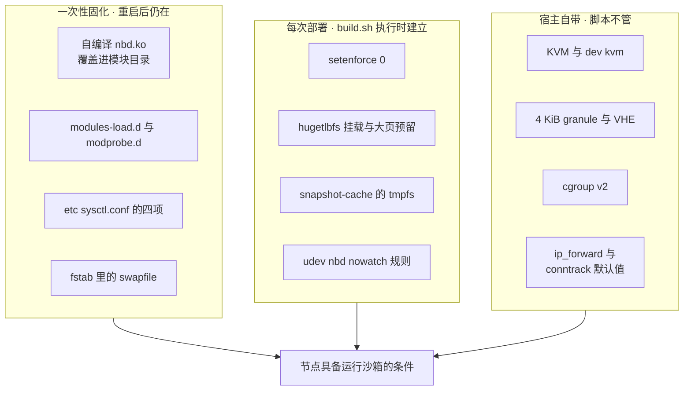

# 82 · 宿主内核要求与调优

> 沙箱不是容器：orchestrator 直接向内核要 KVM、NBD 设备、HugeTLB 页、userfaultfd 与 netns。
> 这些能力在上游由一张 GCP 节点镜像固化，在单机离线版里散落在几个脚本和一次手工的模块固化里。
> 本篇把它们收拢成一张清单，并说明每一项缺失时看到的是什么现象。
>
> **读者**：部署与运维工程师、要在自有硬件上复现这套系统的人。
> **预备**：[第 68 篇 · aarch64 与 x86 的虚拟化差异](68-aarch64-virtualization-differences.md)、
> [第 33 篇 · NBD 与 rootfs](33-nbd-and-rootfs.md)、[第 80 篇 · 部署形态三：单机离线 RPM](80-single-node-rpm.md)。
> **代码**：`e2b-deploy/dep/init-client.sh`、`e2b-deploy/dep/start-client.sh`、`e2b-deploy/build.sh`、
> `iac/provider-gcp/nomad-cluster/scripts/start-client.sh`、`packages/orchestrator/internal/sandbox/nbd/pool.go`

---

## 0. 本篇要回答的问题

1. 一台宿主要具备哪些内核能力，沙箱才跑得起来？每一项缺失时的现象是什么？
2. `nbds_max` 为什么就是这台节点的沙箱并发上限？单机离线版为什么要自己编译 nbd 模块、怎么把它固化住？
3. 大页预留的算法是什么？写 `/proc/sys/vm/nr_hugepages` 在 aarch64 上隐含了什么假设，改写
   `hugepages-2048kB` 解决了哪一半问题？
4. 节点初始化脚本里的 sysctl 与 ulimit 各自防住什么故障？哪些本该配的没有配？
5. SELinux、cgroup v2、userfaultfd 的权限门槛、时钟，这几项非功能前提分别由谁保证？

---

## 1. 宿主是一个配置项

一台运行沙箱的节点上，orchestrator 是以 `raw_exec` 直接跑在宿主上的普通进程
（`e2b-deploy/dep/template-manager.hcl` 的 `driver = "raw_exec"`），Firecracker 是它的子进程。
两者之间没有容器镜像这一层，也就没有「把依赖打进镜像」这条退路：guest 的内存来自宿主的
HugeTLB 池，rootfs 来自宿主的 `/dev/nbdX`，缺页由宿主的 userfaultfd 送到 orchestrator，
网络来自宿主的 netns 与 iptables。**宿主内核的配置，就是这套系统的一部分配置。**

上游把这件事收敛在两处：一张用 Packer 构建的节点镜像
（`iac/provider-gcp/nomad-cluster-disk-image/main.pkr.hcl`），和实例启动时执行的
`iac/provider-gcp/nomad-cluster/scripts/start-client.sh`。节点是一次性的：镜像里配好，
开机跑一遍脚本，节点用完销毁。**单机离线版没有这个模型**：机器是长期存在的物理机，
可能还跑着别的业务，脚本要能反复执行而不叠加副作用，个别步骤甚至要退化成一次性的手工固化。
[第 80 篇 §6](80-single-node-rpm.md#6-buildsh--s从空机器到可用集群)讲整体安装流程，本篇只讲其中与内核能力有关的那一部分。

下面这张表是全篇的骨架。后面各节展开其中需要解释的行。

| 能力 | 为什么需要 | 上游怎么保证 | 单机离线版怎么保证 | 缺失时的现象 |
|---|---|---|---|---|
| KVM 与 `/dev/kvm` | Firecracker 靠它建 VM 与 vCPU | GCP 实例开嵌套虚拟化，镜像自带 | `e2b-infra/README.md` 前提：「host 内核及 BIOS 需开启虚拟化支持」，无脚本检查 | FC 进程起不来，表现为 `configured fc` 阶段超时 |
| nbd 模块与 `nbds_max` | 每台走 NBD 路径的沙箱占一个 `/dev/nbdX` | `start-client.sh` 的 `modprobe nbd nbds_max=4096` | 自编译模块 + `modules-load.d` / `modprobe.d` 固化，`nbds_max=512` | 模块未加载时 orchestrator 报 `NBD module not loaded`；设备耗尽时创建沙箱静默变慢 |
| nbd 设备的 udev `nowatch` | 阻止 inotify 监听设备变更事件 | `start-client.sh` 写 `97-nbd-device.rules` | 同一份规则，脚本保留 | 高并发挂载 / 卸载时 udev 事件风暴，创建沙箱变慢 |
| 2 MiB HugeTLB 预留与超售 | guest 内存以 2 MiB 大页映射 | `start-client.sh` 按内存比例写 `nr_hugepages` | 同一算法，写入路径按大页档位修正 | FC 拿不到大页，machine-config 阶段失败 |
| 宿主 4 KiB granule | `hugepages-2048kB` 这一档要存在且是默认档 | x86 只有 4 KiB granule，不成为问题 | 未检查，靠 openEuler aarch64 默认 4 KiB granule | 大页池建不起来或档位对不上，同上 |
| `vm.max_map_count` 等 sysctl | 大量 mmap 与 uffd 注册 | 镜像 + `start-client.sh` | `start-client.sh` 运行时写，`init-client.sh` 持久化写 | 沙箱数上到一定量后 mmap 失败 |
| `net.ipv4.ip_forward` | 沙箱出网要经宿主转发 | 仓库未设，靠镜像默认值 | 仓库未设，靠宿主已有 docker 打开 | 包在路由后被丢弃，沙箱不能出网 |
| `net.netfilter.nf_conntrack_max` | 每条沙箱连接一个 conntrack 条目 | 节点镜像提到 2097152 | 未设置，用发行版默认值 | 表满后新连接间歇性失败 |
| cgroup v2 | 上游用它做沙箱记账 | 镜像自带 | ARM 适配版已不再强制要求 | 记账列恒为 0，不影响沙箱运行 |
| userfaultfd 可用且不受权限限制 | 内存按需从快照拉取 | 进程以 root 运行 | 同上；宿主内核需含 uffd 支持 | FC 建 uffd 失败，恢复路径直接报错 |
| SELinux 非 enforcing | 未适配的策略会挡住 nbd / netns / hugetlbfs | 节点镜像不开 SELinux | `build.sh -i` 执行 `setenforce 0` | 各类权限拒绝，故障点分散、难定位 |
| 时钟同步 | 对象存储签名、证书、集群心跳 | 云平台保证 | 未纳入脚本 | 上传快照被拒、证书校验失败 |

---

## 2. KVM 与 `/dev/kvm`

这一项是唯一一个「有就是有、没有就完全跑不起来」的前提，反而最少被写进脚本。
仓库里只有 `packages/orchestrator/cmd/smoketest/smoke_test.go` 在 `/dev/kvm` 不存在时跳过测试；
生产路径上没有任何一处提前探测它，Firecracker 打开 `/dev/kvm` 失败的错误会以「FC 进程没起来」
的形式浮现在 orchestrator 的启动等待逻辑里。

`e2b-infra/README.md` 的前提清单把它写成一句话：「host 内核及 BIOS 需开启虚拟化支持」。
同一份清单还列了 runc ≥ 1.0.2、docker ≥ 25.0.3、containerd ≥ v1.7.13 ——
这三项与沙箱运行时无关，是模板构建期拉取和解包 OCI 镜像用的（[第 74 篇 §1](74-template-build-on-arm.md#1-架构假设写在哪几个地方)）。
把它们和 KVM 列在一起容易造成误解：**KVM 是运行沙箱的前提，容器运行时是构建模板的前提**，
两者在单机形态下恰好落在同一台机器上。

在 aarch64 上还多一条与 x86 不同的检查：KVM 必须运行在 VHE 模式。
`HDBSS_KUNPENG950_KERNEL_6.6.0_515.md` 记录了在鲲鹏 950 上的验证方式 ——
`dmesg | grep -Ei 'kvm.*VHE.*initialized'` 应打印 `VHE mode initialized successfully`。
该文档同时确认目标内核编译了 `CONFIG_VIRTUALIZATION=y`、`CONFIG_KVM=y`。
VHE（Virtualization Host Extensions）让宿主内核直接运行在 EL2，KVM 不必在 EL1 与 EL2 之间反复切换；
没有它时 KVM 走 nVHE 路径，可用特性与开销都不同。对本篇而言它只是一条可执行的验收项，
aarch64 与 x86 在 KVM 接口上的其余分叉见[第 68 篇 §1](68-aarch64-virtualization-differences.md#1-一套接口四处分叉)。

---

## 3. NBD：设备号就是并发上限

### 3.1 `nbds_max` 与沙箱数的关系

orchestrator 启动时读 `/sys/module/nbd/parameters/nbds_max` 决定设备池大小
（`packages/orchestrator/internal/sandbox/nbd/pool.go` 的 `getMaxDevices()`），
文件不存在时返回 `ErrNBDModuleNotLoaded`。每台走 NBD 路径的沙箱在
`internal/sandbox/sandbox.go` 里通过 `rootfs.NewNBDProvider()` 取走一个设备号，
所以 `nbds_max` 是一个硬上限。它在模块加载时确定，运行时改不了。

上游用 4096，CI 里用 256（`.github/workflows/pr-tests.yml`），单机离线版用 512。
超出之后的行为不是报错而是变慢：`getFreeDeviceSlot()` 返回 `NoFreeSlotsError`，
`Populate()` 每 50 ms 重试、每 100 次失败打一条警告，而创建路径上的 `GetDevice()`
一直阻塞到有槽位或 context 取消。诊断这类问题要靠 `ls /dev/nbd* | wc -l` 与
`ls /sys/block/nbd*/pid` 的计数，而不是错误日志。这条上限与内存上限的比较在
[第 33 篇 §8](33-nbd-and-rootfs.md#8-上限设备号还是内存) 里算过：多数配置下先撞上的是内存。
512 这个值把设备号上限压到了内存上限之前，需要更高并发时它是第一个要动的参数。

### 3.2 为什么要自己编译模块，以及怎么固化

在上游的模型里加载模块只是一行 `modprobe nbd nbds_max=4096`，ARM 适配版补丁后的
`iac/provider-gcp/nomad-cluster/scripts/start-client.sh` 也原样保留了这一行。
单机离线版的部署脚本 `e2b-deploy/dep/start-client.sh` 与 `init-client.sh`
把这一行删掉了，只留下一条注释指向手册。原因有两层：

- **重复执行的问题。** 脚本要求幂等，而模块已加载时再 `insmod` 会报
  `could not insert module nbd.ko: File exists`；已有 nbd 设备在用时 `rmmod` 又会失败。
  加载动作天然只该做一次，不适合放在每次部署都跑的脚本里。
- **模块本身是定制的。** 目标机上用的是自行编译的 `nbd.ko`，`nbds_max` 默认 512。

固化的做法记在 `single-node-offline-deploy.md` §0.2，三步：把编译好的 `nbd.ko`
覆盖进 `/lib/modules/$(uname -r)/kernel/drivers/block/`（原版备份成 `.orig`），
`depmod -a` 刷新依赖；`/etc/modules-load.d/nbd.conf` 写一行 `nbd` 让开机加载；
`/etc/modprobe.d/nbd.conf` 写 `options nbd nbds_max=512` 让加载时带上参数。
这套做法把「一次性动作」和「每次开机的动作」分开，代价是引入了三个只在这台机器上成立的隐含条件：

**第一，vermagic 必须与运行内核完全一致。** `insmod` 严格校验模块的 vermagic 等于
`uname -r`，不一致直接 `Invalid module format`。目标机上的串是
`6.6.0_6.6.0_515-uffd_copy_open_tree`，换内核就要在新内核上重新编译。

**第二，内核升级会让固化静默失效。** 新内核的模块目录里放的是发行版原版 `nbd.ko`，
开机照样自动加载、`nbds_max` 也照样是 512 —— 因为 `modprobe.d` 的参数与模块版本无关。
从设备数上完全看不出异常，跑的却已经是原版模块。手册因此要求内核变更后用 `sha256sum`
比对，而不是只看 `ls /dev/nbd* | wc -l`。这是全套部署里最隐蔽的一处退化。

**第三，模块的压缩形态。** 目标机的模块是未压缩的 `.ko`；若某台机器上原版是
`nbd.ko.xz` 或 `nbd.ko.zst`，覆盖前要先把压缩原版移走，否则目录里同时存在两个候选模块。

### 3.3 udev 的 `nowatch`

三份脚本 —— 上游的 `start-client.sh`、ARM 适配版的 `.github/actions/host-init/init-client.sh`、
单机离线版的 `dep/init-client.sh` —— 都写同一条 udev 规则：

```text
ACTION=="add|change", KERNEL=="nbd*", OPTIONS:="nowatch"
```

默认情况下 udev 会对块设备加 inotify 监听，设备一有变更就产生 `change` 事件。
NBD 设备在沙箱创建与销毁时频繁地连接、断开、改大小，每一次都触发一轮事件与规则匹配。
脚本注释里给的引用是内核邮件列表上关于这一行为的讨论。这条规则是少数几处
**上游与单机离线版一字不差**的宿主配置，因为它与设备数量、内存大小、架构都无关。

---

## 4. 大页：预留算法与 aarch64 上的一个假设

### 4.1 预留算法

`init-client.sh` 与 `start-client.sh` 里各有一份完全相同的大页预留逻辑，
`build.sh -s` 会先后各跑一次。算法四步：

```text
保留给普通页的内存 = clamp( max(4 GiB, MemTotal × 16%), 上限 42 GiB )
可用于大页的内存   = MemTotal - 保留值，取偶数 MiB
页数               = 可用内存 / Hugepagesize
其中 20% 写 nr_hugepages（常驻预留），80% 写 nr_overcommit_hugepages（超售上限）
```

三处设计值得说明。**一是为什么在启动早期做。** 脚本注释写得很直白：趁内存还没碎片化时
先把连续的 2 MiB 物理页凑出来；晚了就凑不齐。同样的理由使 `build.sh -d` 停服时
故意不释放大页池，只打印一行提示，要回收得显式执行 `build.sh --purge-hugepages`。
**二是二八分。** 常驻部分在监控里表现为「已用内存」，是实打实划走的；超售部分只是上限，
用到时才向内核要，要不到就失败。这个比例在上游是 Terraform 变量
`BASE_HUGEPAGES_PERCENTAGE`，ARM 适配版把它写死成 20。
**三是幂等性。** `echo N > nr_hugepages` 是绝对赋值不是累加，N 只由 `MemTotal` 决定，
所以跑两次写的是同一个值。

`purge_hugepages()` 里有一处值得注意的正确性说明：归零 `nr_hugepages`
只回收空闲页，被运行中的沙箱占用的大页内核不会抽走，所以它对在跑的沙箱是安全的；
顺序上先关 `nr_overcommit_hugepages` 再归零常驻池，否则归零过程中可能又冒出 surplus 页。

### 4.2 写哪个文件：上游的假设与 ARM 的修正

上游写的是 `/proc/sys/vm/nr_hugepages`，并且把页大小写死成 `hugepage_size_in_mib=2`。
这两件事在 x86_64 上是同一件事：只有 4 KiB 一种 granule，默认 HugeTLB 档位必然是 2 MiB，
`/proc/sys/vm/nr_hugepages` 操作的就是 2 MiB 池。

在 arm64 上它们是两件事。`/proc/sys/vm/nr_hugepages` 操作的是**默认档位**的池，
而默认档位随 granule 变：4 KiB granule 下是 2 MiB，64 KiB granule 下是 512 MiB
（[第 68 篇 §3](68-aarch64-virtualization-differences.md#3-页大小与大页)）。
ARM 适配版在 `.github/actions/host-init/init-client.sh` 里把两处写入换成了显式路径：

```bash
echo $base_hugepages          >/sys/kernel/mm/hugepages/hugepages-2048kB/nr_hugepages
echo $overcommitment_hugepages >/sys/kernel/mm/hugepages/hugepages-2048kB/nr_overcommit_hugepages
```

这是这份脚本在 ARM 补丁里唯一的实质性改动（其余是 swapfile 幂等化与产物来源从 GCS 换成本地文件）。
它解决的是「写进了错误的池子」这一半问题：现在无论默认档位是什么，写的都是 2 MiB 池。
它没有解决另一半 —— **`hugepages-2048kB` 这个目录必须存在**。两种 granule 都有 2 MiB 这一档，
所以目录通常在；但页数的计算仍用 `Hugepagesize` 这个**默认档位**的值，
在 64 KiB granule 的宿主上会按 512 MiB 算出页数、再写进 2 MiB 池，数量差 256 倍。
把两件事合起来看，这套脚本的实际前提仍是「宿主是 4 KiB granule」。

单机离线版的 `dep/init-client.sh` 走了第三条路：它仍写 `/proc/sys/vm/nr_hugepages`，
但把页大小从 `/proc/meminfo` 的 `Hugepagesize` 读出来，并且直接用 KiB 做除法 ——
注释说明了理由：先折算成 MiB 会在大页小于 1 MiB 的配置下取整成 0，除法直接崩掉。
也就是说它让「算页数」和「写哪个池」始终一致，代价是在 64 KiB granule 的宿主上
会去预留 512 MiB 的大页，而 orchestrator 要的是 2 MiB。

需要 2 MiB 这一点是硬编码的：`internal/sandbox/fc/client.go` 的 `setMachineConfig()`
在 `hugePages` 为真时把 machine-config 设成 `models.MachineConfigurationHugePagesNr2M`，
`packages/shared/pkg/storage/header/diff.go` 的 `HugepageSize = 2 << 20` 也是同一个数
（[第 32 篇 §5](32-memory-prefetch-and-hugepages.md#5-大页改变了哪些量)）。

### 4.3 一组可执行的验收命令

```bash
getconf PAGESIZE                                   # 期望 4096，即宿主 4 KiB granule
ls /sys/kernel/mm/hugepages/                       # 期望含 hugepages-2048kB
awk '/^Hugepagesize:/{print}' /proc/meminfo        # 期望 2048 kB
grep -E 'HugePages_(Total|Free|Rsvd|Surp)' /proc/meminfo
mountpoint -q /mnt/hugepages && echo hugetlbfs ok
```

前三条互相印证：`getconf PAGESIZE` 给出 granule，第二条确认 2 MiB 档位存在，
第三条确认它同时是默认档位 —— 三条都成立时，上游写法与 ARM 写法才等价。

### 4.4 `/mnt/hugepages` 挂给谁用

三份脚本都把 hugetlbfs 挂到 `/mnt/hugepages`，但在上游 2026.09 的 Go 代码里
grep 不到任何一处引用这个路径。Firecracker 用的是匿名的 `MAP_HUGETLB` 映射，
不经过 hugetlbfs 的文件接口，所以在 Nomad 形态下这个挂载点实际是空转的。
它有用的地方是 Kubernetes 形态：ARM 适配版的 `helm/templates/orchestrator.yaml` 与
`helm/templates/template-manager.yaml` 把 `/mnt/hugepages` 以 hostPath 挂进容器
（[第 78 篇 §3.3](78-helm-k8s-deployment.md#33-orchestratorprivileged-daemonset-加十个-hostpath)）。保留这个挂载的代价很低，
但它会让人误以为大页是「挂上去的」而不是「预留出来的」，排查时容易走错方向。

---

## 5. sysctl 与 ulimit：配了什么，没配什么

### 5.1 配了的

`start-client.sh` 用 `sysctl -w` 在运行时写，`init-client.sh` 追加进 `/etc/sysctl.conf`
后 `sysctl -p` 持久化。四项相同：

| 参数 | 值 | 防住什么 |
|---|---|---|
| `net.core.somaxconn` | 65535 | 大量并发连接时 accept 队列溢出 |
| `net.core.netdev_max_backlog` | 65535 | 网卡收包速率高于协议栈处理速率时丢包 |
| `net.ipv4.tcp_max_syn_backlog` | 65535 | 半连接队列溢出 |
| `vm.max_map_count` | 1048576 | 每个 VMA 一个映射，uffd 注册与大量 mmap 会撞默认的 65530 |

`vm.max_map_count` 是四项里与本系统关系最直接的一项：每台沙箱都要注册若干内存区域给
userfaultfd，并映射块设备缓存，默认值在几十台沙箱之后就会成为上限。

同组还有三项不是 sysctl：`ulimit -n 1048576`（上游在节点镜像里换了一份
`/etc/security/limits.conf`，把 `nofile` 软硬限制都设成 1048576；单机离线版只在脚本里
`ulimit -n`，因此只对该脚本拉起的进程链生效）、`vm.swappiness=10` 与
`vm.vfs_cache_pressure=50` 配一个 swapfile（上游 100 GiB，单机离线版 1 GiB），
以及挂在 `/mnt/snapshot-cache` 的 65 GiB tmpfs —— 后者是 `SNAPSHOT_CACHE_DIR`
的默认值（`packages/shared/pkg/storage/sandbox.go`），暂停沙箱时的落地目录。
tmpfs 与 swap 的组合意味着快照缓存在内存吃紧时可以被换出，`swappiness=10`
则尽量避免这件事发生。

### 5.2 没配的

两项在上游的节点镜像里而不在启动脚本里，因此在单机离线版中一并缺席。

**`net.ipv4.ip_forward`。** [第 07 篇 §4](07-linux-networking-for-sandboxes.md#4-nat-与-conntrack)
指出仓库里没有任何一处设置它，转发依赖节点镜像或所装软件留下的默认值。
在单机离线版上这一点被一个巧合兜住了：部署前提要求宿主自备 docker，
而 docker 启动时会打开 `ip_forward`。**推论**：在一台不装 docker 的宿主上只跑 orchestrator，
沙箱会连不上外网，而错误现象是超时，不是拒绝。验收时值得单独 `sysctl net.ipv4.ip_forward` 看一眼。

**`net.netfilter.nf_conntrack_max`。** 上游节点镜像把它提到 2097152。
单机离线版的脚本里没有对应动作，用的是发行版默认值。每条沙箱发起的连接占一个 conntrack 条目，
表满后新连接被丢弃，症状是间歇性连接失败，与应用层问题不易区分。
单机形态的并发规模通常远小于上游集群，这项缺失短期内不会暴露，
但它属于「压测到一定并发才出现」的那一类，值得在 [第 84 篇 §5](84-arm-performance.md#5-已有的数据)
的压测条件里一并记录。

---

## 6. 另外四项前提

### 6.1 userfaultfd 与权限门槛

uffd 不是 orchestrator 自己创建的：Firecracker 在恢复快照时建好并通过 UDS 交给 orchestrator
（[第 05 篇 §5](05-userfaultfd.md#5-firecracker-怎么把-uffd-交出去)）。
分叉 Firecracker 的 `src/vmm/src/persist.rs` 里 `guest_memory_from_uffd()` 用
`UffdBuilder` 建 fd，显式设了 `.user_mode_only(false)`。

这一行决定了权限门槛。内核的 `vm.unprivileged_userfaultfd` 为 0 时，
非特权进程只能创建带 `UFFD_USER_MODE_ONLY` 的 uffd；Firecracker 明确不要这个限制
（**推论**：它需要处理来自内核态的缺页，例如内核代替 guest 访问内存时触发的那些），
于是在 `unprivileged_userfaultfd=0` 的宿主上，创建 uffd 需要 `CAP_SYS_PTRACE`。
上游 CI 的处理方式是 `echo 1 | sudo tee /proc/sys/vm/unprivileged_userfaultfd`
（`.github/workflows/pr-tests.yml`，上游与 ARM 适配版相同）。
生产路径上没有这一步，因为 orchestrator 与它拉起的 Firecracker 都以 root 运行，
本来就带 `CAP_SYS_PTRACE`。**这条依赖是隐式的**：一旦有人把 orchestrator 降权运行，
或在容器里去掉这个 capability，恢复沙箱会在建 uffd 这一步失败。

宿主内核本身要支持 uffd，这一点在目标机上有旁证：内核串
`6.6.0_6.6.0_515-uffd_copy_open_tree` 里的 `uffd_copy` 就指向这一组能力
（`HDBSS_KUNPENG950_KERNEL_6.6.0_515.md` 记录了这个版本串）。
同一份文档确认该内核编译了 `CONFIG_ARM64_HDBSS=y`，这属于后续功能的前提，
本书在 [第 87 篇 §3.1](87-beyond-checkpoint-restore.md#31-脏页判据换源) 给指引。

### 6.2 cgroup v2

上游要求宿主挂了 cgroup v2：`cgroup/manager.go` 的 `NewManager()` stat 不到
`/sys/fs/cgroup/cgroup.controllers` 就返回错误，`main.go` 收到错误直接 `Fatal`。
ARM 适配版把这条硬要求拆了（[第 73 篇 §2](73-cgroup-and-host-compat.md#2-cgroup关闭宿主侧记账)），
所以它不再是「跑不起来」级别的前提，而只影响记账列是否有值。

单机离线版的宿主实际上是有 cgroup v2 的 —— `template-manager.hcl` 的注释里
记录了一次事故：`raw_exec` 会把 `resources.memory` 写成任务 cgroup 的硬上限，
而这个 cgroup 里还装着它拉起的每个 Firecracker 与写在 tmpfs 上的模板缓存，
8192 MB 时构建模板起第二个沙箱就被 cgroup OOM 杀掉，最终表现为
`template builder not found`。这条注释同时说明两件事：宿主的 cgroup v2 在工作，
以及**沙箱的内存实际上受 Nomad 任务 cgroup 约束**，而不是受 orchestrator 自己那套
（已被注释掉的）per-sandbox cgroup 约束。

### 6.3 SELinux

`build.sh` 的 `install()` 里一行 `setenforce 0`。理由是沙箱要做的动作
—— 建 nbd 设备、进出 netns、`raw_exec` 直跑二进制、用 hugetlbfs ——
在未适配的策略下会被逐条拒绝，而拒绝点分散，逐个写策略的成本远高于关掉它。

代价要如实记下来：这是把一整层强制访问控制换成了部署便利。而且这行命令
**不修改 `/etc/selinux/config`**，所以它只在本次开机内有效，重启后 SELinux 回到 enforcing，
是重启后必须重做的动作之一。这种「重启后行为改变」的配置在运维上比一直关着更难排查 ——
现象是同一台机器重启前正常、重启后各种权限拒绝。

### 6.4 时钟同步

脚本链里没有任何一处处理时钟。**推论**：在单机形态下这不成问题，因为 MinIO、
Harbor、PostgreSQL 与 orchestrator 都在同一台机器上，彼此之间不存在偏差；
一旦拆成多节点（[第 79 篇 §2](79-nomad-multinode-deployment.md#2-四类节点与它们跑什么)），对象存储的签名请求、
Harbor 的证书校验、Consul 与 Nomad 的心跳都会对时钟偏差敏感。
把 chrony 或等价的时间同步纳入节点前提，是从单机走向多节点时要补的一项。

---

## 7. 三条时间线

把上面各项按「什么时候被建立」分组，能解释为什么有些配置重启后消失、有些不会。



重启一台部署好的机器，A 组自动回来，C 组本来就在，**B 组全部消失**：
SELinux 回到 enforcing，hugetlbfs 与 tmpfs 没有挂载，大页池归零，udev 规则文件还在
但需要重新 `udevadm trigger` 才对已存在的设备生效。所以「重启后要重跑什么」
这个运维问题的答案就是 B 组，而不是整套 `build.sh -i -s`。

---

## 8. 小结

- orchestrator 以 `raw_exec` 直接跑在宿主上，宿主内核配置是这套系统配置的一部分；
  上游把它固化在 GCP 节点镜像里，单机离线版必须把同样的内容拆进可反复执行的脚本与一次性固化。
- `nbds_max` 是节点上走 NBD 路径的沙箱数硬上限，模块加载时确定。上游 4096，单机离线版 512。
  超限的表现是创建变慢而非报错，因为 `GetDevice()` 会阻塞、池的错误只进日志。
- 单机离线版用自编译 nbd 模块并手工固化，换来幂等，代价是三个隐含条件：vermagic 必须匹配、
  内核升级会让固化静默失效（必须用 `sha256sum` 核对）、模块压缩形态要一致。
- 大页预留按 `MemTotal` 算，二八分成常驻池与超售上限，在启动早期做以避开内存碎片化，
  停服不释放。`echo N > nr_hugepages` 是绝对赋值，因此幂等。
- 上游写 `/proc/sys/vm/nr_hugepages` 隐含「默认 HugeTLB 档位就是 2 MiB」，这在 x86 上恒成立。
  ARM 适配版改写 `hugepages-2048kB` 解决了写错池子的问题；页数仍按默认档位算，
  所以「宿主是 4 KiB granule」仍是隐含前提，应当在部署前用三条命令验收。
- `/mnt/hugepages` 在 Nomad 形态下没有代码引用，只有 Helm 形态把它挂进容器；
  大页是预留出来的，不是挂上去的。
- sysctl 四项里 `vm.max_map_count` 与本系统关系最直接。缺席的两项是 `ip_forward`
  与 `nf_conntrack_max`：前者在单机形态被 docker 顺带打开，后者要压到一定并发才暴露。
- userfaultfd 的权限门槛来自 Firecracker 的 `user_mode_only(false)`；
  它由「进程以 root 运行」隐式满足，降权运行会在恢复沙箱时失败。
- `setenforce 0` 不写 `/etc/selinux/config`，重启后 SELinux 回到 enforcing；
  这是重启后必须重做的一类配置中最容易被忘记的一项。

---

## 延伸阅读 / 下一篇

- [第 33 篇 §1](33-nbd-and-rootfs.md#1-设备池一种在进程之外的资源)与[§8](33-nbd-and-rootfs.md#8-上限设备号还是内存)：设备池的实现与两条容量上限的比较。
- [第 32 篇 §5](32-memory-prefetch-and-hugepages.md#5-大页改变了哪些量)：大页在 orchestrator 这条路径上的后果。
- [第 68 篇 §3](68-aarch64-virtualization-differences.md#3-页大小与大页)：granule 与 HugeTLB 档位的完整对照。
- [第 73 篇 §2](73-cgroup-and-host-compat.md#2-cgroup关闭宿主侧记账)：cgroup v2 从硬要求变成可选。
- [第 80 篇 §8](80-single-node-rpm.md#8-宿主初始化脚本的三代)：本篇各脚本在安装流程中的位置。
- [第 86 篇 §6](86-known-issues-and-debt.md#6-部署sdk-与工具链侧的条目)：本篇提到的缺失项在债务清单中的位置。
- 下一篇：[第 83 篇 · SDK 侧适配](83-sdk-adaptation.md)。
