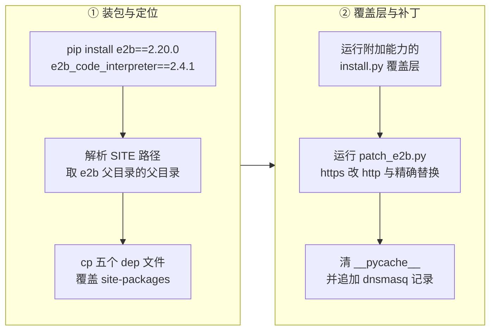

# 83 · SDK 侧适配

> 服务端全部改完之后，还剩最后一段：客户端。e2b 的 Python SDK 把「https」「公网泛域名证书」
> 「一套凭证走完模板构建」这几件事写进了默认值，而单机离线版一件都不成立。
> 本篇讲这些默认值分别在哪一行、被改成了什么、改动是怎么落到 `site-packages` 里的，以及代价。
>
> **读者**：工程师、部署工程师。
> **预备**：[第 52 篇 · legacy 服务与 SDK 兼容](52-envd-legacy-and-sdk-compat.md)（SDK 怎么找到 envd）、
> [第 81 篇 · 单机流量架构](81-single-node-traffic.md)（单机上的域名与端口）。
> **代码**：`e2b-deploy/dep/connection_config.py`、`e2b-deploy/dep/code_interpreter_sync.py`、
> `e2b-deploy/dep/build_api.py`、`e2b-deploy/dep/main.py`、`e2b-deploy/dep/dockerfile_parser.py`、
> `e2b-deploy/build.sh`、`patch_e2b.py`、`packages/python-sdk/e2b/connection_config.py`

---

## 0. 本篇要回答的问题

1. 上游 SDK 对部署环境做了哪些隐含假设？这些假设分别写在哪一行？
2. 为什么私有环境必须走明文 `http`，而不是「配一张自签证书」了事？
3. `E2B_DOMAIN`、`E2B_API_URL`、`E2B_SANDBOX_URL`、`E2B_HTTP_SSL` 各管什么，谁优先？
4. 五个覆盖文件分别改了什么？为什么模板构建要拿两个 API 客户端？
5. 覆盖层是怎么落到 `site-packages` 的？这种做法的代价是什么？
6. JS SDK 有没有跟着改？code-interpreter 的 `49999` 端口在这套改法里处在什么位置？

---

## 1. 上游 SDK 里的四条环境假设

Python SDK 的连接层集中在 `packages/python-sdk/e2b/connection_config.py` 的 `ConnectionConfig`。
它只有几十行有效逻辑，但四条对部署环境的假设都在这里。

**第一条：控制面在 `https://api.<domain>`。** 构造函数里 `api_url` 的兜底是

```python
self.api_url = (
    api_url
    or ConnectionConfig._api_url()          # E2B_API_URL
    or ("http://localhost:3000" if self.debug else f"https://api.{self.domain}")
)
```

也就是说，只给一个 `E2B_DOMAIN`，SDK 就会自己拼出 `https://api.<domain>`。
`E2B_API_URL` 是上游预留的逃生口，注释写着 for internal use only。

**第二条：数据面用 `https` + 泛域名。** `get_sandbox_url()` 与 `get_host()` 两行：

```python
return f"{'http' if self.debug else 'https'}://{self.get_host(sandbox_id, sandbox_domain, self.envd_port)}"
...
return f"{port}-{sandbox_id}.{sandbox_domain}"
```

`envd_port = 49983`。端口编进主机名最左一段的规则见
[第 52 篇 §3.1](52-envd-legacy-and-sdk-compat.md#31-端口编进域名)。
这条规则本身与协议无关，但 `https` 这个字面量意味着：域名下每一个
`<port>-<sandboxID>.<domain>` 都必须有证书。在 e2b 的托管服务上这是一张 Cloudflare 签发的
`*.e2b.app` 泛域名证书；换个域名就得自己解决。

**第三条：只有 `debug` 一个开关能退到明文。** 上面两处三元表达式的条件都是 `self.debug`，
而 `debug` 为真时目标地址会同时退化成 `localhost:3000` 和 `localhost:<port>`
（`get_host()` 在 debug 下直接返回 `f"localhost:{port}"`）。
换句话说，上游没有「远程地址 + 明文协议」这个组合：**要么全 https 走真实域名，要么全 localhost。**
这一点是后面所有改动的直接起因。

**第四条：一套凭证走完模板构建。** `e2b/template_sync/main.py` 的 `Template.build()` 只造一个
API 客户端，`require_api_key=True, require_access_token=False`，然后把它同时交给
`request_build()` 与 `trigger_build()`。这在上游成立，是因为 2.20.0 的 SDK 走的是
`POST /v3/templates`——而这条路径的 `security` 里就有 `ApiKeyAuth`（`spec/openapi.yml`）。

四条假设可以合成一句话：**SDK 默认自己在跟一个有公网域名、有泛域名证书、开着 v3 模板接口的
托管服务说话。** 单机离线版把这三个前提全拿掉了。

---

## 2. 私有环境里这四条为什么都不成立

单机离线版的网络形态在 [第 81 篇 §5](81-single-node-traffic.md#5-三类流量的完整链路) 里有完整描述，
这里只取与 SDK 相关的三点（依据 `e2b-deploy/build.sh`）：

- 域名解析靠 dnsmasq：`install_e2b()` 往 `/etc/dnsmasq.conf` 里追加
  `address=/.e2b.app/127.0.0.1`，把整个 `*.e2b.app` 解析到本机回环。
- 沙箱流量靠 iptables 改端口：`build.sh` 在 nat 表的 `PREROUTING` 与 `OUTPUT` 上把
  `--dport 80` 一律 `REDIRECT --to-port 3002`，也就是 client-proxy 的监听端口。
- 443 端口被 nginx 占着，转给 Harbor（`e2b-deploy/dep/nginx.conf`），不服务沙箱流量。

于是 SDK 必须发出的是 `http://49983-<sandboxID>.e2b.app/`——不带端口号，用默认的 80，
让 iptables 把它改到 3002。这条链路上没有任何一跳能做 TLS 终止：
443 已经归 Harbor，client-proxy 本身不持证书。

那么「配一张自签证书」为什么不算方案？两个原因，都不是技术上的不可能，而是代价不划算：

1. 需要的是**泛域名证书**，因为主机名里含随机沙箱 ID，无法逐个签发；自签泛域名证书要求每一台
   跑 SDK 的客户端机器把私有 CA 装进信任库，而这些机器不在部署脚本的管辖范围内。
2. 终止 TLS 的位置得新增一跳（或让 client-proxy 学会加载证书），
   而 iptables 的 80 → 3002 重定向此时就要换成 443 → 3002，与 nginx 占用的 443 冲突。

**推论：** 单机离线版选择明文，是拿「部署环境完全在私有网络内、沙箱流量不跨主机」
换掉了证书分发这件事。代价是明确的：SDK 到 client-proxy、client-proxy 到 orchestrator、
orchestrator 到 envd，这三段全是明文，任何能抓到本机回环或该网段的进程都能读到
`X-Access-Token` 与代码内容。这一条应当记在
[第 86 篇 §6](86-known-issues-and-debt.md#6-部署sdk-与工具链侧的条目)里。

控制面同理：API 服务监听 3000，没有前置 TLS，所以 `E2B_API_URL` 必须显式写成
`http://<server_ip>:3000`。这正是 `E2B_API_URL` 与 `E2B_DOMAIN` 在这套部署里**必须拆开**的原因——
控制面走 IP 加端口，数据面走 `*.e2b.app` 域名加 80，两者的主机、协议、端口全不一样，
`https://api.<domain>` 那条兜底规则在这里推不出正确地址。

---

## 3. 两条并行的改法与配置项

ARM 适配版对 SDK 有两套改法，来源不同，同时存在。

**改法一：源码分支上的 `E2B_HTTP_SSL`。** `packages/python-sdk/e2b/connection_config.py`
增加了一个静态方法读环境变量，默认为真：

```python
@staticmethod
def _verify_ssl():
    val = os.getenv("E2B_HTTP_SSL", "true").lower()
    if val == "false":
        return False
    return True
```

构造函数把结果存进 `self.verify_ssl`，`get_sandbox_url()` 的协议判定随之改成
`'http' if self.debug or self.verify_ssl is False else 'https'`。
这是一处**加法**：不设这个变量时行为与上游完全一致，设成 `false` 才退到明文。
注意它只影响沙箱 URL 的协议，不改 `api_url` 的兜底——控制面地址仍然由 `E2B_API_URL` 显式给出。

**改法二：部署脚本里的整文件覆盖。** `e2b-deploy/dep/connection_config.py`
是一份直接铺进 `site-packages` 的完整文件，相对上游 2.20.0 只有两处语义改动：

- `api_url` 的兜底从 `f"https://api.{self.domain}"` 改成 `f"http://api.{self.domain}"`；
- `get_sandbox_url()` 的三元表达式改成 `f"{'http' if self.debug else 'http'}://…"`，
  也就是两个分支都是 `http`，条件形同虚设。

这份文件里没有 `E2B_HTTP_SSL`，环境变量在这条路径上不起作用；协议是写死的。
两条改法**互不知道对方存在**，落到同一台机器上时由安装顺序决定谁生效（见 §4）。

下表列出与部署相关的连接配置项。「上游语义」以 `packages/python-sdk/e2b/connection_config.py`
在 2.20.0 的代码为准，「ARM 语义」以覆盖后的 `site-packages` 为准。

| 变量 | 上游语义 | ARM 适配版语义 | 默认值 |
|---|---|---|---|
| `E2B_DOMAIN` | 拼出 `api.<domain>` 与 `<port>-<id>.<domain>` | 只用于数据面主机名；对应 client-proxy 的 3002 端口所在域名 | `e2b.app` |
| `E2B_API_URL` | 覆盖控制面地址，内部用 | **必填**，写成 `http://<server_ip>:3000` | 无（兜底为 `https://api.<domain>`） |
| `E2B_SANDBOX_URL` | 覆盖沙箱地址，短路主机名拼装 | 同上，单机部署里通常不设 | 无 |
| `E2B_HTTP_SSL` | 不存在 | 为 `false` 时沙箱 URL 退到 `http`；仅在源码分支那份文件里有效 | `true` |
| `E2B_ACCESS_TOKEN` | 用户身份，走 `AccessTokenAuth` | 同上；模板构建的**创建**阶段必需 | 无 |
| `E2B_API_KEY` | 团队身份，走 `ApiKeyAuth` | 同上；模板构建的**触发**阶段必需 | 无 |

`E2B_SANDBOX_URL` 有一个容易踩的性质：`get_sandbox_url()` 一旦发现它非空就**直接返回**，
不再拼主机名，因此它固定指向 envd 的 49983 一个端口。
沙箱内其它端口（例如 code-interpreter 的 49999）走的是另一条路径 `get_host(port)`，
不受这个变量影响。也就是说 `E2B_SANDBOX_URL` 只适合「只用 envd、不用端口转发」的场景。

`e2b-infra/README.md` 与 `docs/zh/usage.md` 给出的 `.env` 模板是同一份：
`E2B_ACCESS_TOKEN`、`E2B_API_KEY`、`E2B_DOMAIN`、`E2B_API_URL`、`E2B_HTTP_SSL="false"` 五项。
`single-node-offline-deploy.md` 补充了一条运维事实：首次生成的 `.env` 里 `E2B_API_URL`
是占位符 `http://<server_ip>:3000`，必须手工改成本机 IP，`sync-env.sh` 不会替你改。

---

## 4. 覆盖层怎么落到 site-packages

`e2b-deploy/build.sh` 的 `install_e2b()` 是全部动作的唯一入口，顺序是固定的四步。



几个细节值得单独说明，因为它们决定了这套做法能不能重复执行。

**site-packages 的定位方式。** 脚本不猜路径，而是问解释器：

```bash
SITE=$(python3 -c "import e2b,os;print(os.path.dirname(os.path.dirname(e2b.__file__)))")
```

随后所有 `cp` 都以 `$SITE` 为根。第 3 步与第 4 步用的解释器则统一解析成
`command -v python || command -v python3`——脚本里的注释说明了原因：这两步要改同一份
`site-packages`，必须是同一个解释器，而 openEuler 上只有 `python3`，写死 `python` 会直接失败。

**五个文件的落点。**

| 源文件（`e2b-deploy/dep/`） | 目标目录 | 覆盖的上游文件 |
|---|---|---|
| `connection_config.py` | `$SITE/e2b/` | `e2b/connection_config.py` |
| `code_interpreter_sync.py` | `$SITE/e2b_code_interpreter/` | 同名 |
| `dockerfile_parser.py` | `$SITE/e2b/template/` | 同名 |
| `build_api.py` | `$SITE/e2b/template_sync/` | 同名 |
| `main.py` | `$SITE/e2b/template_sync/` | 同名 |

**`patch_e2b.py` 做的是文本替换，不是打补丁。** 它对五个目标各执行一组操作
（`patch()` 函数的 `replacements` 与 `global_https` 两个参数）：

| 目标 | 操作 | 是否必需 |
|---|---|---|
| `e2b/connection_config.py` | 全局把 `https` 替换成 `http` | 是 |
| `e2b_code_interpreter/code_interpreter_sync.py` | 把 `'http' if self.connection_config.debug else 'https'` 换成 `'http'` | 是 |
| `e2b_code_interpreter/code_interpreter_async.py` | 同上 | 是 |
| `e2b/volume/connection_config.py` | `f"https://api.{self.domain}"` → `http` | 否 |
| `e2b/sandbox/main.py` | MCP URL 的 `https` → `http` | 否 |

修改前 `backup_once()` 留一份 `.backup`（已存在则跳过），结束后 `clear_pycache()`
递归删掉 `e2b/` 与 `e2b_code_interpreter/` 下所有 `__pycache__`，避免加载旧字节码。
文件内容与目标一致时打印「已是目标状态」并跳过写入，所以整个脚本可重复执行。

这里有两处值得注意的代价。其一，`connection_config.py` 走的是**全文件**的
`content.replace("https", "http")`：它不区分代码与文档，`ApiParams` 里那句
`"""URL to use for the API, defaults to \`https://api.<domain>\`..."""` 的文档字符串也会被改掉。
后果无害，但说明这不是语义级的改写，任何新增的、正当的 `https` 字面量（例如指向外部服务的 URL）
都会被一起降级。其二，覆盖层与 `patch_e2b.py` 之间**有顺序依赖**：
`install_e2b()` 里那句「必须排在 `patch_e2b.py` 之前」的注释针对的就是这一点——
先铺文件、后做文本替换，顺序颠倒会让替换结果被后铺的文件盖掉。

最后是这套做法本身的代价：**它改的是安装产物，不是依赖声明。**
任何一次 `pip install -U e2b` 都会把五个文件恢复成上游版本，同时留下不再匹配的 `.backup`；
虚拟环境换一个、Python 小版本换一个，`$SITE` 就变了，得重跑一遍 `install_e2b()`。
更彻底的做法是把改动做成一个发布到私有 PyPI 的分支包（源码分支的 `E2B_HTTP_SSL`
就是朝这个方向做的），代价是需要维护一条包发布流水线。

---

## 5. 五个覆盖文件各做了什么

### 5.1 `connection_config.py`：协议降级

§3 已经说清：`api_url` 兜底与 `get_sandbox_url()` 两处改成 `http`，其余与上游 2.20.0 逐字相同。
这份文件里 `envd_port = 49983` 未变，主机名规则未变，凭证处理未变。

### 5.2 `code_interpreter_sync.py`：与 Jupyter 的那条链路

这个文件属于 `e2b_code_interpreter` 包，不属于 `e2b`。它的核心只有一处地址拼装：

```python
@property
def _jupyter_url(self) -> str:
    return f"{'http' if self.connection_config.debug else 'https'}://{self.get_host(JUPYTER_PORT)}"
```

注意**它铺进去的时候仍然是 `https`**——协议降级不在这份文件里做，而是由后一步的
`patch_e2b.py` 把整个三元表达式替换成 `'http'`。同步与异步两个文件里这行字符串完全相同，
所以 `patch_e2b.py` 用同一个常量 `JUP` 去匹配两处。

`run_code()` / `create_code_context()` / `list_code_contexts()` 等方法的行为与
[第 52 篇 §5](52-envd-legacy-and-sdk-compat.md#5-code-interpreter在-envd-之上跑-jupyter)
描述的一致：`POST {jupyter_url}/execute`，请求头带 `X-Access-Token`（来自 `_envd_access_token`）
与 `E2B-Traffic-Access-Token`（来自 `traffic_access_token`），响应按行流式解析。
这两个属性在 2.20.0 的 `e2b/sandbox/main.py` 里都存在，所以这份覆盖文件与 2.20.0 的基类是配套的。

**推论：** 既然协议由 `patch_e2b.py` 负责，这份文件被整体覆盖的目的更像是「把内容钉死到一个已知版本」，
以保证 `patch_e2b.py` 要匹配的那行字符串一定存在。本书的代码基线里没有
`e2b_code_interpreter` 2.4.1 的原始副本，无法逐行比对确认还有没有别的差异。

### 5.3 `build_api.py` 与 `main.py`：退回旧的模板创建接口

这两个文件一起改的是**模板构建的第一步**。上游 2.20.0 的 `request_build()` 调用
`post_v3_templates`，请求体是 `TemplateBuildRequestV3(name=…, tags=…)`；
覆盖版本改成调用 `post_templates`，请求体是

```python
TemplateBuildRequest(
    dockerfile="e2b.Dockerfile",   # 修改
    alias=name,
    cpu_count=cpu_count,
    memory_mb=memory_mb,
)
```

`dockerfile` 这个字段在 `spec/openapi.yml` 的 `TemplateBuildRequest` 里是 `required`，
而真正的构建指令是在第二步 `POST /v2/templates/{id}/builds/{id}` 里以
`TemplateBuildStartV2` 送出去的（见 [第 22 篇 §4](22-template-api.md#4-一次构建请求的两段)）。
于是这里必须填一个**占位字符串**让请求通过校验，`"e2b.Dockerfile"` 就是这个占位符。

退回旧接口带来一个直接后果：**两步用的是不同的鉴权方式，所以需要两个 API 客户端。**
`e2b-deploy/dep/main.py` 的 `Template.build()` 里：

```python
api_client  = get_api_client(config, require_api_key=False, require_access_token=True)
api_client2 = get_api_client(config, require_api_key=True,  require_access_token=False)
```

`api_client` 交给 `request_build()`，`api_client2` 交给 `trigger_build()`。
这不是随意的选择，服务端两处的要求不同：

- `POST /templates` 在 `spec/openapi.yml` 里的 `security` 只列了 `AccessTokenAuth`
  与 Supabase 两项，没有 `ApiKeyAuth`；处理函数
  `packages/api/internal/handlers/deprecated_template_request_build.go` 的 `PostTemplates()`
  第一行就是 `auth.MustGetUserID(c)`——它要的是一个**用户身份**，API key 提供不了。
- `POST /v2/templates/{templateID}/builds/{buildID}` 的 `security` 是 `ApiKeyAuth`，
  处理函数在 `template_start_build_v2.go`。

这就是 `.env` 里 `E2B_ACCESS_TOKEN` 和 `E2B_API_KEY` **两个都必须配**的原因：
少配任何一个，模板构建会在其中一步上以 401 失败，而另一步是好的。
相应地，`Template.build()` 的签名也退回了旧形态：`alias` 是位置参数，
没有 `tags`，没有 `**opts: Unpack[ApiParams]`，另外接受 `api_key` 与 `domain` 两个显式参数，
并在函数体里用 `os.environ.get("E2B_DOMAIN", "e2b.dev")` 兜底。
`README.md` 与 `docs/zh/usage.md` 里 `Template.build(..., alias="base", ...)` 的写法与之对应，
拿上游 2.20.0 的文档照抄 `Template.build(template, 'name:tag')` 在这套部署上是跑不通的。

**推论：** ARM 适配版的 API 服务本身是实现了 v3 接口的——
`packages/api/internal/handlers/template_request_build_v3.go` 在 ARM 代码树里存在，
`spec/openapi.yml` 的 `/v3/templates` 也在。所以退回旧接口不是服务端能力所限，
更像是这组覆盖文件源自更早一代 SDK 并被沿用下来。旁证是 `docs/zh/usage.md`
里 `pip install e2b==2.15.3` 与 `README.md` 里 `pip install e2b==2.20.0` 的版本不一致，
两处文档没有同步。

### 5.4 `dockerfile_parser.py`：默认用户与 COPY 标志

这个文件把 Dockerfile 翻译成 SDK 的模板指令序列。覆盖版本有三处改动。

**注释掉四行默认值。** 上游在解析开始前 `set_user("root")` / `set_workdir("/")`（对齐 Docker 默认），
解析结束后若 Dockerfile 没写 `USER` / `WORKDIR`，再补上 e2b 的默认值
`set_user("user")` / `set_workdir("/home/user")`。覆盖版本把这四行全部注释掉。
后果是：**最终用户与工作目录完全由基础镜像和 Dockerfile 自己决定**，SDK 不再强加。
`README.md` 里那个示例镜像的 Dockerfile 结尾正好是 `USER user` 与 `WORKDIR /home/user`，
所以示例输出里 `whoami` 是 `user`、`pwd` 是 `/home/user`——那是镜像给的，不是 SDK 补的。
代价是：换一个结尾没写 `USER` 的基础镜像，沙箱里的默认用户就会变成该镜像的用户（通常是 root），
而模板作者不会收到任何提示。

**丢掉 `--chown=` 的解析。** 上游 `_handle_copy_instruction()` 会先把以 `--` 开头的部分挑出来，
从 `--chown=` 里取出用户名传给 `template_builder.copy(src, dest, user=user)`，
其余以 `--` 开头的标志一律丢弃。覆盖版本删掉了这段，直接

```python
if len(parts) >= 2:
    src = parts[0]
    dest = parts[-1]
    template_builder.copy(src, dest)
```

于是 `COPY --chown=user:user a b` 会把 `--chown=user:user` 当成源路径，
构建要么失败要么复制错文件。这是一处真实的功能退化，
应当在 [第 86 篇 §6](86-known-issues-and-debt.md#6-部署sdk-与工具链侧的条目) 里登记。

**放宽 `copy()` 的接口声明。** `DockerfFileFinalParserInterface` 协议里 `copy()` 的
`src` 类型从 `str` 放宽到 `Union[str, List[CopyItem]]`，`dest` 变成可选，参数顺序调整。
这只是 `Protocol` 的类型声明，不影响运行时行为。

---

## 6. code-interpreter 模板与 49999

[第 52 篇 §5](52-envd-legacy-and-sdk-compat.md#5-code-interpreter在-envd-之上跑-jupyter)
已经论证过：`run_code()` 不是 envd 的能力，Jupyter 与它的 HTTP 封装跑在模板内的 `49999` 端口上，
SDK 用与 envd 完全相同的主机名编码 `49999-<sandboxID>.<domain>` 直接访问。
把这条结论放到本篇的语境里，有三个推论。

第一，**协议降级必须在两个地方各做一次**。`e2b/connection_config.py` 只管 49983
（`get_sandbox_url()`），49999 的 URL 是 `e2b_code_interpreter` 自己在 `_jupyter_url` 里拼的。
这就是 `patch_e2b.py` 的目标列表里同时有 `connection_config.py` 与两个
`code_interpreter_*.py` 的原因：漏掉任何一个，对应的那条链路仍会去请求 `https`，
在没有 443 服务的单机上直接连接失败。

第二，**这两条链路走的是同一段网络**。`http://49999-<id>.e2b.app/execute` 与
`http://49983-<id>.e2b.app/files` 一样，先由 dnsmasq 解析到 127.0.0.1，再由 iptables 从 80
改到 3002 进 client-proxy，由 client-proxy 按主机名最左段解析出端口与沙箱 ID。
SDK 侧不需要为 49999 做任何额外的路由配置。

第三，**模板一侧要自己保证 49999 起得来**。`README.md` 与 `docs/zh/usage.md` 给的
code-interpreter 模板构建命令里带着
`set_start_cmd("sudo /root/.jupyter/start-up.sh", wait_for_url("http://localhost:49999/health"))`：
启动命令拉起 Jupyter 与那个 uvicorn 应用，就绪判据是本地 `49999/health` 可访问
（就绪命令的机制见 [第 44 篇 §4](44-build-sandbox-and-commands.md#4-六类指令的实现)）。
注意这条 URL 里的 `http` 是**沙箱内部的回环地址**，与外部协议无关，不受本篇任何改动影响。

---

## 7. JS SDK 与其它客户端

ARM 适配版**没有**对 JS SDK 做任何适配。`packages/js-sdk/`、`packages/cli/`、
`packages/connect-python/` 在 SDK 分支上相对 2.20.0 无改动；
`e2b-deploy/build.sh` 的 `install_e2b()` 也只 `pip install` 与覆盖 Python 的 `site-packages`，
不碰 npm。`E2B_HTTP_SSL` 这个变量在 JS 侧不存在。

后果是：JS SDK 在单机离线版上不可用。它的 `src/connectionConfig.ts` 与 Python 侧对称，
同样把 `https` 写在协议判定里，同样只有一个 `debug` 开关能退到 `localhost`。
要在这套部署上跑 JS 客户端，需要做与 Python 侧对等的三件事——协议判定、控制面地址兜底、
模板构建的两套凭证。**推论：** 这不是技术难点，只是没有需求驱动；
单机离线版的验收路径（`README.md` 的三个示例、`benchmark/` 的压测脚本）全部是 Python。

CLI 同理。`packages/cli/` 未改动，它依赖 JS SDK 的连接层，因此
`e2b template build` 这类命令在私有环境里也走不通；模板构建只能用
`Template.build()` 的 Python 写法。

---

## 8. 小结

- 上游 SDK 的四条环境假设集中在 `e2b/connection_config.py` 的两行三元表达式与一处兜底表达式里：
  控制面 `https://api.<domain>`、数据面 `https://<port>-<id>.<domain>`、
  只有 `debug` 能退到明文（且同时退到 localhost）、模板构建一套凭证走完。
- 单机离线版把三个前提都拿掉了：没有公网域名与泛域名证书，443 归 nginx 与 Harbor，
  沙箱流量靠 dnsmasq 解析到回环加 iptables 把 80 改到 3002。所以必须发明文 `http`。
- `E2B_API_URL` 与 `E2B_DOMAIN` 必须拆开配：前者是 `http://<ip>:3000` 的控制面，
  后者是 `*.e2b.app` 的数据面，两者主机、端口、用途都不同。
- 协议降级有两条并行的实现：源码分支的 `E2B_HTTP_SSL`（加法，默认行为不变）与
  部署脚本铺进 `site-packages` 的整文件覆盖（写死 `http`，环境变量不起作用）。
- 覆盖层由 `build.sh` 的 `install_e2b()` 分四步落地：pip 装定版、cp 五个文件、
  运行附加安装器、跑 `patch_e2b.py` 做文本替换并清 `__pycache__`。顺序不可颠倒。
- `patch_e2b.py` 对 `connection_config.py` 做的是**全文件**的 `https` → `http` 替换，
  文档字符串也会被改；它可重复执行，改前留 `.backup`。
- 模板构建退回了 `POST /templates` 加 `POST /v2/.../builds/...` 这一对旧接口，
  因此需要两个 API 客户端：前者要 access token（处理函数调 `auth.MustGetUserID`），
  后者要 API key。`.env` 里两个凭证都必须配。
- `dockerfile_parser.py` 的覆盖版本注释掉了默认用户与工作目录的设置，
  并丢掉了 `COPY --chown=` 的解析——后者是一处会静默出错的功能退化。
- 协议降级要在 49983 与 49999 两处各做一次，因为后者的 URL 由
  `e2b_code_interpreter` 自己拼装，不经过 `ConnectionConfig`。
- JS SDK 与 CLI 未适配，私有环境下不可用；所有验收路径都是 Python。
- 整套改法改的是安装产物而非依赖声明：`pip install -U` 会把它冲掉，换虚拟环境要重跑。

---

## 延伸阅读 / 下一篇

- [第 52 篇 §3](52-envd-legacy-and-sdk-compat.md#3-sdk-从外面怎么找到-envd)——SDK 与 envd 之间的
  主机名编码、两个调用面、两个方向不同的凭证，以及 code-interpreter 的分层。
- [第 81 篇 §2](81-single-node-traffic.md#2-dns-层一个本地-dns-总机)至[§4](81-single-node-traffic.md#4-镜像层nginx-443-与自签证书)——dnsmasq、iptables、nginx 三者
  如何拼出本篇依赖的那条明文链路。
- [第 80 篇 §6](80-single-node-rpm.md#6-buildsh--s从空机器到可用集群)——`install_e2b()`
  在整个安装流程里的位置。
- [第 22 篇 §4](22-template-api.md#4-一次构建请求的两段)——模板创建与构建触发这两步在服务端的完整语义。
- [第 16 篇 §2](16-auth-and-multitenancy.md#2-五种凭证)——access token 与 API key
  分别代表什么身份。
- [第 86 篇 §6](86-known-issues-and-debt.md#6-部署sdk-与工具链侧的条目)——明文传输、`COPY --chown` 退化、
  覆盖层易被 pip 冲掉这三项的登记与建议修法。
- 下一篇：[第 84 篇 · ARM 性能实测](84-arm-performance.md)。
