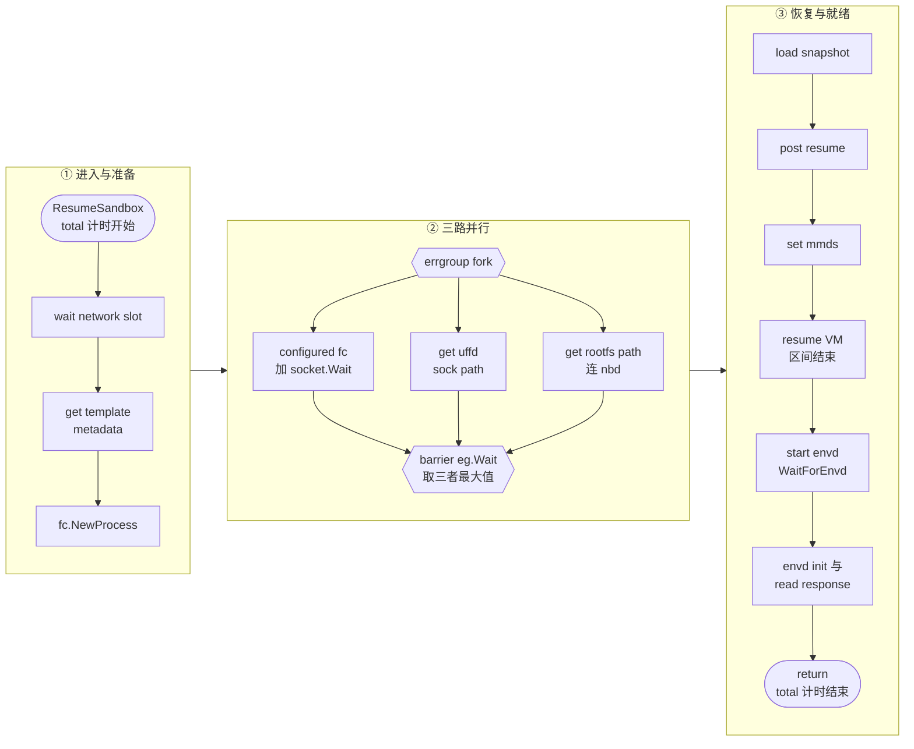

# 84 · ARM 性能实测

> 前面十几篇讲的是「改了什么」，本篇讲「改完之后跑多快」。难点不在跑数，在**口径**：
> 同一句「启动一个沙箱要多久」，在客户端、在准入信号量、在 `ResumeSandbox()` 函数里
> 是三个互不相等的数字，而阶段之间还有并行与包含关系。本篇先把口径讲清楚，
> 再讲工具链怎么用，最后把已有数据连同它们的成立条件一起列出来。
>
> **读者**：要在自己的机器上复现或扩展这套测量的工程师。
> **预备**：[第 27 篇 · ResumeSandbox](27-resume-sandbox.md)、
> [第 71 篇 · orchestrator 的 ARM 改动 I](71-orchestrator-arm-fc-changes.md)。
> **代码**：`benchmark/run_benchmark.py`、`benchmark/collect_logs.sh`、`benchmark/parse_report.py`、
> `packages/orchestrator/internal/sandbox/sandbox.go`、`packages/orchestrator/internal/sandbox/fc/process.go`

---

## 0. 本篇要回答的问题

1. 「一个沙箱启动多久」这句话有几种口径？它们之间差的是什么？
2. `[ResumeSandbox]` 的十余个阶段里，哪些并行、哪些互相包含？怎么读才不会重复计入？
3. run → collect → parse 三步各自解决什么问题？为什么用日志而不是 OpenTelemetry span？
4. 已有的实测数字分别在什么条件下取得？哪些条件根本没有被记录下来？
5. 瓶颈落在哪一段？已经做了什么，还有什么没测？
6. 上游公开的数字能不能拿来做对照？

---

## 1. 三个口径，一个都不能混

一次 `Sandbox.create()` 跨了客户端、api、orchestrator 三层。单机离线版的
`benchmark/高并发瓶颈定位方案.md` 把测量口径固定成三个，本书沿用：

| 口径 | 量的是什么 | 代码边界 | 在哪读到 |
|---|---|---|---|
| 客户端整体 `client_ms` | `Sandbox.create()` 的墙钟 | SDK 调用前后 | `run_benchmark.py` 写的 `*.client_times.csv` |
| 准入排队 `acquire wait` | 等 `startingSandboxes` 信号量 | 在 `ResumeSandbox()` **之前** | orchestrator 日志 |
| `total` | `Factory.ResumeSandbox()` 从入口到 return | 函数体 | orchestrator 日志 |

三者的关系是 `client_ms ≈ acquire wait + total + 其余`。「其余」包含 SDK 到 api 的往返、
api 侧的鉴权与放置、gRPC 往返、取模板记录，以及沙箱返回给用户之后 edge 侧
对 envd 的就绪轮询。`parse_report.py` 的 `main()` 会把这个差额算出来打印成
「其余（路由+API+取模板等）」一行，并写进 `e2e_breakdown.csv`。这是一个**派生量**，
不是埋点量，它把所有没有埋点的东西都吸收进去了，只能用来判断「大头在不在 total 里」。

有一处容易误判的地方值得单独说。`total` 的计时用的是 `defer`，在 `ResumeSandbox()`
`return` 时结束；而该函数在拉起 FC 之后、`return` 之前**还同步调了** `sbx.WaitForEnvd()`
（进而是 `envd.go` 的 `initEnvd()`，POST envd 的 `/init`）。所以 orchestrator 主动发起的那次
envd 初始化**在 `total` 之内**；从快照恢复时 envd 进程本来就在跑，这一步通常只有几毫秒。
真正落在 `total` 之外的是另一件事：客户端感知的「沙箱可用」，它还要等 proxy 轮询 health
成功、等恢复后的工作集靠 uffd 一页页缺回。把这两件都叫「envd」，就会得出
「envd 花了三百毫秒」这种错误归因。

### 1.1 与 `resume-build -iterations` 的差别

上游自带的开发工具 `cmd/resume-build` 也能测恢复耗时，口径又是另一个：它在同一个进程里
直接调 `ResumeSandbox()`，串行、无 cgroup、网络池只有 8 个槽位、特性开关取默认值。
逐条对照见[第 47 篇 §5.3](47-orchestrator-dev-tools.md#53-口径与陷阱)。

两套数据不能放进同一张表。`resume-build` 测的是「一台机器上没有别人时，恢复一台沙箱要多久」，
`benchmark/` 测的是「生产形态下，N 个客户端同时创建时，每一台要多久」。前者的数值天然更小，
且它不经过准入信号量，也没有 api 与网络这一层。要做纵向对比只有一种合法用法：
在同一台机器上，用同一套工具，改一个变量。

---

## 2. 阶段表：并行与包含

`parse_report.py` 的 `PHASE_ROWS` 定义了报告的行，与日志 key 一一对应：

| 报告分组 | 日志 key | 埋点函数 | 与其它阶段的关系 |
|---|---|---|---|
| 准入排队 | `acquire wait` | `server/utils.go` `waitForAcquire()` | 在 `total` 之外 |
| 沙箱恢复准备 | `get rootfs path` | `fc/process.go` `Resume()` | errgroup 三支之一 |
| 沙箱恢复准备 | `wait network slot` | `sandbox.go` `ResumeSandbox()` | 串行 |
| 沙箱恢复准备 | `get template metadata` | `sandbox.go` `ResumeSandbox()` | 串行 |
| 创建 firecracker 进程 | `fc.NewProcess` | `sandbox.go` `ResumeSandbox()` | 串行 |
| 创建 firecracker 进程 | `configured fc` | `fc/process.go` `Resume()` | errgroup 三支之一 |
| 创建 firecracker 进程 | `get uffd sock path` | `fc/process.go` `Resume()` | errgroup 三支之一 |
| firecracker 恢复虚拟机 | `load snapshot` | `fc/process.go` `Resume()` | 串行，在 barrier 之后 |
| firecracker 恢复虚拟机 | `post resume` | `fc/process.go` `Resume()` | 串行 |
| firecracker 恢复虚拟机 | `set mmds` | `fc/process.go` `Resume()` | 串行 |
| firecracker 恢复虚拟机 | `resume VM` | `sandbox.go` `ResumeSandbox()` | **包住**上面六项 |
| 启动 envd | `start envd` | `sandbox.go` `ResumeSandbox()` | **包住**下面两项 |
| 启动 envd | `envd init request` | `envd.go` `initEnvd()` | 串行 |
| 启动 envd | `read envd response` | `envd.go` `initEnvd()` | 串行 |
| ResumeSandbox | `total` | `sandbox.go` `ResumeSandbox()` | **包住**除准入排队外全部 |

这张表里有三个父区间（`resume VM`、`start envd`、`total`）和一组并行支
（`configured fc`、`get uffd sock path`、`get rootfs path`）。把所有行相加会得到一个
比 `total` 大得多的数，那个数没有意义。可以对账的等式只有两条：

```text
resume VM ≈ max(configured fc, get uffd sock path, get rootfs path)
            + load snapshot + post resume + set mmds

total     ≈ wait network slot + get template metadata + fc.NewProcess
            + resume VM + start envd + 未埋点的间隙
```

「未埋点的间隙」包含 `enter` 到网络槽位等待之间的准备工作：异步网络槽位 promise 的启动、
rootfs overlay 的获取、cgroup 创建，以及各埋点之间的空隙。它是残差，不是一个阶段。



还有一个读数上的细节：`total` 与 `resume VM` 两条日志用 `time.Since(...).Milliseconds()`
打印，是**整数毫秒**；其余各项用 `%.3f` 打印浮点毫秒。所以对账时 `total` 天然带有
最多 1 ms 的截断误差，亚毫秒阶段的和与 `total` 对不齐属正常。

---

## 3. 两个基线的埋点不一样，引用数据前必须核对

这是本篇最容易出错、也最需要读者警惕的一点。

**ARM 适配版**（`fbee6fcd1`）在恢复路径上埋了 `enter` 加 11 条 `cost` 日志：
`wait network slot`、`get template metadata`、`fc.NewProcess`、`resume VM`、`total`
在 `sandbox.go`；`configured fc`、`get uffd sock path`、`get rootfs path`、`load snapshot`、
`post resume`、`set mmds` 在 `fc/process.go`。这一批的实现见
[第 71 篇 §8](71-orchestrator-arm-fc-changes.md#8-resumesandbox-埋点与-traceid)。

**单机离线版**随 RPM 分发的 `0001-adapted-for-arm-architecture.patch` 在此之上又补了四条：
`acquire wait`（`server/utils.go`）、`start envd`（`sandbox.go`）、
`envd init request` 与 `read envd response`（`envd.go`）。

而 `parse_report.py` 的 `PHASE_ROWS` 是按 15 行写的。用 ARM 适配版基线的二进制跑压测，
那四行会解析不到任何样本：`summary.csv` 里这几行的「样本数」列是 0，`report_wide.csv` 里是空格。
脚本不会报错，只有末尾那句「有效沙箱数 != 期望」的告警可能提示不到位——它只看 `total`。

因此有一条硬性纪律：**引用任何一份 `benchmark/` 报告时，先看 `summary.csv` 的样本数列，
再决定哪几行可以引用。**样本数为 0 的行既不能当成「这一段耗时为零」，
也不能当成「测量失败」，它只说明当时那个二进制没有这个埋点。

`acquire wait` 这一行还踩过第二个坑，值得作为反面教材记下来。orchestrator 的 `Create`
在获取信号量时分两条路径：`req.Snapshot == true`（用户显式暂停后恢复）走 `waitForAcquire()`，
普通的 `Sandbox.create()`（`Snapshot == false`）走 `else` 分支里的内联 `Acquire`。
最初只有 `waitForAcquire()` 埋了点，于是压测（走的正是 `else` 分支）里排队时间恒为 0。
两条路径都埋点之后才读得到数。一个恒为 0 的阶段，和一个没有样本的阶段，
在报告里长得很像，但含义完全相反。

顺带一提，这批埋点用的是 zap 日志而不是 OpenTelemetry span，理由在
[第 71 篇 §8](71-orchestrator-arm-fc-changes.md#8-resumesandbox-埋点与-traceid)：
单机离线版的可观测栈未必接了 collector，而 stdout 一定落盘。代价是解析要靠正则，
且日志量随沙箱数线性增长。

---

## 4. 工具链：run → collect → parse

三个脚本按顺序跑，中间靠一个运行目录串起来。

### 4.1 run_benchmark.py：造负载并划定时间窗口

它用 e2b Python SDK 起 N 个沙箱，记录每个的 `client_ms`，然后在
`runs/run_<时间戳>/` 下写 `meta.json`，并把目录名写进 `runs/.latest`。
关键参数：`--count`（默认 100）、`--concurrency`（默认 1）、`--warmup`（默认 3）、
`--kill-each`、`--interval`、`--sandbox-timeout`。

三个设计取舍值得注意。其一，**预热是必需的**：第一台沙箱要把模板产物拉进本地缓存，
耗时高出几个量级，`create_one()` 会把预热样本标成 `warmup` 并排除在统计之外
（[第 34 篇 §4](34-template-cache-and-local-storage.md#4-缓存查找顺序一次块读查几张表)讲缓存本身）。其二，`--kill-each`
改变的是测试形态而不只是资源占用：默认形态下 100 台沙箱同时存活，
NBD 设备与网络槽位都是「新申请」；开了 `--kill-each` 则变成「创建即销毁」，
槽位在暖池里反复复用，两组数据不可直接比较。其三，`meta.json` 里记的时间窗口
（压测起点前 2 秒到终点后 10 秒）是后续解析的**契约**：orchestrator 的日志是累积的，
靠这个窗口把本次运行从历次运行里隔离出来。

`meta.json` 还记了 `fc_netns_exec_helper`（由 `--fc-netns-exec-helper` 传入）与
`host_net`。后者是压测收尾时数的沙箱 netns 与 veth 残留数：槽位销毁后会回暖池待复用，
netns 不立即拆，所以残留数不超过暖池上限属正常；持续增长则说明 orchestrator
曾被强杀、`networkPool.Close()` 没跑完（[第 35 篇 §3](35-sandbox-networking.md#3-池两条队列两种优先级)）。

### 4.2 collect_logs.sh：把日志收齐

单机离线版里没有单独的 orchestrator job，orchestrator 与 template-manager 是同一个二进制，
在 `template-manager-system` 这个 Nomad system job 里一起跑。脚本默认在
`template-manager-system`、`orchestrator`、`orchestrator-system` 三个候选里挑存在的那个，
遍历它**所有** running 的 allocation，把 stdout 与 stderr 都拉到
`runs/<本次>/orchestrator-logs/`。

两条约束是硬的。多节点部署时日志必须收齐，否则落在别的节点上的沙箱整条 trace 都会缺失，
表现为「有效沙箱数少于期望」。压测开始之后 orchestrator 不能重启，
重启会换 allocation，旧的 stdout 就取不回来了。

### 4.3 parse_report.py：按 traceID 归并

它只依赖标准库。`parse_logs()` 用正则匹配
`[ResumeSandbox] <body>, traceID=<16 到 64 位十六进制>`（OpenTelemetry 的 traceID 是 32 位），`body` 为 `enter` 时记开始时刻，
形如 `<key> cost: <数值> ms` 时按 key 归入该 traceID 的阶段字典；同时用 `(tid, body)`
去重，防止同一份日志被重复输入。时间戳解析兼容 zap JSON 的 `timestamp` / `ts` / `time`
字段（ISO 字符串或 epoch 秒 / 毫秒 / 纳秒）与纯文本行里的 ISO 串。

只有拿到 `total` 的 trace 才算「有效沙箱」，其余记为「不完整 trace」。
输出五个文件：`report_wide.csv`（行是阶段、列是沙箱）、`report_long.csv`、
`summary.csv`（min/avg/p50/p90/p95/p99/max）、`intervals.csv`、`timeline.csv`。
最后这个是给 `visualize_intervals.py` 画图用的：每条 `cost` 日志自带的时间戳约等于
该阶段的**结束时刻**，区间就取 `[ts − 时长, ts]`；同一沙箱的所有阶段来自同一个
orchestrator 进程，用的是同一个时钟，不存在跨机漂移。

百分位用「最近秩」法（`math.ceil(p/100*n)`），样本少时 p95 与 p99 会落到同一个样本上——
这一点与 `resume-build` 的取下标法有同样的陷阱，见[第 47 篇 §5.3](47-orchestrator-dev-tools.md#53-口径与陷阱)。

`build_template.py` 是配套的模板构建脚本，用 `Template.build()` 从
`harbor:443/e2b-orchestration/ubuntu:22.04-custom` 造出别名为 `base` 的模板，
固定 1 vCPU / 1024 MiB。所有恢复耗时数据的「模板大小」都由它决定。
`snapshot.py --mode diff` 则是量快照体积的探针，见 §5.3。

---

## 5. 已有的数据

以下每组数据都按「数字 + 成立条件」给出。条件在原始记录里缺失的，一律标「条件未记录」，
不做补足。

### 5.1 恢复各阶段（100 并发）

来源：单机离线版 `benchmark/启动耗时阶段分析.md`，`parse_report.py` 对 100 个沙箱的解析结果。

条件：并发 100；模板 `base`，1 vCPU / 1024 MiB；单机 Nomad 部署。
**机型、宿主内核版本、存储后端、预热数量、`MAX_STARTING_INSTANCES_PER_NODE` 取值均未在该文档中记录，
按本书口径标「条件未记录」。** 埋点基线是补 envd 与准入排队三行之前的版本，
所以那四行在这份数据里没有样本。

| 阶段 | avg（ms） | p99（ms） | 关系 |
|---|---:|---:|---|
| `total` | 294.69 | 376 | 汇总区间 |
| `resume VM` | 271.69 | 369 | 汇总区间 |
| `configured fc` | 241.614 | 329.14 | 并行支，决定汇合点 |
| `load snapshot` | 29.148 | 54.44 | 串行 |
| `fc.NewProcess` | 15.453 | 80.49 | 串行 |
| `get uffd sock path` | 13.179 | 71.64 | 并行支，被 `configured fc` 盖住 |
| `wait network slot` | 0.684 | 0.368 | 串行 |
| `post resume` | 0.584 | 3.25 | 串行 |
| `set mmds` | 0.404 | 1.53 | 串行 |
| `get rootfs path` | 0.193 | 2.86 | 并行支 |
| `get template metadata` | 0.087 | 0.14 | 串行 |
| `acquire wait` / `start envd` / `envd init request` / `read envd response` | 无样本 | 无样本 | 该版本未埋点 |

按 §2 的等式对账：`max(241.614, 13.179, 0.193) + 29.148 + 0.584 + 0.404 = 271.75`，
与 `resume VM` 的 271.69 相符；`0.684 + 0.087 + 15.453 + 271.69 = 287.91`，
与 `total` 294.69 差约 6.8 ms，这部分是未埋点的间隙，其中主要一项就是当时还没单列的
同步 `/init` 往返。这个残差同时也是一个反证：如果客户端观测到的几百毫秒差额真的落在
`total` 里，`total` 早就不是 294 ms 了。

`wait network slot` 的 p99 比 avg 小，不是笔误：avg 被极个别的长尾拉高（原文记录的最大值
61.87 ms，出现在网络池未命中时），而 p99 按最近秩落在一个正常样本上。
这是「avg 不可用、要看分位」的典型样本。

### 5.2 参考量级：上游报告的 4 个样本

`benchmark/README.md` 记录了一组用于人工对照的参考量级：`total` 与「恢复虚拟机」
约 31~47 ms，其中「等待 firecracker 启动」约 22 ms、「等待 uffd sock」约 10.5 ms、
「加载快照」5~16 ms、「准备 rootfs」多数 0.03 ms 而偶发 38 ms、「获取网络槽位」约 0.05 ms。

条件：仅 4 个完整样本；机型、内核、存储后端、模板大小、并发度**全部未记录**。
[第 27 篇 §8](27-resume-sandbox.md#8-各阶段耗时的量级) 已经指出这只能当量级参考。
它与 §5.1 相差近一个数量级，而两者的并发度一个未记录、一个是 100，
所以这个差不能归因于架构——它更可能是并发度差异。要拿到「ARM 对 x86 慢多少」这个结论，
必须在两边跑**同一套脚本、同一个并发度**，本书截稿时没有这样的数据。

### 5.3 快照体积：读过即脏的直接测量

来源：`e2b-infra/deploy-docs/09-增量快照实现与ARM实测分析.md`。

条件：单台鲲鹏 aarch64 服务器，openEuler，宿主内核 `6.6.0_6.6.0_515-uffd_copy_open_tree`；
单机离线 RPM 部署，存储 provider 实际生效值为 `Local`，产物在 `/orchestrator/`；
模板 `base`，1 vCPU / 1024 MiB；单沙箱，无并发；
命令 `python snapshot.py --mode diff --keep-snapshot --blob-mb 200`。

| 快照 | 场景 | memfile diff | rootfs diff | 耗时 |
|---|---|---|---|---|
| #1 | 沙箱刚起，基线 | 112 MiB | 0 | 0.42 s |
| #2 | 两次之间什么都没做 | 112 MiB | 0 | 0.41 s |
| #3 | 写入 200 MiB 随机数据之后 | 338 MiB | 201 MiB | 1.10 s |

#2 的 112 MiB 是「读过即脏」的直接读数：两次快照之间没有跑任何命令，精确增量下应当接近零，
这 112 MiB 是从 #1 恢复之后被 uffd 换入的常驻工作集，约为 1 GiB 模板的 11%。
逐条解读与它对成本模型的影响在 [第 72 篇 §6](72-uffd-on-arm.md#6-实测量级)，本篇不重复。

这里只强调它与恢复耗时的耦合：内存 diff 越大，下一次从这个 build 恢复时要拉取和缺页的数据越多。
所以 §5.1 的阶段耗时与本节的体积不是两件事，而是同一个成本模型的两端。

### 5.4 上游公开数字：只能当量级，且都缺条件

e2b 官方博客提到「启动一个新的 Sandbox 会话时，E2B 在云上起一台小 VM，整个过程约 150–170 ms」
（[How Hugging Face Is Using E2B to Replicate DeepSeek-R1](https://e2b.dev/blog/how-hugging-face-is-using-e2b-to-replicate-deepseek-r1)）；
另一篇讲大页优化的文章给出「沙箱启动后首次读取 0.5 GB 数据，原先约 4.9 s，现在只要 0.76 s」
（[Up to 5x Faster Sandboxes](https://e2b.dev/blog/up-to-5x-faster-sandboxes)）。

两个数字都没有给出机型、区域、模板大小与并发度，也没有说明口径是客户端墙钟还是服务端函数耗时。
**推论**：150–170 ms 更接近本篇的「客户端整体 `client_ms`」而不是 `total`，
因为它描述的是用户发起会话到拿到沙箱的过程。在这个推论下，它与 §5.1 里
100 并发下 `total` 的 294.69 ms 不构成可比对；能构成对比的只有同并发度下的 `client_ms`，
而单机离线版没有把这个数字与并发度一起记录下来。

需要注意的是，`benchmark/启动耗时阶段分析.md` 里引用的「E2B 官方单沙箱口径是就绪小于 200 ms」
这一说法，在本书截稿时无法在 e2b 的快照文档页上核到原句——那一页只写了
「快照要求模板的 envd 版本不低于 v0.5.0」。所以本书只引用上面两条能核到出处的数字。

---

## 6. 瓶颈在哪一段

### 6.1 主战场：`configured fc`

§5.1 那份数据里，`configured fc` 的 241.6 ms 占 `total` 294.69 ms 的 82%，
其余所有阶段加起来不到 9 ms。它覆盖两处阻塞：`p.cmd.Start()` 把 shell 管线 fork 起来，
`socket.Wait()` 等 Firecracker 的 API socket 出现（[第 28 篇 §3](28-firecracker-process-management.md#3-进程的创建观测与关停)）。
p99（329）明显高于 avg（241）是锁与资源争用的典型形态，单沙箱时它远没有这么大。

单机离线版的 `benchmark/FC启动优化-netns-exec.md` 把矛头指向这条管线的最后一环
`ip netns exec`。iproute2 的 `netns_switch()` 每次调用做六件事，其中只有第一件
（`open` netns 文件加 `setns(CLONE_NEWNET)`）是 Firecracker 需要的；另外五件是
再开一个 mount namespace、递归 `make-rslave` 整棵挂载树、卸载并重挂 `/sys`、
bind-mount `/etc/netns/<ns>/*`、以及 `ip` 这个动态链接二进制本身的加载。
其中三件都要持全局 `namespace_sem`，100 台沙箱同时恢复时在这把锁上串行。

对策是一个约 70 行的静态 helper `fc-netns-exec`：`runtime.LockOSThread()` 之后
`Open` 加 `Setns` 加 `Exec`，原地 execve 成 firecracker。管线其余部分原封不动，
与基线只差一个变量。接入方式是在 `script_builder.go` 的模板里放占位符、由
`firecrackerCommand()` 决定填 `ip netns exec` 还是 helper 路径，而不是对生成好的脚本做字符串替换——
后者会在上游改动模板措辞时静默失效。开关是单一环境变量
`E2B_FC_NETNS_EXEC_HELPER`，取 `disabled` / `ip-netns-exec` / 空串时回落上游行为。

三点代价要一并记住。其一，**默认开启且不校验 helper 是否存在**：二进制缺失时 bash 报
command not found，`configure` 以 `exit status 127` 失败。其二，模板构建用的 VM 被显式排除
（它们走 `ConstantRootfsPaths`，`TemplateID` 与 `BuildID` 为空），优化只作用在恢复路径上。
其三，这条错误路径要能快速报出来，依赖 `socket.Wait()` 尊重调用方的 ctx；
该文档记录的那处 ctx 修复正是为此，而 ARM 适配版基线里的 `socket.Wait()` 用的是
`context.Background()`，会一路空等到 300 秒（[第 71 篇 §4](71-orchestrator-arm-fc-changes.md#4-socketwait一个自带的-300-秒超时)）。

需要如实说明的是：**该文档没有记录 helper 开启前后 `configured fc` 的对照数字**，
只记录了另一组被否决的方案（把整条管线换成自实现的 launch 进程）的实测：
子进程侧从 138 ms 压到 29 ms，但父进程 `cmd.Start()` 因 mount namespace 复制被拖到
avg 143 ms，两段合计比 helper 方案倒赔约 31 ms，故未采纳。这组数字的并发度与机型条件未记录。
`benchmark/高并发瓶颈定位方案.md` 已经把 A/B 实验方法写好（同并发下切换开关、
并发 1 与 100 逐段算放大倍数、固定并发扫 `MAX_STARTING_INSTANCES_PER_NODE`），
执行结果不在仓库里。

`fc-netns-exec` 及其配置项不在 ARM 适配版基线 `fbee6fcd1` 里，它属于单机离线版随 RPM
分发的补丁。读[第 71 篇 §9](71-orchestrator-arm-fc-changes.md#9-参数总表)的参数表时不会看到它。

### 6.2 uffd 握手与 envd init：目前都不在关键路径

`get uffd sock path` 的 13.2 ms 与 `configured fc` 并行，被后者完全盖住；
只要它小于 `configured fc`，压缩它对 `total` 没有可感知收益。它值得单独记的原因是
数值稳定，适合做机器间的基线对比。uffd 握手本身的机制见
[第 31 篇 §2](31-uffd-memory-backend.md#2-握手从-socket-到就绪)；ARM 适配版把 `uffdMsgListenerTimeout`
从 10 s 放宽到 120 s，改的是失败发现时间，不改这里的正常耗时。

`start envd` 三行量的是 orchestrator 同步调 `/init` 的往返，落在 `total` 内，
从快照恢复时通常只有几毫秒——§5.1 那笔约 6.8 ms 的残差就是它。
把它和客户端感知的「envd 就绪」区分开，是 §1 那段的全部意义。

### 6.3 内存 diff 体积：另一端的瓶颈

`load snapshot` 的 29.1 ms 只是把快照文件读进 Firecracker，真正按需拉回内存的动作
发生在 `total` 之外、guest 开始执行之后。§5.3 那 112 MiB 的工作集意味着每次恢复
都要通过 uffd 把这些页重新喂回去；在 100 并发下，这是随机读 I/O 与 CPU 的争用来源，
也是「客户端整体减 total」那笔差额里被低估的一项。它没有埋点，
本书截稿时只能从体积推断，标为推论。

### 6.4 缺的那一半：x86 对照

[第 72 篇 §6](72-uffd-on-arm.md#6-实测量级) 已经提出最省事的对照实验：
在 x86 部署上跑同一个 `snapshot.py --mode diff`，看 #2 的 memfile 是否落在 MiB 级。
这一条对本篇同样成立，而且应当扩展到恢复耗时：同一套 `benchmark/` 脚本、
同一个并发度、同样大小的模板，在 x86 上跑一遍。没有这组对照，
本篇所有数字都只能说明「ARM 适配版在这台机器上是这个量级」，
说不了「aarch64 比 x86 慢多少」。

---

## 7. 小结

- 「启动一个沙箱多久」至少有三个口径：客户端 `client_ms`、准入排队 `acquire wait`、
  `ResumeSandbox()` 的 `total`。orchestrator 主动调 envd `/init` 在 `total` 内，
  客户端感知的 envd 就绪在 `total` 外，两者都叫 envd，混起来就会误判归因。
- 阶段之间有三个父区间和一组三路并行支，只有 §2 那两条等式可以用来对账；
  把所有行相加得到的数没有意义。
- ARM 适配版基线埋了 11 个阶段，单机离线版的补丁另加了 4 个。
  `parse_report.py` 按 15 行输出，缺的行样本数为 0 而不报错；
  引用任何报告前都要先看 `summary.csv` 的样本数列。
- 一个恒为 0 的阶段和一个没有样本的阶段在报告里长得很像，含义相反：
  `acquire wait` 早期因为只埋了两条准入路径中的一条，读数恒为 0。
- 已有的 100 并发数据里，`configured fc` 占 `total` 的 82%，是唯一的主战场；
  它的机型、内核、存储后端、预热数量均未记录，只能作为形态证据而非基线。
- `ip netns exec` 的六个动作里五个是 Firecracker 不需要的，其中三个持全局 `namespace_sem`；
  `fc-netns-exec` 只保留 `setns` 加 `execve`。该优化默认开启、不校验二进制存在性、
  且不作用于模板构建路径；开关前后的对照数据尚未记录。
- 内存 diff 的 112 MiB 工作集与恢复耗时是同一个成本模型的两端，
  但这一段没有埋点，只能从体积推断。
- 本书截稿时缺的关键对照是 x86：同一套脚本、同一并发度、同一模板大小。
  没有它，这里的数字说明的是「这台机器上是这个量级」，不是架构差异。

## 延伸阅读 / 下一篇

- [第 27 篇 §3](27-resume-sandbox.md#3-并行段三个-promise-和一个后台预取)与[§4](27-resume-sandbox.md#4-串行段从-fcnewprocess-到-resumevm)：本篇测的那条路径本身。
- [第 47 篇 §5](47-orchestrator-dev-tools.md#5-用--iterations-做恢复耗时测量)：另一套口径的恢复耗时测量，不要与本篇混用。
- [第 71 篇 §8](71-orchestrator-arm-fc-changes.md#8-resumesandbox-埋点与-traceid)与[§9](71-orchestrator-arm-fc-changes.md#9-参数总表)：埋点的实现与超时并发参数的改动。
- [第 72 篇 §6](72-uffd-on-arm.md#6-实测量级)：内存 diff 体积那一端。
- [第 82 篇 §1](82-host-kernel-nbd-hugepages.md#1-宿主是一个配置项)：跑压测前宿主要满足什么。
- [第 86 篇 §6](86-known-issues-and-debt.md#6-部署sdk-与工具链侧的条目)：本篇指出的缺测项与默认开启的风险归入那里。
