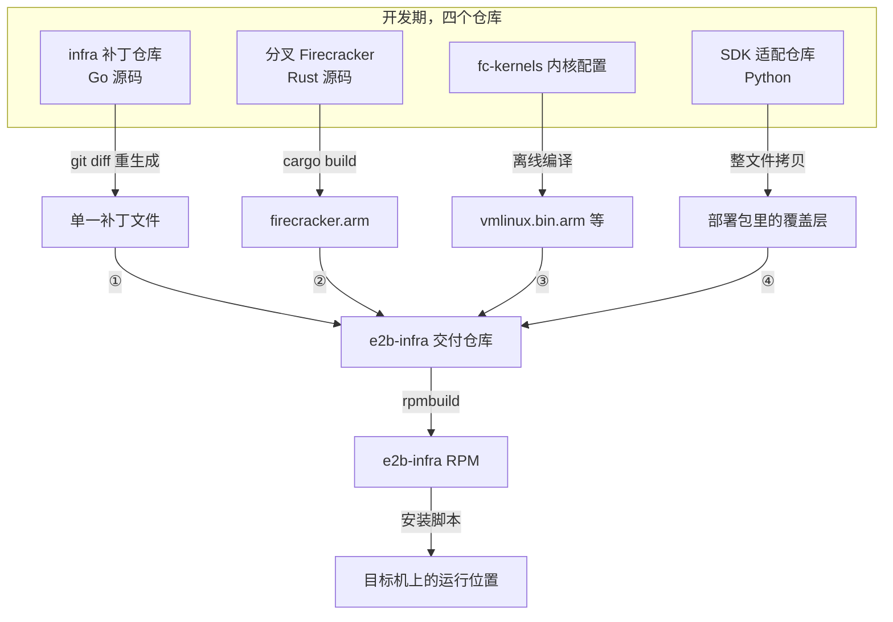

# 85 · 开发与出包工作流

> 前面十几篇讲的是「改了什么」，本篇讲「怎么改、改完怎么送出去」。
> 一台没有编译环境、没有外网的目标机器，加上一个只有单一补丁位的 RPM spec，
> 这两个约束几乎决定了整套工作流的形状：纯净上游 tarball、一棵长期存在的打好补丁的源码树、
> 一条不出包的高频循环，和一次低频的补丁重生成。
>
> **读者**：要接手这套代码继续开发或升级上游的工程师。
> **预备**：[第 65 篇 · 构建与发布](65-build-and-release.md)（上游的构建模型）、
> [第 67 篇 · ARM 适配总览](67-arm-port-overview.md)（四个仓库的分工）。
> **代码**：`e2b-infra.spec`、`0001-adapted-for-arm-architecture.patch`、`packages/*/Makefile`、
> `packages/*/Dockerfile`、`e2b-deploy/dep/init-client.sh`、`patch_e2b.py`。

---

## 0. 本篇要回答的问题

1. 为什么交付形态是「未经修改的上游 tarball + 一个补丁」，而不是把源码整棵 fork 进交付仓库？
2. 为什么全部改动挤在**一个**补丁文件里，而不是按主题拆成若干个？
3. 日常改一行 Go 代码，从编辑器到跑起来要经过哪些步骤？为什么这一圈里不需要 `rpmbuild`？
4. 补丁、Firecracker 二进制、内核二进制、SDK 覆盖层这四路产物，各自在什么时刻、由谁消费？
5. 哪些东西必须成对更新？不成对会以什么形式暴露 —— 编译错误，还是运行期的静默失灵？
6. 这套流程欠下了哪些债？上游发布新 tag 时怎么跟上？

---

## 1. 两个约束

工作流不是设计出来的，是被约束挤出来的。这里有两个硬约束。

**第一个约束：目标机器上没有开发环境。** 单机离线版要装的那台服务器没有外网、没有 Rust 工具链，
甚至不保证有 Go。能带过去的只有一个仓库 —— `e2b-infra`，它是 RPM 的源仓库。
凡是不能在这台机器上重新产生的东西，都必须以**已经编译好的形态**躺在这个仓库里。

**第二个约束：spec 的构建模型只有一个补丁位。** `e2b-infra.spec` 的前几行是这样：

```spec
Source0:  https://github.com/e2b-dev/infra/archive/refs/tags/%{tag}.tar.gz#/%{name}-%{tag}.tar.gz
Patch1:   0001-adapted-for-arm-architecture.patch
...
%prep
%autosetup -p1 -n e2b-infra-%{tag}
```

`Source0` 是上游 2026.09 的源码包，原样不动；`%autosetup -p1` 解包后把 `Patch1` 打上去。
于是**相对上游的全部增量必须压在这一个文件里** —— 不存在「只带自己那部分」的选项。

两个约束合起来给出一个推论：开发不能在交付仓库里进行。那里没有展开的 Go 源码，
只有一个几十万字节的 diff；手工编辑 diff 不可行，行号和上下文错一个字符就是 `Hunk FAILED`。
所以必须另外维护**一棵展开并打好补丁的源码树**，在里面正常写代码，最后让 git 重新生成那个 diff。
这棵树是纯本地的工具，不发布、不交付。

---

## 2. 纯净 tarball 加单一补丁

### 2.1 为什么不 fork 整棵源码树

把上游源码整个拷进交付仓库、直接在上面改，是最省事的做法。代价是丢掉两样东西。

一是**与纯上游的一键对比**。补丁模型下，「这套移植到底改了什么」可以直接回答：
`git diff --stat` 给出 94 个文件、5293 行新增、1129 行删除
（本书基线的 ARM 适配部分；交付仓库里那份补丁还叠了后续开发，跨 123 个文件）。
第 67 篇的改动地图与第 86 篇的技术债清单都是从这个 diff 上读出来的。

二是**跟随上游升级的能力**。上游出新 tag 时的动作是把补丁 rebase 上去，
冲突集中在那 94 个文件里，冲突本身就是「上游改了我也改过的地方」的精确提示；
fork 之后要做的是两棵几十万行的树三方合并，信噪比差一个量级。

代价也有：**补丁是「当前差异的快照」，不是「历史账本」** —— 改动的逻辑分组与每一步的动机
只存在于开发仓库的提交历史里，交付仓库看不到。

### 2.2 为什么只留一个补丁

spec 允许多个 `Patch` 声明，`%autosetup -p1` 按序号依次打上，按主题拆分看起来更清晰。
但拆分只在两种情形下有价值：想单独关掉其中某一个，或者它们来自不同的上游。
这里两条都不成立 —— `%autosetup` 每次固定顺序全部打上；所有补丁也都是同一个上游 tag 上的下游改动。

拆分的代价则是每次改代码都要先回答一串问题：这处改动属于哪一层？拿哪个中间状态当 diff 的下界？
改了前一个补丁会不会把后一个打崩？合成一个之后这类问题整体消失，
重新生成补丁塌缩成一条 `git diff` 命令。失去的是「某个主题的改动是一个一眼可见的集合」，
而这本来就该由提交历史和文档承载，不该靠补丁文件的物理拆分来保存。

### 2.3 基线的定义：两个 tag

重新生成补丁的本质是 `git diff <基线> <当前>`。基线选错，生成的补丁就是错的，
而且错法很隐蔽。源码树里有三个候选，只有一个是对的：

| 候选 | 内容 | 能不能当基线 |
|---|---|---|
| tarball 自带的 `2026.09` tag | 上游 git 历史里的那个提交 | 不能 |
| 自己打的 `upstream` tag | 解包后的完整目录内容 | 是它 |
| `synced` 之类的中间 tag | `upstream` 加上一段已有改动 | 只在分段移植时用作起点 |

差别在 `vendor/`。交付仓库里的源码 tarball 不是 GitHub 上那份归档：
上游纯源码约 14 MB，这个包有 143 MB，多出来的十倍是**预先填好的 `vendor/` 目录**
（离线构建的命脉，`%build` 里设了 `GOFLAGS=-mod=vendor`）。
`vendor/` 不在上游 git 历史里，在 tarball 自带的那个 grafted 仓库眼里是 untracked 的。
拿 `2026.09` 那个提交当下界，整棵 vendor 树会被算成「新增文件」，补丁从一万行涨到几十万行 ——
它仍然能应用、能编译，只是每个人都要在噪音里找那五千行改动。

正确的做法是解包后自己 `git add -A && git commit` 一次，把**磁盘上的全部内容**固化成一个提交，
在它上面打 `upstream` tag。这样 `upstream` 的含义恰好等于「`%prep` 打补丁之前的状态」，
`git diff upstream HEAD` 与 spec 里 `Patch1` 的语义严格对应。

这里有一个容易踩空的细节：`//go:embed` 引用的 arm64 busybox 二进制既不在源码包里、
也不在补丁里（二进制进补丁会变成 GNU `patch` 无法应用的 `GIT binary patch`），
它是 spec 的 `Source1`，由 `%prep` 在打完补丁后 `cp` 进构建树。
手工搭的源码树必须在**建立基线之前**把它拷进去 —— 这样它同时存在于 `upstream` 和后续提交里，
差分为零，既不污染补丁，也不需要额外的忽略规则。补丁里那两个同名占位文件的来历见
[第 74 篇 §2.2](74-template-build-on-arm.md#22-补丁里的两个占位文件)。

同类的噪音源还有一个：`%build` 会产出 `bin/` 的五个包里，`packages/db` 是唯一没有 `.gitignore` 的
（`api`、`envd`、`orchestrator`、`client-proxy` 都写了 `bin`），
它的编译产物一旦生成就会被 `git add -A` 收走，补丁里于是出现 `GIT binary patch`。
挡它要写进 `.git/info/exclude` 而不是 `.gitignore` —— 后者自己会进补丁。

---

## 3. 两条开发线

分清「在改什么」是这套流程里最先要建立的心智模型，因为它决定了要不要出包。

| | 改的对象 | 频率 | 怎么生效 |
|---|---|---|---|
| 源码线 | 上游 Go 源码：orchestrator、api、envd 等 | 高，是主要工作 | 编出二进制直接替换正在跑的那个 |
| 部署线 | `e2b-deploy/`、`e2b-infra.spec`、各个二进制 Source | 低，装机流程定型后基本不动 | 重打部署包、重出 RPM |

### 3.1 高频循环：改码 → 编译 → 换二进制 → 验证

源码线的一轮是几分钟，全程不碰补丁、不碰 `rpmbuild`。

**为什么可以这样。** RPM 在这套系统里只做一件事：**把编译产物摆到约定位置**。
`%install` 一句 `for exe in packages/*/bin/*` 把所有产物装进 `/opt/e2b-infra/bin/`，
再由部署脚本分发。手工把同一个文件拷到同一个位置，效果完全一样。
RPM 的价值在「可复制地装到一台新机器」，不在「在这台机器上迭代」。

**为什么在上游做不到这么快。** 上游的 `packages/orchestrator/Makefile` 里，
`build` 目标是 `docker build --platform linux/amd64 --output=bin ... -f ./Dockerfile ..` ——
用 Docker 当交叉编译的载体，`FROM scratch` 加 `--output=bin` 把产物导出到宿主
（[第 65 篇 §3](65-build-and-release.md#3-makefile-的三层结构)）。
这一步要拉 golang 基础镜像、要联网下载依赖，在离线机上根本跑不起来。
ARM 适配版把六个包的 `Makefile` 都改了：`packages/orchestrator/Makefile` 的 `build` 变成两条
`CGO_ENABLED=1 GOOS=linux go build`，直接在宿主上编出 `bin/orchestrator` 与 `bin/clean-nfs-cache`；
`packages/envd/Makefile` 等把写死的 `GOARCH=amd64` 换成由 `uname -m` 推导的 `PLATFORM`，
遇到未知架构直接 `$(error)`。
Dockerfile 相应从两阶段构建塌成单阶段运行时镜像：`packages/orchestrator/Dockerfile` 是
`FROM ubuntu:24.04` 装上 `iptables`、`iproute2`、`rsync` 再 `COPY` 二进制；
`api`、`client-proxy`、`db`、`clickhouse` 四个是 `FROM debian:bookworm-slim` 加一句 `COPY`。

这组改动的直接目的是离线构建，但它顺带把开发循环的成本从「一次 Docker 构建」降到「一次 `go build`」，
这才是高频循环成立的前提。代价写在
[第 65 篇 §8](65-build-and-release.md#8-arm-适配版的差异)：产物的可复现性从 Dockerfile
转移到了宿主工具链上 —— 换一台编译机，编出来的二进制不再保证一致。

**离线编译的三个环境变量。** 日常编译要设 `GOFLAGS=-mod=vendor`（依赖只从 vendor 取）、
`GOTOOLCHAIN=local`（禁止 Go 因 `go.mod` 声明的版本高于本机而联网换工具链）、
`GOWORK=off`（根目录的 `go.work` 会让 go 进入 workspace 模式，与 `-mod=vendor` 冲突）。
第三个有陷阱：spec 的 `%build` 写的是 `rm -f go.work go.work.sum`，但开发树里**不能删这个文件** ——
`go.work` 被 git 跟踪，删掉之后一次 `git add -A` 就把删除提交进去，补丁里凭空多出一段 diff。
`GOWORK=off` 效果等价而不动工作树。

**替换的位置随运行形态而变。** 这是最容易「改了却没生效」的地方：

| 改了什么 | 运行形态 | 二进制的位置 | 让它生效 |
|---|---|---|---|
| orchestrator / template-manager | `raw_exec` | `/usr/bin/orchestrator` 与 `/usr/bin/template-manager`，同一个文件两个名字 | 覆盖两处，重跑 job |
| api / client-proxy | `docker` | 私有镜像仓库里的镜像 | 拷二进制、重建并推镜像、重跑 job |
| envd | 注入沙箱 rootfs | `/fc-envd/envd` | 覆盖后**重新构建模板**，已有模板不受影响 |
| 迁移与种子工具 | 一次性执行 | `/opt/e2b-infra/bin/` | 覆盖即可 |

「同一个文件两个名字」是上游就有的安排，身份由 `ORCHESTRATOR_SERVICES` 决定
（[第 65 篇 §3.1](65-build-and-release.md#31-一个二进制两个名字)）；
在这里它意味着换二进制时必须覆盖两个路径，漏一个就得到两个版本不一致的进程。
另外，正在运行的进程占着自己的可执行文件，直接 `cp` 会得到 `ETXTBSY`，
先 `rm -f` 再 `cp` 才行。具体命令见 `deploy-docs/08-源码开发与出包流程.md`。

最后一步不能靠版本号判断。RPM 的 `Release` 常年不动，`rpm -q` 看不出装的是哪一次构建，
「跑的是不是刚编的那个」只能比对哈希。

### 3.2 低频收尾：重生成补丁与出包

一个阶段做完才走这一段，动作是三步：在开发树里提交、
`git diff upstream HEAD` 覆盖交付仓库里的补丁文件、`rpmbuild`。
三步之间有几道检查，每一道都对应一个「不检查就要等到别人构建时才暴露」的失败：

- 补丁里 `GIT binary patch` 的出现次数必须是 0。非 0 说明有二进制被 `git add -A` 收进去了。
- 把新补丁在一棵**纯净的**上游树上 `patch -p1 --dry-run`，确认能干净应用。
  开发树上能生成不等于纯净树上能应用 —— 基线漂移过就会出现这种不对称。
- 按 `%build` 的口径（`GOWORK=off`、`GOFLAGS=-mod=vendor`）把五个包各编一遍。

开发侧有一个补丁重生成脚本（`regen-e2b-infra-patch.sh`）把这套流程固化了下来，其中三点值得记：

**要移植的提交列表是现算的，不是写死的。** 脚本用
`git rev-list --reverse --no-merges "2026.09..<开发线>"` 从开发仓库当场算出提交序列，
再逐个 cherry-pick 到基线上。写死哈希的版本有一个静默失败模式：
开发仓库加了新提交而列表忘了更新，脚本照样跑完、不报任何错，生成出来的补丁却和上一版一模一样。

**vendor 树要单独同步。** 开发仓库里没有 `vendor/` 目录，但 RPM 用 `-mod=vendor` 编译，
而每个包的 `vendor/github.com/e2b-dev/infra/packages/shared/` 下冻结着一份 `packages/shared` 的副本。
改了 `packages/shared` 而不同步这些副本，orchestrator 会编不过，
报的是「某字段不存在」，与真实原因隔着一层。脚本把改过的 `packages/shared/*`
逐个拷进各包的 vendor 树，然后单独提交。

**校验判据是机器可判定的。** 脚本把补丁打到从 `upstream` tag 导出的干净树上，
再与移植树做 `diff -r -q`，差异条数必须为 0。补丁里刻意剔除了**新增**的 `_test.go`
（`%build` 对每个包只跑 `make build`，从不 `go test`，这些文件进了 RPM 源树一次也不会被编译），
判据相应改成「补丁打出来的树加上被剔除的测试文件 == 移植树」；剔除清单用
`git diff --diff-filter=A` 现算，已有测试里跟着函数签名改的那一两行必须留下，
否则交付仓库的树自己不自洽。

---

## 4. 四个仓库怎么汇成一个包

第 67 篇 [§4](67-arm-port-overview.md#4-四个仓库与交付形态) 给了四个仓库到 RPM 的总图；
本节换一个角度，不看来源，看**融合方式与消费时刻**。



| 编号 | 进入交付仓库的方式 |
|---|---|
| ① | `%prep` 的 `autosetup` 打补丁 |
| ② | `Source8`，由 `%install` 装入 |
| ③ | `Source4` 与 `Source6` |
| ④ | `Source9` 部署包 |


三种融合方式对应三种不同的约束：

**补丁**，用于 Go 源码。前提是这些文件本来就在 `Source0` 的目录树里，差异可以用文本 diff 表达。
消费时刻是 `%prep`。

**编译产物**，用于 Firecracker 与 guest 内核。目标机上没有 Rust 工具链、也不适合现场编内核，
带源码过去等于带一份编不了的树。消费时刻分两跳：`%install` 把 `Source8` 装到
`/opt/e2b-infra/bin/firecracker`，再由 `e2b-deploy/dep/init-client.sh` 拷进
`/fc-versions/v${FIRECRACKER_VERSION}/firecracker` —— **真正被 orchestrator 执行的是第二跳那份**，
手工往 `/fc-versions/` 下拷会在下一次安装时被覆盖回去。内核二进制同理，
见[第 69 篇 §7](69-guest-kernel-for-arm.md#7-三个内核二进制)、[第 70 篇 §3](70-firecracker-fork.md#3-在-aarch64-上构建)。

**文件覆盖层**，用于 Python SDK。它既不在源码树里（不能用补丁），
也不是可执行文件 —— 它是 `pip install` 之后落在 site-packages 里的第三方包，
只能把改过的文件整份带上、安装期拷进去。交付仓库里还有一个更粗的版本 `patch_e2b.py`：
它按字符串替换把 SDK 的 `https` 降级为 `http`，覆盖控制面配置与两个 code interpreter 客户端，
带 `.backup` 备份并清理 `__pycache__`，可重复执行。
按内容匹配而非按结构改写的做法很脆弱，上游换一处措辞就会静默失效，
所以覆盖层的安装器把 SDK 版本号钉死、不符就拒绝，并在**全新子进程**里验证 `import` 能过
（同进程验证会被已加载的旧模块骗过去）。细节见[第 83 篇 §4](83-sdk-adaptation.md#4-覆盖层怎么落到-site-packages)。

还有一个影响构建可复现性的细节：Go 工具链的两个 tarball 没有 `Source` 编号，
`%prep` 直接按 `%{_sourcedir}/tools-arm64.tar.gz` 的路径按架构解到 `%{_builddir}/go-toolchain/`，
`%build` 把 `GOROOT` 指过去。于是 `BuildRequires` 只需要 `make` 与 `gcc`，构建机不必预装 Go；
代价是这两个文件不属于 spec 声明的源集合，`rpmbuild -bs` 出来的 SRPM 里没有它们。

---

## 5. 必须成对更新的东西

这套流程里最危险的错误不是编译失败，而是**版本失配后系统照常启动、只是行为不对**。
下面三组必须成对更新。

**Firecracker 二进制与它的 Go 客户端。** orchestrator 通过 HTTP API 控制 Firecracker，
客户端代码不是手写的，而是从 `packages/shared/pkg/fc/firecracker.yml` 这份 OpenAPI 规范生成的
（同目录有 `generate.go`），生成结果 `packages/shared/pkg/fc/client/` 与 `models/` 都签入了源码树。
于是**接口契约在补丁那一侧，实现在二进制那一侧**：分叉 Firecracker 扩展或改动了某个字段，
只更新二进制而不更新规范与生成代码，Go 侧编译毫无问题，失败发生在运行期，
表现为一次 HTTP 请求被拒或某个参数被忽略。反过来只更新补丁不换二进制，症状相同。

**三处 Firecracker 版本字符串。** orchestrator 用 `config.FirecrackerVersionsDir`
加版本名拼出可执行文件路径（`packages/orchestrator/internal/sandbox/fc/config.go`），
版本名的默认值来自 `packages/shared/pkg/feature-flags/flags.go` 的 `DefaultFirecackerVersion`
（拼写如此），ARM 适配版把它设成 `v1.13.1`；而目录是 `init-client.sh` 里的
`FIRECRACKER_VERSION=1.13.1` 建的。两处字符串与磁盘上的实际目录必须一致，
不一致的表现是启动沙箱时找不到可执行文件。更麻烦的是这个名字与实物不符 ——
装进 `v1.13.1/` 的其实是 1.12 那一代的分叉构建，换错目录不报错，只表现为「改动没生效」
（[第 70 篇 §4](70-firecracker-fork.md#4-版本命名源码-1121装成-v1131)）。

**`packages/shared` 与各包 vendor 树里的冻结副本。** §3.2 已述，
这一组的好处是失配会在编译期暴露，只是错误信息误导性强。

再加上 §3.1 那条「同一个可执行文件装在两个路径上」，这几组的共同点是
**契约没有被任何机器检查覆盖**，加固方向也一致：
把隐式约定变成启动期的显式断言 —— 例如在嵌入 busybox 的 `init()` 里校验 ELF 魔数与 `e_machine`
（[第 74 篇 §2.2](74-template-build-on-arm.md#22-补丁里的两个占位文件)），
或在启动时对着 Firecracker 的版本接口比对一次预期值。

---

## 6. 这套流程的代价

**补丁不可拆分。** §2.2 那个取舍不是免费的：补丁里读不出「哪几行属于同一个改动」，
逆向理解只能回开发仓库看提交历史。只有交付仓库的人，拿不到改动的理由。

**二进制进了版本库。** 交付仓库里躺着 busybox、两个架构的 goose、三份 guest 内核、
Firecracker、Go 工具链的两个 tarball 与部署包，合计数百 MB，每次更新产生一个全新的 blob。
只有源码 tarball 走 git-lfs（未 `git lfs pull` 时它是一个 134 字节的指针，
误当 tarball 解压会得到语焉不详的报错）。这是「目标机上不能重新编译」的直接账单。

**测试不在交付仓库里。** 新增的测试文件只存在于开发仓库：好处是 RPM 源树不带永不编译的负担，
代价是只看交付仓库会得出「没写测试」的错误印象。

**版本号不参与识别。** `Release` 长期固定为 `3`，安装要 `rpm -Uvh --force`，
`rpm -q` 无法区分两次构建。换来的是不必每次改版本号并连带改一堆引用，
代价是失去包管理器本来提供的版本追溯。

**占位文件与隐式顺序。** 补丁里的 busybox 占位文件、`%prep` 中「先打补丁再 `cp`」的顺序，
都是没有构建期检查的隐式依赖，成本不在于修，而在于发现。
完整清单在[第 86 篇 §5](86-known-issues-and-debt.md#5-可维护性类)与[§6](86-known-issues-and-debt.md#6-部署sdk-与工具链侧的条目)。

---

## 7. 跟上上游

上游发布新 tag 时的动作是明确的：重复 §2.3 那套搭树动作 —— 用新 tag 的源码包建新的
`upstream` 基线，把开发仓库里的提交序列 cherry-pick 上去，逐个解冲突。

值得提前判断的是冲突会集中在哪里。按第 67 篇的分类，
**架构相关**的改动（按 `runtime.GOARCH` 分支的内核参数、按 `uname -m` 推导的构建平台）
与上游演进大体正交，冲突少；**参数放宽**类是对上游常量的重新赋值，
上游改了同一个常量就必然冲突，但冲突好解，难的是重新判断新默认值是否已经够用；
风险最高的是**环境替换**类 —— 默认对象存储 provider 改成 MinIO、服务发现换成 Kubernetes 实现，
动的是上游正在演进的抽象层（[第 75 篇 §5](75-minio-storage.md#5-把默认-provider-改成-minio)、[第 76 篇 §5](76-k8s-discovery.md#5-选择逻辑与客户端注入)），
上游重构一次接口，补丁的对应部分就要重写而不是重打。

还有一个不在补丁里、却必须同步判断的东西：分叉 Firecracker。
上游 infra 通过 `flags.go` 里的版本常量决定用哪个 Firecracker，而 ARM 适配版用的是自己维护的分叉；
上游若切换基线，§5 那条「规范在补丁侧、实现在二进制侧」的契约要重新对齐一次。

减少长期成本的方向只有一个：让补丁变小。每一处能回退的改动 —— 内核支持恢复后的写保护
（[第 72 篇 §8](72-uffd-on-arm.md#8-修复方向)）、可以收回的超时放宽（[第 71 篇 §9](71-orchestrator-arm-fc-changes.md#9-参数总表)）、
可以上游化的按架构分支 —— 撤掉一处，将来 rebase 就少一处冲突面。

---

## 8. 小结

- 整套工作流由两个约束决定：目标机器上没有编译环境与外网，spec 只有一个补丁位。
  前者要求不可现场生成的东西以二进制形态入库，后者要求补丁是相对上游的全量差异。
- 「纯净上游 tarball + 单一补丁」保留了两项能力：一键回答「改了什么」，以及 rebase 到新上游。
  代价是补丁只是差异快照，改动的理由与分组只存在于开发仓库。
- 基线必须是自己在解包后打的 `upstream` tag，而不是 tarball 自带的上游 tag ——
  差别是那份预填的 `vendor/`，用错基线会让补丁膨胀几十倍而不报任何错。
- 日常循环是改码、`go build`、覆盖二进制、验证，一轮几分钟，全程不出包；
  它成立的前提是 ARM 适配版把六个包的构建从 Docker 交叉编译改成了宿主 `go build`。
- 换二进制的位置随运行形态而变：`raw_exec` 的直接覆盖文件，`docker` 的要重建镜像，
  envd 的要重新构建模板。判断「跑的是不是新版本」只能比对哈希。
- 阶段收尾的三道检查各自对应一种延迟暴露的失败：补丁里混入二进制、补丁在纯净树上打不上、
  vendor 副本不同步。
- 四个仓库以三种方式融合：Go 源码走补丁，Firecracker 与内核走编译产物，SDK 走文件覆盖层；
  Firecracker 的安装路径有两跳，真正执行的是第二跳。
- 几组东西必须成对更新，失配全部不被机器检查覆盖，多数只在运行期暴露；
  加固方向是把隐式约定变成启动期断言。
- 主要技术债：补丁不可拆分、数百 MB 二进制入库、测试不在交付仓库、版本号不参与识别、
  构建可复现性依赖宿主。

## 延伸阅读 / 下一篇

- [第 65 篇 §2](65-build-and-release.md#2-产物矩阵)与[§3](65-build-and-release.md#3-makefile-的三层结构)：上游的 Makefile 三层结构与产物矩阵。
- [第 66 篇 §6](66-local-development.md#6-三个服务的-run-local)：上游自己的开发循环，与本篇对照着看。
- [第 67 篇 §4](67-arm-port-overview.md#4-四个仓库与交付形态)与[§5](67-arm-port-overview.md#5-改动的三种性质与可回退性)：四个仓库的分工与改动分类。
- [第 80 篇 §2](80-single-node-rpm.md#2-rpm-的构建模型)：spec 与安装脚本的逐段解析。
- [第 86 篇 §5](86-known-issues-and-debt.md#5-可维护性类)：本篇 §6 的完整清单与修法建议。
- [第 87 篇 §3](87-beyond-checkpoint-restore.md#3-三处关键能力的轮廓)：这套流程之上还在进行的开发。
- 操作步骤（搭树、逐条命令、报错速查）见 `e2b-infra/deploy-docs/08-源码开发与出包流程.md`。
