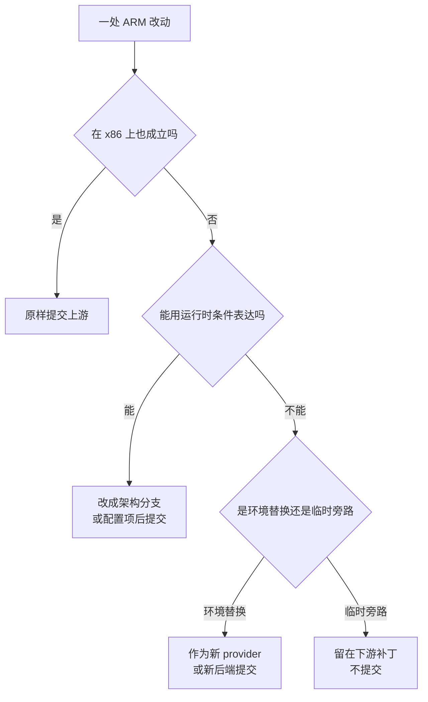

# 86 · 已知问题与技术债

> 第十部分逐篇讲了 ARM 适配版改了什么、为什么改。本篇把这些改动里**留下了后果的那些**收成一张清单：
> 每项给出现象、根因、影响范围、建议修法与向上游合并时的处理方式。清单只做汇总，不重新论证；
> 每条都指向讲它的那一篇。最后一节单列**继承自上游的问题**，与 ARM 适配严格分开。
>
> **读者**：准备接手这套代码做运维、做合并或做二次开发的工程师。
> **预备**：[第 67 篇 · ARM 适配总览](67-arm-port-overview.md)；本部分其余各篇按需查阅。
> **代码**：`git -C infra-arm diff f8c2f0cde fbee6fcd1`

---

## 0. 本篇要回答的问题

1. ARM 适配版有哪些已知的技术债？每一项的现象与根因分别是什么？
2. 哪些债会影响**正确性**，哪些只影响成本、可运维性或长期可维护性？
3. 每一项该怎么修？修法的代价是什么？
4. 把这套补丁往上游合并时，哪些改动能原样进上游，哪些必须先改形状，哪些不该进？
5. 哪些问题**不是** ARM 引入的，而是上游 2026.09 本来就有的？

---

## 1. 这份清单怎么读

### 1.1 四个严重度类别

「严重度」容易滑成主观排序。本篇把它定义成**后果的种类**，不是后果的大小：

| 类别 | 判据 | 典型症状 |
|---|---|---|
| 正确性 | 存在让结果与预期不符的执行路径 | 数据错、进程崩、约束失效 |
| 性能 | 结果正确，成本模型退化 | 更慢、更占带宽、更占内存 |
| 可运维性 | 结果正确，但故障不可见或恢复要人工介入 | 告警不响、日志无信息、重启后失配 |
| 可维护性 | 现在没有症状，代价在下一次改动时付 | 合并冲突、无法回退、无法多架构共存 |

这个分法有一条实用价值：**正确性类必须修，性能类要量化后再决定，可运维性类可以靠流程绕过，
可维护性类的成本随时间线性增长。** 排期时四类不该混在一个队列里。

### 1.2 两个来源

清单里的条目分两个来源，必须区分：

- **ARM 适配引入的**（第 2–6 节）：上游在 x86 + Ubuntu guest + GCP 上做的假设在目标平台不成立，
  补丁做了替换、放宽或旁路，其中一部分留下了后果。
- **继承自上游的**（第 7 节）：上游 2026.09 自身的缺陷或残留，ARM 适配版原样带过来，
  有的因部署选型不同而被放大。这一节的条目**不是 ARM 引入的**。

### 1.3 与上游合并的四种处理

四条路径对应本篇每条目末尾的「合并」字段：**原样**、**条件化**、**新实现**、**不提交**。

---

## 2. 正确性类

### 2.1 cgroup 记账关闭与 `CLONE_INTO_CGROUP` 移除

**现象**：宿主上不再存在按沙箱划分的 cgroup，Firecracker 进程落在 orchestrator 自己的 cgroup 里；
单个沙箱的 CPU、内存用量与 `memory.peak` 无从读取，也无法对单个沙箱做限额。

**根因**：`cgroup/manager.go` 的 `NewManager()` 在检测不到 cgroup v2 挂载点时由返回错误改为返回一个可用的
manager，`Initialize()` 在 v1 上直接返回；`fc/process.go` 的 `configure()` 里设置
`SysProcAttr.UseCgroupFD` 的三行被整段注释。补丁选择让这条路径整体失效而不是做兼容实现。

**影响范围**：所有沙箱的资源记账与限额；`memory.peak` 相关指标恒为空；一个失控沙箱可以吃满宿主内存。

**建议修法**：把「有没有 v2」做成显式的能力检测，v2 可用时恢复原路径，
不可用时降级并**在启动日志里声明降级**（当前是静默的）。代价是维护两条路径。

**合并**：不提交。这是临时旁路，上游合并时应还原。**详见**[第 73 篇 §2](73-cgroup-and-host-compat.md#2-cgroup关闭宿主侧记账)。

### 2.2 `socket.Wait` 丢失 ctx 取消传播

**现象**：等待 Firecracker 的 uffd socket 出现时，调用方的取消（请求超时、客户端断开、
errgroup 中兄弟任务失败）不再能中断这次等待；最坏情况多占住一组已分配资源 300 s。

**根因**：`socket/socket.go` 的 `Wait()` 在函数体内用 `context.WithTimeout(context.Background(), …)`
覆盖了同名的入参 `ctx`。给等待加自带上限是对的，但 `context.Background()` 切断了与父 context 的链接。

**影响范围**：恢复路径与创建路径的 FC 启动阶段；表现为「请求早已失败，资源却过很久才回收」。

**建议修法**：一行改动 —— `context.WithTimeout(ctx, …)`。既保留自带上限，又保留取消传播。

**合并**：条件化后提交（超时值走配置），但必须先修掉 `Background()`。
**详见**[第 71 篇 §4](71-orchestrator-arm-fc-changes.md#4-socketwait一个自带的-300-秒超时)。

### 2.3 内嵌 busybox 是 HTML 占位文件

**现象**：直接编译补丁树得到的 orchestrator，在 aarch64 上产出的模板里 `/init` 是一个 3611 字节的 HTML 文档，
沙箱起不来。

**根因**：`systeminit/busybox.go` 新增了按 `runtime.GOARCH` 选择二进制的 `init()`，
但仓库里的 `busybox_1.35_arm64` 与 `busybox_1.36.1-2_arm64` 两个文件都是 3611 字节、内容以
`<!DOCTYPE html>` 开头 —— 下载失败，落盘的是一个网页。真实二进制由单机离线版的
`e2b-infra.spec` 在 `%prep` 阶段覆盖，**只有直接编译补丁树的路径是坏的**。

**影响范围**：任何不经 RPM 打包流程的构建。这是清单里唯一「按最自然的方式使用代码就一定出错」的条目。

**建议修法**：补进真实二进制，并在 CI 里断言嵌入文件的 ELF 魔数与 `e_machine` 与目标架构一致。
断言比正确的二进制更重要：它让同类错误无法再次进入。

**合并**：不提交（大二进制不应进上游仓库）；上游用构建期下载 + 校验和的做法更合适。
**详见**[第 74 篇 §2](74-template-build-on-arm.md#2-内嵌-busybox一个不在源码里的二进制)。

### 2.4 `block/cache.go` 的 `recover()` 接不住 SIGBUS

**现象**：mmap 底层文件被截断或存储不可达时，写入触发 SIGBUS，Go 运行时把它当致命信号处理，
整个 orchestrator 进程终止 —— 而代码里那段 `defer recover()` 的注释写的是「捕获 SIGBUS/fault 等致命信号」。

**根因**：`WriteAtWithoutLock()` 加了 `defer func(){ if r := recover(); … }`。
`recover()` 只能接住 Go 的 panic，接不住 SIGBUS 这类由硬件产生、Go 运行时未安装可恢复处理的信号。
同时加上的三条参数检查（`mmap == nil`、偏移越界、`end <= off`）是有效的；唯独注释承诺的那一项做不到。

**影响范围**：注释造成的预期偏差本身就是风险 —— 读代码的人会以为这条路径已经安全。

**建议修法**：改注释，把三条参数检查的实际作用写清楚；真要处理 SIGBUS，
需要在写入前校验文件长度，或改用 `pwrite` 绕开 mmap，代价是失去零拷贝。

**合并**：参数检查可原样提交（对 x86 同样有价值），注释必须改。
**详见**[第 73 篇 §5](73-cgroup-and-host-compat.md#5-blockcachego-的四条防御)。

### 2.5 架构分支取代 `KvmClock` 选项门槛

**现象**：x86 上 `clocksource=kvm-clock` 变成无条件加入内核命令行，原先「envd 版本达到门槛才启用」的
保护失效；老 envd 的沙箱在 x86 上会拿到一个它未必能处理的时钟源参数。

**根因**：`fc/process.go` 的 `Create()` 把 `if options.KvmClock` 换成
`if runtime.GOARCH == "amd64" || runtime.GOARCH == "386"`，同时把 `pci=off`、`i8042.*`、
`random.trust_cpu` 一并移进这个分支。移进分支的四项是正确的，
被顺带吞掉的是 `KvmClock` 这个**与架构无关的版本门槛**。

**影响范围**：只影响 x86 部署；ARM 部署上这条分支不执行。

**建议修法**：两个条件相与 —— 架构判断决定 `pci` 等四项，`options.KvmClock` 单独决定 `clocksource`。

**合并**：条件化后提交。架构分支本身上游会需要，但必须保留 `options.KvmClock`。
**详见**[第 71 篇 §2](71-orchestrator-arm-fc-changes.md#2-内核命令行按架构分支)。

---

## 3. 性能类

### 3.1 读过即脏，且与预取相乘

**现象**：内存 diff 的体积从「真实脏页集」退化成「本次运行访问过的页集」，
pause 产物随沙箱存活时间增长而增长，与实际写入量脱钩。

**根因**：`uffd/userfaultfd/userfaultfd.go` 的 `faultPage()` 里，
为读缺页重新置上 `UFFDIO_COPY_MODE_WP` 的两行被注释。判据从「写过」塌缩成「触过」。

**影响范围**：所有 pause / resume 路径的产物体积、上传时间与对象存储占用；
与内存预取叠加时效应相乘 —— 预取把大量页提前搬进来，而这些页在新判据下全部记为脏。

**建议修法**：短期调低预取激进度以限制放大倍数；中期在 uffd-wp 支持完整的宿主内核上恢复这两行；
长期用 ARMv9.5 的 HDBSS 硬件标脏。三种修法的门槛与精度依次升高。

**合并**：不提交。注释掉 WP 是环境受限下的降级，不是改进。
**详见**[第 72 篇](72-uffd-on-arm.md)与[第 87 篇](87-beyond-checkpoint-restore.md)。

### 3.2 超时与并发上限全面放宽

**现象**：一批常量被上调一到三个数量级 —— `max-sandboxes-per-node` 200 → 10000、
`best-of-k-max-overcommit` 400 → 1200、`envd-init-request-timeout-milliseconds` 50 → 120000、
网络槽位池 32 / 100 → 300 / 1000、预取 worker 16 / 8 → 32 / 16、
`socket.Wait` 引入 300 s 上限、api 侧三个 HTTP 超时 5 / 10 / 75 s → 60 / 300 / 300 s、
`maxInstanceSyncCallTimeout` 1 s → 120 s。

**根因**：目标环境的单机规格、存储延迟与首启耗时都与上游的托管环境不同，
调参是把「跑得通」放在「跑得快、跑得准」之前的一次整体选择。

**影响范围**：放宽超时把「快速失败」换成「慢速挂起」，故障从秒级可见变成分钟级可见；
放宽并发上限让准入闸门实际上不再拦截，过载时的表现从拒绝新请求变成整体劣化。
`envd-init` 那一项还有个副作用：120 s 的单次超时与外层重试预算相当，重试退化成一次尝试。

**建议修法**：逐项按 p99 实测值加余量重设，而不是统一乘一个大系数；
并把它们从常量改成配置项。

**合并**：条件化后提交（改成配置项与默认值），不建议把新数值作为上游默认。
**详见**[第 71 篇 §9](71-orchestrator-arm-fc-changes.md#9-参数总表)与[第 77 篇](77-api-and-flags-on-arm.md)。

---

## 4. 可运维性类

### 4.1 健康检查放宽与 `timeoutGetMetrics` 不一致

**现象**：一个已经死掉的沙箱最长要 300 s 才被发现；同时，指标采集侧的
`timeoutGetMetrics` 仍是 100 ms，健康检查认为「envd 慢到 60 s 也算活着」，
而指标采集认为「超过 100 ms 就算失败」。同一个 envd 在两套判据下同时是「健康的」与「取不到指标的」。

**根因**：`sandbox/checks.go` 把 `healthCheckInterval` 从 20 s 改到 300 s、
`healthCheckTimeout` 从 100 ms 改到 60 s；`metrics/sandboxes.go` 的 `timeoutGetMetrics`
没有同步调整，两个基线里都是 100 ms。

**影响范围**：死沙箱的发现延迟；沙箱级指标的缺失率；两者叠加时排障会得到互相矛盾的证据。

**建议修法**：两个超时应当有明确的关系（例如指标超时不小于健康检查超时的若干分之一），
并从同一处配置派生，而不是各自写死。

**合并**：条件化后提交。**详见**[第 73 篇 §4](73-cgroup-and-host-compat.md#4-健康检查两个放宽的常量与一个没跟着改的)。

### 4.2 `[Pool Status]` 日志占位符不生效

**现象**：网络槽位池每补一个槽位就打一条日志，正文里的 `%d` 原样出现，
四个数值以结构化字段的形式挂在旁边 —— 日志能读，但形式是坏的，而且这条日志的频率等于槽位创建频率。

**根因**：`network/pool.go` 的 `Populate()` 里，`logger.L().Info()` 的第二个参数是消息串而不是格式串，
后面跟的是 `zap.Int(...)` 字段。zap 的结构化接口不做格式替换。

**影响范围**：日志可读性与日志量。池大小改到 300 / 1000 之后，启动期这条日志会刷出上千行。

**建议修法**：去掉消息里的 `%d` 与 `\n`，只留字段；把这条日志降级到 Debug，
或改成周期性采样输出而不是每槽位一条。

**合并**：不提交（这是排障期的临时埋点）。**详见**[第 71 篇 §7](71-orchestrator-arm-fc-changes.md#7-网络槽位池32--100--300--1000)。

### 4.3 edge 作业跑的是 client-proxy 镜像

**现象**：Nomad 形态下名为 edge 的作业实际运行 client-proxy 镜像，作业名也仍是 `client-proxy`；
`EDGE_API_PORT=3001` 被声明、被 `LOCAL_CLUSTER_ENDPOINT=localhost:3001` 引用，
但没有任何进程在 3001 上监听；`EDGE_SECRET`、`SERVICE_DISCOVERY_*` 等变量两个基线的代码都不读取；
`ENVIRONMENT=dev` 写死在作业的 env 里。

**根因**：上游的 edge API 服务端不在开源仓库内，ARM 适配版沿用了上游的作业模板骨架，
把不存在的服务端所需的配置一并保留了下来。

**影响范围**：任何按配置文件推断拓扑的人都会推断错；健康探针指向 `/health/traffic`
之所以能过，是因为它是一个裸 `HandlerFunc`，与 edge API 无关；
`ENVIRONMENT=dev` 让沙箱自动恢复（auto-resume）默认打开，改变了沙箱到期后的行为。

**建议修法**：删掉不被读取的变量与端口声明，作业改名以反映实际内容；
`ENVIRONMENT` 提升为部署参数并默认为生产值。

**合并**：不提交。**详见**[第 56 篇](56-edge-api.md)、[第 78 篇 §7](78-helm-k8s-deployment.md#7-environment-的两副面孔)与[第 79 篇](79-nomad-multinode-deployment.md)。

### 4.4 template-manager 删掉 `kill_timeout`

**现象**：升级或重调度 template-manager 时，正在进行的模板构建会在 Nomad 默认的宽限期内被杀掉，
而一次构建可能远长于这个宽限期。

**根因**：ARM 适配版重写 `template-manager.hcl` 时，连同 autoscaler 相关的 `scaling` 与 `update` 块，
一并删掉了 `kill_timeout = "70m"` 与 `progress_deadline = "80m"`。上游用这个长得反常的值
换取「不打断长构建」。

**影响范围**：所有跨越一次部署动作的模板构建；表现为构建莫名失败，日志里看不出原因。

**建议修法**：恢复 `kill_timeout`，按实测的构建时长分布取值；同时需要 Nomad 客户端的
`max_kill_timeout` 配合。

**合并**：不提交。**详见**[第 46 篇](46-template-manager-service.md)与[第 64 篇](64-nomad-jobs.md)。

### 4.5 `LocalArtifactsRegistry.Delete()` 是空实现

**现象**：删除模板时，镜像仓库里的构建产物不会被删除，磁盘占用只增不减。

**根因**：`shared/pkg/artifacts-registry/registry_local.go` 的 `Delete()` 直接返回 `nil`，
注释是「for now, just assume local image can be deleted manually」。
这段代码**在上游 2026.09 里就是这样**；ARM 适配版没有改它，
但把 `ARTIFACTS_REGISTRY_PROVIDER` 设成 `Local`，于是这条空实现从边缘路径变成了主路径。

**影响范围**：单机离线版与 Harbor 部署的长期磁盘占用。

**建议修法**：为 Harbor 实现一个真的 registry provider；或在部署侧加一个按 build ID 回收的定时任务。

**合并**：上游代码无需改动；新增 provider 属于「新实现」路径，可以提交。
**详见**[第 46 篇](46-template-manager-service.md)与[第 80 篇](80-single-node-rpm.md)。

### 4.6 nbd 模块改为手工固化

**现象**：宿主初始化脚本不再加载 nbd 模块；换成一份文档步骤，要求管理员手工把自编译的
`nbd.ko`（`nbds_max=512`）覆盖进系统模块目录，并写 `modules-load.d` 与 `modprobe.d` 两个配置。

**根因**：上游的 `init-client.sh` 用 `modprobe nbd nbds_max=4096`，依赖发行版内核自带的模块；
目标宿主用的是自编译内核，需要一个与之 vermagic 一致的自编译模块，脚本无法自动完成这件事。

**影响范围**：部署的可重复性。**最危险的一点是它会静默失效**：内核包升级后，
新内核目录里是发行版原版模块，开机照常加载、`nbds_max` 照常是 512，
从设备数上看不出异常，但跑的已经不是打过补丁的模块。

**建议修法**：把模块打进 RPM 并声明对内核版本的依赖，让包管理器承担 vermagic 一致性；
或在启动自检里比对模块的校验和。

**合并**：不提交（属于部署环境）。**详见**[第 82 篇](82-host-kernel-nbd-hugepages.md)与[第 80 篇](80-single-node-rpm.md)。

### 4.7 `provision.sh` 去掉四个包

**现象**：guest 里不再安装 `fuse3`、`iptables`、`git`、`nfs-common`。
依赖 FUSE 的用户程序、guest 内的防火墙规则、`git` 命令、NFS 挂载在沙箱里都不可用。

**根因**：改写 `provision.sh` 以支持 openEuler 时，包列表按「openEuler 上能装到的」做了收缩，
四个包的取舍没有留下记录。其中 `nfs-common` 的缺失直接影响 volumes 功能 —— 挂载 NFS 需要它。

**影响范围**：模板的默认能力集。用户模板可以自己补装，但默认镜像的行为与上游不同。

**建议修法**：逐个确认 openEuler 上的对应包名（`fuse3`、`iptables`、`git`、`nfs-utils`）并补回；
装不上的在文档里显式声明为「本形态不支持」。

**合并**：条件化后提交（包列表按发行版分支）。
**详见**[第 74 篇 §4](74-template-build-on-arm.md#4-openeuler-guestprovisionsh)与[第 40 篇](40-volumes-and-nfsproxy.md)。

---

## 5. 可维护性类

### 5.1 `DefaultPlatform` 硬编码为 arm64

**现象**：`template/build/core/oci/oci.go` 的 `DefaultPlatform` 从 `amd64` 改成 `arm64`。
这是一个包级常量，改完之后这份二进制只能拉 arm64 镜像。

**根因**：拉取基础镜像时需要一个默认平台，上游把它写成常量。
补丁改的是常量值而不是取值方式。

**影响范围**：同一份代码不能同时服务 x86 与 arm64 节点，多架构共存的前提被这一行否掉。

**建议修法**：改成由 `runtime.GOARCH` 派生，或按目标节点的架构传入。前者一行，后者要改调用链。

**合并**：条件化后提交。**详见**[第 74 篇 §3](74-template-build-on-arm.md#3-defaultplatform把架构写死在常量里)。

### 5.2 `bin/orchestrator` 编译产物入库

**现象**：补丁里包含一个 113 MB 的 aarch64 ELF 可执行文件 `bin/orchestrator`，
被 `start-client.sh` 复制成 `/usr/bin/orchestrator` 与 `/usr/bin/template-manager`。

**根因**：离线环境里没有构建流水线，最省事的分发方式是把产物提交进仓库。

**影响范围**：仓库与 diff 体积；二进制与源码的对应关系无法核验；向上游提 PR 时这个文件是硬阻塞。

**建议修法**：产物走 RPM 或制品仓库分发，仓库里只留源码；过渡期至少记录构建它的 commit 与校验和。

**合并**：不提交。**详见**[第 85 篇](85-dev-workflow-and-packaging.md)。

### 5.3 `DefaultFirecrackerVersion` 改成无 SHA 的 `v1.13.1`

**现象**：`feature-flags/flags.go` 里 `DefaultFirecackerV1_10Version` 与
`DefaultFirecackerV1_12Version` 都被改成 `"v1.13.1"`，两个常量取同一个值，且不再带短 SHA 后缀。
这个字符串是宿主上 `/fc-versions/<version>/firecracker` 的目录名，
而实际装进去的二进制源码版本是 1.12.1。

**根因**：离线环境只有一个自编译的 Firecracker 二进制，把两个常量指向同一目录是最直接的做法；
去掉 SHA 是因为自编译产物没有对应的构建流水线短 SHA。

**影响范围**：版本号不再能定位到源码；两个常量同值让「按 FC 版本做特性门槛」的逻辑失去区分能力
（例如大页开启的 FC ≥ 1.7 判据）。

**建议修法**：目录名保留构建可追溯的标识（例如 `v1.12.1_<源码短 SHA>`），
让版本字符串继续承担「定位源码」这个职责。

**合并**：不提交。**详见**[第 70 篇 §4](70-firecracker-fork.md#4-版本命名源码-1121装成-v1131)与[第 77 篇 §5](77-api-and-flags-on-arm.md#5-firecracker-版本常量与一处越界保护)。

### 5.4 `DefaultStorageProvider` 与一批 flag 默认值的改动

**现象**：`shared/pkg/storage/storage.go` 的 `DefaultStorageProvider` 从 `GCPBucket` 改成
`MinioBucket`；`feature-flags/flags.go` 里七八个 fallback 值被改。这些都是**默认值**的改动，
不是新增能力。

**根因**：目标环境没有特性开关服务，所有 flag 恒取 fallback，于是「改默认值」成了唯一的配置手段。

**影响范围**：与上游的每次同步都会在这几个文件上产生冲突，且冲突内容是数值 —— 工具无法判断该取哪边，
每次都要人来决定。这是可维护性成本随时间线性累积的典型形态。

**建议修法**：MinIO provider 的**实现**（`storage_minio.go`、`GetTemplateStorageProvider` 的新 case）
是干净的新增，可以直接提交上游；`DefaultStorageProvider` 的值应留在下游，
或改由环境变量在启动时决定。flag 默认值同理 —— 提交「让它可配」，不提交「把它改成这个数」。

**合并**：新实现 + 条件化。**详见**[第 75 篇 §5](75-minio-storage.md#5-把默认-provider-改成-minio)与[第 77 篇 §1](77-api-and-flags-on-arm.md#1-没有开关服务的部署开关就是常量)。

### 5.5 `build-provision-version` 无开关服务时退回脚本正文

**现象**：基础层的缓存键里，「provision 版本」这一项在离线部署下**恒为 `provision.sh` 的完整正文**。

**根因**：`template/build/phases/base/hash.go` 的 `Hash()` 先把 `provisionVersion` 设成嵌入的脚本内容，
只有当特性开关返回值不等于 fallback（0）时才换成版本号。没有开关服务时永远取不到非 fallback 值。

**影响范围**：行为是正确的 —— 脚本变了缓存就该失效。代价是缓存键里塞进了整个脚本，
且**任何空白字符的改动都会让全体团队的基础层缓存失效**。

**建议修法**：fallback 分支改成脚本内容的哈希；或把 provision 版本做成编译期常量，由构建流程写入。

**合并**：条件化后提交（改成哈希对上游也是改进）。
**详见**[第 45 篇](45-layers-and-build-cache.md)与[第 77 篇](77-api-and-flags-on-arm.md)。

### 5.6 内核 `0002` 补丁与交付二进制脱节

**现象**：`fc-kernels-arm/patches/` 下有一份 1214 行的 overlayfs 热切换补丁 `0002`，
但当前交付的 guest 内核二进制里不含它。

**根因**：`0002` 服务的是后续的 checkpoint / restore 功能，尚未进入交付路径；
补丁留在仓库里而构建脚本没有应用它。

**影响范围**：读仓库的人会以为交付的内核带这个补丁。这是一处「源码与产物不一致」，
与 5.2 的二进制入库是同一类问题的两个方向。

**建议修法**：在构建脚本里显式标注哪些补丁进入当前交付，或把未启用的补丁移到单独目录。

**合并**：不提交。**详见**[第 69 篇 §6](69-guest-kernel-for-arm.md#6-两个内核补丁)与[第 87 篇](87-beyond-checkpoint-restore.md)。

---

## 6. 部署、SDK 与工具链侧的条目

第 2–5 节展开论证的条目，来源都是 infra 补丁本身。单机离线版的部署脚本、SDK 覆盖层、分叉 Firecracker
与压测工具链上还有一批同样留下后果的条目，分散在第 70、74–84 篇里。
它们的类别判据与前四节相同，这里一条一行汇总，论证仍在各自那一篇。

| 条目 | 类别 | 现象与根因 | 合并 | 详见 |
|---|---|---|---|---|
| aarch64 seccomp 白名单缺 `pread64` | 正确性 | 分叉 Firecracker 的 `resources/seccomp/aarch64-unknown-linux-musl.json` 里没有 `pread64`，而 x86 那份有；走到该系统调用的路径会被过滤器杀掉，构建时只能靠放宽或绕开 | 条件化 | [第 70 篇 §3](70-firecracker-fork.md#3-在-aarch64-上构建) |
| `resize_fdtable()` 被整段注释 | 可维护性 | `src/firecracker/src/main.rs` 里把预扩 fd 表的调用注释掉而不是按平台分支；注释掉的代码没有说明何时可以恢复 | 不提交 | [第 70 篇 §2](70-firecracker-fork.md#2-分叉改了什么) |
| MinIO 的「对象不存在」哨兵与全局哨兵失配 | 正确性 | `storage_minio.go` 返回包内私有的 `errObjectNotExist`，而包外调用方判的是 `storage.ErrObjectNotExist`；两个变量文本相同、身份不同，`errors.Is` 恒为假，「不存在」被当成真错误 | 原样（上游也需要） | [第 75 篇 §3.4](75-minio-storage.md#34-错误映射两个只差一个字母的哨兵) |
| Helm 的 orchestrator 缺 `MINIO_SECRET_KEY` | 可运维性 | `helm/templates/orchestrator.yaml` 只注入 `MINIO_ENDPOINT` 与 `MINIO_ACCESS_KEY`，同目录的 `template-manager.yaml` 三个都注入；orchestrator 侧访问对象存储会鉴权失败 | 条件化 | [第 75 篇 §6](75-minio-storage.md#6-三种部署形态各用哪个-provider)、[第 78 篇 §4](78-helm-k8s-deployment.md#4-配置与密钥) |
| `STORAGE_PROVIDER=Local` 时 `InitLayerFileUpload` 必失败 | 正确性 | 该 RPC 无条件调 `buildStorage.UploadSignedURL()`，而 `storage_fs.go` 的实现直接返回「不支持签名 URL」；单机离线版的 `template-manager.hcl` 恰好把 provider 写死成 `Local` | 条件化 | [第 75 篇 §6](75-minio-storage.md#6-三种部署形态各用哪个-provider)、[第 80 篇 §9](80-single-node-rpm.md#9-已知的坑) |
| `install-consul.sh` / `install-nomad.sh` 仍在线下载 | 可运维性 | 两个脚本从 `releases.hashicorp.com` 取 zip 包；多节点形态因此不是真正离线，单机形态靠预装的二进制绕过 | 不提交 | [第 79 篇 §5](79-nomad-multinode-deployment.md#5-集群自举的四个脚本) |
| 三处模板渲染残留 | 可运维性 | `edge.hcl` 留着 Terraform 才有的 `${redis_tls_ca_base64}`、otel 配置里单个 `$` 被 envsubst 吃掉、`init-client.sh` 从不设置 `FIRECRACKER_VERSION` 因而建出 `/fc-versions/v/` 这个空版本目录 | 不提交 | [第 79 篇 §3](79-nomad-multinode-deployment.md#3-渲染层从-templatefile-换成-envsubst) |
| `/usr/bin` 下的二进制不随 RPM 升级 | 可运维性 | `%build` 编出的产物装进 `/opt/e2b-infra/bin/`，而实际运行的 `/usr/bin/orchestrator` 与 `/usr/bin/template-manager` 由 `dep/start-client.sh` 从部署包里预编译的 `dep/bin/orchestrator` 复制；升级 RPM 不换这一份 | 不提交 | [第 80 篇 §7](80-single-node-rpm.md#7-一个进程两个角色)、[第 85 篇 §5](85-dev-workflow-and-packaging.md#5-必须成对更新的东西) |
| `daemon.json` 硬编码镜像仓库 IP | 可运维性 | `dep/daemon.json` 的 `insecure-registries` 写死 `173.118.9.2:2900`，与 `.env` 里的服务器地址各写各的；换机器要改两处，漏一处的表现是拉镜像被 TLS 校验挡住 | 不提交 | [第 81 篇 §4.3](81-single-node-traffic.md#43-另一条通路docker-daemon-直连-2900) |
| `setenforce 0` 不写 `/etc/selinux/config` | 可运维性 | `build.sh` 的 `install()` 只改当前运行状态，重启后 SELinux 回到 enforcing；症状是「同一台机器重启前正常、重启后到处权限拒绝」 | 不提交 | [第 82 篇 §6.3](82-host-kernel-nbd-hugepages.md#63-selinux) |
| 大页预留的两条写入路径不一致 | 可维护性 | `.github/actions/host-init/init-client.sh` 写 `hugepages-2048kB` 的 sysfs 档位，`dep/init-client.sh` 仍写 `/proc/sys/vm/nr_hugepages`；两份脚本对「默认档位是不是 2 MiB」的假设不同，同一台机器上跑两遍得到两种结果 | 条件化 | [第 82 篇 §4.2](82-host-kernel-nbd-hugepages.md#42-写哪个文件上游的假设与-arm-的修正) |
| `net.netfilter.nf_conntrack_max` 未设置 | 性能 | 上游把它放在 GCP 节点镜像里而不是启动脚本里，单机离线版因此一并缺席，用发行版默认值；表满后新连接间歇性失败，与应用层问题不易区分 | 条件化 | [第 82 篇 §5.2](82-host-kernel-nbd-hugepages.md#52-没配的) |
| SDK 到 envd 全链路明文 | 正确性 | 443 归 nginx 与 Harbor、client-proxy 不持证书，所以 SDK 到 client-proxy、client-proxy 到 orchestrator、orchestrator 到 envd 三段全是 `http`；能抓到该网段的进程可读到 `X-Access-Token` 与用户代码 | 不提交 | [第 83 篇 §2](83-sdk-adaptation.md#2-私有环境里这四条为什么都不成立) |
| `COPY --chown=` 解析退化 | 正确性 | 覆盖版 `dockerfile_parser.py` 删掉了标志解析，`COPY --chown=user:user a b` 会把 `--chown=user:user` 当成源路径；失败静默、错在构建产物里 | 条件化 | [第 83 篇 §5.4](83-sdk-adaptation.md#54-dockerfile_parserpy默认用户与-copy-标志) |
| SDK 覆盖层改的是安装产物 | 可维护性 | 五个文件直接铺进 `site-packages`，一次 `pip install -U e2b` 就把它们冲回上游版本，换虚拟环境或 Python 小版本也要重跑 `install_e2b()`；没有任何机制在运行时发现覆盖层已失效 | 新实现（发私有包） | [第 83 篇 §4](83-sdk-adaptation.md#4-覆盖层怎么落到-site-packages) |
| `fc-netns-exec` 默认开启且不校验二进制 | 正确性 | `E2B_FC_NETNS_EXEC_HELPER` 缺省即启用 helper 路径，二进制不存在时 bash 报 command not found，`configure` 以 `exit status 127` 失败；该 helper 只在单机离线版的补丁里，不在 ARM 适配版基线中 | 条件化 | [第 84 篇 §6.1](84-arm-performance.md#61-主战场configured-fc) |
| 缺 x86 对照数据 | 可维护性 | 恢复耗时与快照体积都只有 aarch64 这一侧的样本，且多数记录缺机型、内核与并发度；现有数字只能说明「这台机器上是这个量级」，支撑不了架构对比 | 不提交 | [第 84 篇 §6.4](84-arm-performance.md#64-缺的那一半x86-对照) |
| 目标平台不进基础层 hash | 正确性 | `phases/base/hash.go` 的 `Hash()` 只把索引版本、provision 版本、磁盘大小与基础镜像名喂给 `cache.HashKeys()`，架构不在其中；`DefaultPlatform` 改成 arm64 之后，同一个缓存 scope 里 x86 与 arm64 的基础层会互相命中 | 条件化 | [第 74 篇 §3](74-template-build-on-arm.md#3-defaultplatform把架构写死在常量里)、[第 45 篇 §2](45-layers-and-build-cache.md#2-hash-怎么算) |
| `GetNodeIP()` 与 `TEMPLATE_MANAGER_HOST` 无读取方 | 可维护性 | 前者是 `shared/pkg/env/env.go` 里全仓无调用方的函数，后者是 Helm `api.yaml` 里没有任何代码读的变量；两者都让配置文件看上去描述了一套并不存在的机制 | 不提交 | [第 90 篇 §6](90-config-reference.md#6-无读取方的残留条目) |
| `maxInstanceSyncCallTimeout` 改了但不生效 | 可运维性 | 该常量从 1 s 放宽到 120 s，但调用它的同步轮次由 `cluster.go` 的 `instancesSyncTimeout = 5 * time.Second` 建 ctx，实际上限仍是 5 s；调参看似生效，实测行为不变 | 条件化 | [第 77 篇 §7.2](77-api-and-flags-on-arm.md#72-maxinstancesynccalltimeout改了-120-倍实际生效-5-倍)、[第 76 篇 §8](76-k8s-discovery.md#8-没有被覆盖的路径) |

这 20 条与第 2–5 节的分布不同：**正确性类占了 8 条，而且多数是「静默出错」而非「明确失败」**
—— 哨兵失配把「对象不存在」变成真错误、`COPY --chown` 把标志当路径、层 hash 漏掉架构让两种
架构的缓存互相命中。它们的共同修法也一致：把隐式约定变成一次显式判断，
成本都在几行以内，难的是先知道有这回事。

---

## 7. 继承自上游的问题

以下条目在上游 2026.09 里就存在，**不是 ARM 适配引入的**。列出它们是因为运维时会遇到，
其中几条在 ARM 的部署选型下更容易触发。

| 条目 | 类别 | 位置与现象 | 讲解 |
|---|---|---|---|
| API key 无盐哈希 | 正确性 | `shared/pkg/keys/sha256.go` 的 `Hash()` 用裸 `sha256.Sum256`，无盐、单轮；管理员 token 在 `auth/pkg/auth/middleware.go` 的 `adminValidationFunction()` 里用 `!=` 直接比较，非常量时间 | [第 16 篇](16-auth-and-multitenancy.md) |
| client-proxy 两个连接数指标名实对调 | 可运维性 | `client-proxy/internal/proxy/proxy.go`：`ClientProxyPoolConnections…` 观测的是 `CurrentServerConnections()`，`ClientProxyServerConnections…` 观测的是 `CurrentPoolConnections()` | [第 54 篇](54-shared-proxy-library.md)、[第 60 篇](60-telemetry.md) |
| `TEMPLATE_BUCKET_NAME = "skip"` | 可维护性 | `api.hcl` 里的残留值，两个基线都有；靠「这个变量在 api 里不再被使用」才不出错 | [第 64 篇](64-nomad-jobs.md) |
| 端口 40234 魔数 | 可维护性 | `api.hcl` 与 `loki.hcl` 里同一个静态端口硬编码两处，无常量、无注释 | [第 64 篇](64-nomad-jobs.md) |
| conntrack 残留 | 正确性 | 槽位归还时不冲刷 conntrack；新旧沙箱地址完全相同，残留条目在五元组碰撞时可能让新沙箱的包被判为已建立连接 | [第 35 篇](35-sandbox-networking.md) |
| `RemoveNetwork()` 可能 panic | 正确性 | `network/network.go`：`iptables.New()` 失败时会 panic 而不是返回错误 | [第 35 篇](35-sandbox-networking.md) |
| 槽位池 `Close()` 竞态 | 正确性 | `Return()` 的 `select` 与 `Close()` 的 `close(p.reusedSlots)` 重叠时，存在向已关闭 channel 发送的窗口 | [第 35 篇](35-sandbox-networking.md) |
| 槽位 `idx 0` 永久泄漏 | 可运维性 | Consul 后端的 `Acquire()` 从 0 开始随机，而 `NewSlot()` 拒绝 `idx < 1`：CAS 已成功、键已写入却不会被释放 | [第 35 篇](35-sandbox-networking.md) |
| 根 `make test` 跑不通 | 可维护性 | 完整仓库下部分模块（如 `packages/auth`）没有 Makefile，根目标直接失败 | [第 62 篇](62-testing.md) |
| 只写不读的表与缓存 | 可维护性 | `sandbox_events`、`sandbox_host_stats` 仓库内无读取方；`ListCachedBuilds` / `buildCache` 只写不读，缓存亲和性未接入放置 | [第 59 篇](59-clickhouse.md)、[第 19 篇](19-node-management-and-placement.md) |
| 无调用点的代码 | 可维护性 | `SandboxLogger.Metrics()`、`ParseSandboxCatalogCreateEvent()` 均无调用者；`get_memory_dirty_*.go` 是无 operationId 的残留生成文件 | [第 60 篇](60-telemetry.md)、[第 89 篇](89-code-map.md) |
| volume 键不一致 | 正确性 | `VolumeService` 用 `<teamID>/<volumeID>`，nfsproxy 用 `<teamID>/<volumeName>` | [第 40 篇](40-volumes-and-nfsproxy.md) |

这一节里 ARM 部署选型会放大的有两条：`LocalArtifactsRegistry.Delete()` 的空实现（见 §4.5，
因为 `ARTIFACTS_REGISTRY_PROVIDER=Local` 成了默认），以及 conntrack 残留
（因为单机形态下沙箱创建与销毁的频率集中在一台机器上）。

---

## 8. 汇总表

| # | 条目 | 类别 | 合并策略 | 讲解 |
|---|---|---|---|---|
| 2.1 | cgroup 记账关闭与 `CLONE_INTO_CGROUP` 移除 | 正确性 | 不提交 | 73 |
| 2.2 | `socket.Wait` 丢失 ctx 取消传播 | 正确性 | 条件化 | 71 |
| 2.3 | 内嵌 busybox 是 HTML 占位 | 正确性 | 不提交 | 74 |
| 2.4 | `block/cache.go` 的 `recover()` 接不住 SIGBUS | 正确性 | 部分原样 | 73 |
| 2.5 | 架构分支吞掉 `KvmClock` 门槛 | 正确性 | 条件化 | 71 |
| 3.1 | 读过即脏，且与预取相乘 | 性能 | 不提交 | 72 |
| 3.2 | 超时与并发上限全面放宽 | 性能 | 条件化 | 71、77 |
| 4.1 | 健康检查与 `timeoutGetMetrics` 不一致 | 可运维性 | 条件化 | 73 |
| 4.2 | `[Pool Status]` 占位符不生效 | 可运维性 | 不提交 | 71 |
| 4.3 | edge 作业跑 client-proxy 镜像 | 可运维性 | 不提交 | 56、78、79 |
| 4.4 | template-manager 删 `kill_timeout` | 可运维性 | 不提交 | 46、64 |
| 4.5 | `LocalArtifactsRegistry.Delete()` 空实现 | 可运维性 | 新实现 | 46、80 |
| 4.6 | nbd 模块手工固化 | 可运维性 | 不提交 | 82、80 |
| 4.7 | `provision.sh` 去掉四个包 | 可运维性 | 条件化 | 74、40 |
| 5.1 | `DefaultPlatform` 硬编码 arm64 | 可维护性 | 条件化 | 74 |
| 5.2 | `bin/orchestrator` 入库 | 可维护性 | 不提交 | 85 |
| 5.3 | `DefaultFirecrackerVersion` 无 SHA | 可维护性 | 不提交 | 70、77 |
| 5.4 | 默认 provider 与 flag 默认值改动 | 可维护性 | 新实现 + 条件化 | 75、77 |
| 5.5 | `build-provision-version` 退回脚本正文 | 可维护性 | 条件化 | 45、77 |
| 5.6 | 内核 `0002` 与交付二进制脱节 | 可维护性 | 不提交 | 69、87 |

这张表只列第 2–5 节展开论证的 20 条。按类别计数：正确性 5 项、性能 2 项、可运维性 7 项、可维护性 6 项；
按合并策略计数：不提交 11 项、条件化 7 项、新实现或部分原样 3 项（5.4 计两次）。
第 6 节另有 20 条一行条目，覆盖部署脚本、SDK 覆盖层、分叉 Firecracker 与压测工具链。

## 9. 小结

- 这套补丁的技术债集中在四个类别，其中**正确性类 5 项必须修**，
  修法都不大：`socket.Wait` 一行，`KvmClock` 一个与条件，busybox 一个 CI 断言，
  `block/cache.go` 一段注释，cgroup 一个显式降级开关。
- **最危险的一项是内嵌 busybox 的 HTML 占位文件**：按最自然的方式编译这棵树会得到坏产物，
  只有走 RPM 打包路径才是好的。这类问题应当由 CI 断言而不是由文档来防。
- **性能类只有两项，但影响面最大。** 读过即脏改变了整个 pause / resume 的成本模型；
  超时与并发放宽把系统的失败模式从「快速拒绝」换成了「慢速劣化」。
  两者都不该靠继续调参解决，前者要等内核或硬件能力，后者要逐项实测定标。
- **可运维性类的共同形状是「静默」**：cgroup 降级不打日志、nbd 模块换回原版看不出来、
  健康检查放宽后死沙箱悄悄挂着、指标名对调让面板长期指向错误的量。静默失效比响亮的失败贵得多。
- **可维护性类的成本随时间线性增长**，且几乎全部集中在「改默认值」这一种做法上。
  把「让它可配」与「把它设成这个值」分开，是这套补丁向上游收敛的最短路径。
- 与上游合并时，展开的 20 项里有 11 项**不该进上游** —— 它们是环境受限下的旁路或部署细节。
  真正有上游价值的是三块：MinIO provider、Kubernetes 服务发现、按架构分支的内核命令行与包列表。
- 第 6 节把部署脚本、SDK 覆盖层、分叉 Firecracker 与压测工具链上的 20 条一行汇总，
  其中正确性类占 8 条，且多数是静默出错。
- 第 7 节列的 12 项**继承自上游**，改法不在这套补丁的职责范围内；
  其中 conntrack 残留与 `LocalArtifactsRegistry.Delete()` 在 ARM 的部署选型下更容易触发。

---

## 延伸阅读 / 下一篇

- [第 67 篇 · ARM 适配总览](67-arm-port-overview.md)：改动地图与三种改动性质，本篇是它的「后果」侧。
- [第 71 篇 · orchestrator 的 ARM 改动 I](71-orchestrator-arm-fc-changes.md)、
  [第 72 篇 · 写保护退化](72-uffd-on-arm.md)、
  [第 73 篇 · 宿主兼容](73-cgroup-and-host-compat.md)：本篇第 2、3 节多数条目的论证在这三篇。
- [第 77 篇 · API 层与特性开关默认值的调整](77-api-and-flags-on-arm.md)：放宽的常量逐项对照。
- [第 84 篇 · ARM 性能实测](84-arm-performance.md)：第 3 节两项性能债的量化。
- [第 87 篇 · 后续功能开发](87-beyond-checkpoint-restore.md)：读过即脏的长期修法与多架构共存的展望。
- 下一篇：[第 87 篇 · checkpoint / restore 与展望](87-beyond-checkpoint-restore.md)。
