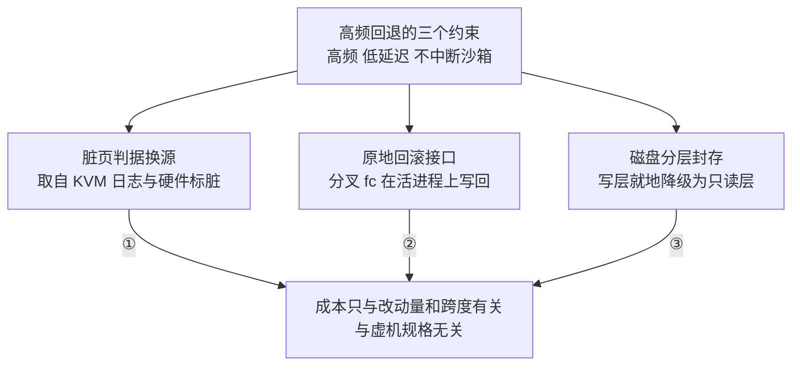

# 87 · 后续功能开发：checkpoint / restore 与展望

> 本篇处理两件收尾的事：一是给「在活着的沙箱内部做高频回退」这项后续功能一个入口 ——
> 它有独立的一套手册，本书只讲问题、定位与三处关键能力的轮廓，细节全部指过去；
> 二是把几条已经看得见、但还没有结论的方向列出来，标明哪些是事实、哪些是判断。
>
> **读者**：读完第十部分的所有人。　**预备**：[第 37 篇](37-pause-and-snapshot.md)、[第 72 篇](72-uffd-on-arm.md)。
> **代码**：`packages/orchestrator/internal/server/sandboxes.go`、`packages/api/internal/orchestrator/placement/cpu_compatibility.go`、`fc-kernels-arm/patches/6.1.158/`

---

## 0. 本篇要回答的问题

1. 沙箱已经有 pause / resume 了，为什么还要另做一套回退机制？成本模型差在哪一项？
2. 上游 2026.09 里已经有一个叫 `Checkpoint` 的 RPC，它和那套后续功能是同一件事吗？
3. 那套后续功能由哪三处关键能力支撑？每一处解决什么问题、代价是什么？
4. `fc-kernels-arm` 里那个 overlayfs 热切换内核补丁是干什么用的？它在交付物里吗？
5. 还有哪些方向是明确的、哪些只是判断？

---

## 1. 问题：原生的成本模型与高频回退不匹配

### 1.1 场景

一个 Agent 在沙箱里执行多步任务：拉代码、装依赖、改配置、跑构建、跑测试。
第七步把环境改坏了，它要回到第六步结束时的状态换个做法重试。

这个需求有三个特征，它们决定了后面所有的技术选择：

- **高频**。不是一天几次，是一个任务里十几次。单次成本必须低到可以随手用。
- **低延迟**。回退发生在 Agent 的决策循环里，几百毫秒和几秒是不同的产品体验。
- **沙箱不能中断**。沙箱有 IP、有端口映射、有正在保持的连接、有外部持有的引用，
  中断一次这些全要重建。

「重做一遍」在这三条上全不成立：装依赖要分钟级、中间步骤可能有不可重复的外部副作用、
重做出来的环境不保证与原来逐字节一致。「为每条命令写反操作」也不成立 —— Agent 会执行任意命令。
剩下的路只有虚机级快照：不理解做了什么，只记录状态是什么。

### 1.2 原生的两个 RPC 做了什么

上游 2026.09 的 `packages/orchestrator/internal/server/sandboxes.go` 里有两个相关的 RPC。
`Server.Pause` 取到沙箱后先 `defer s.stopSandboxAsync(...)`，再调 `snapshotAndCacheSandbox()`
把快照写进对象存储 —— 语义是「打完快照就让沙箱离场」。

`Server.Checkpoint` 比它多一步：同样先安排停掉旧沙箱、同样打一次快照，
再用 `s.templateCache.GetTemplate()` 取回刚写下的 build，
调 `s.sandboxFactory.ResumeSandbox()` 从这份新快照重新拉起一个沙箱。
拉起时 `RuntimeMetadata` 的 `SandboxID` 与 `ExecutionID` 原样传入，
注释写明 `LifecycleID` 必须换新，否则旧沙箱的清理协程会用 `RemoveByLifecycleID`
把新沙箱从表里删掉。

结论直接写在这两段代码里：**对外的沙箱身份不变，底下已经是一个新的 Firecracker 进程。**
新进程要重新建 KVM VM、vCPU、GIC、virtio 设备、tap、netns 与 uffd 处理线程，
再靠缺页把整个工作集换回内存。所以原生路径的代价基本与**虚机规格**挂钩，
与「这次改了多少」关系不大：回退一个只改了 40 MiB 的沙箱，和回退一个改了 2 GiB 的，耗时接近。
两个 RPC 的差别见[第 37 篇 §8](37-pause-and-snapshot.md#8-checkpoint-与-pause-的区别)。

### 1.3 ARM 适配版上还多一层退化

上游在 x86 上用 userfaultfd 的写保护位区分读缺页与写缺页，增量是精确的。
ARM 适配版把那条写保护路径注释掉之后，判据的第二项恒真，退化成
「凡是被换入过的页都算脏」（[第 72 篇 §4](72-uffd-on-arm.md#4-后果一读过即脏)）。

它与 §1.2 的进程重建叠加，产生一个反直觉的现象：`Checkpoint` 之后新进程要把工作集重新换入，
而换入即被判脏，于是下一次增量快照的下限约等于整个常驻工作集 —— 即使两次之间 guest 什么都没做。
这个下限是 ARM 适配版特有的，x86 上不成立，不能说成上游的设计问题。

三件事合起来：**沙箱会中断、成本与规格挂钩、ARM 上增量还有一个与改动量无关的下限。**
它们各自都不是缺陷 —— 原生路径面向「沙箱离场后再回来」，在那个场景下这三条都不构成问题。

---

## 2. 定位：一套并存的机制，以及一次同名冲突

### 2.1 先澄清名字

「checkpoint」这个词在本书语境里指两件不同的东西，必须先分开：

| | 上游 2026.09 的 `Checkpoint` RPC | 后续功能的 checkpoint / restore |
|---|---|---|
| 在哪 | `internal/server/sandboxes.go` — `Server.Checkpoint` | 另一套手册描述的独立实现 |
| 做什么 | 打一次原生快照，停掉旧沙箱，从新快照重新拉起 | 在活着的 Firecracker 进程上取差分、原地写回 |
| 沙箱 | 中断一次，换新 `LifecycleID` | 全程不中断，无进程更替 |
| 产物 | 进对象存储，是一个 build，跨节点可用 | 驻留宿主本地，随沙箱销毁一并回收 |
| 成本 | 与虚机规格挂钩 | 与本次改动量、本次回退跨度挂钩 |
| 典型频次 | 一个沙箱一两次 | 一个任务里十几次 |

两者**同名不同物**，也不互相替代。后续功能没有改动原生路径的代码：
跨节点迁移、长期持久化、进程崩溃后恢复仍然只有原生快照能做，
后续功能只覆盖「沙箱活着时的回退」。

### 2.2 手册在哪，怎么读

这套后续功能有自己的文档，本书**不重复**它的内容：
[`e2b-infra-docs/rollback/docs/`](../../e2b-infra-docs/rollback/docs/README.md)。按目的选入口：

| 你想要 | 读 |
|---|---|
| 完全不熟悉这个问题，先看需求从哪来 | [`01-what-and-why.md`](../../e2b-infra-docs/rollback/docs/01-what-and-why.md) |
| 一篇读完全貌：结构、产物、执行路径、边界、现状 | [`00-design-overview.md`](../../e2b-infra-docs/rollback/docs/00-design-overview.md) |
| 已经读完本书第 37、72 篇，只想知道两者差在哪、怎么配合 | [`20-vs-native.md`](../../e2b-infra-docs/rollback/docs/20-vs-native.md) |
| 接手继续开发 | 该手册的第二、三部分 |

读那套手册时有一条纪律值得先记住：它的优化点汇总表带一列「对照基准」 ——
有些条目对照的是原生路径，有些是原生根本没有的新增场景，有些是补回 ARM 适配丢掉的东西。
少了这一列，那张表会被读成一份比较结论，而它不是。

---

## 3. 三处关键能力的轮廓

只讲「是什么、解决什么问题、代价是什么」，机制细节全部在手册里。

| 编号 | 这项能力贡献了什么 |
|---|---|
| ① | 知道改了哪些页 |
| ② | 不重建进程与宿主资源 |
| ③ | 打快照与回滚都不停沙箱 |

### 3.1 脏页判据换源

整套成本模型建立在一个前提上：**知道从某时刻起 guest 写过哪些页**。
原生判据走 userfaultfd 与 pagemap（第 37 篇），它在 aarch64 上怎么塌缩见第 72 篇。
后续功能不走这条路，而是直接取 KVM 的脏页日志。

在鲲鹏 950 上还多一层：ARMv9.5 的 HDBSS（Hardware Dirty state tracking Structure）
让 CPU 自己在 Stage-2 地址转换时把脏页记录写进每个 vCPU 的缓冲区，
KVM 在 VM-Exit 时把它汇总进标准的 memory-slot 脏页位图，仍通过 `KVM_GET_DIRTY_LOG` 返回给 VMM。
它省掉的是软件写保护路径的开销 —— 不必对每个干净页设写保护、不必在首次写入时陷出。
openEuler 的 arm64 默认配置里 `CONFIG_ARM64_HDBSS=y`；运行时还要求 CPU 确实实现该特性、
KVM 跑在 VHE 模式、VMM 主动通过一个厂商扩展的 KVM capability 打开它，且不与 dirty ring 同用。

代价成对：有硬件标脏时武装脏页跟踪几乎免费，没有时内核要写保护每个干净页，
对从不打快照的沙箱是纯亏损 —— 所以默认值得跟着硬件走，启动时需要一次能力探测。
细节见手册的 [`07-dirty-page-tracking.md`](../../e2b-infra-docs/rollback/docs/07-dirty-page-tracking.md)。

有一点要说清楚：**在 ARM 上换源是把第 72 篇丢掉的精确增量补回来，不是超越 x86** ——
x86 上上游的增量本来就是精确的。

### 3.2 分叉 Firecracker 的原地回滚接口

[第 70 篇 §1](70-firecracker-fork.md#1-分叉的起点上游快照-api-与-e2b-内存管线的矛盾)讲过，e2b 分叉 Firecracker 的理由只有一条：
让它停止导出内存，把内存交给外部按脏页增量取走。后续功能在同一个分叉上再加一步：
让 Firecracker 能**在自己活着的时候**，把一批页的内容与一份设备状态写回运行中的虚机。

它与原生恢复路径的分野在于「谁被重建」。原生恢复要新建进程、KVM VM、vCPU 与中断控制器、
virtio 设备、tap 与 uffd，再靠缺页换回工作集；原地回滚一个都不重建，
只把变了的那些页改回去，代价正比于回退跨度。

代价是几类只有原地路线才会遇到的问题：虚机停住之后才能取活跃脏页、才能物化回滚数据，
否则会漏页；写回中途失败意味着虚机介于两个时刻之间，已经撕裂，只能判死；
设备对象里按旧时间线解析出的描述符缓存、guest 看不见的时间回拨、
宿主内核里仍在跟踪的连接表项，都要显式处理。进程重建路线不会遇到这些 —— 它把一切都扔掉了。
见手册的 [`11-in-place-rollback.md`](../../e2b-infra-docs/rollback/docs/11-in-place-rollback.md)
与 [`12-rollback-pitfalls.md`](../../e2b-infra-docs/rollback/docs/12-rollback-pitfalls.md)。

### 3.3 磁盘分层封存

[第 30 篇 §4](30-block-layer.md#4-overlay两条规则)与[第 33 篇 §6](33-nbd-and-rootfs.md#6-一次-guest-写走到哪里)讲过沙箱磁盘的形状：
只读的模板 rootfs 之上叠一层 COW 写层，guest 的写经 NBD 落进写层。
原生导出磁盘增量必须先把写层摘出来、停掉沙箱、等 NBD 设备释放，再逐块紧凑导出。
**它必须停沙箱**，这一条与高频场景直接冲突。

后续功能在同一个 overlay 上另开一条路径：不搬运数据，只换身份 ——
把当前写层原地降级成一层只读层折进读路径，同时挂一个新的空写层上去，NBD 挂载全程不动。
回滚时对称地整体换掉视图：指针不变，指针背后换成目标时刻的层栈加一个新写层。

代价是不做紧凑化，层文件按块粒度占盘，比紧凑 diff 略费空间；换来的是打快照与回滚都不停沙箱。
详见手册的 [`10-disk-layering.md`](../../e2b-infra-docs/rollback/docs/10-disk-layering.md)。

---

## 4. overlayfs 热切换内核补丁

`fc-kernels-arm/patches/6.1.158/0002-overlayfs-hot-switch-checkpoint.patch` 是本地新增的
1214 行内核补丁，改动集中在 `fs/overlayfs/`。
[第 69 篇 §6](69-guest-kernel-for-arm.md#6-两个内核补丁)已经指出它的存在，这里说清楚它的意图。

**是什么**：它给 overlayfs 加了一个 ioctl，允许在挂载点**不卸载**的前提下把 upper / lower 层整体换掉。
用户态工具接受挂载点、新的 lowerdir 串、新的 upperdir 与 workdir，
以及一个 `ovl_kind=ckpt|restore` 的动作字段（`fc-kernels-arm/demo/src/ovl_ioctl.c`，
用法见 `fc-kernels-arm/README_CN.md`）。一次 checkpoint 的动作是：把当前 upper 改名保存，
建一个新的空 upper 与 work，再发一次 ioctl 切换。

**为什么**：与 §3.3 是同一个思路，只是层次不同 —— §3.3 换的是宿主侧块设备层的写层，
这个补丁换的是**文件系统层**的 upper。换层的常规做法是 `umount` 再按新的层重新 `mount`，
而卸载要求没有进程还持有该挂载下的打开文件，在一个正在跑任务的环境里基本不成立。
热切换绕开的就是这一条。

补丁里花掉最多代码的地方正是绕开卸载的代价。卸载是天然的同步点，
它保证没有任何缓存状态跨越切换活下来；热切换没有这个保证，必须自己处理跨代的陈旧缓存。
做法是给每个 inode 加一个代号字段，在读路径上惰性刷新 —— 代号落后于挂载点时，
把指向已被丢弃 upper 的缓存指针清掉，让读落回刷新过的 lower 栈。
补丁注释说明这是读路径专有的补充：写路径本来就会触发 copy-up 并顺带修好状态。

**它在交付物里吗**：不在。[第 69 篇 §7](69-guest-kernel-for-arm.md#7-三个内核二进制)
对单机离线版 RPM 里的三份内核二进制做过符号检查，两份 arm64 内核里都找不到
overlayfs 热切换的相关符号，且构建时间早于加入该补丁的那次本地提交 ——
**当前交付的内核二进制不含这个补丁**。仓库里的补丁与配置描述的是意图，
交付物是某个历史时刻的产物。所以本节讲的是「是什么、为什么」，不是「已经在用什么」。

---

## 5. 几条方向

本节内容全部是**推论或判断**，不是代码里能读到的事实，列出来是为了标明证据强度。

### 5.1 同一集群里 x86 与 arm64 共存

**已有的事实基础**：上游 2026.09 的放置逻辑已经是架构感知的。
`packages/api/internal/orchestrator/placement/cpu_compatibility.go` 的
`isNodeCPUCompatible()` 拿 build 记录的机器信息与节点上报的机器信息比对，
`packages/shared/pkg/machineinfo/machine_info.go` 的 `IsCompatibleWith()`
要求 CPU 架构、family、model 三项全等；build 没有记录机器信息时视为兼容，
这是为老数据留的后向兼容分支。「arm64 的 build 不会被放到 x86 节点上」，上游已经有机制。

**推论**：真正的障碍不在放置，在构建侧。模板构建的 OCI 拉取平台写死在
`packages/orchestrator/internal/template/build/core/oci/oci.go` 的 `DefaultPlatform` 常量里，
ARM 适配版把它改成 arm64；混合集群需要它随目标节点的架构决定，而不是随二进制决定。
此外 guest 内核、Firecracker 二进制、envd 与内嵌 busybox 都按架构分别产出，
模板的 build 要能把架构一起带上。见[第 74 篇 §3](74-template-build-on-arm.md#3-defaultplatform把架构写死在常量里)与
[第 19 篇 §8](19-node-management-and-placement.md#8-arm-适配版的差异)。

### 5.2 与上游的合并策略

**判断**：ARM 适配版的改动分三类，合并难度差别很大。
架构适配（内核参数按架构分支、构建平台、Firecracker 构建目标）可以往上游提，
因为上游本身已有架构感知的骨架；环境替换（对象存储换 MinIO、服务发现换 Kubernetes）
在上游是 provider 抽象的问题，不改默认值就不冲突；
而经验性调参（放宽的超时、提高的并发上限、注释掉的写保护路径）不适合合并 ——
它们是特定硬件与负载下的取舍，进上游会变成别人的回归。

第三类里有一部分其实是欠账而不是取舍，清单见[第 86 篇 §8](86-known-issues-and-debt.md#8-汇总表)，
出包机制见[第 85 篇 §7](85-dev-workflow-and-packaging.md#7-跟上上游)。这两篇决定了跟随上游的实际成本：
只要交付形态还是「一个覆盖全量改动的补丁」，每次跟随都要重新做一次冲突消解。

### 5.3 Kubernetes 形态的成熟度

**判断**：[第 78 篇 §1](78-helm-k8s-deployment.md#1-这不是一份通用-chart)描述的那份 Chart 能把服务跑起来，
但它服务的是一个已知的私有环境，不是一份通用 Chart。离「可以交给别人用」还差的不是模板数量，
而是几件与 Nomad 形态对齐的事：节点的加入与摘除、构建缓存的亲和、
以及沙箱这种带本地状态的负载在滚动更新时的行为 —— Nomad 形态在这些点上有明确的作业定义可依，
Kubernetes 形态目前更多依赖部署时的人工约定。

### 5.4 分叉 Firecracker 的长期维护

**已有的事实**：`e2b-dev/firecracker` 仓库已于 2026-08-26 归档，发布改由 infra 仓库的流水线承担；
本书的代码基线里还看不到这条流水线（[第 70 篇 §5](70-firecracker-fork.md#5-分叉归档之后)）。

**推论**：这对后续功能的影响比对 ARM 适配版更直接。
ARM 适配版只需要一个能跑的 Firecracker 二进制，来源换了不影响它；
而 §3.2 的原地回滚是加在分叉之上的新接口，需要一条能长期跟随 Firecracker 上游的路径。
分叉归档之后，这条路径要么跟着 infra 的补丁流水线走，要么自己维护一套补丁。
两种做法都要守同一条纪律：orchestrator 与 Firecracker 必须成对交付 ——
接口是私有扩展，混用不同代的二进制会失败，而失败点未必在启动时。

---

## 6. 小结

- 原生 pause / resume 面向「沙箱离场后再回来」。`Server.Pause` 是快照加停，
  `Server.Checkpoint` 是快照加停再从新快照拉起；`SandboxID` 与 `ExecutionID` 不变，
  `LifecycleID` 换新，**底下是新进程**，代价因此与虚机规格挂钩。
- 加上 ARM 适配版「读过即脏」的判据退化，增量还多一个与改动量无关的下限。
  这些不是缺陷，只是与高频回退的约束不匹配。
- 上游 2026.09 的 `Checkpoint` RPC 与后续功能的 checkpoint / restore **同名不同物**，
  互不替代：跨节点、长期持久化、崩溃恢复仍只有原生快照能做。
- 后续功能由三处能力支撑：脏页判据改取 KVM 与硬件标脏、分叉 Firecracker 的进程内原地回滚、
  磁盘写层的零拷贝封存与视图切换。三者共同把成本从与规格挂钩改成与改动量和回退跨度挂钩。
- HDBSS 让 CPU 在 Stage-2 记录脏页，省掉软件写保护的开销；代价是没有硬件时，
  武装脏页跟踪对不打快照的沙箱是纯亏损，所以默认值要跟着硬件走。
- `0002-overlayfs-hot-switch-checkpoint.patch` 给 overlayfs 加了热切换 upper / lower 的 ioctl，
  绕开「卸载才能换层」的限制，代价是要自己处理跨代的陈旧 inode 缓存。
  它**不在当前交付的内核二进制里**。
- 展望部分全部是判断：多架构共存的障碍在构建侧而非放置侧；上游合并按改动性质分三类处理；
  Kubernetes 形态的差距在运维语义而非模板数量；分叉归档之后，
  原地回滚接口需要一条长期跟随上游的补丁路径，且必须与 orchestrator 成对交付。

---

## 延伸阅读 / 下一篇

- checkpoint / restore 手册的入口：
  [`README.md`](../../e2b-infra-docs/rollback/docs/README.md)、
  [`00-design-overview.md`](../../e2b-infra-docs/rollback/docs/00-design-overview.md)、
  [`01-what-and-why.md`](../../e2b-infra-docs/rollback/docs/01-what-and-why.md)、
  [`20-vs-native.md`](../../e2b-infra-docs/rollback/docs/20-vs-native.md)
- [第 37 篇 §2](37-pause-and-snapshot.md#2-pause-的时序)与[§3](37-pause-and-snapshot.md#3-脏页判据)：原生 pause 的时序、脏页判据与产物
- [第 72 篇 §3](72-uffd-on-arm.md#3-判据是怎么塌缩的)：ARM 上判据塌缩的原因与后果
- [第 69 篇 §6](69-guest-kernel-for-arm.md#6-两个内核补丁)与[§7](69-guest-kernel-for-arm.md#7-三个内核二进制)：两个内核补丁与三个内核二进制
- [第 70 篇 §2](70-firecracker-fork.md#2-分叉改了什么)与[§5](70-firecracker-fork.md#5-分叉归档之后)：分叉改了什么、归档之后怎么办
- [第 85 篇 §7](85-dev-workflow-and-packaging.md#7-跟上上游)、
  [第 86 篇 §8](86-known-issues-and-debt.md#8-汇总表)：跟随上游的实际成本
- 附录：[第 88 篇 · 术语表](88-glossary.md)、[第 89 篇 · 代码地图](89-code-map.md)
