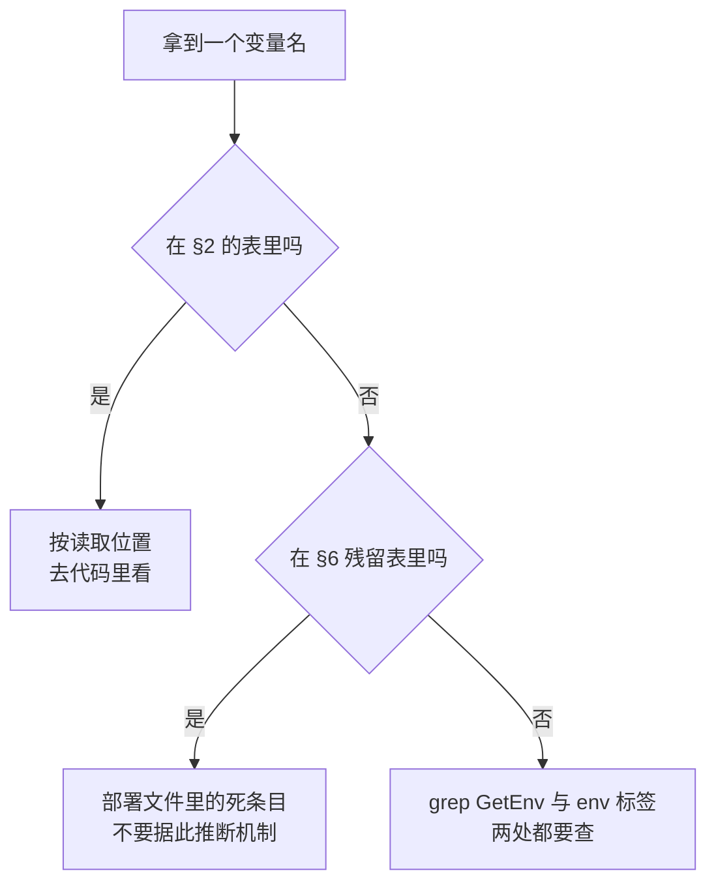

# 90 · 环境变量与配置项总表

> 全书各篇按机制组织，配置项散落在几十处。本篇按渠道与进程把它们汇成一处：每一项给出读取位置、
> 默认值、必填性、ARM 适配版的改动与讲解篇目，并单列一节收录部署文件里已经没有读取方的条目。
>
> **读者**：要自建、移植或排障的工程师。 **预备**：[第 14 篇 · 配置、特性开关与版本](14-config-flags-versions.md)（四条渠道的分层）。
> **代码**：`packages/shared/pkg/env/env.go`、`packages/shared/pkg/utils/env.go`、
> `packages/orchestrator/internal/cfg/model.go`、`packages/api/internal/cfg/model.go`、
> `packages/client-proxy/internal/cfg/model.go`、`packages/shared/pkg/feature-flags/flags.go`

---

## 0. 本篇要回答的问题

1. 手上有一个变量名，怎么知道是哪个进程在读、在哪个函数里读、缺了会怎样？
2. 一个进程最少需要哪几个变量才能启动？哪些是「不给就 panic」，哪些是「不给就静默走默认」？
3. 每个 feature flag 的默认值是多少，改了之后多久生效，ARM 适配版把哪几个改了？
4. 哪些数字根本不是配置，只能改代码重编译？它们在上游与 ARM 适配版各是多少？
5. 部署文件里那些配了却不起作用的变量有哪些，怎么识别？

---

## 1. 这张表的口径

本篇只收录**宿主侧进程读取的配置**。沙箱内部交给用户进程的环境变量（`SandboxConfig.EnvVars`）
不在其中，它们是业务数据而不是部署配置。Terraform 的输入变量（仓库根的 `.env.template`）
也不在其中，只有少数几项会一路传到进程里，本篇标出的是进程侧的那一端。

「读取位置」一列写的是**真正把值取出来的代码**，不是把值写进 job 定义的地方。
用 `caarlos0/env` 声明的字段只写结构体所在文件，因为解析统一发生在该包的 `Parse()`；
用 `env.GetEnv()` 或 `utils.RequiredEnv()` 读的写具体文件与函数。
包级变量（`var x = os.Getenv(...)`）单独标出，因为它们在 init 阶段执行，
时机早于任何 `Parse()`，也早于 `main()` 里的任何检查。

「必填性」按第 14 篇 §1.2 的三种缺省策略分：**默认**（有 `envDefault` 或 `GetEnv` 的第二参数，
拼错变量名不会报错）、**必填-崩**（`utils.RequiredEnv`，缺失即 panic，且约束顺着 import 图传染）、
**必填-错**（`env` 标签的 `required` / `notEmpty`，由 `Parse()` 返回 error 后 `Fatal`）。

「ARM 适配版」一列只在有差异时填。空白表示两个基线相同。差异分三类：
新增变量、默认值变化、语义变化。三类都在表中标明。

这张流程图对应的是最常见的一种排障：日志里看到某个行为不对，怀疑是某个变量没生效。
先确认它是不是真的有读取方，再确认读取时机。举例来说，改了 `STORAGE_PROVIDER` 却发现
进程还在连原来的后端，可能是因为存储 provider 在进程启动时就构造好了；
而改了 `TEMPLATE_BUCKET_NAME` 拼错了名字，表现却是启动时 panic，因为它走的是必填-崩那条路。
两种现象差别很大，根因都在「这个变量在什么时刻、被哪段代码读」。

## 2. 环境变量

### 2.1 全进程共用

这些变量由 `packages/shared` 下的包读取，任何 import 了对应包的进程都会受影响。

| 变量 | 读取位置 | 默认 / 必填 | ARM 适配版 | 讲解篇目 |
|---|---|---|---|---|
| `ENVIRONMENT` | `shared/pkg/env/env.go` 包级 `environment` | `prod` | 部署脚本设为 `dev` | [第 14 篇](14-config-flags-versions.md) |
| `E2B_DEBUG` | `env.go` 的 `IsDebug()` | `false` | | [第 60 篇](60-telemetry.md) |
| `NODE_ID` | `env.go` 的 `GetNodeID()` | 必填-崩 | | [第 19 篇](19-node-management-and-placement.md) |
| `LOGS_COLLECTOR_ADDRESS` | `env.go` 的 `LogsCollectorAddress()` | 空则不发日志 | | [第 60 篇](60-telemetry.md) |
| `OTEL_COLLECTOR_GRPC_ENDPOINT` | `shared/pkg/telemetry/config.go` 包级变量 | 空则不上报 | | [第 60 篇](60-telemetry.md) |
| `LAUNCH_DARKLY_API_KEY` | `shared/pkg/feature-flags/client.go` 包级变量 | 空则用离线数据源 | 不注入 | [第 14 篇](14-config-flags-versions.md) |
| `STORAGE_PROVIDER` | `shared/pkg/storage/storage.go` 的 `GetTemplateStorageProvider()` | `GCPBucket` | 默认改为 `MinioBucket` | [第 75 篇](75-minio-storage.md) |
| `TEMPLATE_BUCKET_NAME` | 同上 | 必填-崩（非 `Local` 时） | | [第 13 篇](13-storage-landscape.md) |
| `BUILD_CACHE_BUCKET_NAME` | `storage.go` 的 `GetBuildCacheStorageProvider()` | 必填-崩（非 `Local` 时） | | [第 45 篇](45-layers-and-build-cache.md) |
| `LOCAL_TEMPLATE_STORAGE_BASE_PATH` | 同 `GetTemplateStorageProvider()` | `/tmp/templates` | | [第 66 篇](66-local-development.md) |
| `LOCAL_BUILD_CACHE_STORAGE_BASE_PATH` | 同 `GetBuildCacheStorageProvider()` | `/tmp/build-cache` | | [第 66 篇](66-local-development.md) |
| `MINIO_ENDPOINT` | `storage/storage_minio.go` 的 `NewMinioBucketStorageProvider()` | 上游无此变量 | 新增，默认 `127.0.0.1:9000` | [第 75 篇](75-minio-storage.md) |
| `MINIO_ACCESS_KEY` / `MINIO_SECRET_KEY` | 同上 | 上游无此变量 | 新增，默认均为 `minioadmin` | [第 75 篇](75-minio-storage.md) |
| `ARTIFACTS_REGISTRY_PROVIDER` | `shared/pkg/artifacts-registry/registry.go` 的 `GetArtifactsRegistryProvider()` | `GCP_ARTIFACTS` | | [第 43 篇](43-rootfs-construction.md) |
| `AWS_DOCKER_REPOSITORY_NAME` | `artifacts-registry/registry_aws.go` 包级变量 | 空则该 provider 报错 | | [第 43 篇](43-rootfs-construction.md) |
| `DOCKERHUB_REMOTE_REPOSITORY_PROVIDER` | `shared/pkg/dockerhub/repository.go` 的 `GetRemoteRepository()` | `GCP_REMOTE_REPOSITORY` | | [第 43 篇](43-rootfs-construction.md) |
| `DOCKERHUB_REMOTE_REPOSITORY_URL` | 同上 | 空则返回 noop 实现 | | [第 43 篇](43-rootfs-construction.md) |
| `GCP_PROJECT_ID`、`GCP_REGION`、`GCP_DOCKER_REPOSITORY_NAME`、`DOMAIN_NAME`、`GOOGLE_SERVICE_ACCOUNT_BASE64`、`DOCKER_AUTH_BASE64` | `shared/pkg/consts/gcp.go` 六个包级变量 | 默认空串 | 不注入 | [第 57 篇](57-docker-reverse-proxy.md) |
| `ORCHESTRATOR_PORT` | `shared/pkg/consts/sandboxes.go` 包级变量 | `5008`，解析失败 panic | | [第 19 篇](19-node-management-and-placement.md) |
| `DEFAULT_FIRECRACKER_VERSION` | `shared/pkg/feature-flags/flags.go` 包级初始化 | `DefaultFirecrackerVersion` | | [第 14 篇](14-config-flags-versions.md) |

`consts/gcp.go` 那六个变量是全书最容易误判的一组：它们是包级 `os.Getenv`，只要有进程 import 了
`consts` 包就会被求值，但求值结果为空并不报错。真正强制它们非空的只有 docker-reverse-proxy
（见 §2.5）。其它进程即使拿到空串也照常启动，直到某条真正用到 GCP 的路径失败为止。

### 2.2 api

结构体在 `packages/api/internal/cfg/model.go`，`Parse()` 一次解析全部。

| 变量 | 默认 / 必填 | 说明 | ARM 适配版 | 讲解篇目 |
|---|---|---|---|---|
| `POSTGRES_CONNECTION_STRING` | 必填-错（`required,notEmpty`） | 主库连接串 | | [第 58 篇](58-postgres-schema-and-migrations.md) |
| `LOKI_URL` | 必填-错（`required`） | 日志查询 | | [第 60 篇](60-telemetry.md) |
| `LOKI_USER` / `LOKI_PASSWORD` | 空 | Loki 认证 | | [第 60 篇](60-telemetry.md) |
| `AUTH_DB_CONNECTION_STRING` | 空则回落到 `POSTGRES_CONNECTION_STRING` | 认证库 | | [第 16 篇](16-auth-and-multitenancy.md) |
| `AUTH_DB_READ_REPLICA_CONNECTION_STRING` | 空 | 只读副本 | | [第 16 篇](16-auth-and-multitenancy.md) |
| `AUTH_DB_MIN_IDLE_CONNECTIONS` / `AUTH_DB_MAX_OPEN_CONNECTIONS` | `5` / `20` | 连接池 | | [第 16 篇](16-auth-and-multitenancy.md) |
| `CLICKHOUSE_CONNECTION_STRING` | 空 | 指标库 | | [第 59 篇](59-clickhouse.md) |
| `NOMAD_ADDRESS` | `http://localhost:4646` | Nomad API | | [第 09 篇](09-nomad-consul-terraform.md) |
| `NOMAD_TOKEN` | 空 | Nomad 认证 | | [第 09 篇](09-nomad-consul-terraform.md) |
| `REDIS_URL` / `REDIS_CLUSTER_URL` / `REDIS_TLS_CA_BASE64` | 空 | 沙箱目录与状态 | | [第 20 篇](20-sandbox-state-storage.md) |
| `SANDBOX_STORAGE_BACKEND` | `memory`，取值不在 `memory` / `redis` 内即报错 | 沙箱状态存储实现 | | [第 20 篇](20-sandbox-state-storage.md) |
| `API_GRPC_PORT` | `5009` | 内部 gRPC 端口 | | [第 15 篇](15-api-service-structure.md) |
| `ADMIN_TOKEN` | 空 | `X-Admin-Token` 校验 | | [第 16 篇](16-auth-and-multitenancy.md) |
| `SUPABASE_JWT_SECRETS` | 空列表 | JWT 验签，支持轮换 | | [第 16 篇](16-auth-and-multitenancy.md) |
| `SANDBOX_ACCESS_TOKEN_HASH_SEED` | 空 | 沙箱访问令牌哈希盐 | | [第 16 篇](16-auth-and-multitenancy.md) |
| `POSTHOG_API_KEY` | 空 | 产品分析 | | [第 24 篇](24-api-metrics-and-analytics.md) |
| `ANALYTICS_COLLECTOR_HOST` / `ANALYTICS_COLLECTOR_API_TOKEN` | 空 | 分析收集器 | | [第 24 篇](24-api-metrics-and-analytics.md) |
| `DEFAULT_KERNEL_VERSION` | 空则用常量 `vmlinux-6.1.158` | 新建模板的内核版本 | 常量值相同 | [第 14 篇](14-config-flags-versions.md) |
| `DEFAULT_PERSISTENT_VOLUME_TYPE` | 空 | 持久卷默认类型 | | [第 40 篇](40-volumes-and-nfsproxy.md) |
| `TESTS_ORCH_INSTANCE_HOST` | `localhost`，`clusters/discovery/local.go` 包级变量 | 仅 `ENVIRONMENT=local` 时生效 | | [第 21 篇](21-clusters-and-discovery.md) |
| `ORCHESTRATOR_TYPE` | 上游无此变量 | 新增，`nomad` / `k8s`，默认 `nomad` | 三处读取：`internal/handlers/store.go` 的 `NewAPIStore()`、`internal/orchestrator/orchestrator.go` 的 `New()`、`internal/clusters/discovery/local.go` 的 `NewLocalDiscovery()` | [第 76 篇](76-k8s-discovery.md) |
| `K8S_NAMESPACE` | 上游无此变量 | 新增，默认 `e2b`，`discovery/local.go` 的 `NewLocalDiscovery()` | | [第 76 篇](76-k8s-discovery.md) |

api 的必填项只有两个，都是 `required`，所以配错的表现是启动即报错退出，
不是包级 panic。但它 import 了存储包，于是 §2.1 的 `TEMPLATE_BUCKET_NAME` 的 panic
会传染过来——这就是 nomad job 里 `TEMPLATE_BUCKET_NAME = "skip"` 的由来（[第 64 篇](64-nomad-jobs.md)）。

### 2.3 orchestrator 与 template-manager

同一个二进制，由 `ORCHESTRATOR_SERVICES` 决定提供哪些 gRPC 服务
（`packages/orchestrator/internal/cfg/service.go` 的 `GetServices()`，无法识别的名字被静默丢弃）。
配置在 `internal/cfg/model.go` 的 `BuilderConfig` 与 `Config`，另有两个内嵌结构体：
`storage.Config`（`shared/pkg/storage/sandbox.go`）与 `network.Config`（`internal/sandbox/network/pool.go`）。

| 变量 | 默认 / 必填 | 说明 | ARM 适配版 | 讲解篇目 |
|---|---|---|---|---|
| `ORCHESTRATOR_SERVICES` | `orchestrator` | 逗号分隔，可含 `template-manager` | | [第 46 篇](46-template-manager-service.md) |
| `GRPC_PORT` | `5008` | 对外 gRPC | | [第 25 篇](25-orchestrator-process.md) |
| `PROXY_PORT` | `5007` | 沙箱 HTTP 反向代理 | | [第 36 篇](36-orchestrator-proxy-and-envd-client.md) |
| `ORCHESTRATOR_BASE_PATH` | `/orchestrator` | 其余目录的展开基准 | | [第 34 篇](34-template-cache-and-local-storage.md) |
| `TEMPLATES_DIR` | `${ORCHESTRATOR_BASE_PATH}/build-templates` | 构建产物 | | [第 41 篇](41-template-build-overview.md) |
| `DEFAULT_CACHE_DIR` | `${ORCHESTRATOR_BASE_PATH}/build` | 构建与 pause diff 落盘 | | [第 37 篇](37-pause-and-snapshot.md) |
| `SANDBOX_CACHE_DIR` | `${ORCHESTRATOR_BASE_PATH}/sandbox` | 沙箱运行期缓存 | | [第 34 篇](34-template-cache-and-local-storage.md) |
| `TEMPLATE_CACHE_DIR` | `${ORCHESTRATOR_BASE_PATH}/template` | 模板本地缓存 | | [第 34 篇](34-template-cache-and-local-storage.md) |
| `SNAPSHOT_CACHE_DIR` | `/mnt/snapshot-cache` | 只被 `main.go` 的 `ensureDirs()` 建目录 | | §6 |
| `SHARED_CHUNK_CACHE_PATH` | 空 | NFS 共享分片缓存根，空则构建期禁用 NFS 缓存 | | [第 34 篇](34-template-cache-and-local-storage.md) |
| `SANDBOX_DIR` | `/fc-vm` | 每沙箱的运行目录 | | [第 28 篇](28-firecracker-process-management.md) |
| `HOST_KERNELS_DIR` | `/fc-kernels` | 内核目录根 | | [第 14 篇](14-config-flags-versions.md) |
| `FIRECRACKER_VERSIONS_DIR` | `/fc-versions` | Firecracker 二进制目录根 | | [第 14 篇](14-config-flags-versions.md) |
| `HOST_ENVD_PATH` | `/fc-envd/envd` | 构建期写进 rootfs 的 envd | | [第 48 篇](48-envd-overview.md) |
| `ALLOW_SANDBOX_INTERNET` | `true` | 沙箱能否出网 | | [第 35 篇](35-sandbox-networking.md) |
| `ENVD_TIMEOUT` | `10s` | 运行期等 envd 的超时 | | [第 36 篇](36-orchestrator-proxy-and-envd-client.md) |
| `DOMAIN_NAME` | 空 | 非空时作为 LaunchDarkly 的 deployment 名 | | [第 14 篇](14-config-flags-versions.md) |
| `FORCE_STOP` | `false` | 关停时是否强制 | | [第 39 篇](39-health-errors-and-teardown.md) |
| `ORCHESTRATOR_LOCK_PATH` | `/orchestrator.lock` | 单实例文件锁 | | [第 25 篇](25-orchestrator-process.md) |
| `CLICKHOUSE_CONNECTION_STRING` | 空 | 指标写入 | | [第 59 篇](59-clickhouse.md) |
| `REDIS_URL` / `REDIS_CLUSTER_URL` / `REDIS_TLS_CA_BASE64` | 空 | 沙箱目录 | | [第 20 篇](20-sandbox-state-storage.md) |
| `PERSISTENT_VOLUME_MOUNTS` | 空 map；每个挂载点 `os.Stat()` 失败则 `Parse()` 返回错误 | `类型:路径` 映射 | | [第 40 篇](40-volumes-and-nfsproxy.md) |
| `USE_LOCAL_NAMESPACE_STORAGE` | `false`；`ENVIRONMENT` 为 dev / local 时等效为 true | 网络槽位存本地而非 Consul | | [第 35 篇](35-sandbox-networking.md) |
| `SANDBOX_ORCHESTRATOR_IP` | `192.0.2.1` | 沙箱内看到的宿主地址 | | [第 35 篇](35-sandbox-networking.md) |
| `SANDBOX_HYPERLOOP_PROXY_PORT` | `5010` | hyperloop | | [第 51 篇](51-envd-ports-permissions-metrics.md) |
| `SANDBOX_NFS_PROXY_PORT` | `5011` | NFS 代理 | | [第 40 篇](40-volumes-and-nfsproxy.md) |
| `SANDBOX_PORTMAPPER_PORT` | `5012` | portmapper | | [第 40 篇](40-volumes-and-nfsproxy.md) |
| `SANDBOX_TCP_FIREWALL_HTTP_PORT` / `_TLS_PORT` / `_OTHER_PORT` | `5016` / `5017` / `5018` | TCP 防火墙三个入口 | | [第 35 篇](35-sandbox-networking.md) |
| `SANDBOXES_HOST_NETWORK_CIDR` | `10.11.0.0/16`，`network/slot.go` | 宿主侧网段 | | [第 35 篇](35-sandbox-networking.md) |
| `SANDBOXES_VRT_NETWORK_CIDR` | `10.12.0.0/16`，`network/slot.go` | 虚拟网段 | | [第 35 篇](35-sandbox-networking.md) |
| `CONSUL_TOKEN` | 必填-崩，`network/storage_kv.go` 的 `NewStorageKV()` | 仅走 Consul 槽位存储时构造 | | [第 35 篇](35-sandbox-networking.md) |
| `SOCKET_WAIT_TIMEOUT_SECONDS` | 上游无此变量 | 等待 FC socket 出现的上限，单位秒 | 新增，默认 300，`sandbox/socket/socket.go` 的 `Wait()` | [第 71 篇](71-orchestrator-arm-fc-changes.md) |
| `MAX_STARTING_INSTANCES_PER_NODE` | 上游无此变量 | 同时启动的沙箱数上限 | 新增，默认取常量 30，`internal/server/main.go` 的 `New()` | [第 71 篇](71-orchestrator-arm-fc-changes.md) |

这张表里的目录项之间有依赖：带 `,expand` 的字段可以在默认值里引用别的环境变量，
所以只改 `ORCHESTRATOR_BASE_PATH` 一项，四个派生目录会跟着变。解析完成后
`cfg/model.go` 的 `makePathsAbsolute()` 把全部目录项转成绝对路径，基准是进程的工作目录。
这意味着在 job 定义里写相对路径不会报错，但最终落到哪取决于进程从哪个目录启动，
本地开发时尤其容易误判（[第 66 篇](66-local-development.md)）。

两个新增变量的语义要留意。`SOCKET_WAIT_TIMEOUT_SECONDS` 不只是加了个上限：
ARM 适配版的 `Wait()` 用 `context.WithTimeout(context.Background(), ...)` 覆盖了入参 ctx，
于是调用方的取消传播被切断（[第 71 篇 §4](71-orchestrator-arm-fc-changes.md)）。
`MAX_STARTING_INSTANCES_PER_NODE` 解析失败时不是退出，而是记一条 error 日志后回落到常量，
所以填错值的表现是「看起来生效了但其实没有」。

`CONSUL_TOKEN` 是这张表里唯一的 `RequiredEnv`。它在 `NewStorageKV()` 里执行，
不是包级变量，因此只有真正选择 Consul 槽位存储的部署才会碰到它；
本地开发与 ARM 单机部署走 `USE_LOCAL_NAMESPACE_STORAGE` 分支，不需要它。
Consul 客户端的地址与另一份 token 由 `consulApi.DefaultConfig()` 自己读
`CONSUL_HTTP_ADDR` / `CONSUL_HTTP_TOKEN`，那是第三方 SDK 的行为，不在 e2b 的代码里。

### 2.4 client-proxy（edge）

`packages/client-proxy/internal/cfg/model.go` 只有六个字段，是全部进程里最少的。
加上 `env.GetNodeID()` 与 §2.1 的遥测三项，client-proxy 读的变量不超过十个。

| 变量 | 默认 / 必填 | 说明 | 讲解篇目 |
|---|---|---|---|
| `PROXY_PORT` | `3002` | 对外流量入口 | [第 53 篇](53-client-proxy-edge.md) |
| `HEALTH_PORT` | `3003` | 健康检查 | [第 53 篇](53-client-proxy-edge.md) |
| `REDIS_URL` / `REDIS_CLUSTER_URL` / `REDIS_TLS_CA_BASE64` | 空 | 沙箱目录查询 | [第 55 篇](55-sandbox-catalog-and-routing.md) |
| `API_GRPC_ADDRESS` | 空则不装自动恢复器 | 打到已暂停沙箱时回调 api | [第 53 篇](53-client-proxy-edge.md) |

`caarlos0/env` 对未声明的变量静默忽略，这正是 §6 那一大批 `EDGE_*` 变量既不报错也不生效的原因。

### 2.5 docker-reverse-proxy

它是唯一在 `main()` 开头做显式必填检查的进程：`internal/constants/constants.go` 的
`CheckRequired()` 检查 §2.1 那五个 GCP 变量（`GCP_PROJECT_ID`、`DOMAIN_NAME`、
`GCP_DOCKER_REPOSITORY_NAME`、`GOOGLE_SERVICE_ACCOUNT_BASE64`、`GCP_REGION`），
缺哪个就把名字拼进一条错误消息 `log.Fatal`。另有 `POSTGRES_CONNECTION_STRING`，
在 `internal/handlers/store.go` 的 `NewStore()` 里用 `RequiredEnv` 读，缺了是 panic。
监听端口由命令行 `-port` 给，默认 5000，不是环境变量。
这个进程在 ARM 适配版的部署里不启用（[第 57 篇](57-docker-reverse-proxy.md)）。

### 2.6 migrator、seed 与 dashboard-api

migrator（`packages/db/scripts/migrator.go`）只读 `POSTGRES_CONNECTION_STRING`，
用裸 `os.Getenv` 读，为空时 `log.Fatal` 并给出提示。它的其余参数全是源码常量：
跟踪表名 `_migrations`、迁移目录 `./migrations`、`statementTimeout = 3h`、连接池上限 4。
两个 seed 程序（`packages/db/scripts/seed/postgres/seed-db.go`、`packages/local-dev/seed-local-database.go`）
读同一个变量，写法相同。dashboard-api 的配置在 `packages/dashboard-api/internal/cfg/model.go`：
`PORT`（默认 3010）、`POSTGRES_CONNECTION_STRING`（必填-错）、`CLICKHOUSE_CONNECTION_STRING`、
`SUPABASE_JWT_SECRETS`、`AUTH_DB_CONNECTION_STRING` 与其只读副本。

### 2.7 envd 的命令行 flag

envd 跑在 guest 里，没有可注入的部署配置，全部参数走命令行（`packages/envd/main.go` 的 `parseFlags()`）。

| flag | 默认 | 说明 | 讲解篇目 |
|---|---|---|---|
| `-port` | `49983`（同 `shared/pkg/consts/envd.go` 的 `DefaultEnvdServerPort`） | HTTP / Connect-RPC 监听端口 | [第 48 篇](48-envd-overview.md) |
| `-isnotfc` | `false` | 非 Firecracker 模式，日志打到 stdout 且不读 MMDS | [第 48 篇](48-envd-overview.md) |
| `-cmd` | 空 | 启动时执行的命令 | [第 49 篇](49-envd-process-service.md) |
| `-cgroup-root` | `/sys/fs/cgroup` | 指标采集的 cgroup 根 | [第 51 篇](51-envd-ports-permissions-metrics.md) |
| `-version` / `-commit` | `false` | 打印版本或 commit 后退出；构建期靠 `-version` 取版本号 | [第 52 篇](52-envd-legacy-and-sdk-compat.md) |

值得指出的是，构建出来的 rootfs 并不传这些 flag：
`template/build/core/rootfs/files/envd.service.tpl` 里的 `ExecStart` 就是 `/usr/bin/envd`，
四个可调 flag 全取默认值。它们的实际用途是本地开发与 `-version` 探测。

### 2.8 开发工具

`packages/orchestrator/cmd/` 下的三个工具（[第 47 篇](47-orchestrator-dev-tools.md)）
不额外定义配置结构体，而是在 `main()` 里**替被调用的库把环境变量填好**：
`create-build` 与 `resume-build` 用 `os.Setenv` 给 `STORAGE_PROVIDER`、
`LOCAL_TEMPLATE_STORAGE_BASE_PATH`、`ORCHESTRATOR_BASE_PATH`、`SNAPSHOT_CACHE_DIR`、
`SANDBOX_DIR`、`HOST_ENVD_PATH` 等一批变量写默认值，且只在原值为空时写。
`inspect-build` 另读 `E2B_API_KEY` 与 `E2B_DOMAIN`。这是一种绕过配置层的做法：
库仍然从环境变量读，只是环境由同一个进程自己造出来。

## 3. feature flag 总表

默认值即 `packages/shared/pkg/feature-flags/flags.go` 里的 fallback。
没有 `LAUNCH_DARKLY_API_KEY` 时（ARM 适配版与所有自建部署），fallback 就是恒定值。
「生效时机」按调用点分三类：**每次求值**（调用点每次都问 SDK，控制台改完即刻生效）、
**构造时一次**（值被缓存进某个对象，要重建该对象或重启进程）、**定期刷新**（有 ticker 重读）。

判断一个 flag 属于哪一类，看的不是它的类型而是调用点：值被直接用在判断里的属于每次求值，
被传进构造函数、之后由对象持有的属于构造时一次。同一个 flag 也可能两者兼有，
`chunker-config` 就是例子——它的两个字段分别落在两类里。

| flag | 上游默认 | ARM 默认 | 生效时机 | 主要读取位置 | 讲解篇目 |
|---|---|---|---|---|---|
| `max-sandboxes-per-node` | 200 | 10000 | 每次求值 | `orchestrator/internal/server/sandboxes.go` | [第 77 篇](77-api-and-flags-on-arm.md) |
| `best-of-k-sample-size` | 3 | | 定期刷新（30 s ticker） | `api/internal/orchestrator/orchestrator.go` 的 `updateBestOfKConfig()` | [第 19 篇](19-node-management-and-placement.md) |
| `best-of-k-max-overcommit` | 400 | 1200 | 定期刷新 | 同上 | [第 77 篇](77-api-and-flags-on-arm.md) |
| `best-of-k-alpha` | 50 | | 定期刷新 | 同上 | [第 19 篇](19-node-management-and-placement.md) |
| `best-of-k-can-fit` | true | | 定期刷新 | 同上 | [第 19 篇](19-node-management-and-placement.md) |
| `best-of-k-too-many-starting` | false | | 定期刷新 | 同上 | [第 19 篇](19-node-management-and-placement.md) |
| `envd-init-request-timeout-milliseconds` | 50 | 120000 | 每次求值 | `orchestrator/internal/sandbox/sandbox.go` | [第 77 篇](77-api-and-flags-on-arm.md) |
| `memory-prefetch-max-fetch-workers` | 16 | 32 | 构造时一次（每次预取启动） | `sandbox/uffd/prefetch/prefetcher.go` | [第 32 篇](32-memory-prefetch-and-hugepages.md) |
| `memory-prefetch-max-copy-workers` | 8 | 16 | 同上 | 同上 | [第 32 篇](32-memory-prefetch-and-hugepages.md) |
| `nbd-connections-per-device` | 4 | | 构造时一次（每个设备） | `sandbox/nbd/path_direct.go` | [第 33 篇](33-nbd-and-rootfs.md) |
| `chunker-config` | `useStreaming=false`、`minReadBatchSizeKB=16` | | 混合：`useStreaming` 构造时一次，`minReadBatchSizeKB` 每次取块 | `sandbox/block/chunk.go` | [第 30 篇](30-block-layer.md) |
| `max-cache-writer-concurrency` | 10 | | 每次求值 | `shared/pkg/storage/storage_cache_seekable.go` | [第 34 篇](34-template-cache-and-local-storage.md) |
| `write-to-cache-on-writes` | false | | 每次求值 | `storage_cache_seekable.go`、`storage_cache_blob.go` | [第 34 篇](34-template-cache-and-local-storage.md) |
| `create-storage-cache-spans` | `IsDevelopment()` | | 构造时一次 | `shared/pkg/storage/storage_cache.go` | [第 60 篇](60-telemetry.md) |
| `use-nfs-for-snapshots` / `use-nfs-for-templates` | `IsDevelopment()` | | 每次求值 | `sandbox/template/cache.go` | [第 34 篇](34-template-cache-and-local-storage.md) |
| `use-nfs-for-building-templates` | `IsDevelopment()` | | 每次求值 | `template/build/builder.go` | [第 45 篇](45-layers-and-build-cache.md) |
| `clean-nfs-cache` | JSON null | | 每次求值 | `orchestrator/cmd/clean-nfs-cache/main.go` | [第 47 篇](47-orchestrator-dev-tools.md) |
| `build-cache-max-usage-percentage` | 85 | | 每次求值 | `sandbox/build/cache.go` | [第 45 篇](45-layers-and-build-cache.md) |
| `build-provision-version` | 0 | | 每次求值；非默认值即改变缓存身份 | `template/build/phases/base/hash.go` | [第 45 篇](45-layers-and-build-cache.md) |
| `build-io-engine` | `Sync` | | 每次求值 | `template/build/phases/finalize/builder.go` | [第 42 篇](42-build-phases.md) |
| `build-base-rootfs-size-limit-mb` | 25000 | | 每次求值 | `template/build/core/rootfs/rootfs.go` | [第 43 篇](43-rootfs-construction.md) |
| `build-firecracker-version` | `DEFAULT_FIRECRACKER_VERSION` 或 `DefaultFirecrackerVersion` | 随常量变为 `v1.13.1` | 每次求值 | `api/internal/handlers/template_request_build_v3.go` | [第 22 篇](22-template-api.md) |
| `firecracker-versions` | `FirecrackerVersionMap` | 两条都指向 `v1.13.1` | 每次求值 | `api/internal/orchestrator/create_instance.go` | [第 14 篇](14-config-flags-versions.md) |
| `preferred-build-node` | JSON null | | 每次求值 | `api/internal/template-manager/template_manager.go` | [第 23 篇](23-template-manager-client.md) |
| `gcloud-concurrent-upload-limit` | 8 | | 每次求值，调整信号量 | `shared/pkg/limit/upload.go` | [第 13 篇](13-storage-landscape.md) |
| `gcloud-max-tasks` | 16 | | 每次求值 | `shared/pkg/limit/gcloud.go` | [第 13 篇](13-storage-landscape.md) |
| `clickhouse-batcher-max-batch-size` / `-max-delay` / `-queue-size` | 100 / 1000 / 1000 | | 构造时一次（进程启动） | `clickhouse/pkg/events/delivery.go`、`hoststats/delivery.go` | [第 59 篇](59-clickhouse.md) |
| `host-stats-sampling-interval` | 5000 | | 构造时一次（每个沙箱） | `sandbox/sandbox.go` | [第 38 篇](38-cgroups-and-host-stats.md) |
| `host-stats-enabled` | `IsDevelopment()` | | 构造时一次（每个沙箱） | 同上 | [第 38 篇](38-cgroups-and-host-stats.md) |
| `sandbox-metrics-write` | `IsDevelopment()` | | 构造时一次（每个沙箱） | `sandbox/sandbox.go` | [第 24 篇](24-api-metrics-and-analytics.md) |
| `sandbox-metrics-read` | `IsDevelopment()` | | 每次求值 | `api/internal/handlers/sandboxes_list_metrics.go` | [第 24 篇](24-api-metrics-and-analytics.md) |
| `tracked-templates-for-metrics` | 四个内置别名 | | 每次求值 | `flags.go` 的 `GetTrackedTemplatesSet()` | [第 24 篇](24-api-metrics-and-analytics.md) |
| `sandbox-auto-resume` | `IsDevelopment()` | 因 `ENVIRONMENT=dev` 实际为 true | 每次求值 | `client-proxy/internal/proxy/proxy.go` | [第 53 篇](53-client-proxy-edge.md) |
| `sandbox-max-incoming-connections` | -1（不限） | | 每次求值 | `orchestrator/internal/proxy/proxy.go` | [第 36 篇](36-orchestrator-proxy-and-envd-client.md) |
| `tcpfirewall-max-connections-per-sandbox` | -1（不限） | | 每次求值 | `orchestrator/internal/tcpfirewall/proxy.go` | [第 35 篇](35-sandbox-networking.md) |
| `can-use-persistent-volumes` | `IsDevelopment()` | | 每次求值 | `api/internal/handlers/volume_create.go` | [第 40 篇](40-volumes-and-nfsproxy.md) |
| `default-persistent-volume-type` | 空串，空则回落到环境变量 | | 每次求值 | 同上 | [第 40 篇](40-volumes-and-nfsproxy.md) |
| `execution-metrics-on-webhooks` | false | | 每次求值 | `orchestrator/internal/server/sandboxes.go` | [第 61 篇](61-events-and-webhooks.md) |
| `edge-provided-sandbox-metrics` | false | | 开源仓库内无读取方 | 见 §6 | [第 56 篇](56-edge-api.md) |

上游 2026.09 一共定义了 42 个 flag。ARM 适配版直接改了其中 5 个的 fallback：
`max-sandboxes-per-node`、`best-of-k-max-overcommit`、`envd-init-request-timeout-milliseconds`
与两个内存预取 worker 数。另有两个的 fallback 随 Firecracker 版本常量间接变化：
`build-firecracker-version` 与 `firecracker-versions`。其余 35 个原样保留。因为没有 LaunchDarkly，「生效时机」一列在 ARM 适配版上统一退化为
「改代码重编译」；这一列的意义只在有开关服务的部署里成立。

有八个 bool flag 的 fallback 是 `env.IsDevelopment()`。它们不是「开发时的调试开关」，
而是**默认取值依赖 `ENVIRONMENT` 这个环境变量**的一批开关。ARM 适配版的部署把
`ENVIRONMENT` 设为 `dev`，于是这八个在单机部署里全部为真，包括
`sandbox-auto-resume` 与两个指标开关（[第 56 篇](56-edge-api.md)）。

## 4. 编译期与源码常量

这一节收录的数字改不了，只能改代码重编译。它们和 flag 的区别不在数值大小，而在**可变性**：
flag 至少还有一层外部输入，这些没有。ARM 适配版改动最集中的也是这一层。

这一层为什么还留着这么多数字，而不是全部提到 flag 里去？因为把一个值搬进 flag 是有成本的：
调用点要拿到 feature flag 客户端，值要考虑求值失败，行为要考虑「运行中被改」。
上游把这层成本花在了少数确实需要在生产流量下调的参数上，其余留在源码里。
ARM 适配版没有开关服务，于是两层的区别消失，改哪一层都是改代码；
补丁因此直接改常量，而不是先把常量提升为 flag。

| 常量 | 上游 2026.09 | ARM 适配版 | 位置 | 讲解篇目 |
|---|---|---|---|---|
| `requestTimeout` | 60 s | 300 s | `orchestrator/internal/server/sandboxes.go` | [第 71 篇](71-orchestrator-arm-fc-changes.md) |
| `acquireTimeout` | 15 s | 300 s | 同上 | [第 71 篇](71-orchestrator-arm-fc-changes.md) |
| `maxStartingInstancesPerNode`（orchestrator 侧） | 3 | 30，且可被 `MAX_STARTING_INSTANCES_PER_NODE` 覆盖 | 同上 + `internal/server/main.go` | [第 71 篇](71-orchestrator-arm-fc-changes.md) |
| `maxStartingInstancesPerNode`（放置算法侧） | 3 | 3（未改） | `api/internal/orchestrator/placement/config.go` | [第 19 篇](19-node-management-and-placement.md) |
| `uffdMsgListenerTimeout` | 10 s | 120 s | `orchestrator/internal/sandbox/uffd/uffd.go` | [第 72 篇](72-uffd-on-arm.md) |
| `healthCheckInterval` | 20 s | 300 s | `orchestrator/internal/sandbox/checks.go` | [第 73 篇](73-cgroup-and-host-compat.md) |
| `healthCheckTimeout` | 100 ms | 60000 ms | 同上 | [第 73 篇](73-cgroup-and-host-compat.md) |
| `NewSlotsPoolSize` | 32 | 300 | `orchestrator/internal/sandbox/network/pool.go` | [第 71 篇](71-orchestrator-arm-fc-changes.md) |
| `ReusedSlotsPoolSize` | 100 | 1000 | 同上 | [第 71 篇](71-orchestrator-arm-fc-changes.md) |
| `waitInterval`（socket 轮询） | 10 ms | 10 ms（未改） | `orchestrator/internal/sandbox/socket/socket.go` | [第 71 篇](71-orchestrator-arm-fc-changes.md) |
| `defaultWaitTimeoutSeconds` | 无此常量 | 300 | 同上 | [第 71 篇](71-orchestrator-arm-fc-changes.md) |
| `waitEnvdTimeout` | 60 s | 60 s（未改） | `template/build/layer/interfaces.go` | [第 44 篇](44-build-sandbox-and-commands.md) |
| `maxReadHeaderTimeout` | 5 s | 60 s | `api/main.go` | [第 77 篇](77-api-and-flags-on-arm.md) |
| `maxReadTimeout` | 10 s | 300 s | 同上 | [第 77 篇](77-api-and-flags-on-arm.md) |
| `maxWriteTimeout` | 75 s | 300 s | 同上 | [第 77 篇](77-api-and-flags-on-arm.md) |
| `maxInstanceSyncCallTimeout` | 1 s | 120 s | `api/internal/clusters/instance.go` | [第 77 篇](77-api-and-flags-on-arm.md) |
| `maxSyncFailuresBeforeUnhealthy` | 3 | 3（未改） | 同上 | [第 21 篇](21-clusters-and-discovery.md) |
| gRPC `MaxConcurrentStreams` | 未设置 | 1000 | `shared/pkg/grpc/server.go` | [第 77 篇](77-api-and-flags-on-arm.md) |
| gRPC `MaxConnectionAge` / `MaxConnectionIdle` | 未设置 | 显式写 0（无行为变化） | 同上 | [第 77 篇](77-api-and-flags-on-arm.md) |
| `MemoryChunkSize` | 4 MiB | 4 MiB（未改） | `shared/pkg/storage/storage.go` | [第 30 篇](30-block-layer.md) |
| `DefaultFirecackerV1_10Version` | `v1.10.1_30cbb07` | `v1.13.1` | `shared/pkg/feature-flags/flags.go` | [第 70 篇](70-firecracker-fork.md) |
| `DefaultFirecackerV1_12Version` | `v1.12.1_a41d3fb` | `v1.13.1` | 同上 | [第 70 篇](70-firecracker-fork.md) |
| `DefaultFirecrackerVersion` | 等于 V1_12 常量 | 同左（值随之变化） | 同上 | [第 70 篇](70-firecracker-fork.md) |
| `DefaultKernelVersion` | `vmlinux-6.1.158` | 同（内核内容按 arm64 重编） | `api/internal/cfg/model.go` | [第 69 篇](69-guest-kernel-for-arm.md) |
| `DefaultEnvdServerPort` | 49983 | 未改 | `shared/pkg/consts/envd.go` | [第 48 篇](48-envd-overview.md) |
| `OrchestratorAPIPort` | 5008（`ORCHESTRATOR_PORT` 可覆盖） | 未改 | `shared/pkg/consts/sandboxes.go` | [第 19 篇](19-node-management-and-placement.md) |
| `ClientID` | `6532622b` | 未改 | 同上 | [第 11 篇](11-object-model.md) |
| `NodeIDLength` | 8 | 未改 | 同上 | [第 19 篇](19-node-management-and-placement.md) |
| `statementTimeout`（migrator） | 3 h | 未改 | `db/scripts/migrator.go` | [第 58 篇](58-postgres-schema-and-migrations.md) |
| envd `idleTimeout` / `maxAge` | 640 s / 2 h | 未改 | `packages/envd/main.go` | [第 48 篇](48-envd-overview.md) |
| envd `portScannerInterval` | 1000 ms | 未改 | 同上 | [第 51 篇](51-envd-ports-permissions-metrics.md) |

有一处不对称值得单独记：`maxStartingInstancesPerNode` 这个名字在代码里有两份，
一份在 orchestrator 的准入路径上（被改成 30），一份在 api 的放置算法里
（`placement/config.go`，仍是 3，用于 `best-of-k-too-many-starting` 的过滤）。
ARM 适配版只改了前者。排查「为什么放置还在躲开某个节点」时要区分这两个同名常量。

## 5. 模板元数据与版本门槛

第三条渠道是跟着模板走的：值记在构建产物里，改它意味着重建模板。

这一层和前三层的区别在于作用域：前三层是「这个进程怎么跑」，这一层是「这个模板怎么跑」。
同一个节点上并存的两台沙箱，可以用不同的内核与不同的 Firecracker 二进制，
因为版本号跟着模板走而不是跟着进程走。代价是升级路径被切成两段：
换二进制不用重建模板，换烧进 rootfs 的东西必须重建模板。

| 项 | 记在哪 | 决定时机 | 运行时从哪取 | 讲解篇目 |
|---|---|---|---|---|
| kernel version | `env_build.kernel_version` + `metadata.json` | 构建 | `${HOST_KERNELS_DIR}/<版本>/vmlinux.bin` | [第 14 篇](14-config-flags-versions.md) |
| Firecracker version | `env_build.firecracker_version` + `metadata.json` | 构建，恢复时按次版本线重映射 | `${FIRECRACKER_VERSIONS_DIR}/<版本>/firecracker` | [第 14 篇](14-config-flags-versions.md) |
| envd version | `env_build.envd_version` | 构建期烧进 rootfs | rootfs 内 `/usr/bin/envd` | [第 52 篇](52-envd-legacy-and-sdk-compat.md) |
| `metadata.json` 的 `version` | 对象存储 | 构建 | `template/metadata/template_metadata.go` 的 `CurrentVersion = 2`、`DeprecatedVersion = 1` | [第 29 篇](29-template-artifact-format.md) |
| `minimalCachedTemplateVersion` | 源码常量 2 | 编译期 | `template/build/storage/cache/cache.go` 的 `Cached()` | [第 45 篇](45-layers-and-build-cache.md) |
| `hashingVersion` | 源码常量 `v2` | 编译期 | 同上，参与层哈希键 | [第 45 篇](45-layers-and-build-cache.md) |
| envd 自身版本号 | `packages/envd/main.go` 的 `Version = "0.5.3"` | 编译期 | `envd -version` | [第 52 篇](52-envd-legacy-and-sdk-compat.md) |

服务端针对 envd 的最低版本门槛分散在四个文件里，用 `shared/pkg/utils/version.go` 的
`IsGTEVersion()` 比较。四个门槛在 ARM 适配版中一个都没改。

| 常量 | 值 | 所在文件 | 不满足时 | 讲解篇目 |
|---|---|---|---|---|
| `minEnvdVersionForSecureFlag` | 0.2.0 | `api/internal/handlers/sandbox_create.go` | 返回 400，提示重建模板 | [第 52 篇](52-envd-legacy-and-sdk-compat.md) |
| `minEnvdVersionForMetrics` | 0.1.5 | `orchestrator/internal/metrics/sandboxes.go` | 不采集该沙箱指标 | [第 52 篇](52-envd-legacy-and-sdk-compat.md) |
| `minEnvdVersionForMemoryPrecise` / `minEnvdVersionForDiskMetrics` | 0.2.4 | 同上 | 内存粗粒度、无磁盘指标 | [第 52 篇](52-envd-legacy-and-sdk-compat.md) |
| `minEnvdVersionForKVMClock` | 0.2.11 | `orchestrator/internal/template/build/layer/create_sandbox.go` | 构建期沙箱不启用 kvm-clock | [第 52 篇](52-envd-legacy-and-sdk-compat.md) |

最后一条在 ARM 适配版上失去了作用：`fc/process.go` 把 `clocksource=kvm-clock` 移进了
x86 分支且不再看 `KvmClock` 选项，aarch64 上这个门槛判出的结果无处使用
（[第 71 篇 §2.2](71-orchestrator-arm-fc-changes.md#22-kvm-clock-与-kvmclock-选项)）。

## 6. 无读取方的残留条目

下面这些名字出现在 job 定义、Helm values、`.env` 或 `.env.local` 里，
但在**两个代码基线中都检索不到对应的 `env:` 标签、`GetEnv` 或 `os.Getenv`**。
把它们当作机制线索会白费工夫。识别方法只有一条：
`grep -rn 'GetEnv\|RequiredEnv\|os.Getenv\|env:"' packages/`，两类写法都要查。

这类条目怎么积累出来的，有两个来源。一是部署文件从上游或从闭源组件的配置模板抄来，
抄的时候连不需要的变量一起带上，而 `caarlos0/env` 对未声明的变量静默忽略，不会有任何提示。
二是代码演进时删掉了读取方，却没有人回头去删 job 定义里的那一行。
两者的后果相同：配置文件看上去描述了一套机制，而这套机制在代码里并不存在。

| 条目 | 出现在 | 状态 | 相关篇目 |
|---|---|---|---|
| `TEMPLATE_BUCKET_NAME = "skip"` | api 的 nomad job | 有读取方，但值是假的：api 不用模板桶，塞值只为绕过包级 `RequiredEnv` 的 panic | [第 64 篇](64-nomad-jobs.md) |
| `SNAPSHOT_CACHE_DIR` | orchestrator job、`.env.local` | 有读取方但无消费方：只被 `main.go` 的 `ensureDirs()` 用来建目录，pause diff 实际落在 `DEFAULT_CACHE_DIR` | [第 37 篇](37-pause-and-snapshot.md) |
| `NODE_IP` | client-proxy job、`.env.local` | `env.GetNodeIP()` 全仓无调用方 | [第 53 篇](53-client-proxy-edge.md) |
| `LOCAL_CLUSTER_ENDPOINT`、`LOCAL_CLUSTER_TOKEN` | api 的 `.env.local`、单机离线版的 `dep/.env` | 无任何 Go 代码读取 | [第 56 篇](56-edge-api.md) |
| `EDGE_PORT`、`EDGE_SECRET`、`EDGE_URL`、`EDGE_API_PORT`、`EDGE_API_SECRET` | client-proxy 的 `.env.local`、Helm 的 `edge.yaml`、`dep/.env` | client-proxy 只读 §2.4 那六个，其余被 `caarlos0/env` 静默忽略；3001 端口上没有进程监听 | [第 56 篇](56-edge-api.md) |
| `SERVICE_DISCOVERY_ORCHESTRATOR_PROVIDER`、`SERVICE_DISCOVERY_EDGE_DNS_QUERY`、`SD_EDGE_PROVIDER`、`SD_ORCHESTRATOR_PROVIDER` | 同上 | 同上，形状来自闭源的 edge API 服务端 | [第 56 篇](56-edge-api.md) |
| `USE_PROXY_CATALOG_RESOLUTION`、`DNS_SERVER`、`DNS_PORT`、`SKIP_ORCHESTRATOR_READINESS_CHECK` | Helm 的 `edge.yaml`、`.env.local` | 无读取方 | [第 56 篇](56-edge-api.md)、[第 66 篇](66-local-development.md) |
| `TEMPLATE_MANAGER_HOST` | Helm 的 `api.yaml` | 无读取方 | [第 78 篇](78-helm-k8s-deployment.md) |
| `edge-provided-sandbox-metrics`（flag） | `flags.go` | 定义了但开源仓库里没有读取方 | [第 56 篇](56-edge-api.md) |

这些条目里有一类要区别对待：`TEMPLATE_BUCKET_NAME` 与 `SNAPSHOT_CACHE_DIR` 是**有读取方的**，
只是读取方并不做它名字暗示的事。删掉它们会让进程启动失败或少建一个目录，
而删掉表里其余条目对运行没有任何影响。

## 7. 小结

- 配置项按可变性分四层：环境变量（改了要重启进程）、feature flag（有开关服务时可热改）、
  源码常量（要重编译）、模板元数据（要重建模板）。本篇按这四层组织。
- 环境变量有三种缺省策略，表中的「必填性」一列即此。`RequiredEnv` 的 panic 顺着 import 图传染，
  是 `TEMPLATE_BUCKET_NAME = "skip"` 这类怪现象的根源。
- 包级 `os.Getenv` 变量（`consts/gcp.go` 六项、`feature-flags/client.go`、`telemetry/config.go`）
  在 init 阶段求值，早于任何 `Parse()`，为空时不报错。
- ARM 适配版新增四组环境变量：`MINIO_*` 三个、`ORCHESTRATOR_TYPE` 与 `K8S_NAMESPACE`、
  `SOCKET_WAIT_TIMEOUT_SECONDS`、`MAX_STARTING_INSTANCES_PER_NODE`；
  改了一个默认值：`STORAGE_PROVIDER` 从 `GCPBucket` 到 `MinioBucket`。
- 上游定义了 42 个 flag，ARM 适配版直接改了其中 5 个的 fallback，另有 2 个随 Firecracker 版本常量间接变化；
  因为没有开关服务，全部 flag 退化为编译期常量。
- 八个 bool flag 的默认值取自 `env.IsDevelopment()`，因此 `ENVIRONMENT` 这一个环境变量
  间接决定了一批开关的取值。
- ARM 适配版改动最密集的是源码常量层，集中在超时与池大小；
  `maxStartingInstancesPerNode` 在两个包里同名，只改了 orchestrator 那一份。
- 部署文件里有一批 `EDGE_*`、`SERVICE_DISCOVERY_*`、`LOCAL_CLUSTER_*` 变量没有任何读取方，
  它们是闭源 edge API 服务端留下的形状，不能当作机制线索。

## 延伸阅读 / 下一篇

- [第 14 篇 · 配置、特性开关与版本 §1](14-config-flags-versions.md#1-配置的四条渠道)：本篇是它的展开，四条渠道的分层与代价在那里讲。
- [第 64 篇 · Nomad job 详解](64-nomad-jobs.md)：这些变量在 job 定义里如何被注入。
- [第 66 篇 · 本地开发](66-local-development.md)：三份 `.env.local` 的逐项解释。
- [第 77 篇 · API 层与特性开关默认值的调整](77-api-and-flags-on-arm.md)：ARM 适配版改动的动机与后果。
- [第 89 篇 · 代码地图 §1](89-code-map.md#1-上游-202609-的目录)：从目录找到读取这些配置的代码。
- [第 91 篇 · 端口、路径与存储键总表 §1](91-ports-paths-keys.md#1-进程端口)：本篇里出现的端口与目录在那里按用途排列。
