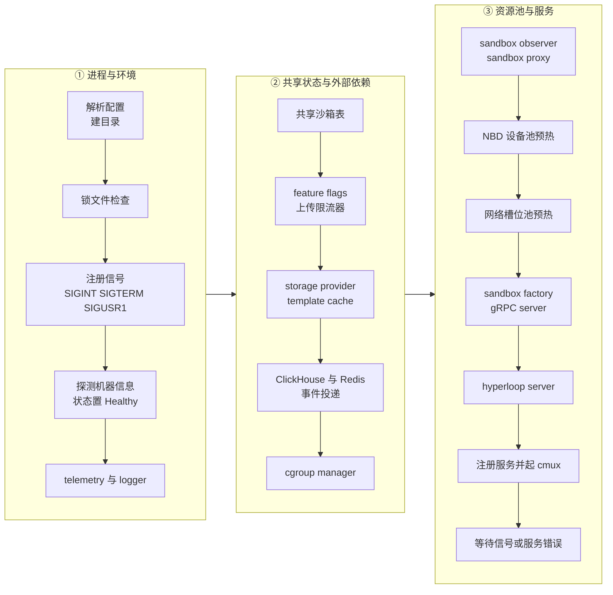
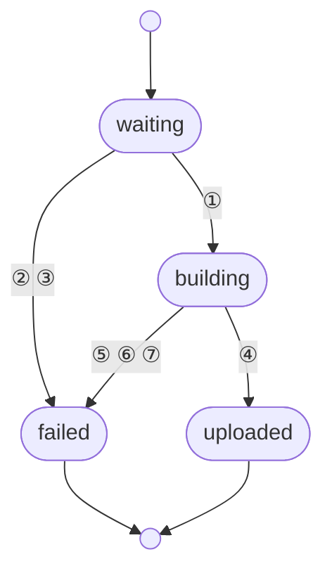

# 图的规约

本书所有图用 mermaid 内嵌在 Markdown 里，最终在单文件 HTML 中渲染。Markdown 里的图只要能看；
**HTML 是交付件**，图必须好看、清楚、没有重叠。这份规约给出硬性阈值、画法与常见问题的改法。
检查工具 `tools/figcheck.sh` 用真实 chromium 按打包页同一套主题渲染，报出尺寸、重叠与压线；
以它的 PASS 为准，再肉眼看一遍 PNG。

## 1. 硬性阈值（figcheck 检查）

| 项 | 阈值 | 原因 |
|---|---|---|
| 自然宽度 | ≤ 1040 px | 打包页正文栏 820 px，图最宽可放到 1100 px；超过就被缩小，字号低于 11 px 看不清 |
| 自然高度 | ≤ 940 px | 一屏内能看全；超过的图几乎都是直线长链，应改画法。时序图的高度含底部那排参与者框 |
| 长宽比 | 0.4 ～ 3.2 | 太扁的图缩到栏宽后字只有几个像素；太窄的是竹竿图 |
| 重叠 | 0 | 节点、边标签、簇标题、时序图元素两两不重叠 |
| 标签压线 | 0 | 一条边穿过别的边的标签 |
| 文字溢出 | 0 | 节点文字超出节点框 |

主题（`tools/mermaid-config.json` + `tools/mermaid.css`）已统一：淡蓝节点、灰线、14 px 正文字体、边标签白底。
**不要在图里自定义颜色**，只允许两个类：

```text
classDef arm fill:#fdf2e9,stroke:#d9822b        %% ARM 适配版特有 / 与上游不同之处
classDef ext fill:#f6f7f9,stroke:#b8c2cf,stroke-dasharray:4 3   %% 外部或本书范围之外的组件
```

## 2. 通用画法

- **方向**：默认 `TB`。流水线式的 ≤ 6 个阶段可用 `LR`。混合布局用 `subgraph` 内的 `direction`。
- **节点标签**：一行 ≤ 14 个汉字或 ≤ 28 个英文字符；需要换行用 `<br/>` 自己断，不要靠自动换行（会断出「端<br/>口」这种）；最多两行，根节点最多三行。
- **边标签**：≤ 10 个字，不带标点。条件太长就给它起个短名，长解释放正文或图下的表。
- **汇入同一节点的带标签边 ≤ 2 条**。更多时用菱形判定节点拆开，或者给边编号 ①②③ 并在图下用表解释。
- **标签里**不要出现未转义的括号、引号、竖线；用 `A["..."]` 形式。
- 一张图 **节点 ≤ 20**，超过就拆成两张，各讲一件事。
- 不要把仓库路径、函数签名画进节点；节点写概念名，路径在正文里。
- 一篇 1～3 张图；每张图前后正文要有一句话说它在讲什么。

## 3. 各类图的具体规则

### 流程图 `flowchart`

- **直线长链（> 8 步）**：这不是图，是清单。二选一：
  1. 改成有序列表，图只保留「阶段」级别（3～5 个节点）；
  2. 按阶段分成 2～3 个 `subgraph`，外层 `flowchart LR`、子图内 `direction TB`，每列 ≤ 6 步，列间用一条边相连。
- **横向长链（LR 一行 > 6 个节点）**：改 `TB`，或用上面的分列法折成两行。
- **一根多叶的扇形（一个根 > 6 个叶）**：把叶子按类分进 2～3 个 `subgraph`，或者改成表格。
- **边穿过簇标题**：把簇里被外部连线的节点放到簇的边缘（调整声明顺序），或把连线目标改为簇本身（`A --> sg1`）。
- 曲线样式已全局设为 `basis`，不要在图里再改。

### 状态图 `stateDiagram-v2`

mermaid 的状态图对带标签的转移排布很差，多条转移汇入同一状态时标签必然堆在一起。规则：

- 只有 **≤ 5 个状态、≤ 6 条转移、标签 ≤ 8 字** 的状态机才用 `stateDiagram-v2`。
- 其它一律改画 `flowchart`：状态用圆角节点 `S(["running"])`，起止用 `((·))`，转移用 `-->|"标签"|`；
  转移多时给边编号 `-->|"①"|`，图下放一张「编号 | 触发 | 动作」表。
- 一张 `stateDiagram-v2` 里不要用 `note`（会撑出一块大灰框），说明写在图下。

### 时序图 `sequenceDiagram`

- **参与者 ≤ 6，消息 ≤ 14**。超过就按阶段拆成两张（如「创建」与「访问」）。
- 消息文字 ≤ 16 字。全局已开 `wrap`，长文字会自动换行并把图撑高，所以要短。
- 一律加 `autonumber`；参与者用短名（`api`、`orch`、`envd`、`FC`），并在图前正文里说明缩写。
- 自调用消息（`A->>A`）文字 ≤ 8 字，否则与回环箭头相撞。
- `Note over` 每图 ≤ 2 个，每个 ≤ 20 字。
- 底部重复画一排参与者（`mirrorActors` 开启，与常见的 mermaid 时序图一致），高度阈值已把这排框算在内。

### ER 图 `erDiagram`

- 每个实体 ≤ 6 个属性，只留主键、外键与讲解要用的列；表 ≤ 8 个。
- 太宽时拆成两张（按业务域）。

## 4. 检查与验收

```bash
cd /home/austin/projects/e2b-repo/e2b-book
tools/figcheck.sh --png /tmp/figs <书目录>/NN-xxx.md        # 每张图一行 PASS/WARN，并输出 PNG
node tools/mdmermaid.mjs <书目录>/NN-xxx.md                   # 语法
python3 tools/mdlinks.py <书目录>/NN-xxx.md                   # 链接与锚点（改了标题就要跑）
```

验收标准：每张图 PASS；打开 PNG 看一遍：文字全部可读、无被裁的字、边不绕远路穿过别的节点、
整张图的重心居中不偏一角、留白均匀。**figcheck 通过但看着别扭的，仍然要改。**

`figcheck.sh` 依赖 `tools/node_modules`（指向 rollback 手册 slides 的 node_modules，含 playwright-chromium）
与 `tools/.chromium-libs`（从 Ubuntu deb 解出的 libnss3 / libnspr4 / libasound2，chromium 需要）。

## 5. 两个范例

**长链分列**（原图 17 步竖排 247×1648，改后 814×828）。要点：各列步数尽量均衡（6 / 5 / 6），列名带 ①②③，
列之间用 `P1 --> P2` 连子图本身；节点里的换行用 `<br/>` 自己断。



**密集转移的状态机**（原为 `stateDiagram-v2`，7 条带长标签的转移互相压住）。改成 flowchart，转移编号，
同源同宿的多条转移合并成一条边标「② ③」，图下用表解释：



| 编号 | 触发 | 说明 |
|---|---|---|
| ① | CreateTemplate 受理成功 | … |
| ② | 同 tag 的新构建注册 | … |
| … | … | … |
