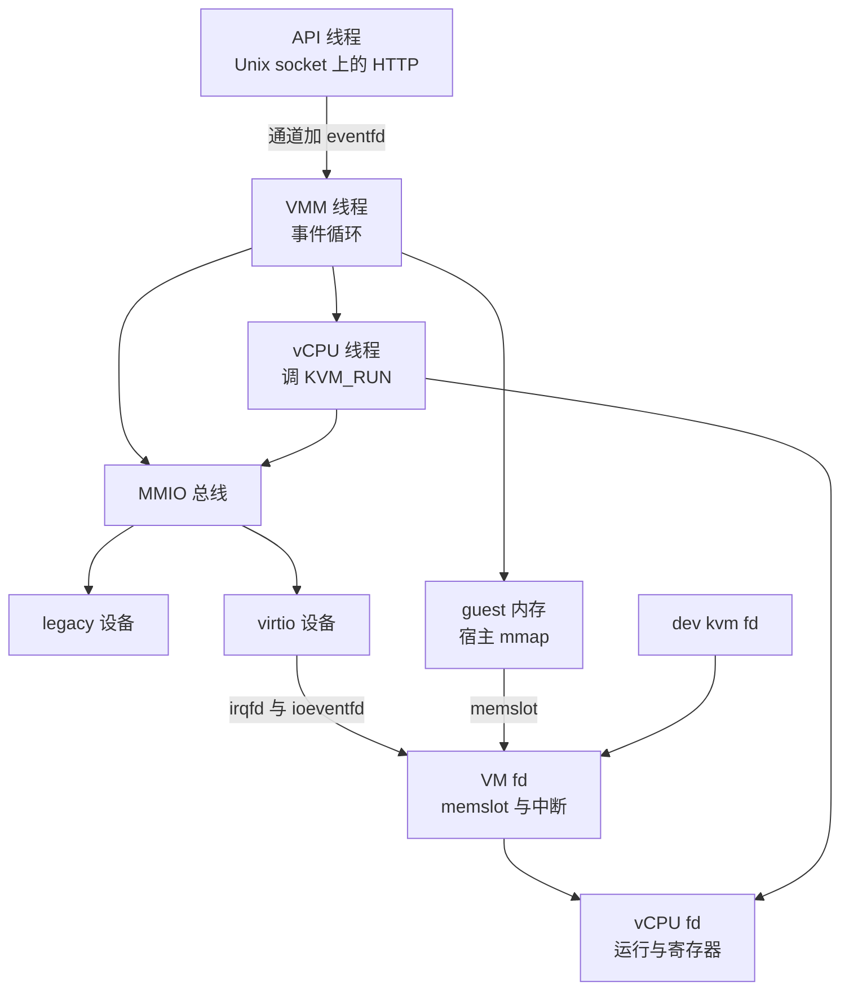
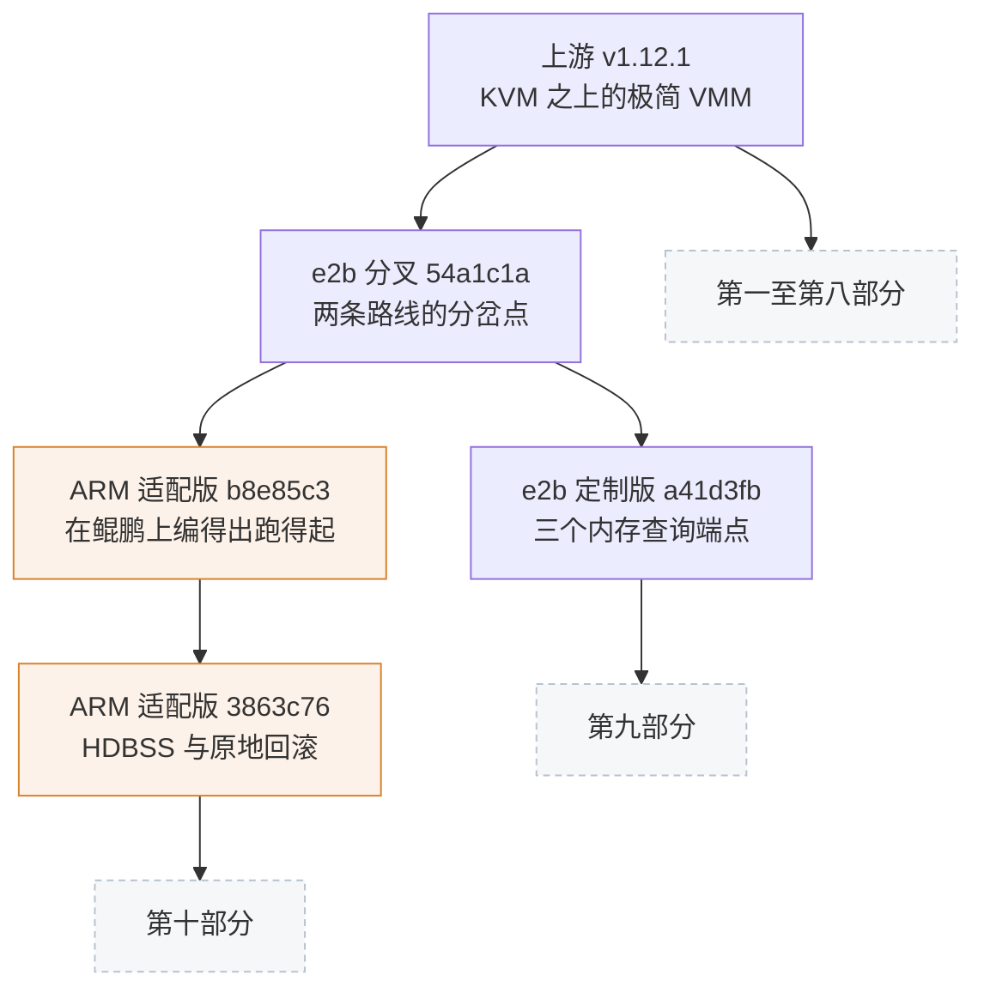

# 00 · 全书导读与 Firecracker 总览

> 这本书讲一个 VMM（virtual machine monitor）以及叠在它上面的两层改动。本篇是全书的缩影：
> Firecracker 是什么、一台 microVM 从被配置到被销毁都经过哪些环节、代码里哪三条主线值得反复回到、
> 三层版本各自解决什么问题，以及不同来路的读者应当按什么顺序读下去。
>
> **读者**：所有人，尤其是评审、决策者与第一天接手这份代码的工程师。
> **预备**：无。本篇不要求读过任何一篇。
> **代码**：`src/firecracker/src/main.rs`、`src/vmm/src/lib.rs`、`src/vmm/src/rpc_interface.rs`、
> `src/vmm/src/builder.rs`、`src/vmm/src/persist.rs`、`src/vmm/src/vstate/`

---

## 0. 本篇要回答的问题

1. Firecracker 与一台普通的虚拟机监控器差在哪里，它砍掉了什么、因此得到了什么？
2. 一台 microVM 从一条 `curl` 命令到进程退出，中间经过哪几个阶段，每个阶段由哪段代码负责？
3. 读这份代码时，哪三条主线可以把几十个文件串起来？
4. 上游、e2b 定制版、ARM 适配版这三层各自解决什么问题，彼此是什么关系？
5. 我这样的读者应该按什么顺序读这本书？

---

## 1. Firecracker 是什么

Firecracker 是一个用 Rust 写的 VMM，跑在 Linux 的 KVM 之上。它与常见 VMM 的区别不在实现技巧，
而在它拒绝做的那部分事：没有 BIOS 与 UEFI，没有 PCI 总线，没有 SCSI、USB、显卡、声卡，
没有设备热插拔，没有虚拟机内的重启语义。它给客户机（guest）的机器模型只剩一小组
virtio-mmio 设备，加上一个串口，x86_64 上多一个键盘控制器，aarch64 上多一个 RTC。
整个仓库约 9.4 万行 Rust，其中 `vmm` 这一个 crate 占八成以上（第 01 篇给出逐 crate 的行数）。

这种裁剪不是审美选择，而是对一类具体负载的回应：多租户、不可信代码、要求秒级启动、
要求单机高密度。传统 VMM 为兼容任意客户机操作系统而保留的固件与设备模拟，在这类负载下
既是启动时延，也是攻击面。Firecracker 的答案是把机器模型收窄到「刚好够跑一个为它裁配过的
Linux 内核」，其余能力一律不提供。代价是一份明确的约束清单：客户机内核必须由外部提供并配好、
设备种类固定、块设备与网络后端都在进程之外、控制面串行、生产环境的隔离要由 jailer 与编排层补齐。
[第 02 篇 · microVM 与 Firecracker 的设计取舍](02-microvm-design-tradeoffs.md) 逐条展开这份清单。

进程模型同样极简：**一个进程一台 microVM**。进程内的线程数等于 vCPU 数加二 —— 一个 API 线程、
一个 VMM 线程、每个 vCPU 各一个线程（`src/firecracker/src/main.rs` 的 `main_exec()` 建立前两个，
`src/vmm/src/lib.rs` 的 `start_vcpus()` 建立其余）。没有线程池，没有工作队列，没有内部并发调度。
所有设备模拟在 VMM 线程上串行完成，因此设备代码不需要任何锁来保护彼此；
代价是任何一个设备在处理事件时阻塞，整台 microVM 的 I/O 都会停住（[第 12 篇](12-vmm-event-loop-and-exit.md)）。

进程内的结构可以画成三组对象：三类线程、一张按地址排序的设备表、以及三级 KVM 文件描述符。

图里有三处值得先记住。第一，客户机的「物理内存」是 Firecracker 进程里的一段 `mmap`，
KVM 只登记它到客户机物理地址（GPA）的映射，内存本身归进程所有（[第 13 篇](13-guest-memory.md)）。
正因如此，设备可以直接读写客户机内存，而后面两层改动也能让进程外的程序去读它。
第二，vCPU 线程访问设备时不经过 VMM 线程：`KVM_RUN` 因一次 MMIO 访问退出后，
由 vCPU 线程自己查总线并调用设备方法（[第 23 篇](23-bus-and-mmio-device-manager.md)）。第三，客户机与设备之间最频繁的两个信号
—— 客户机敲门与设备中断 —— 分别由 ioeventfd 与 irqfd 承担，它们在 KVM 内部完成，
不需要任何一侧退出到用户态（[第 04 篇](04-virtio-and-mmio-primer.md)）。

## 2. 一台 microVM 的生命周期

Firecracker 启动时不读配置文件（`--config-file` 只是把同一组 API 调用写进一个 JSON），
一切通过 API socket 送入。一台 microVM 的一生因此可以按控制面的动作切成五段。

**配置。** 进程起来后进入 preboot 阶段。每一条 `PUT /boot-source`、`PUT /drives/{id}`、
`PUT /network-interfaces/{id}` 都落到同一个 `VmResources` 对象上（`src/vmm/src/resources.rs`）。
这里有一处容易误解的地方：`VmResources` 装的不全是配置，五类设备在配置调用返回之前就已经
被构造出来，磁盘文件被打开、tap 被创建。收益是错误在单次 API 调用上就暴露，代价是「配置」
与「设备状态」两重身份纠缠在一起（[第 10 篇](10-vm-resources-and-config.md)）。

**构建。** `PUT /actions` 的 `InstanceStart` 触发 `src/vmm/src/builder.rs` 的
`build_and_boot_microvm()`。它打开 `/dev/kvm`、建 VM、分配并注册客户机内存、创建 vCPU、
装载客户机内核、把已经造好的设备挂上 MMIO 总线、按架构配置系统（x86_64 写命令行、mptable
与 ACPI 表，aarch64 生成设备树），最后起 vCPU 线程并安装 seccomp 过滤器。
这条流水线的顺序不是随意的：中断控制器的创建时机在两个架构上方向相反，
挂设备的顺序决定客户机里的设备枚举顺序，seccomp 必须最后装。[第 11 篇](11-builder.md) 逐步讲。

**运行。** 构建结束后，VMM 线程转进事件循环，vCPU 线程各自反复调用 `KVM_RUN`。
这时进程里同时有三种活动：客户机在 vCPU 上执行，设备事件在 VMM 线程上被分发，
API 请求偶尔插进来改一改速率限制或者换一块盘。三者之间的同步点很少，因为设备模拟都在
同一个线程上（[第 12 篇](12-vmm-event-loop-and-exit.md)）。

**暂停、快照与恢复。** `PATCH /vm` 把全部 vCPU 停在 `paused` 状态；
`PUT /snapshot/create` 把除客户机内存以外的进程内状态序列化成一个 vmstate 文件，
再把客户机内存写成另一个文件（`src/vmm/src/persist.rs` 的 `create_snapshot()`）。
反方向的 `PUT /snapshot/load` 在一个**全新的进程**里重新申请 KVM 的文件描述符、
重建内存映射、重新造出每一个设备，再把状态灌回去（同文件的 `restore_from_snapshot()`）。
这一对动作是本书后两部分的全部基础：e2b 要的是它的内存导出环节，
ARM 适配版要的是它的反方向。第 36 至 41 篇讲这一整套。

**退出。** 退出路径是单向的：某个 vCPU 收到表示整机停止的 KVM 退出原因，写 `vcpus_exit_evt`，
VMM 线程收集退出码、拆除线程、填上 `shutdown_exit_code`，外层循环跳出，进程结束。
客户机里的 `reboot` 走的也是这条路 —— Firecracker 不实现重启，重启表现为进程以退出码 0 结束
（第 12、15 篇）。

## 3. 三条主线

几十个文件之间的关系，用三条主线串起来最省力。三条线各自有一个收口的位置，
读代码时从那个位置出发不容易迷路。

**控制面：请求怎么变成动作。** 收口在 `src/vmm/src/rpc_interface.rs`。
API 线程只做翻译，把 HTTP 请求变成一个 `VmmAction` 枚举值，送进通道再阻塞等结果；
「这个动作现在允不允许」的全部判断集中在这一个文件里，由两个控制器承担：
`PrebootApiController` 把请求累积成配置，`RuntimeApiController` 对一台已经在跑的 microVM
下命令。两者的切换单向且只发生一次。所有动作同步执行，请求严格串行 ——
收益是 VMM 侧无并发，控制器可以写成简单的状态判断；代价是一个慢动作会堵住整个控制面
（第 08、09 篇）。后面两层新增的每一个端点，都要在这条链路上各加一环。

**数据面：客户机的 I/O 怎么被服务。** 收口在 `src/vmm/src/devices/virtio/`。
客户机与设备共享三块内存 —— 描述符表、可用环、已用环 —— 数据不跨越虚拟化边界，
只有通知与中断跨。`MmioTransport`（`devices/virtio/mmio.rs`）实现规范定义的寄存器语义，
`VirtioDevice` trait 定义每种设备要交出什么。设备在客户机写 `DRIVER_OK` 的那一刻被「激活」，
此前它拿不到客户机内存句柄，因此不可能碰描述符链。整条数据面没有任何架构分支，
这是 virtio-mmio 这层抽象最直接的收益（[第 25 篇](25-virtio-device-model-and-transport.md)、[第 26 篇](26-virtqueue-implementation.md) 与第五部分各篇）。

**状态面：一台机器怎么变成文件、又怎么变回来。** 收口在 `src/vmm/src/persist.rs` 与
`src/vmm/src/vstate/`。`vstate/` 只有两千多行，四个文件分别对应 `/dev/kvm`、VM fd、vCPU fd
与客户机内存，却是后两层改动的主要落点。这条线上有三条性质反复出现，值得提前记下：

- 客户机内存有两个写者。客户机的写由 KVM 记录，Firecracker 自己的写 KVM 看不见，
  所以有两张脏页位图（dirty bitmap），差分快照取它们的并集
  （`vstate/memory.rs` 的 `dump_dirty()`，[第 14 篇](14-dirty-page-tracking.md)）。
- `KVM_GET_DIRTY_LOG` 的语义是取走即清零，没有单独的清零接口
  （`vstate/vm.rs` 的 `get_dirty_bitmap()`）。这条性质决定了脏页信息只能有一个消费者，
  也决定了后面 [第 68 篇](68-save-dirty-bitmap-api.md) 那个端点必须先把读到的位折叠进用户态位图。
- 恢复出来的设备是**重建**而不是复活。快照里存的是逻辑状态，宿主侧资源按名字重新打开，
  ioeventfd 与 irqfd 全部重新登记；在途 I/O、vsock 连接、MMDS 数据一概不保存，
  靠保存前排空与恢复后 `kick_devices()` 补偿（[第 38 篇](38-snapshot-load.md)、[第 40 篇](40-device-persist.md)）。

这三条性质是理解第九、第十部分的钥匙：e2b 定制版绕开了第一条给出的那两张位图，
ARM 适配版则要在第二条的约束下做到「看一眼而不取走」，并把第三条的「重建」换成「写回」。

## 4. 三层版本

本书讲的不是一份代码，而是线性叠加的三份。谱系数字以第 01 篇为准。

**上游 v1.12.1**（提交 `d990331f7`）把一台虚拟机砍到只剩必需部件，
并提供一套完整的快照与恢复机制，本书第一至第八部分讲的都是它。

**e2b 定制版**（`a41d3fb`，上游之后 28 个提交）要的是内存导出的控制权：
它加了三个只读端点，把客户机内存的宿主虚拟地址、常驻与零页位图、脏页位图交给进程外的程序，
并把快照请求里的内存文件路径放松成可选，于是一次暂停可以只写状态、不写内存。
这一层只加旁路，不改任何既有行为路径，功能代码约 696 行（第 49 至 56 篇）。

**ARM 适配版**（KASandbox 仓库 `firecracker/` 目录，`3863c76`）做了两段工作：
先让这份代码在鲲鹏 / openEuler 的 aarch64 宿主上编得出、跑得起来，
再为 checkpoint / restore 加了四个扩展点 —— 用鲲鹏的硬件脏页跟踪 HDBSS
（hardware dirty bit state structure）替换写保护式采集、让快照顺带写出一张脏页位图
sidecar、加一个只读数不导出内存的端点、以及原地回滚 `PUT /snapshot/rollback`，
让一台**正在跑的** microVM 退回自己过去的某个时刻而不重建进程。
这一段约 1661 行，与 e2b 那层的形状正相反：它要在既有路径上加一个反方向，
每一处保存状态的代码都要回答「反过来写进去会怎样」（第 57 至 73 篇）。

## 5. 怎么读这本书

全书八十篇，分第〇到第十共十一个部分，另有附录。未特别说明处，正文讲的都是上游 v1.12.1；
上游各篇如果某个机制在后面某层有变化，在小结之前会有一节「后续各层的差异」指出去。
下面的路径与 [`README.md`](README.md) 的表一致。

- **想先看个全貌**：读本篇，再读 [第 01 篇 · 三层版本谱系与仓库地图](01-lineage-and-repo-map.md)。
- **不熟悉 KVM / virtio / Rust 系统编程**：先读第 02 至 05 篇这四篇预备，
  再从 [第 07 篇 · 进程启动](07-process-startup.md)、[第 11 篇 · builder](11-builder.md)、
  [第 12 篇 · 事件循环与退出路径](12-vmm-event-loop-and-exit.md) 建立进程视角。
- **要接手 Firecracker 代码的工程师**：第 07 与 12 篇先建立骨架，
  然后按第 13、15、25、26、36、37、38 篇把内存、vCPU、virtio 与快照四条线各走一遍，再按部补全。
- **只关心快照与内存**：[第 13 篇](13-guest-memory.md)、[第 14 篇](14-dirty-page-tracking.md)
  打底，第 36 至 40 篇是主体，然后第 49 至 54 篇看 e2b 定制版改了哪里，
  其中 [第 49 篇](49-why-e2b-forked.md) 讲动机、[第 54 篇](54-optional-memfile-snapshot.md) 讲暂停流程。
- **做 aarch64 适配与鲲鹏部署**：先读 [第 18 篇](18-aarch64-vcpu.md) 与
  [第 19 篇](19-aarch64-platform.md) 这两篇上游的 aarch64 实现，
  再从 [第 57 篇](57-which-fork-commit-and-uffd-wp.md) 顺读到 [第 63 篇](63-integration-with-e2b-infra.md)。
- **做 checkpoint / restore 后续开发**：第 14、37、40、53、57 篇是前置，
  然后第 64 至 73 篇要全部读完，其中 [第 69 篇](69-rollback-api-and-phases.md) 是回滚的总纲。
- **要升级 Firecracker 版本**：[第 01 篇](01-lineage-and-repo-map.md)、
  [第 55 篇](55-seccomp-build-upload-and-upstream-fixes.md) 与
  [第 78 篇 · 三层差异总表](78-layer-diff-tables.md)，再按第 78 篇的重放清单读对应篇目。
- **评审与决策者**：本篇之后读 [第 49 篇](49-why-e2b-forked.md)、
  [第 57 篇](57-which-fork-commit-and-uffd-wp.md) 与
  [第 64 篇 · checkpoint / restore 扩展总览](64-checkpoint-extension-overview.md)，
  这三篇各自说明一层改动的动机与代价。

另有三类查阅材料：[第 74 篇](74-glossary.md) 是术语表，[第 75 篇](75-code-map.md)
可以从文件名反查篇目，[第 76 篇](76-api-reference.md) 与 [第 77 篇](77-config-cli-env-metrics-reference.md)
是 API 与配置项总表。写作体例见 [`STYLE.md`](STYLE.md)，编写计划见 [`OUTLINE.md`](OUTLINE.md)。

最后提醒一点口径。本书讲的是 Firecracker 进程内发生的事，外加客户机内核的配置；
orchestrator 怎么调用这些端点、差分树与磁盘分层怎么组织、性能数据如何，
属于另外两本手册的范围，本书需要时链接过去，不复述。

## 6. 小结

- Firecracker 是 KVM 之上的极简 VMM：没有固件、没有 PCI、设备只有一小组 virtio-mmio 加串口，
  换来的是小攻击面与快启动，代价是一份明确的外部依赖与约束清单。
- 一个进程一台 microVM，线程数等于 vCPU 数加二；设备模拟全部在 VMM 线程上串行，
  因此设备代码无锁，但任何一处阻塞都会停住整台机器的 I/O。
- 客户机内存是 Firecracker 进程的一段 `mmap`，KVM 只登记映射。
  这既是设备能直接读写客户机内存的原因，也是后两层改动得以成立的前提。
- 生命周期分五段：配置累积到 `VmResources`、`build_and_boot_microvm()` 构建、
  事件循环与 vCPU 线程运行、暂停与快照、单向的退出路径。Firecracker 不实现虚拟机重启。
- 控制面收口在 `rpc_interface.rs`：请求先变成 `VmmAction`，两个控制器分管 preboot 与 runtime，
  全部动作同步串行。
- 数据面收口在 `devices/virtio/`：三块共享内存加两个方向的信号，没有架构分支。
- 状态面收口在 `persist.rs` 与 `vstate/`，三条性质贯穿后两部分：脏页有两个来源要合并、
  KVM 脏页日志取走即清零、恢复出来的设备是重建而非复活。
- 三层线性叠加：上游 v1.12.1 提供机制；e2b 定制版加三个只读端点与可选的内存文件，
  把内存导出的决定权挪到进程外；ARM 适配版先让它在鲲鹏上跑起来，再加硬件脏页跟踪、
  位图 sidecar 与原地回滚，把「重建一台 microVM」换成「写回偏离的部分」。
- 阅读路径按来路分：看全貌的读 00 与 01，补基础的读第一部分，接手代码的沿进程与三条主线走，
  做回滚开发的必须读完第十部分。

---

## 延伸阅读 / 下一篇

- [第 01 篇 · 三层版本谱系与仓库地图](01-lineage-and-repo-map.md)：下一篇，给出谱系数字、
  改动规模与逐 crate 的仓库地图。
- [第 02 篇 · microVM 与 Firecracker 的设计取舍](02-microvm-design-tradeoffs.md)：
  本篇第 1 节那份约束清单的完整版。
- [`README.md`](README.md)：完整目录与读者导览表。
- [第 79 篇 · 阅读上游代码的方法与常见问题](79-reading-upstream-code.md)：第一次打开这份代码时的实用建议。
- 调用方视角的 Firecracker：[e2b 手册第 28 篇](../e2b-infra/28-firecracker-process-management.md)。
- 原地回滚的设计动机、orchestrator 侧实现与性能数据：
  [checkpoint / restore 手册](../../e2b-infra-docs/rollback/docs/README.md)。
