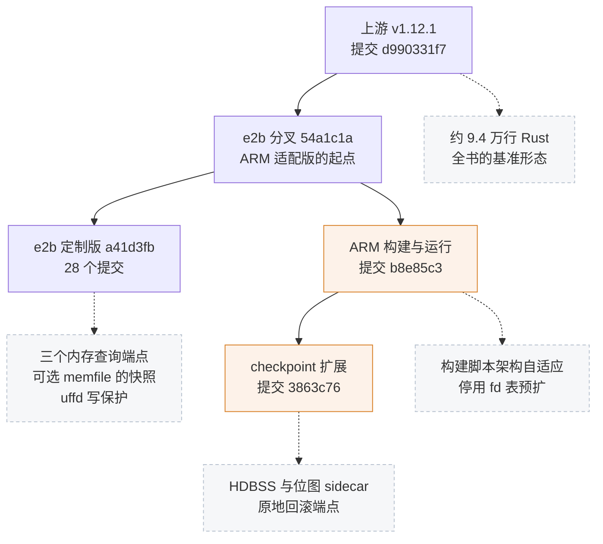
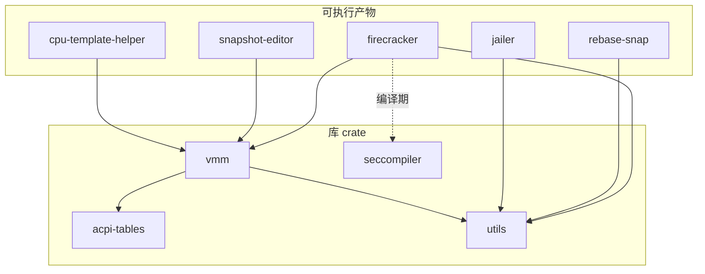

# 01 · 三层版本谱系与仓库地图

> 本书讲的不是一份代码，而是三份：上游 Firecracker，以及叠在它上面的两层改动。
> 读任何一篇之前，先要知道自己站在哪一层，以及那一层相对下一层动了什么。
> 本篇给出三层的提交谱系与改动规模，再给出一张仓库地图：每个 crate 多大、做什么、谁依赖谁。
>
> **读者**：所有读者，尤其是第一次打开这份代码的人。
> **预备**：无。
> **代码**：`Cargo.toml`、`src/*/Cargo.toml`、`scripts/build.sh`、`resources/`、`tests/`、`tools/`、`docs/`

---

## 0. 本篇要回答的问题

1. 三层版本各自是什么、由哪个提交确定、彼此之间隔着多少个提交？
2. 每一层相对下一层改了多少文件、多少行，改在哪些模块？
3. guest 内核为什么也算进谱系，它在三层里分别是什么形态？
4. Firecracker 仓库里有哪些 crate，各自多大、做什么、依赖关系是什么样的？
5. `vmm` 这个占了九成代码量的 crate，内部怎么划分，哪些子模块值得先读？
6. e2b infra 作为调用方，是怎么拿到并使用 Firecracker 二进制的？

---

## 1. 三层是一条线，不是一棵树

三层版本的关系是线性的：每一层都以前一层的完整代码为起点，在其上追加提交，没有互相合并的分叉。
这一点决定了本书的组织方式 —— 第一到第八部分讲上游 v1.12.1，第九、第十部分各讲一层的增量，
读者可以只读上游部分而不受后两层影响，但反过来不行。

最底下是**上游 v1.12.1**，即 firecracker-microvm/firecracker 仓库 tag `v1.12.1` 所指的提交 `d990331f7`
（tag 本身是个带注释的 tag 对象，对象哈希是 `e538c8d1f`，与提交哈希不是一回事，不要混用）。
本书对「Firecracker 的行为」的一切陈述，未特别说明处都以这个提交的代码为准。

往上第一层是 **e2b 定制版**：e2b-dev/firecracker 仓库分支 `firecracker-v1.12-direct-mem` 的提交 `a41d3fb`。
从 `v1.12.1` 到它一共 28 个提交，其中两个是合并提交。这 28 个提交做的事可以分成四类：

- 加了三个供宿主进程直接查询 guest 内存的只读端点（`GET /memory/mappings`、`GET /memory`、`GET /memory/dirty`）；
- 把快照接口里的内存文件路径改成可选，使得一次 `PUT /snapshot/create` 可以只写 vmstate 而不写内存文件；
- 在 guest 内存上开启 userfaultfd 写保护（提交 `8fc760f61`，是 `a41d3fb` 的前一个提交）；
- 补了一套构建与发布脚本，以及配套的集成测试与 CI 调整。

另有四个提交（`85ebde70e`、`21dc66d1a`、`13ffca99b`、`7f528b416`）是通过合并上游维护分支 `firecracker-v1.12` 带进来的，
内容是宿主 CPU 特性检查与 MSR 例外表的修复，不属于 e2b 自己的功能；第 55 篇展开。

再往上是 **ARM 适配版**：KASandbox 仓库 `firecracker/` 目录在提交 `3863c76` 的形态。
它的起点不是 `a41d3fb`，而是 e2b 分叉上更早的 `54a1c1a` —— 迁入时那是分支的头部，
两者之差只有 uffd 写保护与一次 CI 清理这两个提交（`git -C … diff 54a1c1a a41d3fb` 只动 5 个文件）。
这个细节在 aarch64 上有实际后果，第 57 篇讲。ARM 适配版在这个起点上做了两段工作：

- **构建与运行部分**：让它在 aarch64 的鲲鹏 / openEuler 宿主上编得出、跑得起来；
- **checkpoint / restore 扩展**：使能鲲鹏的硬件脏页跟踪 HDBSS（hardware dirty bit state structure），
  加脏页位图 sidecar、`PUT /snapshot/save-dirty-bitmap` 与原地回滚端点 `PUT /snapshot/rollback`。

部署在鲲鹏宿主上的 `firecracker.arm` 就是从 `3863c76` 构建的。

图里唯一的分叉点在 `54a1c1a`：e2b 定制版沿着自己的分支往前走了两个提交，ARM 适配版从这里拐向 KASandbox 仓库。
除此之外没有任何合并，任意两点之间的差异都能用一条 `git diff` 完整取出，不需要理解合并历史。
本书上游各篇末尾的「后续各层的差异」小节就是这样得出的：把该篇涉及的文件名喂给几条 diff 命令，
有输出就写，没输出就不写。读者排查线上问题时可以用同样的方法确认「我手上这个二进制里这段代码是不是原样的上游」。

e2b-dev/firecracker 里还有 `firecracker-v1.10-direct-mem`、`firecracker-v1.14-direct-mem` 等几条平行分支，
把同一组内存端点移植到别的上游小版本上；另有一条 `firecracker-v1.12-direct-mem-arm64-uffd-fix`，
名字就说明了它处理的是 aarch64 上的 uffd 问题。本项目取的是 v1.12 那条主线，其余几条在第 53、55、57 篇用到时再提。

还要提醒一点：ARM 适配版住在一个更大的仓库里。KASandbox 是完整的沙箱平台仓库，
Firecracker 只是其中的 `firecracker/` 子目录，同一批提交里往往还夹着 orchestrator 与部署脚本的改动。
统计这一层的规模时必须用 `-- firecracker` 限定路径，否则数出来的是整个平台的活动量。

---

## 2. 每层改了多少

下表的数字来自各层的 `git diff --numstat`，统计口径是「相对起点的增删行数」，ARM 两段都已限定到 `firecracker/` 目录。

| 层 | 提交数 | 触及文件 | 新增行 | 删除行 |
|---|---|---|---|---|
| e2b 定制版（相对上游 v1.12.1） | 28 | 34 | 1042 | 64 |
| ARM 构建与运行（相对 `54a1c1a`） | 1 | 2 | 18 | 14 |
| ARM checkpoint / restore 扩展 | 8 | 27 | 1661 | 22 |

三行数字的量级差两个数量级以上，形状也完全不同，值得分别看。

### 2.1 e2b 定制版：加旁路，不动主路

把 e2b 定制版的 34 个文件按目录拆开：`src/` 下 18 个文件、+696 / −21 行；
`tests/` 下 6 个文件（pytest 集成测试）、+259 / −19 行；其余 10 个文件是 seccomp 过滤器、构建脚本、
`Makefile`、`Cargo.lock` 与工具脚本。也就是说功能代码不到七百行，其中一半集中在三个位置：

- `src/vmm/src/vstate/vm.rs`（+192）：三个内存查询端点的实现主体，加在 `Vm` 上。
- `src/vmm/src/utils/pagemap.rs`（+115，新文件）：读宿主的 `/proc/<pid>/pagemap` 判断页的常驻与脏状态。
- `src/firecracker/src/api_server/parsed_request.rs`（+70）与新文件 `request/memory.rs`（+52）：
  新端点的路由与请求解析，三个解析函数是 `parse_get_memory_mappings()`、`parse_get_memory()`、`parse_get_memory_dirty()`。

其余是把这条链路接起来的胶水：`rpc_interface.rs`（+67 / −5）加三个 `VmmAction` 变体与对应的 `VmmData` 响应类型，
`lib.rs`（+44）加 `Vmm` 上的查询方法，`vmm_config/instance_info.rs`（+29）扩展实例信息，
`persist.rs`（+27 / −6）与 `vmm_config/snapshot.rs`（+3 / −1）把快照请求里的内存文件路径改成可选，
`swagger/firecracker.yaml`（+82）把新端点写进 API 契约。
seccomp 过滤器也要改（x86_64 +14 行、aarch64 +4 行），否则新端点用到的系统调用一调就被杀。

这个分布本身说明了这一层的性质：它没有改动 Firecracker 的任何既有行为路径，
只是在控制面上新开了几个只读端点，再把快照接口的一个必填字段放松成可选。第九部分逐个讲。

### 2.2 ARM 构建与运行部分：两个文件，一个取舍

对 Firecracker 源码的改动只有两处，都在提交 `b8e85c3` 里：

- `scripts/build.sh`：产物路径里写死的 `x86_64-unknown-linux-musl` 改成按 `uname -m` 拼出来。
- `src/firecracker/src/main.rs`：把 `main_exec()` 里调用 `resize_fdtable()` 的那一段整体注释掉。

第二处不是移植性问题，是一个有代价的取舍。`resize_fdtable()` 在进程启动时预先把文件描述符表扩到上限，
目的是让后续快照恢复时大量建 fd 的过程不必反复扩表。停用它意味着放弃这部分恢复开销的优化，
换取绕开该环境上出现的一类进程异常。上游对这个函数三种错误的分级处理仍然原样留在注释块内，
从代码上看不出停用的原因，只能从提交信息推断；第 58 篇按构建与运行环境说明后果。

这一层的实质内容不在 diff 里。aarch64 的 vCPU 初始化、FDT 生成、GIC 保存恢复都是上游早就写好的代码路径，
只是在 x86_64 宿主上从不执行；把它们跑通、跑对，并处理 seccomp 过滤器与 guest 内核的差异，是第 58 至 63 篇的主题。

### 2.3 checkpoint / restore 扩展：新增一个模块，改动摊到设备层

八个提交、27 个文件、+1661 / −22 行。最大的一块是新文件 `src/vmm/src/rollback.rs`（656 行），
原地回滚的全部逻辑在这里。其次是 `src/vmm/src/vstate/memory.rs`（+276）与 `vstate/vm.rs`（+139），
前者加内存写回与位图 sidecar 的读写，后者加脏页跟踪后端的切换与 HDBSS 使能；
`arch/aarch64/vm.rs`（+40）是 HDBSS 在 VM 层的挂接点。

剩下的改动很分散：`devices/virtio/` 下四个 `persist.rs` 与 `net/device.rs` 各加十几到二十几行，
因为回滚要把设备状态原地写回一台**正在运行的** microVM，而上游的 `Persist` 实现只服务于
「构造一台全新的设备」这一种场景。`vstate/vcpu.rs`（+29 / −2）加了回滚用的 vCPU 事件，
`rpc_interface.rs`（+76）、`vmm_config/snapshot.rs`（+65）与 `request/snapshot.rs`（+17）加两个新端点，
`swagger/firecracker.yaml`（+95）写进契约。aarch64 的 seccomp 过滤器 +61 / −5 行，
为回滚路径上新用到的 ioctl 与系统调用开口。

这层改动的形状与 e2b 定制版正相反：e2b 那层是「加一条旁路」，这层是「在既有路径上加一个反方向」。
后者要碰的地方多得多，因为每一处保存状态的代码都要回答「反过来写进去会怎样」。第十部分从第 64 篇起逐个讲。

### 2.4 guest 内核：三层里零源码改动

Firecracker 只是半台机器。它给 guest 提供的设备是 virtio-mmio 的一组，
guest 内核必须编进对应的驱动、关掉用不上的子系统，否则要么起不来，要么起得很慢。
所以「哪一层」这个问题对内核同样成立。

e2b 定制版用的 guest 内核来自 e2b-dev/fc-kernels 仓库，本书取 release `v0.0.8`（commit `b8cea06`）。
这个仓库里**没有内核源码补丁**，只有配置与构建脚本：`configs/` 下按架构分目录放 `.config`
（`configs/x86_64/6.1.158.config`、`configs/arm64/6.1.158.config` 等），
`kernel_versions.txt` 列出要构建的版本（6.1.102 与 6.1.158），
`build.sh` 从 amazonlinux/linux 仓库检出对应 tag，套上配置直接 `make vmlinux`。
`build.sh` 里的 `TARGET_ARCH` 变量决定构建 x86_64 还是 arm64，后者在 x86_64 宿主上走交叉编译。
换句话说，e2b 对内核的定制全部体现在那份 `.config` 上；第 56 篇讲这份配置里哪些选项是 Firecracker 要求的。

ARM 适配版没有再动内核。部署包里的 `vmlinux.bin.arm` 取自 fc-kernels release `v0.0.12` 的 arm64 官方构建
（6.1.158，2026-04-10），与 `v0.0.8` 用的是同一份 arm64 配置。
部署里另有一个 openEuler 变体内核（`vmlinux.bin.arm.openeuler`，按 6.6.0-132.0.0 命名），
供指定该版本的模板使用；第 61 篇讲部署里的内核文件布局。

把内核放进谱系还有一个实际理由：本书第十部分讲的 HDBSS 是宿主侧特性，
但 guest 看到的内存布局、设备数量与启动路径都由内核配置决定，回滚时要校验的设备拓扑因此与内核配置绑定。
换内核不改 Firecracker 也可能让回滚失败，这一点第 72 篇会再提。

---

## 3. 仓库地图：十二个 crate

Firecracker 是一个 cargo workspace，根 `Cargo.toml` 的 `members` 写的就是 `src/*`，
每个子目录一个 crate。下表是各 crate 的规模与职责，行数口径是该 crate `src/` 下所有 `.rs` 文件的总行数
（含文件内的 `#[cfg(test)]` 单元测试，不含 crate 级的 `tests/` 与 `benches/`）。

| crate | 行数 | 产物 | 职责 |
|---|---|---|---|
| `vmm` | 77 285 | 库 | VMM 全部逻辑：vCPU、内存、设备、快照、控制面 |
| `firecracker` | 4 920 | 二进制 | 主程序：参数解析、API server、事件循环驱动 |
| `jailer` | 3 133 | 二进制 | 生产环境的隔离启动器：chroot、cgroup、namespace |
| `acpi-tables` | 2 704 | 库 | x86_64 的 ACPI 表构造 |
| `cpu-template-helper` | 2 674 | 二进制 | CPU 模板的导出、裁剪与校验 |
| `utils` | 1 411 | 库 | 参数解析、时间、校验函数 |
| `snapshot-editor` | 650 | 二进制 | 离线编辑快照的内存文件与 vmstate |
| `seccompiler` | 599 | 库 + 二进制 | 把 JSON 描述的 seccomp 过滤器编译成 BPF |
| `clippy-tracing` | 445 | 二进制 | 批量增删 `tracing::instrument` 属性的源码工具 |
| `rebase-snap` | 329 | 二进制 | 把差分内存文件合并回基准内存文件 |
| `log-instrument` | 56 | 库 | 函数进出打 trace 日志的属性宏 |
| `log-instrument-macros` | 38 | 库 | 上一项的过程宏实现 |

合计约 9.4 万行。`vmm` 一个 crate 占 82%，这是本书篇幅分配的直接依据。

依赖关系很浅。`vmm` 只依赖 `acpi-tables`、`utils` 与可选的 `log-instrument`；
`firecracker` 依赖 `vmm` 与 `utils`，并把 `seccompiler` 列为 **build-dependency** ——
`src/firecracker/build.rs` 在编译期把 `resources/seccomp/<target>.json` 编成 BPF 内嵌进二进制，
运行期不再需要这个 crate。三个离线工具各自依赖 `vmm` 或 `utils`；
`jailer` 刻意不依赖 `vmm`，因为它要静态链接成独立二进制，在 Firecracker 进程之前运行。

还有一处值得注意：根 `Cargo.toml` 的 `default-members` 列了七个 crate，**不含 `jailer` 也不含 `vmm` 以外的库**。
注释解释了原因 —— 默认的 `cargo build` 编 gnu target，而 jailer 必须静态编译才能在 chroot 之后正常工作，
所以它被排除在默认构建之外，由构建脚本单独处理。第 43 篇讲 jailer 本身，第 46 篇讲构建流程。

---

## 4. `vmm` 内部：十六个目录与八个顶层文件

`src/vmm/src/` 下的划分与本书第二到第七部分的划分基本对应。

| 模块 | 行数 | 本书位置 |
|---|---|---|
| `devices/` | 29 137 | 第五部分（其中 `virtio/` 27 238） |
| `arch/` | 10 614 | 第三部分（`x86_64/` 与 `aarch64/` 各约五千行） |
| `dumbo/` | 6 724 | 第 31 篇 |
| `cpu_config/` | 6 318 | 第四部分 |
| 顶层 `.rs` 文件 | 6 411 | 第二、六部分 |
| `mmds/` | 2 720 | 第 32 篇 |
| `vstate/` | 2 499 | 第三部分 |
| `vmm_config/` | 2 495 | 第 10 篇 |
| `device_manager/` | 2 274 | 第 23 篇 |
| `io_uring/` | 2 067 | 第 28 篇 |
| `logger/` | 1 516 | 第 44 篇 |
| `rate_limiter/` | 1 407 | 第 35 篇 |
| `gdb/` | 1 346 | 第 45 篇 |
| `snapshot/` | 576 | 第 36 篇 |
| `utils/` | 568 | 散见 |
| `acpi/` | 344 | 第 17 篇 |
| `test_utils/` | 269 | 第 47 篇 |

几处需要先说明。

`devices/virtio/` 里最大的三块是 `vsock/`（6 159 行）、`block/`（5 813）、`net/`（5 005），
`balloon/`（2 150）、`rng/`（946）与 bindgen 生成的 `generated/`（307）都不大；
另有约 6 800 行是设备无关的公共部分 —— `queue.rs`（1 721）、`iovec.rs`（1 075）、`mmio.rs`（987）、
`vhost_user.rs`（969）、`iov_deque.rs`（535）、`persist.rs`（479）、`device.rs`（314）。
这部分是 virtio 的传输层与队列实现，也就是第 25、26 篇的内容；读任何一个具体设备之前都要先读它，
本书第 04 篇先把 virtio 的概念讲清楚。

`vstate/` 只有两千多行却是全书核心之一：`kvm.rs`、`vm.rs`、`vcpu.rs`、`memory.rs` 四个文件，
分别对应 `/dev/kvm`、VM fd、vCPU fd 与 guest 内存四件东西。后两层的改动几乎都落在这里。

顶层的八个文件里，`resources.rs`（1 575）、`builder.rs`（1 284）、`rpc_interface.rs`（1 276）、
`lib.rs`（916）、`persist.rs`（762）五个构成控制面主干：
从 HTTP 请求到 `VmmAction`，再到构建、快照与运行时更新。
其余三个是 `signal_handler.rs`、`seccomp.rs` 与 `initrd.rs`。

`src/firecracker/src/` 的划分更简单：`main.rs` 是进程入口，`api_server/` 是 HTTP 服务与请求解析，
`api_server_adapter.rs` 把 API 线程与 VMM 线程接起来，`seccomp.rs` 与 `metrics.rs` 各管一件事，
`generated/` 是从 swagger 契约生成的类型。

---

## 5. 源码之外的四个目录

`resources/` 放构建与运行时要用的数据。`resources/seccomp/` 下按 target 三元组各一份 JSON 过滤器
（`x86_64-unknown-linux-musl.json`、`aarch64-unknown-linux-musl.json`，外加 `unimplemented.json`），
构建时由 `seccompiler` 编成 BPF 内嵌进二进制。`resources/guest_configs/` 放 CI 用的 guest 内核配置，
`rebuild.sh` 按这些配置构建内核与 rootfs。后两层改动里都有对 seccomp JSON 的修改，原因见第 55、62 篇。

`tests/` 是一整套 pytest 工程，不是 Rust 测试：`framework/` 是测试框架（起 microVM、发 API、断言），
`integration_tests/` 按 `functional/`、`performance/`、`security/`、`build/`、`style/` 分组。
Rust 单元测试写在各个 `.rs` 文件内的 `#[cfg(test)] mod tests` 里，不在这个目录。第 47 篇讲测试体系。

`tools/` 放开发脚本，核心是 `devtool` —— 把构建与测试都放进一个容器镜像里执行，
使得本机不必装 musl 工具链。`bindgen.sh` 与 `bindgen-patches/` 生成各处的 `generated/` 目录，
`release*.sh` 与 `bump-version.sh` 管发布流程。

`docs/` 是上游文档，按主题分：`design.md`、`snapshotting/`、`cpu_templates/`、`mmds/`、
`jailer.md`、`seccomp.md`、`hugepages.md` 等。这些文档写得不差，但版本漂移比代码快，
本书把它们当参考而不是依据 —— 凡文档与 v1.12.1 的代码冲突处，以代码为准。

---

## 6. e2b infra 怎么消费这个二进制

Firecracker 对上层只是一个可执行文件加一个 Unix socket，没有库接口。
这个事实决定了三层改动的形态：调用方与 Firecracker 之间的契约就是 swagger 文件描述的那组 HTTP 端点。

构建侧：e2b 定制版的 `scripts/build.sh` 从 `src/firecracker/swagger/firecracker.yaml` 的 `info.version` 字段
读出版本号（v1.12.1 上是 `1.12.1`），再取 HEAD 的 7 位短哈希，拼成 `v<版本>_<短哈希>` 作为版本名，
构建后把二进制放进 `build/fc/<版本名>/firecracker`；`scripts/upload.sh` 把整个目录上传到对象存储。
提交 `a41d3fb` 对应的版本名就是 `v1.12.1_a41d3fb`。

消费侧：orchestrator 按 `/fc-versions/<版本名>/firecracker` 寻址，版本名由沙箱模板指定，
默认值写在 `packages/shared/pkg/feature-flags/flags.go` 的常量 `DefaultFirecackerV1_12Version` 里，
2026.09 的上游 infra 上正是 `v1.12.1_a41d3fb`。版本名是纯字符串，
所以一台宿主上可以并列放多份 Firecracker，不同模板用不同版本，灰度与回退都只是改一个字符串。

ARM 单机部署走的是同一套机制，但版本名不再按上面的规则拼。
`e2b-deploy/dep/init-client.sh` 里写死 `FIRECRACKER_VERSION=1.13.1`，
把 RPM 自带的 `bin/firecracker`（即 ARM 适配版构建出的 `firecracker.arm`）装到 `/fc-versions/v1.13.1/firecracker`；
ARM 侧 infra 的 `flags.go` 里默认版本也改成了 `v1.13.1`。
**版本名与源码基线在这里对不上**：目录叫 v1.13.1，源码仍是 v1.12.1 这条线。
这是排查线上问题时必须知道的一个事实，第 63 篇讲对接细节。

反过来看，这套消费方式也解释了为什么两层改动都尽量做成「加端点」而不是「改行为」。
只要既有端点的语义不变，换一个版本目录就能切换实现。
e2b 定制版把 `mem_file_path` 从必填改成可选，是这条原则的一次边界情况：
字段本身仍在，旧的调用方式仍然有效，只是多了一种不传它的用法。

---

## 7. 小结

- 三层线性叠加：上游 v1.12.1（`d990331f7`）→ e2b 定制版（`a41d3fb`，28 个提交）→
  ARM 适配版（`3863c76`）。唯一的分叉点是 e2b 分支上的 `54a1c1a`：ARM 适配版从那里迁出，
  比 e2b 定制版少 uffd 写保护与一次 CI 清理两个提交。
- e2b 定制版的功能代码约 696 行（`src/` 下 18 个文件），集中在 `vstate/vm.rs`、新文件 `utils/pagemap.rs`
  与 API 解析层；它只新增三个只读端点并放松一个必填字段，不改既有行为路径。
- ARM 适配版的构建与运行部分对源码只改两个文件：构建脚本的架构自适应，以及停用 `resize_fdtable()`；
  后者用恢复开销换环境稳定性。这一段的实质内容在 aarch64 代码路径与部署环境，不在 diff 里。
- checkpoint / restore 扩展约 1661 行，新文件 `rollback.rs` 占 656 行，其余摊在内存、vCPU 与各设备的持久化实现上；
  它要在既有路径上加一个反方向，触及面比 e2b 定制版宽得多。
- guest 内核同属谱系但零源码改动：fc-kernels 只提供 `.config` 与构建脚本，ARM 部署用的是同一份 arm64 配置的官方构建。
- 仓库共十二个 crate 约 9.4 万行，`vmm` 一个占 82%；依赖关系很浅，`jailer` 刻意不依赖 `vmm`，
  `seccompiler` 只是 `firecracker` 的 build-dependency。
- `vmm` 内部最大的三块是 `devices/`（2.9 万行）、`arch/`（1.1 万行）、`dumbo/` 与 `cpu_config/`（各 0.6～0.7 万行）；
  `vstate/` 只有 2 499 行，却是后两层改动的主要落点。
- Firecracker 对上层只是一个二进制加一个 Unix socket；按 `/fc-versions/<版本名>/firecracker` 取用，
  ARM 单机部署里的版本名 `v1.13.1` 与源码基线不一致。

---

## 延伸阅读 / 下一篇

- [第 00 篇 · 全书导读与 Firecracker 总览](00-overview.md)：一篇读完全貌。
- [第 02 篇 · microVM 与 Firecracker 的设计取舍](02-microvm-design-tradeoffs.md)：下一篇，讲这份代码为什么长成这样。
- [第 46 篇 · 代码组织、依赖与构建](46-code-organization-and-build.md)：crate 划分与构建流程的完整版。
- [第 49 篇 · e2b 为什么分叉](49-why-e2b-forked.md)、[第 57 篇 · 迁入哪个分叉提交](57-which-fork-commit-and-uffd-wp.md)：
  本篇第 1 节两处谱系细节的展开。
- [第 75 篇 · 代码地图](75-code-map.md)：从文件反查篇目。
- [第 78 篇 · 各层差异总表](78-layer-diff-tables.md)：本篇第 2 节的文件级展开。
- e2b 侧怎么起 Firecracker 进程、怎么管版本目录，见 [e2b 手册第 28 篇](../e2b-infra/28-firecracker-process-management.md)。
