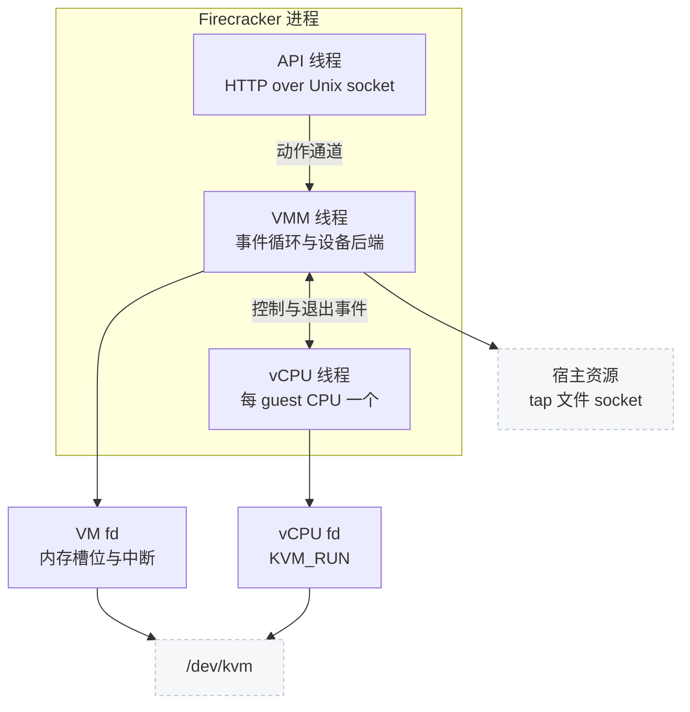

# 02 · microVM 与 Firecracker 的设计取舍

> Firecracker 的代码之所以不到十万行，不是因为它写得比别的 VMM 精简，而是因为它砍掉了一整类功能。
> 本篇讲它砍掉了什么、为此换到了什么、又为此付出了什么，以及这些取舍如何决定了后面各篇的结构。
>
> **读者**：所有读者。　**预备**：[第 01 篇 · 三层版本谱系与仓库地图](01-lineage-and-repo-map.md)。
> **代码**：`src/vmm/src/lib.rs`、`src/vmm/src/builder.rs`、`src/firecracker/src/main.rs`、
> `src/vmm/src/device_manager/`、`src/jailer/src/env.rs`、`docs/design.md`

---

## 0. 本篇要回答的问题

1. 一台传统虚拟机的启动时间与内存开销花在哪里，为什么这些开销对多租户高密度场景不可接受？
2. Firecracker 的机器模型里到底有哪些设备，砍掉的那些东西在使用上意味着什么限制？
3. 一个 Firecracker 进程里跑着哪几类线程，各自负责什么，为什么这样分？
4. 威胁模型是什么，三道防线分别挡住哪一类攻击，哪一道是必需的、哪一道是可选的？
5. 这些取舍为 e2b 这类场景带来了什么便利，又留下了哪些必须自己补的缺口？

---

## 1. 问题：容器不够安全，虚拟机不够便宜

多租户平台要在同一台宿主上跑互不信任的用户代码。用容器跑，隔离边界是 Linux 内核的命名空间与
cgroup，共享的攻击面是整个内核系统调用接口 —— 一个内核提权漏洞就能穿透边界。
用传统虚拟机跑，隔离边界降到硬件虚拟化层，攻击面小得多，但代价出现在三个地方。

第一是启动时间。一台常规虚拟机要经过固件（BIOS 或 UEFI）自检、枚举 PCI 总线、
引导加载器读取磁盘上的内核映像，然后内核才开始跑。这条路径上大部分工作是为「未知硬件」准备的，
而云上每一台虚拟机的虚拟硬件都完全一样，这些步骤的结果是可预知的，却每次都重做一遍。

第二是内存开销。一个功能完整的 VMM 进程要模拟一整台 PC：PCI 总线、多种网卡与磁盘控制器、
显卡、USB、声卡、各种历史设备。哪怕 guest 一个都不用，这些设备模型的数据结构与代码仍然在进程里。
高密度部署下，几十上百台虚拟机的 VMM 常驻开销加起来相当可观。

第三是攻击面。设备模拟代码是 VMM 里最容易出漏洞的部分，因为它直接解析 guest 写进来的数据。
设备种类越多，这段代码越大，出漏洞的机会越多，而这些代码跑在宿主上、在虚拟化边界的外侧。

Firecracker 的回答是：既然云上的虚拟硬件是固定的，就不要做通用 PC，只做一台「刚好够跑 Linux」的机器。
这个决定往下推导，就得到了它全部的设计特征。

## 2. 取舍一：把机器模型砍到最小

### 2.1 没有固件，内核直接装进内存

Firecracker 不提供 BIOS 也不提供 UEFI。`src/vmm/src/arch/x86_64/mod.rs` 与
`src/vmm/src/arch/aarch64/mod.rs` 各有一个 `load_kernel()`，用 `linux-loader` 把宿主上的内核文件
直接读进 guest 内存，得到一个入口地址，然后把 vCPU 的寄存器直接设成「内核期望的启动状态」。
x86_64 上支持两种引导协议：Linux 64 位引导协议与 PVH；`load_kernel()` 检查 ELF note 里有没有 PVH 入口，
有就走 PVH，没有就走前者。aarch64 只有一种。

代价是 guest 内核必须由宿主提供，不能放在虚拟磁盘里由 guest 自己引导。
换句话说，用户不能像用常规虚拟机那样「给一个装好系统的磁盘映像就能开机」，
必须把内核和 rootfs 分开交付。这个约束贯穿整个 e2b 的模板体系。

### 2.2 没有 PCI，只有 virtio-mmio

上游 v1.12.1 的代码里没有 PCI 总线的实现（`src/vmm/src/device_manager/` 下只有
`mmio.rs`、`legacy.rs`、`acpi.rs`）。所有半虚拟化设备都挂在 MMIO 上：
`src/vmm/src/device_manager/mmio.rs` 从一段固定的 MMIO 地址区间里按 `MMIO_LEN`（0x1000，即 4 KiB）
一个一个切给设备，中断号从 `IRQ_BASE` 起顺序分配（x86_64 上是 5 到 23，aarch64 上是 32 到 128），
再把每个设备的地址、大小、中断号写进内核命令行的 `virtio_mmio.device=` 参数。

省掉 PCI 的收益是双重的：guest 内核不必枚举总线，省掉启动时间；VMM 不必实现配置空间、
BAR 分配、MSI-X 这一整套机制，省掉代码与攻击面。代价是设备不能热插拔 —— 设备表在内核命令行里写死，
开机后不能增减，只能改已有设备的后端文件或限速参数。

### 2.3 五种 virtio 设备加几个必需的 legacy 设备

`src/vmm/src/devices/virtio/mod.rs` 里的类型 ID 常量列出了全部设备种类：
net 是 1、block 是 2、rng（entropy）是 4、balloon 是 5，vsock 的 19 从
`src/vmm/src/devices/virtio/vsock/mod.rs` 重导出。没有显卡、没有 USB、没有声卡、没有 SCSI。

`src/vmm/src/builder.rs` 的 `build_microvm_for_boot()` 把挂设备的顺序写得很直白：
先是可选的 boot timer 伪设备，然后 balloon、block、net、vsock、entropy，
之后在 aarch64 上调 `attach_legacy_devices_aarch64()`，最后挂 vmgenid。
legacy 设备在两个架构上不一样：x86_64 由 `src/vmm/src/device_manager/legacy.rs` 的
`PortIODeviceManager` 管，挂一个串口和一个 i8042 键盘控制器；
i8042 的唯一用途是让 guest 通过 ctrl-alt-del 触发重启。aarch64 上串口走 MMIO，
没有 i8042，代之以一个只读的 PL031 RTC。

vCPU 数量上限写在 `src/vmm/src/vmm_config/machine_config.rs` 的 `MAX_SUPPORTED_VCPUS`，值是 32。
时钟源只暴露 kvm-clock 一种。

## 3. 取舍二：一个进程一台 microVM

Firecracker 不做「一个守护进程管理多台虚拟机」。每台 microVM 是一个独立进程，
生命周期就是进程的生命周期，配置接口是这个进程自己监听的一个 Unix socket。

这个决定让隔离变成免费的：两台 microVM 之间的边界就是两个进程之间的边界，
宿主的 cgroup、namespace、OOM killer 都能直接作用在单台 microVM 上，不需要 VMM 自己再实现一套配额。
它也让故障域变小：一台 microVM 的 VMM 崩溃不影响别的。
代价是宿主上会有成百上千个进程，进程管理、日志收集、资源统计都要由外部的编排系统负责 ——
这正是 e2b orchestrator 存在的理由之一。

进程内部按职责分成三类线程，`docs/design.md` 的 Internal Architecture 一节给了概括，
代码里可以逐个对上：

- **API 线程**：`src/firecracker/src/api_server_adapter.rs` 的 `run_with_api()` 里用
  `thread::Builder` 起的那一个，跑 HTTP 服务，收到请求后转成一个动作经通道交给 VMM 线程，
  等结果再回响应。它不在数据面路径上。
- **VMM 线程**：主线程。它跑事件循环，处理所有设备 I/O 的后半段（从 tap 读、往块设备文件写）、
  定时器、API 动作。`Vmm` 结构（`src/vmm/src/lib.rs`）就是这个线程持有的状态：
  `kvm`、`vm`、`vcpus_handles`、`mmio_device_manager`、`resource_allocator`、
  x86_64 上还有 `pio_device_manager`，以及 `acpi_device_manager`。
- **vCPU 线程**：每个 guest CPU 一个，在 `src/vmm/src/vstate/vcpu.rs` 里由 `start_threaded()` 创建，
  线程名是 `fc_vcpu <序号>`。线程体是 `KVM_RUN` 的循环：陷出、判断退出原因、
  处理 MMIO 或 PIO 访问、再进去。

还有一条单线程路径：加 `--no-api` 并用 `--config-file` 一次性给出全部配置时，
`src/firecracker/src/main.rs` 的 `run_without_api()` 直接构建并启动，不起 API 线程。

图里的三级 fd 是 KVM 接口的基本形状：进程打开 `/dev/kvm` 得到一个总的句柄，
由它创建 VM fd，再由 VM fd 创建每个 vCPU fd。第 03 篇讲这三级各自能做什么。

线程分工的一个直接后果值得记住：**所有 API 动作都在 VMM 线程上串行执行**。
API 线程只是收发 HTTP，真正的工作要等 VMM 线程处理完手上的事件才轮到。
所以一次 API 调用的时延就是对应 VMM 动作的时延，两个并发请求不会并行执行。
创建快照这类重动作会把事件循环阻塞住，期间设备 I/O 停摆 —— 这既是简化，也是限制。

## 4. 威胁模型与三道防线

Firecracker 的威胁模型写得很明确：**vCPU 线程从启动那一刻起就被当作在跑恶意代码**。
不是「可能被攻破之后」，而是「从一开始就是」。设计要保证的是即使 guest 完全被控制，
它也只能影响自己这一台 microVM。

从这个假设出发有三道防线，由内到外：

| 防线 | 边界在哪 | 挡住什么 | 是否必需 |
|---|---|---|---|
| KVM 与硬件虚拟化 | guest 与 VMM 进程之间 | guest 直接读写宿主内存、执行宿主指令 | 必需，无法关闭 |
| seccomp 过滤器 | VMM 进程与宿主内核之间 | VMM 被攻破后调用非必需的系统调用 | 默认开启，`--no-seccomp` 可关 |
| jailer | VMM 进程与宿主文件系统、资源之间 | 逃出进程后访问别的文件、耗尽资源 | 可选，生产环境推荐 |

第一道防线是 KVM 给的，Firecracker 只是正确使用它：guest 的每一次 MMIO 访问都会陷出到
`KVM_RUN` 之外，由 `src/vmm/src/vstate/vcpu.rs` 里的退出处理分发给对应设备。
guest 看不到也碰不到 VMM 进程的地址空间。

第二道防线是 seccomp。`src/vmm/src/seccomp.rs` 里有三类过滤器，键名是 `vmm`、`api`、`vcpu`，
默认的过滤器规则以 JSON 形式放在 `resources/seccomp/<target 三元组>.json`，
构建时由 `seccompiler` 编译成 BPF 程序内嵌进二进制。安装时机是关键：
`builder.rs` 的 `build_microvm_for_boot()` 先调 `start_vcpus()`（每个 vCPU 线程在进入
`KVM_RUN` 之前自己装上 `vcpu` 过滤器），然后作为「恢复 vCPU 之前的最后一步」给 VMM 线程装上 `vmm` 过滤器。
也就是说，任何 guest 代码开始执行时，能碰到它的每一个线程都已经被限制过了。
这一层的代价是：任何新增的系统调用都必须同时改过滤器，否则运行时被 SIGSYS 杀掉。
后面两层改动都动过 seccomp 过滤器，原因就在这里。

第三道防线是 jailer，一个独立的二进制（`src/jailer/`）。它在 Firecracker 之前运行，
用高权限准备好环境 —— 建 chroot 目录（`src/jailer/src/env.rs` 里把路径拼成
`<chroot-base>/<exec-file>/<id>/root`）、设 cgroup、通过 `clone` 带 `CLONE_NEWPID`
进入新的 PID 命名空间、设资源上限 —— 然后丢掉权限，`exec` 成 Firecracker 二进制。
此后 Firecracker 只能访问被主动放进 chroot 的文件，或者别人传给它的文件描述符。
jailer 刻意不依赖 `vmm` crate，它是一个独立的小程序。

三道防线的关系是纵深防御而不是冗余：它们各自挡的是不同层面的失效，
关掉任何一道，剩下两道都挡不住那一类问题。

## 5. 这些取舍的代价清单

把上面的收益反过来读，就是使用 Firecracker 时必须接受的约束：

- 内核由宿主提供，guest 不能自带引导过程；换内核要换宿主上的文件。
- 设备不能热插拔；开机后能改的只有已有设备的后端与限速参数。
- 没有显卡、USB、SCSI 等设备，跑不了依赖这些硬件的负载。
- vCPU 数量上限 32。
- 网络与存储的后端由外部准备：网卡对应宿主上的 tap 设备，块设备对应宿主上的文件；
  Firecracker 不建 tap、不建文件系统，这些是编排系统的事。
- API 是同步串行的，重动作会阻塞事件循环。
- 生产环境需要额外跑 jailer，并自己收集日志与 metrics（两者都写到通过 API 指定的文件或命名管道）。

这些约束对通用虚拟化产品是硬伤，对「在一个受控平台上批量跑同构负载」的场景几乎没有影响。
Firecracker 是为后者设计的，用它做前者会处处别扭。

## 6. 这些取舍对 e2b 意味着什么

e2b 要的是从一个已经跑起来的沙箱状态秒级拉起新沙箱，并且让同一个模板的多台沙箱共享内存内容。
Firecracker 的快照机制正好给了前半截：把一台暂停的 microVM 的全部状态序列化成
一个状态文件加一份 guest 内存映像，之后可以反复从它恢复。
机器模型极小这一点让这件事变得可行 —— 要保存和恢复的设备状态只有五种 virtio 设备加两三个 legacy 设备，
而不是一整台 PC。

后半截 Firecracker 没有给。上游的快照接口是「把内存写成一个文件」，
而 e2b 需要的是「告诉我哪些页脏了、它们在宿主地址空间的哪里」，好由自己的内存管线按块处理。
第九部分讲的那组只读 API 就是补这个缺口。
ARM 适配版要处理的则是另外两个问题：把这一整套搬到 aarch64 上，以及把「恢复」反过来做 ——
不新建一个进程从文件重建，而是让一台正在跑的 microVM 退回自己过去的某个时刻。
这两件事都建立在本篇讲的取舍之上：设备种类固定，才可能逐个设备回答「状态怎么写回去」；
内存是进程自己的一段 `mmap`，宿主侧才可能不经 guest 就把偏离的页覆盖回来。

## 7. 小结

- Firecracker 的全部设计特征来自一个决定：不做通用 PC，只做一台刚好够跑 Linux 的机器。
- 没有固件，内核由 `load_kernel()` 直接装进 guest 内存；x86_64 上支持 Linux 64 位引导协议与 PVH 两种。
- 没有 PCI，设备全部挂在 MMIO 上，地址按 4 KiB 一个由 `mmio.rs` 顺序分配，
  中断号从 `IRQ_BASE` 起；代价是设备不能热插拔。
- 设备只有五种 virtio 类型（net 1、block 2、rng 4、balloon 5、vsock 19）
  加串口，x86_64 另有 i8042，aarch64 另有 RTC。
- 一个进程一台 microVM；进程内分 API 线程、VMM 线程与每 vCPU 一个线程，
  所有 API 动作在 VMM 线程上串行执行。
- 威胁模型假设 vCPU 线程从一开始就在跑恶意代码；三道防线是 KVM、seccomp、jailer，
  seccomp 在任何 guest 代码执行之前就已装好。
- 代价是一份明确的约束清单：内核外置、设备固定、后端外置、API 串行、生产环境需要额外的编排与加固。
- 极小的机器模型是快照机制可行的前提，也是 e2b 选择 Firecracker 的直接原因。

---

## 延伸阅读 / 下一篇

- [第 03 篇 · 本书用到的 KVM API](03-kvm-api-primer.md)：下一篇，讲三级 fd 与本书要用到的 ioctl。
- [第 04 篇 · virtio 与 virtio-mmio 基础](04-virtio-and-mmio-primer.md)：设备契约与传输层。
- [第 11 篇 · builder：从配置到运行中的 microVM](11-builder.md)：本篇第 2.3 节挂设备顺序的完整版。
- [第 42 篇 · seccomp](42-seccomp.md)、[第 43 篇 · jailer](43-jailer.md)：两道防线的细节。
- [第 49 篇 · 为什么分叉：e2b 的内存管线要什么](49-why-e2b-forked.md)：第 6 节的展开。
- e2b 侧为什么选 microVM 而不是容器，见 [e2b 手册第 02 篇](../e2b-infra/02-why-sandbox.md)。
