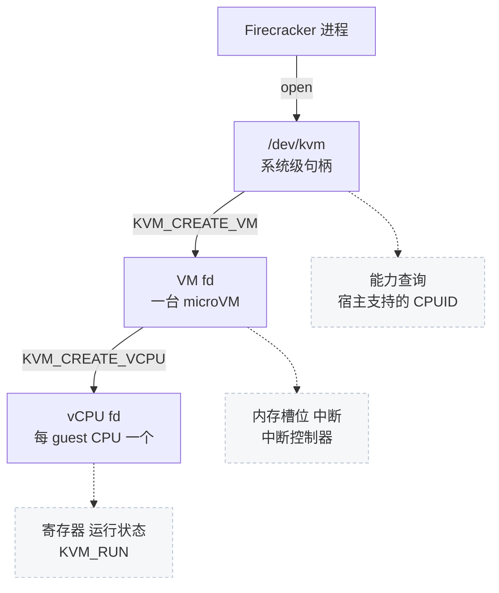
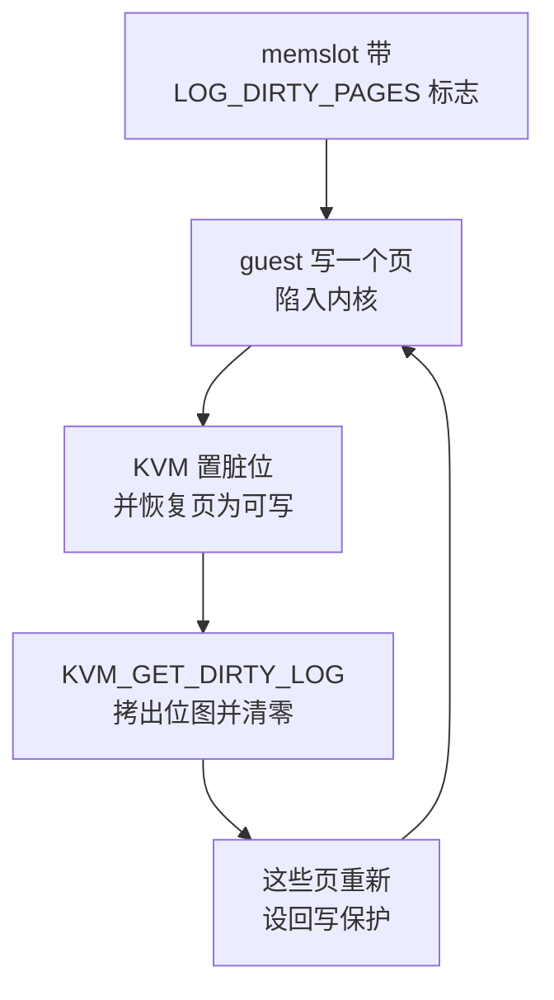

# 03 · 本书用到的 KVM API

> KVM 把「运行一台虚拟机」这件事变成了对三个文件描述符做 ioctl。本篇只讲 Firecracker 实际用到的那部分接口，
> 并指出每个接口在代码里的调用位置，后面各篇会反复回到这里。
>
> **读者**：没有写过 KVM 程序的读者。　**预备**：[第 02 篇 · microVM 与 Firecracker 的设计取舍](02-microvm-design-tradeoffs.md)。
> **代码**：`src/vmm/src/vstate/kvm.rs`、`src/vmm/src/vstate/vm.rs`、`src/vmm/src/vstate/vcpu.rs`、
> `src/vmm/src/arch/x86_64/kvm.rs`、`src/vmm/src/arch/x86_64/vm.rs`、`src/vmm/src/arch/aarch64/kvm.rs`、
> `src/vmm/src/arch/aarch64/vm.rs`

---

## 0. 本篇要回答的问题

1. KVM 的三级文件描述符各自代表什么，哪个 ioctl 属于哪一级？
2. guest 物理地址是怎么映射到宿主虚拟地址的，一台 microVM 能有多少个内存槽位？
3. KVM 的脏页日志是怎么工作的，「读一次就清零」这个语义意味着什么？
4. 中断是怎么投递进 guest 的，为什么 Firecracker 几乎不用 `KVM_IRQ_LINE`？
5. vCPU 的完整状态由哪些 ioctl 取出，为什么保存和恢复的顺序有讲究？
6. 怎么判断宿主内核支不支持某个特性，Firecracker 在启动时检查了哪些？

---

## 1. 三级文件描述符

KVM 的用户态接口是 `/dev/kvm` 这个字符设备。打开它得到第一级句柄，代表「这台宿主上的 KVM 子系统」；
对它做 `KVM_CREATE_VM` 得到第二级，代表一台虚拟机；对 VM fd 做 `KVM_CREATE_VCPU` 得到第三级，
代表一个虚拟 CPU。每一级能做的事互不重叠。



Firecracker 把这三级各包了一层：`Kvm`（`src/vmm/src/vstate/kvm.rs` 加两个架构各自的
`src/vmm/src/arch/*/kvm.rs`）、`Vm`（`src/vmm/src/vstate/vm.rs` 加 `arch/*/vm.rs`）、
`KvmVcpu`（`arch/*/vcpu.rs`），底下用的是 `kvm-ioctls` 与 `kvm-bindings` 两个 crate。
`kvm-ioctls` 把每个 ioctl 包成一个方法，`kvm-bindings` 提供 ioctl 要用的 C 结构体与常量。

下表把本书会用到的接口按归属分开。

| 级别 | 主要 ioctl | Firecracker 的调用位置 |
|---|---|---|
| `/dev/kvm` | `KVM_GET_API_VERSION`、`KVM_CHECK_EXTENSION`、`KVM_GET_SUPPORTED_CPUID`、`KVM_CREATE_VM` | `vstate/kvm.rs` 的 `Kvm::new()`、`arch/*/kvm.rs` 的 `Kvm::init_arch()` |
| VM fd | `KVM_SET_USER_MEMORY_REGION`、`KVM_GET_DIRTY_LOG`、`KVM_IRQFD`、`KVM_IOEVENTFD`、`KVM_CREATE_IRQCHIP`、`KVM_CREATE_PIT2`、`KVM_CREATE_DEVICE`、`KVM_CREATE_VCPU` | `vstate/vm.rs`、`arch/x86_64/vm.rs`、`arch/aarch64/vm.rs`、`device_manager/mmio.rs` |
| vCPU fd | `KVM_RUN`、`KVM_GET/SET_REGS`、`SREGS`、`FPU`、`XSAVE`、`XCRS`、`MSRS`、`LAPIC`、`MP_STATE`、`VCPU_EVENTS`、`KVM_ARM_VCPU_INIT`、`KVM_GET/SET_ONE_REG` | `vstate/vcpu.rs`、`arch/x86_64/vcpu.rs`、`arch/aarch64/vcpu.rs` |

### 1.1 打开与检查

`Kvm::new()` 做三件事，顺序固定。先打开 `/dev/kvm` 并比对 `KVM_GET_API_VERSION` 的返回值与
编译期常量 `KVM_API_VERSION`，不一致直接报错 —— KVM 的接口版本号自古是 12，这一步防的是环境异常。
然后把默认能力列表与 CPU 模板里声明的能力增删项合并（`combine_capabilities()`），
逐个用 `check_extension_raw()` 也就是 `KVM_CHECK_EXTENSION` 查，缺一个就报 `KvmError::Capabilities`。
最后调架构相关的 `init_arch()`。

默认能力列表在 `arch/*/kvm.rs` 里写死。x86_64 上有 14 项，包括 `KVM_CAP_IRQCHIP`、`KVM_CAP_IOEVENTFD`、
`KVM_CAP_IRQFD`、`KVM_CAP_USER_MEMORY`、`KVM_CAP_SET_TSS_ADDR`、`KVM_CAP_PIT2`、`KVM_CAP_MP_STATE`、
`KVM_CAP_XSAVE`、`KVM_CAP_XCRS`、`KVM_CAP_EXT_CPUID` 等；aarch64 上只有 7 项：
`KVM_CAP_IOEVENTFD`、`KVM_CAP_IRQFD`、`KVM_CAP_USER_MEMORY`、`KVM_CAP_ARM_PSCI_0_2`、
`KVM_CAP_DEVICE_CTRL`、`KVM_CAP_MP_STATE`、`KVM_CAP_ONE_REG`。
两张列表的差别本身就是一张两个架构差异的提纲。

x86_64 的 `init_arch()` 还额外做一件事：调 `KVM_GET_SUPPORTED_CPUID` 把宿主支持的 CPUID 叶子全部取回来缓存住，
后面 CPU 模板的归一化就在这份数据上做。aarch64 没有对应的东西，它的「CPU 配置」是一组系统寄存器。

能力还有第三种用法：**查而不必须**。aarch64 的 `Kvm::optional_capabilities()` 查
`KVM_CAP_COUNTER_OFFSET`，查到就用，查不到就走另一条路，不报错。

### 1.2 创建 VM

`vstate/vm.rs` 的 `Vm::create_common()` 调 `KVM_CREATE_VM`，但它外面套了一个重试循环：
最多试 5 次，遇到 `EINTR` 就退避（1、2、4、8 微秒）后重来。
代码注释解释了原因 —— `KVM_CREATE_VM` 内部要拿一大批锁，是个 CPU 密集的调用，
按内核惯例这类调用遇到待处理信号要立刻返回 `EINTR`；而在负载高的机器上，
即使没有待处理信号它也可能返回 `EINTR`。在 VMM 内部重试比让调用方从头起进程便宜得多。
这是一个很典型的例子：接口文档上的语义与实际观察到的行为不一致时，代码里要留一层防护。

## 2. 内存：memslot 把 GPA 映射到 HVA

KVM 不管理 guest 内存。guest 内存是 VMM 进程自己 mmap 出来的一段普通虚拟内存，
VMM 通过 `KVM_SET_USER_MEMORY_REGION` 告诉 KVM：「guest 物理地址（GPA）从 X 开始的 N 字节，
对应我进程里从 Y 开始的 N 字节」。这样一条映射叫一个**内存槽位**（memslot）。

`vstate/vm.rs` 的 `register_memory_region()` 是唯一的注册点，它填的结构体
`kvm_userspace_memory_region` 有五个字段：

```text
slot             槽位编号，按注册顺序从 0 递增
guest_phys_addr  GPA 起点
memory_size      长度（字节）
userspace_addr   HVA 起点，即宿主进程里这块 mmap 的地址
flags            0 或 KVM_MEM_LOG_DIRTY_PAGES
```

几个实现细节值得记住。槽位编号取的是当前已有区域的个数，所以它就是区域在
`GuestMemoryMmap` 里的序号；这一点让后面「按 slot 取脏页位图」可以直接与内存区域对齐。
槽位总数有上限，来自 `KVM_CAP_NR_MEMSLOTS`（代码里是 `Kvm::max_nr_memslots()`），
超了返回 `VmError::NotEnoughMemorySlots`。`flags` 只在该区域带用户态位图时才置
`KVM_MEM_LOG_DIRTY_PAGES`，也就是说「要不要让 KVM 跟踪脏页」这个决定是在建内存区域时就定下的，
不是运行时能改的。

GPA 与 HVA 的对应关系是本书后面几处关键设计的基础：guest 的一个物理页在宿主进程里就是一个普通的
虚拟内存页，宿主进程读写它不需要经过 KVM。e2b 定制版把这层映射直接暴露给外部进程，
让 orchestrator 用 `process_vm_readv` 读 guest 内存，靠的正是这一点。

## 3. 脏页日志：读一次就清零

当一个 memslot 带上 `KVM_MEM_LOG_DIRTY_PAGES` 标志时，KVM 会跟踪这个槽位里哪些页被 guest 写过。
实现方式依硬件而定，最通用的做法是把页表项设成只读，guest 写时陷入内核，
内核记下页号、把页恢复成可写、再让 guest 继续。位图在内核里，每页一位。

取位图的 ioctl 是 `KVM_GET_DIRTY_LOG`，它的语义是**取出并清零**：调用后内核把这份位图拷给用户态，
同时把自己那份清空，并把相应的页重新设回写保护。



Firecracker 侧有两个方法，都在 `vstate/vm.rs`：

- `get_dirty_bitmap()` 遍历所有内存区域，对每个槽位调一次 `get_dirty_log()`，
  结果攒成 `DirtyBitmap`，一个从槽位号到位图向量的映射。
- `reset_dirty_bitmap()` 做同样的遍历，但把结果扔掉 —— 它唯一的目的就是触发那次清零。

这两个方法的区别只在于要不要结果，这一点直接反映了「读即清零」的语义：
想清空位图，只能通过读一次来实现，没有单独的清零接口。

这个语义有一个直接后果：**谁先读，谁就拿走了这段时间的全部脏页信息**。
如果有两方都想知道「自上次以来哪些页脏了」，它们不能各读各的，必须协调。
Diff 快照与 e2b 的内存管线之间正是这种关系，第 14 篇与第 52 篇分别讲两边怎么处理。

代价也要说清楚：开着脏页跟踪时，guest 每写一个此前干净的页都要陷一次内核。
写得越散、越频繁，开销越大。所以 `track_dirty_pages` 是一个配置项而不是默认行为。

## 4. 中断：irqfd 与 ioeventfd

最朴素的中断投递方式是 `KVM_IRQ_LINE`：VMM 想给 guest 发中断时做一次 ioctl。
Firecracker 基本不走这条路，它用的是一对更省事的机制。

**irqfd** 把一个 eventfd 绑到一个中断号上：`KVM_IRQFD` 注册之后，任何人往这个 eventfd 写一下，
KVM 就给 guest 投递一次对应中断，不需要 VMM 再做 ioctl，也不需要 VMM 线程被调度到。
`device_manager/mmio.rs` 在注册每个 virtio 设备时调 `vm.register_irqfd()`，
把设备的中断 eventfd 与分配到的中断号绑上；
`device_manager/legacy.rs` 给 x86 的两个串口和 i8042 键盘做同样的事，
`device_manager/acpi.rs` 给 vmgenid 做。

**ioeventfd** 是反方向：`KVM_IOEVENTFD` 把一个 eventfd 绑到一个 MMIO 地址上，
guest 往那个地址写特定值时，KVM 不陷出到用户态，而是直接往 eventfd 写一下。
`mmio.rs` 给每个 virtqueue 注册一个 ioeventfd，地址是设备基址加上 `NOTIFY_REG_OFFSET`（0x50），
写入的值是队列号。于是 guest 的「kick」变成 VMM 线程事件循环上的一个可读事件，
中间没有一次退出到用户态的完整 vCPU 陷出。

这两个机制合起来，让数据面的通知路径完全绕开了 vCPU 线程与 VMM 线程之间的同步。
代价是调试变难：中断从哪来、kick 到哪去，在代码里看不到显式调用，只能顺着注册时的绑定关系找。

中断控制器本身两个架构差别很大。x86_64 上 `arch/x86_64/vm.rs` 的 `setup_irqchip()` 调
`KVM_CREATE_IRQCHIP` 建内核态的 PIC 与 IOAPIC，再调 `KVM_CREATE_PIT2` 建定时器
（带 `KVM_PIT_SPEAKER_DUMMY` 标志，为的是让 guest 写 0x61 端口时不退出到用户态）。
这一步必须在创建 vCPU **之前**做，所以它挂在 `arch_pre_create_vcpus()` 上。
aarch64 上没有现成的 irqchip，GIC 是通过通用的 `KVM_CREATE_DEVICE` 机制建的
（`arch/aarch64/gic/gicv3/mod.rs` 与 `gicv2/mod.rs` 各有一份 `kvm_create_device` 的填充），
而且顺序正好相反：必须在创建 vCPU **之后**，因为 `KVM_CREATE_VCPU` 在 irqchip 已初始化时会报错。
代码注释直接引了内核里 `kvm_arch_vcpu_create` 的位置。这就是为什么
`arch/aarch64/vm.rs` 把 `setup_irqchip()` 挂在 `arch_post_create_vcpus()` 上。

## 5. vCPU：运行与状态

### 5.1 KVM_RUN 与退出原因

`KVM_RUN` 是一个阻塞调用：进去，guest 开始执行，直到发生 VMM 需要处理的事件才返回。
返回时通过一块与内核共享的内存（`kvm_run` 结构）告诉用户态退出原因。
`vstate/vcpu.rs` 的 `run_emulation()` 调它，`handle_kvm_exit()` 分发：

- `MmioRead` / `MmioWrite`：guest 访问了 MMIO 地址，交给 MMIO 总线找到对应设备。
- `IoIn` / `IoOut`（只有 x86_64）：端口 I/O，交给 PIO 总线；在 `arch/x86_64/vcpu.rs` 的
  `run_arch_emulation()` 里处理。
- `Hlt` / `Shutdown`：guest 停机，返回 `VcpuEmulation::Stopped`。
- `SystemEvent`：aarch64 上 guest 通过 PSCI 请求关机或重启走这条；类型是
  `KVM_SYSTEM_EVENT_RESET` 或 `KVM_SYSTEM_EVENT_SHUTDOWN` 时按停机处理，其它类型算错误。
- `FailEntry` / `InternalError`：硬件进入 guest 失败，或 KVM 自己出错，都是不可恢复的错误。

还有一种非退出的返回：`KVM_RUN` 收到信号会返回 `EINTR`。Firecracker 用这个机制打断正在运行的 vCPU
（暂停、保存状态时需要），代码把它翻译成 `VcpuEmulation::Interrupted`。
`kvm_run` 结构里还有一个 `immediate_exit` 标志，置上之后下一次 `KVM_RUN` 立刻返回，
用来消除「信号在进入 `KVM_RUN` 之前到达」的竞态。

### 5.2 取出与写回完整状态

快照要把 vCPU 的全部状态序列化出来，这在两个架构上是完全不同的两组 ioctl。

x86_64 走一组具名的 ioctl，`arch/x86_64/vcpu.rs` 的 `save_state()` 依次取
`mp_state`、`regs`、`sregs`、`xsave`、`xcrs`、`debug_regs`、`lapic`、`tsc_khz`、`cpuid`、`msrs`，
最后取 `vcpu_events`。函数开头有一大段注释说明顺序要求，摘其要点：
`KVM_GET_MP_STATE` 内部会调 `kvm_apic_accept_events()`，可能改动 vCPU 与 LAPIC 的状态，
所以必须排在最前；`KVM_GET_LAPIC` 本身也可能改 LAPIC 状态；
`GET_VCPU_EVENTS` 可能受到前面各个 GET 的内部状态改动影响，所以放最后；
而 `KVM_GET/SET_VCPU_EVENTS` 在别的 vCPU 还在跑时是不安全的。
换句话说，这些 ioctl 不是纯粹的读操作，**读的顺序会影响读到的内容**。

aarch64 走的是通用寄存器接口。`arch/aarch64/vcpu.rs` 先用 `KVM_GET_REG_LIST` 问 KVM
「这个 vCPU 一共有哪些寄存器」，拿到一串寄存器 ID，再对每个 ID 调 `KVM_GET_ONE_REG` 逐个取值，
恢复时用 `KVM_SET_ONE_REG` 逐个写回。寄存器 ID 是一个编码了寄存器类别与宽度的 64 位整数。
`mp_state` 通过 `KVM_GET/SET_MP_STATE` 单独取。

aarch64 还多一步初始化。vCPU 建出来之后必须调 `KVM_ARM_VCPU_INIT` 告诉 KVM 要把它当成哪种 CPU、
开哪些特性；参数模板由 `KVM_ARM_PREFERRED_TARGET` 从宿主问来（`default_kvi()`）。
如果启用了 SVE，还要在设过相关寄存器之后调 `KVM_ARM_VCPU_FINALIZE`（`finalize_vcpu()`）。
关键点是：**恢复路径上也必须调 `KVM_ARM_VCPU_INIT`**，它不是「只在新建时做一次」的操作。
这个事实在第 71 篇讨论回滚时会再出现。

## 6. 能力查询与使能

`KVM_CHECK_EXTENSION` 只能查，要开启某些可选特性需要 `KVM_ENABLE_CAP`。
上游 v1.12.1 的 Firecracker 在启动路径上不调 `KVM_ENABLE_CAP`；
CPU 模板里的 `kvm_capabilities` 字段只参与 `Kvm::new()` 那次检查，改的是「必须支持哪些能力」这张列表，
不是「打开哪些能力」。

`KVM_CHECK_EXTENSION` 有两种用法，代码里都有：返回值当布尔用（`check_extension_raw()`，
0 表示不支持），或者返回值本身携带信息。后者的例子是 `arch/x86_64/vm.rs` 里查 `KVM_CAP_XSAVE2`：
返回 0 表示宿主内核不支持动态大小的 XSTATE 缓冲区，返回正数就是所需的缓冲区字节数，
Firecracker 把它缓存下来，免得每建一个 vCPU 问一次。

## 7. 后续各层的差异

e2b 定制版在 `src/vmm/src/vstate/vm.rs` 上加了一组只读方法，
把 memslot 的 GPA 与 HVA 对应关系、页的常驻与脏状态通过 API 暴露给宿主上的别的进程，
判据来自 `/proc/<pid>/pagemap` 而不是 KVM 的脏页日志，因此不与 Diff 快照争抢那份「读即清零」的位图；
细节见[第 50 篇](50-memory-mappings-api.md)与[第 52 篇](52-memory-dirty-api.md)。

ARM 适配版在 aarch64 上用 `KVM_ENABLE_CAP` 开启鲲鹏的硬件脏页跟踪，
以替代本篇第 3 节讲的写保护方案，见[第 66 篇](66-hdbss.md)。

## 8. 小结

- KVM 的接口是三级 fd：`/dev/kvm` 管能力查询与建 VM，VM fd 管内存、中断与建 vCPU，vCPU fd 管运行与寄存器。
- Firecracker 的封装一一对应：`Kvm`、`Vm`、`KvmVcpu`，底层是 `kvm-ioctls` 与 `kvm-bindings`。
- 启动时检查一张写死的默认能力列表，x86_64 上 14 项、aarch64 上 7 项；缺一项就拒绝启动。
- `KVM_CREATE_VM` 会在高负载机器上无故返回 `EINTR`，`create_common()` 因此带 5 次退避重试。
- 内存靠 memslot 把 GPA 映射到 VMM 进程的 HVA；槽位号即区域序号，槽位数有上限，
  是否跟踪脏页由建区域时的位图决定。
- `KVM_GET_DIRTY_LOG` 取出即清零，没有单独的清零接口；`reset_dirty_bitmap()` 就是读一次丢掉结果。
  这个语义决定了脏页信息只能有一个消费者。
- 中断用 irqfd 从 VMM 到 guest，用 ioeventfd 从 guest 到 VMM，两者都绕开了显式 ioctl。
- 中断控制器的建立顺序两个架构相反：x86_64 在建 vCPU 之前，aarch64 必须在之后。
- x86_64 的 vCPU 状态由一组具名 ioctl 取出，顺序会影响取到的内容；
  aarch64 用 `KVM_GET_REG_LIST` 加逐个 `GET_ONE_REG`，且恢复路径也必须调 `KVM_ARM_VCPU_INIT`。

---

## 延伸阅读 / 下一篇

- [第 04 篇 · virtio 与 virtio-mmio 基础](04-virtio-and-mmio-primer.md)：下一篇，讲 ioeventfd 另一端的设备契约。
- [第 13 篇 · guest 内存：GuestMemoryMmap、区域与 memslot](13-guest-memory.md)：本篇第 2 节的完整版。
- [第 14 篇 · 脏页跟踪：KVM 日志与用户态位图](14-dirty-page-tracking.md)：本篇第 3 节的完整版。
- [第 15 篇 · vCPU 线程与状态机](15-vcpu-threads-and-state-machine.md)：`KVM_RUN` 外面那层状态机。
- [第 16 篇 · x86_64 vCPU](16-x86-64-vcpu.md)、[第 18 篇 · aarch64 vCPU](18-aarch64-vcpu.md)：两套寄存器接口的细节。
- e2b 侧对 KVM 内存虚拟化的背景介绍，见 [e2b 手册第 04 篇](../e2b-infra/04-kvm-and-memory-virtualization.md)。
