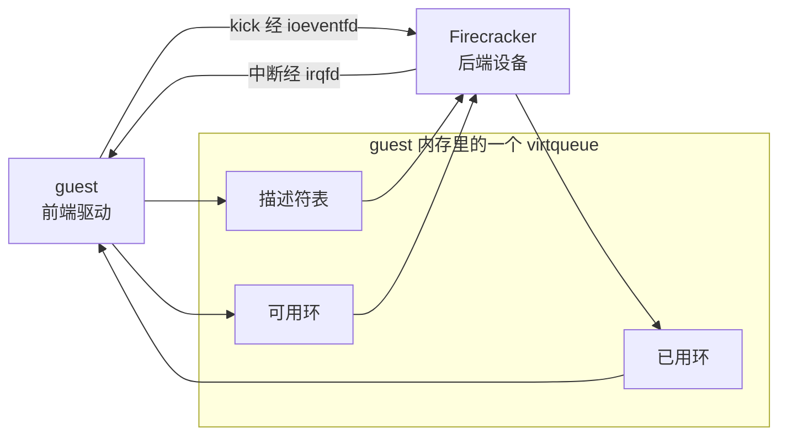
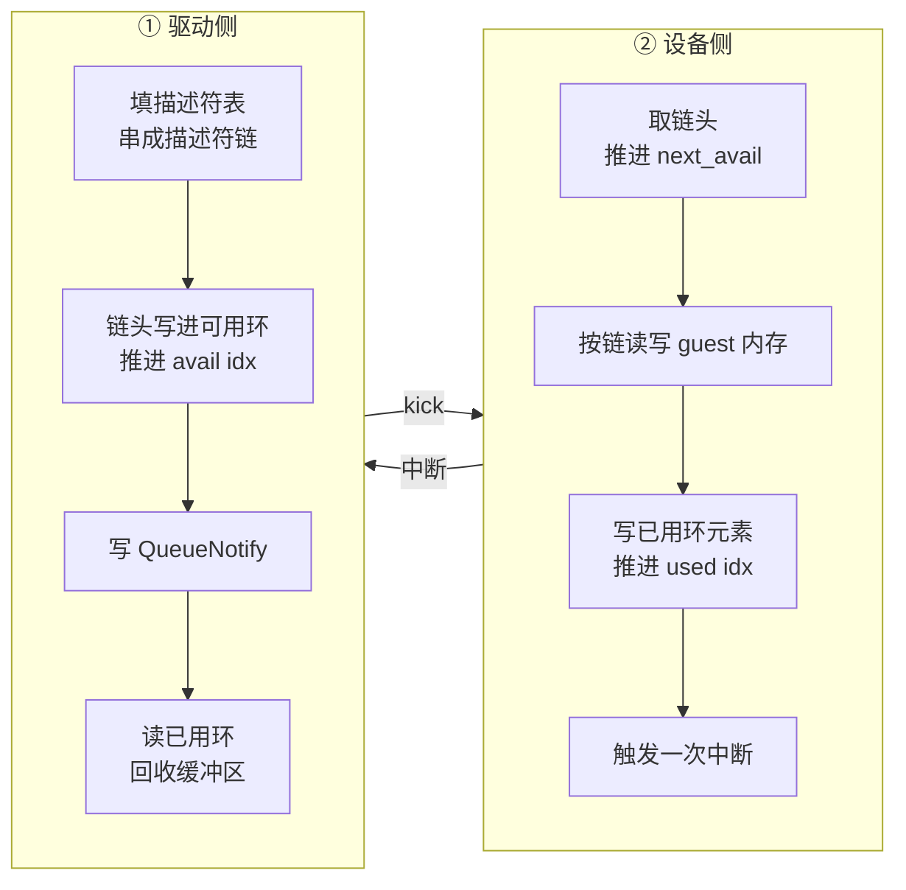

# 04 · virtio 与 virtio-mmio 基础

> Firecracker 给 guest 的全部 I/O 能力，都来自五种 virtio 设备与一条 4 KiB 宽的 MMIO 寄存器窗口。
> 本篇讲这套契约本身：共享内存里的三个环怎么组织、两个方向的信号怎么走、
> 设备怎么被 guest 发现，以及为什么这里没有 PCI。
>
> **读者**：不熟悉半虚拟化设备模型的读者。　**预备**：[第 03 篇 · 本书用到的 KVM API](03-kvm-api-primer.md#4-中断irqfd-与-ioeventfd)。
> **代码**：`src/vmm/src/devices/virtio/mod.rs`、`queue.rs`、`mmio.rs`、`generated/`、
> `src/vmm/src/device_manager/mmio.rs`、`src/vmm/src/arch/aarch64/fdt.rs`

---

## 0. 本篇要回答的问题

1. 半虚拟化设备相对全模拟设备省掉了什么，代价是什么？
2. 一个 virtqueue 由哪几块内存构成，谁写哪一块，索引怎么推进？
3. 描述符链的「可读」「可写」是相对谁说的？为什么这个方向容易搞反？
4. guest 通知设备、设备通知 guest，分别走哪条路？通知抑制是怎么做的，代价在哪？
5. virtio-mmio 的寄存器窗口有多大、装了什么？guest 是怎么知道这个窗口在哪的？
6. 只用 MMIO 不用 PCI，换来了什么，放弃了什么？

---

## 1. 问题：模拟一块真实网卡的代价

要让 guest 里未经修改的操作系统用上网络，最直接的办法是模拟一块它已经有驱动的真实网卡。
这条路 QEMU 走了很久，代价明确：真实网卡的驱动是按真实硬件写的，
它会反复读写设备寄存器、按位设置控制字、轮询状态位。每一次这样的访问在虚拟化下都是一次 VM exit ——
vCPU 停下、控制权交给 VMM、VMM 解析这是对哪个寄存器的第几位的写、模拟出效果、再恢复 vCPU。
发一个以太网帧要几十次这样的往返，而其中绝大多数往返传递的信息量只有几个比特。

virtio 换了个前提：既然 guest 里的驱动可以重写，就不必假装自己是硬件。
虚拟设备与 guest 驱动之间约定一份**契约**，按「批量传递数据、尽量少发信号」来设计。
契约的两端有固定的叫法：guest 里的那一半叫**前端驱动**（Linux 内核的 `virtio_net`、`virtio_blk` 等），
VMM 里的那一半叫**后端设备**（Firecracker 的 `src/vmm/src/devices/virtio/` 下各模块）。

契约的核心是一块双方都能直接访问的内存。它物理上是 guest 的内存，
guest 按自己的地址访问，Firecracker 通过 KVM 建立的 GPA 到 HVA 的映射直接访问同一批物理页
（[第 03 篇 §2](03-kvm-api-primer.md#2-内存memslot-把-gpa-映射到-hva)）。
数据不需要拷贝，也不需要 VM exit —— 双方只在这块内存上按规则写字段、读字段。
只有两件事需要跨越虚拟化边界：guest 告诉设备「我放了新活」，设备告诉 guest「活干完了」。

代价有两条，本篇后面会反复碰到。第一，guest 必须有 virtio 驱动，
所以 guest 内核的配置是这套方案的一部分（第 56 篇）。
第二，设备后端要直接解析 guest 写在共享内存里的结构 —— 那是不可信输入，
每一个字段都要校验，不能假设 guest 的驱动是正确的。



图里实线表示读写方向：驱动写描述符表与可用环、读已用环，设备反过来。
两条信号通路都由 KVM 提供，第 4 节讲。

---

## 2. 契约的三件事

任何一个 virtio 设备，在开始传数据之前，要与驱动谈妥三件事。

**设备类型。** 一个整数，告诉驱动该用哪个前端驱动去挂载它。
Firecracker 支持的类型定义在 `src/vmm/src/devices/virtio/mod.rs`（vsock 的定义在 `vsock/mod.rs`）：

| 类型 ID | 常量 | 设备 | 队列数 | 本书位置 |
|---|---|---|---|---|
| 1 | `TYPE_NET` | 网卡 | 2 | 第 30 篇 |
| 2 | `TYPE_BLOCK` | 块设备 | 1 | 第 27、29 篇 |
| 4 | `TYPE_RNG` | 熵源 | 1 | 第 35 篇 |
| 5 | `TYPE_BALLOON` | 气球 | 3 | 第 34 篇 |
| 19 | `TYPE_VSOCK` | vsock | 3 | 第 33 篇 |

队列数由设备类型定死，写在各模块的常量里（`net/mod.rs` 的 `NET_NUM_QUEUES`、
`block/virtio/mod.rs` 的 `BLOCK_NUM_QUEUES` 等），驱动不能协商。
网卡的两个队列是收与发；vsock 的三个是收、发与事件；气球的三个是充气、放气与统计。

**特性位。** 一个 64 位集合，双方各持一份。设备声明它能提供哪些特性，
驱动在其中挑自己也支持的那些，写回去作为确认。最终生效的是两份的交集，
因此任何一方都对任何一个特性有否决权。位编号由规范分配，通用位在
`src/vmm/src/devices/virtio/generated/virtio_config.rs`（bindgen 从内核头文件生成），
设备专属位在各设备模块里。两个通用位在本篇里要点名：

- `VIRTIO_F_VERSION_1`（第 32 位）：设备遵循 virtio 1.0 而不是更早的 legacy 内存布局。
  Firecracker 的每个设备都声明它，传输层还会在读特性寄存器时强制补上这一位（第 5 节）。
- `VIRTIO_RING_F_EVENT_IDX`（第 29 位）：启用通知抑制，见第 4 节。
  在 v1.12.1 里只有网卡与 vhost-user 块设备声明它（`net/device.rs`、`block/vhost_user/device.rs`）。

**配置空间。** 一段设备专属的字节，放不适合走队列的小块信息：
块设备的容量、网卡的 MAC 地址与 MTU、气球的目标页数。驱动通过寄存器窗口的高位偏移读写它，
设备用 `read_config()` / `write_config()` 响应。配置空间变化时设备可以发一个专门的中断，
驱动据此重读；`config_generation` 寄存器用来检测「读到一半被改了」。

---

## 3. virtqueue：三块内存，两个索引

队列（virtqueue）是契约里唯一的数据通道。一个队列由三块连续内存构成，
全部位于 guest 内存，地址由驱动在初始化时通过寄存器告诉设备。
Firecracker 的结构定义在 `src/vmm/src/devices/virtio/queue.rs`：
`Descriptor`（16 字节）与 `UsedElement`（8 字节）是 `#[repr(C)]` 的裸结构，
可用环与已用环的其余部分则以指针加偏移的方式访问，布局写在 `Queue` 结构体字段的文档注释里。

```text
描述符表   [Descriptor; size]            由驱动填写
  Descriptor { addr: u64, len: u32, flags: u16, next: u16 }
     addr  这段缓冲区的 GPA
     len   长度
     flags bit0 = NEXT（还有下一节）  bit1 = WRITE（设备可写）
     next  下一节在描述符表中的下标

可用环     由驱动写、设备读
  { flags: u16, idx: u16, ring: [u16; size], used_event: u16 }
     idx   驱动已放入的链头总数，单调递增，自然回绕
     ring  环形数组，元素是描述符表下标（链头）

已用环     由设备写、驱动读
  { flags: u16, idx: u16, ring: [UsedElement; size], avail_event: u16 }
     idx   设备已交还的链头总数
     UsedElement { id: u32, len: u32 }   id 是链头下标，len 是写入的字节数
```

队列长度 `size` 由驱动选择，上限是设备声明的 `max_size`。
Firecracker 把所有设备的上限统一为 `FIRECRACKER_MAX_QUEUE_SIZE = 256`（`queue.rs`）。

### 3.1 描述符链与方向

一次 I/O 请求往往需要多段缓冲区：块设备的读请求要一段放请求头、一段接数据、一个字节放状态码。
这三段各占描述符表的一个槽位，用 `next` 字段串成一条**描述符链**，驱动只把链头的下标放进可用环。
`flags` 的 `NEXT` 位表示「后面还有」，链在第一个不带 `NEXT` 的描述符处终止。

`WRITE` 位的方向是相对**设备**说的：置位表示设备可写、驱动只读，
不置位表示驱动写好了内容、设备只读。`queue.rs` 的 `DescriptorChain::is_write_only()` 就是读这一位，
它的文档注释把这一点写得很明确。搞反的后果不是报错，而是数据静默错位，
所以每个设备的请求解析代码都要按自己的协议校验每一节的方向（第 27 篇有块设备的例子）。

Firecracker 不提供间接描述符（`VIRTQ_DESC_F_INDIRECT`）：整个 `src/vmm/src/` 下没有任何地方引用这个标志位。
收益是解析逻辑少一层，也少一次对 guest 内存的间接寻址与随之而来的校验；
代价是每条链的每一节都要占用描述符表的一个槽位，链长受队列长度限制。

`DescriptorChain::checked_new()` 与 `is_valid()` 做的正是针对不可信输入的校验：
下标必须小于队列长度，带 `NEXT` 时 `next` 也必须在界内；
另有一个 `ttl` 计数从队列长度开始递减，防止驱动构造出成环的链把设备卡死在遍历里。

### 3.2 两个索引与一次往返

两个环的 `idx` 都是**单调递增的总计数**，不是环内下标；取模队列长度之后才是下标。
这样设计使得「环满」与「环空」可以区分，也使得回绕不需要额外的标志位。
设备侧在 `Queue` 里各存一个自己的游标：`next_avail` 是下一个要取的链头位置，
`next_used` 是下一个要写的已用环位置。`Queue::len()` 就是 `avail.idx - next_avail`，
即还没处理的链数。



两侧各自推进自己的索引，从不写对方的索引，这是整套机制不需要锁的原因。
需要的是内存序：`queue.rs` 在取链前用 `fence(Ordering::Acquire)`，
在推进已用环 `idx` 前用 `fence(Ordering::Release)`（`advance_used_ring_idx()`），
保证驱动看到新的 `idx` 时，对应的描述符内容已经可见。

值得注意的一处是 `Queue::pop()` 在发现 `avail.idx - next_avail` 大于队列长度时直接 `panic!`。
代码注释解释了取舍：这只可能是驱动行为异常，继续跑下去可能被拖成拒绝服务，
而打日志又会被恶意驱动用来灌爆日志系统，所以选择让这台 microVM 立刻死掉。
一台 microVM 一个进程，爆炸半径就是这一台。

---

## 4. 两个方向的信号

共享内存解决了数据，剩下两个方向的「有事了」需要真正跨越虚拟化边界。

**驱动通知设备（kick）。** 驱动往寄存器窗口偏移 `0x50` 的 `QueueNotify` 写入队列序号。
这个写会触发 VM exit —— 但 Firecracker 让它在 KVM 内部就结束：
`src/vmm/src/device_manager/mmio.rs` 的 `register_mmio_virtio()` 为每个队列注册一个 ioeventfd，
地址是设备基址加 `NOTIFY_REG_OFFSET`（`0x50`），datamatch 是队列序号。
KVM 匹配到这次写，直接写对应的 eventfd 并返回 guest，不唤醒 VMM 线程做 MMIO 解析。
Firecracker 的事件循环在另一侧被 eventfd 唤醒，去处理队列。
收益是通知路径少一次用户态往返；代价是 `QueueNotify` 这个偏移在 `MmioTransport` 的寄存器分派里
根本没有分支 —— 读代码时会觉得它「不存在」，实际上它被 KVM 截走了。

**设备通知驱动（中断）。** 同一个函数里，`vm.register_irqfd()` 把设备的中断 eventfd 绑到一条 IRQ 线上。
设备处理完一批请求，调 `IrqTrigger::trigger_irq()`（`devices/virtio/device.rs`）：
先把状态位原子地或进 `interrupt_status`，再写 eventfd，由 KVM 注入中断。
状态位只有两个：`VIRTIO_MMIO_INT_VRING`（0x1，队列有新的已用元素）与
`VIRTIO_MMIO_INT_CONFIG`（0x2，配置空间变了）。驱动在中断处理里读 `InterruptStatus` 寄存器分辨是哪一类，
再写 `InterruptACK` 把位清掉。

### 4.1 通知抑制：省信号，多读内存

高负载下这两个方向都会变得很吵：驱动每提交一条请求踢一次，设备每完成一条中断一次。
`VIRTIO_RING_F_EVENT_IDX` 特性用两个额外字段解决这个问题 ——
可用环尾部的 `used_event` 由驱动写，表示「已用环推进到这个计数时再中断我」；
已用环尾部的 `avail_event` 由设备写，表示「可用环推进到这个计数时再踢我」。

设备侧的两个方法实现这套判断：

- `Queue::prepare_kick()`：在发中断前调用，按与 Linux 内核 `vring_need_event()` 相同的表达式
  判断本批新增的已用元素是否跨过了 `used_event`，没跨过就不发中断。
  它有副作用 —— 返回 `true` 之后会把 `num_added` 清零，所以每批只能问一次。
- `Queue::try_enable_notification()`：设备处理完一轮、准备去睡时调用。
  它把 `next_avail` 写进 `avail_event`，加一个 `SeqCst` 屏障，再重读可用环的 `idx`。
  如果两者仍相等，说明确实没有新活，可以安全地等下一次 kick；
  如果驱动在这个窗口里又放了活，返回 `false`，调用方必须继续处理而不能去睡。
  `pop_or_enable_notification()` 把这两步合成一个调用。

这个「写下期望值、加屏障、重读」的顺序不能颠倒：先重读再写期望值会留下一个丢通知的窗口，
表现为设备睡死、guest 的 I/O 永久挂起。收益是高负载下信号数量大幅下降，
代价是每一轮都多几次对 guest 内存的访问与一次全屏障，低负载时纯属开销。
所以这是个可协商的特性，而不是默认行为。

---

## 5. virtio-mmio：一页寄存器

前面所有「通过寄存器告诉设备」的动作，都发生在 virtio-mmio 传输层上。
每个设备在 guest 物理地址空间里占 `MMIO_LEN = 0x1000`（4 KiB）一页
（`src/vmm/src/device_manager/mmio.rs`），页内布局由规范规定。
`src/vmm/src/devices/virtio/mmio.rs` 的 `MmioTransport::bus_read()` / `bus_write()` 实现它：

```text
0x000  MagicValue        读   固定 0x74726976，ASCII "virt"
0x004  Version           读   固定 2（值 1 是 legacy 布局）
0x008  DeviceID          读   设备类型，见第 2 节
0x00c  VendorID          读   Firecracker 固定返回 0
0x010  DeviceFeatures    读   设备声明的特性，按 32 位分页
0x014  DeviceFeaturesSel 写   选择读哪一页
0x020  DriverFeatures    写   驱动确认的特性
0x024  DriverFeaturesSel 写   选择写哪一页
0x030  QueueSel          写   后续队列寄存器作用于哪个队列
0x034  QueueNumMax       读   该队列的 max_size
0x038  QueueNum          写   驱动选定的 size
0x044  QueueReady        读写 该队列是否配置完毕
0x050  QueueNotify       写   kick，被 ioeventfd 截走
0x060  InterruptStatus   读   两个中断原因位
0x064  InterruptACK      写   清中断原因位
0x070  Status            读写 设备状态字段
0x080  QueueDesc  低/高   写   描述符表的 GPA（0x080 / 0x084）
0x090  QueueDriver 低/高  写   可用环的 GPA（0x090 / 0x094）
0x0a0  QueueDevice 低/高  写   已用环的 GPA（0x0a0 / 0x0a4）
0x0fc  ConfigGeneration  读
0x100  起               读写 设备配置空间
```

魔数与版本号让驱动能在不知道这里有没有设备的情况下探测：读到别的值就当这一页是空的。
地址寄存器之所以拆成高低两个 32 位，是因为规范规定寄存器访问宽度是 4 字节，而 GPA 是 64 位。
读 `DeviceFeatures` 的高半页时，传输层会无条件补上 `VIRTIO_F_VERSION_1` 那一位，
不管具体设备声明了什么 —— 这一位是传输层的属性，不是设备的属性。

### 5.1 初始化握手

`Status` 寄存器（0x070）里的位记录驱动走到了哪一步。位的定义在
`src/vmm/src/devices/virtio/mod.rs` 的 `device_status` 模块，驱动按固定顺序逐位置上：

1. 写 `ACKNOWLEDGE`（1）：我看到这里有个设备。
2. 加 `DRIVER`（2）：我有能驱动它的代码。
3. 读 `DeviceFeatures` 两页，写回 `DriverFeatures` 两页。
4. 加 `FEATURES_OK`（8）：特性谈妥了。此后驱动应重读这一位确认设备接受。
5. 为每个队列写 `QueueSel`、`QueueNum` 与三个地址寄存器，再置 `QueueReady`。
6. 加 `DRIVER_OK`（4）：我准备好了，可以开始收发。

第 6 步是分界线：设备在这一刻被**激活**，拿到 guest 内存句柄并开始响应队列通知。
在此之前设备只是一组寄存器，不碰任何数据。
另有三个位不属于正常序列：`FAILED`（128）由驱动置，表示它放弃了这个设备；
`DEVICE_NEEDS_RESET`（64）由设备置，表示出了驱动无法恢复的问题；
向 `Status` 写 0 表示复位。
这套状态推进在 Firecracker 里的具体实现、每一步的前置条件校验与复位路径的现状，在
[第 25 篇 §3](25-virtio-device-model-and-transport.md#3-mmiotransport寄存器到-trait-调用的翻译)展开。

### 5.2 guest 怎么知道设备在哪

MMIO 设备没有总线枚举。驱动必须被告知「某地址有一页 virtio 寄存器，中断走某条线」，
两种架构用的手段不同。

x86_64 靠内核命令行。`device_manager/mmio.rs` 的 `add_virtio_device_to_cmdline()`
（这个函数只在 `#[cfg(target_arch = "x86_64")]` 下编译）为每个设备追加一段参数，
形如 `virtio_mmio.device=4K@0xd0000000:5`：长度、`@` 之后是基址、`:` 之后是 IRQ 号。
Linux 的 `virtio_mmio` 驱动解析它并按序探测。

aarch64 靠设备树。`src/vmm/src/arch/aarch64/fdt.rs` 的 `create_virtio_node()`
为每个设备生成一个 `virtio_mmio@<地址>` 节点，`compatible` 属性是 `"virtio,mmio"`，
`reg` 给出基址与长度，`interrupts` 给出 GIC 的 SPI 号与触发方式。
FDT 由 Firecracker 在启动时构造并写进 guest 内存，内核开机时解析。

两条路径的共同点是：设备集合在 microVM 启动那一刻就固定了。
命令行与设备树都是一次性交给内核的，之后不能再加设备。

---

## 6. 为什么不是 PCI

virtio 在物理机与常规虚拟机上几乎总是跑在 PCI 传输上。Firecracker 在 v1.12.1 里只有 MMIO，
这是一个明确的取舍，理解它有助于理解整份代码的形状。

选 PCI 要付出的是一整套设施：一个 host bridge、每设备 256 字节的 PCI 配置空间、
BAR 的地址分配与重定位、能力链表、MSI-X 中断表，以及 guest 侧的枚举过程。
这些代码全都在不可信 guest 的攻击面上，而它们提供的能力 —— 设备热插拔、
每队列一个中断向量、运行时地址重分配 —— 对「一台 microVM 配几个固定设备、跑完就丢」这个场景没有价值。
选 MMIO 要付出的只是每设备一页地址加一条命令行参数或一个 FDT 节点。

放弃的东西要如实列出：

- **没有热插拔**：设备集合在启动前定死，运行中不能加，这一点在第 5.2 节已经说过。
- **每设备只有一条中断线**。`register_mmio_virtio()` 里有一行注释写明
  「Our virtio devices are currently hardcoded to use a single IRQ」，
  设备的 `irq` 字段为空就直接返回错误。多队列设备的所有队列共用这条线，
  驱动收到中断后要扫描所有队列的已用环，没法靠中断向量直接定位。
- **没有标准的设备发现**：驱动要靠命令行或设备树才能找到设备，
  guest 内核的这两条解析路径因此成了启动链的必经环节。
- **手写传输层**：规范里的寄存器语义与状态机由 Firecracker 自己实现，
  正确性靠代码审查与测试，没有成熟的 PCI 栈可以复用。

这笔账在 e2b 的用法下是划算的：沙箱的设备配置在模板里就定好，生命周期内不变，
而启动时延与攻击面是首要指标。上游后来在 `feature/pcie` 等分支上探索 PCI 传输，
但 v1.12.1 以及本书涉及的两层改动都没有它。

---

## 7. 这些概念在本书哪几篇用到

- **描述符链与两个索引**：第 26 篇讲 `Queue` 的完整实现与 `IoVecBuffer`，
  第 27、30、33 篇分别是块、网、vsock 三个设备如何按自己的协议解析链。
- **特性协商**：第 25 篇讲 trait 一侧的实现，各设备篇讲它们各自声明了哪些位。
- **激活时刻与设备状态**：第 25 篇讲激活的具体路径，第 40 篇讲快照如何保存与重建设备状态 ——
  恢复一台 microVM 意味着跳过整个初始化握手，直接把队列的地址与索引写回去。
- **ioeventfd 与 irqfd**：第 03 篇讲 KVM 侧的语义，第 23 篇讲注册过程。
- **MMIO 地址与 IRQ 的分配**：第 23 篇讲 `MMIODeviceManager` 与 `vm-allocator`。
- **设备发现**：第 17 篇（x86_64 平台与命令行）、第 19 篇（aarch64 与 FDT）。
- **队列状态的原地写回**：第 72 篇讲 ARM 适配版的回滚为什么必须重建队列指针与网卡的接收缓存 ——
  本篇第 3.2 节的「两侧各推进自己的索引」在那里变成了一个必须小心处理的约束。

---

## 8. 小结

- virtio 用一份契约取代硬件模拟：数据走 guest 内存里的共享结构，只有通知与中断跨越虚拟化边界。
  代价是 guest 必须有前端驱动，且后端必须把共享结构当作不可信输入来校验。
- 一个 virtqueue 是三块内存：描述符表（驱动写）、可用环（驱动写、设备读）、已用环（设备写、驱动读）。
  两个环的 `idx` 是单调递增的总计数，取模才是下标。
- 描述符的 `WRITE` 位是相对设备说的；Firecracker 不支持间接描述符，链长受队列长度限制，
  队列长度上限统一为 256。
- kick 走 ioeventfd，在 KVM 内部结束，不唤醒 VMM 线程；中断走 irqfd，
  设备先原子地设置 `interrupt_status` 的两个原因位之一再写 eventfd。
- 通知抑制由 `VIRTIO_RING_F_EVENT_IDX` 协商开启，设备侧靠 `prepare_kick()` 与
  `try_enable_notification()` 两个方法；后者「先写期望值、加屏障、再重读」的顺序不能颠倒，
  否则会丢通知。v1.12.1 里只有网卡与 vhost-user 块设备声明这个特性。
- virtio-mmio 每设备占 4 KiB 一页；`QueueNotify`（0x50）被 ioeventfd 截走，
  在传输层的寄存器分派里没有对应分支。
- 初始化是一条六步的握手，终点 `DRIVER_OK` 就是设备被激活、拿到 guest 内存句柄的时刻。
- 只用 MMIO 的收益是极小的实现面与攻击面，代价是没有热插拔、每设备单条中断线、
  以及设备发现要靠内核命令行（x86_64）或设备树（aarch64）。

---

## 延伸阅读 / 下一篇

- [第 05 篇 · 本书用到的 Rust 与依赖 crate](05-rust-and-crates-primer.md)：下一篇。
- [第 25 篇 · virtio 设备模型与 MMIO 传输层](25-virtio-device-model-and-transport.md)：本篇第 5 节的实现版本。
- [第 26 篇 · virtqueue 实现](26-virtqueue-implementation.md)：本篇第 3 节的实现版本。
- [第 03 篇 · 本书用到的 KVM API](03-kvm-api-primer.md)：ioeventfd 与 irqfd 的 KVM 侧语义。
- virtio 规范本身：OASIS 的 Virtual I/O Device (VIRTIO) Version 1.2，
  第 2.6 节是 virtqueue，第 4.2 节是 MMIO 传输层。本篇的字段名与它一致。
- 上游文档 `docs/device-api.md` 列出了各设备的 API 配置项，可与本篇的设备类型表对照。
