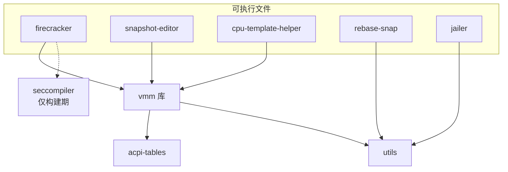

# 05 · 本书用到的 Rust 与依赖 crate

> Firecracker 的全部代码是 Rust。这一篇不教 Rust，只讲**读这份代码**必须先认识的东西：
> 仓库怎么切成 crate、条件编译怎么把两种架构拼在一个源码树里、`unsafe` 与错误类型的写法约定、
> 以及十几个外部 crate 各自承担了哪一块。读完这一篇，后面各篇引用的类型名与函数名应当不再陌生。
>
> **读者**：熟悉 C 或 C++ 系统编程、但没读过 Rust 项目的读者。
> **预备**：[第 03 篇 · 本书用到的 KVM API](03-kvm-api-primer.md)、[第 04 篇 · virtio 与 virtio-mmio 基础](04-virtio-and-mmio-primer.md)。
> **代码**：`Cargo.toml`、`rust-toolchain.toml`、`src/vmm/Cargo.toml`、`src/vmm/src/vstate/memory.rs`、
> `src/vmm/src/arch/mod.rs`、`src/vmm/src/seccomp.rs`、`src/firecracker/build.rs`、`tools/bindgen.sh`

---

## 0. 本篇要回答的问题

1. 这个仓库为什么切成十二个 crate，`cargo build` 默认为什么不编译 jailer？
2. 同一份源码怎么同时描述 x86_64 与 aarch64 两条路径，读代码时怎么判断自己读的是哪一条？
3. Firecracker 的 `unsafe` 用在哪些地方，代码里的 `SAFETY:` 注释是约定还是强制？
4. 错误类型为什么用 `thiserror` + `displaydoc` 这一对宏，这个写法和 HTTP API 的错误消息是什么关系？
5. `vm-memory`、`kvm-ioctls`、`event-manager`、`micro_http`、`bincode` 这几个 crate 分别负责什么？
6. `generated/` 目录里的代码是怎么来的，改内核头文件之后要做什么？

---

## 1. 问题：一个 VMM 为什么需要这些语言设施

一个 VMM 同时做三类事，每一类对语言的要求都不一样。

第一类是**和内核打交道**：`ioctl(KVM_RUN)`、`mmap`、`epoll`、`seccomp`。这些接口是 C 的，
参数是裸指针与整数，语义靠文档约定。Rust 的类型系统帮不了这一层，只能把它关进 `unsafe` 块里，
并想办法让「为什么这里是安全的」这句话留在代码里。

第二类是**替 guest 搬数据**：guest 写了一段 virtqueue 描述符，VMM 要按描述符去 guest 内存里取字节。
guest 是不可信的，它给的地址、长度、索引都可能是恶意构造的。每一次访问都必须做边界检查，
而检查一旦写错就是宿主机上的越界读写。这一层需要一个把「guest 物理地址 → 宿主虚拟地址 + 边界」封装起来的抽象。

第三类是**管理自己的状态**：几十个 eventfd、十几个设备对象、三类线程、一个 HTTP 控制面、一套快照序列化。
这一层是普通的应用逻辑，需要的是清晰的所有权、明确的错误类型和能被审查的模块边界。

下面三节分别对应这三类需求。先看代码怎么切分。

---

## 2. workspace 与十二个 crate

仓库根的 `Cargo.toml` 声明了一个 cargo workspace，成员是 `src/*`。十二个成员分三类。

| crate | 行数 | 职责 |
|---|---|---|
| `vmm` | 77 285 | 全部 VMM 逻辑：KVM 封装、内存、vCPU、设备、快照、控制面。以库的形式存在 |
| `firecracker` | 4 920 | 可执行文件：参数解析、API server、把 `vmm` 串起来 |
| `jailer` | 3 133 | 独立可执行文件，chroot / cgroup / namespace |
| `acpi-tables` | 2 704 | x86_64 的 ACPI 表构造 |
| `cpu-template-helper` | 2 674 | CPU 模板的采集与比对工具 |
| `utils` | 1 411 | 命令行参数解析、时间、校验；被多个 crate 共用 |
| `snapshot-editor` | 650 | 快照文件的离线编辑 |
| `seccompiler` | 599 | JSON 策略编译成 BPF；既是库也是 `seccompiler-bin` |
| `clippy-tracing` | 445 | 给源码批量加 / 去插桩属性的开发工具 |
| `rebase-snap` | 329 | 把差分内存文件合并回基底 |
| `log-instrument` / `log-instrument-macros` | 94 | 可选的函数进出日志插桩 |

行数口径与[第 01 篇 §3](01-lineage-and-repo-map.md#3-仓库地图十二个-crate)一致：各 crate `src/` 下全部 `.rs` 文件的行数，含文件内的单元测试模块。

这张图是内部 crate 的依赖方向，箭头表示「依赖」。



三处值得注意。

**`vmm` 是库而不是二进制。** 于是 `snapshot-editor` 与 `cpu-template-helper` 可以直接复用快照结构体与
CPU 模板类型，不必重新定义一套；快照格式改了，这两个工具跟着重编译就对上了。代价是 `vmm` 的公开接口很大，
几乎每个模块都 `pub`，模块边界靠约定而不是可见性来维持。

**`seccompiler` 只在构建期被 `firecracker` 依赖。** `src/firecracker/Cargo.toml` 把它放在
`[build-dependencies]`，`src/firecracker/build.rs` 在编译时调用 `seccompiler::compile_bpf()`，
把 `resources/seccomp/<target>.json` 编成 BPF 字节，写进 `OUT_DIR`；
运行期由 `src/firecracker/src/seccomp.rs` 的 `get_default_filters()` 用 `include_bytes!` 把它嵌进二进制。
成品里没有 JSON 解析器，也没有 BPF 编译器。

**`jailer` 不在默认构建目标里。** 根 `Cargo.toml` 的 `default-members` 列举了除 `jailer` 与 `vmm` 之外的成员。
原因写在注释里：`cargo build` 默认走 gnu target，而 jailer 必须静态链接才能在 chroot 之后工作。
正式构建走 `tools/release.sh`，它显式指定 `--target <arch>-unknown-linux-musl --workspace`，
这时 jailer 才会被编出来（详见[第 06 篇 · 构建、运行与调试环境](06-build-run-debug.md)）。

`rust-toolchain.toml` 把工具链钉在 1.85.0，并预装两个 musl target。文件里的注释说明了为什么要钉：
CI 会跨两个版本做 A/B 对比，如果工具链漂移，新引入的系统调用可能没进 seccomp 白名单，
导致对比测试恒定失败。各 crate 的 `edition` 是 2024。

---

## 3. 一份源码，两种架构

Firecracker 支持 x86_64 与 aarch64，两者的 vCPU 寄存器、引导协议、中断控制器、内存布局都不同。
代码里没有 `#ifdef` 的等价物散布在函数体中间，取而代之的是两条纪律。

**架构相关的代码整体成模块。** `src/vmm/src/arch/mod.rs` 里只有两组 `#[cfg(target_arch = ...)]`：
一组声明 `pub mod aarch64` 或 `pub mod x86_64`，另一组把该模块里的同名条目 `pub use` 到 `arch::` 下。
于是别处写 `arch::Kvm`、`arch::arch_memory_regions()`、`arch::configure_system_for_boot()` 时不需要再判断架构 ——
编译到哪个 target，这些名字就指向哪一套实现。这也解释了为什么本书第三部分要把 x86_64 与 aarch64 各拆成两篇：
它们是两份独立的实现，只共享名字。

**其余地方的条件编译是点状的。** 整棵源码树里 `cfg(target_arch` 出现两百来处，绝大多数是字段级或分支级的小差异，
例如 `src/firecracker/src/api_server/request/actions.rs` 里 `SendCtrlAltDel` 在 aarch64 上直接返回
400（aarch64 没有 i8042 键盘控制器），`src/vmm/src/snapshot/mod.rs` 里快照的 magic 值按架构取两个常量之一。

读代码时的判断办法很简单：看这一行是不是在 `arch/x86_64/` 或 `arch/aarch64/` 目录下；
不在的话，找最近的 `#[cfg(target_arch = ...)]` 属性。没有属性的代码两个架构都会编译。

除了架构，还有两个 cargo feature 会改变编译出来的代码：`gdb`（引入 `gdbstub`，开放 guest 内核的远程调试）
与 `tracing`（引入 `log-instrument`，在每个函数进出打一条 Trace 日志）。两者默认关闭，
正式二进制里不存在这些代码路径。

---

## 4. `unsafe` 与 `SAFETY` 约定

`vmm` crate 里有三百多个 `unsafe` 块。它们集中在三处：调用 libc（`mmap`、`ioctl`、`prctl`、`dup2`、`mincore`）、
把裸指针转成引用、以及把字节切片重新解释成 C 结构体。这些操作的正确性不能由编译器保证，只能由人保证。

项目的做法是把「人的保证」写成注释并用 lint 强制。根 `Cargo.toml` 的 `[workspace.lints.clippy]` 里有一条
`undocumented_unsafe_blocks = "warn"`：每个 `unsafe` 块前必须有一条 `// SAFETY:` 注释，
说明为什么这里的前置条件成立。例如 `src/vmm/src/vstate/vcpu.rs` 里从信号处理上下文访问线程局部 vCPU 指针，
注释写的是「`TLS_VCPU_PTR` 非空且在 `Vcpu::drop` 里被清空，所以不会是悬垂指针」。

审查这类注释是读 Firecracker 代码的一个抓手：注释给出的条件，往往就是这段代码的真实约束。
后面几篇在讲 `KVM_RUN` 的线程约束、`mmap` 区域的生命周期、dirty bitmap 的并发访问时，都会引用这些注释里的条件。

同一组 lints 里还有几条值得一提：`cast_possible_truncation`、`cast_possible_wrap`、`cast_sign_loss` 三条
把 C 里随手就写的整数转换变成警告，所以代码里到处是 `u64_to_usize()` 这类显式转换辅助函数；
`exit = "warn"` 禁止在库代码里直接调 `std::process::exit`，退出必须走 `FcExitCode` 一路返回到 `main`
（见[第 07 篇 · 进程启动](07-process-startup.md)）。`[profile.release]` 里 `panic = "abort"`：
release 构建不做栈展开，任何 panic 直接终止进程，这也是 `main.rs` 要先装 panic hook 的原因。

---

## 5. 错误类型与几个反复出现的 trait

### 5.1 `thiserror` 加 `displaydoc`

几乎每个模块都有一个自己的错误枚举，写法固定：

```rust
#[derive(Debug, thiserror::Error, displaydoc::Display)]
pub enum MemoryError {
    /// Cannot fetch system's page size: {0}
    PageSize(errno::Error),
    /// Cannot dump memory: {0}
    WriteMemory(GuestMemoryError),
    /// Total sum of memory regions exceeds largest possible file offset
    OffsetTooLarge,
}
```

`thiserror` 生成 `std::error::Error` 实现，`displaydoc` 把每个变体上方的文档注释当作 `Display` 的格式串，
`{0}` 指第一个字段。两个宏合起来的效果是：**错误消息和错误定义写在一起，没有第二处需要同步维护。**

这个写法不只是整洁问题。控制面的错误最终会被 `src/firecracker/src/api_server/parsed_request.rs` 的
`convert_to_response()` 用 `vmm_action_error.to_string()` 取出来，塞进 HTTP 响应体的 `fault_message` 字段。
也就是说，**这些文档注释就是 API 的错误文案**，调用方看到的字符串直接来自枚举变体上的那行注释。
改动这行注释等于改动对外行为，这一点在[第 08 篇 · API server](08-api-server.md) 还会用到。

### 5.2 扩展 trait：给外部类型加方法

`vm-memory` 提供的 `GuestMemoryMmap` 是外部类型，Firecracker 需要给它加上「导出到文件」「按脏页位图导出」
「重置位图」这些方法。Rust 不允许给外部类型直接加方法，于是
`src/vmm/src/vstate/memory.rs` 定义了 trait `GuestMemoryExtension`，声明 `describe()`、`mark_dirty()`、
`dump()`、`dump_dirty()`、`reset_dirty()`、`store_dirty_bitmap()`，再 `impl GuestMemoryExtension for GuestMemoryMmap`。
调用处看起来就像 `GuestMemoryMmap` 自带这些方法。快照相关的篇目会反复出现这个 trait。

### 5.3 `Persist`：状态保存与恢复的统一形状

`src/vmm/src/snapshot/persist.rs` 定义了一个只有四个关联项的 trait：

```rust
pub trait Persist<'a> where Self: Sized {
    type State;
    type ConstructorArgs;
    type Error;
    fn save(&self) -> Self::State;
    fn restore(constructor_args: Self::ConstructorArgs, state: &Self::State)
        -> Result<Self, Self::Error>;
}
```

每个可快照的部件（块设备、网卡、vsock、balloon、GIC、vCPU）都实现它：`State` 是一个只含数据、
可 `serde` 序列化的结构体；`ConstructorArgs` 是恢复时需要但不进快照的东西（guest 内存句柄、事件 fd 等）。
快照格式因此等于所有 `State` 类型的结构；改一个字段就是改快照的兼容性。第 36 与第 40 篇专讲这件事。

### 5.4 `Arc<Mutex<T>>` 与 `mpsc`

Firecracker 是多线程的：API 线程、VMM 线程、每个 vCPU 一个线程。跨线程共享只有两种形式。

一是 `Arc<Mutex<T>>`。`Vmm` 本身被包成 `Arc<Mutex<Vmm>>`，设备对象也是；
`src/vmm/src/lib.rs` 里事件管理器的类型别名直接写成
`BaseEventManager<Arc<Mutex<dyn MutEventSubscriber>>>`，即「任何实现了订阅者接口的东西，装在共享可变槽位里」。

二是 `std::sync::mpsc` 通道。API 线程与 VMM 线程之间就是两条通道加一个 eventfd：
请求从 `to_vmm` 发出、`from_api` 收下，响应从 `to_api` 发回、`from_vmm` 收下，eventfd 用来把 VMM 线程从 epoll 里叫醒。
这条路径是第 08 篇的主题。

值得注意的是代码对锁失败的态度：`vmm.lock().unwrap()`、`.expect("Poisoned lock")` 到处都是。
一把锁被 poison 说明持锁线程 panic 过，此时进程状态已不可信，选择是立刻死掉而不是尝试恢复。

---

## 6. 外部 crate 一览

`src/vmm/Cargo.toml` 列了三十来个依赖。按职责分组如下，每组给出在本书哪里会再遇到它。

| crate | 提供什么 | 相关篇目 |
|---|---|---|
| `vm-memory` | `GuestAddress`、`GuestMemoryMmap`、`MmapRegion`、带边界检查的 `Bytes` / `VolatileSlice` 访问、`AtomicBitmap` | 13、14、26 |
| `kvm-ioctls` / `kvm-bindings` | `/dev/kvm`、VM fd、vCPU fd 的类型化封装与内核 UAPI 结构体 | 03、13、15 |
| `vmm-sys-util` | `EventFd`、`epoll` 封装、`errno`、临时文件、终端模式 | 07、12 |
| `event-manager` | epoll 事件循环与 `MutEventSubscriber` 订阅者接口 | 12 |
| `micro_http` | Unix socket 上的 HTTP/1.1 子集：`HttpServer`、`Request`、`Response` | 08、31 |
| `serde` / `serde_json` / `bincode` | 配置的 JSON 编解码；快照状态的二进制编解码 | 10、36 |
| `linux-loader` | ELF / PE 内核镜像加载与内核命令行拼装 | 11、16、18 |
| `vm-superio` | 16550A 串口、PL031 RTC 的设备模型 | 24 |
| `vm-allocator` | MMIO 地址区间与中断号的分配 | 23 |
| `vm-fdt`（仅 aarch64） | 设备树（FDT）的构造 | 19 |
| `userfaultfd` | 缺页转发到用户态进程 | 39 |
| `vhost` | vhost-user 前端协议 | 29 |
| `timerfd` | 速率限制器与 metrics 定时器 | 12、35 |
| `aes-gcm` / `base64` / `aws-lc-rs` | MMDS token 的加解密；entropy 与 vmgenid 的随机数 | 32、35 |
| `crc64` / `semver` | 快照的校验和与版本号 | 36 |
| `zerocopy` | 结构体与字节切片之间的零拷贝转换 | 17、42 |
| `thiserror` / `displaydoc` / `derive_more` | 错误与转换的派生宏 | 本篇 §5.1 |
| `libc` | 直接系统调用 | 全书 |

有三点需要展开。

**`vm-memory` 的位图是类型参数。** `src/vmm/src/vstate/memory.rs` 开头把
`GuestMemoryMmap` 定义为 `vm_memory::GuestMemoryMmap<Option<AtomicBitmap>>`。
位图是 `Option`：`track_dirty_pages` 关闭时每个区域的位图是 `None`，开启时是一个覆盖整段区域的
`AtomicBitmap`。这张位图记的是**VMM 自己写 guest 内存**造成的脏页（例如网卡把收到的包拷进 guest 缓冲区），
和 KVM 维护的那张 dirty bitmap 是两回事，两者要合并使用 —— `dump_dirty()` 里对每一页同时看
`kvm_bitmap` 与 `firecracker_bitmap`，任一为脏就导出。两张位图的分工是[第 14 篇](14-dirty-page-tracking.md)的主题。

**`micro_http` 是 Firecracker 自己维护的。** 它不来自 crates.io，`Cargo.lock` 里的来源是
`git+https://github.com/firecracker-microvm/micro-http`。选择自己写一个 HTTP/1.1 子集，
换来的是依赖树里没有异步运行时、没有 TLS 库，请求体大小可以被一个常量卡死
（`src/vmm/src/lib.rs` 的 `HTTP_MAX_PAYLOAD_SIZE` 为 51200 字节），
用到的系统调用少到能写进 seccomp 白名单。代价是这个 HTTP 实现的功能与健壮性完全取决于这一个小仓库。

**日志与 metrics 是进程级全局量。** `log` crate 只提供 `info!` / `error!` 这套宏和一个「日志后端」插槽，
后端由 `src/vmm/src/logger/` 自己实现：`LOGGER` 与 `METRICS` 是两个进程级静态对象，
任何线程在任何位置都能写。这个选择让「在设备的中断处理路径上记一条 metric」不需要把句柄层层传下去，
代价是日志与 metrics 不受模块边界约束，读代码时无法从函数签名看出它会不会写日志。
`METRICS` 的结构、`latencies_us` 的分段计时与 flush 时机在[第 44 篇 · 日志与 metrics](44-logging-and-metrics.md) 讲。
命令行参数不用第三方库，用的是自带的 `utils::arg_parser`：几十行的 `Argument` 链式声明，
支持 `takes_value`、`default_value`、`requires`、`forbids` 四种约束，实际参数表见[第 06 篇](06-build-run-debug.md)。

**`bincode` 同时用在两个地方。** 一处是快照：`src/vmm/src/snapshot/mod.rs` 里的 `BINCODE_CONFIG`
选了定长整数、小端、并加了 10 MiB 的反序列化上限，目的是防止一个构造过的 vmstate 文件让进程分配巨量内存。
另一处是 seccomp 过滤器：`src/vmm/src/seccomp.rs` 用同样形状的配置（上限 100 000 字节）
把内嵌的 BPF 字节反序列化成 `BpfThreadMap`。两处都显式设了上限，这是处理不可信输入时的固定做法。

---

## 7. 生成代码：`generated/` 与 bindgen

源码树里有四个 `generated/` 目录：`src/vmm/src/devices/virtio/generated/`（virtio 通用头）、
`src/vmm/src/devices/virtio/net/generated/`（tap 与 socket 相关头）、
`src/vmm/src/arch/x86_64/generated/`、`src/firecracker/src/generated/`（`prctl` 常量）。
它们全部由 `tools/bindgen.sh` 从 `/usr/include/linux/*.h` 生成，文件头写着「automatically generated」。

有三点是读这些文件时要知道的。

生成过程**不在构建期发生**。产物被提交进仓库，`cargo build` 只是编译它们。好处是构建不依赖宿主机的内核头文件版本，
交叉编译与可重现构建都简单；代价是内核 UAPI 更新时要有人手动重跑 `tools/bindgen.sh` 并提交结果，
脚本还带了一个 `tools/bindgen-patches/` 目录用于打补丁。

脚本对每个头文件都用 `--allowlist-var` / `--allowlist-type` 限定范围，只取用得到的常量与结构体，
所以 `generated/` 并不是整个头文件的镜像。想确认某个常量是否可用，看 `bindgen.sh` 里对应那段的 allowlist。

生成文件头部有一大串 `#![allow(...)]`，其中包括 `clippy::undocumented_unsafe_blocks` 与
`missing_debug_implementations`。这是 §4 讲的那套 lint 纪律对生成代码的豁免；
看到不带 `SAFETY:` 注释的 `unsafe`，先确认自己是不是在 `generated/` 里。

---

## 8. 后续各层的差异

本篇讲到的两处抽象在后面的层里被继续扩写。`GuestMemoryExtension`（`src/vmm/src/vstate/memory.rs`）
在 ARM 适配版的 checkpoint / restore 扩展里多出内存写回与位图 sidecar 读写的方法，
是那一层改动最大的单个文件（[第 70 篇](70-rollback-memory.md)、[第 67 篇](67-dirty-bitmap-sidecar.md)）；
`Persist` 的各个实现则要回答「把 `State` 写回一台正在跑的设备会怎样」这个上游没问过的问题
（[第 72 篇](72-rollback-devices.md)）。crate 列表本身两层都没有增删，
e2b 定制版只动了 `Cargo.lock` 里由构建脚本带入的条目。

## 9. 小结

- 仓库是一个十二成员的 cargo workspace，逻辑全在 `vmm` 库 crate 里，`firecracker` 只是外壳；
  `jailer` 因为必须静态链接而被排除在 `default-members` 之外。
- `seccompiler` 是 `firecracker` 的构建期依赖：seccomp 策略在编译时就变成 BPF 字节内嵌进二进制，运行期不解析 JSON。
- 架构差异集中在 `src/vmm/src/arch/<arch>/`，通过 `arch/mod.rs` 的条件 `pub use` 对外呈现为同一组名字；
  其余两百来处 `cfg(target_arch)` 是点状差异。
- `unsafe` 块必须带 `SAFETY:` 注释，这一条由 clippy lint 强制；注释里写的前置条件就是这段代码的真实约束。
- 错误枚举统一用 `thiserror` + `displaydoc`，变体上的文档注释同时是 `Display` 实现和 HTTP 响应里的 `fault_message`。
- `Persist` trait 规定了每个可快照部件的形状：一个可序列化的 `State` 加一组恢复时才有的构造参数。
- guest 内存的脏页位图是 `GuestMemoryMmap` 的类型参数，它记的是 VMM 侧的写；KVM 侧还有另一张，二者要合并。
- `micro_http` 与 `seccompiler` 由项目自己维护，换取的是依赖树小、系统调用面窄、内存上限可控。
- `generated/` 下的代码由 `tools/bindgen.sh` 离线生成并提交入库，构建期不跑 bindgen。

---

## 延伸阅读 / 下一篇

- 下一篇：[第 06 篇 · 构建、运行与调试环境](06-build-run-debug.md) —— 把这些 crate 真正编成二进制并跑起来。
- [第 46 篇 · 代码组织、依赖与构建](46-code-organization-and-build.md) 从维护者角度重讲模块划分与构建目标。
- [第 75 篇 · 代码地图：crate、模块与篇目](75-code-map.md) 给出文件到篇目的完整对照。
- 内存抽象的实际用法见[第 13 篇 · guest 内存](13-guest-memory.md)；事件循环与订阅者见[第 12 篇 · Vmm、事件循环与退出路径](12-vmm-event-loop-and-exit.md)。
- 形式化验证（Kani）与插桩 tracing 的细节在[第 45 篇 · GDB 调试、tracing 与形式化验证](45-gdb-tracing-and-kani.md)。
