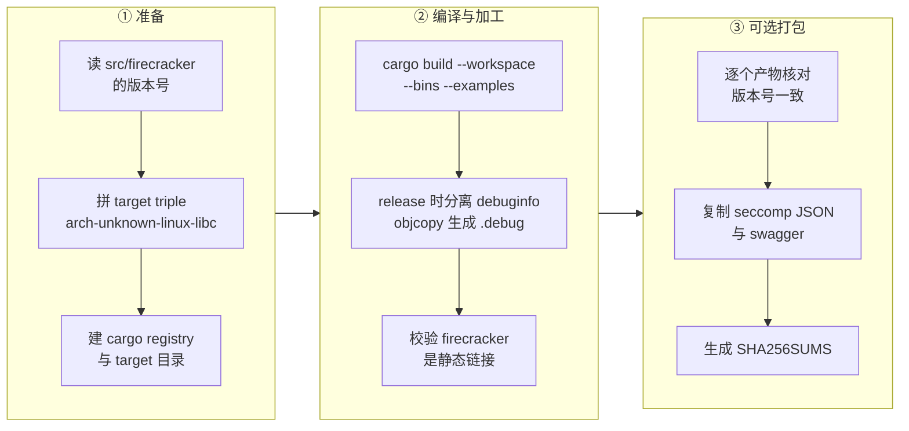

# 06 · 构建、运行与调试环境

> 这一篇把源码变成能跑的东西：怎么编、编出什么、怎么用几条 `curl` 把一台 microVM 拉起来、
> 出问题时手上有哪些观测手段。后面各篇讲机制时会假设读者能自己起一台 microVM 复现。
>
> **读者**：所有读者。
> **预备**：[第 05 篇 · 本书用到的 Rust 与依赖 crate](05-rust-and-crates-primer.md)。
> **代码**：`tools/devtool`、`tools/release.sh`、`src/firecracker/build.rs`、
> `src/firecracker/src/main.rs`、`src/vmm/src/logger/logging.rs`、`resources/rebuild.sh`

---

## 0. 本篇要回答的问题

1. 为什么官方构建要套一层容器，不套容器直接 `cargo build` 会缺什么？
2. 一次 release 构建产出哪些文件，为什么二进制必须是静态链接的？
3. debug 构建与 release 构建在**行为**上有什么差别（不只是优化级别）？
4. 从零起一台 microVM 最少需要哪几步，`--config-file` 与 `--no-api` 各解决什么问题？
5. 命令行参数有哪些，哪些是给编排系统用的、哪些是给人用的？
6. 进程行为不对时，手上有哪些观测手段，它们各自的盲区在哪？

---

## 1. 问题：构建环境要固定到什么程度

Firecracker 的二进制要在别人的机器上跑，而且经常是在 chroot（jailer 建的）里跑，
那里没有动态链接器、没有 libc、没有任何共享库。所以产物必须**静态链接**，
链接的是 musl 而不是 glibc —— glibc 的静态链接在 NSS、locale 等处有已知问题。

还有一个约束来自 seccomp。进程允许哪些系统调用，是编译期决定的（[第 05 篇 §2](05-rust-and-crates-primer.md#2-workspace-与十二个-crate)）：
`build.rs` 把 JSON 策略编成 BPF 内嵌进二进制。如果编译用的工具链变了，
标准库内部换用了一个新的系统调用，而白名单里没有它，进程会在运行时被自己的过滤器杀掉。
所以 `rust-toolchain.toml` 把工具链钉死在 1.85.0，而不是「用你机器上那个」。

这两条合起来解释了 `tools/devtool` 的存在：它不是一个便利脚本，而是把「哪个工具链、哪个 target、
哪个内核头文件版本」这些会影响产物正确性的变量固定下来的办法。

---

## 2. 两条构建路径

### 2.1 容器路径：`tools/devtool`

`tools/devtool` 是一个 bash 脚本。它把仓库根目录 bind mount 进一个预制镜像
（`public.ecr.aws/firecracker/fcuvm`，标签在脚本里写死，v1.12.1 用的是 `v79`），
在容器里执行真正的构建命令。几个细节值得注意：

- 镜像名不带架构后缀，靠 Docker 按宿主架构拉对应的 manifest；脚本本身不区分 x86_64 与 aarch64。
- cargo 的 registry 与 target 目录被 mount 到宿主的 `build/cargo_registry`、
  `build/cargo_git_registry`、`build/cargo_target`，所以容器是一次性的，下载的 crate 与编译产物不是。
- `--volume /dev:/dev` 与 `-v /boot:/boot`：前者让容器里能开 `/dev/kvm` 跑集成测试，后者供测试读宿主内核配置。
- 构建以 root 身份跑，结束后 `cmd_fix_perms` 把 `build/` 下的属主改回当前用户。

常用子命令只有四个：`build [--debug|--release] [-l musl|gnu]`、`test`（pytest 集成测试）、
`checkstyle`（风格检查，见[第 47 篇 · 测试体系](47-testing.md)）、`shell`（进容器）。

还有一个 `checkenv` 值得单独提，它检查的是**宿主机**而不是构建环境：`/dev/kvm` 是否可读写、
内核版本是否不低于 4.14、以及一组会影响安全性或性能的宿主设置 —— KPTI 是否生效、
KSM（内核同页合并）是否开着、有没有开 swap、Intel 的 EPT 是否可用、是否正跑在虚拟机里。
这些检查项本身就是一份宿主机清单：KSM 会把不同 microVM 的相同页合并到一起，
在多租户场景下是侧信道面；swap 会让 guest 内存被换出，破坏「内存常驻」这个后面几篇都要依赖的假设。
`checkenv` 对这些情况只发警告不阻止运行，判断留给部署者。

### 2.2 容器里实际跑的是 `tools/release.sh`

`devtool build` 最终执行 `./tools/release.sh --libc <libc> --profile <profile>`。这个脚本做四件事：



第 ② 步的 `--workspace` 很关键：它绕过了根 `Cargo.toml` 里的 `default-members`，
于是 `jailer` 也被编出来。第 ② 步最后那次校验是硬性的 —— `file` 的输出里必须出现
`statically linked`（aarch64）或 `static-pie linked`（x86_64），否则脚本直接失败。

第 ③ 步只在 `--make-release` 时执行，它会把每个二进制的 `--version` 输出与 cargo 版本号比对，
并检查 `src/firecracker/swagger/firecracker.yaml` 里声明的版本是否匹配。
这解释了为什么 swagger 文件是**契约而不是文档**：发布流程会校验它，
下游（包括 e2b 的构建脚本）也从它读版本号。

### 2.3 产物

产物落在 `build/cargo_target/<target triple>/<profile>/`。六个可执行文件：

| 产物 | 作用 | 相关篇目 |
|---|---|---|
| `firecracker` | VMM 主程序 | 07 起 |
| `jailer` | 把 `firecracker` 放进 chroot / cgroup / namespace 再执行 | 43 |
| `seccompiler-bin` | 把 seccomp JSON 编成 BPF 二进制，供 `--seccomp-filter` 使用 | 42 |
| `snapshot-editor` | 离线查看与修改 vmstate 文件 | 41 |
| `rebase-snap` | 把差分内存文件合并进基底内存文件 | 41 |
| `cpu-template-helper` | 采集宿主 CPU 特性、生成与校验 CPU 模板 | 22 |

release 构建还会为每个产物生成一个 `.debug` 文件：`objcopy --only-keep-debug` 把调试信息拆出去，
再用 `--add-gnu-debuglink` 在主二进制里留一个指针。部署时只带主二进制，调试时把 `.debug` 放回同目录。

### 2.4 不用容器直接构建

容器不是必需的。本机直接编需要三个条件：工具链版本与 `rust-toolchain.toml` 一致（rustup 会按这个文件自动切换，
前提是 1.85.0 已安装）、装了对应的 musl target（`rustup target add x86_64-unknown-linux-musl`）、
以及一个 musl 的链接器。然后一条命令就够：

```bash
cargo build --release --target x86_64-unknown-linux-musl --workspace --bins
```

产物落在同样的 `target/` 布局下（路径前缀取决于是否设了 `CARGO_TARGET_DIR`）。
这样编出来的二进制与容器里编的在功能上一致，差别在两处：
一是 `generated/` 下的绑定已经提交入库，不随本机内核头文件变化（[第 05 篇 §7](05-rust-and-crates-primer.md#7-生成代码generated-与-bindgen)），
所以本机头文件版本不影响产物；二是集成测试依赖容器里预装的 pytest 环境与 CI 产物，
本机跑得起 `cargo test`，跑不起 `devtool test`。

### 2.5 debug 构建不只是慢

`src/firecracker/build.rs` 里有一段容易被忽略的逻辑：**debug 构建时，seccomp 策略被换成
`resources/seccomp/unimplemented.json`**，也就是一张空过滤器。同一段逻辑在目标三元组没有对应策略文件时
（例如 gnu target）也会生效，并打一条 `cargo:warning`。

后果是：用 debug 二进制验证「某个操作会不会被 seccomp 挡住」得不到有效结论，
必须用 release 的 musl 构建。这是本书后面几处讨论系统调用白名单时（[第 42 篇](42-seccomp.md)、
第 52 篇、第 62 篇）反复要回到的前提。

---

## 3. 跑一台 microVM

### 3.1 需要准备什么

三样东西：一个未压缩的 guest 内核镜像（x86_64 上是 `vmlinux`，aarch64 上是 `Image`）、
一个 ext4 格式的 rootfs 镜像文件、以及可读写的 `/dev/kvm`。

仓库自带构建这两样的材料：`resources/guest_configs/` 下是 CI 用的内核配置
（按架构与内核版本分文件，例如 `microvm-kernel-ci-aarch64-6.1.config`），
`resources/rebuild.sh` 用它们编内核，并用一个 Ubuntu 容器做出 rootfs；
`resources/overlay/` 是往 rootfs 里塞的文件。这套脚本是给 CI 用的，本地跑需要 docker 与一堆构建依赖。
本书第十部分讲的 ARM 适配版不使用这套脚本，guest 内核来自单独的 fc-kernels 仓库（[第 56 篇](56-guest-kernel-requirements-and-e2b-configs.md)）。

### 3.2 最短路径：起进程，然后发四个请求

Firecracker 启动时**不读任何配置**。它只是打开一个 Unix socket 并等在那里：

```bash
rm -f /tmp/firecracker.socket
./firecracker --api-sock /tmp/firecracker.socket
```

配置通过 HTTP 请求送进去。`curl` 的 `--unix-socket` 让它把请求发到一个 Unix socket 而不是 TCP，
URL 里的主机名被忽略：

```bash
curl -X PUT --unix-socket /tmp/firecracker.socket \
  --data '{"kernel_image_path":"./vmlinux","boot_args":"console=ttyS0 reboot=k panic=1 pci=off"}' \
  http://localhost/boot-source

curl -X PUT --unix-socket /tmp/firecracker.socket \
  --data '{"drive_id":"rootfs","path_on_host":"./rootfs.ext4","is_root_device":true,"is_read_only":false}' \
  http://localhost/drives/rootfs

curl -X PUT --unix-socket /tmp/firecracker.socket \
  --data '{"action_type":"InstanceStart"}' \
  http://localhost/actions
```

前两个请求只是在进程内存里填结构体，什么都没发生；第三个请求才真正创建 VM、加载内核、起 vCPU 线程。
配置与启动分成两个阶段这件事贯穿全书，[第 09 篇 · rpc_interface](09-rpc-interface.md) 讲这条分界线的含义。

要让 guest 能上网，还需要在启动前多发一个请求。Firecracker 自己不建网络设备，
它要求宿主上已经存在一个 tap 设备，然后把这个 tap 挂成 guest 的一块网卡：

```bash
ip tuntap add dev tap0 mode tap
ip addr add 172.16.0.1/30 dev tap0
ip link set dev tap0 up

curl -X PUT --unix-socket /tmp/firecracker.socket \
  --data '{"iface_id":"eth0","guest_mac":"06:00:AC:10:00:02","host_dev_name":"tap0"}' \
  http://localhost/network-interfaces/eth0
```

guest 侧的 IP 配置不归 Firecracker 管：要么在 rootfs 里预置，要么让 guest 从 MAC 地址推导
（CI 用的 rootfs 就是这么做的）。宿主侧的转发与 NAT 规则同样要自己加。
这条边界很清楚 —— Firecracker 只负责把 tap 的收发队列接到 virtio-net 设备上，
网络拓扑是调用方的事，[第 30 篇 · virtio-net](30-virtio-net.md) 讲这条数据通路。

启动之后，串口被接到 firecracker 进程的 stdin / stdout，guest 的控制台输出直接打在第一个终端上。
再往后可以暂停和做快照：

```bash
curl -X PATCH --unix-socket /tmp/firecracker.socket \
  --data '{"state":"Paused"}' http://localhost/vm

curl -X PUT --unix-socket /tmp/firecracker.socket \
  --data '{"snapshot_type":"Full","snapshot_path":"./vmstate","mem_file_path":"./memfile"}' \
  http://localhost/snapshot/create
```

在 guest 里执行 `reboot` 会让 Firecracker 退出 —— 它不实现 guest 电源管理，
收到重启事件就结束进程（[第 12 篇](12-vmm-event-loop-and-exit.md)）。

### 3.3 `--config-file` 与 `--no-api`

逐条发 HTTP 请求适合手工探索，不适合批量启动。`--config-file <path>` 把整套配置写在一个 JSON 文件里，
进程启动时一次读完并直接构建 microVM。文件的结构就是各配置段的并列，
`tests/framework/vm_config.json` 是一个完整样例：

```json
{
  "boot-source": { "kernel_image_path": "vmlinux.bin", "boot_args": "console=ttyS0 reboot=k panic=1 pci=off" },
  "drives": [ { "drive_id": "rootfs", "is_root_device": true, "is_read_only": false,
                "path_on_host": "rootfs.ext4", "cache_type": "Unsafe", "io_engine": "Sync" } ],
  "machine-config": { "vcpu_count": 2, "mem_size_mib": 1024, "smt": false,
                      "track_dirty_pages": false, "huge_pages": "None" }
}
```

这条路径和 API 路径共用同一套反序列化与校验代码（`VmResources::from_json()`，[第 10 篇](10-vm-resources-and-config.md)），
所以两者的校验行为一致。

`--no-api` 更进一步：它要求同时给出 `--config-file`，然后**完全不创建 API 线程**，
socket 也不建。进程构建完 microVM 就进事件循环，直到 guest 关机。
这是密度最高、攻击面最小的跑法，代价是启动之后不能暂停、不能做快照、不能改任何配置。
两条路的代码分叉点在 `src/firecracker/src/main.rs` 末尾：`run_with_api()` 与 `run_without_api()`，
[第 07 篇](07-process-startup.md) 展开。

---

## 4. 命令行参数

参数在 `src/firecracker/src/main.rs` 的 `main_exec()` 里用 `utils::arg_parser` 声明。按用途分四组。

| 参数 | 取值 | 说明 |
|---|---|---|
| `--api-sock` | 路径 | API socket，默认 `/run/firecracker.socket` |
| `--id` | 字符串 | 实例 id，进日志与 `GET /`，默认 `anonymous-instance` |
| `--config-file` | 路径 | 一次性配置 JSON |
| `--metadata` | 路径 | 启动时写入 MMDS 的 JSON |
| `--no-api` | 开关 | 不起 API 线程；要求 `--config-file` |

| 参数 | 取值 | 说明 |
|---|---|---|
| `--seccomp-filter` | 路径 | 自定义 BPF 过滤器；与 `--no-seccomp` 互斥 |
| `--no-seccomp` | 开关 | 装空过滤器 |
| `--http-api-max-payload-size` | 字节数 | 请求体上限，默认 51200 |
| `--mmds-size-limit` | 字节数 | MMDS 数据上限，默认取上一项的值 |

| 参数 | 取值 | 说明 |
|---|---|---|
| `--log-path` | 路径 | 日志输出的文件或 FIFO |
| `--level` | `Off`/`Error`/`Warn`/`Info`/`Debug`/`Trace` | 日志级别，默认 `Info`，大小写不敏感 |
| `--module` | 模块名 | 只输出该模块前缀的日志 |
| `--show-level` / `--show-log-origin` | 开关 | 日志里是否带级别、是否带文件与行号 |
| `--metrics-path` | 路径 | metrics 输出的文件或 FIFO |
| `--boot-timer` | 开关 | 挂一个 boot timer 设备，记录 `InstanceStart` 到 guest 触碰它的时间 |

| 参数 | 取值 | 说明 |
|---|---|---|
| `--version` / `--snapshot-version` | 开关 | 打印二进制版本 / 支持的快照数据格式版本后退出 |
| `--describe-snapshot` | 路径 | 打印该 vmstate 文件的数据格式版本后退出 |
| `--start-time-us` / `--start-time-cpu-us` / `--parent-cpu-time-us` | 微秒 | 由父进程（jailer 或编排器）传入，用于把进程启动前的耗时计入 metrics |

最后一组里的三个时间参数是给编排系统用的：jailer 在 exec 之前记下时刻，
firecracker 收到后把「从父进程开始到 API server 就绪」这段算进 `latencies_us`。
其余参数面向人或面向配置文件。

v1.12.1 的参数表里**没有** `--enable-pci`：这个仓库在此版本只有 virtio-mmio 一种传输层，
PCI 支持是后续版本的事。

---

## 5. 出了问题看什么

### 5.1 日志

`--log-path` 指向的可以是普通文件，也可以是 FIFO；打开时带 `O_NONBLOCK`
（`src/vmm/src/logger/logging.rs` 的 `Logger::update()`），所以指向一个没人读的 FIFO 不会让进程卡住，
但日志会丢。没有 `--log-path` 时日志走 stderr。

同一份配置也可以在运行时改：`PUT /logger` 的请求体字段与命令行参数一一对应。
调试路由与请求解析时把级别调到 `Debug` 很有用 —— API server 会把每个请求的方法、路径与请求体完整打出来
（`src/firecracker/src/api_server/parsed_request.rs` 的 `describe()`）。
有一个例外：`PUT /cpu-config` 的请求体只在 `Debug` 级别才打印，因为 CPU 模板很长。

`--module` 接一个模块路径前缀，可以把输出缩到某个子系统，例如只看 virtio 队列。

### 5.2 metrics

`--metrics-path` 同样是文件或 FIFO，内容是逐行的 JSON 对象。两条产出路径：
`PeriodicMetrics` 订阅者每隔一段时间写一次，或者由 `PUT /actions` 的 `FlushMetrics` 动作触发一次。
`latencies_us` 下的字段按动作分段计时（`pause_vm`、`resume_vm`、`full_create_snapshot`、
`diff_create_snapshot`、`load_snapshot`），是判断某个 API 调用慢在哪一步的第一手材料。
结构见[第 44 篇 · 日志与 metrics](44-logging-and-metrics.md)。

### 5.3 panic 与退出码

`main_exec()` 一开始就用 `panic::set_hook()` 装了自己的 panic 钩子：记一条 `error!` 日志、
把 `METRICS.vmm.panic_count` 置 1、把 metrics 刷出去、顺便把 stdin 恢复成规范模式
（否则终端会留在 guest 串口设置的 raw 模式下）。因为 `[profile.release]` 里 `panic = "abort"`，
钩子跑完进程就被 `SIGABRT` 终止。

推论：这个自定义钩子替换了标准库默认的钩子，而默认钩子才是打印 backtrace 的那个，
所以设置 `RUST_BACKTRACE` 不会让 panic 输出里出现调用栈；仓库里也没有任何地方读这个环境变量。
定位 panic 位置要靠日志里 `PanicHookInfo` 打出来的文件与行号，或者用 core dump。

正常退出则走 `FcExitCode`。它是 `main()` 的返回值，编排系统靠它区分「guest 正常关机」
与「被 seccomp 杀掉」「收到 SIGBUS」这类情况。取值表在[第 07 篇 §6](07-process-startup.md#6-退出码)。

### 5.4 两个可选特性

`gdb` 特性（`cargo build --features gdb`）打开一个 GDB 远程串行协议的服务端，
通过 `machine-config` 里的 `gdb_socket_path` 指定 socket，可以单步调试 guest 内核；
guest 内核需要带 `CONFIG_FRAME_POINTER` 与 `CONFIG_DEBUG_INFO`。
`tracing` 特性在每个函数的进出打一条 `Trace` 日志，用于定位死锁与异常耗时。
两者都不进正式构建，细节在[第 45 篇](45-gdb-tracing-and-kani.md)。

### 5.5 观测手段的盲区

上面这些手段都在 Firecracker 进程之内。三类问题它们看不见：guest 内部发生了什么
（只能靠串口与 guest 自己的日志）；KVM 在内核里做了什么（要用 `perf`、`trace-cmd` 看 kvm tracepoint）；
以及被 seccomp 拦下的系统调用 —— 这一类会以 `SIGSYS` 终止进程，
退出码 148（`FcExitCode::BadSyscall`），日志里由信号处理器记下被拦的系统调用号
（`src/vmm/src/signal_handler.rs`，[第 12 篇](12-vmm-event-loop-and-exit.md)）。

---

## 6. 后续各层的差异

e2b 定制版在仓库根加了 `Makefile` 与 `scripts/build.sh`、`scripts/upload.sh`：构建仍然调用
`tools/devtool -y build --release`，外面套了一层「从 swagger 读版本号、拼成 `v<版本>_<7 位提交 hash>`
的版本名、把二进制复制到 `build/fc/<版本名>/` 并上传」的流程；见[第 55 篇](55-seccomp-build-upload-and-upstream-fixes.md)。
ARM 适配版对这个脚本只做了一处改动：产物路径里的目标三元组改为按 `uname -m` 推导，不再写死 x86_64；
见[第 58 篇](58-building-and-running-on-aarch64.md)。命令行参数与 `--config-file` 的格式在三层里都没有变化。

---

## 7. 小结

- 官方构建套容器，是为了固定工具链版本与目标三元组：工具链漂移会让内嵌的 seccomp 白名单与实际系统调用对不上。
- 产物必须静态链接（musl），因为它要在 jailer 建的 chroot 里执行；`release.sh` 会强制校验这一点。
- `cargo build` 默认不编 jailer，正式构建用 `--workspace` 绕过 `default-members`。
- debug 构建把 seccomp 策略换成空过滤器，所以验证系统调用白名单必须用 release 的 musl 构建。
- Firecracker 启动时不读配置，一切通过 API socket 送入；`--config-file` 与 API 路径共用同一套校验代码。
- `--no-api` 省掉 API 线程，换来更小的攻击面，代价是放弃暂停、快照与运行时改配置。
- 日志与 metrics 的目标都可以是 FIFO，打开时带 `O_NONBLOCK`，读得慢会丢数据而不是阻塞进程。
- 自定义 panic 钩子替换了默认钩子，`RUST_BACKTRACE` 无效；panic 定位靠日志里的文件行号（推论）。
- swagger 文件是发布流程会校验的契约，不是说明文档。

---

## 延伸阅读 / 下一篇

- 下一篇：[第 07 篇 · 进程启动：从参数到运行](07-process-startup.md) —— 这些参数在进程里被怎么处理。
- [第 47 篇 · 测试体系：单元、集成与性能](47-testing.md) 讲 `devtool test` 背后的 pytest 框架。
- [第 43 篇 · jailer](43-jailer.md) 讲生产环境里真正的启动方式。
- [第 77 篇 · 配置项、命令行参数、环境变量与 metrics 总表](77-config-cli-env-metrics-reference.md) 是本篇参数表的完整版。
- 上游文档 `docs/getting-started.md`、`docs/gdb-debugging.md`、`docs/tracing.md` 给出更多操作细节；以代码为准。
