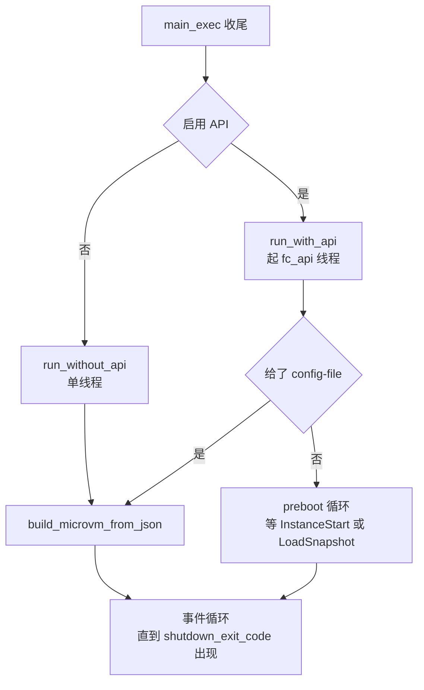
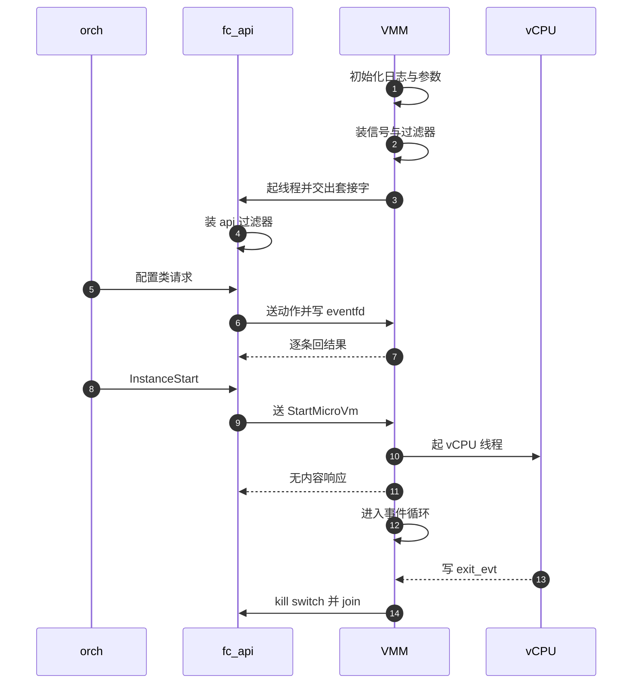

# 07 · 进程启动：从参数到运行

> 一台 microVM 就是一个 Firecracker 进程。进程从 `main()` 到接受第一个 API 请求之间做的事，
> 决定了这台 microVM 能被怎么控制、出问题时留下什么痕迹、以什么状态码退出。
> 本篇沿着 `main_exec()` 逐段走一遍，重点在几件**只能在这里做、做完就不可逆**的进程级设置。
>
> **读者**：系统工程师、运维。
> **预备**：[第 05 篇 · 本书用到的 Rust 与依赖 crate](05-rust-and-crates-primer.md)、
> [第 06 篇 · 构建、运行与调试环境](06-build-run-debug.md)。
> **代码**：`src/firecracker/src/main.rs`、`src/firecracker/src/api_server_adapter.rs`、
> `src/firecracker/src/seccomp.rs`、`src/firecracker/src/metrics.rs`、
> `src/vmm/src/signal_handler.rs`、`src/vmm/src/lib.rs`

---

## 0. 本篇要回答的问题

1. 从 `main()` 到第一个 API 请求被处理，进程按什么顺序做了哪些事？为什么是这个顺序？
2. 哪些设置是全进程一次性的、之后不可撤销的？它们分别防的是什么？
3. `resize_fdtable()` 这样一个看起来无关紧要的函数，为什么值得写进启动路径？
4. 有 API 与无 API 两条路的差别在哪里，各自适合什么场合？
5. 一个 Firecracker 进程的退出码怎么产生，运维能从退出码读出什么？

---

## 1. 问题：启动阶段是唯一能设全局状态的窗口

Firecracker 的运行期是被两层东西锁住的：seccomp 过滤器限制了进程能发的系统调用，
vCPU 线程与事件循环一旦跑起来就不再接受「重新配置进程」这类操作。
凡是涉及整个进程的设置 —— 日志目的地、信号处理、文件描述符表的大小、系统调用白名单 ——
都只有在这两层锁上之前才能做。启动路径因此不是一串可有可无的准备工作，而是一段有严格顺序约束的代码。

顺序约束来自三个方向。第一，出错要有地方报：日志必须最先可用，否则后面每一步的失败都只能靠退出码猜。
第二，加固要早于暴露：seccomp 与信号处理要在监听套接字、起线程之前装好，否则中间存在一段无防护窗口。
第三，某些设置有副作用：`resize_fdtable()` 会短暂占用一个描述符，必须在还没有别的描述符要保护时做。

`main()` 本身只有十来行（`src/firecracker/src/main.rs`）：调用 `main_exec()`，
成功就记一条 `exit_code=0` 的日志返回 `ExitCode::SUCCESS`，失败就把错误同时写进日志和 stderr，
再把 `MainError` 通过 `From<MainError> for FcExitCode` 转成一个 `u8` 退出码。
真正的启动流程全在 `main_exec()` 里。

---

## 2. 先让失败可见

`main_exec()` 的第一句是 `LOGGER.init()`。此时还没有解析参数，日志只能落到默认目的地，
但这保证了「参数解析失败」本身也有日志。紧接着调用一次 `host_page_size()`
（`src/vmm/src/arch/mod.rs`），这个函数第一次被调用时把宿主页大小缓存进静态变量，
之后全进程的内存计算都读这份缓存，不再走系统调用 —— 把它放在最前面，是为了让缓存的写入发生在多线程出现之前。

第三件事是安装 panic hook。Firecracker 以 `panic = "abort"` 构建，panic 不展开栈而是直接 abort，
所以 hook 是崩溃前最后一段能执行的代码。它做三件事：把 panic 的位置与消息写进日志；
把 stdin 恢复成 canonical 模式；把 `panic_count` 置 1 并调用 `METRICS.write()` 落盘。
恢复终端是有实际后果的 —— 串口设备启动时会把 stdin 置成 raw 且非阻塞（`Vmm::start_vcpus()`），
进程如果直接 abort，操作员的终端会留在 raw 模式下不可用。

### 2.1 参数解析与四个短路出口

参数用 `utils` crate 里手写的 `ArgParser` 解析，不引入 clap 这类依赖。
每个参数声明为一个 `Argument`，可以带默认值、`takes_value`、以及两种关系约束：
`forbids`（`--seccomp-filter` 与 `--no-seccomp` 互斥）和 `requires`（`--no-api` 要求 `--config-file`）。
参数分四类：身份与通信（`--id`、`--api-sock`）、加固（`--seccomp-filter`、`--no-seccomp`）、
可观测（`--log-path`、`--level`、`--module`、`--show-level`、`--show-log-origin`、`--metrics-path`）、
以及行为开关（`--config-file`、`--no-api`、`--metadata`、`--boot-timer`、
`--http-api-max-payload-size`、`--mmds-size-limit`、三个 `*-time-us` 计时参数）。

解析完有四个短路出口：`--help`、`--version`、`--snapshot-version`、`--describe-snapshot`。
前三个打印一行就返回，最后一个打开给定的 vmstate 文件、读出快照格式版本、打印后返回
（`print_snapshot_data_format()` 调用 `Snapshot::get_format_version()`）。
这四条路都不创建 microVM、不监听套接字、不装 seccomp，因此可以放心地在宿主上直接跑，
用来在恢复快照前判断产物版本是否匹配。

短路之后才做 `validate_instance_id()`，然后把 `--log-path` 等日志参数喂给 `LOGGER.update()`。
这是日志的第二次配置：第一次只为了让早期错误有去处，第二次才落到用户指定的文件或 fifo。

---

## 3. 三件不可逆的进程级设置

日志就位之后，`main_exec()` 连着做三件影响整个进程的事。

**注册信号处理器。** `register_signal_handlers()`（`src/vmm/src/signal_handler.rs`）
为八个信号装上处理器：`SIGSYS`、`SIGBUS`、`SIGSEGV`、`SIGXFSZ`、`SIGXCPU`、`SIGPIPE`、`SIGHUP`、`SIGILL`。
除 `SIGPIPE` 外，其余七个的处理器由同一个宏 `generate_handler!` 生成，行为一致：
记一个 metric、写一条错误日志、调用 `METRICS.write()` 把指标落盘、然后 `libc::_exit()` 带一个专属退出码。
`SIGSYS` 的处理器额外从 `siginfo_t` 里取出被拦截的系统调用号写进日志，这是排查 seccomp 违规的唯一线索。
`SIGPIPE` 是例外：只累加计数器并记日志，进程继续跑，由调用点自己处理 `EPIPE`。

这里有一个容易误解的地方：`SIGTERM` 与 `SIGINT` **不在**这份列表里，Firecracker 不为它们装处理器。
对这两个信号，进程走内核默认行为直接终止，不会有落盘的 metrics，也不会有优雅停机。
让一台 microVM 有序退出要走 API（`PUT /actions` 的 `SendCtrlAltDel`，仅 x86_64）或者让 guest 自己关机，
细节在[第 12 篇 · Vmm、事件循环与退出路径](12-vmm-event-loop-and-exit.md)。

**aarch64 上打开 SSBD 缓解。** `enable_ssbd_mitigation()` 用
`prctl(PR_SET_SPECULATION_CTRL, PR_SPEC_STORE_BYPASS, PR_SPEC_FORCE_DISABLE)`
强制关闭本进程的推测式存储绕过。失败只记日志不终止，并且在 `EINVAL` 时额外提示宿主内核不支持。
这是一段 `#[cfg(target_arch = "aarch64")]` 代码，x86_64 上不存在 —— 该架构的同类缓解由 CPU 模板处理，
见[第 20 篇 · CPU 模板机制](20-cpu-templates.md)。

**预扩文件描述符表。** `resize_fdtable()` 先用 `getrlimit(RLIMIT_NOFILE)` 取上限
（没有限制时用 2048，也就是 jailer 通常设的值），然后 `dup2(0, limit - 1)` 把 stdin 复制到编号最大的槽位，
紧接着 `close(limit - 1)` 关掉它。这两步的目的不是得到那个描述符，而是**逼内核把 fd 表一次性扩到最大**。
理由写在函数的文档注释里：内核的 fd 表初始只有 64 项，超过就重新分配；
一台设备稍多的 microVM 会用掉大量 eventfd 与 timerfd（每个 virtqueue 一个 ioeventfd，
每个设备至少一个 irqfd，加上定时器），恢复快照时集中注册这些描述符会触发多次重分配，
而在大量描述符已注册进 epoll 的情况下重分配代价很高。

错误处理分两档，取舍写得很清楚：`GetRlimit` 与 `Dup2` 失败只记一条 debug 日志继续跑，
因为后果只是快照恢复慢一些；`Close` 失败则直接返回 `MainError::ResizeFdtable` 终止进程，
因为此时有一个来路不明的描述符留在表里，继续运行的风险大于收益。

---

## 4. 把参数变成运行时对象

接下来的一段是纯粹的构造：`InstanceInfo` 结构由四个字段组成 —— `id`（来自 `--id`）、
`state`（固定为 `VmState::NotStarted`）、`vmm_version`（编译期的 `CARGO_PKG_VERSION`）、
`app_name`（常量 `"Firecracker"`）。这个结构会被一路传进 `VmResources` 与 `Vmm`，
是 `GET /` 返回的内容，也是控制器判断当前处于哪个阶段的依据（[第 09 篇 · rpc_interface](09-rpc-interface.md)）。

`--metrics-path` 给出时调用 `init_metrics()`，把指标的落盘目标定下来。
注意这与 `PUT /metrics` 是同一套配置，只是入口不同。

seccomp 过滤器在这里**加载但不装载**。`SeccompConfig::from_args()`（`src/firecracker/src/seccomp.rs`）
把两个命令行参数映射成三档：`--no-seccomp` 得到 `None`，`--seccomp-filter <path>` 得到 `Custom(File)`，
两个都没给得到 `Advanced`。`get_filters()` 按档位产出一个 `BpfThreadMap`：
`None` 档给三张空过滤器；`Advanced` 档用 `include_bytes!` 取出编译期由该 crate 的 `build.rs`
调用 seccompiler 生成的二进制并反序列化；`Custom` 档反序列化用户提供的文件。
无论哪一档，`filter_thread_categories()` 都要求结果恰好包含 `vmm`、`api`、`vcpu` 三个键，
多了报 `ThreadCategories`，少了报 `MissingThreadCategory`。

三份过滤器分别在各自的线程上装载，时机都不在 `main_exec()`：
API 线程的那份在线程函数里由 `ApiServer::run()` 装（见[第 08 篇 · API server](08-api-server.md)），
vCPU 与 VMM 的两份由 builder 在建机末尾装（[第 11 篇 · builder](11-builder.md)）。
这个分离的代价是建机全过程不受过滤器保护，收益是白名单里不必包含只在建机阶段用到的系统调用。
过滤器本身的内容见[第 42 篇 · seccomp](42-seccomp.md)。

最后读两个文件：`--config-file` 与 `--metadata` 各自被 `fs::read_to_string()` 读成字符串，
读不出来直接 panic（代码里用的是 `expect`，因此表现为 abort 而不是带退出码的错误返回）。
两个大小上限也在这里定：`--http-api-max-payload-size` 默认取 `HTTP_MAX_PAYLOAD_SIZE`，
即 `src/vmm/src/lib.rs` 里的 51200 字节；`--mmds-size-limit` 不给时**继承** payload 上限。

---

## 5. 两条路

`api_enabled` 由 `!arguments.flag_present("no-api")` 决定，分出两条完全不同的运行形态。

**无 API 路径**（`run_without_api()`，仍在 `main.rs`）最简单：先从 `BpfThreadMap` 里滤掉 `api` 那份过滤器，
建一个 `EventManager`，挂上 `PeriodicMetrics` 订阅者，调用 `build_microvm_from_json()`
把 JSON 配置直接变成一台跑起来的 microVM，然后进入 `event_manager.run()` 的循环，
每轮检查一次 `vmm.lock().unwrap().shutdown_exit_code()`：是 `Ok` 就跳出返回成功，
是别的值就包成 `RunWithoutApiError::Shutdown`，仍是 `None` 就继续。
这条路没有控制面，microVM 一旦起来就只能自己跑到结束，适合一次性任务与最小化攻击面的场景。

**有 API 路径**（`api_server_adapter.rs` 的 `run_with_api()`）建立起本书后面反复出现的双线程结构。
它先造两样通信设施：`api_event_fd` 是一个 `EFD_SEMAPHORE` 的 eventfd，
用来让 API 线程唤醒 VMM 线程；`api_kill_switch` 是一个非阻塞 eventfd，
用来在结束时把 API 线程从 `epoll_wait` 里叫出来。再造两条 `std::sync::mpsc` 通道，
一条送 `ApiRequest`，一条回 `ApiResponse`。

然后绑定套接字：`HttpServer::new(&bind_path)`。这里对 `AddrInUse` 做了单独处理，
转成 `FailedToBindSocket` 并在错误消息里提示套接字可能已被占用 ——
这是编排层最常遇到的启动失败，值得一个专门的错误。绑定成功后装上 kill switch，
把 `HttpServer` 连同 `api` 过滤器一起 move 进名为 `fc_api` 的新线程。

主线程随即变成 VMM 线程：建 `EventManager`，挂 `PeriodicMetrics`，然后按有没有 `--config-file` 分岔。
给了 `--config-file` 就走和无 API 路径相同的 `build_microvm_from_json()`，API 只用于建机之后的控制；
没给就调用 `PrebootApiController::build_microvm_from_requests()`，
进入一个只收 API 请求的阻塞循环，直到某个请求触发建机。两种分岔都返回
`(VmResources, Arc<Mutex<Vmm>>)`，交给 `ApiServerAdapter::run_microvm()`。

下面这张时序图把两个线程的交错画在一起。`orch` 指编排进程这类 API 调用方，
`fc_api` 是 API 线程，`VMM` 是主线程，`vCPU` 是 vCPU 线程。

`run_microvm()` 把一个实现了 `MutEventSubscriber` 的 `ApiServerAdapter` 注册进事件管理器，
它监听的就是 `api_event_fd`。从这一刻起，API 请求不再由阻塞循环接收，
而是作为事件管理器的一个事件源与设备 I/O 竞争同一个循环。循环的结构与无 API 路径一样：
`run()` 一轮，查一次 `shutdown_exit_code()`。

退出时的收尾顺序是固定的：先 `api_kill_switch.write(1)` 让 API 线程从 `epoll_wait` 返回并结束，
再 `api_thread.join()` 等它真正退出，最后才把结果返回给 `main_exec()`。
先 join 再返回，保证进程退出时不会留下还在写套接字的线程。

---

## 6. 退出码

`FcExitCode`（`src/vmm/src/lib.rs`）是一个 `#[repr(u8)]` 的枚举，取值刻意避开常见的 shell 退出码区间。

| 值 | 名称 | 含义 |
|---|---|---|
| 0 | `Ok` | 正常退出：guest 关机或收到 `Ok` 的停机请求 |
| 1 | `GenericError` | 泛化错误：绝大多数 `MainError` 变体都落到这里 |
| 2 | `UnexpectedError` | 信号处理器发现信号号与自己不匹配等逻辑不该出现的情况 |
| 148 | `BadSyscall` | 拦截到受限系统调用，由 `SIGSYS` 处理器写出 |
| 149 / 150 | `SIGBUS` / `SIGSEGV` | 对应信号被拦截 |
| 151 / 154 | `SIGXFSZ` / `SIGXCPU` | 文件尺寸、CPU 时间超限 |
| 155 / 156 / 157 | `SIGPIPE` / `SIGHUP` / `SIGILL` | 对应信号被拦截 |
| 152 | `BadConfiguration` | `--config-file` 的内容不合法 |
| 153 | `ArgParsing` | 命令行参数解析失败 |

退出码有两条来路。信号类的由信号处理器直接 `libc::_exit()` 写出，不经过 `main()`。
其余的由 `From<MainError> for FcExitCode` 决定：`ParseArguments` 映射到 `ArgParsing`，
`InvalidLogLevel` 映射到 `BadConfiguration`，两条 microVM 停机路径
（`ApiServerError::MicroVMStoppedWithError` 与 `RunWithoutApiError::Shutdown`）
**透传**其中携带的 `FcExitCode`，其余一律 `GenericError`。

这个设计的代价值得说明：`GenericError` 覆盖面过宽，
套接字被占用、seccomp 文件损坏、metrics 初始化失败在退出码上无法区分，
运维只能靠日志或 stderr 上的错误消息定位。收益是编排层可以用一个简单规则分类 ——
退出码 ≥ 148 说明进程是被信号或配置问题打断的，值得告警；0 是正常结束；1 要去读日志。

`SIGPIPE` 是列表里的怪例：它有一个退出码 155，但它的处理器并不退出进程。
这个值只有在别处显式使用时才会出现，正常运行中不会由 `SIGPIPE` 本身产生。

---

## 7. 后续各层的差异

e2b 定制版在 `src/vmm/src/vmm_config/instance_info.rs` 的 `InstanceInfo` 上加了
`memory_regions` 字段，`main.rs` 里构造该结构时相应多填一个 `None`；
这个字段服务于内存查询 API，见[第 50 篇 · 内存映射 API](50-memory-mappings-api.md)。

ARM 适配版把 `main_exec()` 里调用 `resize_fdtable()` 的整段代码注释掉了，函数本身仍在。
这样做之后 fd 表回到内核默认的增长行为，代价落在快照恢复路径上，原因与后果见
[第 58 篇 · 在 aarch64 上构建与运行](58-building-and-running-on-aarch64.md)。
它同时在 `InstanceInfo` 上加了 `dirty_tracking` 字段并新增了 `VmState::Faulted` 状态，
见[第 73 篇 · 失败模型](73-failure-model-faulted-and-seccomp.md)。

---

## 8. 小结

- 启动路径的顺序由三条约束决定：失败要可见（日志最先）、加固要早于暴露（信号与过滤器在起线程前）、
  有副作用的设置要趁早（fd 表预扩）。
- panic hook 在 `panic = "abort"` 下是崩溃前最后一段代码，它负责恢复终端模式与落盘 metrics；
  没有它，一次 panic 会同时丢掉指标和操作员的终端。
- `--help`、`--version`、`--snapshot-version`、`--describe-snapshot` 四个短路出口不建机、不装 seccomp，
  可以安全地在宿主上直接调用。
- `register_signal_handlers()` 只覆盖八个信号，`SIGTERM` 与 `SIGINT` 走内核默认行为，
  因此外部 kill 不会留下 metrics，有序停机必须走 API 或 guest 自身。
- `resize_fdtable()` 用 `dup2` 加 `close` 逼内核一次性扩表，避免恢复快照时在大量描述符上重分配；
  它的两档错误处理体现了「性能损失可以忍，描述符泄漏不能忍」的取舍。
- seccomp 在 `main_exec()` 里只加载不装载，三份过滤器按线程分发，各自在自己的线程上装。
- 无 API 路径是单线程的最小形态；有 API 路径建立 VMM 线程与 `fc_api` 线程的双线程结构，
  两者用一对 mpsc 通道加一个 eventfd 连接。
- 有 API 且给了 `--config-file` 时，建机不经过 preboot 循环，API 只服务于建机之后的控制。
- 退出码分两类来路：信号类由处理器直接写出，其余由 `From<MainError>` 映射，
  两条停机路径透传内层的 `FcExitCode`；`GenericError` 覆盖面宽，定位仍要靠日志。

---

## 延伸阅读 / 下一篇

- [第 08 篇 · API server](08-api-server.md)：`fc_api` 线程起来之后做什么。
- [第 09 篇 · rpc_interface](09-rpc-interface.md)：preboot 循环里的控制器。
- [第 11 篇 · builder](11-builder.md)：`build_microvm_from_json()` 内部的建机流水线。
- [第 12 篇 · Vmm、事件循环与退出路径](12-vmm-event-loop-and-exit.md)：`shutdown_exit_code` 是怎么被填上的。
- [第 42 篇 · seccomp](42-seccomp.md)：三份过滤器的内容与生成方式。
- [第 43 篇 · jailer](43-jailer.md)：谁在 Firecracker 之前设置 `RLIMIT_NOFILE` 与 cgroup。
- 下一篇：[第 08 篇 · API server：Unix socket 上的 HTTP 与请求解析](08-api-server.md)。
