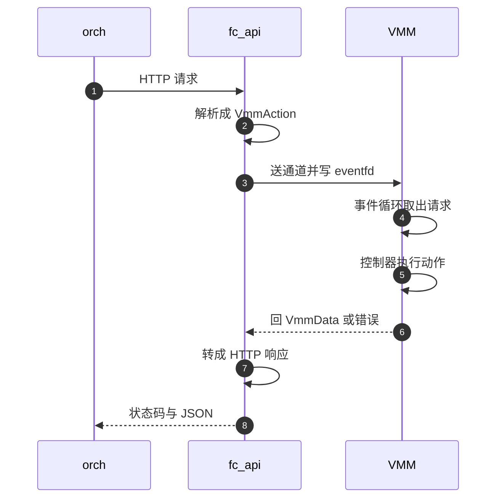

# 08 · API server：Unix socket 上的 HTTP 与请求解析

> Firecracker 的控制面是一个 Unix 域套接字上的 HTTP/1.1 子集。这一层做的事很少：
> 把请求翻译成一个 `VmmAction`，交给 VMM 线程，等一个结果，翻译回 HTTP。
> 它刻意不做的事更值得看 —— 不并发、不排队、不重试、不做业务判断。
> 本篇讲这层翻译怎么实现，以及「一次只处理一个请求」这个决定带来的后果。
>
> **读者**：系统工程师、写调用方的后端工程师。
> **预备**：[第 07 篇 · 进程启动](07-process-startup.md#5-两条路)。
> **代码**：`src/firecracker/src/api_server/mod.rs`、`src/firecracker/src/api_server/parsed_request.rs`、
> `src/firecracker/src/api_server/request/`、`src/firecracker/src/api_server_adapter.rs`、
> `src/firecracker/swagger/firecracker.yaml`

---

## 0. 本篇要回答的问题

1. 为什么 Firecracker 自带一个 HTTP 实现，而不是用现成的 HTTP 框架？这个子集小到什么程度？
2. 一个 HTTP 请求怎么变成一个 `VmmAction`？路由是怎么写的？
3. 请求在哪个线程上执行？API 调用的时延由什么决定？
4. 错误在哪几处产生，分别映射成什么 HTTP 状态码？
5. 调用方能依赖的契约是什么？

---

## 1. 问题：控制面需要 HTTP，但不需要一个 HTTP 框架

控制面要能被脚本、SDK 和编排进程调用，HTTP 是最省事的选择：有现成客户端、有 OpenAPI 工具链、
调试时一条 `curl` 就够。但把一个通用 HTTP 框架链接进 Firecracker 有三重代价。

第一重是依赖。通用框架带来几十个传递依赖，而 Firecracker 的攻击面控制建立在「能审计全部代码」上。
第二重是系统调用。VMM 的 seccomp 白名单必须覆盖进程实际用到的每个系统调用；
框架内部的线程池、定时器、DNS 解析都会把白名单撑大，而白名单每宽一格，逃逸后的可利用面就大一格。
第三重是内存。异步框架的缓冲策略难以给出确定上界，而一台 microVM 的宿主内存开销是要被计入售价的。

于是有了 `micro_http`（`micro_http` crate，由 firecracker-microvm 组织维护，
在 `src/firecracker/Cargo.toml` 与 `src/vmm/Cargo.toml` 中以 git 依赖引入）。
它小到可以逐条列出它的限制：

- 方法只有三个。`Method` 枚举只有 `Get`、`Put`、`Patch`；POST 与 DELETE 在解析阶段就不存在，
  发过去得到的是一个解析错误而不是 405。
- 单线程加 epoll。`HttpServer` 自己持有一个 epoll 实例，监听套接字与所有已接受连接都注册在上面，
  `requests()` 一次 `epoll_wait` 收一批请求。
- 并发连接上限写死为 10（`MAX_CONNECTIONS`），事件数组按 `MAX_CONNECTIONS + 2` 分配。
- 请求体有硬上限，默认 51200 字节，由 `ApiServer::run()` 用 `--http-api-max-payload-size`
  的值调用 `set_payload_max_size()` 覆盖。超限在解析头部时就返回 `SizeLimitExceeded`。
- 支持 `Expect: 100-continue`：有 body 且声明了 expect 时先排一个 100 响应再收 body。

这套限制对控制面是够用的：调用方是编排进程，请求是稀疏的，body 是几百字节的 JSON。
代价是这个 HTTP 实现不能拿去做别的事 —— 它不支持分块编码、不支持 keep-alive 之外的连接语义、
不支持超过十个并发调用方。

---

## 2. API 线程的循环

`fc_api` 线程的全部逻辑在 `ApiServer::run()`（`src/firecracker/src/api_server/mod.rs`）里。
它按顺序做四件事。

先设 payload 上限，再装 seccomp 过滤器。装载失败直接 `panic!`，消息里提示「要跳过过滤就用 `--no-seccomp`」 ——
这是一个刻意的选择：宁可进程起不来，也不要在操作员以为有防护时其实没有。
然后 `start_server()` 把监听套接字注册进 epoll，随后调用 `ProcessTimeReporter`
把 `--start-time-us` 等参数换算成启动耗时指标。

之后是一个无限循环。每轮调用 `server.requests()`，它返回一批 `ServerRequest`。
返回 `ServerError::ShutdownEvent` 意味着 kill switch 被写了，此时 `flush_outgoing_writes()`
把还没发完的响应写出去，然后线程返回；其它错误只记一条日志，循环继续 —— 单个连接出问题不该拖垮控制面。

对批次里的每个请求，先取一个单调时钟时间戳，再调用 `server_request.process(|request| ...)`，
闭包就是 `ApiServer::handle_request()`。`process()` 的作用是把闭包的返回值包成带请求编号的
`ServerResponse`，使得响应能对上连接。最后 `server.respond(response)`，并把这次调用的总耗时写进 debug 日志。

这里没有的东西同样值得点出：没有鉴权、没有 TLS、没有速率限制、没有请求日志轮转。
控制面的访问控制完全落在文件系统上 —— 谁能打开那个 Unix 域套接字，谁就能完全控制这台 microVM，
包括读写它的内存快照。在生产部署里这层保护由 jailer 提供：套接字建在每个实例独立的 chroot 里，
属主是该实例的 uid（[第 43 篇 · jailer](43-jailer.md)）。
把这个决定写清楚很重要，因为它意味着**把 API 套接字暴露到进程边界之外等于交出整台 microVM**。

---

## 3. 路由：一个三元组的 match

`handle_request()` 的第一步是 `ParsedRequest::try_from(request)`。
这个 `TryFrom` 实现（`parsed_request.rs`）就是 Firecracker 的全部路由逻辑，没有路由表、没有正则。

它先把 URI 的绝对路径去掉开头的 `/` 再按 `/` 切成迭代器 `path_tokens`，取出第一段作为 `path`，
然后对 `(method, path, body)` 这个三元组做一次 `match`。需要第二段路径的端点
（`/balloon/statistics`、`/drives/{id}`、`/snapshot/create`）在分支体内再调一次 `path_tokens.next()`
把它作为参数传给解析函数。因此「第二段路径」的合法性由各个解析函数自己负责，
比如 `parse_put_snapshot()` 只认 `create` 与 `load`，别的返回 `InvalidPathMethod`。

三元组里带上 body 的存在与否，是为了把两类错误分开：
`(Method::Get, _, Some(_))` 这条分支捕获「GET 带了 body」，
`(Method::Put, _, None)` 与 `(Method::Patch, _, None)` 捕获「空的 PUT / PATCH」，
它们都走 `method_to_error()`，给出一条说明性的错误消息。
所有三元组都不匹配时落到最后一条 `(method, unknown_uri, _)`，产生 `InvalidPathMethod`。

下表是 v1.12.1 的全部端点。第三列的动作在[第 09 篇 · rpc_interface](09-rpc-interface.md)展开。

| 方法与路径 | 解析函数 | 产生的 `VmmAction` |
|---|---|---|
| `GET /` | `parse_get_instance_info` | `GetVmInstanceInfo` |
| `GET /version` | `parse_get_version` | `GetVmmVersion` |
| `GET /vm/config` | 内联 | `GetFullVmConfig` |
| `GET /machine-config` | `parse_get_machine_config` | `GetVmMachineConfig` |
| `GET /balloon`、`GET /balloon/statistics` | `parse_get_balloon` | `GetBalloonConfig`、`GetBalloonStats` |
| `GET /mmds` | `parse_get_mmds` | `GetMMDS` |
| `PUT /actions` | `parse_put_actions` | `StartMicroVm`、`FlushMetrics`、`SendCtrlAltDel` |
| `PUT /boot-source` | `parse_put_boot_source` | `ConfigureBootSource` |
| `PUT /drives/{id}` | `parse_put_drive` | `InsertBlockDevice` |
| `PUT /network-interfaces/{id}` | `parse_put_net` | `InsertNetworkDevice` |
| `PUT /vsock`、`PUT /entropy`、`PUT /balloon` | 各自的 `parse_put_*` | `SetVsockDevice`、`SetEntropyDevice`、`SetBalloonDevice` |
| `PUT /machine-config`、`PUT /cpu-config` | `parse_put_machine_config`、`parse_put_cpu_config` | `UpdateMachineConfiguration`、`PutCpuConfiguration` |
| `PUT /logger`、`PUT /metrics` | `parse_put_logger`、`parse_put_metrics` | `ConfigureLogger`、`ConfigureMetrics` |
| `PUT /mmds`、`PUT /mmds/config` | `parse_put_mmds` | `PutMMDS`、`SetMmdsConfiguration` |
| `PUT /snapshot/create`、`PUT /snapshot/load` | `parse_put_snapshot` | `CreateSnapshot`、`LoadSnapshot` |
| `PATCH /vm` | `parse_patch_vm_state` | `Pause`、`Resume` |
| `PATCH /drives/{id}`、`PATCH /network-interfaces/{id}` | `parse_patch_drive`、`parse_patch_net` | `UpdateBlockDevice`、`UpdateNetworkInterface` |
| `PATCH /machine-config` | `parse_patch_machine_config` | `UpdateMachineConfiguration` |
| `PATCH /balloon`、`PATCH /balloon/statistics` | `parse_patch_balloon` | `UpdateBalloon`、`UpdateBalloonStatistics` |
| `PATCH /mmds` | `parse_patch_mmds` | `PatchMMDS` |

### 3.1 解析函数只做三件事

`request/` 目录下每个文件对应一组端点，函数体的形状高度一致：累加一个指标、
用 serde 把 body 反序列化成对应的配置结构、包进 `ParsedRequest::new_sync(VmmAction::…)`。
只有三类额外工作。

**校验路径与 body 的一致性。** `parse_put_drive()` 在 `checked_id()` 确认 id 只含字母数字与下划线后，
还要比对路径里的 id 与 body 里的 `drive_id`，不一致返回 400 并给出明确消息。

**处理架构差异。** `parse_put_actions()` 在 aarch64 上对 `SendCtrlAltDel` 直接返回 400，
因为那个动作依赖 x86_64 的 i8042 设备。这是路由层少见的架构条件编译。

**标记弃用。** `ParsingInfo` 是 `ParsedRequest` 上的一个小结构，只有一个可选字符串。
三处会往里写：`PUT /vsock` 的 `vsock_id` 字段、`PUT /mmds/config` 的 V1 版本、
`PUT /snapshot/load` 的 `mem_file_path` 字段。写入时同时累加 `deprecated_http_api_calls` 指标。
`handle_request()` 拿到消息后写一条 warn 日志，并调用 `response.set_deprecation()`，
在响应里加一个 `Deprecation: true` 头。调用方因此有两条独立渠道发现自己在用旧字段。

失败路径上也会累加指标：几乎每个解析函数的 serde 错误分支都 `inc()` 一个 `*_fails` 计数器，
所以「某个端点的请求格式错了多少次」可以直接从 metrics 里读，不必翻日志。

---

## 4. 同步语义

解析成功后得到 `RequestAction::Sync(Box<VmmAction>)`。`RequestAction` 只有 `Sync` 这一个变体，
`handle_request()` 里对它的 `match` 因此只有一条分支 —— 这个枚举的存在本身说明结构上为别的执行方式留了位置，
但在 v1.12.1 里所有动作都是同步的。`serve_vmm_action_request()` 的实现只有几行：

```rust
self.api_request_sender.send(vmm_action).expect("Failed to send VMM message");
self.to_vmm_fd.write(1).expect("Cannot update send VMM fd");
let vmm_outcome = *(self.vmm_response_receiver.recv().expect("VMM disconnected"));
let response = ParsedRequest::convert_to_response(&vmm_outcome);
```

动作经 mpsc 通道送出，写一次 eventfd 唤醒 VMM 线程，然后在 `recv()` 上**阻塞**等结果。
下图是完整一轮，`orch` 是调用方，`fc_api` 是 API 线程，`VMM` 是 VMM 线程。



这个结构有几个直接后果，写调用方的人需要知道。

**API 调用的时延就是 VMM 动作的时延。** 网络栈几乎不耗时，等待全花在 VMM 线程执行动作上。
创建一个几 GiB 内存的全量快照要多久，`PUT /snapshot/create` 就要多久。
`serve_vmm_action_request()` 为此对四类动作单独记时延指标：全量快照、差分快照、加载快照、pause 与 resume，
成功时还写一条 `'create full snapshot' API request took N us.` 的 info 日志。

**请求严格串行。** API 线程在 `recv()` 上阻塞，这一轮没结束就不会去读下一个请求，
哪怕它们来自不同连接。调用方并发发两个请求得到的是排队，不是并行。
好处是 VMM 侧完全不需要考虑并发控制：`RuntimeApiController` 拿到的永远是一个动作。

**动作可能长期不返回。** `recv()` 没有超时。如果 VMM 线程卡在某个动作里，对应的 HTTP 调用就一直挂着。
`Pause` 尤其特殊：VMM 线程处理完 `Pause` 后不返回事件管理器，而是转入一个只收 API 请求的阻塞循环
（`api_server_adapter.rs` 的 `ApiServerAdapter::process()`），直到收到 `Resume`。
此时 API 仍然可用，但设备模拟与 metrics 定时刷写一并冻结，细节见
[第 09 篇 §6](09-rpc-interface.md#6-三个状态与两处-paused)。

**通道断开等于进程完蛋。** 四处 `expect` 说明这一点：送不出去、写不了 eventfd、
VMM 端断开、响应通道关闭，任何一个都直接 panic。对端消失意味着 VMM 线程已经没了，
此时 API 线程也没有继续存在的意义。

---

## 5. 状态码从哪里来

一次调用可能在三个地方失败，映射规则各不相同。

**micro_http 内部。** 请求还没成形时的失败由 `ClientConnection::read()` 直接排响应：
解析错误（畸形请求行、超出 payload 上限）给 400，读套接字失败给 500。
这两类响应不经过 Firecracker 的任何代码。

**解析阶段。** `RequestError` 有五个变体，`From<RequestError> for Response` 的映射是：
`Generic(status, msg)` 用它自带的状态码，其余四个（`EmptyID`、`InvalidID`、`InvalidPathMethod`、`SerdeJson`）
一律 400。而 `Generic` 在代码里被构造时用的也全是 `StatusCode::BadRequest`。
换句话说，**解析阶段只会产生 400**；路径不存在也是 400，不是 404；方法不对也是 400，不是 405。
响应体是 `{"fault_message": "..."}`。

**执行阶段。** `ParsedRequest::convert_to_response()` 处理 VMM 的返回值。
成功且数据为 `VmmData::Empty` 时给 204 No Content，其余七个 `VmmData` 变体都序列化成 JSON 给 200。
失败时只有一个特例：`VmmActionError::MmdsLimitExceeded` 给 413 Payload Too Large，
其余一律 400，体同样是 `fault_message`。

所以从调用方角度看，Firecracker 的状态码集合是 `{200, 204, 400, 413}`，
再加上 micro_http 可能产生的 `{100, 500}`。**400 承载了绝大部分语义**，
区分「路径写错了」和「当前状态不允许这个动作」只能靠读 `fault_message`。
代价是调用方无法按状态码分类重试，收益是服务端不必维护一套错误到状态码的映射表。

---

## 6. 契约：swagger 文件

`src/firecracker/swagger/firecracker.yaml` 是这套 API 的 OpenAPI 2.0 描述，
逐个端点写了路径、方法、请求体 schema、响应码与字段说明。它不参与编译，
代码里没有任何地方读它，因此它与实现的一致性靠评审与集成测试保证，不靠类型系统。

对调用方它仍是唯一可用的契约：e2b infra 从这份文件生成 Go 客户端，
生成物在 `packages/shared/pkg/fc/` 下。由此得到一条实践上的规则 ——
给 Firecracker 加端点时，只改 `parsed_request.rs` 和 `request/` 而不改 swagger，
调用方就拿不到生成的客户端方法，只能手写 HTTP 调用。

---

## 7. 后续各层的差异

e2b 定制版在路由的 `match` 里加了一条 `GET /memory` 分支，按第二段路径分出
`/memory/mappings`、`/memory/dirty` 与 `/memory` 三个端点，解析函数放在新文件
`src/firecracker/src/api_server/request/memory.rs`，并在 `convert_to_response()` 里
为三个新的 `VmmData` 变体加了序列化分支。这三个端点见
[第 50 篇](50-memory-mappings-api.md)、[第 51 篇](51-memory-resident-empty-api.md)、
[第 52 篇](52-memory-dirty-api.md)。它同时把 `CreateSnapshotParams::mem_file_path`
改成了可选字段（[第 54 篇](54-optional-memfile-snapshot.md)）。

ARM 适配版在 `parse_put_snapshot()` 里加了 `rollback` 与 `save-dirty-bitmap` 两个子路径，
见[第 68 篇](68-save-dirty-bitmap-api.md)与[第 69 篇](69-rollback-api-and-phases.md)。
两层改动都沿用了上游的形状：一个分支、一个解析函数、一个 `VmmAction` 变体。

---

## 8. 小结

- Firecracker 自带 HTTP 实现，是为了把依赖数量、seccomp 白名单宽度与内存占用压到可审计的规模；
  代价是这个实现只支持 GET / PUT / PATCH、单线程 epoll、十个并发连接与一个硬性 body 上限。
- 路由是对 `(方法, 第一段路径, body 是否存在)` 三元组的一次 `match`；
  第二段路径由各解析函数自行校验，因此「子路径非法」的错误消息风格不完全统一。
- 每个解析函数只做三件事：累加指标、serde 反序列化、包成 `VmmAction`；
  额外工作只有三类 —— 路径与 body 的 id 一致性、架构差异、弃用标记。
- 弃用通过两条渠道通知：warn 日志加响应头 `Deprecation: true`，同时累加一个专门的指标。
- 所有动作同步执行：送通道、写 eventfd、阻塞等结果。API 调用的时延等于 VMM 动作的时延，
  请求严格串行，没有超时，通道断开即 panic。
- 串行带来的收益是 VMM 侧无并发，控制器可以写成简单的状态判断；
  代价是一个慢动作会堵住整个控制面。
- 状态码集合很窄：成功是 200 或 204，失败几乎都是 400，只有 MMDS 超限是 413；
  路径不存在与方法不支持都表现为 400，调用方必须读 `fault_message` 才能区分原因。
- swagger 文件是唯一的对外契约，但不参与编译；加端点时不同步更新它，调用方的生成客户端就看不到新端点。

---

## 延伸阅读 / 下一篇

- [第 07 篇 · 进程启动](07-process-startup.md)：`fc_api` 线程是怎么起来的，套接字在哪里绑定。
- [第 09 篇 · rpc_interface](09-rpc-interface.md)：`VmmAction` 送到 VMM 线程之后由谁执行。
- [第 12 篇 · Vmm、事件循环与退出路径](12-vmm-event-loop-and-exit.md)：API 事件在事件管理器里的位置。
- [第 32 篇 · MMDS](32-mmds.md)：MMDS 自己那个 HTTP 服务与本篇这个的区别。
- [第 44 篇 · 日志与 metrics](44-logging-and-metrics.md)：本篇提到的各类 API 指标。
- [第 76 篇 · API 总表](76-api-reference.md)：三层合并后的端点全表。
- 下一篇：[第 09 篇 · rpc_interface：Preboot 与 Runtime 两个控制器](09-rpc-interface.md)。
