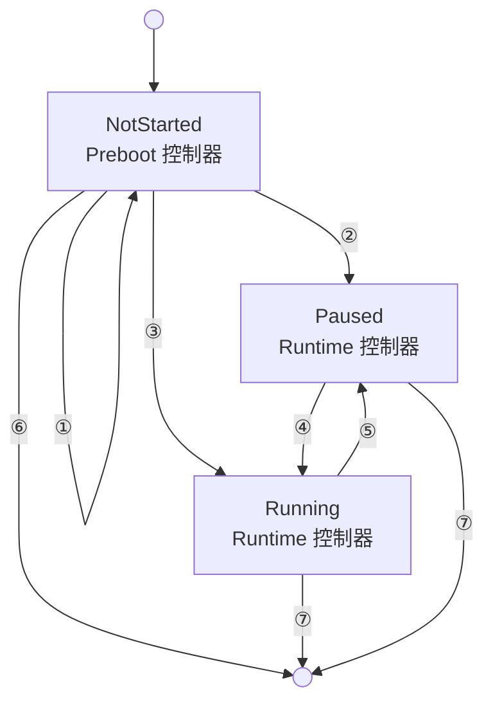
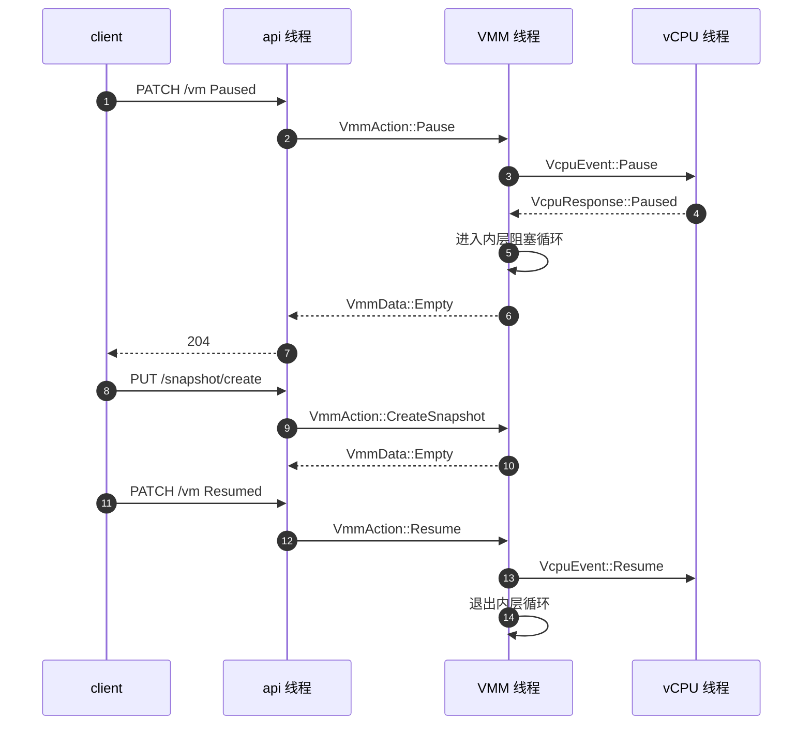

# 09 · rpc_interface：Preboot 与 Runtime 两个控制器

> HTTP 请求解析完之后，剩下的事情不再是「解析」而是「决定」：这个动作现在允许吗？它该改配置还是该碰
> 一台正在跑的 microVM？`rpc_interface.rs` 是这个决定的唯一落点，它把 microVM 的一生切成两段，
> 每段配一个控制器，两者对同一个动作集合给出不同的答案。
>
> **读者**：系统工程师。
> **预备**：[第 07 篇 · 进程启动](07-process-startup.md)、[第 08 篇 · API server](08-api-server.md)。
> **代码**：`src/vmm/src/rpc_interface.rs`、`src/vmm/src/vmm_config/instance_info.rs`、
> `src/firecracker/src/api_server_adapter.rs`、`src/vmm/src/lib.rs`

---

## 0. 本篇要回答的问题

1. 为什么 HTTP 层与 `Vmm` 之间要隔一层 `VmmAction`，而不是让请求解析器直接调用 `Vmm` 的方法？
2. 同一个动作在启动前与启动后为什么要由两个不同的对象处理，切换发生在哪一刻、由什么触发？
3. `boot_path` 这个布尔字段拦住的是什么，为什么配置过一块磁盘之后就不能再加载快照？
4. microVM 的三个状态分别由谁写入？「Paused」在 Firecracker 里其实是两件事，它们各自意味着什么？
5. `CreateSnapshot` 要求 VM 处于 Paused，这个前提在代码里由哪一行强制？

---

## 1. 问题：控制面需要一个收口

一台 microVM 的外部控制入口是一个 Unix socket 上的 HTTP API。请求到达时，进程里可能什么都还没有 ——
没有 KVM fd、没有 guest 内存、没有设备、没有 vCPU 线程；也可能一切都已经建好并且在跑。
这两种情形下，同一个 `PUT /drives/rootfs` 的含义完全不同：前者是往一份待建的配置里写一条记录，
后者要么无意义，要么会破坏一台运行中的机器。

如果让 HTTP 层直接调用 `Vmm` 的方法，这个判断就会散落到每个端点的解析函数里，
而且解析函数跑在 API 线程上、`Vmm` 活在 VMM 线程上，直接调用还要自己处理跨线程同步。
Firecracker 的做法是在中间放一个纯数据的动作枚举 `VmmAction`：API 线程只负责把 HTTP 请求翻译成
一个 `VmmAction` 值，通过 `mpsc` 通道送到 VMM 线程；VMM 线程上有一个控制器，
它是唯一知道「现在是哪个阶段、这个动作允许不允许、该改谁」的地方
（`src/firecracker/src/api_server_adapter.rs` 与 `src/vmm/src/rpc_interface.rs`）。

收益是判断集中在一个文件里，可以一眼读完；`VmmAction` 与 `VmmData`、`VmmActionError` 三个枚举
构成了 VMM 的全部对外语义，`--no-api` 的单进程路径与 HTTP 路径共用它们。
代价是每加一个端点要同时改四处：请求解析、动作枚举、两个控制器的匹配分支、响应枚举；
Rust 的穷尽匹配会强制这一点 —— 在任一控制器里漏掉一个新变体，代码编译不过。

---

## 2. VmmAction：动作的全集

`VmmAction` 的变体可以按用途分成四类。下表按类别列出，不逐条展开参数结构
（参数结构属于[第 10 篇 · 资源模型](10-vm-resources-and-config.md)）。

| 类别 | 变体 | 允许的阶段 |
|---|---|---|
| 配置 | `ConfigureBootSource`、`InsertBlockDevice`、`InsertNetworkDevice`、`SetVsockDevice`、`SetBalloonDevice`、`SetEntropyDevice`、`SetMmdsConfiguration`、`UpdateMachineConfiguration`、`PutCpuConfiguration`、`ConfigureLogger`、`ConfigureMetrics` | 仅 Preboot |
| 生命周期 | `StartMicroVm`、`LoadSnapshot` | 仅 Preboot |
| 生命周期 | `Pause`、`Resume`、`CreateSnapshot`、`SendCtrlAltDel`（x86_64） | 仅 Runtime |
| 运行时更新 | `UpdateBlockDevice`、`UpdateNetworkInterface`、`UpdateBalloon`、`UpdateBalloonStatistics`、`FlushMetrics` | 仅 Runtime |
| 查询 | `GetVmInstanceInfo`、`GetVmmVersion`、`GetVmMachineConfig`、`GetFullVmConfig`、`GetBalloonConfig` | 两个阶段都可以 |
| 查询 | `GetBalloonStats` | 仅 Runtime |
| MMDS | `GetMMDS`、`PutMMDS`、`PatchMMDS` | 两个阶段都可以 |

MMDS 的三个动作是唯一在两个控制器里走同一份实现的：`rpc_interface.rs` 定义了一个私有 trait
`MmdsRequestHandler`，只要求实现者给出 `mmds()` 返回数据存储的锁守卫，
`get_mmds()` / `put_mmds()` / `patch_mmds()` 由 trait 提供默认实现，两个控制器各实现一次 `mmds()`。
两者都转调 `VmResources::locked_mmds_or_default()`，也就是说 MMDS 数据在启动前后是同一份，
不随控制器切换而重建。

`GetBalloonConfig` 的两份实现不同：Preboot 版读 `VmResources` 里的配置，
Runtime 版调 `Vmm::balloon_config()` 从设备对象里读回来。这是「配置」与「状态」的分野，
第 3、4 节展开。

---

## 3. PrebootApiController：把请求累积成一份配置

### 3.1 它持有什么

`PrebootApiController` 的字段是四个借用加三个自有状态：`seccomp_filters`（建机时要装进 vCPU 线程）、
`instance_info`（**按值持有的一份克隆**）、`vm_resources`（可变借用，所有配置类动作都写它）、
`event_manager`（建机时要把设备注册进去）；自有状态是 `built_vmm`、`boot_path`、`fatal_error`。

`instance_info` 是克隆这件事有一个可观察的后果：Preboot 阶段的 `GetVmInstanceInfo`
返回的是控制器自己那一份，它的 `state` 字段永远是 `NotStarted`。启动之后查到的才是
`Vmm` 内部那一份（`RuntimeApiController` 调 `Vmm::instance_info()`）。
两份数据不会互相同步，因为切换控制器之后 Preboot 那一份连同控制器一起被丢弃。

### 3.2 预启动循环

`PrebootApiController::build_microvm_from_requests()` 是 Preboot 阶段的主循环，
它不经过事件管理器，就是一个阻塞循环：`from_api.recv()` 收一个请求，
再读一次 `api_event_fd`（信号量语义的 eventfd，读它是为了把计数消掉，不读会在切换到事件循环后收到虚假通知），
调 `handle_preboot_request()`，把结果发回 API 线程，然后看 `built_vmm` 是否已经被填上。
循环条件就是 `while preboot_controller.built_vmm.is_none()`。

能填上 `built_vmm` 的只有两个动作：`StartMicroVm` 走 `build_and_boot_microvm()`
（[第 11 篇 · builder](11-builder.md)），`LoadSnapshot` 走 `restore_from_snapshot()`
（[第 38 篇 · 加载快照](38-snapshot-load.md)）。两个函数都返回 `Arc<Mutex<Vmm>>`，
赋给 `built_vmm` 之后循环退出，`vm_resources` 与这个 `Arc` 一起交给上层。

这个循环是阻塞的，意味着**在 microVM 建起来之前，VMM 线程不跑事件循环**。
没有 microVM 就没有设备、没有 vCPU，也就没有需要被服务的事件，代价只是这段时间里
metrics 的定时刷写不会发生（定时器订阅者已经注册，但要等到事件循环开始跑才生效）。

### 3.3 `boot_path`：两条建机路径的互斥

`boot_path` 是一个只会从 `false` 变成 `true` 的标志。凡是「为冷启动做配置」的动作都会置上它：
`set_boot_source`、`insert_block_device`、`insert_net_device`、`set_balloon_device`、
`set_vsock_device`、`set_mmds_config`、`set_entropy_device`、`update_machine_config`。
`load_snapshot()` 开头检查它，为真就返回 `LoadSnapshotError::LoadSnapshotNotAllowed`。

理由是两条路径对 `VmResources` 的用法互斥。冷启动路径把 `VmResources` 当作设备清单，
builder 按清单一件件造；快照恢复路径的设备清单来自快照文件里的 `MicrovmState`，
`VmResources` 只提供内存大小、vCPU 数这类无法从设备状态推出来的信息，
其余字段会被快照里的值覆盖。两边的配置混在一起时，哪一份生效没有定义，
于是直接禁止 —— 先配过任何启动资源就不能再加载快照。

值得注意的是 `PutCpuConfiguration`（自定义 CPU 模板）**没有**置 `boot_path`。
`set_custom_cpu_template()` 只往 `VmResources` 里塞模板就返回。
推论：CPU 模板在恢复路径上也有用武之地，所以它不被当作「冷启动专属配置」。

### 3.4 `fatal_error`：哪些失败不能原地重试

多数 Preboot 动作失败之后，调用方可以改参数重来 —— 配置没被污染，进程还是干净的。
两种失败不行：快照恢复失败（`BuildMicrovmFromRequestsError::Restore`）与恢复后 resume 失败
（`Resume`）。`load_snapshot()` 用 `inspect_err` 在这两处把 `fatal_error` 置上，
预启动循环发现它不为 `None` 就直接返回 `Err`，进程随后带非零退出码结束。

代码注释给的理由是「进程已经脏到无法恢复」：恢复过程会注册内存区域、恢复 vCPU 状态、
重建设备，失败可能发生在其中任意一步之后，此时进程里既没有一台完好的 microVM，
也不再是一张白纸。相比之下，让调用方换一个新进程重试是确定的。

---

## 4. RuntimeApiController：对一台在跑的 microVM 下命令

`RuntimeApiController` 只有两个字段：`vmm: Arc<Mutex<Vmm>>` 与 `vm_resources: VmResources`
（从 Preboot 控制器手里接过来的那一份，按值持有）。它的 `handle_request()` 与 Preboot 版对称：
允许的动作各自派发，不允许的一整串用 `|` 并在一起返回 `OperationNotSupportedPostBoot`。

三个细节值得指出。

**锁的粒度是一次动作。** 每个需要碰 `Vmm` 的分支自己写 `self.vmm.lock()`，
在该分支结束时释放。锁的另一个持有者是 VMM 线程的事件循环 —— `Vmm` 本身是事件管理器的订阅者
（[第 12 篇 · 事件循环与退出路径](12-vmm-event-loop-and-exit.md)）。但这两者其实在同一个线程上：
API 动作是被事件循环回调进来的。所以这把锁在正常路径上从不竞争，它存在是因为
`Arc<Mutex<Vmm>>` 还要被 gdb 线程与 `main` 的退出检查共享。代码里一律写
`.lock().expect("Poisoned lock")`：持锁线程 panic 之后没有恢复方案，直接再 panic。

**`vm_resources` 在运行期仍然是权威的配置视图。** `GetVmMachineConfig`、`GetFullVmConfig`
读的都是它而不是 `Vmm`。快照恢复路径会在恢复过程中把快照里的值写回 `VmResources`
（`build_microvm_from_snapshot()` 里恢复 `boot_source.config`），以保持这个视图不撒谎。
`GetFullVmConfig` 在 Preboot 版里还带一句 `warn!`：从快照恢复的 VM，
boot-source 与 `machine-config` 的 `smt`、`cpu_template` 会是空的。

**运行时更新是逐设备的。** `update_block_device()` 里有一段分派：
新配置既没有 `path_on_host` 也没有 `rate_limiter` 时，当作 vhost-user 块设备的配置刷新处理；
否则按给出的字段分别更新路径与速率限制器。三个更新互不排斥，一次请求可以同时做两件事。

---

## 5. 切换只发生一次

控制器的更替不在 `rpc_interface.rs` 里，而在 `src/firecracker/src/api_server_adapter.rs`：
`run_with_api()` 先调预启动循环拿到 `(vm_resources, vmm)`，再把它们交给
`ApiServerAdapter::run_microvm()`，后者构造 `RuntimeApiController` 并把适配器注册成事件订阅者。
从这一刻起，API 请求不再由阻塞循环接收，而是由事件管理器在 `api_event_fd` 可读时回调。

| 编号 | 触发 | 说明 |
|---|---|---|
| ① | 配置类动作、查询、MMDS | 只改 `VmResources`，控制器不变 |
| ② | `LoadSnapshot` 且 `resume_vm=false` | 恢复完成即停在 Paused |
| ③ | `StartMicroVm`，或 `LoadSnapshot` 且 `resume_vm=true` | `build_and_boot_microvm()` 末尾调 `resume_vm()` |
| ④ | `Resume` | `RuntimeApiController::resume()` |
| ⑤ | `Pause` | `RuntimeApiController::pause()` |
| ⑥ | 预启动阶段的致命错误 | 进程带非零退出码结束 |
| ⑦ | vCPU 退出、信号、guest 关机 | 见[第 12 篇](12-vmm-event-loop-and-exit.md) |

切换是单向且一次性的：`RuntimeApiController` 没有回到 Preboot 的路径，
`VmmAction` 里也没有「销毁 microVM」这样的动作。一台 microVM 的生命与它的进程等长，
要换一台就换一个进程。这是 Firecracker 「一个进程一台 microVM」的取舍在控制面上的体现：
控制器没有状态回退，代码里不必处理「拆到一半」的中间形态。

---

## 6. 三个状态与两处 Paused

`VmState` 定义在 `src/vmm/src/vmm_config/instance_info.rs`，只有 `NotStarted`、`Paused`、`Running`
三个值，存在 `InstanceInfo` 里，随 `GET /` 返回给调用方。写它的只有 `src/vmm/src/lib.rs` 里的三处：
`start_vcpus()` 末尾置 `Paused`，`resume_vm()` 末尾置 `Running`，`pause_vm()` 末尾置 `Paused`。
控制器自己从不直接写这个字段。

这里有一个容易看漏的结构：**vCPU 线程一旦建起来就先停在 Paused**。
`build_microvm_for_boot()` 的文档注释写得很明确 —— 造出来的 microVM 与全部 vCPU 都处于 paused，
要跑起来必须再调 `Vmm::resume_vm()`。冷启动之所以看起来是「一步到位」，
是因为 `build_and_boot_microvm()` 在 `build_microvm_for_boot()` 之后替调用方补了这一次 resume。
快照恢复路径不补，`LoadSnapshot` 的请求体里有一个 `resume_vm` 字段决定补不补。

而「Paused」在运行期还有第二层含义，它不在 `Vmm` 里，在 API 适配器里。
`ApiServerAdapter::process()` 处理完一个请求后，如果这个请求是 `Pause`，
它不返回事件循环，而是进入一个内层阻塞循环：`from_api.recv()` 收请求、处理、直到收到 `Resume` 才跳出。

代码注释解释了为什么要这样：不返回事件循环，设备模拟就**隐式地**一并暂停了。
vCPU 停下只保证 guest 不再产生新请求，已经在飞行中的 I/O 仍然由 VMM 线程的事件循环推进；
而快照要求整个 microVM 的状态是一个静止的截面，设备队列不能在导出过程中被改写。
代价写在同一段注释里：这个循环只处理 API 请求，metrics 的定时刷写等其它订阅者在暂停期间全部冻结。

---

## 7. Paused 前提由谁强制

`RuntimeApiController::create_snapshot()` 只做一项检查：
`SnapshotType::Diff` 且 `machine_config.track_dirty_pages` 为假时，返回
`VmmActionError::NotSupported`，消息是 Diff 快照不允许在关闭脏页跟踪的 microVM 上创建。
它**没有**检查 VM 是否处于 Paused。

强制来自更下一层。`create_snapshot()` 调 `Vmm::save_state()`，后者第一步是 `save_vcpu_states()`，
给每个 vCPU 发 `VcpuEvent::SaveState` 并等响应。`src/vmm/src/vstate/vcpu.rs` 的 running 状态处理函数
收到 `SaveState` 时回的是 `VcpuResponse::NotAllowed("save/restore unavailable while running")`，
`save_vcpu_states()` 把它翻成 `MicrovmStateError::NotAllowed`，一路冒泡成 HTTP 400。

这个安排的好处是前提只在一个地方成立：vCPU 状态机是唯一知道自己能不能被安全读取的对象，
控制器不必复制一份状态判断，也就不会出现两处判断不一致。
代价是错误信息从 vCPU 线程经过通道和两层错误类型才到达调用方，读日志时要多跳几层才能看懂。
`DumpCpuConfig` 走同一条路（[第 20 篇 · CPU 模板机制](20-cpu-templates.md)）。

---

## 8. 响应与错误

成功的响应是 `VmmData`：`Empty` 用于所有只做事不回数据的动作，其余变体各自对应一个查询
（`MachineConfiguration`、`FullVmConfig`、`InstanceInformation`、`VmmVersion`、
`BalloonConfig`、`BalloonStats`、`MmdsValue`）。
`VmmActionError` 的变体大多是 `#[from]` 包装的下层错误类型，加上四个自己的判定结果：
`OperationNotSupportedPostBoot`、`OperationNotSupportedPreBoot`、`NotSupported(String)`、
以及 MMDS 的 `MmdsLimitExceeded`。这四个之外的错误都来自更下层，
控制器只负责把它们装进信封。错误到 HTTP 状态码的映射在 API server 那一侧
（[第 08 篇](08-api-server.md)）。

`ApiRequest` 与 `ApiResponse` 都是 `Box` 包起来的：动作枚举里最大的变体带着完整的
`CustomCpuTemplate`，不装箱会让通道里每条消息都按最大变体的尺寸拷贝。

---

## 9. 后续各层的差异

e2b 定制版在 `src/vmm/src/rpc_interface.rs` 加了三个只在 Runtime 阶段可用的查询动作
——`GetMemoryMappings`、`GetMemory`、`GetMemoryDirty`——以及一个新的错误变体
`OperationNotSupportedWhileRunning`，用于 `GetMemoryDirty` 对 Paused 状态的检查；
`InstanceInfo` 也多了一个 `memory_regions` 字段。见
[第 50 篇](50-memory-mappings-api.md)、[第 51 篇](51-memory-resident-empty-api.md)、
[第 52 篇](52-memory-dirty-api.md)。

ARM 适配版的改动全部来自它的 checkpoint / restore 扩展，构建与运行那一段不碰这个文件。
扩展在同一文件加了 `RollbackSnapshot` 与 `SaveDirtyBitmap` 两个 Runtime 动作，
给 `VmState` 加了第四个值 `Faulted`，并在 `create_snapshot()` 开头拒绝对 Faulted 的 VM 创建快照。
见[第 69 篇](69-rollback-api-and-phases.md)、[第 68 篇](68-save-dirty-bitmap-api.md)、
[第 73 篇](73-failure-model-faulted-and-seccomp.md)。

---

## 10. 小结

- `VmmAction` / `VmmData` / `VmmActionError` 三个枚举是 VMM 的全部对外语义；
  API 线程只做翻译，所有「允许不允许」的判断集中在 `rpc_interface.rs` 一个文件里。
- 两个控制器对应 microVM 的两个阶段：Preboot 改 `VmResources`，Runtime 操作 `Arc<Mutex<Vmm>>`；
  切换由 `built_vmm` 被填上触发，单向且只发生一次。
- `boot_path` 把冷启动配置与快照恢复互斥开来，因为两者对 `VmResources` 的用法不同；
  `PutCpuConfiguration` 不置这个标志。
- 快照恢复与恢复后 resume 的失败被标为致命：进程状态已经不可判定，让调用方换进程重试。
- Preboot 阶段是一个不经过事件管理器的阻塞循环；这期间没有设备也没有 vCPU，代价是定时任务不跑。
- `VmState` 只由 `start_vcpus()`、`pause_vm()`、`resume_vm()` 三处写入；
  vCPU 建起来先停在 Paused，冷启动路径由 `build_and_boot_microvm()` 补一次 resume。
- 运行期的 Paused 有第二层：API 适配器不返回事件循环，从而隐式冻结设备模拟，
  代价是 metrics 定时刷写等订阅者一并冻结。
- `CreateSnapshot` 只在控制器里检查 Diff 与 `track_dirty_pages` 的搭配；
  「必须 Paused」这个前提由 vCPU 状态机以 `NotAllowed` 响应强制。

---

## 延伸阅读 / 下一篇

- [第 08 篇 · API server](08-api-server.md)：HTTP 请求怎么变成 `VmmAction`，错误怎么变成状态码。
- [第 10 篇 · 资源模型：VmResources 与 vmm_config](10-vm-resources-and-config.md)：Preboot 动作写进去的那个对象。
- [第 15 篇 · vCPU 线程与状态机](15-vcpu-threads-and-state-machine.md)：`VcpuEvent` 与 `NotAllowed` 的来源。
- [第 37 篇 · 创建快照](37-snapshot-create.md)：`create_snapshot()` 之后发生的事。
- [e2b 手册第 37 篇](../e2b-infra/37-pause-and-snapshot.md)：调用方怎么按顺序使用 pause 与 snapshot 这两个动作。
- 下一篇：[第 10 篇 · 资源模型：VmResources 与 vmm_config](10-vm-resources-and-config.md)。
