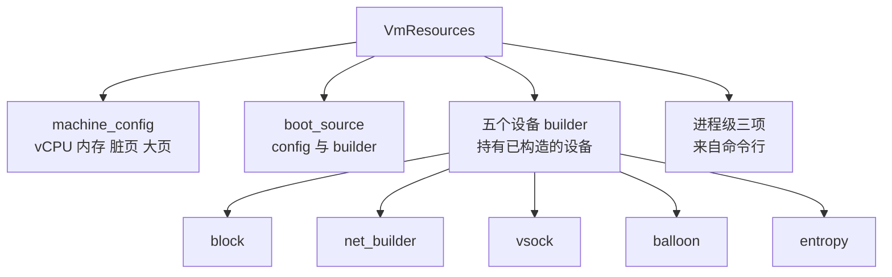

# 10 · 资源模型：VmResources 与 vmm_config

> 启动前的每一次 API 调用都落在同一个对象上：`VmResources`。它不是一份待解释的配置清单 ——
> 大部分设备在配置的那一刻就已经被造出来了，文件被打开、tap 被创建、速率限制器被建好。
> 本篇讲这个对象的结构、每个字段的校验规则，以及「配置」与「已构造的设备」之间那条并不清晰的界线。
>
> **读者**：系统工程师。
> **预备**：[第 09 篇 · rpc_interface](09-rpc-interface.md#3-prebootapicontroller把请求累积成一份配置)。
> **代码**：`src/vmm/src/resources.rs`、`src/vmm/src/vmm_config/`（`machine_config.rs`、
> `boot_source.rs`、`drive.rs`、`net.rs`、`vsock.rs`、`balloon.rs`、`entropy.rs`、`mmds.rs`、`mod.rs`）

---

## 0. 本篇要回答的问题

1. `VmResources` 里存的是配置还是设备对象？这个区别会在什么时候被观察到？
2. `PUT /machine-config` 与 `PATCH /machine-config` 在代码里走的是不是同一条路径？校验规则有哪些？
3. 哪些配置项之间存在相互约束，这些约束在哪一步被检查？
4. 同一个 `drive_id` 配置两次会发生什么？根设备为什么必须排在第一位？
5. `--config-file` 与逐个 API 调用两条路径的校验是不是同一套？

---

## 1. 问题：配置该在什么时候被校验

一台 microVM 的配置来自若干次独立的 API 调用，每次只给一个片段：一块磁盘、一张网卡、
内存大小。这些片段之间有约束 —— balloon 的目标大小不能超过内存大小，开了大页就不能用 balloon，
aarch64 上不能开 SMT。约束什么时候检查，决定了错误在哪里出现。

两个极端都不好。全部推迟到 `InstanceStart` 检查，调用方要等到最后一步才知道第二步写错了，
而那时进程已经做了不少工作；全部在每次调用时检查，则要求每个片段自身完整，
无法表达「先设内存再设 balloon」这种自然顺序。

Firecracker 的选择偏向前者：**能在单次调用内判定的，立刻判定**。
`BlockBuilder::insert()` 直接 `Block::new(config)`，路径打不开当场返回错误；
`NetBuilder::build()` 直接创建 `Net`，tap 设备打不开当场返回错误。
跨字段的约束则在写入者一侧双向检查：设 balloon 时比对当前内存大小，改内存大小时比对当前 balloon 配置。
代价是 `VmResources` 里装的不是纯数据，而是一堆活的对象，它的「配置」与「状态」两重身份从此纠缠在一起；
第 5、8 节会看到这带来的具体后果。

---

## 2. VmResources 的字段

`VmResources` 定义在 `src/vmm/src/resources.rs`，字段全部是公开的，由控制器直接写。



这四支的性质不同。机器级配置是纯数据，决定 guest 内存与 vCPU 怎么建。
设备 builder 持有的是 `Arc<Mutex<设备>>`，已经是可以工作的对象。
进程级那三项来自命令行而不是 API：`mmds_size_limit` 来自 `--mmds-size-limit`，
`boot_timer` 来自 `--boot-timer`，由 `build_microvm_from_requests()` 在构造控制器之前写入
（[第 07 篇 · 进程启动](07-process-startup.md)）。

`mmds` 是 `Option<Arc<Mutex<Mmds>>>`，注释说明了为什么按需初始化：不用就不占那块内存。
`mmds_or_default()` 与 `locked_mmds_or_default()` 是唯二的访问入口，它们负责在第一次访问时建好。

大纲曾把 `cpu_template` 列为 `VmResources` 的独立字段，代码里不是：它是
`machine_config.cpu_template`，类型是 `Option<CpuTemplateType>`，静态模板与自定义模板共用这一个槽。

---

## 3. MachineConfig：一条路径、两种语义

`PUT /machine-config` 与 `PATCH /machine-config` 最终都走
`VmResources::update_machine_config(&MachineConfigUpdate)`。差别在请求解析那一侧：
PATCH 的请求体直接反序列化成 `MachineConfigUpdate`（每个字段都是 `Option`，缺省即不改），
PUT 的请求体反序列化成 `MachineConfig`，再经 `From<MachineConfig> for MachineConfigUpdate`
把**每个字段都填成 `Some`**，于是变成一次全量替换。未给出的字段会取 `MachineConfig::default()`
的值：1 个 vCPU、128 MiB 内存、不开 SMT、不跟踪脏页、不用大页。

`MachineConfig::update()` 是唯一的校验点，它先算出合并后的值再逐条检查，
任何一条不过就整体失败，`self.machine_config` 不被修改。

| 检查 | 条件 | 错误 |
|---|---|---|
| SMT（仅 aarch64） | `smt` 为真即失败 | `SmtNotSupported` |
| vCPU 数量 | 为 0 或大于 `MAX_SUPPORTED_VCPUS`（32） | `InvalidVcpuCount` |
| vCPU 与 SMT 的搭配 | 开 SMT 且 vCPU 数大于 1 且为奇数 | `InvalidVcpuCount` |
| 内存大小 | 为 0；或开 2 MiB 大页时不是 2 的倍数 | `InvalidMemorySize` |

最后一条由 `HugePageConfig::is_valid_mem_size()` 实现：`None` 的除数是 1（任何以 MiB
表示的整数内存都是 4 KiB 的整数倍），`Hugetlbfs2M` 的除数是 2。

`update()` 返回之后，`VmResources::update_machine_config()` 还要再做两项跨对象检查：
新的内存大小不得小于已配置 balloon 的目标大小（`IncompatibleBalloonSize`），
以及已配置 balloon 时不得开启大页（`BalloonAndHugePages`）。
这两条与 `set_balloon_device()` 里的两条互为镜像 —— 后者检查 balloon 目标不超过当前内存
（`TooManyPagesRequested`）、当前未开大页（`BalloonConfigError::HugePages`）。
两个方向都堵上，配置顺序才不影响结果。

`cpu_template` 的处理有一处特别之处。`MachineConfigUpdate` 里这个字段的类型是
`Option<StaticCpuTemplate>`，也就是说经 `machine-config` 只能设静态模板；
自定义模板走 `PUT /cpu-config`，由 `set_custom_cpu_template()` 直接写进
`machine_config.cpu_template`。`update()` 的映射规则是：不给该字段则保留原值，
给 `StaticCpuTemplate::None` 则清成 `None`，给其它值则换成静态模板 —— 这意味着
**一次带 `cpu_template` 的 `machine-config` 调用会覆盖掉之前设的自定义模板**。
反方向则由序列化规避：`MachineConfig` 的 `cpu_template` 字段带
`skip_serializing_if = "is_none_or_custom_template"`，自定义模板不会出现在
`GET /machine-config` 的响应里。详见[第 20 篇 · CPU 模板机制](20-cpu-templates.md)。

`MachineConfigError` 里还有一个 `KernelVersion` 变体，全仓库没有构造它的地方。
推论：它是某次重构留下的残余，不会出现在任何响应中。

---

## 4. BootSource：配置与句柄各存一份

`BootSource` 有两个字段：`config: BootSourceConfig` 是用户给的三个字符串
（`kernel_image_path`、`initrd_path`、`boot_args`），`builder: Option<BootConfig>`
是校验后的结果 —— 已经打开的内核文件句柄、可选的 initrd 句柄、以及解析过的命令行。

`BootConfig::new()` 做三件事：打开内核文件、打开 initrd（如果有）、
把 `boot_args` 或常量 `DEFAULT_KERNEL_CMDLINE` 交给 `linux_loader` 的 `Cmdline::try_from()`
按 `arch::CMDLINE_MAX_SIZE` 校验长度。默认命令行的每一项在代码注释里都写了理由：
`reboot=k` 让 guest 重启变成关机，`pci=off`、`i8042.noaux` 等是为了省掉 guest 的探测时间。

`builder` 是 `Option` 的理由写在字段注释里：从快照恢复的 microVM 不需要它 ——
内核已经在 guest 内存里了，不必再打开一次内核文件。这也是[第 09 篇](09-rpc-interface.md)
里 `boot_path` 标志要拦住 `LoadSnapshot` 的原因之一。

---

## 5. 设备配置：builder 里已经是设备

五个设备 builder 的共同点是「配置即构造」，差别在能装几个。

**块设备**（`BlockBuilder`）是 `VecDeque<Arc<Mutex<Block>>>`，可以有多个。
`insert()` 的语义要展开说：它先按 `drive_id` 找现有位置，
再判断「新配置声明自己是根设备」与「已经存在根设备」的组合。
新配的根设备与已有根设备是同一个 id（即位置 0）时是更新，否则返回
`RootBlockDeviceAlreadyAdded`。id 不存在就新建：根设备 `push_front`，其它 `push_back`；
id 已存在就替换该槽位，若被替换的设备升级成了根设备，再把它 `swap` 到位置 0。

根设备必须排在队首这件事有注释：不这样做，从「用 PARTUUID 引导」切换到「用 `/dev/vda` 引导」
的场景会出问题 —— guest 看到的 virtio 设备顺序决定了 `/dev/vdX` 的字母，
把根设备固定在第一个，`/dev/vda` 才总是根。

**网卡**（`NetBuilder`）是 `Vec<Arc<Mutex<Net>>>`。`build()` 先查 MAC 冲突
（同一个 MAC 属于别的 `iface_id` 就报 `GuestMacAddressInUse`），再用 `swap_remove`
删掉同 id 的旧设备，然后 `create_net()` 造一个新的。注意 `swap_remove` 会打乱顺序：
更新一张网卡会把列表最后一张挪到它原来的位置。推论：网卡在 guest 里的枚举顺序
因此可能随一次更新而改变，代码里没有像块设备那样把顺序固定下来。

**vsock、balloon、entropy** 各自只有一个槽（`Option<...>`），再配一次就是覆盖。

`BlockDeviceConfig` 的字段分成三组，`serde` 层不区分，`Block::new()` 依次尝试两个 `TryFrom` 转换 —— 先试 virtio-block 的字段组合，不成立再试 vhost-user 的，都不成立返回 `BlockError::InvalidBlockConfig`：
`drive_id`、`is_root_device`、`partuuid`、`cache_type` 对两种后端都适用；
`path_on_host`、`is_read_only`、`rate_limiter`、`io_engine` 只对 virtio-block 有意义
（`io_engine` 在 `Sync` 与 `Async` 之间选，后者用 io_uring，见
[第 28 篇 · io_uring 引擎](28-io-uring-engine.md)）；`socket` 只对 vhost-user-block 有意义
（[第 29 篇](29-vhost-user-block.md)）。这几个字段在结构体里全是 `Option`，
哪些组合合法由设备构造函数判定，而不是由类型系统保证 —— 代价是配置错误的提示来自设备层，
收益是一个端点覆盖两种后端，swagger 契约里不必分裂成两个路径。

`create_net()` 同时把 `RateLimiterConfig` 转成活的 `RateLimiter` 对象
（`vmm_config/mod.rs` 的 `TokenBucketConfig` / `RateLimiterConfig`，详见
[第 35 篇 · 速率限制器](35-entropy-vmgenid-rate-limiter.md)）。块设备与 entropy 同理。

「配置即构造」的两个后果值得记住。其一，失败点前移：路径不存在、tap 打不开、
MAC 冲突这些错误在 `PUT` 请求的响应里就能看到，而不是拖到 `InstanceStart`。
其二，`VmResources` 与后来的设备管理器共享同一批 `Arc`：builder 交给
[第 11 篇 · builder](11-builder.md) 的不是配置，是设备本身，
所以运行期通过 `VmResources` 读回来的配置（`BlockBuilder::configs()`
调每个设备的 `config()`）反映的是设备的当前状态，不是当初写进去的那份文本。

---

## 6. MMDS：配置改的是网卡

`set_mmds_config()` 拆成两步。`set_mmds_network_stack_config()` 校验 IPv4 地址必须是
链路本地地址（`is_link_local_valid()`，不给就用 `MmdsNetworkStack::default_ipv4_addr()`）、
网卡 ID 列表非空、且每个 ID 都对应一张已配置的网卡；然后**遍历所有网卡**，
在列表里的调 `configure_mmds_network_stack()`，不在列表里的调 `disable_mmds_network_stack()`。
`set_mmds_version()` 再把版本与 AAD（取自实例 id）写进数据存储。

这里同样体现了「配置即构造」：MMDS 配置不是存在 `VmResources` 的某个字段里等着 builder 读，
它当场改写了网卡对象。所以 `VmResources` 没有 `mmds_config` 字段，
需要回答 `GET /mmds/config` 这类查询时靠私有方法 `mmds_config()` **反向重建** ——
遍历网卡，挑出带 MMDS 网络栈的，从它们身上读回版本、ID 列表与 IPv4 地址。
数据存储未初始化就直接返回 `None`，因为那说明用户从没配过 MMDS。

---

## 7. `--config-file` 与 API 共用同一套校验

`VmResources::from_json()` 把一个 JSON 文档反序列化成 `VmmConfig`，
再逐项调用与 API 路径完全相同的那些方法：`update_machine_config()`、
`set_custom_cpu_template()`、`build_boot_source()`、`set_block_device()`、
`build_net_device()`、`set_vsock_device()`、`set_balloon_device()`、
`set_mmds_config()`、`build_entropy_device()`。没有第二套校验逻辑。

顺序是写死的，而且这个顺序有意义：`machine_config` 在 `balloon` 之前
（否则 balloon 的大小要拿默认的 128 MiB 去比），`network_interfaces` 在 `mmds_config` 之前
（否则网卡 ID 校验必然失败），metadata 文件在 `mmds_config` 之前（先填数据再设版本）。

```text
{
  "boot-source":        { kernel_image_path, initrd_path, boot_args }
  "drives":             [ { drive_id, path_on_host, is_root_device, ... } ]
  "machine-config":     { vcpu_count, mem_size_mib, smt, track_dirty_pages, huge_pages }
  "cpu-config":         "<自定义模板 JSON 文件路径>"
  "network-interfaces": [ { iface_id, host_dev_name, guest_mac, ... } ]
  "vsock":              { guest_cid, uds_path }
  "balloon":            { amount_mib, deflate_on_oom, stats_polling_interval_s }
  "mmds-config":        { version, network_interfaces, ipv4_address }
  "entropy":            { rate_limiter }
  "logger" / "metrics": 进程级，from_json 一开始就处理
}
```

`VmmConfig` 用 `#[serde(rename_all = "kebab-case")]`，字段名与 API 路径对应；
`logger` 与 `metrics` 在函数最开头处理，因为后续步骤的日志要能被记下来。
几乎所有配置结构都带 `#[serde(deny_unknown_fields)]`：多写一个字段是错误而不是被忽略。

`cpu_config` 字段是一个**文件路径**而不是内联的模板内容，`from_json()` 读这个文件再解析。

---

## 8. 配置的读回与快照恢复

`GET /vm/config` 返回的 `VmmConfig` 由 `impl From<&VmResources> for VmmConfig` 生成，
它把每个 builder 的当前内容转回配置结构。三个字段被硬编码成 `None`：
`cpu_config`、`logger`、`metrics` —— 前者因为自定义模板不做回显，后两者是进程级设置，
不属于这台 microVM 的配置。

处理这个动作时，`PrebootApiController::handle_preboot_request()` 会先打一条 warn，
说「若这台 microVM 是从快照恢复的，boot-source、machine-config.smt 与
machine-config.cpu_template 都会是空的」。对着恢复路径的代码看，这句话比实际情况宽：
`build_microvm_from_snapshot()`（`src/vmm/src/persist.rs`）拿 `microvm_state.vm_info`
调了一次 `update_machine_config()`，`smt`、`mem_size_mib`、`huge_pages`、`cpu_template`
都填了回去，只有 `boot_source.config` 没有写回 —— 快照里存了它，恢复路径没有用它。
真正会失真的是 CPU 模板，而 warn 没有提：`VmInfo::cpu_template` 的类型是
`StaticCpuTemplate`，`From<&Option<CpuTemplateType>>` 把 `CpuTemplateType::Custom`
映射成 `StaticCpuTemplate::None`（`src/vmm/src/cpu_config/templates.rs`），
于是快照走一趟回来，自定义模板变成了「没有模板」。
另外这条 warn 只在预启动控制器里；恢复完成后控制器已经切成 `RuntimeApiController`
（[第 09 篇 §5](09-rpc-interface.md#5-切换只发生一次)），它处理同一个动作时不打日志，
所以真正从快照恢复的实例反而看不到这句提示。

快照恢复路径需要反方向填充：设备是从快照里重建的，但 `VmResources` 仍然要持有它们的引用，
否则运行期的查询与更新找不到设备。`update_from_restored_device()` 承担这件事，
输入是一个 `SharedDeviceType` 枚举，按类型分别塞进对应的 builder
（[第 40 篇 · 设备状态的 Persist](40-device-persist.md)）。
其中 balloon 那一支多一道检查：恢复出 balloon 设备而当前配置开着大页，返回
`BalloonConfigError::HugePages`。这是第 3 节那对镜像检查在恢复路径上的第三处落点。

---

## 9. 配置的最后一次使用：分配 guest 内存

`VmResources::allocate_guest_memory()` 是 builder 调用的第一个函数
（大纲写的 `create_guest_memory` 在 v1.12.1 里不存在，实际名字是这个）。
它按 `arch::arch_memory_regions()` 算出区域划分，然后二选一：

- 配置里有 vhost-user 块设备时，用 `memory::memfd_backed()` —— vhost-user 后端进程要能访问
  同一块内存，必须是共享映射；
- 否则用 `memory::anonymous()`。

代码注释给出了取舍：共享映射（含 memfd）的缺页比匿名私有映射更贵，所以只在必须时才用。
两条分支都把 `track_dirty_pages` 与 `huge_pages` 传下去 —— 前者决定 memslot 要不要带
`KVM_MEM_LOG_DIRTY_PAGES`，后者决定 `mmap` 的标志位
（[第 13 篇 · guest 内存](13-guest-memory.md)、[第 14 篇 · 脏页跟踪](14-dirty-page-tracking.md)）。

到这一步为止，`VmResources` 的机器级配置已经全部兑现成真实资源；
设备 builder 里的那些对象则要等到 builder 把它们挂上 MMIO 总线。

---

## 10. 后续各层的差异

e2b 定制版把 `src/vmm/src/vmm_config/snapshot.rs` 里 `CreateSnapshotParams` 的
`mem_file_path` 从 `PathBuf` 改成 `Option<PathBuf>`，使得创建快照时可以不写内存文件，
见[第 54 篇 · 可选 memfile 的快照](54-optional-memfile-snapshot.md)。
ARM 适配版在同一文件加了 `RollbackSnapshotParams`、`SaveDirtyBitmapParams`、
`RollbackResponse` 与 `dirty_bitmap_path` 字段，见
[第 67 篇](67-dirty-bitmap-sidecar.md)、[第 69 篇](69-rollback-api-and-phases.md)。
`vmm_config/instance_info.rs` 两层都改了，但改的是实例信息与内存查询响应结构，不是配置模型：
e2b 定制版给 `InstanceInfo` 加了 `memory_regions` 并新增三个响应结构
（[第 50 篇](50-memory-mappings-api.md)、[第 51 篇](51-memory-resident-empty-api.md)、
[第 52 篇](52-memory-dirty-api.md)），ARM 适配版又加了 `dirty_tracking` 字段与
`VmState::Faulted`（[第 65 篇](65-dirty-tracking-backend.md)、[第 73 篇](73-failure-model-faulted-and-seccomp.md)）。
`resources.rs` 与其余 `vmm_config` 模块两层都没有动过。

---

## 11. 小结

- `VmResources` 装的不全是配置：五个设备 builder 里放的是已经构造好的
  `Arc<Mutex<设备>>`，文件与 tap 在配置调用返回前就已经打开。
- 失败点因此前移到单次 API 调用，代价是「配置」与「状态」两重身份纠缠，
  读回配置读到的是设备的当前状态。
- `PUT` 与 `PATCH /machine-config` 走同一个 `MachineConfig::update()`；
  PUT 经由 `From<MachineConfig>` 把每个字段填成 `Some`，缺省项落到默认值，因此是全量替换。
- 跨字段约束双向检查：改内存与设 balloon 各查一次，balloon 与大页互斥各查一次，
  快照恢复路径上再查一次，配置顺序才不影响结果。
- 静态模板与自定义模板共用 `machine_config.cpu_template` 一个槽，
  带 `cpu_template` 的 machine-config 调用会覆盖已设的自定义模板；反向由序列化跳过规避。
- 块设备按 id 覆盖，根设备恒在队首以固定 `/dev/vda`；网卡用 `swap_remove` 更新，会打乱顺序。
- MMDS 配置不落在 `VmResources` 的字段上，而是直接改写网卡对象；查询时靠遍历网卡反向重建。
- `--config-file` 与逐个 API 调用共用同一套校验函数，`from_json()` 的调用顺序被跨字段约束决定。
- `allocate_guest_memory()` 只在配置了 vhost-user 块设备时用 memfd，
  因为共享映射的缺页开销高于匿名私有映射。
- `GET /vm/config` 那条关于快照恢复的 warn 比实际情况宽，且只挂在预启动控制器上；
  恢复后真正失真的是自定义 CPU 模板退化成 `StaticCpuTemplate::None`。

## 延伸阅读 / 下一篇

- [第 09 篇 · rpc_interface](09-rpc-interface.md)：谁在往 `VmResources` 里写。
- [第 11 篇 · builder](11-builder.md)：这些配置与设备怎么变成一台运行中的 microVM。
- [第 13 篇 · guest 内存](13-guest-memory.md)：`allocate_guest_memory()` 之后的事。
- [第 20 篇 · CPU 模板机制](20-cpu-templates.md)：静态与自定义模板的完整语义。
- [第 06 篇 · 构建、运行与调试环境](06-build-run-debug.md)：`--config-file` 的完整示例。
- 下一篇：[第 11 篇 · builder：从配置到运行中的 microVM](11-builder.md)。
