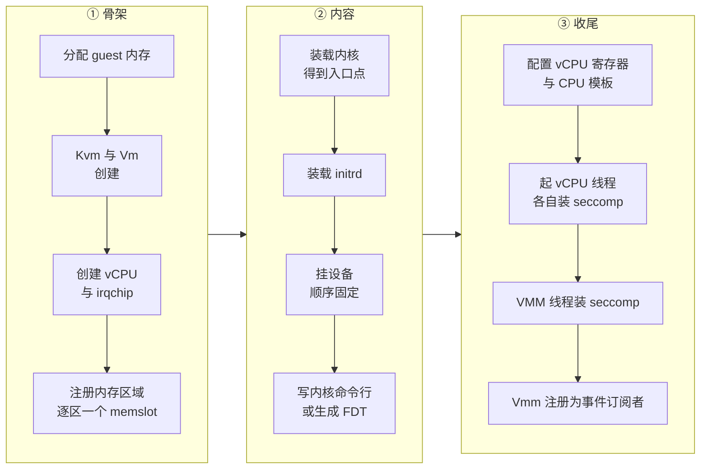
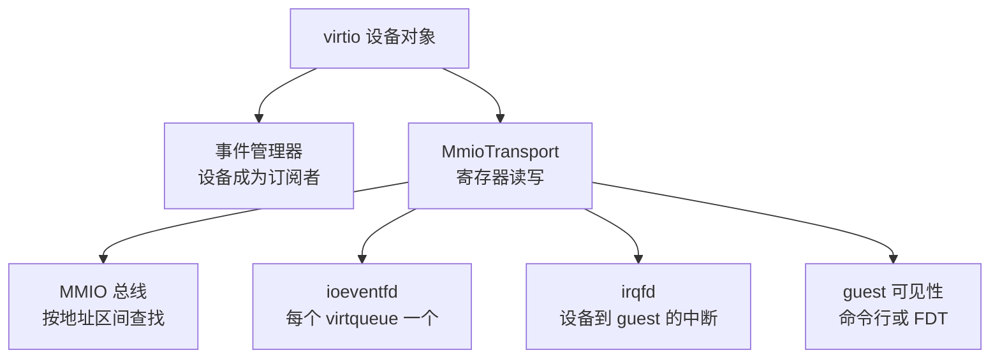

# 11 · builder：从配置到运行中的 microVM

> `InstanceStart` 之后发生的事情全部在一个函数里：打开 KVM、建 VM 与 vCPU、注册内存、
> 装内核、把配置好的设备挂上总线、按架构配好系统、起线程、装 seccomp。
> 这个顺序不是随意的 —— 其中至少四处调换位置就会失败或者产生错误的 guest。本篇讲这条流水线。
>
> **读者**：系统工程师。
> **预备**：[第 10 篇 · 资源模型](10-vm-resources-and-config.md#5-设备配置builder-里已经是设备)、
> [第 03 篇 · 本书用到的 KVM API](03-kvm-api-primer.md)。
> **代码**：`src/vmm/src/builder.rs`、`src/vmm/src/device_manager/mmio.rs`、
> `src/vmm/src/vstate/vm.rs`、`src/vmm/src/arch/x86_64/mod.rs`、`src/vmm/src/arch/aarch64/mod.rs`

---

## 0. 本篇要回答的问题

1. 从 `InstanceStart` 到 guest 开始取第一条指令，中间有哪几个阶段？每个阶段的产物是什么？
2. 为什么 vCPU 必须先于内存注册被创建？中断控制器在两个架构上为什么创建时机相反？
3. 挂一个 virtio 设备意味着建立哪几条连接？guest 是怎么知道这个设备存在的？
4. 设备的挂载顺序为什么要固定？boot timer 为什么必须第一个挂？
5. seccomp 过滤器为什么装在最后，而不是进程一启动就装？

---

## 1. 问题：这是一条有顺序约束的流水线

到 `InstanceStart` 为止，进程里已经有了一份 `VmResources`：机器参数是纯数据，
五类设备已经是构造好的对象。把它们变成一台能跑的 microVM，需要的不只是「逐个初始化」——
各步之间有硬约束，而且约束来自三个不同的地方：

- **KVM 的接口约束**：aarch64 上 `KVM_CREATE_VCPU` 在中断控制器初始化之后会失败，x86_64 则相反。
- **guest 可见性的约束**：设备在 guest 里的编号来自它们被挂上总线的顺序，
  顺序变了 guest 里的 `/dev/vda` 就可能指向别的盘。
- **安全边界的约束**：seccomp 过滤器一旦装上，后面用不到的系统调用就不能再用了，
  所以它必须在所有建机动作之后。

这些约束没有写在类型系统里，靠的是 `build_microvm_for_boot()` 里语句的先后与若干条注释。
本篇按这个顺序读一遍，并指出每处约束的来源。

---

## 2. 入口：两个函数的分工

`src/vmm/src/builder.rs` 暴露两个入口。`build_microvm_for_boot()` 造出一台完整的、
**处于 Paused 的** microVM；`build_and_boot_microvm()` 调它，再调一次 `Vmm::resume_vm()`
让 vCPU 跑起来。函数文档注释写明了这一点：造出来的 microVM 与全部 vCPU 都处在 paused 状态。

拆成两层的理由是让「造」与「跑」可以分开。快照恢复路径
（`build_microvm_from_snapshot()`，[第 38 篇](38-snapshot-load.md)）走的是同一种形态：
造完停在 Paused，由 `LoadSnapshot` 请求体里的 `resume_vm` 字段决定要不要补这一次 resume。

图里 ② 与 ③ 的分界不是代码里的一条线：`configure_system_for_boot()` 同时做了
「配置 vCPU」与「写命令行 / 生成 FDT」两件事，这里按产物归类。

---

## 3. 骨架：内存、VM、vCPU

第一句实质动作是 `vm_resources.allocate_guest_memory()`
（[第 10 篇 §9](10-vm-resources-and-config.md#9-配置的最后一次使用分配-guest-内存)），
它只做宿主侧的 `mmap`，还没有告诉 KVM。

接着是 `create_vmm_and_vcpus()`，它按顺序创建：`Kvm::new()`（打开 `/dev/kvm`，
检查能力清单，带上 CPU 模板要求的额外能力）、`Vm::new()`（`KVM_CREATE_VM`）、
`ResourceAllocator::new()`（MMIO 地址与中断号的分配器）、两个设备管理器的空壳，
然后 `vm.create_vcpus(vcpu_count)`。

`Vm::create_vcpus()` 的结构值得注意：它在循环前后各调一次架构钩子。

| 架构 | `arch_pre_create_vcpus` | `arch_post_create_vcpus` |
|---|---|---|
| x86_64 | `setup_irqchip()`：`KVM_CREATE_IRQCHIP`、`KVM_CREATE_PIT2` | 空 |
| aarch64 | 空 | `setup_irqchip(nr_vcpus)`：`create_gic()` |

aarch64 那一侧的注释给出了理由并指向了内核源码：`KVM_CREATE_VCPU` 在 irqchip
已经初始化之后会返回错误。GIC 还需要知道 vCPU 的数量，这也要求它后创建。
x86_64 则要求 irqchip 先于 vCPU 存在。同一个函数用两个钩子把这条差异吸收掉，
上层代码不必分架构写（[第 17 篇](17-x86-64-platform.md)、[第 19 篇](19-aarch64-platform.md)）。

x86_64 还在这里多做一件事：把 stdout 设为非阻塞，建串口设备，
用 vCPU 退出事件的一份克隆作为 i8042 的 reset 事件，组成 `PortIODeviceManager`。
aarch64 没有 PIO 总线，串口与 RTC 在后面作为 MMIO 设备挂。

`Kvm::new()` 的能力清单值得单独一提：它在这里一次性检查本机 KVM 是否支持 Firecracker
依赖的那组扩展，缺一个就直接失败，而不是等到某次 ioctl 在运行中途返回 `ENOTTY`。
CPU 模板可以往这份清单里追加条目（`cpu_template.kvm_capabilities`），
于是「模板要求的特性宿主不具备」也在建机的第一秒就暴露出来。

`create_vmm_and_vcpus()` 返回之后才轮到 `vmm.vm.register_memory_regions(guest_memory)`：
逐个区域调 `KVM_SET_USER_MEMORY_REGION`，槽位号就是当前已注册区域的个数
（[第 13 篇 · guest 内存](13-guest-memory.md)）。
内存注册晚于 vCPU 创建并没有 KVM 层面的要求，是这段代码的组织方式决定的。

---

## 4. 内容：内核与 initrd

`load_kernel()` 是架构相关的（`arch/x86_64/mod.rs` 与 `arch/aarch64/mod.rs` 各一份），
输入是 `BootConfig` 里那个已经打开的内核文件句柄，输出是一个 `EntryPoint`：
入口地址加上引导协议（x86_64 上是 `LinuxBoot` 或 `PvhBoot`，由内核 ELF note 决定）。
`InitrdConfig::from_config()` 把 initrd 读进 guest 内存的高端并记下地址与长度。

内核命令行在这一步之前就被克隆了一份：`let mut boot_cmdline = boot_config.cmdline.clone()`，
注释说明了理由 —— 一次失败的启动不应该污染原始配置。
后面挂设备时每个设备都会往这份命令行里追加内容，失败之后调用方可以改配置重来。

---

## 5. 挂设备：顺序、总线与四条连线

### 5.1 顺序是固定的

`build_microvm_for_boot()` 里的挂载顺序是写死的：boot timer、balloon、block、net、
vsock、entropy、aarch64 的 legacy 设备、vmgenid。

boot timer 排第一有注释：它必须第一个挂，才能保持与文档和测试里那个固定 MMIO 地址一致。
这是因为 MMIO 地址由 `ResourceAllocator` 按 `AllocPolicy::FirstMatch` 顺序分配，
第一个挂上的设备拿到区间的第一块。其余设备的顺序决定了它们在 guest 里的枚举顺序 ——
块设备的顺序就是 `/dev/vda`、`/dev/vdb` 的顺序，这也是
[第 10 篇 §5](10-vm-resources-and-config.md#5-设备配置builder-里已经是设备)
里根设备要固定在队首的原因。

boot timer 本身是有条件的：只有命令行开关 `--boot-timer` 把 `vm_resources.boot_timer`
置真时才挂。它是一个伪设备，guest 往它的地址写一个字节，VMM 就记下从进程启动到那一刻的耗时
（[第 44 篇 · 日志与 metrics](44-logging-and-metrics.md)）。

块设备还在挂载时改写命令行：根设备有 PARTUUID 就追加 `root=PARTUUID=<uuid>`，
没有就追加 `root=/dev/vda`，再按只读与否追加 `ro` 或 `rw`。

aarch64 的 legacy 设备有一个条件分支：只有当命令行里已经含有 `console=` 时才挂串口
（`attach_legacy_devices_aarch64()` 检查 `cmdline_contains_console`）。
不需要控制台就不建这个设备，也就不占 MMIO 槽位。RTC 则无条件挂。

### 5.2 一个 virtio 设备的四条连线

所有 virtio 设备走同一个 `attach_virtio_device()`，它把设备包进 `MmioTransport`
再交给 `MMIODeviceManager::register_mmio_virtio_for_boot()`。整个过程建立四条连接：

第一条：`event_manager.add_subscriber(device.clone())`，设备的后端 fd（tap、块设备文件、
队列事件）从此由 VMM 线程的事件循环驱动（[第 12 篇](12-vmm-event-loop-and-exit.md)）。

第二条：`allocate_mmio_resources()` 分配一个中断号与一段 MMIO 地址区间（`MMIO_LEN` 长），
`register_mmio_device()` 把 `MmioTransport` 插进 `bus`，并在 `id_to_dev_info` 里登记
`(设备类型, 设备 id) → MMIODeviceInfo`。vCPU 遇到这段地址的访问会退出到 VMM，
由总线按地址找到这个设备（[第 23 篇 · 总线与 MMIO 设备管理器](23-bus-and-mmio-device-manager.md)）。

第三条：对设备的每个 virtqueue 调 `vm.register_ioevent()`，
把队列事件 fd 绑到 `设备基址 + NOTIFY_REG_OFFSET` 上、以队列序号为数据值。
guest 往这个寄存器写队列号时，KVM 直接触发对应的 eventfd，不必退出到用户态再分发。

第四条：`vm.register_irqfd()` 把设备的中断事件 fd 绑到分配到的中断号上，
设备处理完请求后写这个 fd 即可注入中断。

`register_mmio_virtio()` 开头有一句硬性检查：设备必须有中断号，否则返回
`MmioError::InvalidIrqConfig`；注释写明 Firecracker 的 virtio 设备目前固定用一个中断。

### 5.3 guest 怎么知道设备在哪

virtio-mmio 没有总线枚举机制，地址必须由外部告知 guest，两个架构的做法不同。

x86_64 上 `register_mmio_virtio_for_boot()` 调 `add_virtio_device_to_cmdline()`，
往命令行追加 `virtio_mmio.device=<size>K@<baseaddr>:<irq>`；同时调 `add_virtio_aml()`
把这个设备写进 DSDT 的 AML，供 ACPI 路径使用（[第 17 篇](17-x86-64-platform.md)）。
这两步都带 `#[cfg(target_arch = "x86_64")]`。

aarch64 上这一步是空的：设备信息留在 `id_to_dev_info` 里，
到 `configure_system_for_boot()` 生成 FDT 时一次性写进设备树
（`fdt::create_fdt()` 的输入之一就是 `mmio_device_manager.get_device_info()`，
[第 19 篇](19-aarch64-platform.md)）。

vmgenid 不走这条路：`attach_vmgenid_device()` 把它交给 `ACPIDeviceManager`。
这个管理器两个架构都有（`src/vmm/src/device_manager/acpi.rs` 里没有 `cfg(target_arch)`），
区别在 guest 怎么看到它：x86_64 上经 ACPI 表，aarch64 上由 `fdt.rs` 的
`create_vmgenid_node()` 写一个 `compatible = "microsoft,vmgenid"` 的 FDT 节点
（[第 19 篇](19-aarch64-platform.md)、[第 35 篇](35-entropy-vmgenid-rate-limiter.md)）。

---

## 6. 配置系统：两个架构的同名函数

`configure_system_for_boot()` 在两个架构下各有一份实现，签名相同、结构相似、内容分岔。

共同的前半段：用 CPU 模板构造 `CpuConfiguration` 并应用模板，
包进 `VcpuConfig`（vCPU 数、SMT、CPU 配置），然后对每个 vCPU 调 `KvmVcpu::configure()`
写寄存器（[第 16 篇](16-x86-64-vcpu.md)、[第 18 篇](18-aarch64-vcpu.md)）。

后半段分岔：

| 步骤 | x86_64 | aarch64 |
|---|---|---|
| 命令行传递 | `load_cmdline()` 写到 `CMDLINE_START` | 作为 FDT 的 `chosen` 节点内容 |
| 多处理器描述 | `mptable::setup_mptable()` | FDT 的 `cpus` 节点，含 MPIDR |
| 引导协议 | `configure_pvh()` 或 `configure_64bit_boot()` | 无，PC 与 X0 在 `configure()` 里设好 |
| 平台描述 | `create_acpi_tables()` | `fdt::create_fdt()` 写进 guest 内存 |

`KvmVcpu::configure()` 的参数里有 guest 内存，因为它要往里写东西：x86_64 上是初始页表与
GDT/IDT，aarch64 上是把 FDT 的地址放进 X0。这解释了为什么配置 vCPU 不能早于内存注册 ——
写进去的内容必须落在已经映射给 guest 的区域里。

这也是 aarch64 上设备必须在这一步之前全部挂完的原因：FDT 是一次性生成并写进内存的快照，
之后再挂设备 guest 也看不见。x86_64 的命令行同理 —— 命令行在这里才被写进 guest 内存。

---

## 7. 收尾：起线程与装 seccomp

`Vmm` 被包进 `Arc<Mutex<Vmm>>` 之后，`start_vcpus()` 把每个 `Vcpu` 移进自己的 OS 线程。
每个 vCPU 线程做的第一件事是给自己装 `vcpu` 那一份 seccomp 过滤器，然后进入状态机的 running
起点（实际停在 paused，[第 15 篇](15-vcpu-threads-and-state-machine.md)）。
`start_vcpus()` 用一个 `Barrier` 等所有 vCPU 线程完成线程局部存储的初始化，
并在最后把 `instance_info.state` 置成 `Paused`。

x86_64 上这之前还有一步：`start_vcpus()` 给每个 vCPU 装上 MMIO 总线的克隆与 PIO 总线的克隆，
vCPU 退出时靠它们分发。

VMM 线程自己的 seccomp 过滤器在 `start_vcpus()` 之后才装，代码注释写着
「保持它是恢复 vCPU 之前的最后一步」。理由是建机过程要用到大量后续不再需要的系统调用 ——
`open`、`mmap`、`ioctl` 的各种命令字 —— 装早了就得把它们全部放进白名单，
攻击面等于没收窄（[第 42 篇 · seccomp](42-seccomp.md)）。代价是从进程启动到这一刻为止，
进程是不受过滤器保护的；这段时间里处理的只有本地 API socket 上的配置请求，还没有运行任何 guest 代码。

最后 `event_manager.add_subscriber(vmm.clone())`：`Vmm` 自己也是一个事件订阅者，
它监听 vCPU 退出事件。这一步之后函数返回，`build_and_boot_microvm()` 调 `resume_vm()`，
guest 开始执行。

这条流水线上任何一步失败，`build_microvm_for_boot()` 都直接返回 `StartMicrovmError`
的某个变体，不做回滚。已经建好的东西随着函数的局部变量被丢弃：`Vmm` 析构时关闭
VM fd 与 vCPU fd，KVM 侧的对象随之释放；已经挂上事件管理器的设备则保留着一个 `Arc`，
直到事件管理器本身被丢弃。进程没有被杀掉，控制器仍然停在 Preboot 阶段，
调用方可以改配置再发一次 `InstanceStart` —— 这也是[第 09 篇 §3.4](09-rpc-interface.md#34-fatal_error哪些失败不能原地重试)
里冷启动失败不算致命错误的原因。

---

## 8. 与快照恢复路径的对照

`build_microvm_from_snapshot()` 与本篇这条路径共用 `create_vmm_and_vcpus()` 与
`register_memory_regions()`，之后完全分开：不装内核、不挂配置里的设备、不生成 FDT 或 ACPI 表，
而是逐个恢复 vCPU 状态、恢复 VM 状态（irqchip 或 GIC）、
用 `MMIODeviceManager::restore()` 按快照里记录的地址与中断号重建设备，
最后同样是 `start_vcpus()` + VMM 线程 seccomp。展开在[第 38 篇 · 加载快照](38-snapshot-load.md)。

两条路径的共同尾部解释了一个性质：恢复出来的 microVM 与冷启动的 microVM 在
`Vmm` 结构层面是同构的，运行期的代码不需要知道自己是怎么来的。

---

## 9. 后续各层的差异

ARM 适配版在 `src/vmm/src/builder.rs` 的两条路径里各加了一行
`vmm.vm.setup_dirty_tracking()`，紧跟在 `register_memory_regions()` 之后，
用于在内存区域注册完成后打开脏页跟踪后端。见
[第 65 篇 · 脏页跟踪后端](65-dirty-tracking-backend.md)。
e2b 定制版不改这个文件。

---

## 10. 小结

- `build_microvm_for_boot()` 造出的 microVM 停在 Paused；`build_and_boot_microvm()`
  多调一次 `resume_vm()`。快照恢复路径用同一种形态，由请求参数决定是否 resume。
- 中断控制器的创建时机由 KVM 决定且两个架构相反：x86_64 必须先于 `KVM_CREATE_VCPU`，
  aarch64 必须后于它；`Vm::create_vcpus()` 用前后两个架构钩子吸收这条差异。
- 挂设备的顺序决定 MMIO 地址的分配顺序，从而决定 guest 里的设备枚举顺序；
  boot timer 必须第一个挂以保住那个固定地址。
- 挂一个 virtio 设备建立四条连接：事件订阅、MMIO 总线登记、每队列一个 ioeventfd、一个 irqfd。
- guest 的设备发现在 x86_64 上靠内核命令行的 `virtio_mmio.device=` 加 ACPI AML，
  在 aarch64 上靠 FDT；后者要求设备在生成 FDT 之前全部挂完。
- `configure_system_for_boot()` 同名不同实现：x86_64 写命令行、mptable、引导协议结构与 ACPI 表，
  aarch64 只生成并写入 FDT。
- vCPU 线程各自装 seccomp 后启动；VMM 线程的过滤器装在最后，
  代价是建机全过程不受过滤器保护，收益是白名单里不必放入只在建机时用到的系统调用。
- 冷启动与快照恢复共用骨架与收尾，`Vmm` 结构因此同构，运行期代码不区分来源。

## 延伸阅读 / 下一篇

- [第 10 篇 · 资源模型](10-vm-resources-and-config.md)：builder 的输入是怎么攒起来的。
- [第 23 篇 · 总线与 MMIO 设备管理器](23-bus-and-mmio-device-manager.md)：地址分配与总线查找的细节。
- [第 25 篇 · virtio 设备模型与传输层](25-virtio-device-model-and-transport.md)：`MmioTransport` 的寄存器语义。
- [第 38 篇 · 加载快照](38-snapshot-load.md)：另一条建机路径。
- [第 42 篇 · seccomp](42-seccomp.md)：三份过滤器与装载时机。
- 下一篇：[第 12 篇 · Vmm、事件循环与退出路径](12-vmm-event-loop-and-exit.md)。
