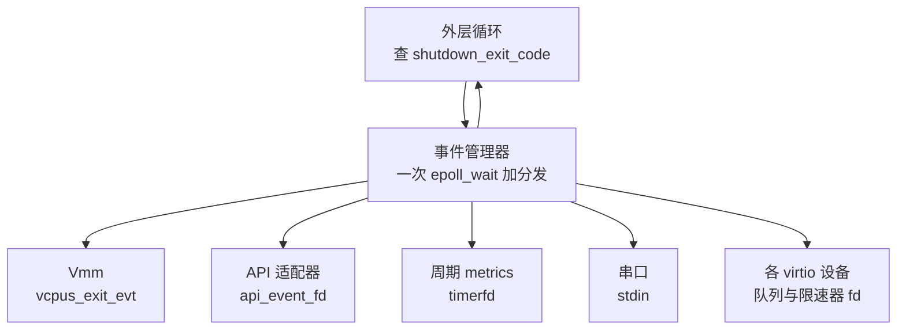
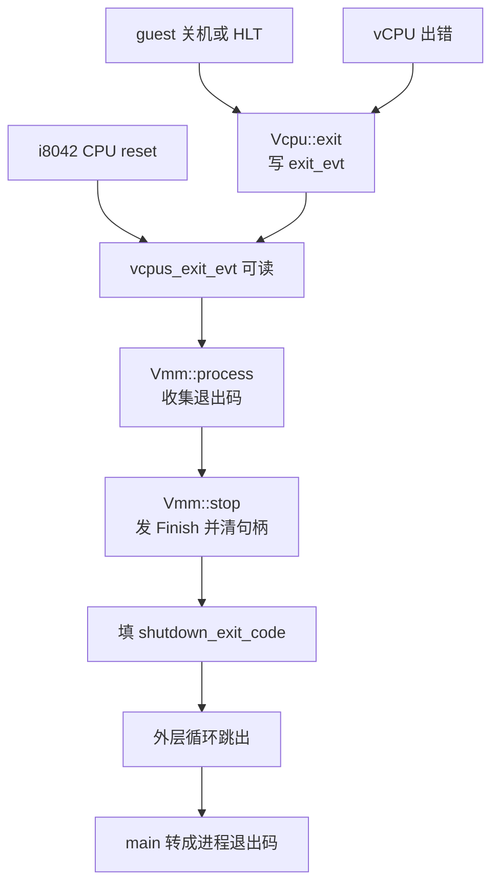

# 12 · Vmm、事件循环与退出路径

> builder 把配置变成一台跑起来的 microVM 之后，VMM 线程就剩下一件事：转一个循环。
> 这个循环里挤着 API 请求、设备 I/O、串口输入、定时器与 vCPU 的退出通知，全部单线程串行处理。
> 本篇讲 `Vmm` 这个结构装了什么、事件循环由谁驱动、以及一台 microVM 结束时那条从 vCPU
> 到进程退出码的固定路径。
>
> **读者**：系统工程师、运维。
> **预备**：[第 07 篇 · 进程启动](07-process-startup.md#5-两条路)、
> [第 11 篇 · builder](11-builder.md)。
> **代码**：`src/vmm/src/lib.rs`、`src/vmm/src/vstate/vcpu.rs`、
> `src/vmm/src/device_manager/mmio.rs`、`src/vmm/src/devices/legacy/i8042.rs`、
> `src/firecracker/src/api_server_adapter.rs`、`src/firecracker/src/metrics.rs`

---

## 0. 本篇要回答的问题

1. `Vmm` 结构里放的是什么？哪些字段是为了拿住资源不被释放而存在的？
2. 事件循环由谁驱动，有哪些订阅者？单线程处理全部事件的代价在哪里？
3. 一台 microVM 结束时，从 vCPU 到进程退出码之间发生了什么？为什么要设计成单向的？
4. guest 里执行 `reboot` 会怎样？`SendCtrlAltDel` 与它是同一条路吗？
5. 进程被外部 `kill` 与 guest 自己关机，在可观测性上有什么差别？

---

## 1. 问题：设备多，线程只能少

一台 microVM 里同时存在若干个独立的事件源：每个 virtio 设备的每条 virtqueue 各有一个 ioeventfd，
每个限速器有一个 timerfd，balloon 的统计队列有一个 timerfd，串口有 stdin，
控制面有一个 eventfd，vCPU 的退出通知又是一个 eventfd。
一台典型的沙箱有一块盘、一张网卡、一个 vsock，加上串口与控制面，描述符数量已经是两位数。

最直白的做法是每个设备一个线程。这样每个设备的处理互不阻塞，但代价是三重：
线程数随设备数增长，而 Firecracker 的卖点之一是每台 microVM 的宿主开销可预测；
每个线程都要一份 seccomp 过滤器与一份栈，内存开销与审计面同步增长；
设备之间共享 guest 内存与总线，多线程意味着要为每个共享结构设计锁。

Firecracker 的选择是**一个 VMM 线程处理全部设备事件**，vCPU 各自一个线程，此外只有一个 API 线程。
设备模拟因此完全无锁：所有 `process()` 都在同一个线程上串行执行，
设备之间不需要互斥，`Vmm` 上的 `Arc<Mutex<…>>` 实际上只在极少数跨线程读取时才真正竞争。
代价同样明确：**任何一个订阅者在 `process()` 里阻塞，整台 microVM 的 I/O 就停住**。
这条约束贯穿全部设备实现 —— 它们必须做非阻塞 I/O，或者把阻塞操作交给 io_uring
（[第 28 篇 · io_uring 引擎](28-io-uring-engine.md)）。

---

## 2. `Vmm` 结构：运行期的全部句柄

`Vmm`（`src/vmm/src/lib.rs`）不是一个「管理器」，更像一份句柄清单：运行期需要活着的东西都挂在它上面。

| 字段 | 作用 | 备注 |
|---|---|---|
| `instance_info` | id、状态、版本、应用名 | `GET /` 的返回内容；`state` 由三处写入 |
| `shutdown_exit_code` | 停机标志兼退出码 | `None` 表示还在跑；被填上就是退出信号 |
| `kvm`、`vm` | KVM 的两层文件描述符 | `vm` 还持有 guest 内存与 memslot |
| `uffd` | 快照恢复时的 userfaultfd | 只为保持描述符打开而存在 |
| `vcpus_handles` | 每个 vCPU 线程的句柄 | 清空这个 `Vec` 就等于 join 全部线程 |
| `vcpus_exit_evt` | vCPU 与设备写入的退出通知 | `Vmm` 自己订阅它，注释明确写「Vmm 绝不往这里写」 |
| `resource_allocator` | MMIO 地址与中断号的分配器 | 见[第 23 篇](23-bus-and-mmio-device-manager.md) |
| `mmio_device_manager` | 全部 virtio 与 MMIO 设备 | 也是总线 |
| `pio_device_manager` | 串口与 i8042 | 带 `cfg(target_arch = "x86_64")`，是 `Vmm` 上唯一的架构专属字段 |
| `acpi_device_manager` | 唯一的成员是 `Option<VmGenId>` | 两个架构都有，没有 `cfg`；见[第 17 篇](17-x86-64-platform.md)、[第 19 篇](19-aarch64-platform.md) |
| `events_observer` | 一个 `Option<std::io::Stdin>` | 名字像观察者，实际只是为了在起 vCPU 时把 stdin 置 raw、退出时置回 |

其中 `uffd` 与 `events_observer` 是纯粹的「拿住不放」型字段：
前者一旦被 drop，快照恢复用的缺页处理就失效；后者是终端模式的所有权凭据。
这种写法在 Rust 系统程序里很常见 —— 生命周期就是资源的作用域，不需要额外的注册表。

`Vmm` 上的方法分三类：状态迁移（`start_vcpus()`、`pause_vm()`、`resume_vm()`、`stop()`）、
状态导出（`save_state()`、`dump_cpu_config()`）、设备热更新（`update_block_device_path()`、
`update_net_rate_limiters()`、`update_balloon_config()` 等）。
前两类与 vCPU 线程通信都走同一个模式：给每个句柄 `send_event()`，
再在 `response_receiver()` 上 `recv_timeout(RECV_TIMEOUT_SEC)` 收结果。
那个常量是 30 秒，注释说明它的用途是「检测潜在的 vCPU 死锁」，正常运行中不该被触及。

`resume_vm()` 比 `pause_vm()` 多做一步：先调 `mmio_device_manager.kick_devices()`。
它对已激活的 virtio 设备人为触发一次队列处理，理由写在 `kick_devices()` 的注释里 ——
暂停期间可能有队列通知没被 epoll 捕获（快照恢复时更是如此），
不补这一下，恢复后的设备会等一个永远不会再来的通知。balloon 的统计队列不需要补，因为它由 timerfd 驱动。

---

## 3. 事件循环

`EventManager` 是 `event_manager` crate 的类型别名（`src/vmm/src/lib.rs`）：
`BaseEventManager<Arc<Mutex<dyn MutEventSubscriber>>>`。
订阅者用 `add_subscriber()` 注册，注册时它的 `init(&mut EventOps)` 被调用，
在里面把自己关心的描述符加进 epoll；事件到达时它的 `process(Events, &mut EventOps)` 被调用。

`EventManager::run()` 并不是一个循环，它只做一次 `epoll_wait`（超时 -1，即无限等）加一轮分发就返回。
真正的循环在调用方：`ApiServerAdapter::run_microvm()`（有 API 时）
或 `run_without_api()`（无 API 时）里的那个 `loop`，每轮 `run()` 之后检查一次
`vmm.lock().unwrap().shutdown_exit_code()`。

订阅者一共五类，注册时机分散在两处代码里：

- **周期 metrics** 与 **API 适配器**在 `api_server_adapter.rs` 注册。
  前者在建机之前就挂上，但它的 timerfd 要等建机成功后调用 `PeriodicMetrics::start()` 才被武装，
  周期是 `WRITE_METRICS_PERIOD_MS`，即 60000 ms。
  后者在 `run_microvm()` 里注册，这也是「preboot 阶段的阻塞循环」与「运行期事件循环」的分界。
- **串口**在 `builder.rs` 的 `setup_serial_device()` 里注册，订阅 stdin。
- **每个 virtio 设备**在 `attach_virtio_device()` 里注册，注册发生在挂上 MMIO 总线之前。
  设备在 `init()` 里加的描述符随设备类型而异：激活前只有 activate fd，激活后是各条队列的 ioeventfd 与限速器的 timerfd。
- **`Vmm` 自己**在 `build_microvm_for_boot()` 末尾由 `event_manager.add_subscriber(vmm.clone())` 注册，
  它只订阅一个描述符：`vcpus_exit_evt`。

`Vmm` 的 `process()` 里有一句注释值得引用：
「Exit event handling should never do anything more than call `self.stop()`」。
退出处理不做任何清理工作，清理全部交给 `Drop`。这条纪律是为了避免在事件分发的栈上做资源释放 ——
那时 `EventManager` 还持有对订阅者的引用。

循环本身没有优先级也没有公平性安排：一轮 `epoll_wait` 返回一批就绪的描述符，
按 epoll 给出的顺序逐个调用对应订阅者的 `process()`。
一个持续有数据的 virtio 队列不会饿死别的订阅者，因为每个设备的 `process()` 都以
「处理完当前可用的描述符链就返回」为约定；但一个写得不好的设备处理函数可以轻易破坏这个约定。
被信号打断时 `epoll_wait` 返回 `EINTR`，`event_manager` 把它翻译成「分发了 0 个事件」，
外层循环照常走下一轮，因此信号不会让循环提前结束。

这个结构还解释了一个容易困惑的现象：`Vmm` 被包在 `Arc<Mutex<…>>` 里，
但 API 动作与事件分发都在 VMM 线程上执行，这把锁在正常运行时几乎不竞争。
它真正的作用是让 API 适配器、事件管理器与 `main_exec()` 的外层循环都能拿到同一个 `Vmm`，
而不是为了并发。

---

## 4. 退出：一条单向的路

`Vmm::stop()` 与 `Vcpu::exit()` 两处都抄了同一张表格的注释，说明这条路是被刻意设计成单向的：
所有拆除路径都汇到同一个序列，避免 VMM 与 vCPU 互相等待形成环。

### 4.1 谁写那个 eventfd

第一类来源是 vCPU 自己。`handle_kvm_exit()`（`src/vmm/src/vstate/vcpu.rs`）
把四种 KVM 退出理由判为 `VcpuEmulation::Stopped`：`KVM_EXIT_HLT`、`KVM_EXIT_SHUTDOWN`、
以及 `KVM_EXIT_SYSTEM_EVENT` 里的 `KVM_SYSTEM_EVENT_RESET` 与 `KVM_SYSTEM_EVENT_SHUTDOWN`。
vCPU 状态机收到 `Stopped` 就调 `self.exit(FcExitCode::Ok)`。
另外两种情况调 `self.exit(FcExitCode::GenericError)`：KVM 返回 `FailEntry` 或 `InternalError`
这类被文档判为错误的退出，以及与 VMM 之间的事件通道意外断开。

`Vcpu::exit()` 做两件事：写一次 `exit_evt`，然后进入一个只接受 `VcpuEvent::Finish` 的循环，
每轮往响应通道里发一个 `VcpuResponse::Exited(exit_code)`。
注意退出码是通过**响应通道**传出去的，eventfd 只负责「有事发生」这个信号。

第二类来源是 x86_64 的 i8042 设备。`PortIODeviceManager::new()` 拿到的
`i8042_reset_evfd` 是 `vcpus_exit_evt.try_clone()` 的结果（`builder.rs` 里那行注释写得很直白：
「x86_64 uses the i8042 reset event as the Vmm exit event」）。
guest 往状态端口写 `CMD_RESET_CPU` 时，`I8042Device::write()` 就往这个描述符写 1。
`Vmm::send_ctrl_alt_del()` 走的是同一个设备的 `trigger_ctrl_alt_del()`，最终也落到这里。

### 4.2 退出码怎么定

`Vmm::process()` 读掉 eventfd 之后，遍历全部 vCPU 句柄，用 `try_iter()` 排空各自的响应通道，
在其中找 `VcpuResponse::Exited(status)`。规则是**错误优先**：
一旦看到非 `Ok` 的状态就立刻用它跳出，全部为 `Ok` 或一个都没找到时用 `FcExitCode::Ok`。

「一个都没找到」正是 i8042 这条路的情形 —— 没有任何 vCPU 调用过 `exit()`，通道里是空的，
于是退出码是 `Ok`。这带来一个要写进运维手册的结论：
**guest 里执行 `reboot` 的结果是 Firecracker 以退出码 0 结束，而不是 microVM 重启**。
Firecracker 不实现重启；重启语义由编排层通过「结束这个进程、起一个新的」来提供。
`SendCtrlAltDel` 同理，它是「请 guest 有序关机」的一种方式，不是「重启」。

### 4.3 拆除

`Vmm::stop(exit_code)` 按固定顺序做三件事：
给每个 vCPU 句柄发 `VcpuEvent::Finish`（注释说明这是已退出的 vCPU 唯一还会接受的消息，
运行中与暂停中的 vCPU 也接受）；`self.vcpus_handles.clear()`，
真正的 `thread::join()` 发生在 `VcpuHandle` 的 `Drop` 里，
这里清空 `Vec` 是为了让 join 发生在此刻而不是 `Vmm` 被 drop 时（避免依赖环）；
最后填上 `shutdown_exit_code`。

填上之后，外层循环的下一轮检查就会看到它：`Some(FcExitCode::Ok)` 跳出返回成功，
`Some(其它)` 包成 `ApiServerError::MicroVMStoppedWithError` 或 `RunWithoutApiError::Shutdown`
一路透传到 `main()`（[第 07 篇 §6](07-process-startup.md#6-退出码)）。

`Drop for Vmm` 里还会再调一次 `stop()`。这不是冗余：`Vmm` 有可能在还没注册进事件管理器时就被 drop
（例如快照恢复中途失败），那时没有人替它 join vCPU 线程，
`Drop` 里这一次调用保证进程能带着正确的错误消息退出。已经停过的情况下它是空操作。
`Drop` 随后把 stdin 恢复成 canonical 模式、写一次 metrics，
并在 `vcpus_handles` 非空时记一条错误日志 —— 那意味着有 vCPU 线程没能结束。

### 4.4 不走这条路的退出

有两类退出完全绕开上面这条链。一是信号：`SIGBUS`、`SIGSEGV`、`SIGSYS` 等的处理器
写完日志与 metrics 后直接 `libc::_exit()`（[第 07 篇 §3](07-process-startup.md#3-三件不可逆的进程级设置)），
vCPU 线程不会被 join，设备不会被拆，guest 内存不会被刷盘。
二是 `SIGTERM` 与 `SIGINT`：Firecracker 不为它们注册处理器，进程走内核默认行为终止，
**连 metrics 都不会落盘**。

这给运维一条实际的规则：外部 `kill` 一台 microVM 得不到任何收尾信息；
要留下可观测的痕迹，就让 guest 自己关机，或者在 kill 之前先用 `PUT /actions` 触发一次 `FlushMetrics`。

---

## 5. 定时与指标

事件循环里唯一的周期性工作是 metrics 刷写：`PeriodicMetrics` 的 timerfd 每 60 秒触发一次，
`process()` 调 `METRICS.write()` 把全部计数器序列化到 `--metrics-path` 指定的目标，失败时累加
`missed_metrics_count`。`start()` 在武装定时器的同时**立刻写一次**，
注释说明这是为了让启动耗时指标尽早可见。

需要即时数据时可以用 `PUT /actions` 的 `FlushMetrics` 强制刷一次，它在 VMM 线程上同步执行。
两条路写的是同一份 `METRICS`，格式与字段见[第 44 篇 · 日志与 metrics](44-logging-and-metrics.md)。

这里有一个与暂停相关的细节值得点出：VMM 线程处理完 `Pause` 之后不返回事件管理器，
而是在 API 适配器里转入一个只收 API 请求的阻塞循环，
代码注释明确写了「metric flush timerfd handling are frozen as well」。
所以**暂停期间指标不刷新**，timerfd 累积的超时会在 resume 之后被一次性消化。

---

## 6. 后续各层的差异

e2b 定制版在 `Vmm` 上加了 `get_dirty_memory()`，用 `mincore` 与 `/proc/self/pagemap`
在 VMM 线程上直接算出脏页位图，服务于 `GET /memory/dirty`；事件循环与退出路径没有改动。
见[第 52 篇 · 内存脏页 API](52-memory-dirty-api.md)。

ARM 适配版在 `VmState` 上加了 `Faulted`，并在 `pause_vm()` 与 `resume_vm()` 的入口拒绝处于该状态的 microVM，
理由是一次失败的原地回滚会让 VM 的内存与寄存器处于两个时刻之间，继续运行等于在损坏的状态上执行；
它同时在 `pause_vm()` 里加了一次队列诊断日志。这些见
[第 69 篇 · 回滚 API 与阶段](69-rollback-api-and-phases.md)与
[第 73 篇 · 失败模型](73-failure-model-faulted-and-seccomp.md)。

---

## 7. 小结

- 全部设备事件在一个 VMM 线程上串行处理，换来的是设备模拟完全无锁；
  代价是任何一个订阅者在 `process()` 里阻塞都会停住整台 microVM 的 I/O。
- `Vmm` 是一份运行期句柄清单，`uffd` 与 `events_observer` 这类字段的唯一作用是让资源保持存活。
- `EventManager::run()` 只做一次 `epoll_wait` 加一轮分发；循环在调用方，
  每轮检查 `shutdown_exit_code` 是否被填上。
- 订阅者有五类：`Vmm` 自身、API 适配器、周期 metrics、串口、每个 virtio 设备；
  注册时机分散在 builder 与 API 适配器两处。
- 退出路径是单向的：写 `vcpus_exit_evt` → `Vmm::process()` 收集退出码 → `stop()` 发 `Finish` 并清句柄
  → 填 `shutdown_exit_code` → 外层循环跳出。退出处理本身不做清理，清理全在 `Drop` 里。
- 退出码通过响应通道传递，eventfd 只表示「有事发生」；收集规则是错误优先，找不到就算 `Ok`。
- x86_64 上 i8042 的 reset 事件就是 `vcpus_exit_evt` 的一个克隆，
  因此 guest 里的 `reboot` 表现为进程以退出码 0 结束，Firecracker 不实现重启语义。
- `Vmm::stop()` 用清空 `vcpus_handles` 来触发 join，`Drop` 里再调一次以覆盖「建机中途失败」的情形。
- 信号类退出绕开整条链直接 `_exit`；`SIGTERM` 与 `SIGINT` 更彻底 —— 没有处理器，metrics 也不落盘。
- 暂停期间事件循环不转，metrics 定时刷写与设备模拟一并冻结。

## 延伸阅读 / 下一篇

- [第 11 篇 · builder](11-builder.md)：订阅者是在哪几步被挂上去的。
- [第 09 篇 · rpc_interface](09-rpc-interface.md)：`Pause` 之后那个阻塞循环的控制器侧。
- [第 15 篇 · vCPU 线程与状态机](15-vcpu-threads-and-state-machine.md)：`Vcpu::exit()` 之前的状态迁移。
- [第 24 篇 · legacy 设备](24-legacy-devices.md)：i8042 与串口的寄存器语义。
- [第 44 篇 · 日志与 metrics](44-logging-and-metrics.md)：指标的字段与落盘格式。
- 下一篇：[第 13 篇 · guest 内存：GuestMemoryMmap、区域与 memslot](13-guest-memory.md)。
