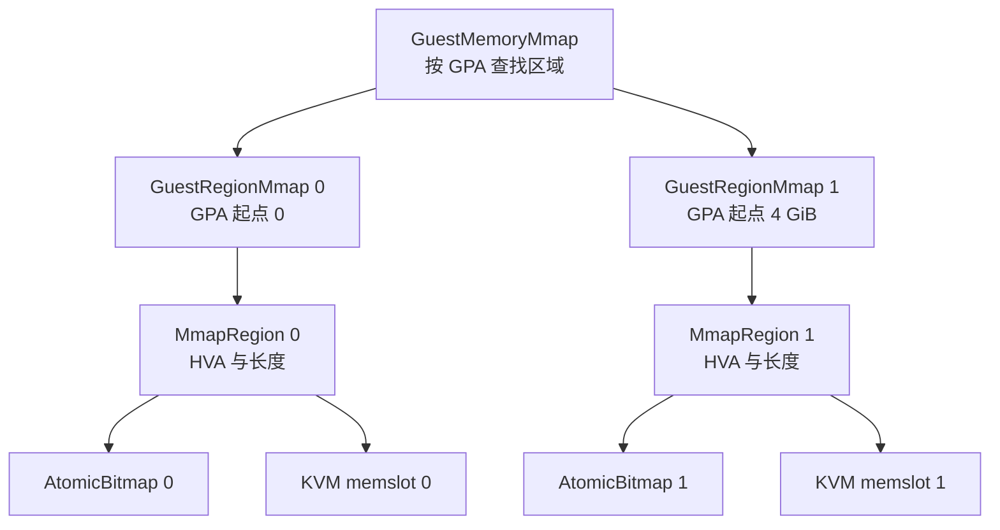

# 13 · guest 内存：GuestMemoryMmap、区域与 memslot

> guest 看到的「物理内存」是宿主机上的一段 mmap。这段映射怎么切分、用什么后备、怎么交给 KVM、
> 以及 Firecracker 自己怎么在上面记账，决定了后面快照、脏页跟踪与恢复能做什么、不能做什么。
> 本篇讲上游 v1.12.1 的 guest 内存是怎么建起来的，以及每种后备方式换来了什么、放弃了什么。
>
> **读者**：系统工程师。
> **预备**：[第 03 篇 · 本书用到的 KVM API](03-kvm-api-primer.md)、[第 10 篇 · 资源模型](10-vm-resources-and-config.md)。
> **代码**：`src/vmm/src/vstate/memory.rs`、`src/vmm/src/vstate/vm.rs`、
> `src/vmm/src/arch/x86_64/mod.rs`、`src/vmm/src/arch/aarch64/mod.rs`、`src/vmm/src/resources.rs`

---

## 0. 本篇要回答的问题

1. guest 的物理地址空间为什么不是一整段，x86_64 与 aarch64 各被切成几段、切在哪里？
2. 一段 guest 内存可以用哪几种宿主后备来做，Firecracker 默认选哪一种、为什么？
3. memslot 是什么，一台 microVM 用掉几个，上限在哪里？
4. `GuestMemoryMmap`、`GuestRegionMmap`、`MmapRegion` 和那张用户态位图是什么关系？
5. 快照里关于内存记了什么，恢复时靠它重建出什么？
6. 用 2 MiB 大页背 guest 内存，代价是什么？

---

## 1. 问题：KVM 不分配内存

KVM 不替 VMM 管理 guest 的物理内存。它提供的是一个翻译规则的注册接口：VMM 通过
`KVM_SET_USER_MEMORY_REGION` 告诉内核「guest 物理地址（GPA）从 X 开始、长度 L 的这一段，
对应我这个进程里从宿主虚拟地址（HVA）Y 开始的一段」，内核据此建立二级页表
（x86 的 EPT / NPT、aarch64 的 stage-2 页表）。内存本身是 VMM 进程用 `mmap` 向宿主内核要的普通匿名页或文件页。

这个分工带来三件事，本篇后面都要回答：

- guest 物理地址空间是 VMM 自己编排的，可以留洞、可以分段；
- guest 内存同时也是 VMM 进程地址空间的一部分，VMM 可以直接用指针读写它，设备模拟就靠这一点；
- guest 内存的换页、驻留、缺页全部按宿主机对这段 mmap 的规则走，VMM 可以用 `mmap` 的各种标志去影响它。

Firecracker 把这套接口用到了最简：内存在构建 microVM 时一次性分配注册，运行期间不增不减。
没有内存热插拔，没有 NUMA 亲和，没有按需注册新 slot；要把内存还给宿主机只有 balloon 一条路，
而 balloon 也不动 memslot，只是让 guest 交出页、由设备侧 `madvise` 释放。
收益是启动路径上关于内存的分支极少，也没有「运行中区域集合变了」这种状态需要在快照里表达；
代价是一台 microVM 的内存规格在启动时就定死，改规格只能重启或从快照恢复成另一个规格。

---

## 2. 地址空间的形状

Firecracker 用 `arch_memory_regions(offset, size)` 把「用户要 N MiB 内存」翻译成若干个 `(GuestAddress, usize)`。
两个架构的实现完全不同。

x86_64 的版本在 `src/vmm/src/arch/x86_64/mod.rs`。它必须在 32 位地址空间的顶端留出一段给 MMIO：
`MEM_32BIT_GAP_SIZE` 是 768 MiB，`MMIO_MEM_START` 因此是 4 GiB 减 768 MiB。
函数按请求的大小分三种情况：全部装得下空洞之前，就返回一段；装不下，就返回空洞之前的一段
加上从 4 GiB 起的第二段；起点已经在空洞之后，就只返回 4 GiB 之上的一段。
所以一台 3 GiB 的 microVM 只有一个区域，一台 8 GiB 的 microVM 有两个区域，第二个区域从 4 GiB 开始。

aarch64 的版本在 `src/vmm/src/arch/aarch64/mod.rs`。这个架构的 MMIO 区在 DRAM 之下：
`MAPPED_IO_START` 是 1 GiB，`DRAM_MEM_START` 是 2 GiB，中间这 1 GiB 就是 MMIO 窗口。
DRAM 从 2 GiB 起一路向上，所以不需要留洞，永远只有一个区域；
只有当请求超过 `DRAM_MEM_MAX_SIZE`（1022 GiB）时才会被截断并打一条警告。

```text
x86_64                                     aarch64

0                                          0
+----------------------------+             +----------------------------+
| region 0                   |             |  ROM / 保留                |
|  低端 BIOS 数据、内核、     |             |                            |
|  cmdline、initrd、guest RAM |   1 GiB     +----------------------------+
|                            |             |  MMIO 窗口                 |
|                            |             |  GIC 与 virtio-mmio        |
0xD000_0000 (4 GiB - 768 MiB)|   2 GiB     +----------------------------+
+----------------------------+             | region 0                   |
|  MMIO 空洞 768 MiB         |             |  SYSTEM_MEM 2 MiB          |
|  virtio-mmio、APIC、IOAPIC |             |  内核、initrd、FDT、       |
0x1_0000_0000 (4 GiB)        |             |  guest RAM                 |
+----------------------------+             |                            |
| region 1                   |             |                            |
|  4 GiB 之上的 guest RAM    |             |  最多到 1022 GiB           |
+----------------------------+             +----------------------------+
```

具体哪个地址放内核、哪个地址放启动参数，是第 17 篇与第 19 篇的内容；这里只关心「被切成几段」。
段数直接等于后面 memslot 的个数，也等于快照里 `GuestMemoryState::regions` 的条目数。

---

## 3. 区域的后备：四种做法

`memory.rs` 里所有创建函数最终都落到同一个 `create()`：对每个 `(start, size)` 用
`MmapRegionBuilder::new_with_bitmap()` 建一块 `MmapRegion`，权限固定为 `PROT_READ | PROT_WRITE`，
mmap 标志里固定带 `MAP_NORESERVE`，再包成 `GuestRegionMmap` 并绑定它的 GPA 起点。
差别只在传进去的 mmap 标志和可选的文件：

| 创建函数 | mmap 标志 | 后备 | 用在哪 |
|---|---|---|---|
| `anonymous()` | `MAP_PRIVATE \| MAP_ANONYMOUS` | 匿名页 | 正常启动；uffd 恢复 |
| `memfd_backed()` | `MAP_SHARED` + memfd | memfd | 配了 vhost-user 块设备时 |
| `snapshot_file()` | `MAP_PRIVATE` + 内存文件 | 快照的内存文件 | 从文件恢复 |
| 上面三者 + `huge_pages` | 追加 `MAP_HUGETLB \| MAP_HUGE_2MB` | HugeTLB 2 MiB | `huge_pages=2M` |

`MAP_NORESERVE` 的意思是不预先承诺物理页。好处是启动一台 8 GiB 的 microVM 不需要宿主机当场拿出 8 GiB，
guest 实际触碰到哪页才分配哪页；代价是超卖时的失败点从 `mmap` 挪到了访问时刻 ——
用大页且池子不够时，Firecracker 会收到 `SIGBUS`，`docs/hugepages.md` 明确写了这一点。

选哪一种由 `resources.rs` 的 `VmResources::allocate_guest_memory()` 决定，规则只有一条：
只要配置里有 vhost-user 块设备，就用 memfd，否则用匿名内存。
代码注释给出的理由是共享映射（含 memfd）的缺页更贵，所以只在必须让另一个进程也映射到同一段物理页时才用它。
这是一处明确的「为了 vhost-user 放弃缺页性能」的取舍，而不是两种等价实现。

`create()` 里还有一个细节值得留意：当有文件后备时，第 k 个区域的 `FileOffset` 是前 k 个区域大小的累加。
也就是说，**内存文件里的区域是按顺序首尾相接平铺的，中间不留 MMIO 空洞**。
x86_64 上一台 8 GiB 的 microVM，内存文件的大小是 8 GiB 而不是 12 GiB，第二个区域紧跟在第一个后面。
这条平铺规则贯穿快照的全部路径：`dump()`、`dump_dirty()` 与恢复时的 `snapshot_file()` 都按它算偏移。

从快照文件恢复时用的是 `MAP_PRIVATE`，这一点值得单独说。私有映射意味着 guest 恢复后的写不会回到内存文件里，
文件只提供初值；同一个内存文件因此可以同时被多台 microVM 映射，各写各的。
代价是这些写落在匿名页上，宿主机把它们算作这个进程的常驻内存。
这条语义还有一个不显眼的后果：`vm.rs` 的 `snapshot_memory_to_file()` 在准备输出文件时
特意不做 `truncate`，只有当文件大小与预期不符才截断。注释解释了原因 ——
输出文件有可能正是这台 microVM 当初加载的那个内存文件，而它此刻仍被映射着；
截断它等于把 guest 内存清零。既当输入又当输出，是内存文件这个设计必须处理的边界情况。

memfd 那一路多做了一步（`create_memfd()`）：建好并 `set_len()` 之后，给文件加上 `SealShrink`、`SealGrow`
两个 seal，再加 `SealSeal` 封住 seal 本身。这样即使 fd 传给了 vhost-user 后端进程，对方也无法改变它的大小 ——
如果能截短，Firecracker 这边的映射就会踩到空洞。

---

## 4. 注册给 KVM：一个区域一个 memslot

`src/vmm/src/vstate/vm.rs` 的 `Vm::register_memory_region()` 做三件事。

第一，分配 slot 号：直接用当前已注册区域的个数，所以 slot 号就是区域在 `GuestMemoryMmap` 里的序号，
从 0 开始连续。这个隐含约定在第 14 篇合并两张位图时会被反复用到。

第二，检查上限。`Kvm::max_nr_memslots()` 读的是 `KVM_CAP_NR_MEMSLOTS`，
超过就返回 `VmError::NotEnoughMemorySlots`。上游 v1.12.1 的一台 microVM 最多用两个 slot，离上限很远；
但 ARM 适配版之外的读者也应当知道这个上限存在，因为热插内存之类的扩展会先撞到它。

第三，填 `kvm_userspace_memory_region` 并调 `KVM_SET_USER_MEMORY_REGION`。
其中 `flags` 只有一个来源：

```rust
let flags = if region.bitmap().is_some() {
    KVM_MEM_LOG_DIRTY_PAGES
} else {
    0
};
```

区域有没有用户态位图，是在 `create()` 里由 `track_dirty_pages` 决定的
（`track_dirty_pages.then(|| AtomicBitmap::with_len(size))`）。
于是一个布尔配置项同时打开了两套跟踪机制：KVM 内核侧的脏页日志，和 Firecracker 用户态侧的位图。
两者为什么都需要、怎么合并，是[第 14 篇](14-dirty-page-tracking.md)的主题。

注册顺序上还有一点：`register_memory_region()` 先把新区域插进 `GuestMemoryMmap` 得到一个新的集合，
再调 ioctl，成功之后才把新集合写回 `self.common.guest_memory`。ioctl 失败时 VMM 侧的视图保持不变。

---

## 5. 四层数据结构

从下往上四层，每层只负责一件事。下图画的是一台有两个区域的 x86_64 microVM。



`MmapRegion` 是 `vm-memory` crate 的类型，持有 `mmap` 的返回地址、长度、可选的 `FileOffset`，
以及一个类型参数化的位图。Firecracker 把这个类型参数固定成 `Option<AtomicBitmap>`
（`memory.rs` 顶部的三个类型别名），也就是说「有没有位图」是运行时决定、类型上始终可空。

`GuestRegionMmap` 在 `MmapRegion` 上加一个 GPA 起点，于是有了 GPA 到 HVA 的映射。

`GuestMemoryMmap` 是区域的有序集合，提供按 GPA 查找、跨区域读写、`try_access()` 等操作。
它是不可变的：`insert_region()` 返回一个新的集合，内部区域用 `Arc` 共享。

`AtomicBitmap` 是 `vm-memory` 的按页位图，每页一个 bit，用 `AtomicU64` 的数组存。
它的页大小来自 `NewBitmap::with_len()`，即 `sysconf(_SC_PAGE_SIZE)` 报的**宿主页大小**，
不是 `huge_pages` 配的 2 MiB。所以即使 guest 内存用大页背，用户态位图仍然是 4 KiB 粒度
（在 64 KiB 页的 aarch64 宿主上则是 64 KiB，这是推论：代码只调 `sysconf`，没有别的假设）。

位图什么时候被置位？`vm-memory` 在所有经由 `GuestMemory` 接口的写操作路径上自动标脏；
绕开接口直接拿裸指针写的地方由调用方显式标。`memory.rs` 为此在 `GuestMemoryExtension` 里提供了
`mark_dirty()`，它用 `try_access()` 把一段可能跨区域的 GPA 区间拆成逐区域的片段，
对每个片段调该区域位图的 `mark_dirty()`。跨区域是真实存在的情况：x86_64 上一次大的 DMA
完全可能横跨 4 GiB 边界。哪些代码走自动路径、哪些必须显式标，第 14 篇有完整清单。

### 5.1 谁持有这些内存

`GuestMemoryMmap` 的权威副本挂在 `VmCommon::guest_memory` 上，经 `Vm::guest_memory()` 取只读引用。
但它并不是唯一的持有者：每个 virtio 设备的传输层 `MmioTransport` 自己存了一份，
guest 写状态寄存器触发激活时，`mmio.rs` 把它克隆一份交给设备
（`VirtioDevice::activate(&mut self, mem: GuestMemoryMmap)`）。
这个克隆很便宜 —— `vm-memory` 里 `GuestMemoryMmap` 只是一个 `Vec<Arc<GuestRegionMmap>>`，
克隆复制的是 `Arc` 指针，底层 `MmapRegion` 与位图仍然是同一份。
所以设备在 VMM 线程上标脏、vCPU 线程在处理 MMIO 时标脏、快照代码读位图，看到的都是同一份 `AtomicBitmap`。
位图用原子操作而不是加锁，正是因为它被多个线程并发写。

---

## 6. `GuestMemoryExtension`：快照要用的那几个动作

`memory.rs` 定义的 trait `GuestMemoryExtension` 给 `GuestMemoryMmap` 加了六个方法，
全部服务于快照：

| 方法 | 做什么 |
|---|---|
| `describe()` | 产出 `GuestMemoryState`：每个区域的 `base_address` 与 `size` |
| `mark_dirty()` | 把一段 GPA 区间在用户态位图上标脏 |
| `dump()` | 把全部区域按顺序写进 writer，用于 Full 快照 |
| `dump_dirty()` | 只写 KVM 位图与用户态位图的并集所覆盖的页，用于 Diff 快照 |
| `reset_dirty()` | 清空所有区域的用户态位图 |
| `store_dirty_bitmap()` | 把 KVM 位图合并进用户态位图 |

`GuestMemoryState` 是唯一进入快照文件的内存元信息，只有区域列表，没有内容、没有 HVA。
恢复时 `persist.rs` 用 `mem_state.regions()` 重建出同样的 `(GPA, size)` 序列，再按后端类型
分别走 `memory::snapshot_file()`（把内存文件 `MAP_PRIVATE` 映射进来）或
`memory::anonymous()` + userfaultfd 注册。两条路径产生的区域切分完全一样，
所以「内存文件里第 k 个区域从哪个偏移开始」这件事在保存端和恢复端自然对齐。

注意 `GuestMemoryRegionState.base_address` 这个字段名：源码注释直说了它本该叫 `base_guest_addr`，
为了快照格式的向后兼容才留着旧名。快照字段一旦发布就带上了兼容负担，这是一个小而具体的例子。

---

## 7. 大页：收益与限制

`huge_pages=2M`（`HugePageConfig::Hugetlbfs2M`）只做一件事：给 mmap 追加
`MAP_HUGETLB | MAP_HUGE_2MB`。上游文档给出的收益是更少的 TLB 争用与更少的地址翻译开销，
以及恢复快照后重建二级页表所需的 KVM exit 更少。代价与限制则是四条硬的：

- 宿主机必须预先备好 2 MiB 页的池子。因为 `MAP_NORESERVE`，池子不够不会让 `mmap` 失败，
  而是让运行中的 Firecracker 收到 `SIGBUS`。
- 用大页做的快照**只能经 userfaultfd 恢复**。`persist.rs` 的 `restore_from_snapshot()` 里，
  `MemBackendType::File` 分支一上来就检查 `huge_pages.is_hugetlbfs()`，是就直接返回
  `GuestMemoryFromFileError::HugetlbfsSnapshot`。恢复时也不能在 4 KiB 与 2 MiB 之间切换。
- 大页与 balloon 设备互斥（`docs/hugepages.md`）。balloon 靠 `madvise(MADV_DONTNEED)` 把页还给宿主，
  这在 HugeTLB 上不成立。
- 即使用大页，Diff 快照仍然按 4 KiB 粒度跟踪写访问。也就是说大页省的是翻译开销，不是脏页粒度。

至于为什么不用透明大页（THP）：上游 FAQ 的答案是 guest 内存基于 memfd，Linux 6.1 没有给这类区域
动态开启 THP 的办法，而且 userfaultfd 与 THP 不配合。

---

## 8. 后续各层的差异

e2b 定制版在 `src/vmm/src/vstate/vm.rs` 上加了两组只读查询：`guest_memory_mappings()` 把每个区域的
宿主虚拟地址、大小、在内存文件中的偏移与页大小交给调用方，`get_memory_info()` 用 `mincore`
产出驻留页与零页两张位图。它们让 orchestrator 直接从 Firecracker 进程里读内存，而不必让 Firecracker 写文件，
见[第 50 篇](50-memory-mappings-api.md)与[第 51 篇](51-memory-resident-empty-api.md)。

ARM 适配版在 `src/vmm/src/vstate/memory.rs` 上加了 `dump_dirty()` 的逆操作 `restore_dirty()`
与一套扁平位图的序列化格式，用于原地回滚，见[第 67 篇](67-dirty-bitmap-sidecar.md)与[第 70 篇](70-rollback-memory.md)。
它还在 `src/vmm/src/vstate/vm.rs` 上加了 `setup_dirty_tracking()` 与 `DirtyTrackingBackend`：
内存区域注册完之后选一种脏页跟踪后端，鲲鹏上优先用 HDBSS，不可用则退回 KVM 写保护，
见[第 65 篇](65-dirty-tracking-backend.md)与[第 66 篇](66-hdbss.md)。
本篇讲的区域切分、后备方式与 memslot 注册本身，两层都没有改。

---

## 9. 小结

- KVM 只登记 GPA 到 HVA 的映射，内存本身由 Firecracker 进程 `mmap` 得到；这既是设备能直接读写 guest 内存的原因，也是脏页要在两侧各记一份的原因。
- guest 物理地址空间的形状是架构决定的：x86_64 要在 4 GiB 以下留 768 MiB 的 MMIO 空洞，因此可能有两个区域；aarch64 的 MMIO 在 DRAM 之下，永远只有一个区域。
- 区域数就是 memslot 数，slot 号等于区域序号，这条约定被脏页合并与快照恢复共同依赖。
- 后备方式有匿名页、memfd、快照文件三种，加上可叠加的 HugeTLB；默认用匿名页，只有配了 vhost-user 块设备才换成 memfd，理由是共享映射缺页更贵。
- 所有带文件后备的区域在文件里按顺序平铺，不复现 MMIO 空洞；这决定了内存文件的大小与偏移算法。
- `track_dirty_pages` 一个开关同时决定用户态位图是否存在与 memslot 是否带 `KVM_MEM_LOG_DIRTY_PAGES`。
- 快照里只存区域列表；恢复端据此重建同样的切分，内容由内存文件映射或 userfaultfd 按需填。
- 大页换来的是翻译开销，代价是 `SIGBUS` 风险、只能用 userfaultfd 恢复、与 balloon 互斥，且脏页粒度不变。

---

## 延伸阅读 / 下一篇

- [第 14 篇 · 脏页跟踪：KVM 日志与用户态位图](14-dirty-page-tracking.md)：两张位图各自记什么、怎么合并。
- [第 36 篇 · 快照总览](36-snapshot-overview-and-format.md)、[第 37 篇 · 创建快照](37-snapshot-create.md)：内存文件的产出路径。
- [第 39 篇 · userfaultfd 后端与缺页处理](39-uffd-backend.md)：按需填页的另一条恢复路径。
- [第 17 篇 · x86_64 平台](17-x86-64-platform.md)、[第 19 篇 · aarch64 平台](19-aarch64-platform.md)：两个架构的完整 GPA 布局。
- 上游文档 `docs/hugepages.md`：大页的启用方式与已知限制。
- [e2b 手册第 31 篇](../e2b-infra/31-uffd-memory-backend.md)：调用方怎么实现 userfaultfd 后端。
