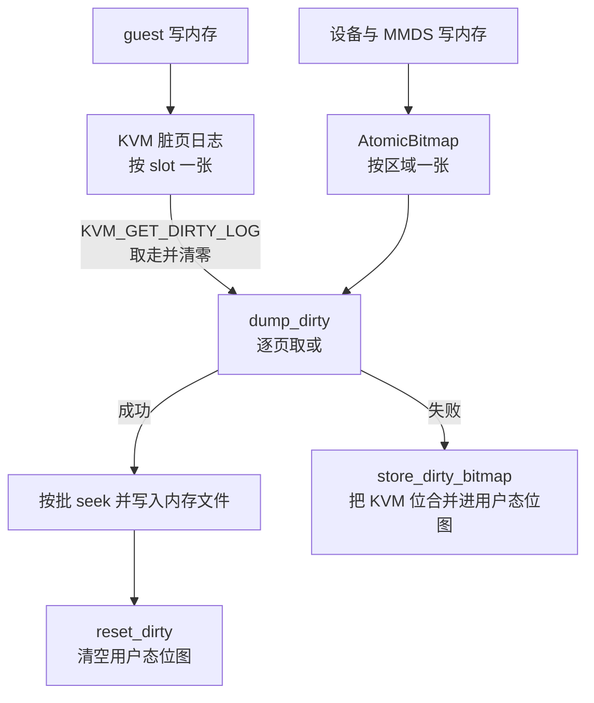

# 14 · 脏页跟踪：KVM 日志与用户态位图

> 差分快照的全部价值建立在一个判断上：自上次快照以来，哪些页被写过。这个判断没有单一来源 ——
> guest 的写由 KVM 记录，VMM 自己的写 KVM 看不见，两份记录必须合并。
> 本篇讲上游 v1.12.1 这两份记录各自的语义、合并的地方，以及「KVM 日志读一次就清零」这条性质
> 如何决定了周边代码的形状。
>
> **读者**：系统工程师。
> **预备**：[第 13 篇 · guest 内存](13-guest-memory.md#4-注册给-kvm一个区域一个-memslot)、
> [第 03 篇 · 本书用到的 KVM API](03-kvm-api-primer.md)。
> **代码**：`src/vmm/src/vstate/vm.rs`、`src/vmm/src/vstate/memory.rs`、`src/vmm/src/persist.rs`、
> `src/vmm/src/devices/virtio/queue.rs`、`src/vmm/src/devices/virtio/iovec.rs`

---

## 0. 本篇要回答的问题

1. 一页 guest 内存可能被谁写，为什么一份记录不够？
2. `KVM_GET_DIRTY_LOG` 读出来之后，内核那边的位还在吗？这件事影响了哪些代码？
3. Firecracker 用户态那张位图什么时候自动置位，什么时候必须手工置位？哪条写路径两者都不覆盖？
4. 两张位图在哪一行代码合并，合并的索引对齐靠什么假设？
5. 写内存文件失败时脏页信息会不会丢，靠什么机制不丢？
6. 打开脏页跟踪的代价是什么；不打开又去要 Diff 快照会怎样？

---

## 1. 问题：guest 内存有两个写者

一台运行中的 microVM，它的 guest 内存被两方写：

- **guest 自己**。CPU 在客户机模式下执行 store 指令，经二级页表落到宿主物理页。
  VMM 进程完全不参与，唯一能观察到这件事的是 KVM。
- **Firecracker 进程自己**。virtio 设备把块设备读到的数据写进 guest 的接收缓冲区、
  把网络包写进 rx 缓冲、更新 virtqueue 的 used ring、MMDS 写响应数据。
  这些都是普通的用户态内存写，不经过 KVM，KVM 的脏页日志里不会出现。

于是两份记录都是不完整的，必须求并集。方向性也很清楚：**漏记一页是数据损坏，多记一页只是让差分变大**。
所以两侧的机制都往「宁可多记」的方向偏 —— 后面会看到 `IoVecBufferMut` 在真正写之前就先把整条描述符链标脏。

`track_dirty_pages` 这个配置项（`PUT /machine-config` 的字段，见[第 10 篇](10-vm-resources-and-config.md)）
一次同时打开两侧：第 13 篇讲过，它决定了每个区域有没有 `AtomicBitmap`，
而区域有没有位图又决定了注册 memslot 时带不带 `KVM_MEM_LOG_DIRTY_PAGES`。

---

## 2. KVM 侧：一份读一次就消失的日志

### 2.1 打开

`src/vmm/src/vstate/vm.rs` 的 `Vm::register_memory_region()` 在 `region.bitmap().is_some()` 时
给 `kvm_userspace_memory_region.flags` 填 `KVM_MEM_LOG_DIRTY_PAGES`。
这之后 KVM 会为该 slot 维护一张按页的位图。硬件怎么产生这些位由 KVM 与 CPU 决定：
通用做法是把二级页表项去掉写权限，guest 首次写触发一次 VM exit，KVM 在日志里置位并恢复写权限；
支持页修改日志（PML）的 x86 硬件可以不用写保护而由硬件记录。
这部分不在 Firecracker 的代码里，本书不展开；对 VMM 而言唯一重要的是接口语义。

### 2.2 `KVM_GET_DIRTY_LOG` 是「取走」，不是「查看」

KVM API 的约定是：这次 ioctl 把该 slot 的位图复制到用户态缓冲区，**同时把内核侧的位清零**，
并让那些页重新回到「下次写会被记录」的状态。换句话说，它返回的是「自上一次调用本 ioctl 以来
被写过的页」，而不是「自 microVM 启动以来」。KVM 另有一个 `KVM_CAP_MANUAL_DIRTY_LOG_PROTECT`
能力可以把「取位图」和「重新保护」拆成两步，上游 v1.12.1 没有使用它 ——
`src/vmm/src/arch/x86_64/kvm.rs` 与 `src/vmm/src/arch/aarch64/kvm.rs` 的 `DEFAULT_CAPABILITIES`
列表里没有它，代码里也没有任何 `KVM_ENABLE_CAP` 调用。

这条性质有三个直接后果，构成了本篇其余部分的骨架：

1. 读取位图是**有副作用**的操作，不能随便调、不能调两次期望拿到同样的结果。
2. 位图一旦读到用户态，就成了唯一的副本。如果这次快照失败，必须把它存到别处，否则这些页的脏状态永久丢失。
3. 「重置跟踪」不需要专门的 ioctl：读一次、把结果丢掉就等于重置。

### 2.3 两个包装函数

`vm.rs` 里因此有一对函数，实现几乎相同，区别只在要不要保留结果：

```rust
pub fn reset_dirty_bitmap(&self) {
    self.guest_memory().iter().zip(0u32..).for_each(|(region, slot)| {
        let _ = self.fd().get_dirty_log(slot, u64_to_usize(region.len()));
    });
}

pub fn get_dirty_bitmap(&self) -> Result<DirtyBitmap, vmm_sys_util::errno::Error> {
    let mut bitmap: DirtyBitmap = HashMap::new();
    self.guest_memory().iter().zip(0u32..).try_for_each(|(region, slot)| {
        self.fd().get_dirty_log(slot, u64_to_usize(region.len()))
            .map(|bitmap_region| _ = bitmap.insert(slot, bitmap_region))
    })?;
    Ok(bitmap)
}
```

`DirtyBitmap` 是 `HashMap<u32, Vec<u64>>`，键是 slot 号，值是该 slot 的位图字数组，一个 `u64` 覆盖 64 页。
注意 slot 号是用 `zip(0u32..)` 现场生成的，不是从任何地方查出来的 ——
这依赖第 13 篇讲过的约定：slot 号等于区域在 `GuestMemoryMmap` 中的序号。
`reset_dirty_bitmap()` 连错误都不看（`let _ =`），因为重置失败没有可做的补救。

---

## 3. 用户态侧：每个区域一张 `AtomicBitmap`

### 3.1 自动标脏的路径

只要写操作经过 `vm-memory` 的接口 —— `GuestMemory::write()`、`write_obj()`、`read_from()`、
`VolatileSlice` 的各种写方法 —— crate 内部就会调对应 bitmap slice 的 `mark_dirty()`。
这条路径不需要 Firecracker 做任何事，也不会漏。第 13 篇提过，当 `track_dirty_pages` 为 false 时
区域的位图是 `None`，而 `vm-memory` 为 `Option<B>` 实现的 `Bitmap` 把 `mark_dirty()` 实现成空操作、
`dirty_at()` 恒为 false。也就是说关掉跟踪不会报错，只会让所有记录静默消失 —— 这正是第 7 节要讲的那个检查存在的原因。

### 3.2 必须手工标脏的路径

性能敏感的数据面不走 `vm-memory` 的接口，而是取出裸指针直接操作。这些地方要自己标脏，
Firecracker 的做法是**在拿指针的同一处就标**，而不是在写完之后：

- `src/vmm/src/devices/virtio/iovec.rs` 的 `IoVecBufferMut` 在把描述符链转成 `iovec` 数组时，
  对每个描述符先 `mem.get_slice()` 再 `slice.bitmap().mark_dirty(0, desc.len)`。
  代码注释说明了理由：转成 `iovec` 之后就彻底失去了 `vm-memory` 的信息，只能提前标。
  这意味着一条 rx 描述符链即使最后只填了几十字节，整条链覆盖的页都会被标脏。这是「宁可多记」的具体体现。
- `src/vmm/src/devices/virtio/queue.rs` 的 `get_slice_ptr()` 在返回指针前做同样的事，
  `Queue::initialize()` 通过它拿到描述符表、avail ring、used ring 三个指针。
- `src/vmm/src/devices/virtio/block/virtio/io/async_io.rs` 的 `mark_dirty_mem_and_unwrap()`
  在 io_uring 完成事件到达时按实际字节数调 `GuestMemoryMmap::mark_dirty()`。

### 3.3 运行期不标脏的那一条：virtqueue 对象

`Queue` 拿到三个裸指针之后，运行期间对 used ring 的写（`used_ring_idx_set()` 之类）
是直接的 `write_volatile`，**不再碰位图**。这是有意的：每处理一个描述符链就标一次脏，
开销落在最热的路径上，而 virtqueue 占的页数很少。

代价是队列页的脏状态在运行期是不准的。上游的补偿在 `src/vmm/src/persist.rs` 的 `create_snapshot()` 末尾：
内存写完之后，遍历所有已激活的 virtio 设备，调 `VirtioDevice::mark_queue_memory_dirty()`
（它转调每个队列的 `Queue::mark_memory_dirty()`，即对三个环各做一次 `get_slice_ptr()`）。
放在写文件**之后**是关键：这一步不是为了让本次快照包含队列页，而是为了让**下一次**差分快照包含它们。
本次快照里队列页的内容已经由上一轮标脏或 `dump()` 覆盖；而写文件成功之后用户态位图会被清空，
不补这一下，队列页就会从此消失在所有后续差分里。

一个由此而来的结论：**任何一次差分快照都必然包含全部已激活设备的 virtqueue 页**，无论 guest 这段时间有没有 I/O。

---

## 4. 合并：`dump_dirty()`

合并发生在 `src/vmm/src/vstate/memory.rs` 的 `GuestMemoryExtension::dump_dirty()`，
由 `vm.rs` 的 `snapshot_memory_to_file()` 在 `SnapshotType::Diff` 分支调用。判据就是一个或：

```rust
let is_kvm_page_dirty = ((v >> j) & 1u64) != 0u64;
let page_offset = ((i * 64) + j) * page_size;
let is_firecracker_page_dirty = firecracker_bitmap.dirty_at(page_offset);

if is_kvm_page_dirty || is_firecracker_page_dirty {
```

外层 `self.iter().zip(0..)` 同时给出区域和 slot 号，再用 `dirty_bitmap.get(&slot).unwrap()`
取出对应的 KVM 位图。这个 `unwrap()` 之所以成立，还是那条约定：slot 号等于区域序号，
而 `get_dirty_bitmap()` 用同样的顺序生成键。两侧的**页索引**也必须对齐：
KVM 位图的第 `i*64+j` 位对应区域内偏移 `(i*64+j) * page_size` 的那一页，
而用户态 `AtomicBitmap` 的页大小取自 `sysconf(_SC_PAGE_SIZE)`，`page_size` 也取自
`crate::utils::get_page_size()`，两者是同一个值。大页配置不参与这里，所以差分始终是宿主页粒度。

写出的方式是「攒批」：遇到脏页就累加 `write_size`，遇到干净页且已有累积就把这一批一次写出。
写之前 `seek` 到 `writer_offset + page_offset`，其中 `writer_offset` 是前面各区域长度之和 ——
再次利用第 13 篇讲的「区域在文件里顺序平铺」。干净页既不写也不读，文件里对应位置保留原值，
这就是「差分直接合并进已有的内存文件」得以成立的原因：
`snapshot_memory_to_file()` 对已存在且大小相符的文件不做截断，只覆盖脏页所在的字节。

下图是一次 Diff 快照里内存部分的完整流向。



下表把第 3 节的分类整理成写路径与标脏责任的对照。

| 写路径 | 谁写 | KVM 日志 | 用户态位图 |
|---|---|---|---|
| guest 的普通 store | vCPU 在客户机模式 | 记录 | 不记录 |
| `vm-memory` 接口写（MMDS、配置空间落盘等） | VMM 线程 | 不记录 | 自动记录 |
| virtio 数据缓冲（net rx、block read） | VMM 线程 | 不记录 | 取 `iovec` 时提前整段记录 |
| io_uring 完成写回 | VMM 线程 | 不记录 | 完成时按实际长度记录 |
| virtqueue 环的运行期更新 | VMM 线程与 vCPU 线程 | 不记录 | 运行期不记录，快照后补记 |

---

## 5. 失败路径：`store_dirty_bitmap()` 为什么必须存在

`dump_dirty()` 的结尾是这样的：

```rust
if write_result.is_err() {
    self.store_dirty_bitmap(dirty_bitmap, page_size);
} else {
    self.reset_dirty();
}
```

这是第 2.2 节那条性质的直接产物。`get_dirty_bitmap()` 一调用，内核侧的位就没了；
如果写文件中途失败而什么都不做，这一轮被 guest 写过的页既没有进文件，也不在任何位图里，
下一次差分快照会把它们当成干净页跳过 —— 恢复出来的 microVM 会读到过期数据，而且没有任何报错。

`store_dirty_bitmap()` 做的事很朴素：遍历 KVM 位图，凡是置位的页，在对应区域的用户态位图上
`mark_dirty(page_offset, 1)`。于是失败之后用户态位图成为两份信息的并集，重试时不会漏。
成功路径则相反：内容已经落到文件里，用户态位图可以整体清零，
`reset_dirty()` 对每个区域调 `AtomicBitmap::reset()`。

值得注意的是，成功路径**不**再调一次 `reset_dirty_bitmap()`。不需要：
KVM 侧的位已经在 `get_dirty_bitmap()` 那一刻被取走并清零了。多调一次不仅无用，
还会把「取走位图之后到现在」这段时间里 guest 写的页误清掉。

Full 快照的那一支则两侧都要显式清：

```rust
SnapshotType::Full => {
    self.guest_memory().dump(&mut file)?;
    self.reset_dirty_bitmap();
    self.guest_memory().reset_dirty();
}
```

因为 `dump()` 不看任何位图、把所有页整体写出，所以它天然是一个新基线；
清空两侧记录之后，后续差分就以这次全量为参照。这也解释了一个使用上的事实：
要建立差分链，第一次必须是 Full，之后才能一串 Diff。

---

## 6. 代价与边界

**写保护的代价。** 打开跟踪后，每一页被 guest 第一次写都要一次 VM exit
（在没有硬件页修改日志的情况下），而且每次 `KVM_GET_DIRTY_LOG` 之后所有页重新被保护，
下一轮写又要重新付一次。所以代价正比于「每轮快照周期内 guest 触碰的不同页数」，
不是正比于内存总量。本书不给数字；这是一个开着就一直付、快照频率越高付得越多的开销。

**粒度固定。** 无论 guest 内存是不是用 2 MiB 大页背，差分都按宿主页粒度跟踪，上游文档
`docs/hugepages.md` 明确写了这一点。好处是差分不会因为大页而膨胀 512 倍，
代价是用大页时 KVM 为了做页粒度的写保护必须把大的二级页表项拆开。

**关掉跟踪时要 Diff 会被拒绝。** `src/vmm/src/rpc_interface.rs` 的
`RuntimeApiController::create_snapshot()` 在进入 `create_snapshot()` 之前先检查：

```rust
if create_params.snapshot_type == SnapshotType::Diff
    && !self.vm_resources.machine_config.track_dirty_pages
{
    return Err(VmmActionError::NotSupported(
        "Diff snapshots are not allowed on uVMs with dirty page tracking disabled.".to_string(),
    ));
}
```

返回错误，不退化成 Full。这是对的选择：如果放行，`dump_dirty()` 会得到一张空的 KVM 位图和
恒为 false 的用户态位图，产出一个「零个脏页」的差分，静默地损坏数据。
在这个判据上，报错比宽容安全得多。

**跟踪状态不进快照。** `track_dirty_pages` 不是 `VmInfo` 的字段，恢复时由
`LoadSnapshotParams::enable_diff_snapshots` 决定（`persist.rs` 的 `restore_from_snapshot()`
把它写进 `MachineConfigUpdate::track_dirty_pages`）。一台从快照恢复的 microVM 要不要继续跟踪，
由恢复请求说了算，与快照本身无关。

---

## 7. 后续各层的差异

e2b 定制版没有改这两张位图，而是在旁边加了第三条判据：`GET /memory/dirty` 先用 `mincore`
筛出驻留页，再逐页读 `/proc/self/pagemap`，把「已驻留且 uffd 写保护位（第 57 位）已清」
当作写过（`src/vmm/src/utils/pagemap.rs` 的 `PagemapReader::is_page_dirty()`），
让调用方不经过 Firecracker 的快照路径就能取到差分，见[第 52 篇](52-memory-dirty-api.md)。
这条判据成立的前提是 uffd 写保护确实装上了，与本篇的两张位图各记各的、互不影响。

ARM 适配版在这一层做了两件事：把脏页跟踪后端做成可选，在鲲鹏 950 上换成硬件脏页跟踪
HDBSS（hardware dirty bit state structure），见[第 65 篇](65-dirty-tracking-backend.md)与
[第 66 篇](66-hdbss.md)；以及把本篇的合并结果序列化成一个位图 sidecar 文件交给调用方，
见[第 67 篇](67-dirty-bitmap-sidecar.md)。它还加了 `dump_dirty()` 的逆操作，
用于把内存文件里的页写回运行中的 guest，见[第 70 篇](70-rollback-memory.md)。
本篇讲的合并判据 `dump_dirty()` 本身，两层都没有改。

---

## 8. 小结

- guest 内存有两个写者：guest 经 KVM，Firecracker 自己经普通用户态写。两份记录都不完整，差分快照取并集。
- `KVM_GET_DIRTY_LOG` 的语义是取走并清零，上游 v1.12.1 没有启用 `KVM_CAP_MANUAL_DIRTY_LOG_PROTECT`，所以读位图是有副作用的一次性操作。
- `reset_dirty_bitmap()` 就是读一次并丢弃结果；不存在单独的「清零」ioctl。
- 用户态位图由 `vm-memory` 在接口写路径上自动维护；数据面取裸指针的地方在取指针时就提前整段标脏，宁可多记。
- virtqueue 环的运行期更新不标脏，靠 `create_snapshot()` 写完内存之后补标；补标是为下一次差分服务，因此每次差分必然包含已激活设备的队列页。
- 合并写在 `dump_dirty()` 的 `is_kvm_page_dirty || is_firecracker_page_dirty`；两侧索引对齐依赖两条约定：slot 号等于区域序号，页粒度都是宿主页大小。
- 写文件失败必须调 `store_dirty_bitmap()` 把 KVM 位并回用户态位图，否则这一轮的脏状态永久丢失，后果是静默的数据损坏。
- 成功路径只清用户态位图；KVM 侧已在读取时清过，重复清会误伤这期间的新写入。
- Full 快照把两侧都清零，充当差分链的基线。
- 关掉 `track_dirty_pages` 时请求 Diff 会被控制面拒绝，而不是退化成 Full。

---

## 延伸阅读 / 下一篇

- [第 15 篇 · vCPU 线程与状态机](15-vcpu-threads-and-state-machine.md)：快照必须在 Paused 状态做，vCPU 怎么停。
- [第 37 篇 · 创建快照](37-snapshot-create.md)：本篇讲的内存导出在完整快照流程里的位置。
- [第 36 篇 · 快照总览](36-snapshot-overview-and-format.md)、[第 41 篇 · snapshot-editor 与兼容性](41-snapshot-tools-and-compat.md)：差分层怎么被合并与检查。
- [第 26 篇 · virtqueue 实现](26-virtqueue-implementation.md)、[第 25 篇 · virtio 设备模型](25-virtio-device-model-and-transport.md)：队列对象与描述符链的细节。
- 上游文档 `docs/snapshotting/snapshot-support.md`：差分快照的使用约束。
- [e2b 手册第 37 篇](../e2b-infra/37-pause-and-snapshot.md)：调用方为什么绕开了这条路径，改用自己的脏页判据。
