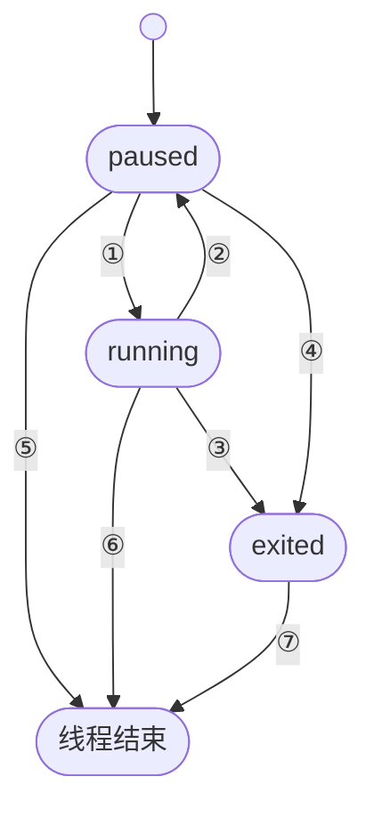
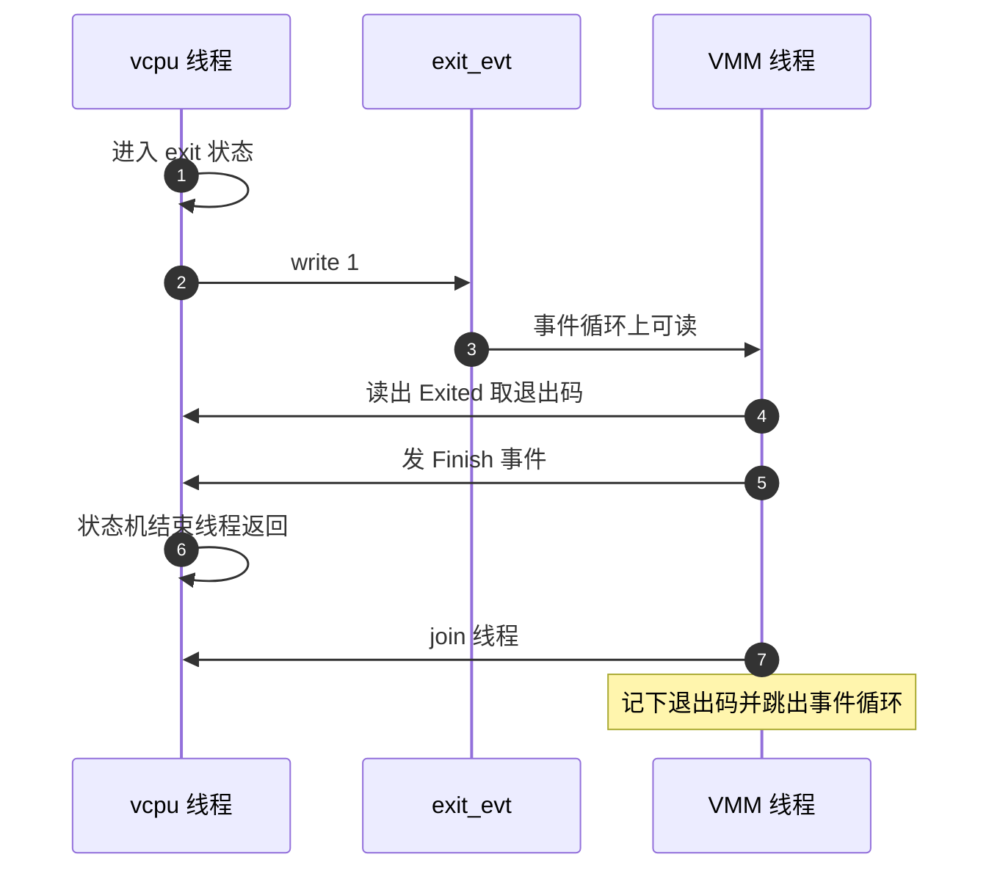

# 15 · vCPU 线程与状态机

> 一台 microVM 的每个 vCPU 在 Firecracker 进程里都是一个独立的 OS 线程，线程的主体是一个反复调用 `KVM_RUN` 的循环。
> 本篇讲上游 v1.12.1 怎么组织这些线程：它们如何启动、用什么状态机接受外部命令、
> 怎样在 `KVM_RUN` 阻塞期间被打断、从 KVM 退出时按什么分类处理，以及整台机器的拆除握手为什么要写成八步。
>
> **读者**：系统工程师、需要在 Firecracker 上加控制面动作的开发者。
> **预备**：[第 03 篇 · 本书用到的 KVM API](03-kvm-api-primer.md)、
> [第 11 篇 · builder](11-builder.md)。
> **代码**：`src/vmm/src/vstate/vcpu.rs`、`src/vmm/src/utils/sm.rs`、`src/vmm/src/lib.rs`

---

## 0. 本篇要回答的问题

1. 为什么每个 vCPU 要占一个 OS 线程，而不是复用 VMM 的事件循环？
2. vCPU 线程的状态机由哪几个状态、哪几个事件构成，谁能触发状态迁移？
3. 一个正阻塞在 `KVM_RUN` 里的 vCPU，外部怎么让它停下来？
4. 从 `KVM_RUN` 返回的各种退出原因分成几类，分别由谁处理？
5. 保存 vCPU 状态为什么必须在暂停之后做，运行中请求会得到什么？
6. 关机时 vCPU 线程与 VMM 线程之间的握手为什么不能简化？

---

## 1. 问题：`KVM_RUN` 是一个会长期阻塞的 ioctl

把一个 vCPU 跑起来，在 KVM 的接口里就是对 vCPU fd 调用 `KVM_RUN`。这个 ioctl 在 guest 代码执行期间不返回：
宿主线程把自己交给了硬件的 guest 模式，直到 guest 触发一次需要宿主处理的事件（访问了一段未被 KVM 直接处理的
MMIO 地址、执行了 `hlt`、收到信号）才回到用户态。换句话说，一个 vCPU 的执行时间就是一个宿主线程的执行时间，
两者无法分时复用。

这决定了线程模型。Firecracker 进程里有三类线程：接收 HTTP 请求的 API 线程、跑事件循环的 VMM 线程
（设备的 I/O 与定时器都在它上面），以及每个 vCPU 一个的执行线程。
把 vCPU 放进事件循环是不可行的：一次 `KVM_RUN` 可能几毫秒不返回，期间所有设备中断都得不到处理。
反过来，让 vCPU 线程兼管设备也不合适，因为设备处理要等 I/O，会把 guest 卡住。
所以 vCPU 线程只做一件事：跑 `KVM_RUN`，处理它的返回值，再跑 `KVM_RUN`。

代价是这些线程之间要通信。guest 的 MMIO 访问要落到 VMM 线程持有的设备对象上（靠共享的总线与锁，
见[第 23 篇](23-bus-and-mmio-device-manager.md)）；控制面的暂停、快照、关机命令要送到每个 vCPU 线程上
（靠本篇讲的通道与信号）。本篇讲的就是后一半。

## 2. 线程的诞生

`Vcpu::new()` 在 `src/vmm/src/vstate/vcpu.rs` 里只做三件事：建两条 `std::sync::mpsc` 通道
（一条送事件、一条收响应），调用架构相关的 `KvmVcpu::new()` 拿到 vCPU fd，把两端分别留给自己和将来的句柄。
此时还没有线程，`Vcpu` 对象仍在调用者（builder）手里，方便它接着做 `configure()` 这类需要 vCPU fd 的配置。

真正起线程的是 `Vcpu::start_threaded()`。它把 `Vcpu` 整个搬进新线程（`thread::Builder`，
线程名 `fc_vcpu {index}`，这个名字在调试与 `top` 里能直接对上 vCPU 序号），在线程内依次做：

1. `init_thread_local_data()`：把 `&mut self` 的裸指针存进该线程的 TLS。这一步是给信号处理函数用的，下一节讲；
2. 在一个 `Barrier` 上等待。屏障的计数是 `vcpu_count + 1`，最后一个参与者是 `Vmm::start_vcpus()` 自己
   （`src/vmm/src/lib.rs`）。也就是说控制面在返回之前保证了所有 vCPU 线程的 TLS 都已就绪；
3. `run(filter)`：先 `crate::seccomp::apply_filter()` 装上 vCPU 线程专用的 seccomp 过滤器，装不上就 panic。

第三步的顺序值得留意：过滤器是在线程内、进入状态机之前装的，不是进程启动时统一装的。
vCPU 线程与 VMM 线程允许的系统调用不同（vCPU 线程几乎只需要 `ioctl` 的少数几个命令），分开装才能把
vCPU 线程的攻击面压到最小，代价是任何新增的 vCPU 侧 ioctl 都必须同步改过滤器
（[第 42 篇](42-seccomp.md)）。

`start_threaded()` 返回一个 `VcpuHandle`，里面是事件发送端、响应接收端与 `JoinHandle`。
`Vmm` 把它们存进 `vcpus_handles`。此后控制面与 vCPU 之间只剩这一个接口。

## 3. 状态机：状态就是函数

`src/vmm/src/utils/sm.rs` 里的 `StateMachine<T>` 只有二十几行有效代码。它的定义是
「一个可选的函数指针」，函数类型是 `fn(&mut T) -> StateMachine<T>`：一个状态处理函数运行完，
返回的就是下一个状态的处理函数。`StateMachine::run()` 是一个 `while let` 循环，
拿到 `None` 就退出。`StateMachine::next(f)` 构造「继续到 f」，`StateMachine::finish()` 构造「结束」。

这种写法的好处是每个状态的全部行为都集中在一个函数里，迁移是函数返回值，编译器保证每条路径都给出下一个状态；
没有状态枚举，也就没有「枚举值与实际行为不一致」的可能。代价是状态图不能从类型上读出来，
只能靠读三个函数体；调试器里看到的也是函数地址而不是状态名（`Debug` 实现就是把函数指针打成 `usize`）。

`Vcpu::run()` 的最后一行是 `StateMachine::run(self, Self::paused)`。
**vCPU 线程一启动就处于 paused 状态**，不管这台 microVM 是刚引导还是从快照恢复。
`Vmm::start_vcpus()` 相应地把 `instance_info.state` 置为 `VmState::Paused`，
之后由 `InstanceStart` 或 `PATCH /vm` 触发的 `resume_vm()` 再把它们放出来。
这条约定让「引导」和「从快照恢复」两条路径在这里汇合：两者都先建线程、再恢复或配置状态、最后统一 resume。

## 4. 三个状态与它们接受的事件

`Vcpu` 有三个状态处理函数：`running()`、`paused()`、`exit()`。事件枚举是 `VcpuEvent`，
响应枚举是 `VcpuResponse`，都定义在同一个文件里。

| 编号 | 触发 | 动作 |
|---|---|---|
| ① | `VcpuEvent::Resume` | 清掉可能残留的 `immediate_exit`，回 `Resumed`，进入模拟循环 |
| ② | `VcpuEvent::Pause` | 回 `Paused`；x86_64 上顺带调 `KVM_KVMCLOCK_CTRL` |
| ③ | 模拟循环得到 `Stopped` 或出错 | guest 关机 / 重启，或模拟失败，带退出码进 `exit()` |
| ④ | 事件通道断开 | 控制面一侧异常消失，按 `GenericError` 退出 |
| ⑤ ⑥ | `VcpuEvent::Finish` | 直接 `StateMachine::finish()`，线程返回 |
| ⑦ | `VcpuEvent::Finish` | `exit()` 只接受这一个事件，收到后结束 |

两个状态对事件的反应不同，差别集中在「需要 vCPU 静止才能做的事」上：

- `paused()` 用 `recv()` **阻塞**等事件，因为暂停状态下线程无事可做。
  它接受 `SaveState`（调 `KvmVcpu::save_state()`，把 `VcpuState` 装进 `SavedState` 响应回去）
  与 `DumpCpuConfig`（调 `dump_cpu_config()`，见[第 20 篇](20-cpu-templates.md)）。
- `running()` 用 `try_recv()` **不阻塞**地取事件，取不到就继续跑 guest。
  它对 `SaveState` 与 `DumpCpuConfig` 一律回 `VcpuResponse::NotAllowed`，
  理由写在代码注释里：save / restore 在运行中不可用。

这条限制是快照正确性的基础。`KVM_GET_REG_LIST`、`KVM_GET_ONE_REG`、`KVM_GET_MSRS` 这些读取操作
在 vCPU 正在执行时读到的是一个不断变化的快照，各个寄存器之间不再互相一致。
控制面因此必须先 `pause_vm()` 再 `save_state()`，`Vmm::save_state()` 里也确实是这个顺序
（[第 37 篇 · 创建快照](37-snapshot-create.md)）。

控制面侧的配对代码在 `src/vmm/src/lib.rs`：`pause_vm()` / `resume_vm()` / `save_vcpu_states()`
都是「给每个句柄发事件，再逐个 `recv_timeout(RECV_TIMEOUT_SEC)` 收响应」。
超时常量是 30 秒，注释说明它的用途不是正常等待，而是**检测 vCPU 死锁**：
正常情况下响应在微秒级返回，等满 30 秒说明某个 vCPU 线程卡住了，此时报错比永久挂起好。

## 5. 打断一个正在 `KVM_RUN` 的 vCPU

发事件只是把消息放进通道，正阻塞在 `KVM_RUN` 里的线程不会去看通道。所以 `VcpuHandle::send_event()`
在 `send()` 之后还要做一件事：`kill(sigrtmin() + VCPU_RTSIG_OFFSET)`，向那个线程发一个实时信号。
`VCPU_RTSIG_OFFSET` 是 0，也就是 `SIGRTMIN`；`sigrtmin()` 在 `src/vmm/src/utils/signal.rs` 里
通过 `__libc_current_sigrtmin()` 取得，因为 glibc 自己会保留最低的几个实时信号。

信号处理函数由 `Vcpu::register_kick_signal_handler()` 注册（`Vmm::start_vcpus()` 调一次，全进程共用）。
它的函数体只有两行有效逻辑：从 TLS 里取出本线程的 `Vcpu` 指针，
对它的 vCPU fd 调 `set_kvm_immediate_exit(1)`，然后一个 `Release` 内存屏障。
这就是第 2 节里 TLS 那一步的用途——信号处理函数拿不到任何参数，只能靠 TLS 找到「本线程正在跑哪个 vCPU」。

`immediate_exit` 是 KVM 在共享的 `kvm_run` 结构里提供的一个字节：置 1 之后，
`KVM_RUN` 会立刻返回而不进入 guest。它与信号配合解决了一个竞态：
如果只发信号，信号可能在线程进入 `KVM_RUN` 之前到达，被当作一次普通的 `EINTR` 消费掉，
线程随后照样进 guest，事件就被拖到下一次退出才处理；有了 `immediate_exit`，
无论信号落在进入之前还是之中，`KVM_RUN` 都会立刻返回。

代码里有两处对残留 `immediate_exit` 的处理，都带 `warn!`：

- `run_emulation()` 开头检查 `immediate_exit == 1`，是的话清零并直接返回 `Interrupted`，跳过这次 `KVM_RUN`；
- `paused()` 处理 `Resume` 时同样检查并清零。

两处都是防御：某次 kick 的信号到得比事件处理慢，标志留到了下一轮。清零而不是忽略，
否则这个标志会让后续每次 `KVM_RUN` 都空转。

`running()` 的结构因此是「内层循环 + 外层事件检查」。内层反复调 `run_emulation()`，
只要返回 `Handled` 就继续，不去碰通道；返回 `Interrupted` 才跳出内层，去 `try_recv()` 看事件。
注释写明这是为了优化模拟路径：没有外部事件时不必每轮都做一次通道操作。

## 6. 从 `KVM_RUN` 回来之后：退出原因的分类

`run_emulation()` 把 `self.kvm_vcpu.fd.run()` 的结果交给自由函数 `handle_kvm_exit()`，
后者把所有退出原因归到 `VcpuEmulation` 的三个（开启 gdb 特性时四个）取值上。

| 退出原因 | 处理 | 归类 |
|---|---|---|
| `MmioRead` / `MmioWrite` | 转给 `peripherals.mmio_bus` 读写，并计一次延迟 metrics | `Handled` |
| `IoIn` / `IoOut`（仅 x86_64） | 转给 `pio_bus`，在 `run_arch_emulation()` 里 | `Handled` |
| `Hlt`、`Shutdown` | 记一条 info 日志 | `Stopped` |
| `SystemEvent`，类型为 RESET 或 SHUTDOWN | 记一条 info 日志 | `Stopped` |
| `errno == EINTR` | 清 `immediate_exit` | `Interrupted` |
| `errno == EAGAIN` | 无 | `Handled` |
| `FailEntry`、`InternalError`、`ENOSYS`、其它 errno | 计 `METRICS.vcpu.failures`，记 error 日志 | `Err(FaultyKvmExit)` |
| `Debug`（仅 gdb 特性） | 通知 gdb 线程 | `Paused` |
| 其余架构相关原因 | `run_arch_emulation()`，aarch64 上一律报错 | `Err(UnhandledKvmExit)` |

`SystemEvent` 这一行是 aarch64 的关机路径。ARM 上 guest 的开关机走 PSCI，
guest 执行 `HVC` 发出 `SYSTEM_OFF` 或 `SYSTEM_RESET`，KVM 把它转成 `KVM_EXIT_SYSTEM_EVENT` 交给用户态
（细节见[第 18 篇 · aarch64 vCPU](18-aarch64-vcpu.md)）。x86_64 上对应的是 `Hlt` 与 `Shutdown`。
两条路径在 `handle_kvm_exit()` 里汇成同一个 `Stopped`。

`Stopped` 的处理在 `running()` 里，注释解释了一个容易忽略的事实：
guest 关机或重启时，**只有 vCPU 0 会从 `KVM_RUN` 里退出来**，其余 vCPU 停在 guest 里不返回，
但它们也不消耗 CPU。所以 Firecracker 不等其它 vCPU，直接由 vCPU 0 发起整机拆除。

注意 `FailEntry` 与 `InternalError` 被当成错误。前者是硬件进入 guest 模式失败，后者是 KVM 自身的内部错误，
两者都不是 guest 能修复的状态。代码里留着一条 `TODO`，怀疑「收到一个不一定是错误的退出就结束 vCPU」
这个策略是否恰当——它意味着任何未列举的退出原因都会让整台 microVM 死掉，换来的是不会带着未知状态继续跑。

## 7. 拆除：为什么要八步握手

`Vcpu::exit()` 与 `Vmm::stop()` 的函数体上各抄了一份同样的八行表格，描述整个拆除流程。
拆除可以由两边任一方发起：vCPU 从第 1 步开始（guest 关机、模拟出错），VMM 从第 4 步开始
（收到 API 的关机请求、收到致命信号）。

几处设计值得单独说：

**`exit_evt` 是单向的。** `Vmm` 结构里那个字段的注释写着「由 vCPU 与设备用来发起拆除；Vmm 永远不写它」。
每个 `Vcpu` 持有的是它的一个 `dup`。VMM 线程把它注册进事件循环（`MutEventSubscriber::init()`），
可读时调 `process()`，读掉计数、收集退出码、调 `stop()`。

**退出码要收集而不是取第一个。** `process()` 遍历所有 vCPU 句柄，
把每个句柄上已到达的响应全部 `try_iter()` 出来找 `Exited(status)`，
一旦发现非 `Ok` 的状态码就用它。注释说明了理由：可能有的 vCPU 正常退出、有的出错退出，
错误必须优先于正常，否则一次崩溃会被报成一次干净关机。

**`exit()` 里是一个循环。** 进入 `exit()` 的 vCPU 反复发送 `Exited(exit_code)` 响应，
每发一次就阻塞等一个事件，只接受 `Finish`，收到才跳出循环并结束状态机。
之所以要反复发，是因为 VMM 那一侧可能正在 `try_iter()` 排空通道，也可能还没来得及读；
反复发保证了无论 VMM 什么时候来读，都能读到退出码。

**`join()` 放在 `VcpuHandle::drop()` 里。** `Vmm::stop()` 发完 `Finish` 之后做的是
`self.vcpus_handles.clear()`，清空这个 `Vec` 会依次 drop 每个句柄，drop 里 `join()` 线程。
注释解释了为什么不写更复杂的协议：Drop 期间再做消息往返容易形成循环依赖，
而循环依赖曾经让进程无法干净退出。代价很直白——如果 `Finish` 没发出去，`clear()` 就会永久挂住。

**退出码最终落到 `shutdown_exit_code`。** 它是 `Option<FcExitCode>`，
置上之后由上层的事件循环发现并跳出，最后成为进程的退出码。`FcExitCode` 的取值在 `src/vmm/src/lib.rs`，
除了 `Ok`、`GenericError`、`UnexpectedError` 之外，还有一组来自信号处理的值
（`SIGBUS` = 149、`SIGSEGV` = 150 等），用于把「因为什么信号死的」透给调用方；
`SIGBUS` 这一个在内存文件后备的快照恢复场景里有实际意义（[第 39 篇](39-uffd-backend.md)）。

## 8. 后续各层的差异

e2b 定制版没有改动 `vstate/vcpu.rs`。

ARM 适配版在这个状态机上加了一个事件：`VcpuEvent::RestoreState`，携带一份 `Arc<VcpuState>`，
只在 paused 状态下被接受（running 状态下与 `SaveState` 一样回 `NotAllowed`），
处理完回一个新的 `VcpuResponse::RestoredState`。它的用途是在不重建进程、不重建 vCPU fd 的前提下
把快照里的 vCPU 状态写回当前 vCPU，供原地回滚使用；放在 vCPU 线程里执行而不是由控制面直接调，
是因为相关 ioctl 只在 vCPU 线程的 seccomp 过滤器里被放行。
详见[第 71 篇 · 回滚的 vCPU 与 GIC](71-rollback-vcpu-and-gic.md)。

## 9. 小结

- `KVM_RUN` 在 guest 执行期间不返回，所以每个 vCPU 必须独占一个 OS 线程，与 VMM 的事件循环分开。
- 状态机由 `utils/sm.rs` 的「状态即函数」实现：处理函数的返回值就是下一个状态，没有状态枚举。
- vCPU 线程一律从 paused 起步，引导与从快照恢复两条路径在这里汇合，都靠随后的 resume 放行。
- `paused()` 阻塞收事件并允许 `SaveState` / `DumpCpuConfig`；`running()` 非阻塞收事件并拒绝这两者，
  因为运行中读出的寄存器彼此不一致。
- 打断运行中的 vCPU 要「实时信号 + `immediate_exit`」两件一起用：前者让 `KVM_RUN` 返回，
  后者堵住「信号早到一步」的竞态。信号处理函数靠 TLS 找到本线程的 vCPU。
- 控制面等响应用 30 秒超时，作用是检测 vCPU 死锁，不是正常等待时长。
- KVM 退出原因归三类：能就地处理的（MMIO / PIO）、表示整机停止的（`Hlt`、`Shutdown`、PSCI 的 `SystemEvent`）、
  以及一律视为错误的其余情况。
- guest 关机时只有 vCPU 0 会退出 `KVM_RUN`，整机拆除由它发起。
- 拆除是八步握手：`exit_evt` 单向通知、退出码按「错误优先」收集、`exit()` 循环重发响应直到收到 `Finish`、
  `join()` 藏在句柄的 `Drop` 里以避免循环依赖。

---

## 延伸阅读 / 下一篇

- [第 16 篇 · x86_64 vCPU](16-x86-64-vcpu.md)与[第 18 篇 · aarch64 vCPU](18-aarch64-vcpu.md)：
  本篇里被当作黑箱的 `KvmVcpu::configure()`、`save_state()`、`restore_state()` 在这两篇展开。
- [第 12 篇 · Vmm、事件循环与退出路径](12-vmm-event-loop-and-exit.md)：`exit_evt` 另一端的事件循环。
- [第 37 篇 · 创建快照](37-snapshot-create.md)：`pause` 与 `SaveState` 在完整快照流程中的位置。
- [第 42 篇 · seccomp](42-seccomp.md)：vCPU 线程过滤器与 VMM 线程过滤器的区别。
- 上游文档 `docs/design.md` 的线程模型一节，可与本篇对照阅读；以代码为准。
