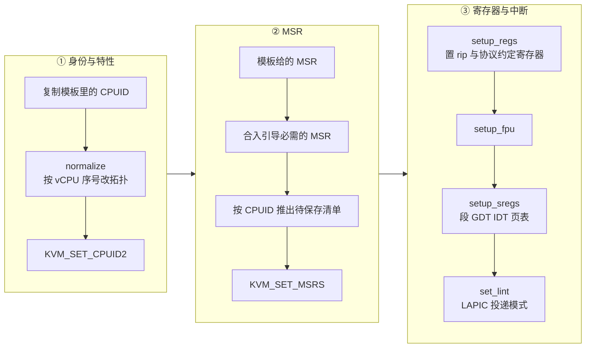

# 16 · x86_64 vCPU：寄存器、CPUID、MSR 与引导协议

> 一个刚从 KVM 创建出来的 vCPU 处于处理器上电复位的状态，既不认识内存里的内核，也不知道该从哪条指令开始执行。
> 本篇讲上游 v1.12.1 在 x86_64 上如何把它配置到「内核可以直接接手」的状态，
> 以及快照保存与恢复时这些状态按什么顺序进出 KVM。
>
> **读者**：系统工程师、对体系结构与虚拟化感兴趣的读者。
> **预备**：[第 03 篇 · 本书用到的 KVM API](03-kvm-api-primer.md)、
> [第 13 篇 · guest 内存](13-guest-memory.md)、
> [第 15 篇 · vCPU 线程与状态机](15-vcpu-threads-and-state-machine.md)。
> **代码**：`src/vmm/src/arch/x86_64/vcpu.rs`、`regs.rs`、`gdt.rs`、`msr.rs`、`interrupts.rs`、
> `xstate.rs`、`src/vmm/src/arch/x86_64/mod.rs`

---

## 0. 本篇要回答的问题

1. `KvmVcpu::configure()` 一共做了几件事，为什么是这个顺序？
2. 真实机器上由 BIOS 建立的 GDT、IDT 与页表，在 Firecracker 里由谁写进 guest 内存、写在哪里？
3. Linux 64 位引导协议与 PVH 引导协议有什么区别，Firecracker 怎么决定用哪一个？
4. 快照里的 `VcpuState` 包含哪些字段，为什么保存与恢复都有严格的顺序要求？
5. XSAVE 区域的大小为什么不是固定的，`KVM_GET_XSAVE2` 解决了什么问题？
6. TSC 频率为什么要单独处理，不处理会怎样？

---

## 1. 问题：一个新建的 vCPU 什么都不知道

`src/vmm/src/arch/x86_64/vcpu.rs` 的 `KvmVcpu::new()` 只做一件事：在 VM 的 fd 上调用
`create_vcpu()`，拿到一个 vCPU fd。这时候 KVM 内部的 vCPU 处于架构定义的复位状态：
运行在 16 位实模式、CS:IP 指向复位向量、没有页表、没有全局描述符表（GDT）、
所有 MSR 都是默认值、CPUID 是 KVM 的默认集合。

而 Firecracker 要装载的是一个已经解压好的 64 位 Linux 内核映像，它的入口点假定处理器已经处于长模式、
段寄存器已按约定装好、有一份至少覆盖内核自身的恒等映射页表、`rsi` 指向一份描述机器的参数结构。
真实机器上这段距离由 BIOS 或 UEFI 加上内核自带的实模式引导代码走完。Firecracker 没有固件：
它没有 BIOS 镜像，也不执行内核的解压段与实模式段，而是直接把处理器「摆」到内核 64 位入口所要求的状态。
这是 microVM 省掉固件与省掉几十毫秒启动时间的代价来源之一，也是它必须对引导协议了如指掌的原因 ——
协议里的每一个前置条件，都得由 VMM 亲手满足。

这件事分两半。一半是**每个 vCPU 各自的寄存器状态**，通过 vCPU fd 上的 ioctl 设置，
由 `KvmVcpu::configure()` 负责；另一半是**内存里的数据结构**（GDT、IDT、初始页表、内核命令行、
参数结构、e820 表），由 `src/vmm/src/arch/x86_64/regs.rs` 与 `mod.rs` 写进 guest 内存。
两半的分界并不整齐：`setup_sregs()` 既设置段寄存器，也顺手把 GDT 表写进内存，
因为段寄存器的值必须与内存里的描述符一致，分开写反而容易出错。

## 2. `configure()` 做的五件事

`configure()` 在 `src/vmm/src/arch/x86_64/mod.rs` 的 `configure_system_for_boot()` 里对每个 vCPU 调用一次，
参数是 guest 内存、内核入口点 `EntryPoint`、以及全局的 `VcpuConfig`。它的主体是五步，顺序固定。

### 2.1 CPUID：先归一化再写入

`VcpuConfig.cpu_config.cpuid` 是一份已经应用过 CPU 模板的 CPUID 集合，它的来源在
[第 20 篇](20-cpu-templates.md) 与 [第 21 篇](21-x86-64-cpuid-msr-normalization.md)。
`configure()` 拿到它之后先克隆一份，再调用 `cpuid.normalize()`，传三个参数：
本 vCPU 的序号、vCPU 总数、以及「每核逻辑 CPU 数需要多少位来编号」——
最后一项在 `vcpu_count > 1 && smt` 时是 1，否则是 0。

之所以每个 vCPU 都要单独归一化，是因为 CPUID 里有一部分内容是**这颗逻辑 CPU 特有的**：
初始 APIC id、拓扑 leaf 里的层级编号。模板给出的是全机器共享的特性集合，序号必须逐个填。
归一化后转换成 `kvm_bindings::CpuId` 并通过 `KVM_SET_CPUID2` 交给 KVM。

CPUID 必须第一个设置。KVM 里很多后续操作会读 vCPU 的 CPUID 来判断该不该允许——
最直接的例子是 MSR：guest CPUID 里没有某个特性，对应的 MSR 就可能写不进去。

### 2.2 MSR：三个来源合成一份清单

MSR 部分的代码在 `configure()` 中间一段，它把三类 MSR 合到一起：

- **模板指定的**：`vcpu_config.cpu_config.msrs`，模板要求 guest 看到的值；
- **引导必需的**：`msr.rs` 的 `create_boot_msr_entries()`，一共十条，
  包括 `MSR_IA32_SYSENTER_CS` / `ESP` / `EIP`、`MSR_STAR` / `CSTAR` / `LSTAR` / `SYSCALL_MASK` /
  `KERNEL_GS_BASE`（`syscall` 指令要用的一组）、`MSR_IA32_TSC`，
  以及唯一一个值非零的 `MSR_IA32_MISC_ENABLE`（置上 fast string 位）。
  这些条目在合并时**覆盖**模板的同名条目；
- **推断出来的**：`cpuid::common::msrs_to_save_by_cpuid()` 根据刚设好的 CPUID 推出「因为开了某个特性，
  所以这个 MSR 以后必须存进快照」的清单。

注意后两类的用途不同。前两类写进 KVM（`msr::set_msrs()`），第三类只加进 `self.msrs_to_save`，
也就是**快照时要读回来的 MSR 索引列表**。这个列表的基础部分来自 `Vm::msrs_to_save()`，
最初由 `msr.rs` 的 `get_msrs_to_save()` 生成：向 KVM 要 `KVM_GET_MSR_INDEX_LIST`，
再用 `msr_should_serialize()` 按一张范围白名单 `SERIALIZABLE_MSR_RANGES` 过滤。
代价是这份白名单要随内核演进手工维护：KVM 新增一个 guest 可写的 MSR，
而白名单没跟上，这个 MSR 就会在快照中丢失，恢复出来的 guest 行为与保存时不同。
代码里的 `TODO` 也承认了另一处未做的事：MSR 之间的依赖关系尚未系统化处理。

### 2.3 通用寄存器：协议约定的入口条件

`regs.rs` 的 `setup_regs()` 只设三到五个寄存器，其余全零。两种引导协议的差别在这里第一次出现：

| 寄存器 | LinuxBoot | PvhBoot |
|---|---|---|
| `rip` | 内核 ELF 入口 | PVH 入口（ELF note 给出） |
| `rflags` | `0x2`（保留位必须为 1） | `0x2` |
| `rsi` | `ZERO_PAGE_START`（`0x7000`） | 不设置 |
| `rbx` | 不设置 | `PVH_INFO_START`（`0x6000`） |
| `rsp` / `rbp` | `BOOT_STACK_POINTER`（`0x8ff0`） | 不设置 |

Linux 64 位引导协议要求 `rsi` 指向 `boot_params` 结构（俗称 zero page）；
PVH 协议要求 `rbx` 指向 `hvm_start_info`。两者互斥，所以 `layout.rs` 里
`MEMMAP_START` 与 `ZERO_PAGE_START` 用了同一个地址 `0x7000`，注释也写明了是因为互斥才敢重叠。

`setup_fpu()` 只写两个字段：`fcw = 0x37f`、`mxcsr = 0x1f80`，即 x87 控制字与 SSE 控制状态字的架构复位值。
KVM 的默认 FPU 状态不保证是这两个值，而内核入口假定 FPU 处于复位状态。

### 2.4 段、GDT、IDT 与初始页表

`setup_sregs()` 是这一步里最重的一环，它做三件事：先 `KVM_GET_SREGS` 把当前值读出来（保留 KVM 已经设好的部分），
调 `configure_segments_and_sregs()` 改段与控制寄存器，若是 LinuxBoot 再调 `setup_page_tables()`，
最后 `KVM_SET_SREGS` 写回。

`configure_segments_and_sregs()` 在 guest 内存里构造一张只有四项的 GDT：空描述符、代码段、数据段、TSS。
两种协议的描述符属性不同，因为 PVH 要求 guest 从 **32 位保护模式**开始执行，
而 LinuxBoot 要求从 **64 位长模式**开始：

- PVH：代码段属性 `0xc09b`、界限 `0xffff_ffff`（G 位置位、D/B 位置位，即 32 位段），
  `cr0` 只置 `PE | ET`，`cr4` 清零，不开分页；
- LinuxBoot：代码段属性 `0xa09b`（L 位置位，即 64 位段），`cr0` 置 `PE`，
  `efer` 置 `LME | LMA`（长模式使能且已激活）。

`gdt.rs` 的 `gdt_entry()` 按 Intel 手册的位布局拼出 8 字节描述符，
`kvm_segment_from_gdt()` 反过来把描述符拆成 KVM 需要的 `kvm_segment` 结构。
`gdt.rs` 的 `get_limit()` 里有一段值得注意的注释：GDT 描述符里的界限字段只有 20 位，
G 位置位时按 4 KiB 粒度缩放；但 VMCS 里的界限字段是 32 位且**不做缩放**，
所以从描述符还原 `kvm_segment` 时必须手工把界限左移 12 位并补上低 12 位的 1。
这件事在 64 位段上无所谓（长模式不做界限检查），但 PVH 的 32 位段必须正确，否则 guest 访问不到 4 GiB 空间。

表写在 guest 内存的低地址：GDT 在 `0x500`，IDT 在 `0x520`（写入一个零值，即一张空的中断描述符表）。
这些地址是 `regs.rs` 里的私有常量，不在 `layout.rs` 中。

页表只有 LinuxBoot 建。`setup_page_tables()` 在 `0x9000` / `0xa000` / `0xb000` 三页里
分别放 PML4、PDPTE、PDE：PML4 的首项指向 PDPTE，PDPTE 的首项指向 PDE，
PDE 里填 512 个 2 MiB 大页表项，恒等映射低 1 GiB 的虚拟地址空间。
然后置 `cr3` 指向 PML4、`cr4` 置 PAE、`cr0` 置 PG。代码注释里假定 CPU 支持 2 MiB 页；
这在长模式下由 PAE 分页天然提供，不是额外要求。
这张页表只用到内核自己建起正式页表为止，之后就被丢弃，所以覆盖 1 GiB 就够。

### 2.5 LAPIC 的投递模式

最后一步是 `interrupts.rs` 的 `set_lint()`：读出 LAPIC 状态，把 LVT0 的投递模式改成
`APIC_MODE_EXTINT`（外部中断，即来自 8259 / IOAPIC 的中断经 LINT0 投递），
把 LVT1 改成 `APIC_MODE_NMI`，再写回。这是 x86 上 BIOS 惯例性的配置，内核期望它已经生效。
LAPIC 本身由 VM 层的 `KVM_CREATE_IRQCHIP` 创建，见 [第 17 篇](17-x86-64-platform.md)。

## 3. 两种引导协议：怎么选，各自写什么

选择在 `mod.rs` 的 `load_kernel()` 里做，而且不由配置决定，由**内核映像自己**决定。
`linux_loader` 的 ELF loader 解析内核映像时会顺带查找 PVH 的 ELF note；
找到了就返回 `PvhBootCapability::PvhEntryPresent(addr)`，Firecracker 把入口点改成这个地址、
协议标成 `BootProtocol::PvhBoot`；没找到就用 ELF 的常规入口与 `BootProtocol::LinuxBoot`。
所以同一份配置换一个内核，走的引导路径可能不同。内核加载地址固定为 `layout::HIMEM_START`，即 1 MiB。

`configure_system_for_boot()` 随后按协议分支：

- `configure_64bit_boot()` 构造一个 `boot_params` 结构：填 `type_of_loader`、
  两个魔数（`boot_flag = 0xaa55`、`header = 0x53726448`）、命令行地址与长度、内核对齐要求、
  initrd 的地址与长度、以及 `acpi_rsdp_addr`（直接告诉内核 RSDP 在哪，省掉它扫描低端内存），
  再加一张 e820 表；整个结构写到 `ZERO_PAGE_START`。
- `configure_pvh()` 构造一个 `hvm_start_info`：魔数 `0x336ec578`、版本 1、命令行地址、
  内存映射表地址与条目数、模块列表（initrd 作为一个模块）；主结构写到 `PVH_INFO_START`，
  内存映射表写到 `MEMMAP_START`，模块列表写到 `MODLIST_START`。

两条路径描述内存的方式不同（e820 表 vs `hvm_memmap_table_entry` 数组），
但内容结构完全一致，都是三段或四段：`[0, SYSTEM_MEM_START)` 可用、
`[SYSTEM_MEM_START, RSDP_ADDR)` 保留（这段放 mptable 与 ACPI 表）、
`[1 MiB, MMIO 空洞起点)` 可用，内存超过 32 位空间时再加一段 4 GiB 以上的可用区。
布局常量与 MMIO 空洞的来由在 [第 17 篇](17-x86-64-platform.md) 与 [第 13 篇](13-guest-memory.md)。

内核命令行是两条路径共用的：在分支之前就由 `load_cmdline()` 写到 `CMDLINE_START`（`0x20000`），
两个参数结构里各存一个指向它的地址。这也是 x86 与 aarch64 的一处分工差异 ——
aarch64 上命令行走 FDT，见 [第 19 篇](19-aarch64-platform.md)。

## 4. 保存与恢复：顺序就是正确性

`save_state()` 与 `restore_state()` 各自读出或写入十一项状态，
它们的函数头注释是上游把踩过的坑固化下来的产物，值得逐条理解。

`VcpuState` 的字段与对应的 KVM 接口：

| 字段 | 接口 | 说明 |
|---|---|---|
| `cpuid` | `KVM_GET_CPUID2` | guest 看到的特性集合 |
| `saved_msrs` | `KVM_GET_MSRS` | 分块保存，见下 |
| `regs` / `sregs` | `KVM_GET_REGS` / `KVM_GET_SREGS` | 通用与特殊寄存器 |
| `xsave` / `xcrs` | `KVM_GET_XSAVE2` / `KVM_GET_XCRS` | 浮点与扩展状态 |
| `debug_regs` | `KVM_GET_DEBUGREGS` | 调试寄存器 |
| `lapic` | `KVM_GET_LAPIC` | 本地 APIC |
| `mp_state` | `KVM_GET_MP_STATE` | 多处理器状态（运行 / 等待 INIT 等） |
| `vcpu_events` | `KVM_GET_VCPU_EVENTS` | 待处理的异常、中断、NMI |
| `tsc_khz` | `KVM_GET_TSC_KHZ` | 可能为 `None` |

保存侧的顺序约束有三条，注释写得很清楚。第一条：`KVM_GET_MP_STATE` 在内核里会调用
`kvm_apic_accept_events()`，这个函数**可能修改 vCPU 与 LAPIC 的状态**，
所以必须排在最前面，否则先读出来的其它状态就与真正被保存的机器状态对不上。
第二条：`KVM_GET_LAPIC` 自身也可能在返回前改变 LAPIC 状态。
第三条：`KVM_GET_VCPU_EVENTS` 应当最后读，因为它可能被前面那些 GET 的内部副作用影响。
还有一条隐含前提：`KVM_GET_VCPU_EVENTS` 在别的 vCPU 还在跑的时候是不安全的 ——
所以整套保存必须在所有 vCPU 都已暂停之后进行，这一点由第 15 篇的状态机保证。

恢复侧的顺序约束更多：

1. `KVM_SET_CPUID2` 与 `KVM_SET_MP_STATE` 都依赖 `kvm_vcpu_is_bsp()`，要排在前面；
2. `KVM_SET_REGS` 会无条件清掉待处理异常，所以必须排在 `KVM_SET_VCPU_EVENTS` 之前 ——
   否则刚恢复的异常会被抹掉；
3. `KVM_SET_LAPIC` 要排在 `KVM_SET_SREGS` 之后，因为后者会恢复 APIC base MSR；
4. `KVM_SET_LAPIC` 又要排在 `KVM_SET_MSRS` 之前，因为 TSC deadline MSR 只有在 LAPIC
   配置正确时才能成功写入。

这四条串起来给出唯一的顺序：CPUID → MP state → regs → sregs → xsave → xcrs → debug regs →
LAPIC → MSRs → vcpu events。这是一条没有余地的链，改动其中任何一步都可能让恢复出的 guest
少一个待处理中断或多一个异常，而这类错误在恢复后的几秒内未必表现出来。

### 4.1 MSR 的分块与延后

MSR 的保存不是一次 ioctl。`KVM_GET_MSRS` 一次最多取 `KVM_MAX_MSR_ENTRIES` 条，
`get_msr_chunks()` 因此把索引列表切成若干块，逐块调用，结果是一个 `Vec<Msrs>`。
恢复时 `restore_state()` 按同样的顺序逐块 `KVM_SET_MSRS`，并检查返回的条数：
少于请求条数就报 `VcpuSetMsrsIncomplete`，因为 KVM 的返回值同时是「第一个出问题的条目下标」。

分块之上还叠了两层修正，都与时钟中断有关。

`extract_deferred_msrs()` 把 `DEFERRED_MSRS` 里的 MSR 从各块中摘出来，另起一块追加到最后。
这个数组目前只有一项：`MSR_IA32_TSC_DEADLINE`。原因写在常量的注释里：
KVM 在处理对 TSC_DEADLINE 的写入时会去读 `MSR_IA32_TSC` 来判断要不要武装一个定时器；
如果 TSC 还没恢复好，KVM 可能误判成不需要定时器，或者用错误的到期时间武装它，
结果是恢复出来的 guest 再也收不到时钟中断。把 TSC_DEADLINE 挪到最后，保证 TSC 已经就位。

`fix_zero_tsc_deadline_msr()` 处理另一个观察到的现象：有时快照时读到的
`MSR_IA32_TSC_DEADLINE` 是零，但对应的中断并没有投递给 guest。
恢复后这颗 vCPU 会永远等不到下一次时钟中断，除非外部（比如设置系统时间）去改这个 MSR。
修正办法是：如果读到的 TSC_DEADLINE 为零，就用同一批 MSR 里 `MSR_IA32_TSC` 的值把它填上，
相当于让定时器立即到期。这是一处对 KVM 行为的补偿，代价是牺牲了严格的状态保真度，
换恢复后不会静默卡死；代码里也打了 `warn!` 日志把这次替换记录下来。

### 4.2 TSC 频率

`tsc_khz` 是 `Option`，取不到时只打一条警告：没有 TSC 频率的快照只能恢复到与保存时同型号的宿主上。
恢复侧在 `src/vmm/src/builder.rs` 的 `build_microvm_from_snapshot()` 里先于寄存器恢复处理：
如果快照里有频率，调 `is_tsc_scaling_required()` 与当前宿主比较，
差异超过 250 ppm 就对所有 vCPU 调 `set_tsc_khz()`。
容差取 250 ppm 是因为 TSC 频率在开机标定时本来就会有微小偏差，
把这种偏差也当成需要缩放会白白引入开销。TSC 缩放依赖宿主 CPU 的硬件支持，
不支持时 `set_tsc_khz()` 会失败，恢复随之失败 —— 这是跨机型迁移快照的一道硬门槛。

## 5. XSAVE：大小不再固定

`get_xsave()` 这一段代码的复杂度全部来自一个事实：XSAVE 区域的大小不是常量。
C 的 `struct kvm_xsave` 原本是固定的 `__u32 region[1024]`，即 4096 字节；
支持 AMX 之类的动态特性之后，内核给它加了一个柔性数组成员 `extra[]`，
真实大小要通过 `KVM_CHECK_EXTENSION(KVM_CAP_XSAVE2)` 查询。

Firecracker 在 `KvmVcpu::new()` 时就从 `Vm` 那里拿到 `xsave2_size`。
`get_xsave()` 分两路：支持 `KVM_CAP_XSAVE2` 时按查询到的字节数算出柔性数组的条目数，
分配 `Xsave`（`kvm_xsave2` 的 FAM 包装）并调 `get_xsave2()`；
不支持时用老的 `KVM_GET_XSAVE` 读进一个 `len = 0` 的 `Xsave`。
恢复侧只有一条路：`set_xsave2()`。注释解释了原因 —— 内核里并不存在 `KVM_SET_XSAVE2` 这个 ioctl，
`KVM_SET_XSAVE` 被就地扩展了，`set_xsave2()` 只是 kvm-ioctls 提供的一个接受 `Xsave` 类型的包装。

与之配套的是 `xstate.rs` 的 `request_dynamic_xstate_features()`，在 `Kvm::init_arch()` 里调用，
即进程启动阶段。它通过 `arch_prctl(ARCH_GET_XCOMP_SUPP)` 查询宿主支持哪些动态 XSTATE 特性，
如果 Intel AMX 的 TILEDATA 可用就用 `ARCH_REQ_XCOMP_GUEST_PERM` 申请权限。
注释说明了不申请的后果：在 v6.4 之前的内核上，`KVM_GET_SUPPORTED_CPUID` 会返回
TILECFG 置位而 TILEDATA 未置位的半开状态；guest 按枚举出的位去执行 `XSETBV`，
而 `XSETBV` 只接受两个 AMX 位同时开或同时关，于是触发通用保护异常，guest 在启动时崩溃。
代价是 XSAVE 区域变大、快照里这一段随之变大；CPU 模板可以把这些特性重新掩掉。

## 6. `dump_cpu_config()`：另一条读取路径

`dump_cpu_config()` 与 `save_state()` 读的是同一颗 vCPU，用途完全不同。
它服务于 `cpu-template-helper` 工具（[第 22 篇](22-aarch64-templates-and-helper.md)），
要的是「这台机器上能看到的全部 CPU 配置」，而不是「快照需要的那一份」。
所以它用 `msr::get_msrs_to_dump()` 而不是 `get_msrs_to_save()`：
前者的过滤条件是 `msr_is_dumpable()`，排除的是 `UNDUMPABLE_MSR_RANGES` 里那些
`KVM_GET_MSR_INDEX_LIST` 会列出、但 `KVM_GET_MSRS` 实际取不到的 MSR。
取不到的原因写在注释里：Firecracker 在 CPUID 归一化时默认关掉了 PMU（leaf 0xA），
于是一批性能监控 MSR 在 KVM 里变成不可读。这两张表的方向相反 ——
一张是白名单（哪些值得存），一张是黑名单（哪些根本读不出来），
合起来说明同一个问题：MSR 的可用性依赖 CPUID，两者必须一起看。

## 7. 后续各层的差异

e2b 定制版没有改动 `src/vmm/src/arch/x86_64/` 下的任何文件。
ARM 适配版在 `src/vmm/src/arch/x86_64/vcpu.rs` 里加了 `restore_state_in_place()`，
它直接转调 `restore_state()`：x86_64 上本篇讲的这条恢复序列可以直接作用于一个已经跑过的 vCPU fd，
不需要重建，所以原地回滚与常规恢复在这一层合流。aarch64 上情况不同，
见 [第 18 篇](18-aarch64-vcpu.md) 与 [第 71 篇 · 回滚的 vCPU 与 GIC](71-rollback-vcpu-and-gic.md)。

## 8. 小结

- 新建的 vCPU 处于架构复位状态；Firecracker 没有固件，内核入口所要求的全部前置条件都由 VMM 自己建立。
- `configure()` 的顺序是 CPUID → MSR → 通用寄存器 → FPU → 段与页表 → LAPIC。
  CPUID 必须最先，因为 MSR 的可写性依赖它。
- GDT 写在 guest 内存 `0x500`、IDT 在 `0x520`、初始页表在 `0x9000` 起的三页；
  页表只在 LinuxBoot 下建立，恒等映射低 1 GiB。
- 引导协议由内核映像里有没有 PVH 的 ELF note 决定，不由配置决定；
  LinuxBoot 用 `rsi` 指向 zero page，PVH 用 `rbx` 指向 `hvm_start_info`，两者的地址故意重叠因为互斥。
- `save_state()` 与 `restore_state()` 的顺序由 KVM 内部的副作用决定：
  MP state 最先读、vcpu events 最后读；恢复时 regs 必须在 vcpu events 之前，
  LAPIC 夹在 sregs 与 MSRs 之间。
- MSR 分块读写，`MSR_IA32_TSC_DEADLINE` 被延后到最后一块，零值还会被替换成 TSC 的值，
  两处都是为了恢复后时钟中断不丢。
- XSAVE 区域大小可变，靠 `KVM_CAP_XSAVE2` 查询；动态特性的权限要在进程启动时用 `arch_prctl` 申请，
  否则半开的 AMX 枚举会让 guest 在 `XSETBV` 上崩溃。
- 快照里没有 TSC 频率时只能恢复到同型号宿主；有频率时超过 250 ppm 才做缩放，缩放依赖硬件支持。

## 延伸阅读 / 下一篇

- [第 15 篇 · vCPU 线程与状态机](15-vcpu-threads-and-state-machine.md)：`configure()` 之后 vCPU 线程怎么跑。
- [第 17 篇 · x86_64 平台](17-x86-64-platform.md)：本篇用到的布局常量、irqchip 与 ACPI 表从哪来。
- [第 18 篇 · aarch64 vCPU](18-aarch64-vcpu.md)：同一件事在另一个架构上的做法，对照着读差异最清楚。
- [第 21 篇 · x86_64 CPUID 与 MSR 归一化](21-x86-64-cpuid-msr-normalization.md)：`normalize()` 到底改了什么。
- [第 37 篇 · 创建快照](37-snapshot-create.md)、[第 38 篇 · 加载快照](38-snapshot-load.md)：
  `VcpuState` 在整份快照里的位置。
- 上游文档 `docs/cpu_templates/cpuid-normalization.md`；Linux 内核源码树的
  `Documentation/arch/x86/boot.rst`（64 位引导协议）与 `Documentation/arch/x86/xstate.rst`。
