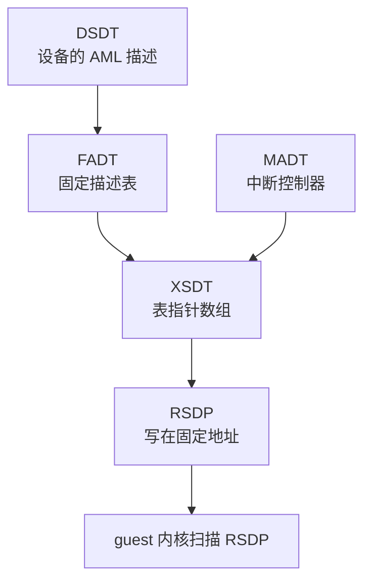

# 17 · x86_64 平台：内存布局、ACPI、mptable 与时钟

> 配置好 vCPU 只解决了「从哪条指令开始跑」。guest 内核还要知道这台机器有几颗 CPU、
> 中断控制器在哪、串口在哪、virtio 设备挂在哪个地址。本篇讲上游 v1.12.1 在 x86_64 上
> 怎么摆放这些信息，以及 VM 这一层向 KVM 要了哪些东西。
>
> **读者**：系统工程师。
> **预备**：[第 13 篇 · guest 内存](13-guest-memory.md)、
> [第 16 篇 · x86_64 vCPU](16-x86-64-vcpu.md)。
> **代码**：`src/vmm/src/arch/x86_64/layout.rs`、`vm.rs`、`mptable.rs`、`kvm.rs`、`cpu_model.rs`、
> `src/vmm/src/acpi/`、`src/acpi-tables/src/`、`src/vmm/src/device_manager/resources.rs`

---

## 0. 本篇要回答的问题

1. guest 物理地址空间是怎么划分的，MMIO 空洞为什么在 4 GiB 以下 768 MiB 处？
2. 中断控制器由谁创建，为什么必须在创建 vCPU 之前？
3. Firecracker 用哪些方式把硬件信息告诉 guest，mptable 与 ACPI 是什么关系？
4. 五张 ACPI 表分别描述什么，写在 guest 内存的哪里，空间由谁分配？
5. 快照里 VM 这一层保存的是什么，为什么保存时要清掉一个时钟标志位？
6. 暂停一台 microVM 为什么要额外调 `KVM_KVMCLOCK_CTRL`？

---

## 1. 问题：一台没有固件的机器怎么自我介绍

真实的 x86 机器上，硬件清单由固件交给操作系统：BIOS 在低端内存里留下 MP table，
UEFI 在内存某处留下一组 ACPI 表，操作系统按约定的位置去找。
Firecracker 没有固件，这些数据结构必须由 VMM 自己在 guest 内存里构造好，
再通过引导协议里的指针或者约定的扫描地址告诉内核。

这件事有三个层次，本篇按这个顺序展开：

- **地址空间怎么划分**：哪一段是 RAM、哪一段留给 MMIO、哪一段放系统数据结构；
- **KVM 里创建哪些设备**：中断控制器、定时器，以及它们必须在什么时刻创建；
- **信息怎么描述给 guest**：mptable（旧）与 ACPI 表（新），以及两者并存的原因。

## 2. 地址空间：`layout.rs` 的常量表

`src/vmm/src/arch/x86_64/layout.rs` 是一张地址常量表，
`src/vmm/src/arch/x86_64/mod.rs` 里还有三个与 MMIO 空洞有关的常量。合起来是这样一张图：

```text
GPA
0x0000_0000  ┌──────────────────────────────────┐
             │ 0x0500 GDT   0x0520 IDT          │
             │ 0x6000 hvm_start_info   PVH      │
             │ 0x7000 zero page / memmap        │
             │ 0x8ff0 引导栈顶                  │
             │ 0x9000 PML4  0xa000 PDPTE        │
             │ 0xb000 PDE                       │
             │ 0x2_0000 内核命令行 上限 2048 B  │
0x0009_fc00  ├──────────────────────────────────┤
             │ SYSTEM_MEM 257 KiB               │
             │   mptable + DSDT/FADT/MADT/XSDT  │
0x000e_0000  ├──────────────────────────────────┤  RSDP_ADDR
             │ RSDP                             │
0x0010_0000  ├──────────────────────────────────┤  HIMEM_START 1 MiB
             │ 内核映像、initrd、guest RAM      │
             │                                  │
0xd000_0000  ├──────────────────────────────────┤  MMIO_MEM_START
             │ MMIO 空洞 768 MiB                │
             │   0xfec0_0000 IOAPIC             │
             │   0xfee0_0000 LAPIC              │
             │   0xfffb_d000 KVM TSS            │
0x1_0000_0000├──────────────────────────────────┤  4 GiB
             │ 内存超 3.25 GiB 时的剩余 RAM     │
             └──────────────────────────────────┘
```

MMIO 空洞的位置由三个常量确定：`FIRST_ADDR_PAST_32BITS` 是 4 GiB，
`MEM_32BIT_GAP_SIZE` 是 768 MiB，`MMIO_MEM_START` 是两者相减，即 `0xd000_0000`。
留在 32 位空间的高端而不是别处，是因为 LAPIC 与 IOAPIC 的架构默认地址就在这一段
（`0xfee0_0000` 与 `0xfec0_0000`），KVM 的 TSS 地址 `0xfffb_d000` 也在这里；
把整段留空，virtio-mmio 设备才能在其中按需分配而不与固定地址冲突。
代价是配置超过 3.25 GiB 内存的 microVM 会被这个空洞切成两段 guest 内存区域，
`arch_memory_regions()` 里那三个分支处理的就是这件事（见 [第 13 篇](13-guest-memory.md)）。

`SYSTEM_MEM_START` 取 `0x9fc00`，即传统上 EBDA（extended BIOS data area）的起点，
到 `RSDP_ADDR`（`0xe0000`）为止共 257 KiB，专门放系统数据结构。
`layout.rs` 里那段长注释算过账：FADT 276 字节、XSDT 52 字节、MADT 最多 2104 字节、
DSDT 约 1907 字节、mptable 最多 5304 字节，合起来远小于 257 KiB，留的余量是给以后的表用的。

这段空间的分配器是 `device_manager/resources.rs` 的 `ResourceAllocator`，
它管三样东西：GSI（中断线号，范围 `IRQ_BASE = 5` 到 `IRQ_MAX = 23`）、
MMIO 空洞里的地址、以及这片系统内存。mptable 与每一张 ACPI 表都通过
`allocate_system_memory()` 拿地址，用 `AllocPolicy::FirstMatch` 从低地址往上排。
RSDP 是唯一的例外：它写在写死的 `RSDP_ADDR`，不走分配器，因为 guest 要靠固定位置找到它。

## 3. VM 这一层：irqchip、PIT 与 TSS

`src/vmm/src/arch/x86_64/vm.rs` 的 `ArchVm` 是 VM 的架构相关部分。`ArchVm::new()` 做三件事：

1. 从 `Kvm` 取 `msrs_to_save`（[第 16 篇](16-x86-64-vcpu.md) 讲过的可序列化 MSR 索引列表）；
2. 查询 `KVM_CAP_XSAVE2` 得到 XSAVE 区域的字节数，缓存在 `xsave2_size` 里 ——
   注释说明缓存的目的是不必在每次创建 vCPU 时都查一遍；
3. 调 `KVM_SET_TSS_ADDR`，把 `layout::KVM_TSS_ADDRESS`（`0xfffb_d000`）交给 KVM。
   这是 Intel VT-x 的要求：VMX 需要一段 guest 物理内存放任务状态段，
   而这段内存不能与 guest 自己用的内存重叠，所以放在 MMIO 空洞里。

`arch_pre_create_vcpus()` 调用 `setup_irqchip()`，函数名与调用时机都说明了一件事：
**x86_64 上中断控制器必须在 `KVM_CREATE_VCPU` 之前创建**。
原因是 `KVM_CREATE_IRQCHIP` 会在内核里建立 PIC、IOAPIC 与每颗 vCPU 的 LAPIC 模型；
vCPU 创建之后再建就来不及给已有的 vCPU 装 LAPIC。aarch64 恰好相反，
GIC 要在 vCPU 创建之后才能建（见 [第 19 篇](19-aarch64-platform.md)），
所以 `ArchVm` 同时提供了 `arch_pre_create_vcpus()` 与 `arch_post_create_vcpus()` 两个钩子，
x86 用前者、aarch64 用后者。

`setup_irqchip()` 之后还调 `KVM_CREATE_PIT2`，建立内核态的 8254 可编程间隔定时器，
`flags` 置 `KVM_PIT_SPEAKER_DUMMY`。这个标志的作用写在注释里：
让 KVM 模拟一个哑的扬声器端口（0x61），guest 写这个端口时不会退出到用户态。
不加这个标志也能跑，但每次写都要一次 VM exit 进 Firecracker 再返回，
而 guest 内核在校准延时循环时会频繁碰这个端口。

`src/vmm/src/arch/x86_64/kvm.rs` 里的 `DEFAULT_CAPABILITIES` 列了 14 项能力，
在 `Kvm::new()` 中逐项用 `KVM_CHECK_EXTENSION` 验证，缺一项就启动失败。
这张表等于 Firecracker 对宿主内核的最低要求声明：`KVM_CAP_IRQCHIP`、`KVM_CAP_PIT2`、
`KVM_CAP_IOEVENTFD`、`KVM_CAP_IRQFD`、`KVM_CAP_USER_MEMORY`、`KVM_CAP_SET_TSS_ADDR`、
`KVM_CAP_ADJUST_CLOCK`、`KVM_CAP_MP_STATE`、`KVM_CAP_VCPU_EVENTS`、`KVM_CAP_XCRS`、
`KVM_CAP_XSAVE`、`KVM_CAP_EXT_CPUID` 等。CPU 模板可以往这张表里追加要检查的能力。
`KVM_CAP_XSAVE2` 不在表里，因为它可以没有，只是快照里的 XSAVE 区域退回固定的 4096 字节。

这张表也说明了 Firecracker 对 KVM 的依赖形态：它不做任何设备的用户态模拟兜底。
PIC、IOAPIC、LAPIC、PIT 全部由内核态模型提供，Firecracker 只负责创建它们、
在快照时把状态搬进搬出。好处是中断投递不经过用户态，
一次 guest 写 LAPIC 寄存器不会变成一次 VM exit 加一次上下文切换；
代价是这些能力必须由宿主内核提供，缺一项就完全跑不起来，没有降级路径。

`cpu_model.rs` 提供的是另一类判断：用 `CPUID.01H:EAX` 解析出宿主的 family / model / stepping，
并给出 Skylake、Cascade Lake、Ice Lake、AMD Milan 四个已知型号的常量。
它服务于 CPU 模板：某些模板只在特定型号及以上的宿主上才能安全应用（见 [第 21 篇](21-x86-64-cpuid-msr-normalization.md)）。

## 4. 把硬件清单交给 guest

`configure_system_for_boot()` 在配置完所有 vCPU、写完命令行之后，
先无条件调用 `mptable::setup_mptable()`，再按引导协议写 `boot_params` 或 `hvm_start_info`，
最后调用 `acpi::create_acpi_tables()`。两套机制都写，guest 用哪套由它自己的内核配置决定。

### 4.1 mptable：Intel MP Spec 1.4 的遗产

`mptable.rs` 按 Intel 多处理器规范 1.4 构造一张表，内容是：一个浮动指针结构 `mpf_intel`
（签名 `_MP_`，guest 内核靠扫描这个签名找到它）、一个 `mpc_table` 表头，
后面跟着若干条目：每颗 vCPU 一条 `mpc_cpu`（0 号标记为引导处理器）、
一条 `mpc_ioapic`、一条 ISA 总线 `mpc_bus`、`IRQ_MAX + 1` 条中断源 `mpc_intsrc`、
两条本地中断源 `mpc_lintsrc`。表头与浮动指针各带一个校验和，
`compute_checksum()` 与 `mpf_intel_compute_checksum()` 负责算。

上限是 `MAX_SUPPORTED_CPUS = 254`，注释解释了这个数：xAPIC 只有 255 个 APIC id，
IOAPIC 占掉一个。Firecracker 自己的 vCPU 上限比这个小得多，所以这条检查实际不会触发。

这套机制正在退场。上游 CHANGELOG 与 `docs/kernel-policy.md` 说明：
自从 Firecracker 支持 ACPI 之后，靠 mptable 引导的 guest 内核已被标记为废弃，
建议用户在 guest 内核里关掉 `CONFIG_X86_MPPARSE` 与 `CONFIG_VIRTIO_MMIO_CMDLINE_DEVICES`，
改用 ACPI 描述的设备。v1.12.1 仍然无条件写 mptable，是废弃期内的兼容措施。
代价是每次启动都要多写几 KiB 的表，以及 `SYSTEM_MEM` 里要一直为它留位置。

### 4.2 ACPI：五张表与写入顺序

ACPI 部分在 `src/vmm/src/acpi/`，表的字节编码在独立的 `acpi-tables` crate（`src/acpi-tables/src/`）里。
`create_acpi_tables()` 的顺序不是随意的 —— 每张表要写进上一张表的地址：



- **DSDT** 先建，因为 FADT 里要填它的地址。它的内容是一段 AML 字节码，由三部分拼成：
  `MMIODeviceManager.dsdt_data`（每个 virtio 设备一段）、`ACPIDeviceManager` 追加的
  GED 与 VMGenID、以及 `acpi/x86_64.rs` 的 `setup_arch_dsdt()` 追加的四个串口。
- **FADT** 填 DSDT 地址、hypervisor 厂商标识 `FIRECKVM`，
  置三个标志位：硬件精简（hardware-reduced ACPI）、有电源按钮、有睡眠按钮；
  再由 `setup_arch_fadt()` 置 IA-PC 引导架构标志，告诉 guest 没有 VGA、不支持 ASPM、没有 MSI 中断。
- **MADT** 由 `setup_interrupt_controllers()` 生成：一条 IOAPIC 条目加每颗 vCPU 一条 LocalAPIC 条目。
- **XSDT** 只收两个指针：FADT 与 MADT。
- **RSDP** 指向 XSDT，写在固定的 `RSDP_ADDR`。此外 LinuxBoot 路径还会把这个地址填进
  `boot_params.acpi_rsdp_addr`，让内核不必扫描低端内存去找它。

所有表的 OEM id 都是 `FIRECK`，表签名各带一个 `FCVM` 前缀，方便在 guest 里辨认来源。

### 4.3 DSDT 里的三类设备

virtio 设备的 AML 由 `device_manager/mmio.rs` 的 `add_virtio_aml()` 生成，
每个设备一个 `_SB_.Vnnn` 节点，硬件 id 固定为 `LNRO0005`（Linux 给 virtio-mmio 分配的 ACPI id），
资源模板里给出 MMIO 地址范围与中断号。这段代码上方有一条注释解释了为什么要按添加顺序生成 AML
而不是事后遍历总线：DSDT 里设备出现的顺序决定 guest 里的设备命名，
根块设备必须排在最前，才能在 guest 里叫 `/dev/vda`。这是一个被序依赖绑住的实现细节。

legacy 设备由 `device_manager/legacy.rs` 的 `PortIODeviceManager::append_aml_bytes()` 描述：
四个串口 `_SB_.COM1` 到 `COM4`，PIO 地址 `0x3f8` / `0x2f8` / `0x3e8` / `0x2e8`。
i8042 键盘控制器也由这个管理器创建（它的唯一用途是接收 guest 的复位请求）。

VMGenID 是第三类。它是一段 16 字节的 guest 内存加一个 GSI，
用来在 guest 从快照恢复时通知它「世界分叉了」，好让 guest 重新播种随机数生成器。
它的 AML 由 `device_manager/acpi.rs` 的 `ACPIDeviceManager::append_aml_bytes()` 生成，
其中包含一段 GED（generic event device）的 `_EVT` 方法，按 GSI 号分发通知。
`devices/acpi/vmgenid.rs` 的 `VmGenId::new()` 向 `ResourceAllocator` 各要一个 GSI
与一段 MMIO 空间；`notify_guest()` 往 irqfd 写一次，触发 guest 侧的 GED 中断。
注释里点明了一个前提：这个通知只有在 guest 内存里的代际值**已经被改过**之后才有意义 ——
先写值，再通知，顺序反了 guest 会读到旧值。

`ACPIDeviceManager` 本身不是 x86_64 专有的：`src/vmm/src/device_manager/acpi.rs`
没有任何 `cfg(target_arch)`，两个架构上 `Vmm` 都有这个字段，唯一的成员也都是
`Option<VmGenId>`。差别只在 guest 怎么看到这个设备 —— x86_64 上经本节的 AML，
aarch64 上经一个 FDT 节点，那里没有 ACPI 表（[第 19 篇](19-aarch64-platform.md)）。

这三类设备的信息都只存在于 DSDT 里，而 DSDT 是在 `configure_system_for_boot()`
这一步一次性生成并写进 guest 内存的，代码里没有任何在运行中重新生成或修改它的路径。
推论：这与「配置阶段与运行阶段严格分离」的控制面设计（见 [第 09 篇](09-rpc-interface.md)）互为因果 ——
既然设备只能在启动前配置，平台描述就不必支持增量更新；
反过来，要支持运行中新增设备，就得先解决 ACPI 命名空间如何变更的问题。

## 5. 时钟：三个层次

x86 上的时间来源不止一个，Firecracker 对每一个都要处理。

**TSC** 是 vCPU 级别的，属于 `VcpuState`（[第 16 篇 §4.2](16-x86-64-vcpu.md#42-tsc-频率)）。

**PIT** 是 VM 级别的内核态设备，状态通过 `KVM_GET_PIT2` / `KVM_SET_PIT2` 进出快照。

**kvmclock** 是 KVM 提供的半虚拟化时钟，VM 级别，状态通过 `KVM_GET_CLOCK` / `KVM_SET_CLOCK` 存取。
`ArchVm::save_state()` 读出 `kvm_clock_data` 之后有一行：
清掉 `KVM_CLOCK_TSC_STABLE` 标志位，注释写明原因 —— 这个位在 `KVM_SET_CLOCK` 时不被接受。
它是 KVM 向用户态报告「本次读数基于稳定的 TSC」的输出标志，不是可以写回去的输入。

还有一处与时钟有关的操作不在快照路径上。vCPU 每次从运行转入暂停时
（`src/vmm/src/vstate/vcpu.rs` 处理 `VcpuEvent::Pause` 的分支），
都会额外调一次 `KVM_KVMCLOCK_CTRL`。注释解释了它的作用：
guest 内核的 soft lockup 检测器看到某颗 CPU 长时间没有推进就会 panic，
而暂停一台 microVM 恰好会造成这种现象；`KVM_KVMCLOCK_CTRL` 告诉 guest
「这段停顿是被宿主暂停造成的，不要报 lockup」。这个调用失败时只记一条 metrics 与警告，
不让暂停失败 —— 注释的措辞是「取决于负载，失败可能是可接受的」。

## 6. VM 层的快照内容

`VmState`（x86_64）一共六个字段：`memory`（`GuestMemoryState`，即各内存区域的描述，
见 [第 13 篇](13-guest-memory.md)）、`pitstate`、`clock`、`pic_master`、`pic_slave`、`ioapic`。
后三个都是 `kvm_irqchip` 结构，靠 `chip_id` 区分：主 8259、从 8259、IOAPIC。

`restore_state()` 的写入顺序是 PIT → clock → 主 PIC → 从 PIC → IOAPIC。
与 vCPU 状态不同，这里没有注释说明顺序约束；
这些设备之间没有 vCPU 那种通过 KVM 内部副作用互相影响的关系。
恢复的完整顺序在 `src/vmm/src/builder.rs` 的 `build_microvm_from_snapshot()` 里：
先注册内存区域，再处理 TSC 缩放，再逐个恢复 vCPU 状态，最后恢复 VM 状态与设备状态。

`VmState` 里带 `memory` 这一项，说明 VM 层保存的不只是 KVM 设备状态，
还有「内存被切成了哪几段、每段多大」这份描述。恢复时必须先按这份描述重建
同样的内存区域并注册成 memslot，KVM 设备状态才有意义 ——
IOAPIC 的重定向表项、PIT 的计数值都指向具体的地址与中断线。

注意 ACPI 表与 mptable **不在快照里**。它们是写进 guest 内存的普通数据，
随内存一起被保存和恢复，恢复时不需要重新生成 ——
这也意味着从快照恢复出来的 microVM 里，DSDT 描述的设备拓扑是保存时的那一份，
设备必须按同样的地址与中断号重建，否则 guest 看到的与实际的对不上。

## 7. 后续各层的差异

e2b 定制版没有改动本篇涉及的任何文件。
ARM 适配版在 `src/vmm/src/devices/acpi/vmgenid.rs` 里加了 `refresh_generation()`：
原地回滚把 guest 内存倒回到它已经经历过的一个时刻，需要用 VMGenID 的换代通知
告诉 guest 这件事，好让它重新播种随机数生成器。
见 [第 72 篇 · 回滚的设备状态](72-rollback-devices.md)。

## 8. 小结

- guest 物理地址空间的划分写死在 `layout.rs` 与 `mod.rs` 的常量里：
  低 640 KiB 放引导数据结构，`0x9fc00` 起 257 KiB 放 mptable 与 ACPI 表，1 MiB 起是 RAM，
  4 GiB 以下 768 MiB 是 MMIO 空洞。
- MMIO 空洞设在 32 位空间高端，是为了容纳 LAPIC、IOAPIC、KVM TSS 这些架构固定地址；
  代价是内存超过 3.25 GiB 的 microVM 被切成两段内存区域。
- 中断控制器与 PIT 由 `setup_irqchip()` 在**创建 vCPU 之前**建立，
  这是 x86 与 aarch64 在 `ArchVm` 上分出前后两个钩子的原因。
- Firecracker 同时写 mptable 与 ACPI 表。前者已被上游标记为废弃，
  但 v1.12.1 仍无条件写入，属于兼容期的成本。
- ACPI 五张表的生成顺序由指针依赖决定：DSDT → FADT → MADT → XSDT → RSDP；
  除 RSDP 写在固定地址外，其余都由 `ResourceAllocator` 从系统内存区分配。
- DSDT 里 virtio 设备的 AML 必须按添加顺序生成，因为顺序决定 guest 里的设备命名。
- 时钟分三层：TSC 属于 vCPU 状态，PIT 与 kvmclock 属于 VM 状态；
  保存 kvmclock 时要清掉 `KVM_CLOCK_TSC_STABLE`，因为它只是输出标志。
- 暂停 vCPU 时调用 `KVM_KVMCLOCK_CTRL` 是为了避免 guest 的 soft lockup 检测器在恢复后 panic；
  失败只记 metrics，不阻断暂停。
- ACPI 表与 mptable 不单独进快照，它们随 guest 内存一起保存；
  因此恢复时设备必须按同样的地址与中断号重建。

## 延伸阅读 / 下一篇

- [第 13 篇 · guest 内存](13-guest-memory.md)：MMIO 空洞如何把内存切成两段区域。
- [第 16 篇 · x86_64 vCPU](16-x86-64-vcpu.md)：本篇的布局常量在引导协议里怎么用。
- [第 19 篇 · aarch64 平台](19-aarch64-platform.md)：同样的问题在 aarch64 上由 FDT 与 GIC 解决。
- [第 24 篇 · legacy 设备](24-legacy-devices.md)：串口、i8042 与 RTC 的细节。
- [第 38 篇 · 加载快照](38-snapshot-load.md)：`VmState` 在恢复流程里的位置。
- 上游文档 `docs/kernel-policy.md`（ACPI 与 MPTable 的过渡说明）；
  ACPI 6.5 规范第 5 章（表结构与 IA-PC 引导架构标志）；Intel MultiProcessor Specification 1.4。
