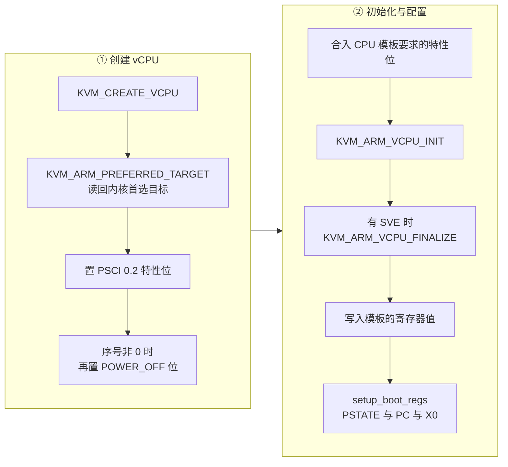

# 18 · aarch64 vCPU：KVM_ARM_VCPU_INIT、寄存器与 PSCI

> 在 aarch64 上，一个刚创建出来的 vCPU 还不是一颗可以运行的处理器：它必须先被告知要模拟哪一种 CPU、
> 打开哪些特性，才会有寄存器可读可写。本篇讲上游 v1.12.1 怎么走完这条初始化路径，
> aarch64 的寄存器如何用一个 64 位 ID 统一寻址，vCPU 状态怎么进出快照，以及 PSCI 在多核启动与关机中的角色。
>
> **读者**：系统工程师、需要在 ARM 上做快照或回滚的开发者。
> **预备**：[第 03 篇 · 本书用到的 KVM API](03-kvm-api-primer.md)、
> [第 15 篇 · vCPU 线程与状态机](15-vcpu-threads-and-state-machine.md)。
> **代码**：`src/vmm/src/arch/aarch64/vcpu.rs`、`regs.rs`、`cache_info.rs`、`kvm.rs`、
> `src/vmm/src/cpu_config/aarch64/mod.rs`

---

## 0. 本篇要回答的问题

1. `KVM_ARM_VCPU_INIT` 做的是什么，为什么 x86_64 上没有对应的一步？
2. aarch64 的寄存器 ID 是怎么编码的，为什么这种编码让快照代码可以完全不认识具体寄存器？
3. 引导一个 aarch64 microVM 时，Firecracker 只设置了哪几个寄存器？
4. 从快照恢复 vCPU 时，`KVM_ARM_VCPU_INIT` 为什么还要再调一次？
5. 多核 guest 的次核是怎么起来的，关机与重启走的是哪条路径？
6. guest 看到的缓存拓扑从哪来？

---

## 1. 问题：ARM 没有「一种 CPU」

x86_64 的 vCPU 一创建就处于架构定义的复位状态，可以直接读写寄存器；要模拟成哪一款处理器，
是靠后续写入 CPUID 与 MSR 来表达的（[第 16 篇](16-x86-64-vcpu.md)）。
aarch64 没有 CPUID 这样一条统一的特性枚举指令，处理器的身份写在一组只读的 ID 系统寄存器里，
而这些寄存器的值取决于宿主硬件；同时 ARM 的虚拟化扩展允许 KVM 提供一些**可选**的虚拟化特性
（PSCI 版本、是否带 SVE、次核是否上电），这些必须在 vCPU 能用之前就定下来。

KVM 因此在 ARM 上多了一步：`KVM_ARM_VCPU_INIT`。它接受一个 `kvm_vcpu_init` 结构，
里面是「目标 CPU 类型」加一组特性位。调用之前，vCPU fd 存在但几乎什么也做不了；
调用之后，vCPU 处于该类型处理器的复位状态，寄存器可以读写。
这一步也可以重复调用，语义是把 vCPU 重新复位。第 6 节会看到 Firecracker 正是靠这个语义实现快照恢复。

代价是初始化路径比 x86_64 长，而且分散在几个函数里：目标类型在 `KvmVcpu::new()` 里查，
特性位在 `KvmVcpu::init()` 里合并，真正的 ioctl 在私有的 `init_vcpu()` 里发出。
下一节把这条路径串起来。

## 2. 初始化：四个步骤



**第一步在 `KvmVcpu::new()` 里。** 拿到 vCPU fd 之后立刻调用 `Self::default_kvi(vm.fd())`，
它先用 `KVM_ARM_PREFERRED_TARGET` 让内核填进「本机上推荐使用的目标类型」——
Firecracker 不自己挑 CPU 型号，直接采纳宿主内核的建议。然后无条件置上 `KVM_ARM_VCPU_PSCI_0_2`
特性位；这个能力在 `Kvm::DEFAULT_CAPABILITIES`（`src/vmm/src/arch/aarch64/kvm.rs`）里已经被检查过，
所以这里的注释写的是「我们已经确认这个能力被支持」。

紧接着是一个与多核启动直接相关的判断：`if 0 < index` 时额外置上 `KVM_ARM_VCPU_POWER_OFF`。
**序号非 0 的 vCPU 一开始是断电的**，它们要等主核通过 PSCI 把自己叫醒。第 7 节展开。

**第二步在 `KvmVcpu::init()` 里**，由 `src/vmm/src/cpu_config/aarch64/mod.rs` 的
`CpuConfiguration::new()` 对每个 vCPU 调用一次。它先把 CPU 模板里的 `vcpu_features`
按位合入 `self.kvi.features`（模板可以要求打开 SVE 之类的特性，见[第 22 篇](22-aarch64-templates-and-helper.md)），
再调 `init_vcpu()` 发出 `KVM_ARM_VCPU_INIT`，最后调 `finalize_vcpu()`。

`finalize_vcpu()` 只在 `KVM_ARM_VCPU_SVE` 特性位被置上时才做事，调用 `KVM_ARM_VCPU_FINALIZE`。
SVE 需要两阶段初始化：`VCPU_INIT` 之后、`FINALIZE` 之前的那个窗口，是唯一可以设置向量长度的时机。
这段代码里的 `vcpu_finalize(&feature).unwrap()` 用的是 `unwrap`，失败会 panic 而不是返回错误；
这是路径上少见的一处，后果是宿主上 SVE 相关的内核问题会表现为进程崩溃而不是 API 报错。

**模板寄存器与引导寄存器在 `configure()` 里**，第 4 节讲。

顺序上有一个约束值得记住：`KVM_ARM_VCPU_INIT` 发生在 GIC 创建之后。
`Vm::create_vcpus()` 先建全部 vCPU fd，再在 `arch_post_create_vcpus()` 里建 GIC
（原因见[第 19 篇 · aarch64 平台](19-aarch64-platform.md)），
而 `KvmVcpu::init()` 要等到 `configure_system_for_boot()` 才被调用。

## 3. 寄存器：一个 ID 管所有

x86_64 的 vCPU 状态是一组结构体：`kvm_regs`、`kvm_sregs`、`kvm_fpu`、`kvm_msrs` 各有各的 ioctl。
aarch64 只有两个 ioctl：`KVM_GET_ONE_REG` 与 `KVM_SET_ONE_REG`，
每次读写一个寄存器，由一个 64 位的 ID 指定是哪一个、有多宽。

```text
 63      56 55  52 51            32 31          16 15           0
+----------+------+----------------+--------------+-------------+
|   0x60   | size |      保留      |     class    |    index    |
+----------+------+----------------+--------------+-------------+
 KVM_REG_ARM64    3 = 64 位        0x0010 核心寄存器
                  4 = 128 位       0x0013 系统寄存器
                  6 = 512 位       0x0015 SVE
```

`src/vmm/src/arch/aarch64/regs.rs` 里有两个宏把这套编码封起来：

- `arm64_core_reg_id!(size, offset)` 给核心寄存器用。它的 index 部分是该寄存器在内核
  `struct kvm_regs` 里的字节偏移除以 4。所以代码里写的是 `offset_of!(user_pt_regs, pc) + offset_of!(kvm_regs, regs)`
  这样的表达式——寄存器 ID 直接由内核结构体的布局推出来，不是一张手写的常量表。
- `arm64_sys_reg!(名字, op0, op1, crn, crm, op2)` 给系统寄存器用，
  把 ARM 指令编码里的五个字段拼进 index。`MPIDR_EL1`、`MIDR_EL1`、`TTBR1_EL1`、
  `SYS_CNTV_CVAL_EL0` 这些常量都是这么定义的。

这套编码的实际价值在快照代码里。`Aarch64RegisterVec` 是一个「ID 数组 + 连续字节数组」的容器，
`push()` 时按 ID 算出宽度并把数据追加进去，`iter()` 按同样的规则切出来。
宽度从 ID 的 size 字段推出：`reg_size()` 就是 `2^((id & KVM_REG_SIZE_MASK) >> KVM_REG_SIZE_SHIFT)`。
于是保存和恢复代码**完全不需要认识任何一个具体寄存器**：它只是把一串 ID 与对应的字节搬来搬去。
反序列化时还会检查每个 ID 的宽度不超过 2048 位，超过就报错，避免用一个构造过的快照文件撑爆内存。

代价是它放弃了类型检查。快照文件里的寄存器 ID 是否属于当前宿主内核认识的集合，
要等到 `KVM_SET_ONE_REG` 才知道；一个 ID 集合不同的宿主会在恢复时报 `SetOneReg` 错误，
而不是在解析阶段就被识别出来。

## 4. `configure()`：只设置四个寄存器

`KvmVcpu::configure()` 做两件事。先把 CPU 模板产出的 `vcpu_config.cpu_config.regs` 逐个
`set_one_reg()` 写进去；再调 `setup_boot_regs()`。

`setup_boot_regs()` 设置的寄存器少得出人意料：

| 寄存器 | 值 | 谁被设置 |
|---|---|---|
| `PSTATE` | `PSTATE_FAULT_BITS_64` | 全部 vCPU |
| `PC` | 内核入口地址 | 仅 vCPU 0 |
| `X0` | FDT 在 guest 内存里的地址 | 仅 vCPU 0 |
| `KVM_REG_ARM_PTIMER_CNT` | 0 | 仅 vCPU 0，且宿主支持时 |

`PSTATE_FAULT_BITS_64` 由 `PSR_MODE_EL1h | PSR_A_BIT | PSR_F_BIT | PSR_I_BIT | PSR_D_BIT` 组成：
运行在 EL1 并使用 EL1 的栈指针，四类异步异常（SError、FIQ、IRQ、Debug）全部屏蔽。
这正是 ARM64 Linux 引导协议对内核入口状态的要求：内核自己会在初始化完中断控制器之后再解除屏蔽。

`X0` 指向设备树是 ARM64 引导协议的核心约定：内核不像 x86 那样有一个 `boot_params` 结构，
它对机器的全部认识都来自这一棵设备树（[第 19 篇](19-aarch64-platform.md)）。
地址由 `get_fdt_addr()` 给出，取的是 guest 内存的最后 2 MiB。

只有 vCPU 0 被设置 `PC` 与 `X0`，因为其余 vCPU 处于 `POWER_OFF` 状态，
它们的入口地址将来由 PSCI 的 `CPU_ON` 调用带进来，不是 VMM 写的。

最后一项是一个容易被忽略的正确性修补。`KVM_REG_ARM_PTIMER_CNT` 是物理计数器；
不复位它的话，guest 读到的是**宿主开机以来的计数**，一台刚启动的 microVM 会看到一个很大的时间值。
代码注释指出这个寄存器要到 6.4 内核才可写，所以先查 `KVM_CAP_COUNTER_OFFSET`
（`Kvm::optional_capabilities()`，`src/vmm/src/arch/aarch64/kvm.rs`）再决定做不做；
并且只对 vCPU 0 做一次就够，因为计时器偏移是每台 VM 一份而不是每个 vCPU 一份。
注释还诚实地写明残留误差：复位与第一次 `KVM_RUN` 之间仍有一小段时间，guest 读到的值不会正好是 0。

## 5. MPIDR：一个被两处使用的寄存器

`MPIDR_EL1` 是 ARM 的多处理器亲和性寄存器，它给每颗逻辑 CPU 一个层级编号。
Firecracker 不设置它，而是用 `KvmVcpu::get_mpidr()` 把 KVM 分配的值读出来，用在两个地方：

- **设备树的 cpu 节点**：`configure_system_for_boot()` 收集所有 vCPU 的 MPIDR，
  传给 `create_fdt()`，写进每个 `cpu@N` 节点的 `reg` 属性（只取低 24 位）。
  guest 内核靠它把设备树里的 CPU 与真实的 CPU 对上号。
- **GIC 状态的存取**：GIC 的每 vCPU 寄存器是按 MPIDR 寻址的。
  `src/vmm/src/lib.rs` 的 `construct_kvm_mpidrs()` 把每个 `VcpuState` 里保存的 MPIDR
  重排成 KVM 设备属性要求的形式（取出 Aff3 与 Aff2/1/0，左移 32 位），
  再交给 `Vm::save_state()` / `restore_state()`。

这就是 `VcpuState` 里为什么单独存了一份 `mpidr` 字段，尽管它同时也在 `regs` 里：
恢复 GIC 时需要它，而那时逐个去 `regs` 里找会很绕。

## 6. 保存与恢复

`save_state()` 的顺序是：`KVM_GET_MP_STATE` → 全部寄存器 → MPIDR → 复制一份 `kvi`。

「全部寄存器」的含义是字面的。`get_all_registers_ids()` 调 `KVM_GET_REG_LIST` 向 KVM 要一份
本 vCPU 可见的寄存器 ID 清单，初始缓冲按 500 条分配，返回 `E2BIG` 就按内核报告的条数重新分配再要一次；
然后 `get_registers()` 对清单里的每一个 ID 调一次 `KVM_GET_ONE_REG`。
与 x86_64 需要一张手工维护的 MSR 白名单相比，这条路不会漏存寄存器；
代价是快照内容与宿主内核版本强绑定：内核升级后新增的寄存器会自动进快照，
而把这样一份快照拿回旧内核上恢复就会失败。

`kvi`（那份 `kvm_vcpu_init` 结构）也进快照，但存之前做了一处修改：

```rust
// We don't save power off state in a snapshot, because
// it was only needed during uVM boot process.
// When uVM is restored, the kernel has already passed
// the boot state and turned secondary vcpus on.
state.kvi.features[0] &= !(1 << KVM_ARM_VCPU_POWER_OFF);
```

清掉 `POWER_OFF` 位的理由写在注释里：那个位只服务于引导阶段，
快照拍下来的时候 guest 内核早已通过 PSCI 把次核全部叫醒，恢复出来的 vCPU 不该再是断电状态。

`restore_state()` 的顺序则是：

1. 把快照里的 `kvi` 装回 `self.kvi`；
2. **调 `init_vcpu()`，也就是再发一次 `KVM_ARM_VCPU_INIT`**；
3. 如果寄存器列表里有 `KVM_REG_ARM64_SVE_VLS`，先单独把它写进去；
4. `finalize_vcpu()`；
5. 把除 `KVM_REG_ARM64_SVE_VLS` 之外的全部寄存器逐个写回；
6. `KVM_SET_MP_STATE`。

第 2 步是本篇最值得记住的一点。**恢复路径不是「创建 vCPU 之后直接写寄存器」，而是先重新做一次
`KVM_ARM_VCPU_INIT`。** 必须如此有两个理由：新建的 vCPU fd 在 `VCPU_INIT` 之前根本不接受寄存器写入；
而且特性位（SVE、PSCI 版本）只能通过这个 ioctl 表达，写寄存器无法表达。
所以快照里存 `kvi` 不是冗余，它是恢复的前置条件。

第 3 步与第 5 步的分工同样来自 `VCPU_INIT` / `FINALIZE` 的两阶段语义：
向量长度伪寄存器 `KVM_REG_ARM64_SVE_VLS` 必须在 finalize 之前写，
其余寄存器（包括受向量长度影响的 SVE 寄存器本身）必须在 finalize 之后写。
代码用两次 `filter` 把同一份列表按这个规则拆成两批。

这一步的一个直接推论是：在 aarch64 上，把一份 vCPU 状态写回一个**已经跑过**的 vCPU，
可以复用同样的序列，因为 `KVM_ARM_VCPU_INIT` 对已运行的 vCPU 的语义就是架构定义的复位。
ARM 适配版的原地回滚正是建立在这一点上，见第 9 节与[第 71 篇](71-rollback-vcpu-and-gic.md)。

## 7. PSCI：次核启动与关机

PSCI（power state coordination interface）是 ARM 定义的电源管理接口，
guest 用 `HVC` 指令发起调用，由 hypervisor 处理。Firecracker 在两个地方与它打交道。

**次核启动。** 引导时只有 vCPU 0 带着 `PC` 与 `X0` 上电，其余 vCPU 带着 `POWER_OFF` 位。
guest 内核在设备树的每个 `cpu` 节点里看到 `enable-method = "psci"`，
并在 `psci` 节点里看到 `compatible = "arm,psci-0.2"` 与 `method = "hvc"`
（`src/vmm/src/arch/aarch64/fdt.rs` 的 `create_psci_node()`），
于是用 PSCI 的 `CPU_ON` 逐个把次核叫醒，同时指定它们的入口地址。
这一整套由 KVM 在内核里实现，Firecracker 只负责把 `POWER_OFF` 位和设备树节点摆对，
用户态不参与 `CPU_ON` 的处理。方法选 `hvc` 而不是 `smc`，因为在 KVM 之下 guest 位于 EL1，
`HVC` 才会陷进 hypervisor。

**关机与重启。** guest 执行 PSCI 的 `SYSTEM_OFF` 或 `SYSTEM_RESET` 时，
KVM 处理不了，会让 `KVM_RUN` 带着 `KVM_EXIT_SYSTEM_EVENT` 返回用户态。
`src/vmm/src/vstate/vcpu.rs` 的 `handle_kvm_exit()` 对 `KVM_SYSTEM_EVENT_RESET`
与 `KVM_SYSTEM_EVENT_SHUTDOWN` 都归为 `VcpuEmulation::Stopped`，
两者一视同仁——**Firecracker 不实现重启**，guest 要求重启也会得到一次进程退出，
由外部的编排系统决定要不要再起一台。其余类型的 `SystemEvent` 被当作错误处理。
这条路径与 x86_64 上的 `KVM_EXIT_HLT` / `KVM_EXIT_SHUTDOWN` 汇合在同一个分支，
详见[第 15 篇 §6](15-vcpu-threads-and-state-machine.md#6-从-kvm_run-回来之后退出原因的分类)。

`src/vmm/src/arch/aarch64/vcpu.rs` 的 `Peripherals::run_arch_emulation()` 是一个纯错误分支：
aarch64 上没有 PIO 总线，凡是没被通用逻辑处理掉的退出原因，一律计一次
`METRICS.vcpu.failures` 并返回 `UnhandledKvmExit`。

## 8. 缓存拓扑来自宿主 sysfs

`src/vmm/src/arch/aarch64/cache_info.rs` 的 `read_cache_config()` 从
`/sys/devices/system/cpu/cpu0/cache/index{N}/` 读出每一级缓存的 `level`、`type`、
`size`、`coherency_line_size`、`number_of_sets` 与 `shared_cpu_map`，
最多读到第 7 级，遇到读不到 `level` 或 `type` 就停止（说明没有更深的层级了）。
`shared_cpu_map` 是一个位掩码字符串，`mask_str2bit_count()` 数其中的 1 得到「多少颗 CPU 共享这一级缓存」。

结果被 `fdt.rs` 的 `create_cpu_nodes()` 写进设备树：L1 缓存作为 `cpu` 节点自身的属性，
L2 及以上作为独立的 `lN-M-cache` 节点并用 `next-level-cache` 串成链。

这里的设计取舍是把宿主的拓扑直接透给 guest。好处是 guest 内核看到的缓存参数是真的，
基于缓存行大小做对齐的代码不会算错；代价是 guest 能据此推断宿主的型号，
而且同一份快照在缓存拓扑不同的机器上恢复时，guest 记住的仍是保存时那台机器的拓扑
（设备树在引导后就不再更新）。缺项不是致命错误：读不到某个可选属性只会 `warn!` 一次并继续，
代码特意用一个标志避免为每一级都刷一条日志。

## 9. 后续各层的差异

e2b 定制版没有改动 aarch64 的 vCPU 代码。

ARM 适配版在 `src/vmm/src/arch/aarch64/vcpu.rs` 里加了 `KvmVcpu::restore_state_in_place()`，
把快照中的 `VcpuState` 写回**当前这个已经运行过的** vCPU fd，用于原地回滚；
它的实现就是直接调用上游的 `restore_state()`，理由正是第 6 节的那条性质：
`KVM_ARM_VCPU_INIT` 在已运行的 vCPU 上等于架构定义的复位，因此上游的恢复序列原样适用。
与之配套，`src/vmm/src/vstate/vcpu.rs` 的状态机多了一个 `RestoreState` 事件
（[第 15 篇 §8](15-vcpu-threads-and-state-machine.md#8-后续各层的差异)）。
整条回滚路径在[第 71 篇 · 回滚的 vCPU 与 GIC](71-rollback-vcpu-and-gic.md)。

## 10. 小结

- aarch64 的 vCPU 在 `KVM_ARM_VCPU_INIT` 之前不可用；目标 CPU 类型由 `KVM_ARM_PREFERRED_TARGET`
  从宿主内核取得，Firecracker 不自己挑型号。
- 特性位只能通过 `kvm_vcpu_init` 表达，所以这份结构必须进快照；
  存之前会清掉 `POWER_OFF` 位，因为它只服务于引导阶段。
- SVE 要求两阶段初始化：向量长度伪寄存器写在 `VCPU_INIT` 与 `VCPU_FINALIZE` 之间，
  其余寄存器写在 finalize 之后；恢复代码按这条规则把寄存器列表拆成两批。
- 寄存器用一个 64 位 ID 统一寻址，宽度由 ID 自带，因此快照代码不认识任何具体寄存器，
  只搬运「ID + 字节」。代价是宿主内核版本不同会在恢复时才暴露。
- 保存时用 `KVM_GET_REG_LIST` 取全量清单，不存在 x86_64 那样的白名单遗漏问题，
  但快照与宿主内核绑得更紧。
- 引导只设置四个寄存器：全部 vCPU 的 `PSTATE`，以及 vCPU 0 的 `PC`、指向设备树的 `X0`、
  与被清零的物理计数器。次核靠 PSCI 的 `CPU_ON` 启动。
- 恢复路径必须重新调用 `KVM_ARM_VCPU_INIT`，这既是写寄存器的前置条件，
  也让「把状态写回一个已运行的 vCPU」成为可能。
- guest 关机与重启都经 `KVM_EXIT_SYSTEM_EVENT` 回到用户态，两者都终止进程；Firecracker 不实现重启。
- guest 看到的缓存拓扑是宿主 sysfs 的直接映射，透过设备树交付，引导后不再更新。

---

## 延伸阅读 / 下一篇

- [第 19 篇 · aarch64 平台：内存布局、FDT 与 GIC](19-aarch64-platform.md)：本篇里被引用的设备树与 GIC。
- [第 16 篇 · x86_64 vCPU](16-x86-64-vcpu.md)：同一件事在另一套架构上的做法，两篇对照读效果最好。
- [第 22 篇 · aarch64 模板与 cpu-template-helper](22-aarch64-templates-and-helper.md)：
  `vcpu_features` 与寄存器修改器从哪来。
- [第 38 篇 · 加载快照](38-snapshot-load.md)：`restore_state()` 在整条恢复流程中的位置。
- [第 59 篇 · aarch64 与 x86_64 运行路径的差异清单](59-aarch64-vs-x86-64-runtime-paths.md)。
- 内核文档 `Documentation/virt/kvm/api.rst` 的 `KVM_ARM_VCPU_INIT`、`KVM_GET_ONE_REG` 两节；
  ARM64 引导协议见内核的 `Documentation/arch/arm64/booting.rst`。
