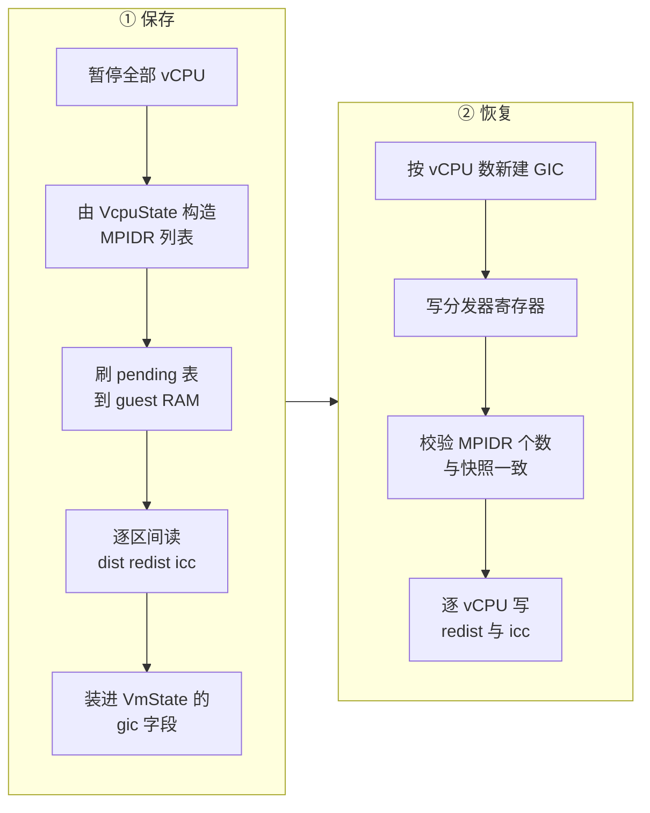

# 19 · aarch64 平台：内存布局、FDT 与 GIC

> aarch64 上的 microVM 没有固件，也没有 ACPI。guest 内核对这台机器的全部认识来自一棵由 VMM 现场生成的设备树，
> 而中断由一个建在 KVM 里的 GIC 提供。本篇讲上游 v1.12.1 怎么划分 guest 的物理地址空间、
> 怎么生成这棵设备树、GIC 在什么时刻以什么版本被创建，以及它的状态如何进出快照。
>
> **读者**：系统工程师、需要在 ARM 上排查启动与中断问题的开发者。
> **预备**：[第 13 篇 · guest 内存](13-guest-memory.md)、
> [第 18 篇 · aarch64 vCPU](18-aarch64-vcpu.md)。
> **代码**：`src/vmm/src/arch/aarch64/layout.rs`、`mod.rs`、`fdt.rs`、`vm.rs`、`gic/`

---

## 0. 本篇要回答的问题

1. aarch64 的 guest 物理地址空间是怎么划分的，为什么它只有一段 DRAM？
2. 设备树里都有哪些节点，哪些内容是运行时才能确定的？
3. GIC 为什么必须在创建 vCPU **之后**建立，而 x86 的中断控制器必须在**之前**？
4. GICv3 与 GICv2 怎么选，选错了会怎样？
5. GIC 的状态怎么进快照，为什么保存之前要先刷一次 pending 表？
6. 与 x86_64 相比，aarch64 平台少了什么、多了什么？

---

## 1. 问题：一台没有固件、也没有 ACPI 的 ARM 机器

x86_64 上 Firecracker 通过两套机制向 guest 描述硬件：老的 mptable 与 ACPI 表，
都写在 guest 内存的固定区域，由内核按约定去扫（[第 17 篇](17-x86-64-platform.md)）。
aarch64 没有这样的扫描约定。ARM 服务器上通常由 UEFI 提供 ACPI，嵌入式则用设备树；
两条路都要求有人在内核启动前把描述写好。

上游 v1.12.1 在 aarch64 上只走设备树这一条路：`src/vmm/src/acpi/` 下只有 `mod.rs` 与 `x86_64.rs`，
`create_acpi_tables()` 的唯一调用点在 `src/vmm/src/arch/x86_64/mod.rs`。
**aarch64 没有 ACPI 表生成代码。** 相应地，vCPU 0 的 `X0` 指向设备树地址，
内核从这一个指针出发认识整台机器（[第 18 篇](18-aarch64-vcpu.md)）。

这条路省掉了 ACPI 那一整套表与 AML 字节码，代价是设备树是**一次性**的：
它在引导前写进 guest 内存，之后不再更新。热插拔在这个模型下无从谈起，
从快照恢复时也必须把设备按同样的地址与中断号重建，否则 guest 里的驱动会对着错误的地址操作。

设备树还有一个容易被忽略的性质：它不进快照。
`create_fdt()` 把结果直接 `write_slice()` 进 guest 内存（`configure_system_for_boot()`），
从此它就是 guest 内存的一部分，随内存文件一起被保存和恢复，没有独立的序列化形式。
这与 x86_64 上 ACPI 表的处理方式一致，后果也一致：
**恢复端不会重新生成一份硬件描述**，它只能让实际建出来的设备与快照里那份描述对上。
本篇第 5 节讲的 GIC 版本一致性、[第 40 篇](40-device-persist.md)讲的设备重建顺序，
根子都在这一条上。

## 2. 地址空间

常量在 `src/vmm/src/arch/aarch64/layout.rs` 与 `mod.rs`：

```text
0x0000_0000  +--------------------------------+
             | 未映射                          |
             |                                |
  向下生长    | GIC 重分发器  每 vCPU 128 KiB    |  GICv3
0x3FFF_0000  +--------------------------------+
             | GIC 分发器 64 KiB               |
0x4000_0000  +--------------------------------+  MAPPED_IO_START = 1 GiB
             | MMIO 设备窗口 1 GiB             |  串口 / RTC / virtio-mmio
             |                                |
0x8000_0000  +--------------------------------+  DRAM_MEM_START = 2 GiB
             | 系统保留 2 MiB                  |  SYSTEM_MEM_SIZE，放 vmgenid
0x8020_0000  +--------------------------------+  内核加载地址
             | guest RAM                      |
             ~                                ~
             | initrd（若有）                  |
             +--------------------------------+
             | FDT 最多 2 MiB                  |  内存末尾
             +--------------------------------+  最多到 1022 GiB
```

几处值得说明：

**DRAM 只有一段。** `arch_memory_regions()` 无条件返回一个区域，起点 `DRAM_MEM_START`，
长度是请求值与 `DRAM_MEM_MAX_SIZE`（1022 GiB）取小。这与 x86_64 形成对照：
x86 的 MMIO 空洞在 4 GiB 以下，把大内存的 microVM 切成两段；
aarch64 把所有 MMIO 放在 DRAM 之下，DRAM 从此一路向上不再被打断。
代码里连一个 Kani 证明都写进去断言 `regions.len() == 1`。

**DRAM 开头的 2 MiB 不给 guest 当普通内存。** `create_memory_node()` 写进设备树的 `memory@ram`
节点从 `DRAM_MEM_START + SYSTEM_MEM_SIZE` 开始。注释解释了理由：
Linux 不允许对「系统内存」做 `ioremap`，而 vmgenid 这类设备需要内核驱动能拿到虚拟地址去读；
把这段划出内存节点之外，驱动才能重新映射它。`VmGenId::new()` 正是从这个
`SYSTEM_MEM_START` 起 2 MiB 的分配器里按 `LastMatch` 策略取 8 字节对齐的缓冲。
内核映像紧接着这 2 MiB 加载（`get_kernel_start()`），这也顺带满足了 ARM64 内核要求的 2 MiB 对齐。

**FDT 在内存末尾。** `get_fdt_addr()` 返回 `last_addr - FDT_MAX_SIZE + 1`，
也就是 guest 内存最后 2 MiB 的起点；内存太小放不下时退回 `DRAM_MEM_START`，
让后续的写入自己去失败而不是在这里 panic。initrd 的加载地址由 `initrd_load_addr()`
从 FDT 地址往下减（`src/vmm/src/arch/aarch64/mod.rs`），所以两者相邻但不重叠。

**MMIO 窗口是 1 GiB。** `MMIO_MEM_START = MAPPED_IO_START`（1 GiB），
`MMIO_MEM_SIZE = DRAM_MEM_START - MAPPED_IO_START`（1 GiB）。
所有 MMIO 设备的地址都由 `ResourceAllocator` 从这个窗口里分配
（`src/vmm/src/device_manager/resources.rs`）。GIC 落在窗口**之下**，
不经过分配器，因此不会与设备撞车。

**中断号。** `IRQ_BASE` 是 32，`IRQ_MAX` 是 128，GSI 分配器的范围就是这两个常量。
32 这个下界是 ARM 架构规定的：0–15 是 SGI（核间中断），16–31 是 PPI（每核私有），
32 以上才是 SPI（共享外设中断），只有 SPI 可以分给设备。
GIC 创建时用 `KVM_DEV_ARM_VGIC_GRP_NR_IRQS` 把最高 SPI 号设为 `IRQ_MAX`；
KVM 要求这个数大于 32、小于 1023 且是 32 的倍数，128 满足。

## 3. GIC：创建时机与版本回退

`ArchVm`（`src/vmm/src/arch/aarch64/vm.rs`）给 `Vm::create_vcpus()` 提供了两个钩子，
aarch64 只实现后一个：

```rust
pub fn arch_post_create_vcpus(&mut self, nr_vcpus: u8) -> Result<(), ArchVmError> {
    // On aarch64, the vCPUs need to be created (i.e call KVM_CREATE_VCPU) before setting up the
    // IRQ chip because the `KVM_CREATE_VCPU` ioctl will return error if the IRQCHIP
    // was already initialized.
    self.setup_irqchip(nr_vcpus)
}
```

注释指明了约束的来源在内核侧：GIC 一旦初始化，`KVM_CREATE_VCPU` 就会失败。
x86_64 的约束方向恰好相反，`KVM_CREATE_IRQCHIP` 必须在建 vCPU 之前
（`arch_pre_create_vcpus()`，[第 17 篇](17-x86-64-platform.md)）。
这一对相反的约束就是 `Vm` 上要留前后两个钩子的原因——通用代码不能假设中断控制器在哪一侧建立。

GIC 还有一个「知道 vCPU 数量」的需求：GICv3 的重分发器是每 vCPU 一份，
地址区间大小是 `vcpu_count * 128 KiB`，所以 `setup_irqchip()` 要拿到 `nr_vcpus`。

版本选择在 `gic/mod.rs` 的 `create_gic()`：传 `None` 时先试 GICv3，
失败就回退到 GICv2。Firecracker 不给用户暴露这个选项，运行时哪个能建就用哪个。
两者的差别对上层几乎透明，`GICDevice` 枚举把它们的方法转发到各自实现，只有三处外露：

| 维度 | GICv3 | GICv2 |
|---|---|---|
| 设备树 `compatible` | `arm,gic-v3` | `arm,gic-400` |
| 维护中断号（PPI） | 9 | 8 |
| `reg` 属性的两段 | 分发器 64 KiB + 重分发器 每 vCPU 128 KiB | 分发器 4 KiB + CPU 接口 8 KiB |

两者的地址都是「从 `MAPPED_IO_START` 往下减」算出来的常量，不经过分配器，也就不随配置变化。
GICv2 的一个实际限制是它最多支持 8 个 CPU 接口，但 Firecracker 没有在这里做检查
（推论：vCPU 数超限时会在 `KVM_CREATE_DEVICE` 或属性设置阶段失败，
而不是得到一条明确的配置错误）。

自动回退是一个典型的「宁可能跑、不保证一致」的取舍。收益是同一个二进制在新旧宿主上都能起来，
运维不必为 GIC 版本准备两套配置；代价有两条，都落在快照上：
同一份快照在两台 GIC 版本不同的机器之间不可迁移（第 5 节展开），
而且由于版本不进任何日志之外的记录，出问题时要靠读设备树或读 `/proc/interrupts` 才能确认当时用的是哪一版。

`create_gic()` 里三步是固定的：`KVM_CREATE_DEVICE` 建设备、
`init_device_attributes()` 用 `KVM_DEV_ARM_VGIC_GRP_ADDR` 告诉 KVM 各段的 GPA、
`finalize_device()` 设 SPI 上限并用 `KVM_DEV_ARM_VGIC_CTRL_INIT` 收尾。
三步之后 GIC 才可用，`GICDevice` 把设备 fd 与四个地址属性留在手里，
前者给快照读写寄存器用，后者给设备树的 `reg` 属性用。

### 3.1 设备的中断怎么到达 guest

设备并不直接操作 GIC。`src/vmm/src/device_manager/mmio.rs` 在注册每个 MMIO 设备时，
调用 `vm.register_irqfd(设备的 irq_evt, gsi)` 把一个 eventfd 与一个 GSI 绑定；
之后设备线程只要往这个 eventfd 写一个计数，KVM 就会在内核里把对应的 SPI 拉起来，
不需要经过 VMM 线程，也不需要一次 ioctl。串口与 vmgenid 走的是同一条路
（`legacy.rs`、`device_manager/acpi.rs`）。
GSI 与 SPI 的对应关系是直接的：分配器给出的 32–128 就是 SPI 号，
写进设备树的 `interrupts` 属性时用 `GIC_FDT_IRQ_TYPE_SPI` 标明类型。

## 4. 设备树：`create_fdt()` 写了什么

`src/vmm/src/arch/aarch64/fdt.rs` 的 `create_fdt()` 用 `vm-fdt` crate 顺序写出一棵树。
输入有四类：vCPU 的 MPIDR 列表、guest 内存、内核命令行与 initrd 配置、
以及 MMIO 设备管理器给出的 `MMIODeviceInfo` 表（地址、长度、中断号）。

```text
/                        compatible = linux,dummy-virt
                         interrupt-parent = <GIC 的 phandle>
├── cpus
│   ├── cpu@0            device_type = cpu, enable-method = psci
│   │                    reg = MPIDR 低 24 位, L1 缓存属性
│   │   └── l2-0-cache   cache-level, cache-size, next-level-cache
│   └── cpu@1 …
├── memory@ram           reg = <DRAM 起点 + 2 MiB, 剩余大小>
├── chosen               bootargs, linux,initrd-start / -end
├── intc                 GIC：compatible, reg, phandle = 1
├── timer                arm,armv8-timer, 四个 PPI：13 14 11 10
├── apb-pclk             fixed-clock 24 MHz, phandle = 2
├── psci                 arm,psci-0.2, method = hvc
├── uart@…               ns16550a（命令行里有 console= 时才有）
├── rtc@…                arm,pl031
├── virtio_mmio@…        按地址从低到高排序
└── vmgenid              microsoft,vmgenid
```

树里哪些内容是运行时才定下来的，值得单独点一遍：CPU 节点的数量与 `reg` 值（来自 vCPU 数与 MPIDR）、
`memory@ram` 的大小（来自配置的内存量）、`chosen` 里的命令行与 initrd 区间、
GIC 节点的 `compatible` 与 `reg`（来自实际建成的 GIC 版本与 vCPU 数）、
以及全部设备节点的地址与中断号（来自 `MMIODeviceInfo`）。
其余部分——定时器的四个 PPI、24 MHz 的固定时钟、PSCI 的版本与调用方式——都是编译期常量。
`FDT_MAX_SIZE` 定为 2 MiB，取自 ARM64 引导协议对设备树大小的上限规定；
代码并不检查生成结果是否真的没超，超了会在写 guest 内存时越界失败。

三处细节值得留意。

**CPU 节点里带缓存拓扑。** L1 缓存作为 `cpu` 节点自身的属性，L2 及以上作为独立节点，
用 `next-level-cache` 串成链并靠 `phandle` 共享——多颗 CPU 共享同一级缓存时，
它们的 `next-level-cache` 指向同一个 phandle。phandle 从 4000 开始往下减，
避开 GIC（1）与时钟（2）占用的小号。数据来自宿主 sysfs，见[第 18 篇 §8](18-aarch64-vcpu.md#8-缓存拓扑来自宿主-sysfs)。

**virtio 设备按地址排序。** `create_devices_node()` 先把所有 virtio 设备收集到一个
`Vec`，按 `addr` 从低到高排序后再写节点。原因是设备信息存在 `HashMap` 里，遍历顺序不确定；
而 guest 内核按设备树里的出现顺序给设备命名，顺序不稳定会让 `/dev/vda` 与 `/dev/vdb` 在两次启动之间互换。
串口与 RTC 不参与排序，因为每类至多一个。

**串口是条件的。** `attach_legacy_devices_aarch64()`（`src/vmm/src/builder.rs`）
只在内核命令行里出现 `console=` 时才注册串口设备。没有 `console=` 就没有 `uart@` 节点，
也就没有那一个 SPI 的开销。RTC 则无条件注册；它不接中断，所以设备树里的 `rtc@` 节点
故意不写 `interrupts` 属性，注释指明是因为设备本身不实现中断。

## 5. GIC 的状态与快照

aarch64 的 `VmState`（`src/vmm/src/arch/aarch64/vm.rs`）只有两个字段：
guest 内存的描述，以及 `GicState`。x86_64 的 `VmState` 里那些 PIT、irqchip、kvmclock，
在这里统统没有对应物——ARM 的架构定时器属于 vCPU 寄存器，已经随 `VcpuState` 存走了。

`GicState` 的结构是「一份分发器寄存器 + 每 vCPU 一份」：

```text
GicState
├── dist              分发器寄存器，按 32 位分块
└── gic_vcpu_states[] 每 vCPU 一项
    ├── rdist         重分发器寄存器（GICv3 才有，GICv2 为空）
    └── icc           CPU 接口寄存器
```

读写走的都是 KVM 的设备属性接口，`gic/regs.rs` 里的 `VgicRegEngine` trait 把
「按 offset 遍历一个寄存器区间、每次一次 `KVM_GET_DEVICE_ATTR`」这件事抽象出来，
三个具体实现只需要给出属性组与寄存器列表：GICv3 用
`KVM_DEV_ARM_VGIC_GRP_DIST_REGS`、`_REDIST_REGS`、`_CPU_SYSREGS`，
GICv2 用 `_DIST_REGS` 与 `_CPU_REGS`。每 vCPU 的寄存器靠 MPIDR 寻址，
这就是 `construct_kvm_mpidrs()` 存在的原因（[第 18 篇 §5](18-aarch64-vcpu.md#5-mpidr一个被两处使用的寄存器)）。

GICv3 的保存路径比 GICv2 多一步：



第三步是 `gicv3/regs.rs` 的 `save_state()` 开头调用的 `save_pending_tables()`，
对应属性 `KVM_DEV_ARM_VGIC_SAVE_PENDING_TABLES`。GICv3 的 LPI 挂起状态不在寄存器里，
而在 guest 内存中的一张表里，由硬件或 KVM 直接维护；不先把它刷回 guest RAM，
这部分状态就不会随内存文件一起被保存。GICv2 没有这张表，所以它的 `save_state()` 没有这一步。

顺序上还有一条隐含依赖：刷 pending 表必须在 guest 内存被导出**之前**完成。
`Vmm::save_state()` 先取 vCPU 状态、再取 VM 状态（其中包含这次刷表），
之后才由 `create_snapshot()` 写内存文件（[第 37 篇](37-snapshot-create.md)），
顺序是对的。

恢复路径在 `restore_state()`：先写分发器寄存器，再校验 MPIDR 个数与快照里的 vCPU 数一致
（不一致直接返回 `InconsistentVcpuCount`），最后逐 vCPU 写重分发器与 CPU 接口寄存器。
注意 GIC 本身在恢复时是**新建**的：`build_microvm_from_snapshot()` 走的仍是
`create_vcpus()` → `arch_post_create_vcpus()` → `setup_irqchip()` 这条路，
然后才把寄存器值灌回去。这也意味着恢复端的 GIC 版本由宿主决定，
如果保存端是 GICv3、恢复端只能建 GICv2，寄存器写入会失败而不是静默降级。

失败的形态值得预期一下。`GicState` 里的 `rdist` 在 GICv2 下是空 `Vec`，
所以拿一份 GICv2 的快照去 GICv3 上恢复时，重分发器寄存器根本不会被写，
GIC 处于「建好但没有恢复完整状态」的状态；反方向则是拿着一串 GICv3 的重分发器数据
去一个没有这个属性组的设备上写，得到 `DeviceAttribute` 错误。
两种情况都不会被提前识别成「快照与宿主不兼容」，只表现为恢复中途报错。
`InconsistentVcpuCount` 是这条路径上唯一一处显式的一致性检查，它挡的是 vCPU 数不一致，
挡不住 GIC 版本不一致。把这类检查做在前面，是 ARM 适配版的原地回滚要解决的问题之一
（[第 69 篇](69-rollback-api-and-phases.md)）。

## 6. 与 x86_64 的对照

| 维度 | x86_64 | aarch64 |
|---|---|---|
| 硬件描述 | mptable + ACPI 表，写在 guest 内存固定区 | 设备树，写在内存末尾，`X0` 指向它 |
| 中断控制器 | irqchip（PIC + IOAPIC）+ PIT，建在 vCPU **之前** | GIC v3 或 v2，建在 vCPU **之后** |
| 中断号范围 | 5–23 | 32–128 |
| DRAM 分段 | 大内存时两段（4 GiB 以下有 MMIO 空洞） | 恒为一段 |
| MMIO 窗口 | 4 GiB 以下的高端 768 MiB | 1 GiB 到 2 GiB |
| legacy 设备 | 串口（PIO）、i8042 | 串口（MMIO，可选）、RTC |
| `VmState` 内容 | 内存描述 + PIT + irqchip + kvmclock | 内存描述 + GIC |
| 时钟状态 | TSC 在 vCPU、PIT 与 kvmclock 在 VM | 全在 vCPU 寄存器里 |

「没有 i8042」有一个连带后果：x86_64 把 i8042 的复位端口当作 VMM 的退出事件源，
aarch64 没有这条路，整机退出只能靠 PSCI 经 `KVM_EXIT_SYSTEM_EVENT`
（[第 18 篇 §7](18-aarch64-vcpu.md#7-psci次核启动与关机)）。

表里「没有 ACPI」这一条要说得更准确一点。没有的是 ACPI **表**，不是那个管理器：
`Vmm` 上的 `acpi_device_manager` 字段与 `src/vmm/src/device_manager/acpi.rs` 都不带
`cfg(target_arch)`，两个架构上都编译进去，`ACPIDeviceManager` 的唯一成员也都是
`Option<VmGenId>`。差别在于这个成员怎么被 guest 看见：x86_64 上 `append_aml_bytes()`
把它写成 DSDT 里的 GED 与 VGEN 节点（[第 17 篇](17-x86-64-platform.md)），
aarch64 上那份 AML 没有任何消费者，设备改由 `fdt.rs` 的 `create_vmgenid_node()`
写成一个 `compatible = "microsoft,vmgenid"` 的设备树节点，`reg` 是那 2 MiB 系统保留区里的缓冲地址，
`interrupts` 是一个 SPI。真正只属于 x86_64 的字段是 `pio_device_manager`
（[第 12 篇 §2](12-vmm-event-loop-and-exit.md#2-vmm-结构运行期的全部句柄)）。
所以 aarch64 上这台机器仍然有 vmgenid 设备与它的换代通知，只是通知路径不经过 ACPI。

## 7. 后续各层的差异

e2b 定制版没有改动 aarch64 平台代码。

ARM 适配版在 `src/vmm/src/arch/aarch64/vm.rs` 里加了一个 `enable_hdbss()`，
绕开 kvm-ioctls 直接发一次 `libc::ioctl`，用 `KVM_ENABLE_CAP`
打开鲲鹏平台上的硬件脏页跟踪（HDBSS，hardware dirty bit state structure），
让处理器自己记录脏页，替代 KVM 逐页写保护的做法。
相应的能力号与 ioctl 号在当时的 `kvm-bindings` 里没有，代码里就地写成了常量，
这条技术债的后果是升级 `kvm-bindings` 或换用不同的内核分支时要重新核对。
见[第 65 篇](65-dirty-tracking-backend.md)与[第 66 篇](66-hdbss.md)。
GIC 的状态在原地回滚里也要写回，见[第 71 篇](71-rollback-vcpu-and-gic.md)。

## 8. 小结

- aarch64 上没有 ACPI 表生成代码，guest 对硬件的全部认识来自一棵引导前写好的设备树，之后不再更新。
- 地址空间自下而上是：GIC、1 GiB 的 MMIO 窗口、从 2 GiB 开始的单段 DRAM；
  MMIO 全在 DRAM 之下，因此 DRAM 不会被切成两段。
- DRAM 开头的 2 MiB 被排除在内存节点之外，为的是让 guest 内核能对 vmgenid 这类缓冲做 `ioremap`；
  内核映像紧随其后加载，顺带满足 2 MiB 对齐。
- 设备树放在 guest 内存最后 2 MiB，initrd 紧贴其下。
- GIC 必须在 `KVM_CREATE_VCPU` 之后创建，与 x86 的约束方向相反；这是 `Vm` 上留前后两个钩子的原因。
- 版本先试 GICv3 再回退 GICv2，用户不可选；两者对上层的差别只有设备树 `compatible`、
  维护中断号与 `reg` 的两段布局。
- virtio 设备节点按 MMIO 地址排序写出，为的是让 guest 里的设备命名在多次启动之间稳定。
- aarch64 的 `VmState` 只有内存描述与 `GicState`；架构定时器属于 vCPU 状态，不在这里。
- GICv3 保存前要先把 LPI pending 表刷回 guest RAM，否则这部分状态不随内存文件保存；GICv2 没有这一步。
- 恢复时 GIC 是新建之后再灌寄存器，所以两端的 GIC 版本必须一致，不一致会在写寄存器时失败。

---

## 延伸阅读 / 下一篇

- [第 18 篇 · aarch64 vCPU](18-aarch64-vcpu.md)：设备树里的 CPU 节点与 PSCI 从 vCPU 一侧看是什么样。
- [第 17 篇 · x86_64 平台](17-x86-64-platform.md)：同一组问题在 x86_64 上的答案。
- [第 23 篇 · 设备总线与 MMIO 设备管理器](23-bus-and-mmio-device-manager.md)：
  设备树里那些地址与中断号由谁分配。
- [第 40 篇 · 设备状态的 Persist](40-device-persist.md)：GIC 之外的设备状态怎么进快照。
- [第 59 篇 · aarch64 与 x86_64 运行路径的差异清单](59-aarch64-vs-x86-64-runtime-paths.md)。
- 内核文档 `Documentation/devicetree/bindings/interrupt-controller/arm,gic-v3.yaml`
  与 `arm,gic.txt` 给出了本篇涉及的设备树属性定义。
