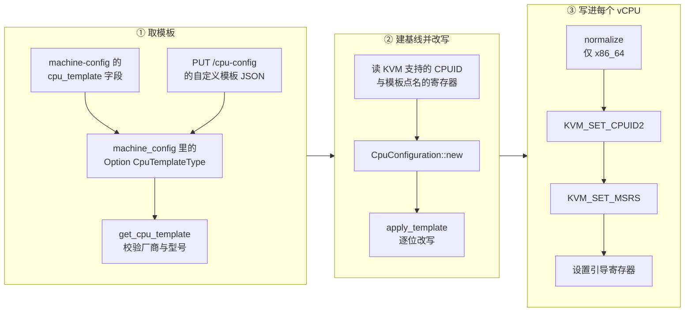

# 20 · CPU 模板机制：静态、自定义与序列化

> guest 通过 CPUID 与一批系统寄存器来判断自己跑在什么 CPU 上。这些值默认由宿主机的硬件决定，
> 于是同一份快照换一台宿主机恢复，guest 眼里的 CPU 就变了。CPU 模板（CPU template）是 Firecracker
> 用来接管这组值的机制：一张「对 guest 声明什么、屏蔽什么」的清单，在 vCPU 启动前写进 KVM。
> 本篇讲模板的数据模型、它在启动路径上的确切位置，以及它与快照的关系。
>
> **读者**：系统工程师、需要在异构机群上迁移快照的运维。
> **预备**：[第 15 篇 · vCPU 线程与状态机](15-vcpu-threads-and-state-machine.md)、
> [第 10 篇 · VmResources 与配置](10-vm-resources-and-config.md)。
> **代码**：`src/vmm/src/cpu_config/templates.rs`、`templates_serde.rs`、`mod.rs`、
> `src/vmm/src/cpu_config/x86_64/mod.rs`、`src/vmm/src/cpu_config/aarch64/mod.rs`、
> `src/vmm/src/vmm_config/machine_config.rs`、`src/vmm/src/builder.rs`、`src/vmm/src/persist.rs`

---

## 0. 本篇要回答的问题

1. 不用模板会出什么问题？模板解决的到底是哪一类故障，不解决哪一类？
2. 静态模板与自定义模板在代码里是同一种东西吗，二者怎么合流？
3. 模板里那串 `0b0101xxxx` 是什么语义，为什么不用「值 + 掩码」两个整数字段？
4. 模板在启动流程的哪一步生效？它和 x86_64 的 CPUID 归一化谁先谁后？
5. `PUT /machine-config` 的 `cpu_template` 与 `PUT /cpu-config` 写的是同一个地方吗？
6. 快照里存的是模板本身，还是模板应用之后的结果？恢复时会重放模板吗？

---

## 1. 问题：guest 看到的 CPU 由谁决定

一台 microVM 启动时，Firecracker 从 KVM 取一份「本机支持的 CPUID」，几乎原样交给 guest。
guest 内核与用户态库拿这份信息做两件事：一是决定能不能用某条指令（AVX-512、SHA 扩展、RDRAND），
二是决定要不要打开某项缓解措施（针对推测执行漏洞的那些）。glibc 的函数派发、JIT 的代码生成、
加密库的实现选择，都在进程启动时读一次 CPUID 就定下来了。

这带来两个后果。

其一，机群异构时行为不可预测。同一个镜像调度到 Skylake 与 Ice Lake 上，
guest 里跑出来的指令序列不一样；客户看到的不是「机器慢一点」，而是「这台上能跑、那台上非法指令」。

其二，快照不可迁移。快照恢复出来的 guest 进程早已把 CPUID 读进了自己的内存
（快照恢复的语义见[第 38 篇 · 加载快照](38-snapshot-load.md)），它不会重新探测。
如果恢复的宿主机缺少某项当初被声明过的特性，guest 会执行一条它以为可用、实际不存在的指令，
结果是 guest 内部的崩溃，而不是 Firecracker 的一个错误返回。方向是不对称的：
**从多特性的机器迁到少特性的机器会炸，反过来只是浪费。**

CPU 模板的做法是取两者的交集：在最丰富的那台宿主机上也只向 guest 声明机群里最弱一台具备的特性。
代价有三层。一是性能：被屏蔽的指令集用不上，`T2S` 这类为跨代迁移设计的模板尤其收紧。
二是维护：机群里进一台新机型，模板要重新核对。三是安全边界的误解 ——
上游文档 `docs/cpu_templates/cpu-templates.md` 明确写着模板不是安全机制：
屏蔽一个特性位只是不向 guest 声明它，不保证对应指令在硬件上真的不可执行；
不遵守特性位、直接执行指令的 guest 仍可能成功。模板管的是「声明」，不是「执行」。

还有一条模板做不到的事：**不能把一个厂商伪装成另一个厂商。**
`GetCpuTemplate::get_cpu_template()`（`src/vmm/src/cpu_config/x86_64/custom_cpu_template.rs`）
在应用静态模板前先调 `get_vendor_id_from_host()` 与模板声明的厂商比对，不一致就返回
`GetCpuTemplateError::CpuVendorMismatched`。Intel 与 AMD 之间没有兼容的迁移路径。

---

## 2. 两种模板，一条通路

Firecracker 提供两种模板，最终在代码里合流成同一种结构。

**静态模板**是内置的几张表，用 EC2 实例族命名。`StaticCpuTemplate` 枚举定义在
`src/vmm/src/cpu_config/x86_64/static_cpu_templates/mod.rs`（aarch64 的同名文件里只有 `V1N1` 与 `None`）：

| 模板 | 厂商 | 允许的宿主 CPU 型号 |
|---|---|---|
| C3 | Intel | Skylake、Cascade Lake、Ice Lake |
| T2 | Intel | Skylake、Cascade Lake、Ice Lake |
| T2S | Intel | Skylake、Cascade Lake |
| T2CL | Intel | Cascade Lake、Ice Lake |
| T2A | AMD | Milan |
| V1N1 | ARM | Neoverse V1 |

这张表不是文档抄来的，它就是 `StaticCpuTemplate::get_supported_vendor()` 与
`get_supported_cpu_models()` 两个方法的返回值；`get_cpu_template()` 用当前宿主机的
`CpuModel::get_cpu_model()` 去查它，查不到就返回 `GetCpuTemplateError::InvalidCpuModel`。
换句话说，静态模板自带宿主机白名单，放错机型会在启动时失败而不是静默降级。

**自定义模板**是用户给的一份 JSON，反序列化成 `CustomCpuTemplate`。
这个类型是按架构分别定义的：x86_64 的版本有 `kvm_capabilities`、`cpuid_modifiers`、`msr_modifiers`
三个字段，aarch64 的版本有 `kvm_capabilities`、`vcpu_features`、`reg_modifiers`。
两个模块都 `#[serde(deny_unknown_fields)]`，写错字段名会被拒绝而不是忽略。

合流点是 `GetCpuTemplate` trait，它实现在 `Option<CpuTemplateType>` 上，返回 `Cow<CustomCpuTemplate>`：
自定义模板借用已有的那份，静态模板则调用 `t2::t2()`、`c3::c3()`、`v1n1::v1n1()` 之类的构造函数
**现场造出一个等价的 `CustomCpuTemplate`**；没给模板时返回一个空的 `CustomCpuTemplate::default()`。
所以下游只需要处理一种结构。这也说明静态模板在实现上没有特权：它就是一份写死在 Rust 源码里的自定义模板。
`static_cpu_templates/mod.rs` 里有一个测试 `verify_consistency_with_json_templates()`，
逐个比对内置构造函数与 `tests/data/custom_cpu_templates/` 下的同名 JSON，保证两种形态不漂移。

静态模板自 v1.5.0 起被上游标记为废弃，swagger 里 `CpuTemplate` 的描述也写了将来会移除；
`MachineConfig::cpu_template` 字段上的注释直接写着，静态模板支持一旦移除，这个字段可以整个删掉。
读代码时可以把静态模板当成「自定义模板的预设集合」，而不是一条独立的机制。

---

## 3. 位掩码：一个字段表达三态

模板要表达的不是「把寄存器设成某个值」，而是「这几位设成这样，其余的别动」。
宿主机之间 CPUID 的多数位是一样的，模板只关心自己要动的那几位；如果模板写成整值，
它就得把宿主机所有位都抄一遍，换台机器就全错了。

代码里的载体是 `RegisterValueFilter<V>`（`src/vmm/src/cpu_config/templates.rs`），两个同宽字段：

```rust
pub struct RegisterValueFilter<V> {
    pub filter: V,   // 哪些位归模板管
    pub value: V,    // 归模板管的位取什么
}

pub fn apply(&self, value: V) -> V {
    (value & !self.filter) | self.value
}
```

`filter` 为 1 的位取 `value` 的对应位，为 0 的位保留宿主机原值。JSON 里不写两个整数，
而写成一个三态位串，由 `RegisterValueFilter` 自己的 `Serialize` / `Deserialize` 实现翻译：

```text
JSON:   "0b0101xxxx"
          │││││││└──── 'x'：filter 位 = 0，保留宿主机的值
          ││││└─────── '0'：filter 位 = 1，value 位 = 0（屏蔽这个特性）
          │└────────── '1'：filter 位 = 1，value 位 = 1（声明这个特性）
          └──────────── 前缀 0b 可省略；位串中的 '_' 作为分隔符被跳过
```

三态串的好处是一行就能看出「模板动了哪些位、动成什么」，不必对着两个十六进制数做心算。
代价是序列化有损：`filter` 为 0 的那些位上，`value` 里原有的比特在写出时被写成 `x`，
读回来就是 0。`templates.rs` 的 `test_register_value_filter_serde()` 直接断言了这一点 ——
`value: 0b01010101` / `filter: 0b11110000` 写出后读回变成 `value: 0b01010000`。
`apply()` 的结果不受影响，因为那些位本来就不参与运算；但如果有代码去比较两个
`RegisterValueFilter` 的相等性，一次序列化往返就可能改变结论。

模板 JSON 里的其它数值（CPUID 的 leaf / subleaf、MSR 地址、aarch64 寄存器 ID）走
`templates_serde.rs` 里的一组 `deserialize_from_str_*`：只接受 `0x` 或 `0b` 前缀的字符串，
不带前缀的裸十进制数会被拒绝，错误信息里明说要加前缀。这是为了避免把 `10` 读成十进制十。

模板还能捎带一项与寄存器无关的东西：`kvm_capabilities`。它是一个 `KvmCapability` 列表，
序列化成字符串数组，`"69"` 表示往 Firecracker 默认的 KVM 能力检查清单里加一项，
`"!69"` 表示从清单里去掉一项（`KvmCapability` 的 `Serialize` / `Deserialize`）。
清单的合并在 `src/vmm/src/vstate/kvm.rs` 的 `Kvm::combine_capabilities()`，
在创建 VM 之前执行。它的用途是：模板依赖某项 KVM 能力时，让启动在缺能力的宿主机上**早失败**，
而不是等 guest 跑起来才出问题。

---

## 4. 模板在启动路径上的位置

模板只在启动路径上生效一次，之后不再参与。这张图给出三个阶段，下面逐段对照代码。



**阶段一**在 `src/vmm/src/builder.rs` 的 `build_microvm_for_boot()` 里，
`vm_resources.machine_config.cpu_template.get_cpu_template()?` 一句话完成；
紧接着 `cpu_template.kvm_capabilities.clone()` 被传给 `create_vmm_and_vcpus()`，
也就是说能力检查发生在任何 vCPU 存在之前。

**阶段二与阶段三**在架构相关的 `configure_system_for_boot()` 里
（`src/vmm/src/arch/x86_64/mod.rs` 与 `src/vmm/src/arch/aarch64/mod.rs`），两边结构一致：
先 `CpuConfiguration::new(...)` 建基线，再 `CpuConfiguration::apply_template(...)` 改写，
把结果塞进 `VcpuConfig`，最后对每个 vCPU 调 `vcpu.kvm_vcpu.configure(...)`。

两个架构的「基线」含义不同，这是本篇最容易读错的一处。

x86_64 的 `CpuConfiguration`（`src/vmm/src/cpu_config/x86_64/mod.rs`）有两个成员：
`cpuid` 是从 `vmm.kvm.supported_cpuid` 克隆来的**全量** CPUID 树；
`msrs` 则只有模板点名的那些 —— `CpuConfiguration::new()` 用
`first_vcpu.kvm_vcpu.get_msrs(cpu_template.msr_index_iter())` 只读模板里出现过的 MSR 地址。
所以没有模板时 `msrs` 是空的。`apply_template()` 里，
CPUID 的某个 leaf / subleaf 在树里找不到就报 `CpuidFeatureNotSupported`，
MSR 在 map 里找不到就报 `MsrNotSupported`。后者的含义是「KVM 不支持这个 MSR」，
因为 map 的内容恰好是刚才向 KVM 问过一遍的结果。

aarch64 的 `CpuConfiguration`（`src/vmm/src/cpu_config/aarch64/mod.rs`）只有一个成员
`regs: Aarch64RegisterVec`，而且它**只包含模板点名的寄存器**：
`CpuConfiguration::new()` 先对每个 vCPU 调 `KvmVcpu::init(&cpu_template.vcpu_features)`
完成 `KVM_ARM_VCPU_INIT`，再用 `get_registers(&vcpus[0].kvm_vcpu.fd, &cpu_template.reg_list(), &mut regs)`
按模板给出的 ID 列表逐个读。`apply_template()` 随后把 `reg_modifiers` 与 `regs`
用 `zip` 一一配对，按寄存器实际宽度（32 / 64 / 128 位）调用 `apply()`。
这个配对依赖两个序列同序同长，而它成立的唯一理由是 `regs` 本来就是按 `reg_list()` 读出来的。
没有模板时 `regs` 为空，`configure()` 里那个写寄存器的循环一次都不执行。

**阶段三的顺序值得单独记一笔。** x86_64 的 `KvmVcpu::configure()`
（`src/vmm/src/arch/x86_64/vcpu.rs`）拿到的是已经应用过模板的 `cpu_config`，
它做的第一件事是 `cpuid.normalize(...)`，然后才 `set_cpuid2()`。
也就是说**归一化跑在模板之后，可以覆盖模板改过的位**。归一化动的是拓扑、APIC id、
缓存参数这类必须与本次 microVM 的 vCPU 数一致的字段，细节在
[第 21 篇 · x86_64 CPUID 与 MSR 归一化](21-x86-64-cpuid-msr-normalization.md)。
aarch64 的 `configure()` 没有归一化这一步，直接 `set_one_reg()` 逐个写下去。

MSR 一侧还有一层叠加：`configure()` 把 `create_boot_msr_entries()` 的结果
`insert` 进模板给出的 map，同名地址会**覆盖**模板的值。引导协议要求的那几个 MSR
优先级高于模板。同时，模板点名的 MSR 地址会被加进 `self.msrs_to_save`，
于是它们在快照时也会被保存 —— 模板不只影响启动，还扩大了快照要带的状态集合。

---

## 5. 两个入口，一个字段

模板有两条进入 Firecracker 的路，写的却是同一个字段 `MachineConfig::cpu_template`
（类型 `Option<CpuTemplateType>`，定义在 `src/vmm/src/vmm_config/machine_config.rs`）。

| 入口 | 写入什么 | 时机 |
|---|---|---|
| `PUT` / `PATCH /machine-config` 的 `cpu_template` | `CpuTemplateType::Static` | 启动前 |
| `PUT /cpu-config`（请求体是模板 JSON） | `CpuTemplateType::Custom` | 启动前 |
| 配置文件的 `machine-config` 段 | 同上，静态 | 进程启动时 |
| 配置文件的 `cpu-config` 段（一个文件路径） | 同上，自定义 | 进程启动时 |

`PUT /cpu-config` 对应 `VmmAction::PutCpuConfiguration`，处理函数是
`src/vmm/src/rpc_interface.rs` 的 `set_custom_cpu_template()`，一路转到
`MachineConfig::set_custom_cpu_template()`，把字段整个换成 `Custom(...)`。
它被列在 `rpc_interface.rs` 的「不允许 post-boot」清单里，启动后调用返回
`OperationNotSupportedPostBoot`。

同一个字段承载两种来源，意味着**后写的覆盖先写的**，两者不叠加。
从配置文件启动时顺序是固定的：`VmResources::from_json()`
（`src/vmm/src/resources.rs`）先处理 `machine_config`，再处理 `cpu_config`，
所以同时写了两段时自定义模板胜出。走 API 时顺序由调用方决定。

这个字段在序列化方向上还有一处不对称，值得知道，否则会看错 `GET /machine-config` 的输出：
字段带着 `skip_serializing_if = "is_none_or_custom_template"`，
**自定义模板不会被回显**，`GET` 出来的 `cpu_template` 是空的。理由是这个 API
的模式里 `cpu_template` 只能是静态模板的名字，一整份自定义模板放不进去。
`MachineConfig::update()` 的映射规则同样只认静态模板：`Some(StaticCpuTemplate::None)` 映射为 `None`，
其它静态名字映射为 `Static(...)`，而 `update.cpu_template` 为 `None`（即本次 PATCH 没提这个字段）
时保留原值 —— 所以一次不带 `cpu_template` 的 `PATCH /machine-config` 不会冲掉先前设好的自定义模板。

---

## 6. 模板与快照：存的是结果

模板是启动期的一次性改写，快照里没有「重放模板」这件事。

`src/vmm/src/persist.rs` 的 `VmInfo` 里确实有一个 `cpu_template` 字段，但它的类型是
`StaticCpuTemplate`（不是 `CpuTemplateType`），而 `From<&VmResources> for VmInfo`
用的是 `StaticCpuTemplate::from(&machine_config.cpu_template)`：
静态模板存名字，**自定义模板一律存成 `StaticCpuTemplate::None`**。
`templates.rs` 里那个转换实现上方的注释也点明了它只为快照服务。
恢复时 `restore_from_snapshot()` 把这个名字回填进 `MachineConfigUpdate::cpu_template`，
效果只是让恢复后的 `GET /machine-config` 报出当初用的静态模板名 —— 它不触发任何寄存器写入。

guest 真正看到的 CPU 来自 vCPU 状态：x86_64 的 `VcpuState` 里存着完整的 CPUID 与 MSR 值，
aarch64 存着 `KVM_GET_REG_LIST` 列出的全部寄存器，恢复时按值写回
（见[第 16 篇 · x86_64 vCPU](16-x86-64-vcpu.md) 与 [第 18 篇 · aarch64 vCPU](18-aarch64-vcpu.md)）。
所以快照携带的是**模板应用并归一化之后的结果**，与模板文件本身无关；
换掉模板文件再恢复旧快照，guest 不会有任何变化。

这也解释了模板与快照兼容性检查的分工：恢复时对 CPU 的把关不看模板，
而是拿快照里记下的厂商 / 型号信息与当前宿主机比对，那部分在
[第 21 篇](21-x86-64-cpuid-msr-normalization.md) 与
[第 41 篇 · 快照工具与兼容性](41-snapshot-tools-and-compat.md)。

顺带一处口径差异：`GET /vm`（`VmmAction::GetFullVmConfig`）的处理分支里会打一条 warning，
说从快照恢复的 VM 上 `boot-source`、`machine-config.smt`、`machine-config.cpu_template` 都会是空的。
按 `restore_from_snapshot()` 的代码，`smt` 与静态模板名其实是被回填的；
这条提示对自定义模板成立，对静态模板偏保守。以代码为准。

---

## 7. 两个架构的模板能力对照

同一套 `CustomCpuTemplate` 名字下，两个架构能改的东西并不对称。

| 维度 | x86_64 | aarch64 |
|---|---|---|
| 可改对象 | CPUID leaf / subleaf 的四个寄存器、MSR | `KVM_REG_ARM64` 编码的系统寄存器 |
| 额外开关 | 无 | `vcpu_features`：改 `KVM_ARM_VCPU_INIT` 的特性位 |
| 基线范围 | CPUID 全量 + 模板点名的 MSR | 只有模板点名的寄存器 |
| 模板后的归一化 | 有 | 无 |
| `validate()` | 空实现，恒返回 `Ok` | 校验位掩码宽度与寄存器宽度是否匹配 |
| 静态模板数量 | 5 | 1 |

`CustomCpuTemplate::validate()` 在 `TryFrom<&[u8]>` 里被调用，也就是每次从 JSON 读模板都会跑。
x86_64 的实现是一个空壳（`Ok(())`），错误要等到 `apply_template()` 时才暴露；
aarch64 的实现会用 `reg_size(modifier.addr)` 解出寄存器宽度，位掩码超宽就在解析阶段报错。
这不是设计上的取舍，更像是两边成熟度不同：x86_64 侧的错误都推迟到了启动时，
诊断信息落在 `CpuidFeatureNotSupported` / `MsrNotSupported` 两个错误上。

aarch64 特有的 `vcpu_features` 不是寄存器，它改的是传给 `KVM_ARM_VCPU_INIT` 的
`kvm_vcpu_init.features` 数组，用同一套 `RegisterValueFilter<u32>` 位掩码语法表达。
它必须在 vCPU init 之前应用，这也是为什么 aarch64 的 `CpuConfiguration::new()`
要接收 `&mut [Vcpu]` 并在内部调 `KvmVcpu::init()` —— x86_64 的同名函数只需要
`&Vcpu` 读一次 MSR。aarch64 一侧的细节与那唯一一张静态模板在
[第 22 篇 · aarch64 模板与 cpu-template-helper](22-aarch64-templates-and-helper.md)。

---

## 8. 小结

- 模板解决的是「guest 看到的 CPU 随宿主机漂移」，典型故障是快照从强机迁到弱机后 guest 内部崩溃；
  它不解决安全隔离，屏蔽特性位不等于禁用指令，也不能跨厂商伪装。
- 静态模板与自定义模板在 `GetCpuTemplate::get_cpu_template()` 处合流：静态模板被现场构造成
  一个等价的 `CustomCpuTemplate`，下游只处理一种结构。静态模板自 v1.5.0 起被上游标记为废弃。
- 静态模板自带宿主 CPU 白名单（`get_supported_vendor()` / `get_supported_cpu_models()`），
  机型不符在启动时报错，不会静默降级。
- `RegisterValueFilter` 用 `filter` / `value` 两个位域表达「管哪些位、取什么值」，
  JSON 里写成 `0b0101xxxx` 三态串；序列化有损但不影响 `apply()` 的结果。
- 模板在启动路径上只生效一次：`build_microvm_for_boot()` 取模板 →
  `CpuConfiguration::new()` 建基线 → `apply_template()` 改写 → 每个 vCPU 的 `configure()` 写进 KVM。
- x86_64 的归一化跑在模板之后，能覆盖模板改过的位；引导所需的 MSR 也会覆盖模板给的同名 MSR。
- 两个架构的基线范围不同：x86_64 的 CPUID 是全量、MSR 只取模板点名的；
  aarch64 的寄存器向量完全由模板的 `reg_list()` 决定，空模板就是空向量。
- `PUT /machine-config` 与 `PUT /cpu-config` 写同一个字段，后写覆盖先写；
  自定义模板不会被 `GET /machine-config` 回显。
- 快照里存的是模板应用后的结果（`VcpuState` 的 CPUID / MSR / 寄存器），
  `VmInfo::cpu_template` 只留一个静态模板名字，恢复时不重放模板。

---

## 延伸阅读 / 下一篇

- [第 21 篇 · x86_64 CPUID 与 MSR 归一化](21-x86-64-cpuid-msr-normalization.md)：
  归一化的三层实现、五张静态模板各自屏蔽了什么。
- [第 22 篇 · aarch64 模板与 cpu-template-helper](22-aarch64-templates-and-helper.md)：
  寄存器向量形态的模板、`V1N1`，以及生成与校验模板的官方工具。
- [第 16 篇 · x86_64 vCPU](16-x86-64-vcpu.md)、[第 18 篇 · aarch64 vCPU](18-aarch64-vcpu.md)：
  `configure()` 之后的完整 vCPU 配置序列与 `VcpuState` 的字段。
- [第 41 篇 · 快照工具与兼容性](41-snapshot-tools-and-compat.md)：跨宿主机恢复快照的约束。
- 上游文档 `docs/cpu_templates/cpu-templates.md` 与 `docs/cpu_templates/schema.json`：
  模板 JSON 的完整模式；本书以代码为准，文档作参考。
