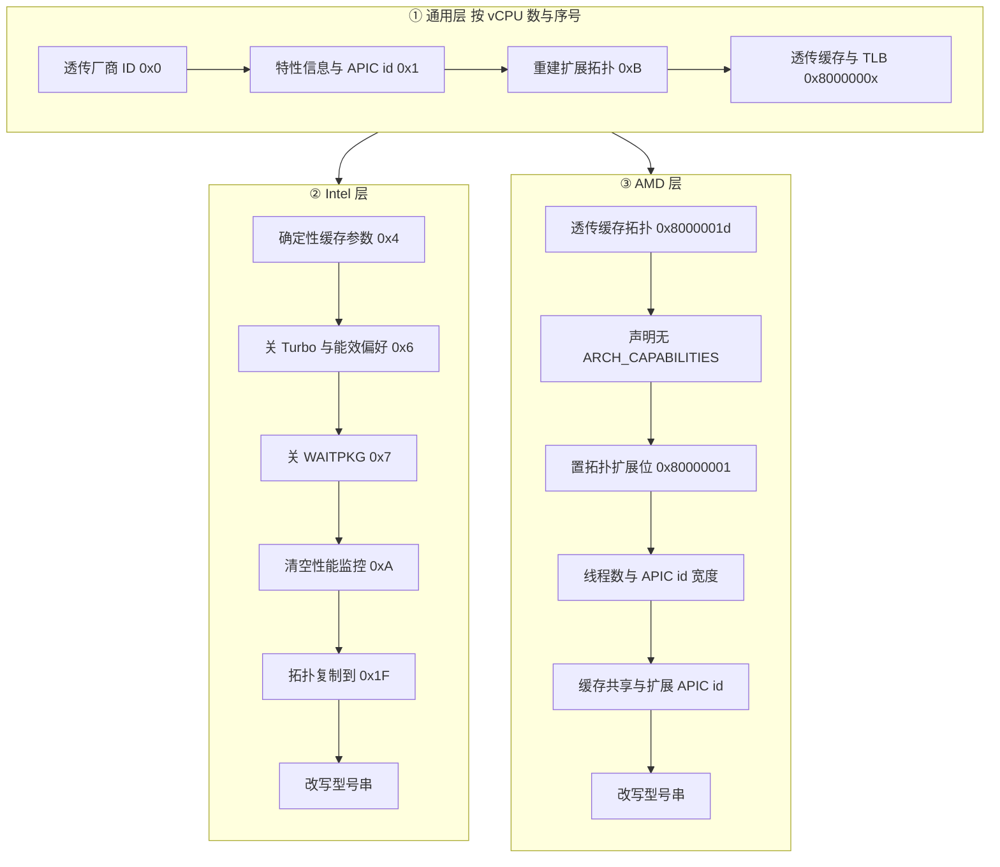

# 21 · x86_64 CPUID 与 MSR 归一化

> 即使一个 CPU 模板都不配，Firecracker 也不会把 KVM 给的 CPUID 原样转交给 guest。
> 拓扑字段要跟本次 microVM 的 vCPU 数对上，会把物理核拖进空闲状态的指令要关掉，
> 型号串要换成一个不泄漏宿主机型号的写法。这套无条件的改写叫归一化（normalization）。
> 本篇讲归一化的三层实现、每层改了什么、为什么，以及 MSR 一侧那几张容易混淆的清单。
>
> **读者**：系统工程师、排查 guest 内 CPU 特性异常的人。
> **预备**：[第 20 篇 · CPU 模板机制](20-cpu-templates.md#4-模板在启动路径上的位置)、
> [第 16 篇 · x86_64 vCPU](16-x86-64-vcpu.md)。
> **代码**：`src/vmm/src/cpu_config/x86_64/cpuid/`（`mod.rs`、`normalize.rs`、`common.rs`、
> `intel/normalize.rs`、`amd/normalize.rs`）、`src/vmm/src/cpu_config/x86_64/static_cpu_templates/`、
> `src/vmm/src/arch/x86_64/msr.rs`、`src/vmm/src/persist.rs`

---

## 0. 本篇要回答的问题

1. `KVM_GET_SUPPORTED_CPUID` 的结果为什么不能直接交给 guest？必须改的有哪几类？
2. 归一化分哪三层，为什么厂商要单独成层？
3. 归一化与 CPU 模板谁先谁后，冲突时谁赢？
4. 五张静态模板分别针对什么场景，它们动的 leaf 有什么共性？
5. MSR 一侧有几张清单，各自管什么？模板能改的 MSR 受什么限制？
6. 恢复快照时对 CPU 的校验做了什么，失败会怎样？

---

## 1. 问题：KVM 给的那份 CPUID 不能直接用

启动一台 microVM 时，Firecracker 从 `/dev/kvm` 取一次 `KVM_GET_SUPPORTED_CPUID`，
存在 `Kvm::supported_cpuid`。这份数据描述的是「这台宿主机 + 这个 KVM 版本能提供什么」，
它和「这台 microVM 应该向 guest 声明什么」之间有三类系统性的差距。

**第一类是与本次 microVM 规格绑定的字段。** CPUID 里有大量拓扑信息：
本处理器包里最多能寻址多少个逻辑处理器、当前逻辑处理器的初始 APIC id、
每级缓存被多少个逻辑处理器共享。宿主机的答案（比如 96 个逻辑核）对一台两 vCPU 的 microVM 毫无意义，
guest 内核会据此建出一张错误的 CPU 拓扑，调度与缓存亲和都会跟着错。这些字段必须逐 vCPU 重算。

**第二类是宿主机特有、且不该泄漏或不该生效的信息。** 型号串（brand string）写着宿主机的具体型号与频率；
性能监控计数器（PMU）在 guest 里既不准也是侧信道；Turbo Boost 与能效偏好这类频率控制在 VMM 之下没有意义。

**第三类是 KVM 报了、但让 guest 用会伤害宿主机的特性。** 典型是 `WAITPKG`
（`UMONITOR` / `UMWAIT` / `TPAUSE`）。`intel/normalize.rs` 里那段长注释讲得很清楚：
这三条指令任何特权级都能执行，而且即使在 guest 里执行，进入优化空闲状态的是**物理**处理器；
宿主机再调度别的 guest 上来就要先把它唤醒。特权版的 `MONITOR` / `MWAIT` 被 KVM 无条件模拟成 NOP，
用户态版本没有这层保护，于是 Firecracker 清掉 `CPUID.(EAX=07H,ECX=0):ECX[5]` ——
清掉这一位之后 KVM 不会置 VMX 的「enable user wait and pause」控制位，guest 执行这些指令会拿到 `#UD`。

归一化就是针对这三类差距的一组固定改写，**无条件执行，与用不用模板无关**。
代价是它会覆盖模板：上游文档 `docs/cpu_templates/cpuid-normalization.md` 开篇就写明归一化在模板之后执行，
模板如果改了归一化涉及的位，会被覆盖。写自定义模板时必须避开这些 leaf，
否则模板看起来生效了、实际没有。

---

## 2. CPUID 在代码里长什么样

归一化操作的不是 KVM 的那个扁平数组，而是一棵按 leaf / subleaf 排序的树。
入口类型是枚举 `Cpuid`（`src/vmm/src/cpu_config/x86_64/cpuid/mod.rs`），只有两个变体
`Intel(IntelCpuid)` 与 `Amd(AmdCpuid)`，各自内部是一个
`BTreeMap<CpuidKey, CpuidEntry>`：`CpuidKey` 是 `leaf` + `subleaf` 二元组，
`CpuidEntry` 是 `flags` 加上 eax / ebx / ecx / edx 四个寄存器。

厂商在 `TryFrom<kvm_bindings::CpuId> for Cpuid` 处就分叉：读 leaf 0x0 拿到厂商串，
`GenuineIntel` 走 Intel、`AuthenticAMD` 走 AMD，**其它一律返回
`CpuidTryFromKvmCpuid::UnsupportedVendor` 让启动失败**。Firecracker 不在第三种 x86 厂商上运行。
写回 KVM 时走反方向的 `TryFrom<Cpuid> for kvm_bindings::CpuId`，把 map 摊回数组。

`flags` 那一位不是装饰。`KvmCpuidFlags::SIGNIFICANT_INDEX` 告诉 KVM 这个 leaf 有子叶、
`subleaf` 参与索引；漏了它，guest 用不同 ECX 值查询同一个 leaf 会拿到同一份答案。
归一化在重建 leaf 0xB 的子叶时会显式把这一位置上。

公共操作放在 `CpuidTrait` 上：`vendor_id()` 从 leaf 0x0 的 ebx / edx / ecx 拼出 12 字节厂商串
（顺序是 ebx、edx、ecx，不是 ebx、ecx、edx，代码里专门注了一句这不是笔误），
`apply_brand_string()` 把 48 字节的型号串铺进 leaf 0x80000002 / 3 / 4 的十二个寄存器。

---

## 3. 三层归一化

`Cpuid::normalize()`（`cpuid/normalize.rs`）接三个参数：当前 vCPU 的序号 `cpu_index`、
vCPU 总数 `cpu_count`、以及每核逻辑处理器所需的位数 `cpu_bits`。
最后这个参数由调用方算出：`u8::from(vcpu_count > 1 && smt)` —— 开了 SMT 且不止一个 vCPU 时是 1，否则是 0。
`normalize()` 先跑一遍与厂商无关的改写，再按枚举变体分派到 Intel 或 AMD 的同名方法。

### 3.1 通用层

`update_vendor_id()` 把宿主机 leaf 0x0 的 ebx / ecx / edx 覆盖进去。函数上的注释写明用途：
**防止自定义模板改厂商串**。归一化跑在模板之后，这一步就成了那条「不能跨厂商伪装」的规则的执行点。

`update_feature_info_entry()` 重写 leaf 0x1 的六处：CLFLUSH 行长固定写 8（即 64 字节）；
`EBX[23:16]` 写 `get_max_cpus_per_package()` 的结果，也就是不小于 vCPU 数的最小 2 的幂
（vCPU 数为 0 或大于 128 都会报错）；`EBX[31:24]` 写本 vCPU 的 `cpu_index` 作为初始 APIC id；
关掉 `PDCM`；打开 `TSC-Deadline`；打开 `Hypervisor` 位（让 guest 知道自己在虚拟机里）；
`EDX[28]`（HTT）只在 vCPU 数大于 1 时置位 —— 这一位为 0 时 `EBX[23:16]` 对 guest 无效，
所以单 vCPU 的情况不必伪造包内逻辑处理器数。

`update_extended_topology_entry()` 把 leaf 0xB 整个重建。它先 `or_insert` 一个空的
subleaf 0x1，因为 KVM 自 2022 年的一次改动起不再在 `KVM_GET_SUPPORTED_CPUID` 里返回它。
随后逐个子叶清零 eax / ebx / ecx、把 edx 写成本 vCPU 的 x2APIC id，再按子叶号填：
子叶 0 是「逻辑处理器」域，右移位数写 `cpu_bits`、本域处理器数写 `cpus_per_core`、域类型写 1；
子叶 1 是「核」域，右移位数写 `MAX_SUPPORTED_VCPUS.next_power_of_two().ilog2()`
（保证上一级域装得下所有 vCPU）、处理器数写 `cpu_count`、域类型写 2。
**出现子叶 2 及以上直接报错** `UnexpectedSubleaf`：代码注释指出 KVM 从 v6.2 起（并回合到 v5.10）
不再返回更高的子叶，遇到就说明宿主机内核状态与预期不符，早失败好过给 guest 一份半对的拓扑。

`update_extended_cache_features()` 用宿主机的 `cpuid(0x80000005)` 与 `cpuid(0x80000006)`
覆盖 L1 / L2 / L3 缓存与 TLB 信息，并把 0x80000006 的 `EDX[17:16]` 清零（架构保留位）。
这两个 leaf 是**透传**而不是重算：缓存大小与关联度是物理属性，伪造它只会让 guest 的优化跑偏。

### 3.2 Intel 层

`IntelCpuid::normalize()` 做六件事。

`update_deterministic_cache_entry()` 遍历 leaf 0x4 的子叶，按缓存层级改
`EAX[25:14]`（共享此缓存的最大逻辑处理器 id）：L1 / L2 写 `cpus_per_core - 1`，
L3 写 `cpu_count - 1`，也就是「L1、L2 至多被一对超线程共享，L3 被全部 vCPU 共享」。
`EAX[31:26]`（包内最大核 id）统一写 `cpu_count / cpus_per_core - 1`，把所有核放进同一个 socket。
循环遇到四个寄存器全为 0 的子叶就停 —— 那是无效子叶，不能当成有效数据改。

`update_power_management_entry()` 关掉 leaf 0x6 的 Turbo Boost 位与能效偏好位。
`update_extended_feature_flags_entry()` 置上 leaf 0x7 的 `FDP_EXCPTN_ONLY`（EBX[6]）与
「弃用 FPU CS / DS」（EBX[13]）两位，理由是内核文档的推荐；再清掉 WAITPKG（ECX[5]），
就是第 1 节讲的那件事。

`update_performance_monitoring_entry()` 把 leaf 0xA 的四个寄存器**全部清零**，
即向 guest 声明没有架构性能监控。这一步有一个远处的后果：KVM 的一批 PMU 相关 MSR
只有在 leaf 0xA 非零时才能读出来，所以它们后来被列进了 MSR 的「不可 dump」清单（见第 5 节）。

`update_extended_topology_v2_entry()` 把 leaf 0xB 的每个子叶原样复制到 leaf 0x1F
（只在 0x1F 本来就存在时才做）。0x1F 是 0xB 的超集，Intel 推荐优先用它；
Firecracker 不使用 0xB 之外的域，所以直接复制即可。

`update_brand_string_entry()` 用 `default_brand_string()` 从宿主机型号串里抠出频率数字与单位
（找 `THz` / `GHz` / `MHz`，再往前找空格），拼成 `Intel(R) Xeon(R) Processor @ 3.00GHz` 这样的串；
解析失败就退回常量 `DEFAULT_BRAND_STRING`，即不带频率的 `Intel(R) Xeon(R) Processor`。
频率被保留是因为 guest 里有软件拿它做时间换算；具体型号被抹掉是因为它是宿主机指纹。

### 3.3 AMD 层

`AmdCpuid::normalize()` 的七步里，第一步 `passthrough_cache_topology()` 有一处防御值得注意：
它先核对宿主机厂商是不是 AMD，不是就返回 `BadVendorId`。原因写在注释里 ——
这个函数用 `CacheType` 字段为 0 作为循环终止条件遍历 leaf 0x8000001d 的子叶，
在非 AMD 宿主机上这个条件可能永远不成立，于是变成死循环。用一次厂商检查换掉一个潜在的挂死。

`update_structured_extended_entry()` 清掉 leaf 0x7 的 `EDX[29]`：
`IA32_ARCH_CAPABILITIES` MSR 在 AMD 上不存在，但 KVM 不管硬件支不支持都会置这一位。
这是一处「KVM 报了但硬件没有」的修正。

`update_extended_feature_fn_entry()` 置上 leaf 0x80000001 的 `TopologyExtensions`（ECX[22]），
因为归一化用的是扩展缓存拓扑 leaf。`update_amd_feature_entry()` 写 leaf 0x80000008 的
`ApicIdSize`（固定 7，允许包内至多 64 个逻辑线程）与 `NC`（物理线程数减一，即 `cpu_count - 1`）。
`update_extended_cache_topology_entry()` 与 Intel 的 leaf 0x4 处理同构，只是换成 leaf 0x8000001d。
`update_extended_apic_id_entry()` 按 `cpu_index / cpus_per_core` 算核 id 写进 leaf 0x8000001e。
最后同样改型号串，AMD 侧直接用常量 `AMD EPYC`，不保留频率。

---

## 4. 五张静态模板

静态模板与归一化是两件事：归一化无条件跑、管的是「这台 microVM 的形状」；
模板是可选的、管的是「向 guest 声明哪些特性」。两者动的 leaf 基本不重叠，这不是偶然。
读一遍 `static_cpu_templates/` 下五个文件动过的 leaf 就能看出来：

| 模板 | 目标 | 动过的 CPUID leaf | MSR |
|---|---|---|---|
| T2 | 贴近 AWS T2 实例的特性集 | 0x0、0x1、0x7、0xD、0x80000001、0x80000008 | 无 |
| C3 | 贴近 AWS C3 实例的特性集 | 0x0、0x1、0x7、0xD、0x80000001 | 无 |
| T2S | T2 基础上允许在 Skylake 与 Cascade Lake 之间安全迁移 | 同 T2 | `0x10a` |
| T2CL | 贴近 Cascade Lake，与 T2A 构成指令集对等 | 同 T2 | `0x10a` |
| T2A | AMD Milan 上与 T2CL 构成指令集对等 | 同 T2 | 无 |

五张表都动 leaf 0x1（版本信息与特性位）、0x7（结构化扩展特性）、0xD（XSAVE 状态分量）、
0x80000001（扩展特性），而这四个 leaf 归一化一处都不碰 —— 归一化碰的是 0x0、0xB、0x4、0x6、0xA、0x1F
与 0x8000000x 那几个。两边的边界是清楚的，只有 leaf 0x7 是 Intel 归一化与模板都会动的，
而它们动的是不同的位（归一化动 EBX[6]、EBX[13]、ECX[5]）。

T2S 与 T2CL 是唯二带 MSR 修改的，改的都是 `0x10a`，即 `IA32_ARCH_CAPABILITIES` ——
那个逐位描述「本处理器对哪些推测执行漏洞天然免疫」的寄存器。两者的取向相反，
`t2cl.rs` 的注释把这个取舍写得很直白：T2S 的目标是跨代安全迁移，所以要把缓解位掩成
「所支持处理器里最脆弱的那一款」的样子，代价是 guest 会启用本可以省掉的软件缓解，性能下降；
T2CL 不提供跨代迁移能力，于是直接透传 KVM 认为可以透传的缓解位，让 guest 用上硬件缓解。
同一个寄存器，两种模板给出两个方向的答案，取决于要不要迁移。

`t2.rs` 与 `c3.rs` 的文件头里还留着 2023 年在真实 t2.micro / c3.large 实例上抓的
`cpuid -1 -r` 全量转储 —— 模板的数值不是推导出来的，是照着目标实例抄的。

---

## 5. MSR 一侧的几张清单

MSR 没有 CPUID 那样的树，只有几张地址清单，分工容易混。

**模板能改哪些 MSR**：没有独立的白名单。`CpuConfiguration::new()` 用
`get_msrs(cpu_template.msr_index_iter())` 向 KVM 读模板点名的地址，读不回来的地址不会进 map，
随后 `apply_template()` 在 map 里找不到它就报 `MsrNotSupported`。
约束是「KVM 能不能读」，不是一张静态表。

**哪些 MSR 会在启动时被写**：`create_boot_msr_entries()`（`src/vmm/src/arch/x86_64/msr.rs`）
给出十一个引导必需的 MSR（`SYSENTER` 三件套、`STAR` / `LSTAR` / `CSTAR` / `SYSCALL_MASK`、
`KERNEL_GS_BASE`、`IA32_TSC`、以及带 `FAST_STRING` 位的 `IA32_MISC_ENABLE`）。
它们在 `KvmVcpu::configure()` 里被 `insert` 进模板给的 map，同地址覆盖模板的值。

**哪些 MSR 进快照**：`SERIALIZABLE_MSR_RANGES` 是一张约九十条的地址范围表，
`msr_should_serialize()` 查它，`get_msrs_to_save()` 用它过滤 `KVM_GET_MSR_INDEX_LIST` 的结果。
这张表之外还有两个动态来源：`msrs_to_save_by_cpuid()`（`cpuid/common.rs`）按 guest CPUID
里的 MPX、MTRR、MCE 三个特性位追加对应的 MSR 组；以及模板点名的那些地址。
三者在 `configure()` 里合成 `self.msrs_to_save`。

**哪些 MSR 读不出来**：`UNDUMPABLE_MSR_RANGES` 与 `msr_is_dumpable()`。
它存在的直接原因就是第 3.2 节那步：归一化清空了 leaf 0xA，于是 KVM 的 PMU 相关 MSR
（`MSR_ARCH_PERFMON_*`、`MSR_CORE_PERF_*`）虽然出现在 `KVM_GET_MSR_INDEX_LIST` 里，
`KVM_GET_MSRS` 却会失败。`get_msrs_to_dump()` 用它把这些地址剔掉，
供 `cpu-template-helper` 的 dump 使用（见[第 22 篇 §5](22-aarch64-templates-and-helper.md#5-cpu-template-helper一个会真的开机的工具)）。

**恢复顺序**：`DEFERRED_MSRS` 只有一项 `MSR_IA32_TSC_DEADLINE`，
必须在 `MSR_IA32_TSC` 之后恢复 —— KVM 在写 TSC_DEADLINE 时会读当前 TSC 来判断要不要装定时器，
TSC 还没写对就可能判成「不需要」，结果是快照恢复后丢失一次定时器中断。

---

## 6. 恢复快照时的 CPU 校验

`src/vmm/src/persist.rs` 的 `snapshot_state_sanity_check()` 里有两个与 CPU 相关的检查：
`validate_cpu_vendor()` 比对宿主机的 `get_vendor_id_from_host()` 与快照里
`vcpu_states[0].cpuid.vendor_id()`；x86_64 上另有 `validate_cpu_manufacturer_id()`。

要紧的是它们的返回类型：都是 `()`，**不一致时只打一条 `warn!` 日志，不阻止恢复**。
这是一个有意的取舍：Firecracker 无法判断这台 guest 究竟用到了哪些特性，
一律拒绝会挡掉大量实际可行的恢复；一律放行则把风险交给调用方。
换句话说，跨宿主机恢复的正确性由编排层保证 —— 用模板把机群拉齐，或者只在同型号机器上恢复。
Firecracker 这边只留一条日志。这条日志是排查「恢复后 guest 莫名崩溃」的第一个检查点。

---

## 7. 后续各层的差异

归一化与静态模板的源码在 e2b 定制版与 ARM 适配版里都未改动。
e2b 定制版合入了上游 v1.12 分支上两处与 CPU 特性相关的测试基线修订
（AMD 宿主机侧特性集合的调整、把 `MSR_TSC_RATE` 列入比对例外），影响的是集成测试而不是运行时行为，
见[第 55 篇 · 合入的上游修复](55-seccomp-build-upload-and-upstream-fixes.md)。
ARM 适配版运行在 aarch64 上，本篇整套代码路径都不参与编译。

---

## 8. 小结

- 归一化是无条件的 CPUID 改写，处理三类差距：与 vCPU 数绑定的拓扑字段、宿主机特有信息、
  KVM 报了但不该给 guest 的特性。它与用不用模板无关。
- 归一化跑在模板之后，会覆盖模板改过的同一批位；写自定义模板要避开归一化涉及的 leaf。
- 厂商在 `TryFrom<kvm_bindings::CpuId> for Cpuid` 处分叉，只支持 Intel 与 AMD，第三种厂商启动失败；
  `update_vendor_id()` 用宿主机值覆盖 leaf 0x0，这是「不能跨厂商伪装」的执行点。
- 通用层重写 leaf 0x1 与 0xB（拓扑与 APIC id），透传 leaf 0x80000005 / 0x80000006（缓存与 TLB）。
- Intel 层关 Turbo、关能效偏好、关 WAITPKG、清空 leaf 0xA 的 PMU、把 0xB 复制到 0x1F、改写型号串并保留频率。
- AMD 层先核对厂商再透传缓存拓扑（否则遍历可能不终止），清掉 KVM 误报的 `ARCH_CAPABILITIES` 位，
  写线程数与扩展 APIC id，型号串统一成 `AMD EPYC`。
- 五张静态模板动的 leaf 与归一化基本不重叠；T2S 与 T2CL 都改 `IA32_ARCH_CAPABILITIES`，
  但方向相反：前者为跨代迁移收紧，后者为性能透传。
- MSR 侧有四张清单：引导必需（覆盖模板）、可序列化（进快照）、不可 dump（因归一化关了 PMU）、
  延后恢复（TSC_DEADLINE 必须在 TSC 之后）。模板能改哪些 MSR 由 KVM 能否读决定，没有独立白名单。
- 恢复快照时的厂商与型号校验只打警告不拦截，跨宿主机恢复的正确性由编排层负责。

---

## 延伸阅读 / 下一篇

- [第 22 篇 · aarch64 模板与 cpu-template-helper](22-aarch64-templates-and-helper.md)：
  另一半架构，以及生成、裁剪、校验模板的官方工具。
- [第 20 篇 · CPU 模板机制](20-cpu-templates.md)：模板的数据模型与它在启动路径上的位置。
- [第 16 篇 · x86_64 vCPU](16-x86-64-vcpu.md)：`KvmVcpu::configure()` 的完整序列与 `VcpuState` 的字段。
- [第 41 篇 · 快照工具与兼容性](41-snapshot-tools-and-compat.md)：跨宿主机恢复的完整约束清单。
- [第 55 篇 · 合入的上游修复](55-seccomp-build-upload-and-upstream-fixes.md)：e2b 定制版合入的两处 CPU 特性相关修订。
- 上游文档 `docs/cpu_templates/cpuid-normalization.md`：归一化条目的速查表，与本篇第 3 节对应。
