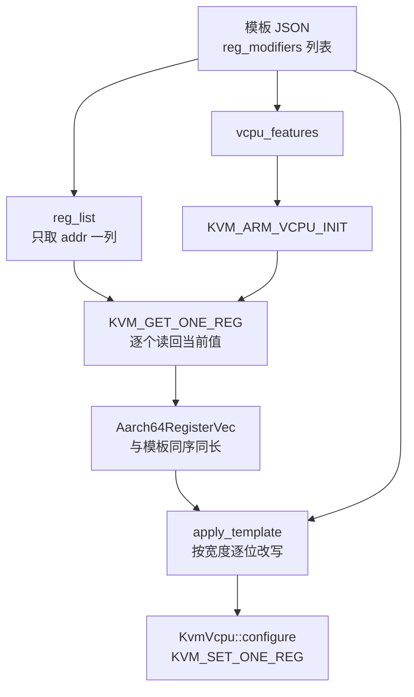

# 22 · aarch64 模板与 cpu-template-helper

> aarch64 没有 CPUID 那样一棵可枚举的特性树，它的「CPU 模板」是一串系统寄存器的改写指令。
> 本篇讲这串指令怎么编码、上游唯一那张静态模板改了什么、鲲鹏上为什么用不上它，
> 以及上游为模板作者准备的 `cpu-template-helper` 工具凭什么能说出「guest 会看到什么」。
>
> **读者**：系统工程师、要在 aarch64 上做快照迁移的维护者。
> **预备**：[第 20 篇 · CPU 模板机制](20-cpu-templates.md#3-位掩码一个字段表达三态)、
> [第 18 篇 · aarch64 vCPU](18-aarch64-vcpu.md)。
> **代码**：`src/vmm/src/cpu_config/aarch64/`、`src/vmm/src/arch/aarch64/regs.rs`、
> `src/vmm/src/arch/aarch64/vcpu.rs`、`src/cpu-template-helper/src/`

---

## 0. 本篇要回答的问题

1. 为什么 aarch64 的 `CpuConfiguration` 是一个寄存器向量，而不是像 x86_64 那样的特性树？
2. 模板 JSON 里那个 `addr` 是什么编码，Firecracker 凭它知道寄存器有多宽？
3. V1N1 静态模板改了哪几个寄存器、遮掉了哪些特性，它的适用范围由谁来把关？
4. 鲲鹏 950 上有没有可用的静态模板？本项目实际给 Firecracker 传了什么 `cpu_template`？
5. `cpu-template-helper` 的四个动作各解决什么问题，它为什么必须真的启动一台 microVM？
6. dump 出来的寄存器清单为什么要排除三个寄存器？

---

## 1. 问题：没有一棵可以整棵拿走的特性树

x86_64 的特性发现有一个统一入口：`CPUID` 指令。它是自描述的 —— 给一个 leaf 和 subleaf，
返回四个寄存器，KVM 还提供 `KVM_GET_SUPPORTED_CPUID` 把整棵树一次交出来。
于是 x86_64 的 `CpuConfiguration` 可以拿着一份全量拷贝，模板只是在上面改几个位。

aarch64 没有这样的指令。特性发现靠的是一组 ID 寄存器：`ID_AA64PFR0_EL1` 说有没有 SVE、
`ID_AA64ISAR0_EL1` 说有没有 SHA3 与 SM4，等等。每个寄存器是 64 位，切成 16 个 4 位字段，
每个字段编码一项特性的等级。guest 用 `MRS` 指令读它们，读到的值由 KVM 决定；
Firecracker 能做的是在 vCPU 启动前用 `KVM_SET_ONE_REG` 把它们写成想让 guest 看到的样子。

「没有全量树」带来一个直接后果：**Firecracker 无从知道「所有可改的特性」是哪些**，
它只能问 KVM「这台 vCPU 有哪些寄存器」。这就是
`src/vmm/src/arch/aarch64/vcpu.rs` 的 `KvmVcpu::get_all_registers_ids()` 做的事：
调 `KVM_GET_REG_LIST`，先按 500 个的容量试一次，遇到 `E2BIG` 就按内核回报的数量重新分配再试一次。
返回的是一串 64 位的寄存器 ID，核心寄存器与系统寄存器混在一起，没有分类信息。

因此 aarch64 一侧的 `CpuConfiguration`（`src/vmm/src/cpu_config/aarch64/mod.rs`）只有一个成员：

```rust
pub struct CpuConfiguration {
    /// Vector of CPU registers
    pub regs: Aarch64RegisterVec,
}
```

而且这个向量**不是**全部寄存器，它只包含模板点名的那些。
`CpuConfiguration::new()` 先对每个 vCPU 调 `KvmVcpu::init(&cpu_template.vcpu_features)`
完成 `KVM_ARM_VCPU_INIT`，再用 `get_registers(&vcpus[0].kvm_vcpu.fd, &cpu_template.reg_list(), &mut regs)`
按模板给出的 ID 列表逐个 `KVM_GET_ONE_REG` 读回来。没有模板时 `reg_list()` 是空的，
`regs` 也是空的，后面 `KvmVcpu::configure()` 里那个写寄存器的循环一次都不执行。

`apply_template()` 随后把 `template.reg_modifiers` 与 `self.regs` 用 `zip` 一一配对。
这个配对**依赖两个序列同序同长**，而它成立的唯一理由是 `regs` 本来就是按同一个 `reg_list()`
顺序读出来的。这是一处隐式契约：任何一侧的顺序变化都会让模板改错寄存器，代码里没有断言拦它。

下面这张图给出一条模板从 JSON 到 KVM 的完整路径，它同时说明了「基线由模板决定」这件事。



注意 `vcpu_features` 这条支线：它改的不是寄存器，而是传给 `KVM_ARM_VCPU_INIT` 的
`kvm_vcpu_init.features` 数组，必须在 vCPU init 之前应用。这是 aarch64 侧
`CpuConfiguration::new()` 要接收 `&mut [Vcpu]` 的原因。

---

## 2. 寄存器 ID：模板里的 `addr` 是什么

模板 JSON 里每个条目的 `addr` 是 KVM 的寄存器 ID —— 一个 64 位整数，本身就编码了寄存器的身份与宽度：

```text
 63      56 55  52 51        32 31          16 15                 0
+----------+------+------------+--------------+--------------------+
|   0x60   | size |  保留为零  |    寄存器类   |   类内的具体编号    |
+----------+------+------------+--------------+--------------------+
  KVM_REG_ARM64          KVM_REG_ARM_CORE：kvm_regs 结构里的 u32 偏移
                         KVM_REG_ARM64_SYSREG：op0 op1 CRn CRm op2
```

宽度由 `size` 字段给出，`src/vmm/src/arch/aarch64/regs.rs` 的 `reg_size()` 把它换算成字节数：
`2^size`。`RegSize` 枚举列出 8 位到 2048 位九档，但模板只支持 32 / 64 / 128 位三档。

举一个能对上号的例子。`ID_AA64PFR0_EL1` 的编码参数是 `op0=3, op1=0, CRn=0, CRm=4, op2=0`，
`regs.rs` 的 `arm64_sys_reg!` 宏把它们按 KVM 的移位规则拼起来，得到 `0x603000000013c020` ——
这正是 `tests/data/custom_cpu_templates/V1N1.json` 里第一个条目的 `addr`。
`0x60` 是架构标识，`0x3` 是 size，即 `2^3 = 8` 字节，`0x0013` 是系统寄存器类。

宽度信息不是装饰，它有两处用途。

第一处是**解析期校验**。`CustomCpuTemplate::validate()`（`aarch64/custom_cpu_template.rs`）
对每个条目算出 `reg_size(modifier.addr)`，如果是 32 位或 64 位寄存器，就检查位掩码的
`value` 与 `filter` 是否超出该宽度能表达的范围，超了就报错；如果 ID 解出来是别的宽度，
直接拒绝，错误信息点明「只支持 32、64、128 位寄存器」。
`validate()` 在 `TryFrom<&[u8]>` 里被调用，也就是每次从 JSON 读模板都会跑一遍。
x86_64 一侧的同名函数是个空壳，这是两个架构少有的、aarch64 更严格的地方
（对照表见[第 20 篇 §7](20-cpu-templates.md#7-两个架构的模板能力对照)）。

第二处是**应用期分派**。`apply_template()` 用 `reg.size()` 判断这个寄存器实际有多宽，
分别按 `u32` / `u64` / `u128` 取值、过位掩码、再写回，并在 32 位与 64 位两档上
显式与 `0xFFFF_FFFF` / `0xFFFF_FFFF_FFFF_FFFF` 相与，防止位掩码的高位溢出到本不该动的位。
其它宽度走 `unreachable!()` —— 能走到这里说明 `validate()` 已经放行了不该放行的东西。

---

## 3. 唯一的静态模板：V1N1

上游 aarch64 只有一张静态模板，`StaticCpuTemplate` 枚举里除了 `None` 就是 `V1N1`
（`aarch64/static_cpu_templates/mod.rs`）。它的目标是把 Neoverse V1 伪装成 Neoverse N1，
也就是把新一代核比老一代核多出来的那些特性从 ID 寄存器里抹掉，
让同一份快照能在两代机器之间迁移。构造函数 `v1n1()` 是一段带注释的常量表：

| 寄存器 | 遮掉的特性 | 位掩码的做法 |
|---|---|---|
| `ID_AA64PFR0_EL1` | SVE（连带 SVEBF16、SVEI8MM）、DIT | 两个 4 位字段清零 |
| `ID_AA64ISAR0_EL1` | SHA3、SHA512、SM3、SM4、FHM、FLAGM、RNDR | 六个字段清零，SHA2 降到 `0b0001` |
| `ID_AA64ISAR1_EL1` | JSCVT、FCMA、BF16、DGH、I8MM | 四个字段清零，DPB 与 LRCPC 各降到 `0b0001` |
| `ID_AA64MMFR2_EL1` | USCAT | 一个字段清零 |

有两处值得单独记。一是**降级而不是清零**：SHA2 被设成 `0b0001` 而不是 `0`，
因为 Arm 的文档规定 `SHA3` 为 `0b0001` 时 `SHA2` 必须取特定值，字段之间存在一致性约束；
DPB 与 LRCPC 同理，从「二级支持」降到「一级支持」而不是取消。
模板作者要自己遵守架构手册里的字段约束，`validate()` 只管宽度，不管语义。

二是**适用范围没有代码把关**。x86_64 的静态模板自带宿主白名单，机型不符会在启动时报错
（见[第 20 篇](20-cpu-templates.md#2-两种模板一条通路)）。aarch64 的
`GetCpuTemplate::get_cpu_template()` 在 `StaticCpuTemplate::V1N1` 这一支上只留了一行注释：
`// TODO: Check if the CPU model is Neoverse-V1.`，然后直接返回 `v1n1()`。
代码里因此不存在「这台机器不是 V1」这个错误。

推论：在非 Neoverse V1 的机器上指定 V1N1，结果取决于 KVM 是否接受对这些 ID 寄存器的写入。
若接受，guest 会看到一份被按 V1 假设裁剪过、但与本机实际能力未必对齐的特性表；
若 KVM 拒绝某个寄存器的写入，`KvmVcpu::configure()` 会在 `set_one_reg()` 上返回
`KvmVcpuError::ApplyCpuTemplate`，启动失败。两种结果都不是「静默降级」以外的第三种，
但哪一种发生取决于宿主内核版本，Firecracker 这一侧没有给出判断依据。

模板的硬编码版本与 JSON 版本之间有一个一致性测试（`static_cpu_templates/mod.rs` 的
`verify_consistency_with_json_templates`），拿 `v1n1()` 与 `tests/data/custom_cpu_templates/V1N1.json`
逐字段比对。这保证了文档里给出的 JSON 与代码里的常量表不会各走各的。

---

## 4. 鲲鹏上的选择：不传模板

V1N1 针对的是 Graviton3 一类的 Neoverse V1 核，鲲鹏 950 不在这个谱系里，
上游也没有为它准备静态模板。可选项只剩两个：写一张自定义模板，或者干脆不用模板。

本项目走的是后者。e2b 侧的编排器在
`packages/orchestrator/internal/sandbox/fc/client.go` 里构造 `MachineConfiguration` 时
只填了 `VcpuCount`、`MemSizeMib`、`Smt`、`TrackDirtyPages`，大页开启时再加 `HugePages`，
**没有 `CPUTemplate` 字段**。于是 `machine_config.cpu_template` 保持 `None`，
`get_cpu_template()` 返回一个默认构造的空 `CustomCpuTemplate`，
`reg_list()` 为空，`CpuConfiguration::new()` 读回一个空向量，
`KvmVcpu::configure()` 的写寄存器循环空转，guest 直接看到宿主核的原始 ID 寄存器。

这个选择的收益与代价是明确的一对。收益是省掉一整类故障：
不用维护模板、不会因为字段约束写错而让 guest 内核在启动早期崩溃、
也不会因为遮掉某个特性而损失性能。代价是**快照的可迁移性只覆盖同型号宿主**：
一台机器上生成的 vmstate 里存着这台机器的寄存器值，搬到特性集合不同的机器上恢复，
guest 已经按旧的特性表做过决策（内核启动时选定的指令路径、glibc 选定的函数实现），
恢复后可能执行到本机不存在的指令。

对 checkpoint / restore 这个场景，这个代价不成立：原地回滚发生在同一台机器、
同一个 Firecracker 进程里，快照从来不跨宿主。这就是不写模板的理由
（回滚的机制见[第 69 篇 · PUT /snapshot/rollback](69-rollback-api-and-phases.md)）。
推论：如果以后要在鲲鹏集群内跨机迁移快照，模板不是可选项而是前提，
而第一步就是用下一节的工具把两台机器的寄存器清单 dump 出来做差集。

---

## 5. `cpu-template-helper`：一个会真的开机的工具

模板作者面对的问题是：**写下一份模板之后，guest 到底会看到什么？**
这个问题无法从代码里读出来，因为答案取决于宿主 CPU、宿主内核的 KVM 版本，
以及 Firecracker 自己在引导路径上写的那些寄存器。唯一可靠的回答方式是真的跑一遍。

`src/cpu-template-helper/` 就是这件事的工具化。它的核心是
`src/utils/mod.rs` 的 `build_microvm_from_config()`：

- 没给配置文件时，`build_mock_config()` 临时写出一个内置的 mock 内核镜像
  （`src/utils/mock_kernel/`，编译期由 `build.rs` 产出并 `include_bytes!` 进二进制）
  和一个空的 rootfs 临时文件，拼出一份最小的 Firecracker 配置 JSON；
- 用 `get_empty_filters()` 装一套空的 seccomp 过滤器，因为这个工具不对外服务，不需要限制；
- 调 `vmm::builder::build_microvm_for_boot()` 走完整的启动路径。

关键在于用的是 `build_microvm_for_boot()` 而不是 `build_and_boot_microvm()`：
前者建完 microVM 就返回，vCPU 线程停在 `Paused` 状态
（见[第 11 篇 §7](11-builder.md#7-收尾起线程与装-seccomp)）。
模板已经应用、引导寄存器已经写好、但 guest 一条指令都没执行 —— 这正是「guest 将要看到的 CPU」
这个问题成立的那一刻。随后 `Vmm::dump_cpu_config()` 给每个 vCPU 线程发一个
`VcpuEvent::DumpCpuConfig`，vCPU 线程调 `KvmVcpu::dump_cpu_config()`，
它用 `get_all_registers()` 把 `KVM_GET_REG_LIST` 报出来的**全部**寄存器读回来。

注意这里与启动路径的不对称：启动路径只读模板点名的寄存器，dump 路径读全部。
前者是为了改写，后者是为了观察。

四个动作分别解决一个问题：

| 命令 | 输入 | 输出 | 解决的问题 |
|---|---|---|---|
| `template dump` | 可选的配置与模板 | 一份 `CustomCpuTemplate` JSON | guest 会看到什么 |
| `template strip` | 两份以上的配置 dump | 各自去掉公共项的版本 | 两台机器差在哪 |
| `template verify` | 配置与模板 | 成功或差异报告 | 模板真的生效了吗 |
| `fingerprint dump` / `compare` | 同上 / 两份 fingerprint | 宿主环境 + 配置 / 差异报告 | 宿主环境变了吗 |

**dump** 的转换在 `src/template/dump/aarch64.rs` 的 `config_to_template()`：
把每个寄存器变成一个 `RegisterModifier`，`filter` 一律取 `u128::MAX`（管住所有位），
`value` 取读回来的值。宽度不是 32 / 64 / 128 的寄存器打一条 warn 日志后跳过 ——
aarch64 上真实存在这样的寄存器，SVE 的向量寄存器就有 2048 位的编码。
然后按三个 ID 做排除：

```rust
const REG_EXCLUSION_LIST: [u64; 3] = [
    SYS_CNTV_CVAL_EL0,
    SYS_CNTPCT_EL0,
    PC,
];
```

前两个是计时器寄存器，值随时间走；`PC` 由内核镜像决定。
三者都不是「CPU 的能力」，把它们留在 dump 里会让两次 dump 永远不相等，
也会让 `fingerprint compare` 永远报差异。最后按 `addr` 排序，让输出稳定可 diff。

**strip** 的语义比名字微妙。`src/template/strip/mod.rs` 的 `strip_common()`
把多份模板转成 `HashMap`，先假定第一份就是公共部分，然后逐 key 比对：
某个 key 在任何一份里缺席就从公共部分删掉；都在的话，把各份「过滤后的值」两两异或累加成 `diff`，
再把 `diff` 写回公共部分的 `filter`。于是公共部分的 `filter` 最终标记的是**有差异的位**，
这些位随后从各份里保留、其余位被移除。结果是：输出只剩下彼此不同的部分。
`fingerprint compare` 发现 `guest_cpu_config` 不一致时，内部就是调 `strip()` 来生成可读的差异。

**verify** 在 `src/template/verify/mod.rs` 的 `verify_common()`：
遍历模板里的每一项，在 dump 出来的配置里按 key 找对应项，找不到报 `KeyNotFound`；
找到就用**模板的 filter**同时遮住模板值与实测值再比较。
只比模板管的位，这是对的 —— 模板没点名的位本来就不归它管。
不一致时 `DiffString::to_diff_string()` 打印两行二进制加一行 `^` 标记，逐位指出差在哪。
一条模板项验证失败会让整个命令以非零退出码结束，适合放进流水线。

**fingerprint** 比模板多记了宿主环境：Firecracker 版本、宿主内核版本（`uname`）、
微码版本、BIOS 版本与修订号，加上 `guest_cpu_config`。
aarch64 上「微码版本」读的是 `/sys/devices/system/cpu/cpu0/regs/identification/revidr_el1`，
x86_64 读的是 `/sys/devices/system/cpu/cpu0/microcode/version`；
BIOS 两项都读 `/sys/devices/virtual/dmi/id/` 下的文件。
推论：DMI 是 x86 固件的产物，在不提供 DMI 的 aarch64 平台上这两个 sysfs 文件可能不存在，
此时 `read_sysfs_file()` 会返回 `ReadSysfsFile` 错误，整个 `fingerprint dump` 失败 ——
`compare` 的 `--filters` 只能过滤比较哪些字段，不能让 dump 少收集一个字段。

工具的代价也要说清楚：它必须在目标宿主机上、以能打开 `/dev/kvm` 的身份运行，
并且真的建一台 microVM。它不是一个离线的静态分析器，不能拿着一份模板在开发机上验证它在生产机上的效果。

---

## 6. 后续各层的差异

e2b 定制版与 ARM 适配版都没有改动 `src/vmm/src/cpu_config/aarch64/` 下的任何文件，
模板机制本身两层都是上游原样。两层各给 `InstanceInfo` 加了一个字段
（e2b 定制版加 `memory_regions`，ARM 适配版再加 `dirty_tracking`），
因此都要同步修改 `src/cpu-template-helper/src/utils/mod.rs` 里构造 `InstanceInfo` 的那几行，
各补一个 `None`。这是唯一的改动，字段本身的含义见
[第 50 篇 · /memory/mappings](50-memory-mappings-api.md) 与
[第 73 篇 · 失败模型、Faulted 状态与 seccomp 白名单](73-failure-model-faulted-and-seccomp.md)。

---

## 7. 小结

- aarch64 没有 CPUID 那样的全量特性树，特性藏在一组 ID 寄存器的 4 位字段里，
  所以它的 `CpuConfiguration` 是一个寄存器向量，而且只装模板点名的寄存器。
- `apply_template()` 用 `zip` 把模板项与读回的寄存器配对，正确性依赖两个序列同序同长，
  这个契约由「二者都按 `reg_list()` 生成」保证，代码里没有断言。
- 模板里的 `addr` 是 KVM 寄存器 ID，本身编码了架构、宽度与寄存器身份；
  宽度既用于解析期的位掩码校验（`validate()`），也用于应用期的取值分派。
- V1N1 是上游 aarch64 唯一的静态模板，改四个 ID 寄存器，把 Neoverse V1 伪装成 N1；
  部分字段是降级而非清零，因为架构手册对字段之间有一致性约束。
- V1N1 的适用机型没有代码检查，`get_cpu_template()` 里只有一行 TODO；
  这与 x86_64 静态模板自带宿主白名单形成对照。
- 鲲鹏 950 没有可用的静态模板，本项目也不传 `cpu_template`：
  编排器构造的 `MachineConfiguration` 里没有这个字段，于是寄存器向量为空，写寄存器的循环空转。
  代价是快照只能在同型号宿主之间迁移，而原地回滚场景不需要跨宿主。
- `cpu-template-helper` 用 mock 内核和空 seccomp 真的建一台 microVM，
  停在 vCPU 尚未执行任何指令的时刻读回全部寄存器；这是「guest 会看到什么」唯一可靠的答案。
- dump 排除计时器寄存器与 PC，否则两次 dump 永不相等；strip 把「公共」的 filter 变成差异位掩码；
  verify 只校验模板点名的位。
- fingerprint 把宿主环境一起记下来，但它依赖的 DMI 与微码 sysfs 路径是按架构写死的，
  aarch64 上未必存在。

---

## 延伸阅读 / 下一篇

- [第 20 篇 · CPU 模板机制：静态、自定义与序列化](20-cpu-templates.md) —— 位掩码语法、两个入口、模板与快照的关系。
- [第 21 篇 · x86_64 CPUID 与 MSR 归一化](21-x86-64-cpuid-msr-normalization.md) —— 另一侧的实现，用来对照「有没有归一化」这个差别。
- [第 18 篇 · aarch64 vCPU：KVM_ARM_VCPU_INIT、寄存器与 PSCI](18-aarch64-vcpu.md) —— `vcpu_features` 与 `KVM_ARM_VCPU_INIT` 的完整语义。
- [第 59 篇 · aarch64 与 x86_64 运行路径的差异清单](59-aarch64-vs-x86-64-runtime-paths.md) —— 本篇之外的其它架构差异。
- 上游文档 `docs/cpu_templates/cpu-template-helper.md` 与 `docs/cpu_templates/cpu-templates.md`：工具的使用说明与模板格式参考，以代码为准。
- **下一篇**：[第 23 篇 · 设备总线与 MMIO 设备管理器](23-bus-and-mmio-device-manager.md)。
