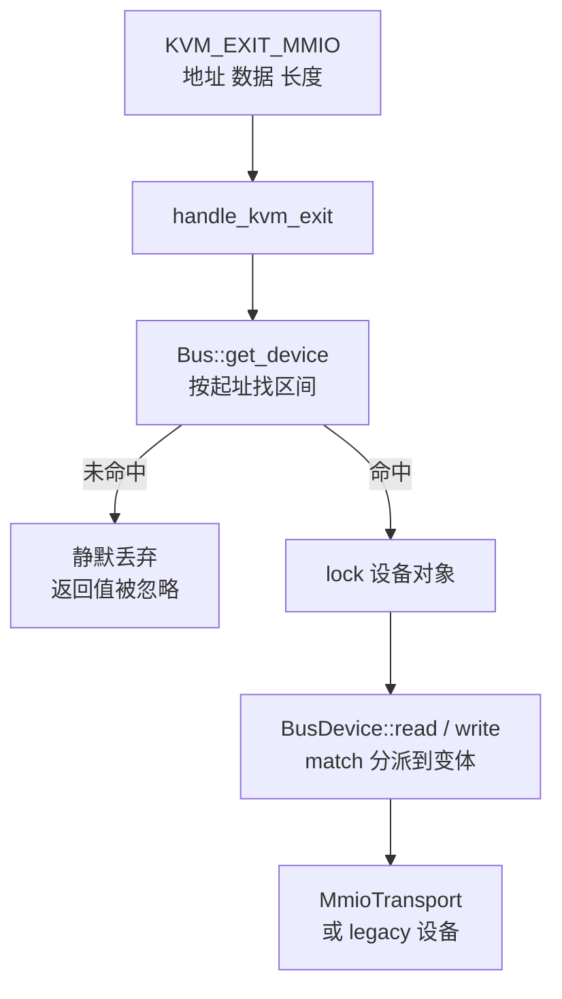
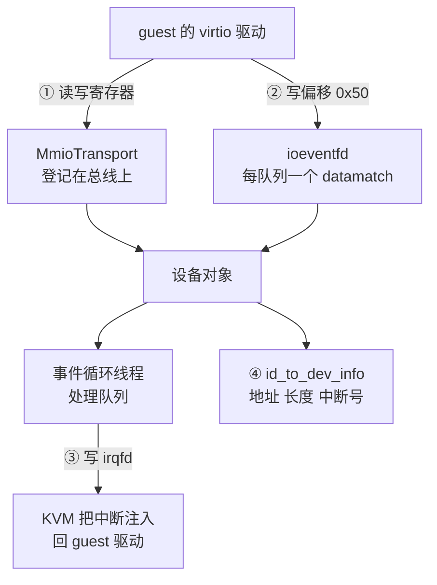

# 23 · 设备总线与 MMIO 设备管理器

> vCPU 因为一次设备访问退出时，手上只有一个客户机物理地址和几个字节。
> 把这个地址变成某个设备对象上的一次方法调用，是 `Bus` 与 `MMIODeviceManager` 这两层的工作。
> 本篇讲这张表怎么建、一个设备注册时连了哪几根线、guest 怎么知道设备在哪，
> 以及恢复快照时地址与中断号怎么回到原位。
>
> **读者**：系统工程师、要加设备或改设备布局的维护者。
> **预备**：[第 11 篇 · builder](11-builder.md#5-挂设备顺序总线与四条连线)、
> [第 03 篇 · 本书用到的 KVM API](03-kvm-api-primer.md)。
> **代码**：`src/vmm/src/devices/bus.rs`、`src/vmm/src/device_manager/mmio.rs`、
> `resources.rs`、`legacy.rs`、`acpi.rs`、`persist.rs`

---

## 0. 本篇要回答的问题

1. 一次 MMIO 退出怎么找到对应的设备？访问一个没有设备的地址会发生什么？
2. `BusDevice` 为什么是枚举而不是 trait object，代价在哪？
3. 注册一个 virtio 设备时分配了什么、连了哪几根线？
4. guest 怎么知道设备在哪：两个架构走的是哪两条路，为什么其中一条要排序？
5. 遍历设备的三个接口支撑了哪些功能？`kick_devices()` 补的是什么？
6. 从快照恢复时，设备的地址与中断号怎么回到原来的位置？

---

## 1. 问题：vCPU 退出时手上只有一个地址

guest 访问一段没有映射为内存的客户机物理地址时，KVM 无法自己处理，
于是 `KVM_RUN` 返回，带回一个 `KVM_EXIT_MMIO`：地址、数据缓冲区、长度、读还是写。
Firecracker 一侧的接住点是 `src/vmm/src/vstate/vcpu.rs` 的 `handle_kvm_exit()`：

```rust
VcpuExit::MmioRead(addr, data) => {
    if let Some(mmio_bus) = &peripherals.mmio_bus {
        let _metric = METRICS.vcpu.exit_mmio_read_agg.record_latency_metrics();
        mmio_bus.read(addr, data);
        METRICS.vcpu.exit_mmio_read.inc();
    }
    Ok(VcpuEmulation::Handled)
}
```

x86_64 还有第二条同形的路径：`VcpuExit::IoIn` / `IoOut` 走 `pio_bus`，
实现在 `src/vmm/src/arch/x86_64/vcpu.rs`。两条路径用的是同一个 `Bus` 类型，只是两个实例。

这段代码有两处值得先记下来，它们决定了后面讲的一切的边界。

**一是总线是 `Option`。** `Vmm::start_vcpus()`（`src/vmm/src/lib.rs`）在起线程前给每个 vCPU
调 `set_mmio_bus(self.mmio_device_manager.bus.clone())`，clone 的是一个内部持有
`Arc<Mutex<BusDevice>>` 的 `BTreeMap`，所以所有 vCPU 线程与事件循环线程共享同一批设备对象。
若 `mmio_bus` 是 `None`，这次退出被当作已处理，读操作不动 `data`，写操作被丢弃。

**二是返回值被忽略。** `Bus::read()` / `write()` 返回 `bool` 表示有没有命中设备，
但调用方没有接。guest 访问一个 MMIO 空洞不会报错、不会记 metric、不会打日志，
读到的是缓冲区里的原值，写下去的字节消失。这是一个有意的选择 ——
guest 内核探测设备时本来就会读一些不存在的地址 —— 代价是调试时看不到这类访问。

---

## 2. `Bus`：一棵按起址排序的树

`src/vmm/src/devices/bus.rs` 里的 `Bus` 只有一个字段：
`devices: BTreeMap<BusRange, Arc<Mutex<BusDevice>>>`。
`BusRange(base, len)` 的 `Ord` 与 `PartialEq` 只比较 `base`，不看 `len` ——
这让「按起址排序」成立，也让「同一个起址只能有一个设备」由容器本身保证。

查找入口是 `get_device(addr)`：先用 `first_before(addr)` 找到起址不大于 `addr` 的那个区间，
再检查 `addr - start < len`，命中就返回区间内偏移与设备。
`first_before()` 的实现是 `self.devices.iter().rev()` 的线性扫描 ——
源码里还留着一条注释说等切换到新版本编译器后改用 `range(..addr)`。
一台 microVM 上的 MMIO 设备是个位数，线性扫描与二分查找的差别测不出来，
但这确实意味着分发是 O(设备数) 而不是 O(log 设备数)。

`insert()` 做两次重叠检查，因为单靠 `get_device(base)` 会漏掉一种情况：
新设备的起址落在老设备之前、但区间尾部盖住了老设备。
第二次检查用 `first_before(base + len - 1)` 找新区间末端之前的设备，
若它的起址不小于新设备的起址，说明它整个落在新区间里，判定为重叠。
`len == 0` 也按重叠拒绝。

命中之后是 `dev.lock().expect("Failed to acquire device lock")`。
这把锁是 vCPU 线程与事件循环线程共享设备对象的代价：
guest 的一次 MMIO 写与事件循环里的一次队列处理会互相阻塞。
锁被毒化时代码选择 panic，理由是「锁失败是严重错误条件」——
一个设备线程 panic 之后继续跑的 VM 状态无法推理。



---

## 3. `BusDevice`：枚举而不是 trait object

同一个文件里的 `BusDevice` 是一个枚举，不是 `Box<dyn BusDevice>`：

```rust
pub enum BusDevice {
    I8042Device(I8042Device),
    #[cfg(target_arch = "aarch64")]
    RTCDevice(RTCDevice),
    BootTimer(BootTimer),
    MmioTransport(MmioTransport),
    Serial(SerialDevice<std::io::Stdin>),
}
```

`read()` 与 `write()` 是两个 `match`，把偏移与数据转发给具体变体的 `bus_read` / `bus_write`。
需要拿到具体类型时用一组手写的访问器：`mmio_transport_ref()`、`serial_mut()`、
`i8042_device_ref()` 等，返回 `Option<&T>` —— 这套方法代替了 trait object 上的 `downcast`。

收益是没有虚表、没有装箱、编译期就知道全部可能的设备类型。
代价有两个，都该如实说。**一是加一个总线设备要改这个枚举和它的六组方法**，
新增 virtio 设备不受影响（它们都走 `MmioTransport` 这一个变体）。
**二是 `MutEventSubscriber` 的实现是部分的**：

```rust
impl MutEventSubscriber for BusDevice {
    fn process(&mut self, event: Events, ops: &mut EventOps) {
        match self {
            Self::Serial(serial) => serial.process(event, ops),
            _ => panic!(),
        }
    }
    ...
}
```

只有串口需要作为事件源注册进事件循环，其余变体走到这里就 panic。
类型系统没有拦住「把一个 `BusDevice::BootTimer` 注册进事件管理器」这件事，
拦它的是一条运行期的 `panic!()`。virtio 设备的事件订阅者是另一套对象，不经过这里
（见[第 25 篇 §5](25-virtio-device-model-and-transport.md#5-事件处理器激活前后是两套注册)）。

---

## 4. `MMIODeviceManager`：分配、注册、连线

`src/vmm/src/device_manager/mmio.rs` 的 `MMIODeviceManager` 持有两张表：
一张是上面那条总线，另一张是 `id_to_dev_info: HashMap<(DeviceType, String), MMIODeviceInfo>`。
键里的 `DeviceType`（`src/vmm/src/arch/mod.rs`）区分 `Virtio(u32)`、`Serial`、`Rtc`、`BootTimer`，
后两者与 `Serial` 只在 aarch64 上存在。值只有三项：`addr`、`len`、`irq: Option<NonZeroU32>`。
这张表是「设备的元信息」，总线是「设备的对象」，两者靠地址关联。

分配走 `allocate_mmio_resources()`，它向 `ResourceAllocator`（`resources.rs`）要两样东西：

- 中断号：`allocate_gsi(irq_count)`。virtio 设备固定要 1 个，boot timer 要 0 个。
  要 0 个时 `irq` 是 `None`，要 2 个及以上直接报 `InvalidIrqConfig` —— v1.12.1 的
  `register_mmio_virtio()` 写死了「一个设备一条中断线」。
- 地址：`allocate_mmio_memory(MMIO_LEN, MMIO_LEN, AllocPolicy::FirstMatch)`，
  即按 `MMIO_LEN` 对齐、从低地址起找第一个够大的空洞。

`MMIO_LEN` 是 `0x1000`。规范要求的下限是 `0x100`（配置空间的起始偏移）加上配置空间本身的长度，
上游取了一整页，注释里说明是硬编码。

两个架构的资源池由 `arch` 常量给出，差别很大：

| 维度 | x86_64 | aarch64 |
|---|---|---|
| MMIO 区起址 | `0xC000_0000`（4 GiB 减 768 MiB） | `0x4000_0000`（1 GiB） |
| MMIO 区长度 | 768 MiB | 1 GiB（到 DRAM 起点 2 GiB 为止） |
| GSI 范围 | 5 – 23 | 32 – 128 |
| 该区之下是什么 | 32 位地址空间的低端 DRAM | GIC 的寄存器 |

GSI 范围的差别是两种中断控制器的直接后果：x86_64 只有 IOAPIC 的 24 条线，
前几条被 legacy 设备占走；aarch64 的 GIC 把 32 以下留给 PPI 与 SGI，
上限 128 是 KVM 对「GIC 支持的中断数」的约束（必须大于 32、小于 1023、且是 32 的倍数）。

`register_mmio_virtio()` 做完分配之后连四样东西，下面这张图给出它们的方向：



- **总线登记**：`bus.insert(BusDevice::MmioTransport(...), addr, len)`，寄存器读写从此有了去处。
- **ioeventfd**：对设备的**每一个**队列调一次 `vm.register_ioevent(queue_evt, &io_addr, i)`，
  `io_addr` 全都是 `addr + NOTIFY_REG_OFFSET`（`0x50`），用队列下标 `i` 作为 datamatch。
  也就是说所有队列共用一个通知地址，靠写进去的值区分，且这条路径不退出到用户态。
- **irqfd**：`vm.register_irqfd(&locked_device.interrupt_trigger().irq_evt, irq)`，
  设备写这个 eventfd，KVM 就把 `irq` 号的中断注入 guest。
- **元信息登记**：`id_to_dev_info.insert((DeviceType::Virtio(type), device_id), device_info)`。

设备对象本身此时还是 `Inactive` 的，它拿不到 guest 内存句柄；
激活由驱动写 `DRIVER_OK` 触发，属于传输层的语义，在[第 25 篇](25-virtio-device-model-and-transport.md)。

x86_64 的 legacy 设备走另一个管理器 `PortIODeviceManager`（`legacy.rs`），
它有自己的 `io_bus`，四个串口与 i8042 挂在固定端口、绑定固定 GSI，不经过资源分配器；
`ACPIDeviceManager`（`acpi.rs`）只管一个 vmgenid 设备，它连的是 irqfd 加一段 AML。
两者的细节在[第 24 篇 · legacy 设备](24-legacy-devices.md)与
[第 35 篇 · entropy、vmgenid 与速率限制器](35-entropy-vmgenid-rate-limiter.md)。

---

## 5. guest 怎么知道设备在哪

地址是 Firecracker 分配的，guest 必须被告知。两个架构用两种完全不同的机制。

**x86_64 走内核命令行加 ACPI。** `register_mmio_virtio_for_boot()` 里调
`add_virtio_device_to_cmdline()`，往命令行追加 `virtio_mmio.device=<size>K@<addr>:<irq>`；
同时调 `add_virtio_aml()`，往 `dsdt_data` 里累积一个 AML 设备节点
（`_HID` 取 `LNRO0005`，`_UID` 取 `irq - IRQ_BASE`，`_CRS` 里写死地址与中断）。
`dsdt_data` 是一个 `Vec<u8>`，按注册顺序追加。
源码注释说明了为什么要这样而不是事后遍历总线：**AML 里设备出现的顺序决定 guest 里的设备名**，
根块设备必须排在最前面才会成为 `/dev/vda`，而遍历总线拿不到注册顺序。

**aarch64 走设备树。** 这条路径上不往命令行加任何 virtio 参数，
`add_virtio_device_to_cmdline()` 本身就带 `#[cfg(target_arch = "x86_64")]`。
设备信息由 `configure_system_for_boot()` 把 `get_device_info()` 整张表交给
`fdt::create_fdt()`，`create_devices_node()` 按 `DeviceType` 分派：
`Rtc` 生成 `rtc@<addr>` 节点、`Serial` 生成 `uart@<addr>` 节点、`BootTimer` 跳过、
virtio 设备先收集进一个 `Vec`，**按 `addr` 从低到高排序**后再逐个生成 `virtio_mmio@<addr>` 节点。

这次排序不是美观问题。`id_to_dev_info` 是 `HashMap`，遍历顺序在两次运行之间不稳定，
而设备树里节点的先后同样决定 guest 里的设备名。x86_64 用「按注册顺序累积 AML」解决，
aarch64 用「按地址排序」解决 —— 而地址是按注册顺序从低到高分配的，
两者最终给出同一个次序。串口还要额外一步：`add_mmio_serial_to_cmdline()`
往命令行插 `earlycon=uart,mmio,0x...`，好让内核在解析设备树之前就能输出。

---

## 6. 遍历：运行时改配置与快照都靠它

`MMIODeviceManager` 提供三个遍历接口，它们的分工是本篇最实用的一节。

| 接口 | 遍历什么 | 谁在用 |
|---|---|---|
| `for_each_device()` | 全部登记设备，回调收到类型、id、元信息、总线对象 | 快照保存、下面两个接口的底座 |
| `for_each_virtio_device()` | 只有 `DeviceType::Virtio`，回调收到 `Arc<Mutex<dyn VirtioDevice>>` | `kick_devices()`、快照保存 |
| `with_virtio_device_with_id::<T>()` | 按类型与 id 精确定位一个设备并向下转换成 `T` | 运行时 PATCH |

`with_virtio_device_with_id()` 是运行时改配置的唯一入口：
它从总线取出 `MmioTransport`、拿到 `Arc<Mutex<dyn VirtioDevice>>`、
`as_mut_any().downcast_mut::<T>()` 转成具体设备类型，转换失败报 `InvalidDeviceType`，
找不到报 `DeviceNotFound`。`PATCH /drives/{id}` 换后端文件、`PATCH /network-interfaces/{id}`
改限速器，走的都是这条路。

`for_each_device()` 有一个性质要留意：它遍历的是 `HashMap`，顺序不稳定。
`MMIODeviceManager::save()`（`device_manager/persist.rs`）用它把设备状态收集进
`DeviceStates` 的几个 `Vec`，所以**同一台 microVM 两次保存，`block_devices` 里的元素次序可能不同**。
这不影响正确性，因为恢复时的身份靠 `(类型, id)` 与存下来的 `addr`，不靠下标；
但它意味着两个快照文件的字节比对不能用来判断状态是否相同。

`kick_devices()` 是另一个专用遍历。`Vmm::resume_vm()` 做的第一件事就是调它：

```rust
pub fn resume_vm(&mut self) -> Result<(), VmmError> {
    self.mmio_device_manager.kick_devices();
    ...
```

它解决的问题是：**暂停与快照期间，事件循环可能漏掉一批通知。**
guest 写 ioeventfd 的那个通知是边沿触发的一次性事件，如果它发生在设备被冻结之后，
或者它对应的 epoll 事件还没被处理就进了快照，恢复之后不会有人再来敲一次门，
队列里的请求会一直挂着。`kick_devices()` 的做法是假装收到了这个通知：
对每个已激活的设备直接调一次它的队列处理函数。五类设备的处理各不相同：

| 设备 | 动作 | 理由 |
|---|---|---|
| balloon | `process_virtio_queues()` | 统计队列由 timerfd 驱动，不需要敲 |
| virtio-block | `process_virtio_queues()`，vhost-user 块设备跳过 | 后端在另一个进程里，没有可敲的队列 |
| net | `process_virtio_queues()` | 限速器恢复成「未阻塞」，在途的 timerfd 事件可丢 |
| vsock | 只 `signal_used_queue()` | 连接状态不跨快照保存，敲一下只为让 guest 处理复位事件 |
| entropy | `process_virtio_queues()` | 同 block |

整个遍历的错误被 `let _: Result<(), MmioError> = ...` 显式丢弃 —— kick 失败不会让 resume 失败。

---

## 7. 恢复：地址精确匹配，中断号不重放

从快照恢复时设备要落回原来的地址，否则 guest 里已经建好的驱动会读到别人的寄存器。
`MMIODeviceManager::restore()` 的做法是：对每个设备先向资源分配器要一段
`AllocPolicy::ExactMatch(device_info.addr)` 的地址，要不到就报错；
再把存下来的 `MMIODeviceInfo` 原样传给 `register_mmio_virtio()`。
aarch64 的串口与 RTC 走同一套流程，只是构造设备对象的方式不同。

中断号的处理不对称，而且代码里有一段注释专门说明：
恢复路径**不**从 `IdAllocator` 重新分配 GSI，中断号直接取自存下来的 `device_info.irq`。
后果是恢复出来的 `ResourceAllocator` 的 GSI 分配器是空的 ——
它不知道哪些中断号已经被用掉了。v1.12.1 不支持热插拔，恢复之后没有人再申请 GSI，
所以这不会造成冲突；注释也承认，将来要做热插拔就得把分配器状态一起存进快照。
这是一处如实记下的技术债，不是缺陷：省掉的是 `IdAllocator` 的精确匹配 API 与一个快照字段。

设备状态本身（队列位置、协商过的特性、配置空间）不在这一层，
它们在[第 40 篇 · 设备状态的 Persist](40-device-persist.md)。

---

## 8. 后续各层的差异

`bus.rs` 与 `device_manager/` 下的文件在 e2b 定制版与 ARM 适配版都没有改动。
但 ARM 适配版的原地回滚建立在本篇的遍历接口上：它用 `for_each_virtio_device()`
先校验当前设备的数量、类型与顺序是否与快照一致，再把快照里的队列状态写回活着的设备对象，
最后同样靠 `kick_devices()` 让设备重新处理被回退过的队列。
见[第 72 篇 · 回滚的设备状态](72-rollback-devices.md)。

---

## 9. 小结

- 设备分发是一张按起址排序的表：`Bus` 用 `BTreeMap<BusRange, Arc<Mutex<BusDevice>>>`，
  查找实际是线性扫描；插入时做两次重叠检查。设备数是个位数，这个复杂度不构成问题。
- 访问一个没有设备的地址是静默的：`Bus::read()` / `write()` 的返回值在 vCPU 侧被忽略，
  既不报错也不记 metric。
- `BusDevice` 是枚举不是 trait object，收益是无动态分派、类型集合封闭；
  代价是加总线设备要改枚举，且 `MutEventSubscriber` 只对串口有实现，其余变体走到就 panic。
- 一个 virtio 设备注册时连四样东西：总线登记、每队列一个 ioeventfd（共用偏移 `0x50`，
  用队列下标做 datamatch）、一个 irqfd、一条元信息记录。中断线固定一条，多要就报错。
- 地址与中断号来自 `ResourceAllocator`：MMIO 按页对齐从低地址起分，GSI 按架构常量范围分。
  两个架构的 MMIO 区与 GSI 范围差别很大，根源是中断控制器不同。
- guest 得知设备位置的路径按架构分岔：x86_64 靠内核命令行参数加按注册顺序累积的 AML，
  aarch64 靠设备树里按地址排序生成的节点。排序与顺序都是为了让根块设备稳定地成为 `/dev/vda`。
- 三个遍历接口分别支撑快照保存、`kick_devices()` 与运行时 PATCH；
  底层是 `HashMap`，所以快照里设备的排列次序不稳定，身份靠 `(类型, id)` 与地址。
- `kick_devices()` 在 resume 的第一步补回暂停期间可能丢失的队列通知，
  五类设备各有各的补法，vsock 只发一次中断因为它的连接本来就不跨快照。
- 恢复时地址用 `ExactMatch` 精确复位，中断号直接沿用快照里的值而不重新分配，
  代价是 GSI 分配器的状态没有恢复，这是将来支持热插拔要先还的债。

---

## 延伸阅读 / 下一篇

- [第 11 篇 · builder：从配置到运行中的 microVM](11-builder.md#5-挂设备顺序总线与四条连线) —— 设备挂载在启动流水线里的位置与顺序约束。
- [第 25 篇 · virtio 设备模型与 MMIO 传输层](25-virtio-device-model-and-transport.md) —— `MmioTransport` 拿到偏移之后做什么。
- [第 40 篇 · 设备状态的 Persist](40-device-persist.md) —— 设备内部状态的保存与恢复。
- [第 19 篇 · aarch64 平台：内存布局、FDT 与 GIC](19-aarch64-platform.md) —— 设备树的其余部分与 GIC 的中断编号。
- **下一篇**：[第 24 篇 · legacy 设备：串口、i8042、RTC 与 boot timer](24-legacy-devices.md)。
