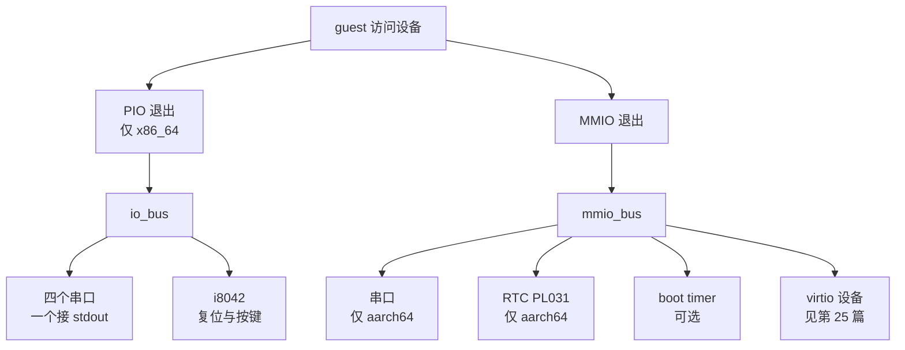

# 24 · legacy 设备：串口、i8042、RTC 与 boot timer

> 一台 microVM 里绝大部分 I/O 走 virtio，但有四个设备不能。串口要在 virtio 驱动加载之前就能打印，
> 重启要有一根线可以拉，aarch64 的时钟要有个来源，测启动时延要有个不被别的设备干扰的落点。
> 本篇讲这四个设备各自解决什么问题、为什么它们的实现只做到「刚好够用」，以及这个取舍的代价。
>
> **读者**：系统工程师。
> **预备**：[第 23 篇 · 设备总线与 MMIO 设备管理器](23-bus-and-mmio-device-manager.md)、
> [第 12 篇 · Vmm、事件循环与退出路径](12-vmm-event-loop-and-exit.md)。
> **代码**：`src/vmm/src/devices/legacy/`、`src/vmm/src/devices/pseudo/boot_timer.rs`、
> `src/vmm/src/device_manager/legacy.rs`、`src/vmm/src/builder.rs`、`src/vmm/src/arch/aarch64/fdt.rs`

---

## 0. 本篇要回答的问题

1. 已经有了 virtio，为什么还要在 microVM 里保留串口、i8042 这些上世纪的设备？
2. 串口的两个方向分别走什么路径，为什么输入方向需要一个额外的「缓冲区就绪」eventfd？
3. x86_64 与 aarch64 挂 legacy 设备的方式差在哪里，guest 是怎么被告知它们的位置的？
4. i8042 只实现了几条命令就够用，它「够用」的判据是什么？
5. 这四个设备在快照里保存了什么、没保存什么，`emulate_serial_init()` 在补什么窟窿？

---

## 1. 问题：virtio 出场太晚，也不管关机

virtio 设备要能工作，需要 guest 内核先完成三件事：解析设备树或扫描 MMIO 命令行参数、加载 virtio-mmio 传输层驱动、
完成设备协商并把 virtqueue 建起来。这三件事发生在内核初始化的中后段。在此之前内核有大量输出：
解压信息、内存布局、CPU 拓扑、早期 panic。如果这段时间没有输出通道，一台起不来的 microVM 在宿主侧就是一片沉默。

关机与重启是另一类。virtio 里没有「电源」这个设备，Firecracker 也不实现 ACPI 的电源管理方法。
guest 想让 VMM 知道「我要停了」，需要一条与数据面无关的通路。

第三类是时间。x86_64 上 guest 可以从 TSC 与 KVM 的 kvmclock 拿到时间；aarch64 上架构定时器给的是单调计数，
不是墙上时钟，内核启动时需要一个 RTC 才能把 `system_time` 设成合理值。

Firecracker 对这三类问题的回答是同一个：保留最小的一组 legacy 设备，每个只实现被 Linux 驱动真正用到的那部分寄存器。
它们合起来在 `src/vmm/src/devices/legacy/` 里不到 1200 行，其中一半是测试。
代价是这些设备对 guest 呈现的不是完整的硬件语义 —— 一个针对真实 8042 写的程序在这里会看到缺失的命令，
一个向 PL031 写闹钟寄存器的驱动不会收到中断。这种「按驱动的实际用法裁剪」的做法贯穿全篇，
它把攻击面压到很小，但也意味着换一个 guest 操作系统时不能假定这些设备行为完整。

下图是 guest 访问这几个设备时的分流：两种退出各自落到一条总线，总线再按地址区间找到设备。

| 维度 | x86_64 | aarch64 |
|---|---|---|
| 串口挂载 | PIO 端口 0x3f8 等四个 | MMIO，由 `ResourceAllocator` 分配 |
| 串口是否总是存在 | 是 | 仅当内核命令行含 `console=` |
| guest 如何发现串口 | 架构约定端口 + ACPI 的 COM 设备 | FDT 的 `uart@<addr>` 节点 + `earlycon` 参数 |
| 重启通路 | i8042 的 `CMD_RESET_CPU` | PSCI，由 KVM 变成 `KVM_SYSTEM_EVENT` |
| RTC | 无 | PL031 |
| 快照保存的内容 | 不保存 | 只保存 MMIO 地址与 IRQ |

---

## 2. 串口：一个被包了两层的 UART

Firecracker 不自己写 16550 的寄存器状态机，它用 `vm-superio` crate 的 `Serial`。
`src/vmm/src/devices/legacy/serial.rs` 在它外面套了一层 `SerialWrapper`，这一层做三件事：
接宿主的输入源、接宿主的输出目的地、把设备接进事件循环。

### 2.1 两个方向的不对称

输出方向简单。guest 往数据端口写一个字节，`SerialWrapper::bus_write()` 转给 `Serial::write()`，
`vm-superio` 把字节写进 `SerialOut`。`SerialOut` 是个只有两个变体的枚举：`Stdout` 与 `Sink`。
真正接到宿主 stdout 的只有一个串口，其余的都接 `std::io::sink()`，写进去的字节直接丢弃。
写 stdout 有可能阻塞 —— 如果宿主那边的管道满了而没人读，vCPU 线程会卡在设备写里。
Firecracker 的处理是在挂串口之前调 `builder.rs` 的 `set_stdout_nonblocking()`，
用 `fcntl` 给 STDOUT_FILENO 加上 `O_NONBLOCK`。这样满的时候写返回 `EWOULDBLOCK`，
`vm-superio` 记一次 `tx_lost_byte`，`SerialEventsWrapper` 把它累加到 `missed_write_count` 这个 metric。
取舍在这里很明确：宁可丢字节，不让 vCPU 因为宿主侧的读端慢而停住。

输入方向要复杂得多，因为字节不是 guest 要来的，是宿主随时推过来的。
`SerialWrapper` 实现了 `MutEventSubscriber`，把输入源的 fd（通常是 stdin）注册进事件管理器。
fd 可读时 `process()` 被调用，走 `recv_bytes()`：先问 `Serial::fifo_capacity()` 还能装几个字节，
按这个容量读，再用 `raw_input()` 塞进设备的接收 FIFO。FIFO 满时 `recv_bytes()` 返回 `ENOBUFS`，
`process()` 随即把输入 fd 从 epoll 里摘掉。

### 2.2 「缓冲区就绪」eventfd 解决的是什么

摘掉输入 fd 之后，谁来把它挂回去？guest 从 FIFO 里读走字节这件事发生在 vCPU 线程的设备模拟里，
事件循环不知道它发生过。所以 `setup_serial_device()` 额外造了一个 eventfd，
放进 `SerialEventsWrapper::buffer_ready_event_fd`，也注册进事件管理器。
`vm-superio` 在 FIFO 被读空时回调 `SerialEvents::in_buffer_empty()`，
`SerialEventsWrapper` 的实现就是往这个 eventfd 写 1。事件循环因此被唤醒，
`process()` 看到事件来自 buffer-ready fd，走 `handle_ewouldblock()` 把输入 fd 重新 `ops.add()` 回去。

这是一个跨线程的背压回路：vCPU 线程消费 FIFO，通过 eventfd 通知事件循环线程可以继续生产。
没有它，一次 FIFO 打满就会永久丢掉宿主的输入。

### 2.3 注册输入 fd 的前置判断

`MutEventSubscriber::init()` 并不无条件注册 stdin。它先用 `libc::isatty()` 判断，
不是终端就再用 `is_fifo()` 查 `fstat` 的 `S_IFIFO` 位。两者都不满足就不注册。
原因写在代码注释里：jailer 以 daemonize 方式启动时会把 stdin 重定向到 `/dev/null`，
而 `/dev/null` 这类字符设备不能加进 epoll，`epoll_ctl` 会返回 `EPERM`。
这个判断的代价是一旦 stdin 是普通文件（例如把脚本重定向进去），串口就收不到输入，且不报错。

`process()` 里还有一组 errno 分支：`ENOTTY` 表示压根没配输入源，`EWOULDBLOCK` 走上面的重注册，
读到 0 字节表示对端关闭，这几种情况都会把两个 fd 一起摘掉并打一条 warn 日志。
串口输入一旦被摘掉就不会自己恢复，输出方向不受影响。

---

## 3. 两种架构的挂载方式

### 3.1 x86_64：PortIODeviceManager

x86_64 的 legacy 设备不走 MMIO 总线，由 `src/vmm/src/device_manager/legacy.rs` 的 `PortIODeviceManager` 单独管。
它在 `builder.rs` 的 `create_vmm_and_vcpus()` 里构造，早于所有 virtio 设备。
`PortIODeviceManager::register_devices()` 把五个条目插进自己的 `io_bus`：

- 0x3f8（COM1）：接 stdout 的那一个，也就是 `stdio_serial`；
- 0x2f8、0x3e8、0x2e8：另外三个串口，输出接 `Sink`，输入为 `None`；
- 0x060 起 5 个字节：i8042 的数据端口与状态端口。

为什么要凑够四个串口？因为 guest 内核会去探测这四个标准端口，探测不到设备时读到的是浮空值，
有些内核版本会打出错误信息或把探测结果记成一个不存在的 tty。挂上一组永远返回合理寄存器值、
但输出被丢弃的串口，比让端口悬空更安静。代价是宿主侧多了三个不做任何事的设备对象。

中断这一侧，`register_devices()` 用 `VmFd::register_irqfd()` 把三个 eventfd 绑到固定的 GSI 上：
COM1 与 COM3 共用 GSI 4，COM2 与 COM4 共用 GSI 3，键盘是 GSI 1。
这是 PC 架构的历史约定，Firecracker 直接照抄。注意 COM1 用的 eventfd 是从串口设备里 `interrupt_evt()` 克隆出来的，
所以设备置位 RDA 中断时写这个 eventfd，KVM 那边就直接注入 IRQ 4，不经过 VMM 线程。

`PortIODeviceManager::append_aml_bytes()` 还会为四个 COM 端口生成 ACPI 的 `_SB_.COMx` 设备描述，
带 `PNP0501` 的 HID 与中断、I/O 资源模板。这条路径属于 ACPI 设备管理器的范畴，[第 23 篇](23-bus-and-mmio-device-manager.md)讲。

### 3.2 aarch64：MMIO 加设备树

aarch64 没有端口 I/O，四个设备都挂 MMIO 总线。入口是 `builder.rs` 的 `attach_legacy_devices_aarch64()`，
它在所有 virtio 设备之后调用，做两件事。

第一件是串口，而且是**有条件**的：它把内核命令行转成字符串，查里面有没有 `console=`。
没有就不挂串口。理由是 aarch64 的串口要占一段 MMIO 地址与一个 IRQ，而 guest 如果没被告知用串口做控制台，
这段资源就白占。默认命令行里带 `console=ttyS0`，所以常规配置下串口是有的。
挂上之后还要调 `MMIODeviceManager::add_mmio_serial_to_cmdline()`，
往命令行里插一条 `earlycon=uart,mmio,0x<addr>`，让内核在解析设备树之前就能输出。

第二件是 RTC，无条件挂。

guest 发现这两个设备靠设备树。`src/vmm/src/arch/aarch64/fdt.rs` 的 `create_devices_node()`
遍历 `MMIODeviceManager` 的设备信息表，按类型分派：`DeviceType::Serial` 生成 `create_serial_node()`，
节点名 `uart@<addr>`，`compatible` 为 `ns16550a`，带 reg 与一条 SPI 中断；
`DeviceType::Rtc` 生成 `create_rtc_node()`，`compatible` 是 `arm,pl031` 加 `arm,primecell`。
RTC 节点**不**带 interrupt 属性，代码注释说明了原因：这个设备没有实现中断支持。
`DeviceType::BootTimer` 在这个 `match` 里被显式跳过，注释是「不是真正的设备」——
它不进设备树，guest 内核也不会为它加载驱动，只有被专门打了补丁的内核才会去写它。

---

## 4. i8042：只为把电源线拉下来

`src/vmm/src/devices/legacy/i8042.rs` 的文件注释把它的定位写得很直白：一个只模拟到「够关机」的 PS/2 控制器。
它维护四个寄存器状态（status、control、outp、cmd）和一个 16 字节的环形缓冲区，
`bus_write()` 的 `match` 只认五条命令：读控制寄存器、写控制寄存器、读输出端口、写输出端口、复位 CPU。

关机路径只用到最后一条。guest 内核在 `reboot=k` 模式下最终会往端口 0x64 写 0xFE。
`bus_write()` 的对应分支把 `reset_evt` 这个 eventfd 写 1。这个 eventfd 是 `create_vmm_and_vcpus()` 里
从 `vcpus_exit_evt` 克隆来的 —— 也就是说 i8042 的复位命令与 vCPU 线程主动退出走的是同一个出口，
VMM 线程的事件循环醒来后按同一条路径关机。这个复用把「guest 请求重启」与「guest 执行了导致退出的指令」
归并成一件事：Firecracker 不重启 VM，只退出进程，重启由外面的编排器完成。
退出码也随之确定：`Vmm::process()` 收到这个 eventfd 后逐个查询 vCPU 的退出状态，
没有任何 vCPU 报错就以 `FcExitCode::Ok` 调 `stop()`，所以 guest 里一次正常的 `reboot`
在宿主侧看到的是 Firecracker 进程以退出码 0 结束，与 guest 正常关机无法区分
（[第 12 篇](12-vmm-event-loop-and-exit.md)）。

另一半功能是注入按键。`trigger_ctrl_alt_del()` 把 CTRL、ALT、DEL 三个扫描码（其中 DEL 是双字节扩展码）
推进缓冲区，每推一个就试着写 `kbd_interrupt_evt`（GSI 1）。它由 `Vmm::send_ctrl_alt_del()` 调用，
后者对应 `VmmAction::SendCtrlAltDel`，只在运行期允许，Preboot 时返回 `OperationNotSupportedPreBoot`
（`src/vmm/src/rpc_interface.rs`）。guest 内核收到这个组合键后走正常的关机流程，
最后还是写 0xFE，绕回上面那条路径。这比直接杀进程干净：文件系统有机会 sync。

值得注意两处防御。`trigger_ctrl_alt_del()` 先检查缓冲区是否还有 4 字节空间，不够就直接返回 `InternalBufferFull`，
不会推半个序列进去。`trigger_kbd_interrupt()` 在 guest 把控制寄存器的 `CB_KBD_INT` 位清掉时返回
`KbdInterruptDisabled`，而 `trigger_key()` 把这个错误当成成功继续 —— 键已经进了缓冲区，
只是 guest 自己关了中断，这不是 VMM 的错误。

aarch64 上没有 i8042。guest 的关机与重启走 PSCI，由 KVM 变成 `KVM_SYSTEM_EVENT_SHUTDOWN` 或
`KVM_SYSTEM_EVENT_RESET`，在 `src/vmm/src/vstate/vcpu.rs` 的 vCPU 运行循环里被识别（[第 15 篇](15-vcpu-threads-and-state-machine.md)）。
所以 `SendCtrlAltDel` 这个 API 在 aarch64 上没有对应实现。

---

## 5. RTC 与 boot timer：两个几十行的设备

RTC 的实现在 `src/vmm/src/devices/legacy/rtc_pl031.rs`，是 `vm-superio` 的 `Rtc` 的一层薄包装。
`RTCDevice` 只做一件额外的事：在 `bus_read()` / `bus_write()` 里校验偏移能放进 `u16`、数据长度正好 4 字节，
不满足就记一次 `error_count` 并打 warn。`vm_superio::Rtc` 本身通过 `RtcEvents` trait 回调无效读写，
`RTCDeviceMetrics` 实现了这个 trait，把它们记成 `missed_read_count` / `missed_write_count`。
PL031 的数据寄存器是只读的，往它写会被 `vm-superio` 拒绝并计数，单元测试 `test_rtc_device` 验证的正是这一点。

boot timer 在 `src/vmm/src/devices/pseudo/boot_timer.rs`，45 行，是全书最简单的设备。
它持有一个构造时的 `TimestampUs`，`bus_write()` 里只认一种情况：写长度为 1、偏移为 0、值为 123。
命中时取当前时间戳，减去起始时间，用 `info!` 打出 `Guest-boot-time` 一行，
同时给出墙上时间与 CPU 时间两个差值。`bus_read()` 是空实现。

这个设备只在命令行带 `--boot-timer` 时挂（`src/firecracker/src/main.rs` 读这个 flag 写进
`VmResources::boot_timer`）。`builder.rs` 里它的挂载点在所有其它设备**之前**，
代码注释给了原因：这样它拿到的 MMIO 地址是固定的第一个，文档与测试里写死的那个地址才不会随配置漂移。
它调用 `register_mmio_boot_timer()`，而这个函数分配资源时传的 IRQ 数量是 0 —— boot timer 不需要中断。

代价是 guest 必须知道这个地址并主动写。上游的做法是给被测内核打一个小补丁，在 `start_kernel` 的末尾写一次。
所以这是一个测量工具，不是产品配置里会打开的东西。

---

## 6. 快照里的 legacy 设备

`src/vmm/src/device_manager/persist.rs` 的 `DeviceStates` 结构里，与本篇相关的只有一个字段，
而且带 `#[cfg(target_arch = "aarch64")]`：`legacy_devices: Vec<ConnectedLegacyState>`。
`MMIODeviceManager::save()` 遍历设备时，对 `DeviceType::BootTimer` 直接 `return Ok(())`，
注释写着不需要保存；对 aarch64 的 Serial 与 Rtc，只把 `type_` 与 `device_info`（MMIO 地址、长度、IRQ）推进去。

也就是说：**没有任何 legacy 设备的内部状态进快照。** 串口的接收 FIFO、中断使能寄存器、
i8042 的控制寄存器与按键缓冲、RTC 的偏移量，全部丢失。恢复时 `MMIODeviceManager::restore()`
按保存下来的地址重新 `allocate_mmio_memory()` 做精确匹配分配，再调 `setup_serial_device()` 造一个全新的串口、
造一个全新的 `RTCDevice`。x86_64 这边连地址都不用存，因为 `PortIODeviceManager` 的端口是常量，
它在 `create_vmm_and_vcpus()` 里被无条件重建。

不保存状态会留下一个可观察的窟窿。串口的中断使能寄存器 IER 里有一位 RDA（received data available），
guest 驱动在初始化时置位，之后 FIFO 收到字节设备才会拉中断。恢复出来的串口 IER 是 0，
而 guest 内核不会再初始化一次串口 —— 它认为自己早就初始化过了。结果是宿主往恢复后的 microVM 的串口打字，
字节进了 FIFO，但 guest 永远收不到中断。

`src/vmm/src/lib.rs` 的 `Vmm::emulate_serial_init()` 就是补这个窟窿的：它直接往串口的
`IER_RDA_OFFSET` 写 `IER_RDA_BIT`，手工把这一位置回去。函数注释自己说明了这是权宜之计
（「干净的做法是在序列化时保存整个串口状态」）。它在 `build_microvm_from_snapshot()` 里恢复完 MMIO 设备之后调用，
两种架构各有一个分支：aarch64 从设备管理器里按 `DeviceType::Serial` 取，取不到就直接返回 Ok
（没挂串口的情况）；x86_64 从 `pio_device_manager.stdio_serial` 取。

这个取舍的完整代价：恢复后的 microVM 串口能收能发，但接收 FIFO 里原有的字节没了，
设备的其余寄存器回到默认值。对「控制台只用于调试」的用法这没有影响；
对把串口当数据通道的用法，快照恢复会静默地丢数据。

---

## 7. 小结

- legacy 设备存在的理由不是兼容性，是三个 virtio 覆盖不到的时刻：virtio 驱动加载之前的输出、
  关机与重启的信令、aarch64 的墙上时钟来源。
- 每个设备都只实现驱动实际用到的寄存器子集。i8042 只认五条命令，RTC 不实现中断，boot timer 只认一个魔法字节。
  收益是攻击面与代码量都很小，代价是不能假定这些设备对任意 guest 操作系统行为完整。
- 串口的输出方向靠把 stdout 设成非阻塞来保证 vCPU 不被宿主拖住，代价是丢字节并记 metric；
  输入方向靠一个「缓冲区就绪」eventfd 在 vCPU 线程与事件循环之间形成背压回路。
- 输入 fd 只在 stdin 是终端或 FIFO 时才注册，这是为了绕开 jailer daemonize 后 `/dev/null` 无法进 epoll 的限制。
- x86_64 把四个串口与 i8042 挂在固定的 PIO 端口上并绑定固定 GSI；aarch64 走 MMIO，
  位置由资源分配器决定，通过设备树的 `uart@` / `rtc@` 节点和 `earlycon` 参数告知 guest。
- aarch64 的串口是有条件挂载的：内核命令行不含 `console=` 就不挂。
- i8042 的复位 eventfd 与 vCPU 的退出 eventfd 是同一个，所以 guest 请求重启的结果是 Firecracker 进程退出，
  而不是 VM 重启。
- 快照只保存 aarch64 legacy 设备的 MMIO 地址与 IRQ，不保存任何内部寄存器状态；
  `emulate_serial_init()` 手工补回串口的 RDA 中断使能位，其余状态的丢失是已知且未修的。

---

## 延伸阅读 / 下一篇

- [第 23 篇 · 设备总线与 MMIO 设备管理器](23-bus-and-mmio-device-manager.md)：`Bus`、`BusDevice` 枚举与
  MMIO 地址 / IRQ 的分配，本篇的设备都通过它们挂上去。
- [第 19 篇 · aarch64 平台：内存布局、FDT 与 GIC](19-aarch64-platform.md)：设备树的整体生成过程与 GIC。
- [第 40 篇 · 设备状态的 Persist](40-device-persist.md)：`DeviceStates` 的全貌与 virtio 设备的保存方式。
- 下一篇 [第 25 篇 · virtio 设备模型与 MMIO 传输层](25-virtio-device-model-and-transport.md)：
  从 legacy 设备转到本书设备部分的主线 —— virtio 的设备抽象与寄存器传输层。
