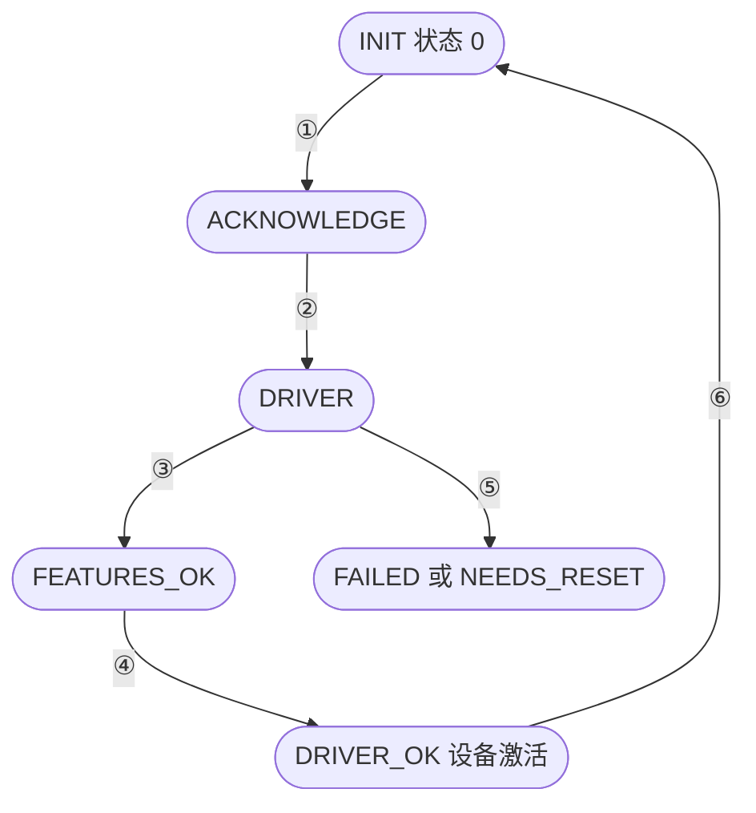
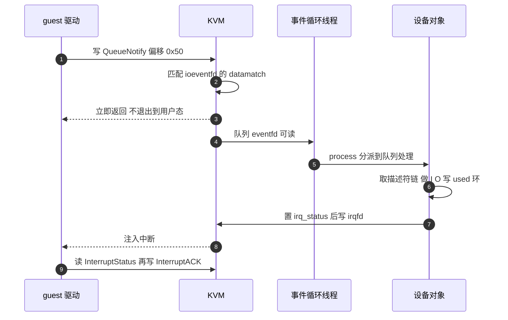

# 25 · virtio 设备模型与 MMIO 传输层

> virtio 的五类设备在 Firecracker 里共用一套接口：一个 trait 定义设备要交出什么，
> 一个传输层把 guest 的寄存器读写翻译成对这个 trait 的调用。本篇讲这条翻译链的每一环，
> 讲设备是在哪一刻、由谁「激活」的，以及通知与中断这两个方向各自绕开了什么。
>
> **读者**：系统工程师。
> **预备**：[第 04 篇 · virtio 与 MMIO 入门](04-virtio-and-mmio-primer.md)、
> [第 23 篇 · 设备总线与 MMIO 设备管理器](23-bus-and-mmio-device-manager.md)。
> **代码**：`src/vmm/src/devices/virtio/device.rs`、`mmio.rs`、`mod.rs`、`persist.rs`、
> `src/vmm/src/devices/virtio/block/virtio/event_handler.rs`、`src/vmm/src/device_manager/mmio.rs`

---

## 0. 本篇要回答的问题

1. `VirtioDevice` trait 划的边界在哪里 —— 什么归设备自己，什么归传输层？
2. 设备是在哪一条指令上被激活的？激活失败时 guest 看到什么？
3. guest 踢一次队列，从写寄存器到设备的处理函数被调用，中间经过谁？为什么这条路径不经过 VMM 线程？
4. 中断是怎么送回 guest 的，`interrupt_status` 这个寄存器为什么必须是原子的？
5. 设备在激活之前收到队列通知会发生什么？`reset` 这条路径在 v1.12.1 里能走通吗？

---

## 1. 问题：一套寄存器接口，五类设备

v1.12.1 有五种 virtio 设备类型（`src/vmm/src/devices/virtio/mod.rs` 的 `TYPE_NET` / `TYPE_BLOCK` /
`TYPE_RNG` / `TYPE_BALLOON`，与 `vsock/mod.rs` 的 `TYPE_VSOCK`），其中块设备还有两套后端实现
（[第 27 篇](27-virtio-block.md)与[第 29 篇](29-vhost-user-block.md)）。它们在数据面上毫无共同点：一个读写文件，一个收发以太网帧，
一个维护连接状态机，一个调 `madvise`，一个生成随机数。但它们在 guest 眼里必须长得一样 ——
virtio 规范规定了一套设备无关的发现与配置流程：读魔数、读设备类型、协商特性位、建队列、置 `DRIVER_OK`。
Linux 的 `virtio_mmio` 驱动只实现这一套流程，具体设备的驱动（`virtio_blk`、`virtio_net`）挂在它上面，
不直接碰寄存器。

Firecracker 因此也分成两层。下层是 `MmioTransport`（`src/vmm/src/devices/virtio/mmio.rs`），
它是一个 `BusDevice` 变体，占 MMIO 总线上的一页地址，负责实现那套寄存器语义。
上层是 `VirtioDevice` trait（`src/vmm/src/devices/virtio/device.rs`），每个具体设备实现它。
传输层通过 `Arc<Mutex<dyn VirtioDevice>>` 持有设备，把寄存器访问翻译成 trait 方法调用。

这样分层的收益是新增一个设备不需要碰寄存器代码，代价是传输层必须持锁调用设备
（`MmioTransport::locked_device()` 每次都 `lock()`），而设备的事件处理线程也持同一把锁 ——
两条路径的互斥是这个设计里唯一的同步点，也是所有设备实现都必须假设「可能被 vCPU 线程打断」的原因。

---

## 2. `VirtioDevice` trait：设备要交出什么

trait 的方法可以分成四组。

**特性协商。** `avail_features()` 返回设备支持的 64 位特性集，`acked_features()` / `set_acked_features()`
是驱动确认的那一份。virtio-mmio 的寄存器一次只能传 32 位，所以 trait 提供了两个带默认实现的适配方法：
`avail_features_by_page(page)` 按页取高低半段，`ack_features_by_page(page, value)` 反向写回。
后者做了一件规范没要求但值得做的事：把驱动确认的、而设备并没有声明的特性位过滤掉，
打一条 warn 之后只把交集记进 `acked_features`。这保证了 trait 文档里写的不变量 ——
`avail_features() & acked_features() == acked_features()` —— 对任何行为异常的驱动都成立。
`has_feature()` 就建立在这个不变量上，设备代码里到处用它决定走哪条数据面分支。

**队列。** `queues()` / `queues_mut()` 返回 `&[Queue]`，`queue_events()` 返回与之等长的一组 eventfd。
队列的数量与顺序是设备类型定死的，写在各自 `mod.rs` 的 `*_NUM_QUEUES` 常量里：
block 一个，net 两个（RX 与 TX，`NET_NUM_QUEUES = 2`；v1.12.1 不实现 virtio-net 的控制队列），
vsock 与 balloon 各三个，rng 一个。
传输层只按 `queue_select` 这个寄存器的值去索引，索引越界就静默返回默认值（`with_queue()` 的 `d` 参数）。
`Queue` 本身的内部结构在[第 26 篇](26-virtqueue-implementation.md)讲。

**配置空间。** `read_config(offset, data)` / `write_config(offset, data)`。
这是每个设备类型私有的一小块结构：block 放容量与块大小，net 放 MAC 与 MTU。
传输层把 MMIO 偏移 0x100 以上的访问减去 0x100 转给它们。

**生命周期。** `activate(mem)`、`is_activated()`、`reset()`。下一节展开。

另有两个带默认实现的方法。`interrupt_status()` 从 `interrupt_trigger()` 里取出共享的原子计数器。
`mark_queue_memory_dirty(mem)` 把队列三个环占用的 guest 页标脏，快照创建时调用 ——
因为这些页是 VMM 直接写的，KVM 的脏页日志看不到（[第 14 篇](14-dirty-page-tracking.md)）。

### 2.1 `DeviceState`：激活的意义是拿到内存

`DeviceState` 只有两个变体：`Inactive` 与 `Activated(GuestMemoryMmap)`。
这个设计透露了「激活」的真正含义：设备在被激活之前**拿不到 guest 内存的句柄**，
因此不可能去读描述符表、不可能往 guest 内存写数据。内存句柄是激活时由传输层交给它的。

这不是访问控制意义上的隔离（同一个进程里，绕过去并不难），而是把「队列地址还没写完」这个时间窗口
在类型层面挡住：`DeviceState::mem()` 返回 `Option`，没激活就是 `None`，
设备代码里所有数据面函数都从这里取内存，取不到就走不下去。

---

## 3. `MmioTransport`：寄存器到 trait 调用的翻译

`MmioTransport` 自己只存六个字段：两个「页选择」寄存器、`queue_select`、`device_status`、
`config_generation`，以及从设备那里克隆来的 `interrupt_status`。其余一切都转发给设备。

`bus_read()` 与 `bus_write()` 的结构相同：偏移 0x00–0xff 且数据长度正好 4 字节的走寄存器分支，
0x100–0xfff 走配置空间分支，其余打 warn 丢弃。寄存器分支是一个大 `match`：

```text
0x00  magic          读  固定 0x74726976（"virt"）
0x04  version        读  固定 2
0x08  device id      读  device_type()
0x0c  vendor id      读  固定 0
0x10  DeviceFeatures 读  avail_features_by_page(features_select)
0x14  DeviceFeaturesSel   写  features_select
0x20  DriverFeatures      写  ack_features_by_page(...)
0x24  DriverFeaturesSel   写  acked_features_select
0x30  QueueSel            写  queue_select
0x34  QueueNumMax    读  当前队列的 max_size
0x38  QueueNum            写  当前队列的 size
0x44  QueueReady     读写 当前队列的 ready
0x50  QueueNotify         写  由 ioeventfd 拦截，不到达这里
0x60  InterruptStatus 读 interrupt_status
0x64  InterruptACK        写  清 interrupt_status 中的位
0x70  Status         读写 device_status
0x80/0x84  QueueDesc   低 / 高 32 位
0x90/0x94  QueueDriver 低 / 高 32 位（avail ring）
0xa0/0xa4  QueueDevice 低 / 高 32 位（used ring）
0xfc  ConfigGeneration 读
0x100 起            读写  设备配置空间
```

有一个细节值得注意：读 0x10 时，如果 `features_select == 1`（也就是在读高 32 位），
代码会无条件把 bit 0 置上。这一位是 `VIRTIO_F_VERSION_1`（第 32 位），
表示设备遵循 virtio 1.0 而不是 legacy 布局。它不由具体设备声明，由传输层统一保证。

### 3.1 写寄存器是有前置条件的

一个恶意或有 bug 的驱动可以在任意时刻写任意寄存器。传输层用两个辅助函数挡住大部分危险组合。
`check_device_status(set, clr)` 判断当前 `device_status` 里 `set` 里的位都置了、`clr` 里的位都没置。

- `update_queue_field()`（所有队列地址、size、ready 的写都走它）要求状态里有 `FEATURES_OK`
  而没有 `DRIVER_OK` 与 `FAILED`。也就是说：特性协商完成之后、驱动宣布就绪之前，才能改队列配置。
  之后再写只会打一条 warn，值不会变。
- 写 DriverFeatures（0x20）要求有 `DRIVER` 而没有 `FEATURES_OK` / `FAILED` / `DEVICE_NEEDS_RESET`。
- 写配置空间要求有 `DRIVER` 而没有 `FAILED` / `DEVICE_NEEDS_RESET`。
- 写 InterruptACK（0x64）要求已有 `DRIVER_OK`。

这些检查的作用不是防御 guest —— guest 反正只能搞坏自己的 I/O —— 而是保证 VMM 侧的数据结构
不会在设备正在跑数据面的时候被从底下抽走。队列地址在 `DRIVER_OK` 之后不可改，
这一条尤其关键：设备激活时会把队列地址翻译成宿主指针缓存起来（[第 26 篇](26-virtqueue-implementation.md)），
允许运行中改地址会让缓存的指针指向错误的位置。

### 3.2 `device_status` 状态机与激活时刻

`set_device_status()` 实现 virtio 规范 2.1 节的状态推进。它的写法是先算 `!self.device_status & status`
—— 也就是「这次新置上了哪些位」—— 再按新位分派。每个合法转移都要求当前状态恰好等于前一步的值，
不满足就落到最后的 `_ =>` 分支打一条「invalid virtio driver status transition」的 warn，状态不变。



| 编号 | 驱动写入 | 传输层做什么 |
|---|---|---|
| ① | `ACKNOWLEDGE` | 只记状态，表示驱动认出了这个设备 |
| ② | 加 `DRIVER` | 只记状态，此后允许写 DriverFeatures |
| ③ | 加 `FEATURES_OK` | 只记状态，此后允许配置队列 |
| ④ | 加 `DRIVER_OK` | 校验队列合法后调 `activate(mem)` |
| ⑤ | 任何含 `FAILED` 的值（可发生在 ① 之后的任何状态，图中只画一条） | 把 `FAILED` 位或进状态，不做别的 |
| ⑥ | 写 0 | 调设备的 `reset()`；见第 6 节 |

第 ④ 步是全篇的枢纽。传输层记下状态之后，先看设备是否已激活，再调 `are_queues_valid()` ——
它要求**每一个**队列都 `is_valid(&mem)`，包括驱动没打算用的那些。两个条件都满足才调
`locked_device().activate(self.mem.clone())`，把 guest 内存的句柄交出去。

激活失败的处理写得比较克制：传输层给状态或上 `DEVICE_NEEDS_RESET`，
然后按规范 2.1.2 节的要求触发一次配置变更中断（`IrqType::Config`），再打一条 error 日志。
guest 驱动读 0x70 会看到这一位，按规范它应当放弃这个设备。
代价是 Firecracker 这边不会因此退出或报错到 API 层 —— 一个激活失败的设备表现为 guest 里设备不可用，
宿主侧只有一行日志。

---

## 4. 两个方向：通知与中断

设备与 guest 之间有两条需要跨越 VM 边界的信号通路，它们各自绕开了一次上下文切换。
下图是 guest 踢一次队列、设备处理完再中断回去的完整路径（`drv` 为 guest 驱动，`FC` 为 Firecracker 的事件循环线程）。



### 4.1 guest 到设备：ioeventfd 与 datamatch

注册发生在 `src/vmm/src/device_manager/mmio.rs` 的 `register_mmio_virtio()`。
它遍历设备的 `queue_events()`，为每一个都调 `VmFd::register_ioevent()`，
地址统一是 `device_info.addr + NOTIFY_REG_OFFSET`（`NOTIFY_REG_OFFSET` 定义在
`src/vmm/src/devices/virtio/mod.rs`，值 0x50），而 datamatch 是队列的**下标**。

也就是说：所有队列共用同一个通知地址，靠写进去的值区分。guest 写 0 唤醒队列 0 的 eventfd，
写 1 唤醒队列 1 的。KVM 在内核里完成匹配与 eventfd 唤醒，这次 MMIO 写**不退出到用户态**。
这是 virtio 数据面最重要的一处优化：每次提交 I/O 省掉一次 VM exit 加一次调度往返。

代价是 0x50 这个寄存器在 `MmioTransport::bus_write()` 的 `match` 里根本没有分支。
如果 guest 往它写了一个没有对应队列的值（比如两队列的 net 设备写了 5），datamatch 不命中，
这次写就穿透到 MMIO 总线，落到 `_ =>` 分支打一条「unknown virtio mmio register write」。
这是一个可以从日志里看出来的驱动 bug 信号。

### 4.2 设备到 guest：`IrqTrigger`

反方向由 `device.rs` 的 `IrqTrigger` 承担，它是两个东西的组合：
一个 `Arc<AtomicU32>` 的 `irq_status`，一个 `EventFd` 的 `irq_evt`。
`trigger_irq(irq_type)` 先按类型 `fetch_or` 一个位进 `irq_status`
（`VIRTIO_MMIO_INT_VRING` = 0x01 表示有队列完成，`VIRTIO_MMIO_INT_CONFIG` = 0x02 表示配置变了），
再往 `irq_evt` 写 1。这个 eventfd 在 `register_mmio_virtio()` 里通过 `VmFd::register_irqfd()`
绑到设备分配到的 IRQ 号上，所以写它等于直接向 guest 注入一次中断，同样不经过 vCPU 线程的用户态代码。

`irq_status` 必须是原子的，因为它有两个并发的访问者：设备的事件处理线程用 `fetch_or` 置位，
vCPU 线程在 guest 读 0x60 时 `load`、在 guest 写 0x64 时 `fetch_and` 清位。
`MmioTransport` 在构造时就从设备那里把这个 `Arc` 克隆了一份存在自己的 `interrupt_status` 字段里，
两边指向同一个计数器。

读 0x60 有一段 vhost-user 专用的分支：后端进程无法把中断状态告诉 Firecracker，
所以对 vhost-user 设备一律回答 `VIRTIO_MMIO_INT_VRING`，除非当前值恰好是 `VIRTIO_MMIO_INT_CONFIG`。
细节在[第 29 篇](29-vhost-user-block.md)。

---

## 5. 事件处理器：激活前后是两套注册

每个设备除了实现 `VirtioDevice`，还实现 `MutEventSubscriber`，代码放在各自的 `event_handler.rs`。
以块设备（`src/vmm/src/devices/virtio/block/virtio/event_handler.rs`）为例，它定义了四个事件编号常量：
`PROCESS_ACTIVATE`、`PROCESS_QUEUE`、`PROCESS_RATE_LIMITER`、`PROCESS_ASYNC_COMPLETION`，
用 `Events::with_data()` 把编号附在 epoll 事件上，`process()` 里按编号分派。

关键在 `init()`。设备是在 `builder.rs` 里挂上事件管理器的，那时 guest 内核还没启动，设备当然没激活。
没激活的设备注册的**不是**队列 eventfd，而是一个单独的 `activate_evt`。
设备的 `activate()` 实现（例如 `VirtioBlock::activate()`）在完成队列初始化之后，会往 `activate_evt` 写 1。
事件循环因此被唤醒，走 `process_activate_event()`：注册真正的运行期事件源
（队列 eventfd、rate limiter 的 timerfd、异步引擎的完成 eventfd），然后把 `activate_evt` 自己摘掉。

为什么要绕这一圈？因为 `activate()` 是在 **vCPU 线程**里被调用的（guest 写 0x70 触发 MMIO 退出），
而 epoll 的注册必须由持有事件管理器的线程做。`activate_evt` 就是这两个线程之间的一根信号线。

`init()` 的注释列了它可能被调用的三个时机：设备刚创建、设备激活时、从快照恢复时。
第三种情况下设备恢复出来已经是 activated 的，所以 `init()` 直接走 `register_runtime_events()`，
不再经过 `activate_evt`。

激活之前收到队列通知会怎样？`process()` 的最外层就是 `if self.is_activated()`，
否则打一条「The device is not yet activated. Spurious event received」的 warn 并返回。
不过这种情况其实很难发生：没激活时队列 eventfd 压根没注册进 epoll，
上游的单元测试 `test_event_handler` 专门验证了这一点 —— 先写队列 eventfd，
跑一次事件循环得到 0 个事件，激活之后才处理到。

---

## 6. `reset`：一条走不通的路径

`VirtioDevice::reset()` 有一个默认实现，直接返回 `None`。
在上游 v1.12.1 的全部设备实现里，**没有任何一个覆盖它**。

后果可以从 `set_device_status()` 的 `_ if status == 0` 分支读出来：
guest 写 0 到 Status 寄存器请求复位时，如果设备已激活，传输层调 `reset()` 拿到 `None`，
于是给状态或上 `FAILED`；由于 `FAILED` 已经置上，后面那句 `if self.device_status & FAILED == 0`
不成立，`MmioTransport::reset()` 就不会执行 —— 传输层自己的寄存器与队列也不会被清。
设备最终停在一个带 `FAILED` 的状态上，guest 无法把它重新初始化起来。

如果设备**没有**激活（例如驱动在协商过程中放弃），`reset()` 不会被调用，
`MmioTransport::reset()` 正常执行：清三个选择寄存器、清 `interrupt_status`、
把 `device_status` 置回 `INIT`，并把每个 `Queue` 替换成 `Queue::new(max_size)`。
它刻意不动两样东西，代码注释说明了理由：eventfd 保持原样（里面可能残留通知，
最多造成一次无意义的唤醒），`config_generation` 保持单调递增（这是规范要求，用于配置空间的读一致性）。

实际影响有限：Linux 的 virtio 驱动只在模块卸载或设备移除时复位，
而 microVM 的生命周期里很少发生这件事。但这是一个需要知道的限制 ——
「热插拔一个 virtio 设备」在当前实现下做不到。

---

## 7. 快照里的传输层与设备状态

`src/vmm/src/devices/virtio/persist.rs` 定义了两个结构。
`MmioTransportState` 保存传输层自己的五个寄存器字段。
`VirtioDeviceState` 保存设备的通用部分：`device_type`、`avail_features`、`acked_features`、
一组 `QueueState`、`interrupt_status` 的当前值、以及 `activated` 标志。
每个设备的 `persist.rs` 把这个结构嵌进自己的状态里，再加上设备私有的字段。

恢复时的入口是 `VirtioDeviceState::build_queues_checked()`，它在重建队列之前做三项检查：
设备类型对得上、`acked_features` 是 `avail_features` 的子集、队列数量对得上；
逐个队列再查 `max_size` 与 `size` 的关系。还有一处值得注意的条件放行：
只有当 `activated` 为真时才检查 `q.is_valid(mem)`。注释解释了原因 ——
快照可以在任何时刻创建，包括设备正在配置的中途，那时队列地址还是半成品，
要求它合法会让一个本来可以恢复的快照被拒绝。

`interrupt_status` 存下来并在恢复时写回，是为了不丢失「有一次中断已经置位但 guest 还没 ACK」这个状态。
但 `irq_evt` 本身不在快照里 —— 恢复出来是一个新的、空的 eventfd。
所以一次已经写进 eventfd 但还没被 KVM 注入的中断会丢。
这正是 `MMIODeviceManager::kick_devices()` 存在的理由：恢复之后人为地把 block 与 balloon 的队列踢一遍，
补上可能漏掉的那次处理（[第 38 篇](38-snapshot-load.md)）。

---

## 8. 后续各层的差异

ARM 适配版在 `src/vmm/src/devices/virtio/persist.rs` 里给 `MmioTransport` 加了
`apply_state()`：把 `MmioTransportState` 的五个字段直接写回一个**活着的**传输层对象，
设备引用、guest 内存与中断连线都保持不变。上游只有 `Persist::restore()`，它总是造一个新对象，
这在原地回滚的场景下不适用。详见[第 72 篇 · 回滚的设备状态](72-rollback-devices.md)。

e2b 定制版没有改动本篇涉及的任何文件；ARM 适配版除上面这个新增方法外也没有改动别的。

---

## 9. 小结

- virtio 在 Firecracker 里分两层：`MmioTransport` 实现规范定义的寄存器语义，
  `VirtioDevice` trait 定义设备要交出的东西。新增设备不碰寄存器代码，代价是两条线程共用一把设备锁。
- `DeviceState::Activated(mem)` 说明了激活的含义：设备在此之前拿不到 guest 内存句柄，
  因此不可能碰描述符链。
- 激活发生在驱动写 `DRIVER_OK` 的那一刻，前提是所有队列都通过 `is_valid()`。
  激活失败不会让 Firecracker 报错，只会置 `DEVICE_NEEDS_RESET` 并发一次配置中断。
- 队列地址与 size 只能在 `FEATURES_OK` 之后、`DRIVER_OK` 之前写，这条限制保护的是设备激活时
  缓存下来的宿主指针。
- guest 通知设备走 ioeventfd：所有队列共用偏移 0x50，靠 datamatch 的队列下标区分，不退出到用户态。
  写了不匹配的值会穿透成一条 warn 日志。
- 设备通知 guest 走 `IrqTrigger`：先原子地置 `irq_status` 的位，再写 irqfd 由 KVM 注入中断。
  `irq_status` 被事件线程与 vCPU 线程共享，所以必须是原子的。
- 事件处理器在激活前只注册一个 `activate_evt`，激活时由 vCPU 线程写它，
  事件循环线程收到后才注册真正的队列事件源。
- v1.12.1 的所有设备都没有实现 `reset()`，所以对已激活设备的复位请求只会把它置成 `FAILED`。
- 快照保存传输层的五个寄存器与设备的通用 virtio 状态；`irq_evt` 不保存，
  漏掉的通知靠恢复后的 `kick_devices()` 补。

---

## 延伸阅读 / 下一篇

- [第 04 篇 · virtio 与 MMIO 入门](04-virtio-and-mmio-primer.md)：virtio 规范本身的概念与术语。
- [第 23 篇 · 设备总线与 MMIO 设备管理器](23-bus-and-mmio-device-manager.md)：
  `register_mmio_virtio()` 的地址与 IRQ 分配，以及内核命令行参数的生成。
- [第 40 篇 · 设备状态的 Persist](40-device-persist.md)：各设备 `persist.rs` 的全貌。
- 下一篇 [第 26 篇 · virtqueue 实现](26-virtqueue-implementation.md)：
  本篇一直当黑盒用的 `Queue` 内部是什么。
