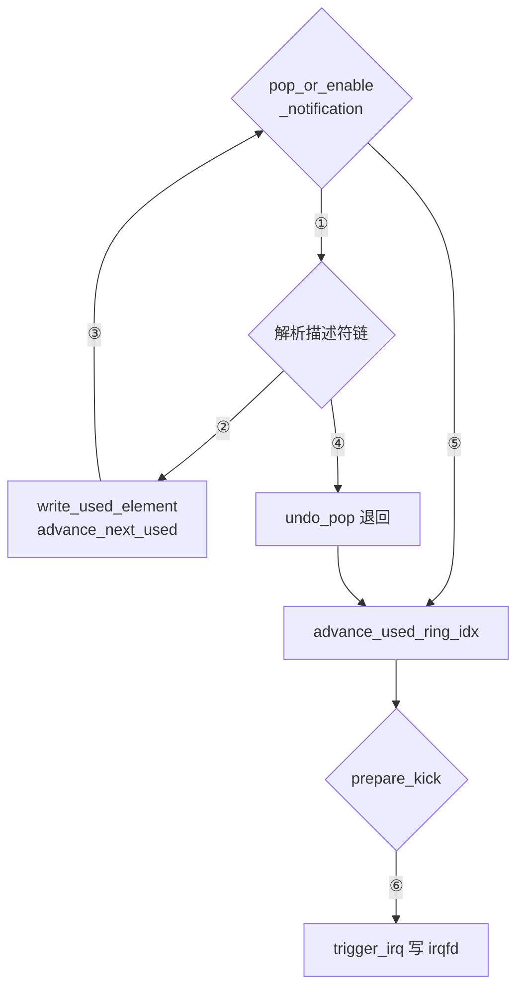

# 26 · virtqueue 实现：queue.rs、iovec 与 iov_deque

> virtqueue 是 guest 与设备之间唯一的数据通道：三块共享内存、两个只增不减的索引、几道内存屏障。
> 本篇讲 Firecracker 怎么实现它 —— 为什么把 guest 内存地址缓存成宿主裸指针、
> 一轮处理里索引怎么推进、两个方向的通知各被什么机制压掉，
> 以及描述符链怎么变成能直接交给 `readv` 的 `iovec` 数组。
>
> **读者**：系统工程师、要加 virtio 设备或读 I/O 路径的维护者。
> **预备**：[第 25 篇 · virtio 设备模型与 MMIO 传输层](25-virtio-device-model-and-transport.md#21-devicestate激活的意义是拿到内存)、
> [第 13 篇 · guest 内存](13-guest-memory.md)。
> **代码**：`src/vmm/src/devices/virtio/queue.rs`、`iovec.rs`、`iov_deque.rs`、`persist.rs`

---

## 0. 本篇要回答的问题

1. 一条 virtqueue 由哪三块 guest 内存构成？Firecracker 为什么把它们缓存成宿主裸指针，代价是什么？
2. 从 `pop()` 到 `add_used()` 的一轮循环里，四个索引分别由谁推进？为什么发布 used ring 的索引要单独一步？
3. 事件抑制怎么工作？`pop_or_enable_notification()` 与 `prepare_kick()` 各压掉了哪一半通知？
4. `IoVecBuffer` 解决什么问题，为什么读、写两个方向用了两种不同的容器？
5. `IovDeque` 为什么要用 memfd 把同一块物理页映射两次？
6. 快照里的 `QueueState` 存了什么、漏了什么，漏掉的由谁补回来？

---

## 1. 问题：一块共享内存上的两个写者

一条 virtqueue 是 guest 内存里的三块结构，两边都要读写，中间没有锁：

```text
描述符表 desc_table        每项 16 字节，共 size 项，对齐 16
+--------+--------+-------+-------+
|  addr  |  len   | flags | next  |
|  u64   |  u32   |  u16  |  u16  |
+--------+--------+-------+-------+

可用环 avail_ring         对齐 2                用环 used_ring          对齐 4
+-------+-------+-----------------+     +-------+-------+---------------------+
| flags | idx   | ring[size]      |     | flags | idx   | ring[size]          |
| u16   | u16   | u16 各一项       |     | u16   | u16   | id:u32 len:u32 一对 |
+-------+-------+-----------------+     +-------+-------+---------------------+
| used_event: u16                 |     | avail_event: u16                    |
+---------------------------------+     +-------------------------------------+
   由 guest 写，设备读                       由设备写，guest 读
```

规范用两条纪律代替锁：索引只增不减（`u16` 回绕），跨越所有权转移的地方插内存屏障。
Firecracker 在这两条之上又加了一条实现选择：**把三块结构的宿主虚拟地址缓存成裸指针**，
所有访问走 `read_volatile()` / `write_volatile()`，不再每次都过 `GuestMemory` 的区域查找。

缓存发生在 `Queue::initialize()`，它做三件事：

- 对每块结构调 `get_slice_ptr()` 拿到宿主指针。这个函数用的是 `mem.get_slice(addr, len)`
  而不是 `get_host_address()`，因为 `get_slice` 会校验**整段**范围都落在某个内存区域里；
- 顺手 `slice.bitmap().mark_dirty(0, len)`，把这三块标成脏页
  （理由见[第 14 篇](14-dirty-page-tracking.md#3-用户态侧每个区域一张-atomicbitmap)）；
- 检查三个指针的对齐：描述符表 16 字节、可用环 2 字节、用环 4 字节，不满足就报
  `QueueError::PointerNotAligned`。源码注释说明了这个检查为什么必要 ——
  地址来自 guest 或来自快照文件，一个被损坏或被构造过的快照可以给出不对齐的地址，
  而 `read_volatile()` 在不对齐的指针上会 panic。

代价有两项。**一是这批指针在设备激活的那一刻固定下来**，
所以队列地址与 size 只能在 `FEATURES_OK` 之后、`DRIVER_OK` 之前写，
这条限制由传输层强制（见[第 25 篇 §3.1](25-virtio-device-model-and-transport.md#31-写寄存器是有前置条件的)）。
**二是 `Queue` 必须手写 `unsafe impl Send`**，因为裸指针默认不是 `Send`；
代码里的理由是所有访问都是 volatile，指针不会被复制到别处，
并且假定 guest 不会把两条队列指到同一块内存。最后这句是假定，不是检查。

---

## 2. 四个索引，两边各管两个

队列的推进状态由四个 `u16` 描述，分属两边：

| 索引 | 存在哪 | 谁写 | 含义 |
|---|---|---|---|
| `avail.idx` | guest 内存 | guest | 驱动已放进可用环的链的总数 |
| `next_avail` | `Queue` 结构体 | 设备 | 设备已取走的链的总数 |
| `used.idx` | guest 内存 | 设备 | 设备已发布的完成项总数 |
| `next_used` | `Queue` 结构体 | 设备 | 设备已写好、但未必已发布的完成项总数 |

设备一侧的两个进度记在自己的结构体里，不从 guest 内存读回。
这是一条安全边界：驱动改不了设备认为自己走到哪了。
`Queue::len()` 就是 `Wrapping(avail.idx) - next_avail`，用回绕减法算出「还有多少条没取」。

`pop()` 先算 `len()`，然后做一次防御性检查：

```rust
if self.size < len {
    panic!(
        "The number of available virtio descriptors {len} is greater than queue size: {}!",
        self.size
    );
}
```

驱动永远不该让可用链数超过队列容量，超过意味着它在重复投递同一个位置。
上游选择直接 panic 而不是记日志，注释给的理由是：这可能是恶意驱动，
继续跑会挂死，反复打日志则会把日志系统冲垮。代价是一个行为异常的 guest 可以让
Firecracker 进程终止 —— 对「一个进程一台 microVM」的模型来说，这个代价是可接受的。

取链的实际动作在 `pop_unchecked()`：先 `fence(Ordering::Acquire)`，
保证后续读能看到驱动写下的描述符内容；再用 `next_avail % size` 定位环内位置，
读出描述符表下标，交给 `DescriptorChain::checked_new()`。

`DescriptorChain` 自身携带三个防护：构造时检查下标小于队列大小；
`is_valid()` 检查 `next` 字段没有越界；`ttl` 初始化为队列大小，
每跟一次 `next_descriptor()` 减一，`has_next()` 在 `ttl <= 1` 时返回 false ——
这是对「驱动构造了一个环形描述符链」的防护，代价是一条合法的长链最多只能有 size 个描述符。
遍历本身用 `IntoIterator`，`DescriptorIterator` 是个只持有 `Option<DescriptorChain>` 的薄包装。

`undo_pop()` 把 `next_avail` 减一，让刚取出的链回到可用环。
它是限速器与 I/O 引擎背压的退出通道：block 设备判定这条请求被限速或引擎队列满时，
就 `undo_pop()` 然后跳出循环，链留给下一次事件。

---

## 3. 一轮处理的骨架

所有设备的队列处理循环长得几乎一样。以 block 为例
（`src/vmm/src/devices/virtio/block/virtio/device.rs` 的 `process_queue()`）：

```rust
while let Some(head) = queue.pop_or_enable_notification() {
    // 解析 head，可能 undo_pop 后 break
    // 完成时：
    queue.add_used(head.index, finished.num_bytes_to_mem)...
}
queue.advance_used_ring_idx();

if used_any && queue.prepare_kick() {
    self.irq_trigger.trigger_irq(IrqType::Vring)...
}
```

把「写完成项」拆成三个函数是这段代码的关键设计：

- `write_used_element(offset, desc_index, len)` 只往用环的 `(next_used + offset) % size`
  位置写一个 `UsedElement`，不动任何索引；
- `advance_next_used(n)` 推进 `next_used` 并把 `num_added` 加 `n`；
- `advance_used_ring_idx()` 插一个 `fence(Ordering::Release)`，然后把 `used.idx` 写成 `next_used`。

`add_used()` 是前两者的组合（offset 取 0、n 取 1）。
**发布索引单独成一步，于是一轮里写的所有完成项只需要一个 Release 屏障，而不是每项一个。**
这也意味着 guest 在 `advance_used_ring_idx()` 之前看不到这一批完成项 ——
完成项的可见性是批量的，不是逐条的。net 设备的 RX 路径利用了 `write_used_element` 的
`offset` 参数，先在未发布的位置上写好若干项，最后一次推进。

下面这张图给出一轮的控制流，右侧分支是两条提前退出的路。



| 编号 | 条件 | 说明 |
|---|---|---|
| ① | 取到一条链 | `next_avail` 已推进一格 |
| ② | 解析成功且资源可用 | 完成项写进用环，但尚未发布 |
| ③ | 无条件 | 回到循环头继续取 |
| ④ | 被限速器或 I/O 引擎挡住 | 链退回可用环，跳出循环 |
| ⑤ | 队列空，通知已打开 | 循环正常结束 |
| ⑥ | `used_event` 落在本轮跨过的区间内 | 必须真的发中断；不在区间内则本轮到此结束 |

---

## 4. 事件抑制：两个方向各压一半

不做抑制时，每一条链都要一次 guest 到设备的通知（一次 MMIO 写或 ioeventfd）、
一次设备到 guest 的中断。批量 I/O 下这两类事件都是纯开销。
`VIRTIO_RING_F_EVENT_IDX` 特性为两个方向各加一个计数器，藏在两个环的尾部：

- `used_event`（在可用环尾）由 **guest 写**，含义是「等你发布到这个序号时再打断我」；
- `avail_event`（在用环尾）由 **设备写**，含义是「等你投递到这个序号时再通知我」。

这个特性是否生效由 `Queue::uses_notif_suppression` 记录。
它在两处被打开：设备 `activate()` 时按 `acked_features` 判断
（`block/virtio/device.rs`、`net/device.rs`），以及从快照恢复时按 `acked_features` 重新推导
（下面第 6 节）。没打开时下面两个函数都退化成恒真，行为回到「每次都通知」。

**guest 到设备的方向**由 `pop_or_enable_notification()` 管。它的逻辑是：
如果队列空了，就调 `try_enable_notification()` 打开通知再返回 `None`；
打开失败说明还有链可取，于是继续取。`try_enable_notification()` 本身有三步：

1. 若 `len() != 0`，直接返回 false（并同样做一次「可用链数不得超过队列大小」的 panic 检查）；
2. 把 `avail_event` 写成 `next_avail`，即「下一条我期待的链」；
3. 插一个 `fence(Ordering::SeqCst)`，再重读 `avail.idx`，与 `next_avail` 比较。

第三步是这段代码的全部要点。写下 `avail_event` 与驱动写下 `avail.idx` 是一场竞争：
如果驱动在第 2 步之前刚好投递了一条链但还没看到新的 `avail_event`，
它会认为不需要通知，而设备又已经准备睡下 —— 队列就挂住了。
重读一次 `avail.idx` 消除了这个窗口：不相等就说明有新链，返回 false，调用方继续消费。

**设备到 guest 的方向**由 `prepare_kick()` 管，它的判据只有一行：

```rust
new - used_event - Wrapping(1) < new - old
```

`new` 是 `next_used`，`old` 是 `next_used - num_added`，即本轮开始时的位置。
用回绕减法表达的意思是：`used_event` 落在 `(old, new]` 这个区间里吗？
落在里面说明 guest 想被叫醒的那个序号已经被这一轮跨过，需要发中断；
否则这一轮的完成项还够不着 guest 的期望值，不发。
这与 Linux 内核的 `vring_need_event()` 是同一个式子。

`prepare_kick()` 有副作用：它把 `num_added` 清零，
所以文档注释明确说「一旦返回 true，就当作驱动会被通知」。
调用方必须真的发中断，否则这一批完成项永远不会被 guest 看到。
函数开头还有一个 `fence(Ordering::SeqCst)`，保证用环里的完成项在读 `used_event` 之前已经可见。

---

## 5. `IoVecBuffer`：把描述符链交给 `readv`

一条描述符链指向的是若干段互不相邻的 guest 内存。
设备要把它交给一次系统调用（`readv` / `writev` / io_uring 的向量操作）处理，
就得先把它翻译成 `struct iovec` 数组。`iovec.rs` 的两个类型做这件事，
它们按方向分开，因为方向决定了容器的形状。

`IoVecBuffer` 是只读方向（设备从 guest 内存读，对应 `writev` 到后端），
内部就是一个 `Vec<iovec>` 加一个总长度。
`load_descriptor_chain()` 沿着链走，遇到 `is_write_only()` 为真的描述符就报
`WriteOnlyDescriptor` —— 方向检查在这里，不在解析请求的地方。
每段用 `mem.get_slice(desc.addr, desc.len)` 取指针，同样是为了让整段范围都被校验；
总长度用 `checked_add` 累加，溢出报 `OverflowedDescriptor`。

`IoVecBufferMut` 是只写方向（设备写进 guest 内存，对应 `readv` 从后端读），
方向检查反过来。它比只读版本多做一件事：

```rust
slice.bitmap().mark_dirty(0, desc.len as usize);
```

**在转成 `iovec` 之前就把这段内存标脏。** 注释说明了原因：
一旦降级成裸的 `iovec`，就再也拿不到 `vm-memory` 那一侧的位图信息了，
而实际的写入发生在内核里（`readv` 返回时才知道写了多少）。
于是这里选择保守地把整条链标脏，哪怕实际只写了前几个字节。
这与[第 14 篇](14-dirty-page-tracking.md#6-代价与边界)里「宁可多记，不可漏记」是同一条判据。

两个类型的构造函数都是 `unsafe`，契约写在文档注释里：
**同一时刻不能有两条链指向同一块 guest 内存**。这个契约由设备保证 ——
virtio 的请求是顺序处理的，一条链在 `add_used()` 之前不会被重新投递。
类型系统在这里帮不上忙，因为别名关系存在于 guest 内存里，不在 Rust 的所有权图里。

用它的是 net（TX 用只读版、RX 用只写版）、entropy 与 vsock（收发各一个）。
block 设备**不**用这套：它的请求格式是「头描述符 + 若干数据描述符 + 状态描述符」，
解析时要逐段区分用途，直接走 `GuestMemory` 的接口更简单
（见[第 27 篇 · virtio-block](27-virtio-block.md)）。

---

## 6. `IovDeque`：把同一块物理页映射两次

`IoVecBufferMut` 的容器不是 `Vec`，是 `IovDeque<L>`。这个替换来自 net 的 RX 路径：
它要把**多条**链的 iovec 攒在一起，等 tap 上来一帧就一次 `readv` 写进去，
用掉几条就从前面丢几条。这是一个队列，而且要能随时拿出一个**连续的** `&mut [iovec]` 切片。

普通环形缓冲做不到后一点：元素回绕之后，逻辑上连续的一段在物理上分成了两截，
要拿切片就得先拷贝。`iov_deque.rs` 用的是环形缓冲的经典优化 ——
**分配两倍的虚拟地址空间，把同一块物理内存映射两次**：

```text
虚拟地址
+---------------------------+---------------------------+
|   第一份映射（N 字节）      |   第二份映射（N 字节）      |
+---------------------------+---------------------------+
              \                         /
               \                       /
                +---------------------+
                |  memfd 的 N 字节     |   物理内存只有一份
                +---------------------+

          start        start+len
            |             |
            v             v
    ...从 start 起的 len 个元素总是连续的，
       即使它们跨过了第一份映射的末尾
```

实现是三次 `mmap`：先用 `PROT_NONE | MAP_ANONYMOUS` 占下 `2N` 字节的虚拟地址范围，
再用 `MAP_FIXED | MAP_SHARED` 把 memfd 分别映射到前一半和后一半。
memfd 由 `create_memfd()` 创建，创建后立刻加上 `SealShrink`、`SealGrow` 两道封印，
再加 `SealSeal` 禁止继续改封印 —— 大小从此不可变，杜绝了「文件被截断导致映射区出 SIGBUS」。
`N` 是 `L` 个 `iovec` 按宿主页大小向上取整的结果（`pages_bytes()`），
net 的 `L` 取 `NET_QUEUE_MAX_SIZE`，即 256。

数据结构本身只有三个字段：指针、`start`、`len`。
`as_slice()` / `as_mut_slice()` 从 `self.iov.add(start)` 起取 `len` 个元素 ——
即使 `start + len` 越过了第一份映射的末尾，落到第二份映射上读到的仍是同一批数据。
`push_back()` 写 `start + len` 位置，满了就 `assert!` panic（注释说明：
环的容量就是队列的最大长度，写满说明设备逻辑有 bug）。
`pop_front()` 推进 `start` 并在 `start >= L` 时减掉 `L` 回绕。
`Drop` 里 `munmap` 掉 `2 * pages_bytes` 一整段。

代价要说清楚：每个 `IoVecBufferMut` 占一个 memfd 与两段虚拟映射，
并且要求 seccomp 过滤器放行 `memfd_create` 与 `mmap`
（见[第 42 篇 · seccomp](42-seccomp.md)）。
收益是 RX 路径上完全没有 iovec 的拷贝与重排。

---

## 7. 快照里的 `QueueState`

`devices/virtio/persist.rs` 里 `Queue` 的 `save()` 存九个字段：
`max_size`、`size`、`ready`、三块结构的 GPA、`next_avail`、`next_used`、`num_added`。
**三个宿主指针不存**（它们是本次进程的地址，换个进程就没意义），
**`uses_notif_suppression` 也不存**。

恢复走两步。`Queue::restore()` 把九个字段填回去、三个指针置空，
只有当构造参数里的 `is_activated` 为真时才调 `initialize()` 重新算指针 ——
未激活的设备没有 guest 内存句柄，也没有合法的队列地址，算不出来。

`VirtioDeviceState::build_queues_checked()` 做剩下的事，它是恢复路径上的守门人：

| 检查 | 不通过的后果 |
|---|---|
| `device_type` 与期望一致 | `PersistError::InvalidInput` |
| `acked_features` 是 `avail_features` 的子集 | 同上 |
| 队列数量与期望一致 | 同上 |
| 每个队列的 `max_size` 与期望一致、`size` 不超过它 | 同上 |
| 设备已激活时 `is_valid(mem)` 为真 | 同上 |

第二项是防「快照里协商了本版本 Firecracker 不再提供的特性」；
最后一项的条件值得注意：**只有已激活的设备才查 `is_valid()`**，
注释给的理由是快照可以发生在任何时刻，包括驱动正在配置队列、字段只填了一半的时候。

`uses_notif_suppression` 在这里从 `acked_features` 里重新推导：
`(acked_features & (1 << VIRTIO_RING_F_EVENT_IDX)) != 0`，为真就对每个队列调
`enable_notif_suppression()`。也就是说它是派生状态，不是独立状态，
存进快照反而多一个可能与 `acked_features` 不一致的字段。

还有一件事在队列之外：创建快照时要把三块队列结构重新标脏
（`persist.rs` 里对每个设备调 `mark_queue_memory_dirty()`），
因为设备对队列的写入走的是缓存下来的裸指针，绕过了 `vm-memory` 的位图。
这条路径的完整理由在[第 37 篇 §7](37-snapshot-create.md#7-队列为什么要重新标脏)。

`queue.rs` 与 `iovec.rs` 里还有一批 `#[cfg(kani)]` 的形式化证明，
覆盖 `pop()`、`add_used()`、`prepare_kick()`、`try_enable_notification()` 等十几个函数，
以及 `iovec` 的读写。它们用一个只含单个内存区域的 `ProofGuestMemory` 替换真实的
`GuestMemoryMmap`，为的是消掉区域查找里的循环。细节在
[第 45 篇 · GDB 调试、tracing 与形式化验证](45-gdb-tracing-and-kani.md)。

---

## 8. 后续各层的差异

`queue.rs`、`iovec.rs`、`iov_deque.rs` 在 e2b 定制版与 ARM 适配版都没有改动。
ARM 适配版的原地回滚复用了本篇的两个接口：用 `build_queues_checked()` 按快照重建队列对象，
再把它们逐个拷到活着的设备的队列上，等于把 `next_avail` / `next_used` 倒回快照时刻；
拷完之后再调一遍 `mark_queue_memory_dirty()`，因为回滚期间的队列写入同样不被跟踪。
见[第 72 篇 · 回滚的设备状态](72-rollback-devices.md)。

---

## 9. 小结

- 一条 virtqueue 是 guest 内存里的三块结构，Firecracker 在激活时把它们的宿主地址缓存成裸指针，
  之后全部访问走 volatile 读写；代价是队列地址在激活后不可改，且 `Queue` 要手写 `unsafe impl Send`。
- `initialize()` 顺手做两件正确性相关的事：把三块结构标脏，检查 16 / 2 / 4 字节对齐 ——
  后者防的是被损坏的快照让 volatile 访问 panic。
- 设备的两个进度 `next_avail` / `next_used` 记在自己的结构体里，不从 guest 内存读回，
  驱动改不了它们；`len()` 用回绕减法算出待取链数。
- 可用链数超过队列容量时 `pop()` 直接 panic，这是对恶意驱动的防御，
  代价是异常 guest 能让 Firecracker 进程终止。描述符链另有下标检查与 `ttl` 防环。
- 写完成项拆成三步，发布 `used.idx` 单独一步，于是一轮处理只需要一个 Release 屏障，
  完成项对 guest 的可见性是批量的。
- 事件抑制的两个计数器分属两端：`avail_event` 由设备写、`used_event` 由 guest 写。
  `try_enable_notification()` 靠「写完再重读一次 `avail.idx`」消掉睡下与投递之间的竞争窗口；
  `prepare_kick()` 判断 `used_event` 是否落在本轮跨过的区间里，并且有清零 `num_added` 的副作用。
- `IoVecBuffer` 把描述符链翻译成 `iovec` 数组，读写两个方向分成两个类型、各做一半方向检查；
  写方向在转换前就保守地把整条链标脏，因为之后拿不到位图。构造函数的 `unsafe` 契约是「不重叠」，
  由 virtio 的顺序处理保证。
- `IovDeque` 用 memfd 加两次 `MAP_FIXED` 把同一块物理内存映射到相邻的两段虚拟地址，
  于是跨越环尾的一段元素仍然可以取出连续切片，代价是一个 fd、两倍虚拟地址与两个额外系统调用。
- `QueueState` 只存位置与地址，不存宿主指针与 `uses_notif_suppression`：
  前者恢复时重算，后者从 `acked_features` 推导；`build_queues_checked()` 是恢复路径上的五项检查。

---

## 延伸阅读 / 下一篇

- [第 25 篇 · virtio 设备模型与 MMIO 传输层](25-virtio-device-model-and-transport.md) —— 队列地址是怎么被驱动写进来的，激活时刻在哪。
- [第 30 篇 · virtio-net](30-virtio-net.md#3-rx为什么需要一个预解析缓存) —— `IovDeque` 的主要使用者，RX 预解析缓存的完整逻辑。
- [第 37 篇 · 创建快照](37-snapshot-create.md#7-队列为什么要重新标脏) —— 队列内存与脏页跟踪的交互。
- [第 45 篇 · GDB 调试、tracing 与形式化验证](45-gdb-tracing-and-kani.md) —— `queue.rs` 与 `iovec.rs` 里的 Kani 证明。
- virtio 规范 1.2 第 2.7 节「Split Virtqueues」：本篇实现的那份契约的原文。
- **下一篇**：[第 27 篇 · virtio-block：请求解析与 I/O 引擎](27-virtio-block.md)。
