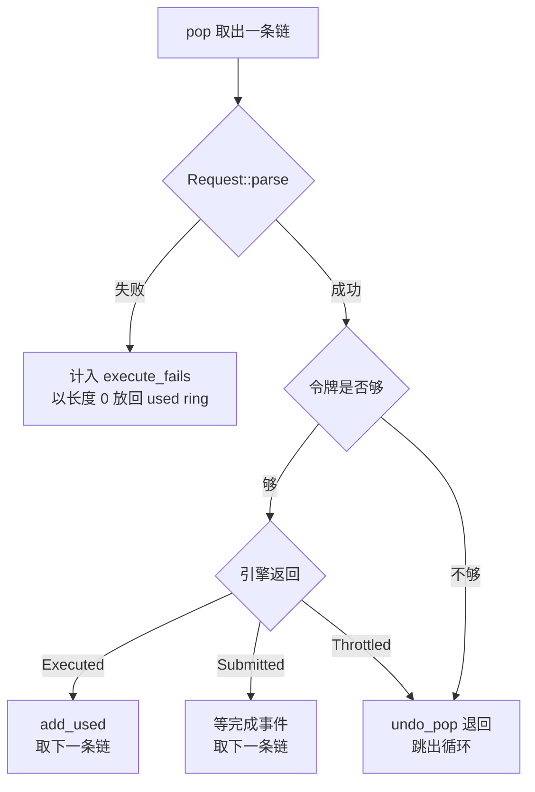

# 27 · virtio-block：请求解析与 I/O 引擎

> 一台 microVM 的根文件系统是宿主上的一个普通文件。把这个文件变成 guest 眼里的一块盘，
> 中间要走过一条不长但处处是防守的路：从不可信的描述符链里解析出请求，交给两种引擎之一执行，
> 再把状态字节写回 guest。本篇讲这条路的每一步，以及它为了简单而放弃的东西。
>
> **读者**：系统工程师。
> **预备**：[第 25 篇 · virtio 设备模型与 MMIO 传输层](25-virtio-device-model-and-transport.md)、
> [第 26 篇 · virtqueue 实现](26-virtqueue-implementation.md)。
> **代码**：`src/vmm/src/devices/virtio/block/device.rs`、`block/virtio/device.rs`、`block/virtio/request.rs`、
> `block/virtio/io/`、`block/virtio/event_handler.rs`、`block/virtio/persist.rs`、`src/vmm/src/vmm_config/drive.rs`

---

## 0. 本篇要回答的问题

1. guest 看到的「一块盘」由哪些字段定义，哪些配置项决定了它的行为？
2. 一个块请求在描述符链里长什么样，`Request::parse()` 要挡住哪些畸形输入？
3. 为什么 v1.12.1 的实现只处理**一个**数据描述符，而 Linux guest 却不会因此出错？
4. 队列处理循环的三种结果分别意味着什么，限速与引擎满载各自在哪一步介入？
5. `cache_type` 影响的到底是什么，为什么它同时改变了特性协商与析构行为？
6. 快照里保存的块设备状态为什么只是一个文件路径？

---

## 1. 契约：一个文件、一个队列、一条命令流

virtio-block 的契约极小。guest 通过 config space 读到一个 64 位的容量（扇区数），
通过唯一一条 virtqueue 提交请求，每个请求由「头部 + 数据 + 状态字节」三段构成。
设备侧没有多队列、没有 discard / write zeroes、没有拓扑信息。

容量来自 `block/virtio/device.rs` 的 `DiskProperties::new()`：打开宿主文件，
`seek(SeekFrom::End(0))` 取字节数，右移 `SECTOR_SHIFT`（9）得到扇区数写进 `ConfigSpace::capacity`。
文件长度不是 512 的整数倍时打一条 warn，尾部那几个字节对 guest 不可见。
`DiskProperties` 还从文件的 `st_dev`、`st_rdev`、`st_ino` 拼出一个 20 字节的 `image_id`，
guest 用 `VIRTIO_BLK_T_GET_ID` 请求能把它读出来；拼不出来就用全零，只打日志不报错。

特性只有四位（`VirtioBlock::new()`）：`VIRTIO_F_VERSION_1` 与 `VIRTIO_RING_F_EVENT_IDX` 恒有，
`cache_type` 为 `Writeback` 时加 `VIRTIO_BLK_F_FLUSH`，只读盘加 `VIRTIO_BLK_F_RO`。
队列只有一条，深度 256（`FIRECRACKER_MAX_QUEUE_SIZE`）。

这份特性清单里**没有** `VIRTIO_BLK_F_SEG_MAX`，这一点后面会变成一个关键约束。

一条队列是刻意的取舍。多队列能让多个 vCPU 各自提交而互不争锁，代价是设备侧要维护多份状态、
快照里要保存多份索引、恢复时要逐条校验。Firecracker 面向的是每台 microVM 只有少量 vCPU
且以启动时延为首要指标的场景，于是选了单队列：吞吐的上限由此受限于一条队列的深度与一个事件循环线程，
换来的是设备状态小、代码路径少、快照格式简单。
`VIRTIO_RING_F_EVENT_IDX` 在这个前提下更重要 —— 它让驱动在设备正忙时抑制通知，
把每个请求一次的 MMIO 退出摊薄成一批请求一次。

## 2. 配置与挂载

块设备由 `PUT /drives/{id}` 配置，字段落在 `src/vmm/src/vmm_config/drive.rs` 的 `BlockDeviceConfig` 上。

| 字段 | 含义 | 备注 |
|---|---|---|
| `path_on_host` | 宿主上的后端文件 | 与 `socket` 二选一 |
| `socket` | vhost-user 后端的 Unix socket | 选它就走[第 29 篇](29-vhost-user-block.md) |
| `is_root_device` | 是否作为根设备 | 至多一个 |
| `partuuid` | 根分区的 UUID | 只在根设备上生效 |
| `is_read_only` | 只读打开 | 影响 `VIRTIO_BLK_F_RO` |
| `cache_type` | `Unsafe` 或 `Writeback` | 影响 `VIRTIO_BLK_F_FLUSH` |
| `io_engine` | `Sync` 或 `Async` | 见[第 28 篇](28-io-uring-engine.md) |
| `rate_limiter` | 带宽与 ops 两个令牌桶 | 见[第 35 篇](35-entropy-vmgenid-rate-limiter.md) |

`block/device.rs` 的 `Block::new()` 按字段形状分流：`path_on_host` 有值且 `socket` 为空就构造 `VirtioBlock`，
否则尝试构造 `VhostUserBlock`，都不成立报 `InvalidBlockConfig`。两种后端此后由一个 `Block` 枚举统一持有，
上层只看到「一个块设备」。

`BlockBuilder` 维护一个 `VecDeque`，并强制根设备排在第一位：`insert()` 里根设备 `push_front`，
非根设备 `push_back`；若更新一个已存在的 id 并把它改成根设备，还要 `swap(0, index)` 把它换到队头。
代码注释说明了原因：从 PARTUUID 启动切换到 `/dev/vda` 启动时，位置的稳定性决定了 guest 里的设备名不变。
配置第二个根设备直接报 `RootBlockDeviceAlreadyAdded`。

内核命令行在 `src/vmm/src/builder.rs` 的 `attach_block_devices()` 里拼：根设备有 `partuuid` 就写
`root=PARTUUID=<uuid>`，没有就写 `root=/dev/vda`；再按 `is_read_only` 追加 `ro` 或 `rw`。
`/dev/vda` 这个名字并非由 Firecracker 指定，而是 guest 内核按 virtio-mmio 设备的枚举顺序给出的，
所以根设备必须排在第一个 —— 挂载顺序与命令行是一对必须同时成立的假设。

## 3. 一个请求的解析

驱动放进队列的是一条描述符链，布局固定：

```text
descriptor[0]   只读    16 字节   RequestHeader
                                  +0  u32  request_type
                                  +4  u32  reserved
                                  +8  u64  sector
descriptor[1]   可读或可写        数据段（Flush 请求可以没有这一段）
descriptor[2]   只写    ≥1 字节   状态字节
```

`request.rs` 的 `Request::parse()` 把这条链翻译成一个 `Request`，沿途的每一项检查都对应一种
guest 可能给出的畸形输入：

- 链首必须可读，否则 `UnexpectedWriteOnlyDescriptor`。头部用 `read_obj()` 从 guest 内存读出，
  读失败（地址越界）返回 `GuestMemory`。
- 链长至少两节。第二节如果没有后继，它就是状态描述符，此时请求类型必须是 `Flush`，否则
  `DescriptorChainTooShort`。
- 数据段的读写方向要与请求类型相符：`Out`（写盘）要求数据段可读，`In`（读盘）与 `GetDeviceID`
  要求数据段可写。方向错了直接拒绝 —— 这一条挡住的是「让设备把宿主文件内容写进一段只读 guest 内存」
  之类的混淆。
- `In` / `Out` 的数据长度必须是 512 的整数倍，起始扇区加上长度不得超过 `nsectors`，
  中间用 `checked_add` 防溢出。`GetDeviceID` 的数据段至少 20 字节。
- 状态描述符必须只写且长度不小于 1。

解析失败时 `process_queue()` 并不丢弃这条链，而是构造一个 `num_bytes_to_mem` 为 0 的
`FinishedRequest` 放回 used ring，并计一次 `execute_fails`。对 guest 而言这是一个「长度为 0 的完成」，
不是一次挂起 —— 设备不因为驱动写错就停止服务。

### 3.1 只有一个数据描述符

上面的解析逻辑里，数据段只取了 `data_desc.addr` 与 `data_desc.len` 一个描述符，
状态描述符固定是它的后继。也就是说 v1.12.1 的 virtio-block **不支持多段数据的请求**。
如果驱动送来「头部 + 数据 A + 数据 B + 状态」四节链，解析会把数据 B 当成状态描述符：
对读请求而言数据 B 恰好可写、长度也够，检查全部通过，结果是只读了 A 那么多字节，
并把状态字节写进了本该装数据的 B。这是一次静默的错误传输。

之所以没有出问题，在于第 1 节末尾那个缺席的特性位。
**推论**：virtio 规范中，设备不通告 `VIRTIO_BLK_F_SEG_MAX` 时驱动应当按「每个请求一段数据」处理，
Linux 的 virtio_blk 驱动据此把块层的最大段数设为 1，因而永远不会生成多段数据的链。
这个推论的 Firecracker 一侧是可验证的事实（`avail_features` 里确实没有这一位）；
guest 一侧本书不读内核源码，故标为推论。

代价写在明处：设备靠「不通告能力」来保证驱动不会用到未实现的路径，而不是靠解析时的显式拒绝。
一旦换用不遵守这个约定的驱动，错误是静默的。

### 3.2 解析结果为什么是一份拷贝

`Request` 里存的是 `sector`、`data_addr`、`data_len`、`status_addr` 这几个值，
而不是指向描述符表的引用。这一点看似琐碎，实则是安全边界所在：描述符表位于 guest 内存，
guest 的另一个 vCPU 完全可以在设备解析之后、执行之前改写它。
把校验过的值复制出来，意味着后续的读写用的是校验时看到的那一组地址与长度，
而不是一个可能已被改写的表项。

被复制走的只是**地址**，不是**内容**。写盘请求的数据段仍然由 guest 随时可写，
引擎读到什么就写进宿主文件什么。这不构成问题：那段内存本来就是 guest 自己的，
它写进自己的盘里的内容由它自己负责。真正需要拦住的是让设备越过这块内存去读写别处，
而这由解析阶段的地址与长度校验、以及 `GuestMemoryMmap` 的边界检查共同保证。

## 4. 队列处理循环

事件处理器（`block/virtio/event_handler.rs`）在设备激活后注册三个事件源：队列 eventfd、
速率限制器的 timerfd、以及异步引擎的完成 eventfd（同步引擎没有第三个）。
激活之前只注册 `activate_evt`，激活期间收到的事件只会换来一条 warn 日志。

三个事件源最终都汇到 `process_queue(0)`。

下图画的是循环里的一次迭代：从队列取出一条链，到这条链的四种去向之一。



两条通往「退回并跳出循环」的路看着一样，解闸的人不同：限速不足要等速率限制器的 timerfd 到期，
引擎满载要等 io_uring 的完成事件。链取完或跳出循环之后，`process_queue()` 再统一收尾。

几个要点。

**限速卡在解析之后、执行之前。** `Request::rate_limit()` 先扣一个 ops 令牌，
是 `In` / `Out` 才再按 `data_len` 扣带宽令牌；带宽不够时会把刚扣掉的 ops 令牌
`manual_replenish()` 还回去，避免一次被拒绝的请求消耗两种预算。扣不到就 `undo_pop()`
把描述符链退回 avail ring 并跳出循环，留待限速器的 timerfd 事件再跑一次。

**三种结果对应三条路。** `ProcessingResult::Executed` 表示请求已经做完，状态字节已写，
可以立刻 `add_used()`；`Submitted` 表示请求交给了 io_uring，完成要等 CQE，此刻什么都不做；
`Throttled` 表示提交队列满了，与限速一样退回描述符链，但额外置 `is_io_engine_throttled`，
由完成事件来解闸（细节见[第 28 篇 §5](28-io-uring-engine.md#5-一个块请求的旅程)）。

**中断在循环之外发。** 循环结束后统一 `advance_used_ring_idx()`，
再由 `prepare_kick()` 判断是否需要中断，需要才 `trigger_irq(IrqType::Vring)`。
这样一轮里完成的多个请求只换来一次中断。整轮没有任何完成时计一次 `no_avail_buffer`。

异步引擎还要在循环末尾调一次 `kick_submission_queue()`，把这一轮攒下的提交项一次性交给内核。

## 5. 完成路径与状态字节

同步引擎（`io/sync_io.rs`）就是 `seek` + `read_exact_volatile` / `write_all_volatile`：
一次系统调用做完，直接返回 `Executed`。它把数据直接读进 guest 内存的切片、或从切片写出，
中间没有额外缓冲。异步引擎把请求塞进 io_uring，完成事件到来时由
`process_async_completion_queue()` 逐个取 CQE，用 `user_data` 找回对应的 `PendingRequest`。

两条路最终都汇到 `PendingRequest::finish()`。它按请求类型把引擎返回的字节数翻译成 `Status`：

- `In`：实际传输字节数等于请求长度才是 `Ok`，否则是 `PartialTransfer` 错误。写进 used ring 的
  `num_bytes_to_mem` 记的是「设备写进 guest 内存的字节数」，所以读请求算数据长度，
  写请求算 0，`Flush` 算 0。
- `Out`：同样比较长度，但不计入 `num_bytes_to_mem`。
- `GetDeviceID`：在 `Request::process()` 里就地完成，把 20 字节的 `image_id` 写进数据段。
- `Unsupported(op)`：状态字节写 `VIRTIO_BLK_S_UNSUPP`，计一次 `invalid_reqs_count`。

最后 `write_status_and_finish()` 把状态码写进 `status_addr`，并给 `num_bytes_to_mem` 加 1
（状态字节本身也是设备写进 guest 内存的）。写状态失败（地址在这期间变得不可写）时的处理很直接：
把 `num_bytes_to_mem` 归零，照常把描述符链放回 used ring。对 guest 来说这是一个零长度完成，
它会自己判定为失败；设备不会因此停摆。

## 6. 运行期：换盘、限速与缓存语义

`PATCH /drives/{id}` 走 `rpc_interface.rs` 的 `update_block_device()`，能改两样东西。

**换后端文件**：`update_block_device_path()` 经 `with_virtio_device_with_id()` 找到设备，
调 `VirtioBlock::update_disk_image()`。后者重新打开新路径（读写权限沿用创建时的 `read_only`）、
重算 `image_id` 与扇区数、替换引擎持有的文件描述符，然后改写 `config_space.capacity`
并发一次配置中断，让驱动重新读容量。这条路径是 e2b 与本项目做磁盘分层的接口之一。

换盘不等待在途请求。异步引擎的 `AsyncFileEngine::update_file()` 直接为新文件建一个新的 io_uring 环，
把旧环整个替换掉；旧环连同它持有的 `PendingRequest` 一起被丢弃，这些请求对应的描述符链
再也不会回到 used ring，guest 侧的那几次 I/O 会一直悬着。因此这个端点应当在设备静止时调用 ——
API 本身不做这个检查，约束落在调用方。

**改限速**：`update_rate_limiter()` 直接更新两个令牌桶。

`BlockDeviceUpdateConfig` 的两个字段都为空时，`update_block_device()` 把请求当作 vhost-user
的配置刷新转给后端；对 virtio 后端则报 `InvalidBlockBackend`。这是同一个端点服务两种后端带来的
一点歧义：语义由字段是否缺省决定，而不是由显式的动作名决定。

`cache_type` 的作用面比名字暗示的大。它既决定是否通告 `VIRTIO_BLK_F_FLUSH`
（进而决定 guest 会不会发 `Flush` 请求），也决定析构行为：`VirtioBlock::drop()` 里，
`Unsafe` 只 `drain(true)` 丢弃在途请求，`Writeback` 还要 `drain_and_flush(true)` 把数据
`fsync` 到宿主介质。换句话说，`Unsafe` 的含义是「不承诺持久化」：guest 发出的 flush 语义被丢掉，
崩溃后宿主 page cache 里未落盘的数据可能丢失。收益是省掉每次 flush 的同步开销。

## 7. 快照与可观测

`block/virtio/persist.rs` 的 `VirtioBlockState` 只存七件东西：id、`partuuid`、`cache_type`、
是否根设备、**磁盘路径**、通用的 `VirtioDeviceState`（特性位、队列状态、中断状态、是否已激活）、
限速器状态与引擎类型。

保存的是路径，不是内容。恢复时 `restore()` 按这个路径重新 `DiskProperties::new()` 打开文件，
容量重新从文件长度算出。这意味着两件事：恢复时宿主上必须有一个同路径、且内容一致的文件；
容量若发生变化，恢复出来的 config space 会与快照里 guest 侧的认知不一致。
只读标志也不单独保存，而是从 `avail_features` 里的 `VIRTIO_BLK_F_RO` 位反推。

快照前要先静默设备。`VirtioBlock::prepare_save()` 在设备已激活时调 `drain_and_flush(false)`
排空在途 I/O 并刷盘，异步引擎还要再跑一次 `process_async_completion_queue()`，
把排空过程中产生的完成项按正常路径填进 used ring。没有这一步，快照里的 used ring
会与「内核里还有未完成请求」这个事实不一致。设备状态的统一保存与恢复流程见[第 40 篇](40-device-persist.md)。

metrics 按设备一套（`block/virtio/metrics.rs` 的 `BlockDeviceMetrics`），序列化时以
`block_<drive_id>` 为键逐个输出，并额外聚合出一个 `block` 条目。除了常规的读写字节数与次数，
有几个值得单独盯：`rate_limiter_throttled_events` 与 `io_engine_throttled_events` 区分了两种反压，
`invalid_reqs_count` 计的是 guest 送来的畸形或不支持的请求，`remaining_reqs_count`
在每次取到描述符链时累加队列剩余长度，是队列积压的粗略指标。

## 8. 后续各层的差异

e2b 定制版没有改动块设备的任何源码文件。ARM 适配版的 checkpoint / restore 扩展在
`block/persist.rs` 与 `block/virtio/persist.rs` 上各加了一个访问器，把 `VirtioDeviceState`
暴露给原地回滚使用，并在那里明确把 vhost-user 后端排除在外 —— 它的状态在另一个进程里，
一次进程内的写回够不着。见[第 72 篇 · 回滚的设备状态](72-rollback-devices.md)。

## 9. 小结

- guest 看到的盘由三样东西定义：config space 里的扇区数、四位特性、一条深度 256 的队列。容量来自宿主文件的长度，`image_id` 来自它的 `st_dev` / `st_rdev` / `st_ino`。
- 根设备必须排在设备列表第一位，因为 `root=/dev/vda` 依赖 guest 内核的枚举顺序；`BlockBuilder` 用 `push_front` 与 `swap` 维护这个不变量。
- `Request::parse()` 的每一项检查都对应一种畸形输入：链首可读、链长足够、数据段方向与请求类型相符、长度对齐 512、扇区范围不越界、状态段可写。
- v1.12.1 只解析一个数据描述符。不通告 `VIRTIO_BLK_F_SEG_MAX` 是让这个简化成立的前提；约束落在驱动侧，设备侧没有显式拒绝多段链。
- 解析失败不丢链，而是以零长度完成交还 guest：驱动写错不应让设备停摆。
- `Request` 保存的是校验过的地址与长度的拷贝，不是描述符表的引用，因而不受 guest 在解析之后改写描述符的影响。
- 限速卡在解析与执行之间，带宽不足时归还已扣的 ops 令牌；限速与引擎满载都用 `undo_pop()` 把链退回 avail ring，区别在于由谁来解闸。
- 三种 `ProcessingResult` 分别对应「做完了」「交出去了」「现在做不了」，只有第一种能立刻 `add_used()`。
- 一轮循环只发一次中断；`num_bytes_to_mem` 记的是设备写进 guest 内存的字节数，包括那一个状态字节。
- `PATCH /drives/{id}` 换盘时异步引擎会整环替换，旧环里的在途请求连同其描述符链一起丢失，调用方必须自己保证设备此时静止。
- `cache_type` 同时改变特性协商与析构行为，`Unsafe` 换来的是省掉 flush，代价是不承诺持久化。
- 快照只存磁盘路径，恢复依赖宿主上同路径的文件；`prepare_save()` 必须先排空在途 I/O，否则 used ring 与内核状态不自洽。

---

## 延伸阅读 / 下一篇

- [第 28 篇 · io_uring 引擎](28-io-uring-engine.md)：异步引擎的环、反压与排空。
- [第 29 篇 · vhost-user 块设备](29-vhost-user-block.md)：把队列处理整个交给另一个进程的那条路。
- [第 26 篇 · virtqueue 实现](26-virtqueue-implementation.md)：`pop_or_enable_notification()`、`undo_pop()` 与 used ring 索引的语义。
- [第 40 篇 · 设备状态的 Persist](40-device-persist.md)：所有设备统一的保存与恢复流程。
- e2b 用网络块设备作为 `path_on_host`，把 rootfs 的按需取数与分层放在 Firecracker 之外：
  [e2b 手册第 33 篇](../e2b-infra/33-nbd-and-rootfs.md)。
