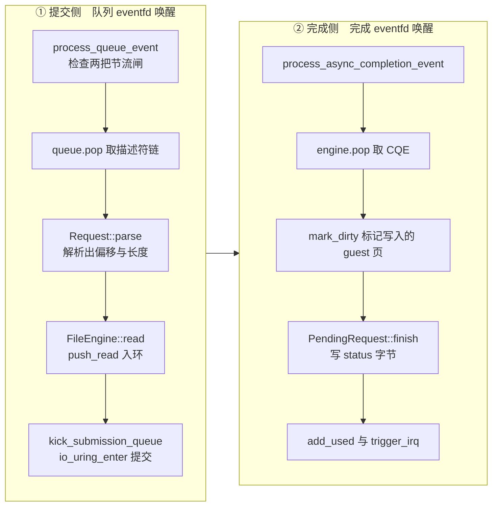

# 28 · io_uring 引擎

> virtio-block 的默认引擎用阻塞系统调用，一次只能有一个请求在途。异步引擎把请求交给 io_uring，
> 让宿主块设备的队列深度真正被用上。为此 Firecracker 没有引入现成的 io_uring crate，而是自己写了一层薄封装，
> 并给这层封装加了一道内核侧的操作白名单。本篇讲这层封装怎么工作，以及它为什么至今还是开发者预览。
>
> **读者**：系统工程师。　**预备**：[第 27 篇 · virtio-block](27-virtio-block.md)、
> [第 26 篇 · virtqueue 实现](26-virtqueue-implementation.md)。
> **代码**：`src/vmm/src/io_uring/`、`src/vmm/src/devices/virtio/block/virtio/io/async_io.rs`、
> `src/vmm/src/devices/virtio/block/virtio/device.rs`

---

## 0. 本篇要回答的问题

1. 同步引擎的瓶颈在哪里，异步引擎换来了什么、又付出了什么？
2. Firecracker 为什么不用现成的 io_uring crate，自己封装得到了什么？
3. `IoUring::new()` 里那串注册调用的顺序为什么不能换？
4. 提交队列与完成队列在用户态与内核态之间是怎么共享的，索引由谁推进？
5. 一个块请求从描述符链走到完成中断，经过哪些结构？中途队列满了会怎样？
6. 暂停与快照时，在途的异步请求怎么处理？

---

## 1. 问题：队列深度 1 的引擎

virtio-block 的同步引擎（`io/sync_io.rs` 的 `SyncFileEngine`）用 `read_exact_volatile_at` /
`write_all_volatile_at` 这类阻塞调用直接读写后备文件。一次调用返回之前，处理这条队列的线程什么也做不了。
换句话说，无论 guest 在 avail ring 里排了多少个请求，落到宿主块设备上的**在途请求数恒为 1**。

现代 NVMe 设备的并行度来自队列深度：同时挂上几十个请求，控制器内部调度、合并、跨通道分发，
吞吐才上得去。深度 1 意味着每个请求都要完整走一遍「提交—等待—完成」，设备大部分时间空转。
虚拟化又在这条路径上叠了一层：guest 里的 I/O 调度器本来就想批量下发，到了 VMM 这里被重新串行化。

异步引擎要解决的就是这一件事：把 guest 排好的一批请求一次性交给内核，不等它们完成就返回，
让事件循环继续处理别的事件；完成时由内核通知。Linux 上做这件事的接口是 io_uring。

代价有三层，后面第 6 节展开：内核版本要求（5.10.51 起）、内核工作线程带来的 PID 与 cgroup 归属问题、
以及 Firecracker 进程里多出的一段需要被 seccomp 允许的系统调用。这三条合起来使得异步引擎在 v1.12.1
里仍标为开发者预览（`io/async_io.rs` 的 `AsyncFileEngine::from_file()` 开头调用
`log_dev_preview_warning("Async file IO", None)`），默认引擎仍是 `Sync`
（`block/virtio/device.rs` 的 `FileEngineType` 用 `#[default]` 标在 `Sync` 上）。

---

## 2. 为什么自己封装

`src/vmm/src/io_uring/` 是一个不到一千行（不含 `generated.rs` 的内核结构体绑定）的自有模块，
只实现 Firecracker 用得到的部分：三种操作码、固定 fd、一个完成 eventfd、一组限制。

自己写而不是引入现成 crate，换到的是三样东西。

**系统调用面可枚举。** Firecracker 的 seccomp 过滤器是按系统调用号逐条允许的
（`resources/seccomp/x86_64-unknown-linux-musl.json` 里能看到 `io_uring_setup`、`io_uring_enter`、
`io_uring_register` 三条，以及给 io_uring 映射环用的 `mmap`）。一个通用 crate 可能在内部用上
`io_uring_enter` 的各种标志、注册缓冲区、甚至 SQPOLL 线程，每多一条路径就要多开一个洞。
自己写的封装只发出确定的几条调用，白名单可以卡得很死。seccomp 的机制见[第 42 篇](42-seccomp.md)。

**依赖面可控。** Firecracker 的构建以 musl 静态链接为目标，每引入一个 crate 都要连同它的传递依赖一起审计、
一起跟着升级。io_uring 的封装代码量不大，自己维护的成本低于审计外部依赖的成本。

**可以主动放弃能力。** 这是最关键的一条，见下一节的 restrictions。

`generated.rs` 是从内核 UAPI 头文件生成的结构体与常量（`io_uring_params`、`io_uring_sqe`、
`io_uring_cqe`、各种 `IORING_*` 常量），不手写、不修改。这一层是纯粹的 ABI 定义。

---

## 3. 建环：一串不能换顺序的注册

`io_uring/mod.rs` 的 `IoUring::new()` 接收四个参数：环的条目数、要注册的文件、限制列表、可选的完成 eventfd。
它内部的动作顺序是有讲究的：

```text
io_uring_setup(num_entries, params)      flags = IORING_SETUP_R_DISABLED
        │                                 ← 环创建出来就是「禁用」的
        ├─ check_features(params)          要求 IORING_FEAT_NODROP
        ├─ SubmissionQueue::new(fd, params)   mmap SQ ring + SQE 数组
        ├─ CompletionQueue::new(fd, params)   mmap CQ ring
        ├─ check_operations()              IORING_REGISTER_PROBE，确认 read / write 可用
        ├─ register_eventfd()              IORING_REGISTER_EVENTFD
        ├─ register_restrictions()         IORING_REGISTER_RESTRICTIONS
        ├─ register_files()                IORING_REGISTER_FILES
        └─ enable()                        IORING_REGISTER_ENABLE_RINGS
```

**环以禁用状态创建。** `params.flags` 里设了 `IORING_SETUP_R_DISABLED`。内核只允许在环被启用之前注册限制；
如果先启用再注册，`IORING_REGISTER_RESTRICTIONS` 会失败。所以限制必须在 `enable()` 之前设好，
而 `enable()` 是构造函数的最后一步。限制一旦生效就**不能撤销**，这正是 `restriction.rs` 的文档注释强调的性质：
它和 seccomp 一样是单向收紧。

**限制就是内核侧的操作白名单。** `restriction.rs` 的 `Restriction` 只有两个变体，翻译成两类内核限制项：
`AllowOpCode(op)` 对应 `IORING_RESTRICTION_SQE_OP`，逐个列出允许的操作码；
`RequireFixedFds` 对应 `IORING_RESTRICTION_SQE_FLAGS_REQUIRED` 并置上 `IOSQE_FIXED_FILE` 位，
要求每个提交项都只能操作预先注册过的 fd。块设备传进来的列表是固定的四项
（`io/async_io.rs` 的 `AsyncFileEngine::new_ring()`）：`RequireFixedFds`，加上 read、write、fsync 三个操作码。

这两条限制的意义要放在威胁模型里看。io_uring 是一个能表达大量操作的通用接口：打开文件、建立网络连接、
甚至提交新的注册请求。如果 Firecracker 进程里有一处内存安全问题让攻击者能往 SQ 里写任意提交项，
一个不受限的环等于一个绕过 seccomp 的通用系统调用入口 —— 因为这些操作是内核工作线程代为执行的，
不经过 Firecracker 线程的 seccomp 过滤器。限制把这个入口收窄成「对这一个已注册的磁盘文件做读、写、fsync」。
代价是块设备后续无法用上 io_uring 的其它能力（比如 `IORING_OP_READV` 的分散读），
换文件时也只能整个重建环 —— `AsyncFileEngine::update_file()` 正是这么做的：
`PATCH /drives/{id}` 换后备文件时新建一个环，把旧环连同它注册的 fd 一起丢弃。

**特性与操作要显式探测。** `check_features()` 只检查一件事：`IORING_FEAT_NODROP`。
这个特性保证内核在完成队列满时不会静默丢弃已完成的条目。没有它，Firecracker 就必须自己维护一个
「已提交未完成」的计数器并把它压在两倍环长以下 —— 代码注释里写明了这个替代方案，
但选择了直接要求内核提供该保证。`check_operations()` 用 `IORING_REGISTER_PROBE` 取回内核支持的操作码集合
（`probe.rs` 用 `FamStructWrapper` 包了变长的 `io_uring_probe`，长度取 `u8::MAX + 1`，
因为探测返回的操作数没有上限说明），然后比对 `REQUIRED_OPS`。注意 `REQUIRED_OPS` 只有 read 和 write，
fsync 没有列进去：它是较早就存在的操作码。

**文件必须先注册。** `register_files()` 把 `File` 的裸 fd 数组交给 `IORING_REGISTER_FILES`，
之后提交项里的 `fd` 字段填的不是真 fd，而是这个数组里的**下标**（`operation/mod.rs` 的 `FixedFd` 就是 `u32` 下标）。
块设备只注册一个文件，所以所有操作的 fd 都是 0。注册 fd 除了让 `RequireFixedFds` 成立，
还省掉内核每次提交时查文件表并增减引用计数的开销。

顺序上唯一必须这样排的是「禁用建环 → 注册限制 → 启用」；探测、eventfd、文件注册夹在中间是自然的，
但如果放到 `enable()` 之后，注册调用本身就会被刚生效的限制挡住。

---

## 4. 两个环：共享内存与索引

io_uring 的核心是两段用户态与内核态共享的映射。`queue/mmap.rs` 的 `mmap()` 用
`MAP_SHARED | MAP_POPULATE` 把它们映射进来，offset 用内核规定的三个魔数
（`IORING_OFF_SQ_RING`、`IORING_OFF_SQES`、`IORING_OFF_CQ_RING`）区分映射的是哪一段。

```text
  用户态                                          内核态
  ┌─────────────────────────────────┐
  │ SQ ring  (IORING_OFF_SQ_RING)   │
  │   head   ← 内核推进（Acquire 读）│  ──┐
  │   tail   ← 用户推进（Release 写）│    │  io_uring_enter(to_submit)
  │   array[i] = i                   │    │
  ├─────────────────────────────────┤    ▼
  │ SQE 数组 (IORING_OFF_SQES)      │   内核工作线程执行
  │   [0..num_entries) io_uring_sqe  │   read / write / fsync
  ├─────────────────────────────────┤    │
  │ CQ ring  (IORING_OFF_CQ_RING)   │    │
  │   head   ← 用户推进（Release 写）│    │
  │   tail   ← 内核推进（Acquire 读）│  ◀─┘  完成后写 CQE，并 write() 到 eventfd
  │   cqes[] io_uring_cqe            │
  └─────────────────────────────────┘
```

`SubmissionQueue::new()` 做了一个简化：内核设计里 SQ ring 的 `array` 是一层间接索引，
允许提交项在 SQE 数组里乱序排布；Firecracker 直接把它初始化成 `array[i] = i`，之后再不改动。
这样 SQ ring 的 tail 与 SQE 数组的下标一一对应，逻辑简单，代价是放弃了乱序复用 SQE 槽位的可能。

索引的读写用显式的内存序：`submission.rs` 的 `push()` 写完 SQE 后用 `Ordering::Release`
存 tail，`pending()` 用 `Ordering::Acquire` 读 head；`completion.rs` 的 `pop()` 用 `Acquire` 读 tail、
`Release` 写 head。这对配合保证了「先看见数据，再看见索引」。用户态侧的 tail（SQ）与 head（CQ）
各自缓存在 `unmasked_tail` / `unmasked_head` 里，类型是 `Wrapping<u32>`，因为它们是单调递增、
靠 `& ring_mask` 取模的计数器，回绕是正常行为而不是溢出错误。

`submit()` 发出 `io_uring_enter`，参数是待提交数 `to_submit` 与 `min_complete`。
`IoUring::submit()` 传 `min_complete = 0`：只提交，不等待。
`IoUring::submit_and_wait_all()` 传 `min_complete = num_ops` 并加上 `IORING_ENTER_GETEVENTS` 标志：
提交并阻塞到所有在途操作完成 —— 这是暂停与快照路径用的那一条。

---

## 5. 一个块请求的旅程

`Operation<T>` 是这层封装的请求类型，`T` 是调用方自定义的 `user_data`。
构造函数有三个：`Operation::read()`、`Operation::write()`、`Operation::fsync()`。

`user_data` 在内核那边只是一个 64 位整数，要把它和一个 Rust 对象关联起来，就得有一张表。
`into_sqe()` 把用户数据插进 `IoUring` 持有的 `slab::Slab<T>`，把返回的槽位下标写进 SQE 的 `user_data` 字段；
`CompletionQueue::pop()` 拿到 CQE 后用这个下标 `slab.try_remove()` 取回对象。
slab 的容量在建环时预留为 `sq_entries + cq_entries`。取不回来（下标已被移除或越界）会返回
`CQueueError::SlabRemoveFailed` 而不是 panic —— 这个下标来自与内核共享的内存，不能无条件信任。

下面是一条 guest 读请求的完整路径。左列是提交侧，右列是完成侧，两侧都跑在同一个 VMM 线程上，
由事件循环分别被队列 eventfd 和完成 eventfd 唤醒。



几个细节值得单独说。

**guest 内存地址直接当缓冲区。** `push_read()` 用 `mem.get_slice(addr, count)` 取出 guest 内存里那段的
宿主虚拟地址，把裸指针填进 SQE 的 `addr` 字段。内核工作线程直接读写这段内存，不经过任何中转缓冲。
这是异步引擎相对同步引擎的另一半收益：零拷贝。

**脏页标记要等到完成。** 读请求是「设备写 guest 内存」，所以要把目标页标记为脏
（快照的差分导出依赖它，见[第 14 篇](14-dirty-page-tracking.md)）。但在提交时还不知道内核实际写了多少字节。
`async_io.rs` 用 `WrappedRequest` 把 `GuestAddress` 与 `PendingRequest` 包在一起作为 `user_data`，
完成时 `mark_dirty_mem_and_unwrap()` 按 CQE 里的实际字节数调用 `mem.mark_dirty(addr, count)` 再解包。
写请求走 `WrappedRequest::new()`，`addr` 为 `None`，不标脏。

**两把节流闸。** `device.rs` 的 `process_queue_event()` 在处理队列前检查两个条件：
`rate_limiter.is_blocked()` 与 `is_io_engine_throttled`。前者是令牌桶（[第 35 篇](35-entropy-vmgenid-rate-limiter.md)），
后者是 io_uring 环满。`IoUring::push()` 在两处会报「满」：SQ 满（`SQueueError::FullQueue`）
与在途操作数达到 CQ 容量（`IoUringError::FullCQueue`，由 `num_ops >= cqueue.count()` 判定）。
这两种错误被 `is_throttling_err()` 识别出来，一路传到 `request.rs` 变成
`ProcessingResult::Throttled`；`process_queue()` 收到它就 `queue.undo_pop()` 把描述符链退回 avail ring，
置 `is_io_engine_throttled = true` 并跳出循环。解闸在完成事件里：
`process_async_completion_event()` 处理完一批 CQE 后若发现该标志为真，就清掉它并立即重跑 `process_queue(0)`。

注意 `num_ops` 的口径：它统计的是 SQ 里待提交的、已提交在途的、以及已完成但还没被 `pop()` 走的三类之和。
用 CQ 容量而不是 SQ 容量作为上限，是因为 `IORING_FEAT_NODROP` 只承诺不丢条目，
不承诺 CQ 无限；把在途总数压在 CQ 容量以下，CQ 就永远不会溢出。环的条目数
`IO_URING_NUM_ENTRIES` 在 `block/virtio/mod.rs` 里硬编码为 128，不可配置。

**完成时不必逐个通知。** 内核每写一个 CQE 就往注册的 eventfd 写一次，但事件循环被唤醒一次后，
`process_async_completion_queue()` 会循环 `pop()` 直到返回 `None`，把当前可见的 CQE 一次收完，
最后只调一次 `queue.advance_used_ring_idx()` 与一次 `prepare_kick()` / `trigger_irq()`。
一次唤醒摊到多个请求上，是异步引擎省中断的地方。

---

## 6. 暂停、快照与关闭：环必须排空

异步引擎引入了一个同步引擎没有的状态：**在途请求**。这段状态既不在 Firecracker 的内存里，
也不在 guest 的队列里，而在内核的环里。任何要把设备状态固化下来的操作都必须先把它清空。

`AsyncFileEngine::drain(discard_cqes)` 做第一件事：`submit_and_wait_all()` 提交并等待全部完成。
参数决定第二件事做不做：为真时循环 `do_pop()` 直到空，纯粹为了把 slab 里的 `user_data` 释放掉，
避免泄漏；为假时把 CQE 留在环里，交给后续代码正常处理。
`drain_and_flush()` 在 `drain()` 之后再调一次 `File::sync_all()`，把数据刷到物理介质
（注释指出不需要先 flush，因为所有 I/O 都经由 io_uring，Rust 侧没有缓冲）。

`VirtioBlock::prepare_save()` 的写法体现了这个区分：先 `drain_and_flush(false)` —— 不丢弃 CQE ——
再调 `process_async_completion_queue()`，让每个完成的请求走完正常流程：标脏、写 status 字节、`add_used`。
这样快照里保存的队列状态是自洽的：所有被 guest 提交过的请求都已经出现在 used ring 里，
恢复之后的 guest 不会等一个永远不会回来的响应。设备状态的保存与恢复见[第 40 篇](40-device-persist.md)。

快照里只记引擎的种类（`block/virtio/persist.rs` 的 `FileEngineTypeState`，
枚举额外留了一个未标记的变体来兼容没有这个字段的旧快照），不记环的内容 —— 因为按上面的顺序，
保存时环里已经没有内容了。恢复时按记下的种类重新建环。

---

## 7. 代价清单

上游文档 `docs/api_requests/block-io-engine.md` 把异步引擎标为开发者预览，理由不是功能不全，
而是两个宿主侧的资源问题，读者在决定是否启用时要一并算进去。

| 代价 | 内容 | 后果 |
|---|---|---|
| 内核版本 | 最低 5.10.51 | 更旧的宿主上配置 `io_engine=Async` 会在建环时失败 |
| 工作线程数 | 每设备的内核工作线程数上界随环长与 CPU 数增长 | 宿主上 microVM 密度高时可能触到 PID 上限 |
| cgroup 归属 | 5.12 之前的内核里工作线程生在根 cgroup | 这部分 CPU 与内存开销无法计入该 microVM 的 cgroup |
| 设备创建延迟 | 建环要多发若干系统调用 | `PUT /drives` 与快照恢复变慢 |

失败路径值得注意：`IoUring::new()` 的任何一步出错都变成 `AsyncIoError::IoUring`，
经 `BlockIoError::Async` → `VirtioBlockError::FileEngine` → `DriveError::CreateBlockDevice` 传到 API，
以 400 返回。没有「异步不可用就退回同步」的自动降级 —— 配置说 `Async` 就必须是 `Async`，
否则请求失败。这与 Firecracker 一贯的取舍一致：宁可显式失败，不做静默降级，
因为静默降级会让运维看到的性能与配置对不上。

jailer 的 cgroup 隔离（[第 43 篇](43-jailer.md)）覆盖不到内核工作线程这一点，
是上面第三行的直接来源：安全边界的完整性依赖宿主内核版本，而不只依赖 Firecracker 自己的配置。

---

## 8. 小结

- 同步引擎的在途请求数恒为 1，异步引擎的价值是把 guest 已经排好的批量请求真正并发地交给宿主块设备，并做到零拷贝。
- `src/vmm/src/io_uring/` 是自有的薄封装，只支持 read / write / fsync 与固定 fd；自己写换到的是可枚举的系统调用面、可控的依赖面，以及主动收紧能力的自由。
- 环以 `IORING_SETUP_R_DISABLED` 创建，注册完限制后才 `enable()`；限制生效后不可撤销，它把 io_uring 这个通用接口收窄为对单个磁盘文件的三种操作，作用类似一道内核侧的 seccomp。
- SQ / CQ 是与内核共享的映射，用户态与内核态各推进一个索引，用 Acquire / Release 配对保证可见性顺序；`array[i] = i` 的简化放弃了 SQE 槽位的乱序复用。
- `user_data` 靠一张 slab 把 64 位整数映射回 Rust 对象；从共享内存读回的下标要当作不可信输入处理。
- 读请求的脏页标记必须推迟到完成时，因为只有 CQE 才知道内核实际写了多少字节。
- 环满通过 `ProcessingResult::Throttled` 反压到 virtqueue：描述符链退回 avail ring，设备置节流标志，完成事件到来时解闸重跑。
- 在途请求是一段落在内核里的设备状态；`prepare_save()` 先排空再让完成项走完正常流程，保证快照里的 used ring 自洽。
- 异步引擎至今是开发者预览，卡点不在功能而在内核工作线程的 PID 与 cgroup 归属；建环失败直接以 400 返回，不自动降级。

---

## 延伸阅读 / 下一篇

- [第 27 篇 · virtio-block：请求解析与 I/O 引擎](27-virtio-block.md)：本篇的上游，请求怎么从描述符链解析出来。
- [第 29 篇 · vhost-user 块设备](29-vhost-user-block.md)：把整个后端搬到另一个进程的另一条路。
- [第 42 篇 · seccomp](42-seccomp.md)：`io_uring_setup` / `enter` / `register` 在过滤器里的位置。
- [第 40 篇 · 设备状态的 Persist](40-device-persist.md)：块设备状态在快照里的存法。
- 上游文档 `docs/api_requests/block-io-engine.md`：开发者预览状态的完整说明与宿主要求。
