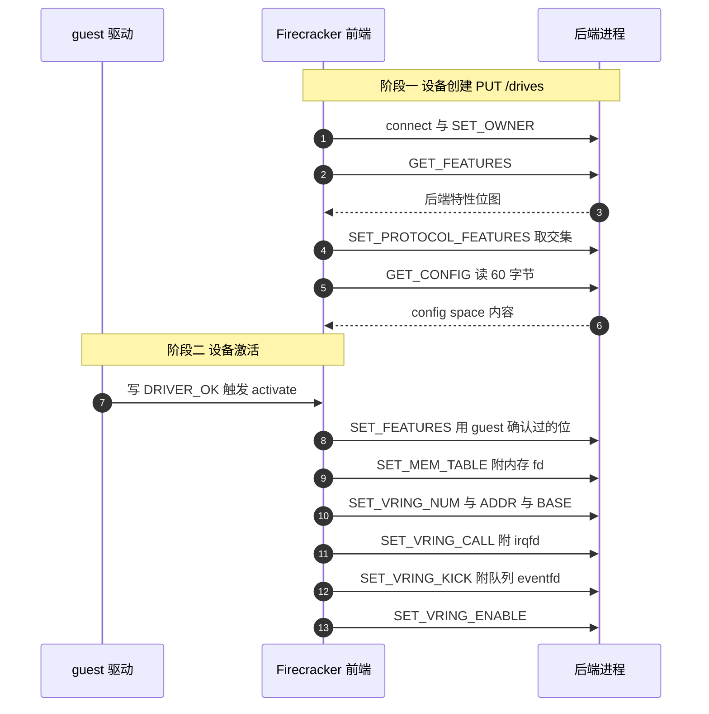

# 29 · vhost-user 块设备

> 前一篇的两个引擎都在 Firecracker 进程里处理 virtqueue。vhost-user 走另一条路：Firecracker 只做前端，
> 把队列的处理整个交给宿主上另一个进程，自己退到控制面。这让后端可以实现任意的取数逻辑，
> 代价是 guest 内存必须以共享映射交出去、限速失效、快照不可用。本篇讲这条路的协议、时机与边界。
>
> **读者**：系统工程师。　**预备**：[第 27 篇 · virtio-block](27-virtio-block.md)、
> [第 25 篇 · virtio 设备模型与 MMIO 传输层](25-virtio-device-model-and-transport.md)、
> [第 13 篇 · guest 内存](13-guest-memory.md)。
> **代码**：`src/vmm/src/devices/virtio/vhost_user.rs`、`src/vmm/src/devices/virtio/block/vhost_user/`、
> `src/vmm/src/resources.rs`

---

## 0. 本篇要回答的问题

1. 什么样的需求靠调块设备引擎解决不了，非要把后端搬到另一个进程？
2. Firecracker 作为 vhost-user 前端，一共只做哪几件事？数据面上它还剩下什么？
3. 前端与后端交换信息的三个时机分别发生在什么时候，各自交换什么？
4. 配置一个 vhost-user 块设备，为什么整台 microVM 的 guest 内存分配方式都会改变？
5. 快照为什么不支持 vhost-user 设备？v1.12.1 的实际行为与文档一致吗？
6. 限速、cgroup、jailer 这些既有的约束在 vhost-user 下还成立吗？

---

## 1. 问题：后端逻辑不属于 VMM

virtio-block 的两个引擎（[第 27 篇](27-virtio-block.md)、[第 28 篇](28-io-uring-engine.md)）
都假设一件事：块设备的内容就是宿主上的一个文件，请求翻译成对这个文件的 `pread` / `pwrite` 或等价的 io_uring 操作。
这个假设覆盖了绝大多数场景，但也把能做的事框死了。

考虑几类需求：数据不在本地磁盘上而在网络存储里，要按块拉取并缓存；要按访问模式做预读，
预读策略依赖上层语义；要在读路径上做去重或解压。这些逻辑写进 Firecracker 意味着两件事：
VMM 的代码面与攻击面按需求的复杂度增长，而 Firecracker 的整个设计前提是这个面要小
（见[第 02 篇](02-microvm-design-tradeoffs.md)）；并且这些逻辑一旦跑在 VMM 线程里，
就与 vCPU 线程、事件循环共享同一个进程的命运，一处崩溃全盘皆输。

vhost-user 的做法是把边界划在 virtqueue 上：**谁来轮询和处理这个队列，是可以换人的**。
Firecracker 负责把「队列在哪、guest 内存长什么样、guest 敲门时会写哪个 eventfd」告诉另一个进程，
之后就不再参与。后端进程直接读写 guest 内存、直接消费队列、直接通过 irqfd 打中断。
Unix socket 只用于这套协商，不承载任何数据（`docs/api_requests/block-vhost-user.md` 明确：
socket 只是控制面，不参与数据面）。

这不是「更快的块设备」。上游文档特别指出，一个朴素实现的后端不会带来性能提升 ——
收益来自后端能实现自定义逻辑，并且这些逻辑与队列处理在同一个进程里，省掉了上下文切换。

```text
        Firecracker 进程                        后端进程（如 SPDK）
  ┌──────────────────────────┐           ┌──────────────────────────┐
  │ VhostUserBlockImpl       │           │  队列轮询 + 自定义逻辑   │
  │  · 特性协商              │  UDS 控制面│                          │
  │  · config space 中转     │◀─────────▶│  · 网络取数 / 预读 / 缓存│
  │  · 把队列与内存告诉后端  │           │                          │
  └──────────┬───────────────┘           └─────────┬────────────────┘
             │ 不参与数据面                        │ 直接读写
             │                                     ▼
        ┌────┴─────────────────────────────────────────────┐
        │  guest 内存（memfd，MAP_SHARED，fd 经 UDS 传出） │
        │  descriptor table / avail ring / used ring       │
        └──────────────────────────────────────────────────┘
```

---

## 2. 前端只做四件事

`VhostUserBlockImpl<T>`（`block/vhost_user/device.rs`）实现 `VirtioDevice` trait，
所以在 MMIO 传输层看来它和普通 virtio 设备没有区别：有 `avail_features`、有 `queues`、有 `config_space`、
有 `activate()`。区别在于这些方法的实现体里没有任何 I/O 处理逻辑。

它的四件事是：连接并成为 session 的 owner；与后端和 guest 双向协商特性；替 guest 中转 config space；
在激活时把内存表与 vring 信息交给后端。

数据面上它还剩下的只有结构体里那几个字段本身。`queues` 里的 `Queue` 对象在前端这边**从不被消费**：
`Block::process_virtio_queues()` 对 `VhostUser` 变体是一个空实现。
事件处理器（`block/vhost_user/event_handler.rs`）只注册了一个事件源 `PROCESS_ACTIVATE`，
激活之后连这一个也注销掉，此后设备在事件循环里完全沉默 —— 任何送到它这里的事件都被记为
「Spurious event received」。队列 eventfd 与 irqfd 都被交给了后端，前端不再监听它们。

设备的形状是固定的：`block/vhost_user/mod.rs` 里 `NUM_QUEUES = 1`、`QUEUE_SIZE = 256`。
只有一条队列，因为 virtio-blk 的单队列形态已经够用，而多队列要在前后端之间多协商一层。

`vhost_user.rs` 里的 `VhostUserHandleBackend` trait 值得一提：它把 `vhost` crate 的 `Frontend`
的每个方法都重新声明了一遍，默认实现全是 `unimplemented!()`。这不是抽象层，
而是**为了可测**：`VhostUserHandleImpl<T>` 对 T 泛型，测试里可以塞进一个只实现几个方法的 mock，
验证前端到底给后端发了哪些消息、参数是什么。真实类型是 `VhostUserHandleImpl<Frontend>`，
别名 `VhostUserHandle`。

---

## 3. 三个交换时机

前端与后端只在三个时刻说话：设备创建、设备激活、配置更新。下图的 `drv` 是 guest 里的 virtio-blk 驱动，
`FC` 是 Firecracker 的前端，`BE` 是后端进程。



### 3.1 创建：两轮特性协商的第一轮

`VhostUserBlockImpl::new()` 先 `VhostUserHandleImpl::new()`：连 Unix socket，发 `SET_OWNER`。
随后 `negotiate_features()` 取后端特性与前端 `AVAILABLE_FEATURES` 的**交集**。

前端的 `AVAILABLE_FEATURES` 只有四位：`VIRTIO_F_VERSION_1`、`VIRTIO_RING_F_EVENT_IDX`、
vhost-user 专有的 `PROTOCOL_FEATURES` 位，以及 `VIRTIO_BLK_F_RO`。
`cache_type` 配成 `Writeback` 时再加上 `VIRTIO_BLK_F_FLUSH`。
这个列表短得值得注意：前端不声明任何与请求处理有关的特性，因为它不处理请求。

`VIRTIO_BLK_F_RO` 的处理方式与 virtio-block 不同。virtio-block 的只读来自配置项 `is_read_only`；
vhost-user 块设备的 `VhostUserBlockConfig` 里根本没有这个字段（`TryFrom<&BlockDeviceConfig>`
要求 `is_read_only`、`path_on_host`、`rate_limiter`、`file_engine_type` **全部为空**，
只接受 `socket`）。前端总是把 RO 位放进请求列表，若后端也报这一位，
`read_only` 就是真 —— **只读与否由后端说了算**，前端只是转述。

协议特性只请求一项：`VhostUserProtocolFeatures::CONFIG`。协商成功后前端立刻 `GET_CONFIG`
读回 60 字节（`BLOCK_CONFIG_SPACE_SIZE`）作为自己的 `config_space`；
没协商上就留一个空 `Vec`。config space 里有容量、块大小这些 guest 要读的字段，
它们的真值只有后端知道。

如果后端协商上了 `REPLY_ACK`，`set_hdr_flags(NEED_REPLY)` 会给后续每条消息都要求一个应答，
让前端能发现「后端收到但处理失败」这类情况。

### 3.2 激活：第二轮协商与真正的移交

`new()` 结束时有一步容易看漏：`avail_features` 被设成刚协商出的 `acked_features`，
而结构体自己的 `acked_features` 只留下 `PROTOCOL_FEATURES` 那一位。
意思是「后端支持的这些位，现在拿去给 guest 挑」—— guest 驱动通过 MMIO 写回自己接受的位，
`set_acked_features()` 更新字段。所以特性经过了两轮收窄：先与后端取交集，再与 guest 取交集。

`activate()` 做的第一件事就是把这轮的结果 `set_features()` 重新发给后端，
让后端知道 guest 最终接受了什么。然后 `setup_backend()` 依次发出：

- `SET_MEM_TABLE`：遍历 `GuestMemoryMmap` 的每个区域，取出 `file_offset()` 里的 fd 与偏移，
  连同 GPA、长度、宿主用户态地址打包成 `VhostUserMemoryRegionInfo`。fd 通过 Unix socket 的
  ancillary data 传给后端。**区域没有 `file_offset()` 就直接报错** `VhostUserMemoryRegion` —— 见第 4 节。
- `SET_VRING_NUM`：先对所有队列发一遍，再进入逐队列的循环。代码注释说明了原因：
  像 SPDK 这样的后端需要在早期就知道要处理几条队列。
- `SET_VRING_ADDR`：把三个环的地址翻译成**宿主虚拟地址**再发过去。
  注意这里用的是 `mem.get_host_address()`，不是 GPA；后端拿到的是能直接解引用的地址。
- `SET_VRING_BASE`：告诉后端从 avail ring 的哪一项开始取。取自 `queue.avail_ring_idx_get()`。
- `SET_VRING_CALL`：把 `irq_trigger.irq_evt` 交出去。这是 irqfd，后端写它就等于给 guest 打中断，
  不经过 Firecracker。
- `SET_VRING_KICK`：把队列 eventfd 交出去。它是 ioeventfd 的另一端，guest 写 `QueueNotify`
  寄存器时由 KVM 直接置位，后端直接被唤醒 —— 这条路径上 Firecracker 同样不参与。
- `SET_VRING_ENABLE`：开闸。

到这一步，数据面上 Firecracker 已经完全退出：guest 敲门直达后端，后端做完直接打中断。

### 3.3 配置更新：唯一的运行期交互

`PATCH /drives/{id}` 对 vhost-user 设备的语义与对 virtio-block 完全不同。
`rpc_interface.rs` 的 `update_block_device()` 用请求体的形状分流：
`path_on_host` 与 `rate_limiter` **都为空**时走 `update_vhost_user_block_config()`。
它最终调到 `VhostUserBlockImpl::config_update()`：重新 `GET_CONFIG` 拉一次 config space，
然后 `trigger_irq(IrqType::Config)` 通知 guest 配置变了。

典型用途是后端把磁盘扩容之后让 guest 看到新容量。反过来，
对 vhost-user 设备发带 `path_on_host` 的 PATCH 会走进 `Block::update_disk_image()` 的
`VhostUser` 分支，返回 `BlockError::InvalidBlockBackend`；带 `rate_limiter` 的同理。

`write_config()` 是空实现，注释说明了理由：前端不声明 `VIRTIO_BLK_F_CONFIG_WCE`，
其余 config 字段都是不可变的，所以 guest 对 config space 的写直接丢弃。

---

## 4. 一个设备改变整台机器的内存形态

后端要直接读写 guest 内存，就得把 guest 内存映射进自己的地址空间。跨进程共享一段映射的办法是
memfd：创建一个匿名的内存文件，`MAP_SHARED` 映射它，再把 fd 传给对方。
这就是 `SET_MEM_TABLE` 要求每个区域都有 `file_offset()` 的原因。

于是出现了一个跨越设备边界的耦合。`resources.rs` 的 `VmResources::allocate_guest_memory()`
遍历所有块设备，只要**有任何一个**是 vhost-user 的，整台 microVM 的 guest 内存就用
`memory::memfd_backed()` 分配；否则用 `memory::anonymous()`。代码注释直白地写明了取舍：
共享映射的缺页更贵，所以只在确实需要时才用。上游文档给出的观测是页错误开销最多高出约两成四
（测量条件见 `docs/api_requests/block-vhost-user.md`，本书不复述性能数字）。

这个耦合还有几条尾巴：

**memfd 一直开着。** 文档承认 Firecracker 不关闭这个 fd，因为它必须保持打开到所有 vhost-user
设备都激活完毕，而「哪些设备已经激活完」这件事没有被跟踪。后果是这个 fd 在
`/proc/<pid>/fd` 里一直可见，宿主上任何能读该进程 procfs 的进程都能映射它并观察 guest 运行时行为。
这是一条真实存在的技术债，缓解办法只能是限制 procfs 的访问。

**jailer 的文件大小限制要放宽。** memfd 在内核看来是文件，jailer 设的 `RLIMIT_FSIZE`
必须大于最大的那个 guest 内存区域，否则分配会失败（[第 43 篇](43-jailer.md)）。

**大页仍然可用。** `memfd_backed()` 接受 `huge_pages` 参数并把它传给 `create_memfd()`
的 `HugetlbSize`，memfd 上加了 `SealShrink` / `SealGrow` / `SealSeal` 三把封印，
保证尺寸不会被任何一方改动。

---

## 5. 失去的三样东西

把数据面交出去，Firecracker 在这个设备上原有的三项能力也一并交了出去。

**限速。** virtio-block 的 `rate_limiter` 是在 `process_queue()` 里生效的，
而 vhost-user 前端根本不跑这个函数。配置层面也被堵死：带 `rate_limiter` 的配置无法构造出
`VhostUserBlockConfig`。上游文档给出的替代方案是后端自己实现限速，或者用 cgroup 限制 guest 的 CPU，
间接压住它的 I/O 强度。

**宿主 page cache。** virtio-block 读写的是宿主文件，宿主 page cache 的缓存与预读是白拿的。
vhost-user 后端直接持有数据，这份收益不存在，要不要做缓存是后端自己的事。

**快照。** 这是最硬的一条限制。`block/vhost_user/persist.rs` 里 `VhostUserBlock::save()` 是
`unimplemented!()`，`restore()` 直接返回 `VhostUserBlockError::SnapshottingNotSupported`。
原因不难理解：设备的真实状态 —— 后端处理到哪、缓存里有什么、连接是否还在 —— 都在另一个进程里，
vhost-user 协议里没有把它取出来再放回去的消息。

值得指出的是**代码的实际行为与文档不一致**。`docs/api_requests/block-vhost-user.md` 写的是
「对配置了 vhost-user 设备的 microVM 创建快照会失败」，但 v1.12.1 的
`device_manager/persist.rs` 在遍历设备时，遇到 `block.is_vhost_user()` 只打一条
`warn!("Skipping vhost-user-block device...")` 就跳过，快照照常生成。
这意味着产出的快照里**少了一个设备**：恢复出来的 microVM 的设备拓扑与保存时不同，
guest 会看到一个曾经存在的块设备凭空消失。`restore()` 那条错误路径实际上走不到，
因为状态从一开始就没被写进快照。使用者不能依赖「快照会失败」这个假设来兜底。

metrics 方面，`vhost_user_metrics.rs` 按 drive id 分表，记的是 `activate_fails`、`cfg_fails`
两个计数，以及 `init_time_us`、`activate_time_us`、`config_change_time_us` 三个耗时 —— 正好对应第 3 节的三个交换时机。
没有请求级的 metrics，因为请求不经过前端。

后端崩溃时 Firecracker 不会自动退出。文档建议后端在崩溃路径上给 Firecracker 发一个信号（例如 `SIGBUS`），
否则会留下一个队列永远不被消费的孤儿 microVM。同样地，后端应当为「等 Firecracker 连接」
设置超时，以免前端提前退出时后端资源泄漏。这些都是部署方的责任，Firecracker 侧没有对应机制。

---

## 6. 后续各层的差异

ARM 适配版的原地回滚明确把 vhost-user 块设备排除在外：
`src/vmm/src/devices/virtio/block/persist.rs` 里给 `BlockState` 加了一个取 virtio 侧状态的辅助方法，
对 `VhostUser` 变体返回 `None`，注释说明理由是它的状态在后端进程里，原地写回够不着。
详见[第 72 篇 · 回滚的设备状态](72-rollback-devices.md)。
e2b 定制版没有改动本篇涉及的任何文件，`vhost_user.rs` 与 `block/vhost_user/` 两层都是上游原样。

---

## 7. 小结

- vhost-user 把边界划在 virtqueue 上：队列由谁处理是可替换的。Unix socket 只承载控制面，数据面完全绕过 Firecracker。
- 它的价值不是更快，而是允许后端实现任意取数逻辑，而不必把这些逻辑塞进 VMM 的攻击面。
- 前端只做四件事：连接与 SET_OWNER、两轮特性协商、config space 中转、激活时移交内存表与 vring 信息。
- 特性经过两次收窄：先与后端取交集，再交给 guest 挑；`VIRTIO_BLK_F_RO` 的最终值由后端决定，前端只转述。
- 激活时交出去的是 irqfd 与队列 eventfd，此后 guest 的敲门与设备的中断都不经过 Firecracker，事件处理器随之沉默。
- 只要有一个 vhost-user 块设备，整台 microVM 的 guest 内存就改用 memfd 加共享映射，缺页代价随之上升；memfd 一直保持打开，procfs 的可见性是一条需要在部署层缓解的技术债。
- 限速与宿主 page cache 一并失去，前者在配置层就被堵死，后者要由后端自己补。
- 快照不支持。v1.12.1 的实际行为是跳过该设备并打一条警告，而不是文档所说的失败 —— 产出的快照会静默丢失一个设备。

---

## 延伸阅读 / 下一篇

- [第 27 篇 · virtio-block](27-virtio-block.md)：进程内处理请求的那条路，与本篇对照读。
- [第 13 篇 · guest 内存](13-guest-memory.md)：`memfd_backed()` 与 `anonymous()` 两种分配方式的细节。
- [第 40 篇 · 设备状态的 Persist](40-device-persist.md)：设备遍历与状态保存的整体框架。
- [第 30 篇 · virtio-net](30-virtio-net.md)：下一篇，回到 Firecracker 进程内处理队列的设备。
- 上游文档 `docs/api_requests/block-vhost-user.md`：拓扑、安全考虑与可用的开源后端清单。
