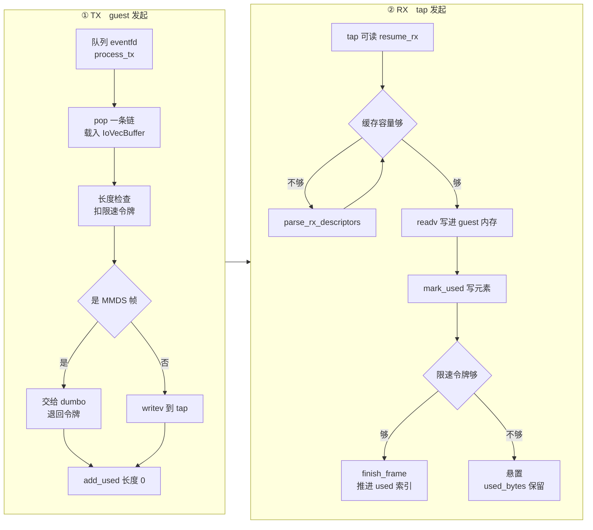

# 30 · virtio-net：tap、收发路径与 offload

> 网络设备的两个方向是不对称的。发送由 guest 发起，设备只要把描述符链交给 tap；
> 接收由宿主发起，帧到达时设备必须**已经**握有可写的 guest 缓冲区。这条不对称性催生了一个预解析的
> RX 描述符缓存，它是 v1.12.1 的 net 设备里最需要讲清楚的结构，也是后面原地回滚那一篇要处理的麻烦。
>
> **读者**：系统工程师。　**预备**：[第 25 篇 · virtio 设备模型与 MMIO 传输层](25-virtio-device-model-and-transport.md)、
> [第 26 篇 · virtqueue 实现](26-virtqueue-implementation.md)。
> **代码**：`src/vmm/src/devices/virtio/net/device.rs`、`tap.rs`、`event_handler.rs`、`persist.rs`

---

## 0. 本篇要回答的问题

1. tap 设备是怎么打开和配置的，vnet header 是什么，为什么必须先告诉内核它的长度？
2. TX 路径上一条帧从描述符链走到 tap 经过哪几步？MMDS 是在哪一点被拦出来的？
3. 为什么 RX 需要一个预解析缓存，而 TX 不需要？这个缓存由哪几个字段构成？
4. `VIRTIO_NET_F_MRG_RXBUF` 对 RX 的写入方式有什么影响？没有它时最小缓冲区要多大？
5. 一帧收满之后，used ring 的推进为什么要分成 `mark_used()` 与 `finish_frame()` 两步？
6. 快照恢复时这个缓存怎么重建？为什么不能直接把 iovec 数组序列化下来？

---

## 1. 契约与后端

virtio-net 设备对 guest 的契约很简单：两条队列，RX（索引 0）与 TX（索引 1），
队列长度都是 `NET_QUEUE_MAX_SIZE = 256`（`net/mod.rs`）。config space 里只有一个字段 `guest_mac`。
设备类型是 `TYPE_NET`。

宿主侧的后端是一个 tap 接口。`tap.rs` 的 `Tap::open_named()` 打开 `/dev/net/tun`，
用 `O_NONBLOCK` 与 `O_CLOEXEC`，然后发一次 `TUNSETIFF` ioctl，flags 是
`IFF_TAP | IFF_NO_PI | IFF_VNET_HDR` 三位的并集：

- `IFF_TAP`：收发的是完整的以太网帧（L2），不是 IP 包。
- `IFF_NO_PI`：不要在帧前面附加内核自己的 packet info 头。
- `IFF_VNET_HDR`：帧前面带一个 virtio-net 头。

`IFF_VNET_HDR` 是这三位里唯一需要解释的。virtio-net 规定每一帧前面有一个
`virtio_net_hdr_v1` 结构（12 字节：flags、gso_type、hdr_len、gso_size、csum 相关的两个 16 位字段、num_buffers），
它承载校验和与分段卸载的元信息。tap 支持同一个头格式，于是这个头可以直接透传：
从 guest 收到的帧连同头一起 `writev` 给 tap，从 tap 读到的帧连同头一起 `readv` 进 guest 内存。
设备本身既不生成也不解释这个头 —— 除了 `num_buffers` 一个字段，见第 4 节。

头的长度不是内核默认值，所以 `Net::new()` 打开 tap 之后立刻调
`tap.set_vnet_hdr_size(vnet_hdr_len())` 发一次 `TUNSETVNETHDRSZ`。顺序不能反：
先约定好头长度，内核才知道怎么切分后续的读写。

`Tap` 剩下的两个方法就是数据面的全部：`write_iovec()` 对 tap fd 做 `writev`，
`read_iovec()` 做 `readv`。两者都接受 iovec 数组，也就是说帧在 guest 内存里是分散的多段，
内核直接按段读写，中间没有拷贝。

配置项（`vmm_config/net.rs` 的 `NetworkInterfaceConfig`）只有五个：
`iface_id`、`host_dev_name`、`guest_mac`、`rx_rate_limiter`、`tx_rate_limiter`。
v1.12.1 **没有** `mtu` 配置项，也不声明 `VIRTIO_NET_F_MTU`；MTU 由宿主侧的 tap 接口自己设定。
运行期能改的只有限速：`PATCH /network-interfaces/{id}` 走
`NetworkInterfaceUpdateConfig` → `Net::patch_rate_limiters()`。

---

下图把两个方向的主干并排放在一起，左列是发送、右列是接收；两列的起点分别是 guest 的敲门与 tap 的可读事件。



## 2. TX：一条链一帧

TX 由 guest 发起。guest 把一帧写进描述符链、挂到 avail ring、写 `QueueNotify` 寄存器，
ioeventfd 被置位，事件循环唤醒 `process_tx_queue_event()` → `process_tx()`。

`process_tx()` 是一个 `while let Some(head) = tx_queue.pop_or_enable_notification()` 循环，
每轮处理一条链：

1. `tx_buffer.load_descriptor_chain(mem, head)` 把这条链变成一组 iovec。
   `tx_buffer` 是设备持有的**单个** `IoVecBuffer`，每轮覆盖上一轮 —— TX 不需要缓存，
   因为发送时机由 guest 决定，设备总是在有帧要发时才来取。解析失败就 `add_used(head_index, 0)` 打发掉。
2. 长度检查：超过 `MAX_BUFFER_SIZE`（65562 字节，够放一个 64 KiB 的 GSO 帧加头）的帧被判为畸形，
   记 `tx_malformed_frames` 后丢弃。
3. 限速：`rate_limiter_consume_op()` 先扣一个 op 令牌再扣字节令牌；字节不够时把 op 令牌**退回去**，
   然后 `tx_queue.undo_pop()` 把链退回 avail ring 并跳出循环。两个桶必须同时满足，
   所以退回这一步不能省，否则 op 桶会被白白消耗。
4. `write_to_mmds_or_tap()`：分流点，见下。
5. `add_used(head_index, 0)`。TX 的 used 长度写 0，因为设备没有往 guest 内存里写任何东西。

循环结束后 `tx_buffer.clear()` —— 注释写明原因是不能让两个 `IoVecBuffer` 指向同一段内存 ——
再 `try_signal_queue(NetQueue::Tx)` 推进 used ring 索引并按需打中断。

### 2.1 MMDS 的拦截点

`write_to_mmds_or_tap()` 先把帧头读进设备自带的 `tx_frame_headers` 数组
（长度是 vnet 头加上以太网头再加上 IPv4 ARP 帧长，够判断帧的去向），剥掉 vnet 头，
交给 `MmdsNetworkStack::is_mmds_frame()` 判断。

判定为 MMDS 帧时：把整帧（去掉 vnet 头）拷进一个新分配的 `Vec`，交给 `detour_frame()`，
记 `METRICS.mmds.rx_accepted`，然后 **`rate_limiter_replenish_op()` 把刚才扣掉的令牌退回**——
MMDS 流量不计入限速，因为它根本没有出宿主。函数返回 `true` 表示帧被 MMDS 吃掉了。

不是 MMDS 帧就走 tap。走之前有一个观测点：如果配置了 `guest_mac`，
用 `EthernetFrame::from_bytes()` 解出源 MAC 与它比对，不一致就给 `tx_spoofed_mac_count` 计数。
注意这只是**计数，不是拦截** —— 帧照样发出去。设备不做 MAC 过滤，
真正的隔离要靠宿主侧的网络配置。

最后 `process_tx()` 末尾有一个回环：如果这一轮有帧被 MMDS 消费，且 RX 侧没有未完成的帧
（`rx_buffer.used_bytes == 0`），就顺手调一次 `process_rx()`。
原因写在代码注释里：MMDS 的网络栈是一个同步状态机，不注册任何事件源，
所以「请求进去了，响应出来了」这件事没有别的机制会触发，只能由喂它请求的这一侧顺带检查一次。

---

## 3. RX：为什么需要一个预解析缓存

RX 的发起方是宿主。tap fd 可读时事件循环唤醒设备，此时必须立刻有一段可写的 guest 内存
能接住这一帧 —— `readv` 需要的 iovec 数组要在调用之前就准备好。

朴素做法是每次收到 tap 事件时才去 RX 队列 `pop()` 一条链、解析成 iovec、`readv`、`add_used`。
问题有两个。一是每帧都要做一遍描述符链的遍历与地址翻译，而 RX 是高频路径。
二是在开启了 `VIRTIO_NET_F_MRG_RXBUF` 时，一帧可能要跨多条链才装得下，
而「要几条」只有在 `readv` 返回之后才知道 —— 必须先把多条链的 iovec 拼在一起交给内核。

v1.12.1 的做法是维护一个**预解析缓存** `RxBuffers`（`net/device.rs`）：
guest 往 RX 队列放缓冲区时就把它们解析好存起来，帧到达时直接用。

```text
  RxBuffers
  ├─ min_buffer_size : u32     可用缓冲区的最小长度，激活时按特性算出
  ├─ iovec           : IoVecBufferMut<256>
  │     └─ vecs : IovDeque<256>   ← 一个 iovec 的环，两端都能进出
  │        [iov0][iov1][iov2][iov3][iov4][iov5] …
  │        └─chain A─┘ └───── chain B ─────┘
  ├─ parsed_descriptors : VecDeque<ParsedDescriptorChain>
  │        每项 { head_index, length, nr_iovecs }
  │        记录 iovec 环里哪几段属于哪条链
  ├─ used_descriptors : u16    已写好 used 元素但还没让 guest 看见的条数
  └─ used_bytes       : u32    当前这一帧已经写进 guest 的字节数
```

两个容器必须配对理解：`iovec` 是扁平的 iovec 序列，内核只认这个；
`parsed_descriptors` 是它的分段索引，设备靠它知道「前 `nr_iovecs` 段构成一条链，
这条链的 head 是 `head_index`，总长 `length`」。`IovDeque` 是一个用 memfd 双映射实现的环
（[第 26 篇](26-virtqueue-implementation.md)），所以从两端弹出都不需要搬数据。

### 3.1 填充：`parse_rx_descriptors()`

`parse_rx_descriptors()` 把 RX 队列里当前可用的链全部解析进缓存：
`pop_or_enable_notification()` 逐条取出，`rx_buffer.add_buffer()` 调
`IoVecBufferMut::append_descriptor_chain()` 追加到环尾，得到一个 `ParsedDescriptorChain` 推进
`parsed_descriptors`。

两类失败分别处理，区别很重要：

- **链太短**（`length < min_buffer_size`）或解析出错：这条链没用，
  但不能不还给 guest，否则描述符泄漏。做法是 `write_used_element(used_descriptors, index, 0)`
  写一个长度为 0 的 used 元素，并把 `used_descriptors` 加一 —— 注意只是**写进 used 环的槽位**，
  并没有推进 used ring 对 guest 可见的索引，要等到下一次 `finish_frame()` 才一起放出去。
- **环满**（`IoVecError::IovDequeOverflow`）：这一条是防御 guest 的。
  注释写得直白：guest 可能用手段让设备加进比能容纳的更多的描述符。
  这时 `queue.undo_pop()` 把链退回去并跳出循环，不再吞。

这个函数在三个地方被调用：RX 队列事件到来时（guest 补充了缓冲区）、
`read_from_mmds_or_tap()` 发现容量不足时、以及快照恢复时（第 6 节）。

### 3.2 收帧：容量判据与两种写法

`read_from_mmds_or_tap()` 开头是一个硬性判据：
**可用容量必须至少有 `MAX_BUFFER_SIZE`**，否则先 `parse_rx_descriptors()` 补一次，
补完还不够就返回 `Ok(None)`，放弃这一轮。判据这么粗，是因为 `readv` 之前无法知道
下一帧多大，而单帧上限就是 `MAX_BUFFER_SIZE`；预留满额度才能保证内核不会写超。
代价是容量不足时即便来的是一个小帧也收不了，宁可让它在 tap 的队列里等。

然后 MMDS 优先：`MmdsNetworkStack::write_next_frame()` 若产出了一帧回包，
就把它写进设备自带的 `rx_frame_buf`，补一个全零的 vnet 头，
再 `write_all_volatile_at()` 拷进缓存的头部。这一路是拷贝的，因为 MMDS 的帧本来就在设备的栈上。

没有 MMDS 帧才读 tap。`read_tap()` 按特性选 iovec 切片：

- 协商上 `VIRTIO_NET_F_MRG_RXBUF`：用 `all_chains_slice_mut()`，把缓存里**所有**链的 iovec
  一次性交给 `readv`，内核可以跨链写一个大帧。
- 没协商上：用 `single_chain_slice_mut()`，只给第一条链的 iovec，
  一帧必须装进一条链。

对应地，`minimum_rx_buffer_size()` 给出的下限也不同：有 MRG_RXBUF 时只要能放下 vnet 头（12 字节）就行，
因为不够可以续下一条链；没有时，若协商了 guest 侧的 TSO / UFO，一条链必须能放下整个
`MAX_BUFFER_SIZE`，否则按以太网最大帧算 1526 字节。这个值在 `activate()` 里算出并写进
`rx_buffer.min_buffer_size`，因为它依赖 guest 最终接受了哪些特性。

### 3.3 结帧：`mark_used()` 与 `finish_frame()` 为什么分两步

`readv` 返回实际字节数之后调 `mark_used(len, rx_queue)`。它做三件事：

1. 从 `parsed_descriptors` 队头开始，按 `length` 把 `len` 字节分摊到若干条链上，
   每条链写一个 used 元素（`write_used_element`），`used_descriptors` 递增，分摊完为止。
2. `header_set_num_buffers(used_heads)`：把实际用掉的链数写进第一条链里那个 vnet 头的
   `num_buffers` 字段。这是设备唯一会改写 vnet 头的地方 —— guest 驱动靠它知道要合并几条链。
   代码注释特别指出这一步必须在弹出链**之前**做，否则写头时迭代到的已经是后面那些还没用的链。
3. 把用掉的链从 `parsed_descriptors` 与 `iovec` 环的**前端**弹出（`drop_chain_front`）。

此时 used 环的内容写好了，但 guest 还看不见。放出去的动作在 `finish_frame()`：
`rx_queue.advance_next_used(used_descriptors)`，然后把两个计数清零。

分两步的理由是限速。`process_rx()` 的循环体里，`read_from_mmds_or_tap()` 成功之后才调
`rate_limited_rx_single_frame(bytes)`，而后者先扣令牌、扣不到就返回 false 并**不**调用
`finish_frame()`。于是这一帧的数据已经写进 guest 内存、used 元素也已写好，
只是索引没推进 —— guest 看不到它。`used_bytes` 保留着这一帧的长度，作为「有一帧悬着」的标志。

限速令牌补充后，`resume_rx()` 先检查 `rx_buffer.used_bytes != 0`，
是就再试一次 `rate_limited_rx_single_frame(used_bytes)`，成功才继续收下一帧。
这个「悬着的帧」机制在更早的版本里是一个独立的 `rx_deferred_frame` 布尔字段，
v1.12.1 已经把它并进了 `used_bytes` 这个计数，不再有单独的标志。

---

## 4. offload 与特性协商

设备声明的特性（`Net::new_with_tap()`）分三组：校验和与分段卸载
（`VIRTIO_NET_F_CSUM`、`GUEST_CSUM`、`HOST_TSO4/6`、`GUEST_TSO4/6`、`HOST_UFO`、`GUEST_UFO`）、
合并 RX 缓冲区（`MRG_RXBUF`）、以及通用的 `VIRTIO_F_VERSION_1` 与 `VIRTIO_RING_F_EVENT_IDX`。
配置了 `guest_mac` 时再加上 `VIRTIO_NET_F_MAC`。

「offload」在这里的含义要说清楚：Firecracker **不做**校验和计算，也不做分段。
它做的是把 guest 的意图透传给 tap，让宿主内核（最终是宿主网卡）去做。
`build_tap_offload_features()` 是这个透传的翻译表：把 guest 确认的 virtio 特性位
映射成 tap 的 `TUN_F_*` 位，`activate()` 里用 `TUNSETOFFLOAD` ioctl 设下去。

| virtio 特性（guest 确认） | tap 标志 | 含义 |
|---|---|---|
| `VIRTIO_NET_F_GUEST_CSUM` | `TUN_F_CSUM` | guest 能接收校验和未算完的帧 |
| `VIRTIO_NET_F_GUEST_TSO4` | `TUN_F_TSO4` | guest 能接收 IPv4 的大段 |
| `VIRTIO_NET_F_GUEST_TSO6` | `TUN_F_TSO6` | guest 能接收 IPv6 的大段 |
| `VIRTIO_NET_F_GUEST_UFO` | `TUN_F_UFO` | guest 能接收未分片的大 UDP 报文 |

只有 `GUEST_*` 一侧需要告诉 tap，因为 tap 的 offload 标志描述的是「读方向能交给你什么」。
`HOST_*` 一侧不需要设置：guest 发来的帧带着 vnet 头直接 `writev` 给 tap，
内核按头里的 `gso_type` 与 `gso_size` 自己处理。

`VIRTIO_RING_F_EVENT_IDX` 在 `activate()` 里生效：协商上就给两条队列都
`enable_notif_suppression()`，之后 `prepare_kick()` 会按 `used_event` 决定要不要真打中断
（[第 26 篇](26-virtqueue-implementation.md)）。

`write_config()` 允许 guest 写 config space，写完把 `guest_mac` 更新为新值并记
`mac_address_updates`。这一点与块设备不同：block 的 config 是只读的。

---

## 5. 事件循环里的事件源

`net/event_handler.rs` 注册的事件源比其它设备多。激活前只有 `PROCESS_ACTIVATE`；
激活后注销它，换上五个：

| 编号 | 事件源 | 处理函数 |
|---|---|---|
| 1 | RX 队列 eventfd | `process_rx_queue_event()` |
| 2 | TX 队列 eventfd | `process_tx_queue_event()` |
| 3 | tap fd（`IN` + `EDGE_TRIGGERED`） | `process_tap_rx_event()` |
| 4 | RX 限速器 timerfd | `process_rx_rate_limiter_event()` |
| 5 | TX 限速器 timerfd | `process_tx_rate_limiter_event()` |

tap fd 用边沿触发值得注意：水平触发下，只要 tap 里还有帧未读，epoll 就会反复唤醒；
而设备可能因为 RX 缓冲区不足或限速而暂时读不动，那样会空转。边沿触发把「还有数据」
这件事交给设备自己记住 —— 具体地说，交给 `resume_rx()` 在下一次被别的事件
（guest 补缓冲区、限速器解锁）唤醒时重新去读。

`process_rx_queue_event()` 的顺序有一个细节：它先无条件 `parse_rx_descriptors()`
把 guest 新放的缓冲区吃进缓存，**然后**才检查限速。哪怕限速正在阻塞，缓存也会被填上，
这样限速一解除就能立刻收帧。

---

## 6. 快照里的 RX 缓存

`RxBuffers` 里没有一样东西能直接序列化。iovec 是宿主虚拟地址，
`IovDeque` 底下是一段 memfd 双映射，恢复后的进程里地址与映射都不同。

`net/persist.rs` 的 `RxBufferState` 因此只存三个计数：

```rust
pub struct RxBufferState {
    // Number of iovecs we have parsed from the guest
    parsed_descriptor_chains_nr: u16,
    // Number of used descriptors
    used_descriptors: u16,
    // Number of used bytes
    used_bytes: u32,
}
```

恢复时（`Persist::restore()`，仅当设备处于已激活状态）的三行代码是整个设计的关键：

```rust
net.queues[RX_INDEX].next_avail -= state.rx_buffers_state.parsed_descriptor_chains_nr;
net.parse_rx_descriptors();
net.rx_buffer.used_descriptors = state.rx_buffers_state.used_descriptors;
net.rx_buffer.used_bytes = state.rx_buffers_state.used_bytes;
```

思路是**回退再重放**。保存时那 `parsed_descriptor_chains_nr` 条链已经从 avail ring 里 `pop()` 走了，
`next_avail` 因此比 guest 写进去的位置多走了这么多。恢复时把 `next_avail` 减回去，
这些链就重新变成「可用」的，再跑一次 `parse_rx_descriptors()` 就能按当前进程的地址
重新解析出一份等价的缓存。链本身没有变 —— 它们在 guest 内存里，随内存一起被快照保存。

另外两个计数直接赋值，因为它们描述的是 used 环里已经写好但还没放出去的状态，
而 used 环的内容同样在 guest 内存里。

这个「回退 `next_avail` 再重解析」的手法只对**新建进程的恢复**成立：新设备的 `RxBuffers`
是空的，重解析出来的就是全部。如果要在一个**正在运行的**设备上把缓存换成快照里的那一份，
就得先把当前时间线上解析出来的链清掉，否则两批链会叠在一起。这正是第十部分要处理的问题。

---

## 7. 后续各层的差异

ARM 适配版给 net 设备加了 `rollback_rx_buffers()`（`src/vmm/src/devices/virtio/net/device.rs`），
用于原地回滚：先把 `rx_buffer` 的 iovec 环、`parsed_descriptors` 与两个计数就地清空
（注释指出不能重建一个 `RxBuffers`，因为那会 mmap 一个新的 `IovDeque`，
而 VMM 线程的 seccomp 过滤器里没有 `memfd_create` 规则），再走与恢复路径相同的
「回退 `next_avail` 加重解析」。同时把 `RxBufferState` 的三个字段与 `NetState` 的访问器
开放到 crate 内可见。详见[第 72 篇 · 回滚的设备状态](72-rollback-devices.md)。
e2b 定制版没有改动本篇涉及的文件。

---

## 8. 小结

- TX 与 RX 的不对称来自发起方不同：TX 由 guest 发起，设备用一个可复用的 `IoVecBuffer` 逐链处理；RX 由宿主发起，设备必须提前握有解析好的可写缓冲区。
- tap 用 `IFF_TAP | IFF_NO_PI | IFF_VNET_HDR` 打开，vnet 头长度要单独用 `TUNSETVNETHDRSZ` 约定；设备对这个头只写 `num_buffers` 一个字段，其余透传。
- `RxBuffers` 由扁平的 iovec 环加一份分段索引构成，两者必须同步增删；`IovDeque` 的双端环形使得从前端弹出已用链不需要搬数据。
- 收帧前要求可用容量不小于单帧上限 `MAX_BUFFER_SIZE`，这个粗判据换来的是 `readv` 不会写超。
- `MRG_RXBUF` 决定 `readv` 拿到的是全部链还是仅第一条链的 iovec，也决定了单条链的最小长度要求。
- `mark_used()` 与 `finish_frame()` 分开，是为了让限速能卡在「数据已落地、guest 尚未可见」这个中间态；`used_bytes` 非零就是这个中间态的标志，取代了早期版本的独立布尔字段。
- MMDS 在 TX 路径上按帧头拦截，被它消费的帧要退还限速令牌；MMDS 栈不注册事件源，所以喂完请求要顺手触发一次 RX 检查。
- MAC 校验只计数不拦截，隔离要靠宿主侧网络配置。
- tap fd 用边沿触发注册，避免设备收不动时被反复唤醒。
- RX 缓存无法序列化，快照里只留三个计数，恢复靠回退 `next_avail` 再重解析；这个手法假定目标设备的缓存是空的。

## 延伸阅读 / 下一篇

- [第 31 篇 · dumbo：内建 TCP/IP 栈](31-dumbo-tcpip-stack.md)：被 TX 拦截下来的那些帧接下来去哪。
- [第 32 篇 · MMDS](32-mmds.md)：元数据服务本身与 token 机制。
- [第 26 篇 · virtqueue 实现](26-virtqueue-implementation.md)：`IoVecBufferMut` 与 `IovDeque` 的内部构造。
- [第 40 篇 · 设备状态的 Persist](40-device-persist.md)：设备状态保存与恢复的整体框架。
- [第 72 篇 · 回滚的设备状态](72-rollback-devices.md)：在运行中的设备上重建这份缓存要多做什么。
