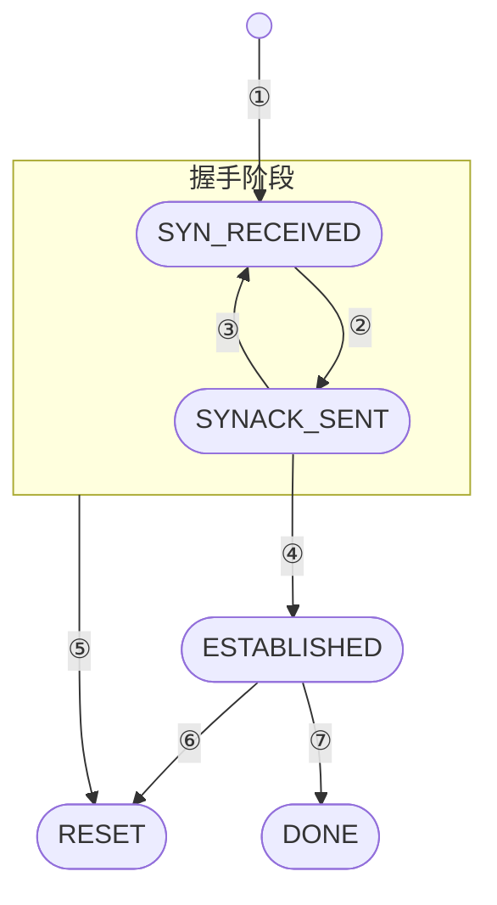
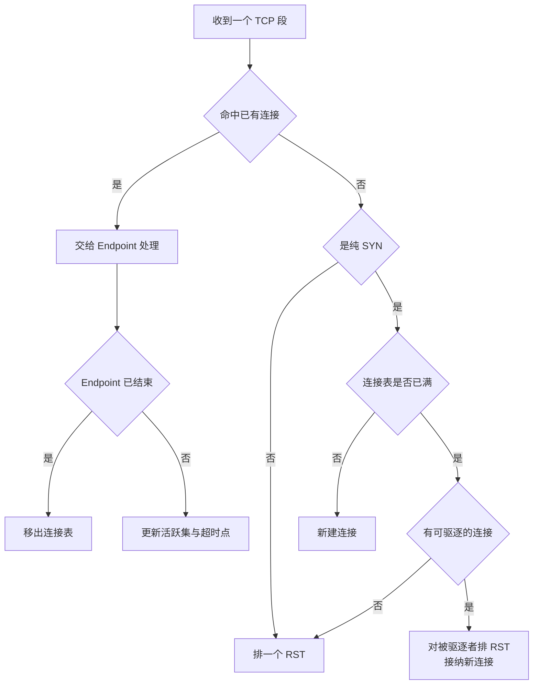

# 31 · dumbo：内建 TCP/IP 栈

> guest 想用 `curl` 取一份元数据，就得有人在另一端说 TCP 和 HTTP。这个「另一端」不能是宿主的网络栈 ——
> 那要给 guest 开一条通往宿主网络的路。Firecracker 的答案是在 VMM 进程里放一个只够用的协议栈：
> 它只接受被动打开，不做拥塞控制，每条连接的接收缓冲是 2500 字节。本篇讲它怎么工作，以及它明确不做什么。
>
> **读者**：系统工程师。
> **预备**：[第 30 篇 · virtio-net](30-virtio-net.md)。
> **代码**：`src/vmm/src/dumbo/pdu/`（`bytes.rs`、`ethernet.rs`、`arp.rs`、`ipv4.rs`、`tcp.rs`、`udp.rs`）、
> `src/vmm/src/dumbo/tcp/`（`connection.rs`、`endpoint.rs`、`handler.rs`）、`src/vmm/src/mmds/ns.rs`

---

## 0. 本篇要回答的问题

1. 为什么 MMDS 需要一个自己的协议栈，而不是复用宿主的？
2. 一段来自 guest 的字节怎么变成可安全访问的以太帧、IP 包与 TCP 段？
3. 这个 TCP 实现与教科书里的 TCP 差在哪里，每一处简化换来了什么？
4. HTTP 请求的边界是怎么在字节流里找到的，请求太大会发生什么？
5. 连接表满了、对端不回应、guest 发来乱序或畸形的段，各自的结局是什么？

---

## 1. 问题：一个不能接到外面去的 HTTP 服务

MMDS 要做的事很小：guest 用普通 HTTP 客户端访问一个 link-local 地址，拿回一段 JSON。
但实现它的约束很硬。这台 microVM 的网卡后端是一个 tap 设备，帧一旦写进 tap 就进了宿主的网络命名空间；
如果元数据服务监听在宿主上，就等于在 guest 与宿主控制面之间开了一条真实的网络通路，
而这条通路要靠宿主侧的防火墙规则去约束 —— 一个部署层的配置错误会直接变成隔离失效。

dumbo 把这条路整个取消：目的地址是 MMDS 的帧在 virtio-net 设备的发送路径上就被截下来，
根本不写进 tap（拦截点见[第 30 篇 §2.1](30-virtio-net.md#21-mmds-的拦截点)）。代价是 Firecracker 进程里必须自带
ARP、IPv4、TCP 与 HTTP 的最小实现，并且这些代码直接面对不可信的 guest 输入。
上游把这个取舍写在模块文档里：正因为 dumbo 处理的流量永远不会离开这台 microVM，
它才可以做出下面这一系列简化。

整个模块分三层：`pdu/` 负责把字节切片解释成协议数据单元，`tcp/connection.rs` 与
`tcp/endpoint.rs` 负责单条连接，`tcp/handler.rs` 负责多条连接的调度。
`mmds/ns.rs` 的 `MmdsNetworkStack` 把这三层与 MMDS 的数据存储接起来。

## 2. 把字节切片当成协议数据单元

`pdu/bytes.rs` 开头的一段注释解释了一个基本选择：不把字节切片转换成 `repr(C)` 结构体指针，
而是按偏移量逐字段读写。理由是前者需要 unsafe，且在 Rust 里解引用未对齐的引用属于未定义行为，
而网络帧里的字段本来就不保证对齐。于是 `NetworkBytes` trait 提供
`ntohs_unchecked(offset)` / `ntohl_unchecked(offset)` 这样的方法，
每个 PDU 类型（`EthernetFrame`、`IPv4Packet`、`TcpSegment`…）都是对一段切片的薄包装，
字段访问器内部就是一次带偏移的读。

方法名里的 `unchecked` 是提醒：它们不检查越界，越界就 panic。所以边界检查集中在一个地方 ——
每个 PDU 的 `from_bytes()`。以 `pdu/ipv4.rs` 为例，它依次要求：切片不短于固定头部、
版本号是 4、`total_len` 不小于头部长度、`total_len` 恰好等于切片长度、头部长度不小于固定部分；
可选地再验校验和。TCP 段的 `from_bytes()` 检查数据偏移字段落在合法区间内。
ARP 请求的 `request_from_bytes()` 更严：长度必须精确等于以太 / IPv4 ARP 帧的长度，
硬件类型、协议类型、两个长度字段与操作码都必须是预期值。

构造方向用 `Incomplete<T>` 表达一个未完成的 PDU。原因是校验和与长度字段只有在载荷写完之后才能算出来，
所以写入分两步：先 `write_incomplete_*` 写头部，填上载荷，再 `finalize()` 或
`with_payload_len_unchecked()` 补齐长度与校验和，同时把切片收缩到实际长度。
TCP 与 UDP 共用一个 `compute_checksum()`（`pdu/mod.rs`），因为两者的伪首部算法相同。

`is_mmds_frame()` 的判定走的是另一条更快的路：`pdu/arp.rs` 的 `test_speculative_tpa()`
与 `pdu/ipv4.rs` 的 `test_speculative_dst_addr()` 只检查切片长度够不够，
然后直接读出目标地址字段与 MMDS 地址比较，完全跳过合法性校验。
这是数据面上的取舍：每一帧都要过这个判断，而绝大多数帧不是发给 MMDS 的，
所以先用一次比较把它们排除掉，真正命中的帧再走完整解析。

`pdu/` 里还有一个 `udp.rs`。v1.12.1 的分流逻辑只把 TCP 包交给处理器，
非 TCP 的 IPv4 包计一次 `rx_accepted_unusual` 后丢弃，所以这个模块在运行时没有调用方。

## 3. 一条被动打开的 TCP 连接

`tcp/connection.rs` 的 `Connection` 是整个模块里最需要讲清楚的部分。它的第一个设计决定写在类型定义上：
连接状态不是一个枚举状态机，而是一组 `ConnStatusFlags` 位（`SYN_RECEIVED`、`SYNACK_SENT`、
`ESTABLISHED`、`FIN_SENT`、`FIN_ACKED`、`RESET`），另有几项状态分散在
`fin_received`、`send_fin`、`send_rst` 这些字段里。位标志的写法让「已发过 FIN 且已被确认」
这类组合不需要为每种组合造一个状态名。

尽管如此，它的主干仍然是一个小状态机。

| 编号 | 触发 | 动作 |
|---|---|---|
| ① | 收到一个纯 `SYN`，载荷为零 | `passive_open()` 取随机初始序号，记下对端窗口与 MSS |
| ② | 拿到一次发送机会 | 写出 `SYNACK`，置 `SYNACK_SENT`，起 RTO 计时 |
| ③ | 收到与原 `SYN` 完全一致的重传 | 清 `SYNACK_SENT`，下次发送机会重发 `SYNACK` |
| ④ | 收到合法 `ACK` | 置 `ESTABLISHED` |
| ⑤ | 任何非法段，或 RTO 连续 15 次 | 排一个 `RST` 并在发出后置 `RESET` |
| ⑥ | 收到窗口内的 `RST`，或收到 `SYN` | 同上 |
| ⑦ | 双向 `FIN` 都已完成 | `is_done()` 为真，由上层移除 |

几处简化值得单独说。

**只支持被动打开。** `Connection` 只能由 `passive_open()` 从一个 `SYN` 创建，没有 `connect` 一侧的逻辑。
这直接砍掉了一半的状态迁移。代价是这个栈只能做服务端，作为通用 TCP 库不可用 ——
模块注释也确实把「理想情况下应当拆成通用部分与 Firecracker 专用部分」列为未竟事项。

**不重组乱序。** 收到的数据段序号必须恰好等于 `ack_to_send`，否则只排一个 ACK 然后丢弃，
并记 `UNEXPECTED_SEQ`。连接没有重组队列。这在「两端都在同一个进程的内存里，中间没有网络」
的前提下是合理的：丢包与乱序几乎只能来自 guest 自己的行为。

**收到第一个重复 ACK 就重传。** 常规 TCP 要等三个重复 ACK 才快速重传，因为要区分重排与丢包。
dumbo 假设不会重排，所以 `dup_ack` 一置位就在下次发送机会重传 `highest_ack_received` 处的数据。

**没有拥塞控制，也没有窗口缩放。** 发送侧只受对端通告窗口 `remote_rwnd_edge` 约束。
`MAX_WINDOW_SIZE` 这个常量只用于序号比较（`seq_after()` / `seq_at_or_after()`
都是相对这个上限判断先后），不是一个实际窗口。

**时间是 CPU 周期。** RTO 用 `timestamp_cycles()` 取的周期计数，常量取的是保守值：
重传周期 1.2e9 个周期、连续 15 次触发即复位、空闲 4e10 个周期后连接可被驱逐。
代码注释按 4 GHz 换算，分别约 300 ms 与 10 s。这意味着实际超时随宿主主频浮动，
是一处以简单换精确的取舍。

**没有 TIME_WAIT。** `is_done()` 在收到对端 `FIN` 且自己也发过 `FIN` 时就为真，
不等自己的 `FIN` 被确认。代码注释指出了后果：对端针对这个 `FIN` 的 `ACK` 到达时连接已被移除，
通常换来一个多余的 `RST`；极端情况下如果同一个四元组恰好被新连接复用，这个 `ACK` 还可能被误认为合法。

**发出 `RST` 即终结。** 连接一旦决定复位，就停止一切收发，等一次发送机会把 `RST` 写出去然后作废。
没有「复位后继续服务」的路径。

## 4. `Endpoint`：从字节流里切出一次 HTTP 请求

`Connection` 本身不带缓冲区：收数据要调用方给一个 `&mut [u8]`，发数据要调用方给出载荷来源与它的起始序号。
`tcp/endpoint.rs` 的 `Endpoint` 补上这两块，并把 HTTP 接进来。

接收缓冲是一个固定大小的数组，长度 `RCV_BUF_MAX_SIZE` = 2500 字节，
连接的本地接收窗口就设成这个值 —— 窗口与缓冲同尺寸，因此对端不可能合法地写越界。
每次收到数据后，`receive_segment()` 在缓冲里从头扫描，找一个双换行（`\n\n` 或 `\n\r\n`）作为请求结束的标志。
找到就把这一段交给 `parse_request_bytes()`，由 `micro_http` 解析成 `Request`，
再调用上层传进来的闭包（对 MMDS 来说就是查数据存储并生成响应），
把响应序列化进 `response_buf`，然后把缓冲里剩下的字节前移，并用 `advance_local_rwnd_edge()`
把接收窗口右边界推回去，让对端可以继续发。

如果缓冲填满了仍然没找到双换行，说明这个请求超过了 2500 字节：连接直接 `reset()`，
并置 `stop_receiving` 不再处理任何入段。这是一条硬内存上界，换来的是每条连接的内存占用可预测；
代价是 URI 或请求头过长的合法请求会被复位，而不是收到一个 414 之类的响应。

发送方向靠两个序号跟踪响应：`initial_response_seq` 是 `response_buf` 第一个字节的序号，
`response_seq` 是下一个要发的字节的序号。`write_next_segment()` 按这两个值从
`response_buf` 里切出一段交给 `Connection`。当对端确认的序号走到「初始序号 + 响应长度」时，
说明整份响应已被收下，`response_buf` 清空，连接回到等待下一个请求的状态。
`Endpoint` 因此天然是串行的：一次只处理一个请求，没有 HTTP 流水线。

对端发来 `FIN` 且响应已发完时，`Endpoint` 调 `Connection::close()` 关掉自己这一半。

## 5. `TcpIPv4Handler`：多条连接的调度

MMDS 的 IP 与端口是固定的，所以 `tcp/handler.rs` 用二元组（对端地址、对端端口）而不是四元组作为连接键。
处理器持有一张 `HashMap` 连接表、一个「现在就能发东西」的活跃集、一个最近的超时点，
以及一个待发 `RST` 队列。上限由 `mmds/ns.rs` 给出：最多 30 条并发连接，`RST` 队列最多 100 项。

`receive_packet()` 的分流是这样的：

两处细节。**收到不属于任何连接的非 `SYN` 段时排一个 `RST`**，但接收到的段本身是 `RST` 时不排 ——
否则两端会互相回 `RST` 回不完。**驱逐的判据是空闲时长**：`is_evictable()` 比较当前周期计数
与最后一次收到段的时刻，超过阈值才算可驱逐；找不到可驱逐的连接就直接丢掉这个新连接并回一个 `RST`。
`RST` 队列满了则连 `RST` 也不发，静默放弃。这是一条明确的降级路径：资源耗尽时优先保住已有连接。

发送方向由 `write_next_packet()` 每次写一个 IP 包，优先级固定：先清 `RST` 队列，
再遍历活跃集与那个最近超时的连接，找到第一个能写出段的就返回。
`next_segment_status()` 给上层一个三态答复 —— 立刻有得发、要等到某个时刻、没有可发的；
`MmdsNetworkStack::write_next_frame()` 据此决定要不要为这次 RX 机会生成一个回包。
上层每次只拿到一个帧，是因为调用方（virtio-net 的接收路径）每次只有一个可写的 guest 缓冲区。
这条「先 `RST` 队列、再活跃集、一次一帧」的发送优先级，在
[第 32 篇 §4](32-mmds.md#4-一次请求走过的路) 里是从请求往返的角度看同一件事。

连接表、活跃集与超时点三者必须同步维护，`check_next_segment_status()` 与 `find_next_timeout()`
这两个辅助函数就是为此存在：任何一次收发之后，若被改动的连接正是那个「最近超时」的连接，
就要重新扫一遍全表找出新的最近超时点。表最多 30 项，这个全表扫描的代价是可接受的。

## 6. 不做什么

把简化清单集中列出来，比散在正文里更有用。dumbo **不**做：主动打开、乱序重组、选择性确认、
窗口缩放、拥塞控制、IP 选项、IP 分片重组、路径 MTU 发现、`TIME_WAIT`、HTTP 流水线、HTTPS。
它也不验证入向 IP 与 TCP 的校验和：`mmds/ns.rs` 的 `detour_ipv4()` 以 `false` 调用
`IPv4Packet::from_bytes()`，`TcpIPv4Handler::receive_packet()` 以 `None` 调用
`TcpSegment::from_bytes()`。两处的注释给出同一个理由：设备模型可能把校验和计算卸载给了别的实体，
此时帧里的校验和字段本来就不是有效值。后果是一个被改坏的帧不会在这一层被发现，
只能靠上层的长度与序号检查挡住。

安全上的依靠有三条。第一，所有解析都在 `from_bytes()` 里做完边界检查，
之后的字段访问才使用不检查的读方法。第二，资源有明确上界：30 条连接、每条 2500 字节接收缓冲、
100 项 `RST` 队列，都是常量，guest 无法通过发起大量连接让内存无界增长。
第三，`pdu/ethernet.rs` 里有一组 Kani 证明（`#[cfg(kani)]` 的 `kani_proofs` 模块），
对以太帧的构造与访问做形式化验证，验证方法见[第 45 篇](45-gdb-tracing-and-kani.md)。

还有一条不在代码里但要知道：快照不保存任何 TCP 连接状态。恢复出来的 microVM 里，
快照之前建立的 MMDS 连接全部消失，guest 侧再发段只会收到 `RST`。
保存了什么、没保存什么见[第 32 篇 §6](32-mmds.md#6-快照里保存了什么)。

## 7. 小结

- dumbo 的存在是为了让元数据流量不离开 VMM 进程。收益是隔离由代码结构保证而不是由宿主网络配置保证，代价是要在 VMM 里维护一份直接面对不可信输入的协议栈实现。
- PDU 是对字节切片的薄包装，按偏移读写而不是强转结构体指针，以避免 unsafe 与未对齐访问；边界检查集中在每个类型的 `from_bytes()`，之后的字段读取一律不检查。
- 构造方向用 `Incomplete<T>` 分两步完成，因为长度与校验和依赖载荷。
- 帧的归属判定走 `test_speculative_*` 的快速路径：只比对一个地址字段，跳过合法性校验，因为这个判断在每一帧上都要做。
- `Connection` 用位标志而非枚举表示状态，只支持被动打开，不重组乱序，收到第一个重复 ACK 就重传，没有拥塞控制与 `TIME_WAIT`。每一条简化都建立在「流量不出进程」这个前提上。
- 超时以 CPU 周期为单位，阈值是按 4 GHz 估算的常量，因此实际时长随宿主主频浮动。
- `Endpoint` 用 2500 字节的固定缓冲承接请求，靠扫描双换行切出边界；请求超过缓冲就复位连接。接收窗口与缓冲同尺寸，这是「对端不可能合法写越界」的依据。
- 一条连接一次只处理一个请求，响应发完才接着读下一个。
- `TcpIPv4Handler` 以对端二元组为键，上限 30 条连接与 100 项 `RST` 队列；表满时按空闲时长驱逐，驱逐不了就拒绝新连接。资源耗尽时的选择是保住已有连接。
- 入向 IP 与 TCP 校验和都不验证，理由是设备模型可能做了校验和卸载；被改坏的帧只能靠上层的长度与序号检查拦住。

## 延伸阅读 / 下一篇

- [第 32 篇 · MMDS：元数据服务与 token](32-mmds.md)：帧的拦截点、请求路由与 token 机制。
- [第 30 篇 · virtio-net](30-virtio-net.md)：这些帧从哪来、回包怎么投递给 guest。
- [第 45 篇 · GDB 调试、tracing 与形式化验证](45-gdb-tracing-and-kani.md)：`pdu/ethernet.rs` 里那组 Kani 证明。
- 上游文档 `docs/mmds/mmds-design.md` 的 Dumbo 一节给出了这些简化的设计意图，可与本篇对照阅读。
