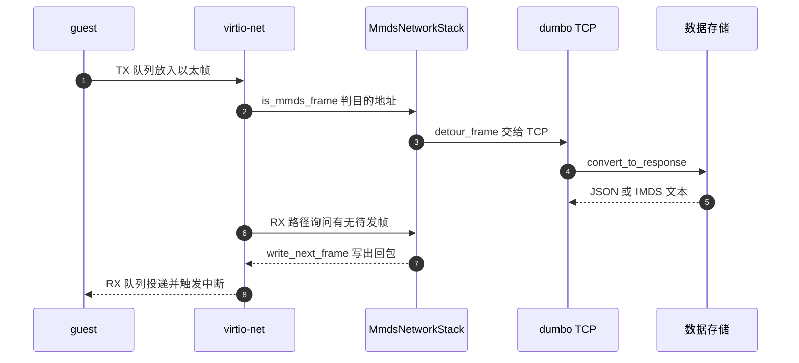
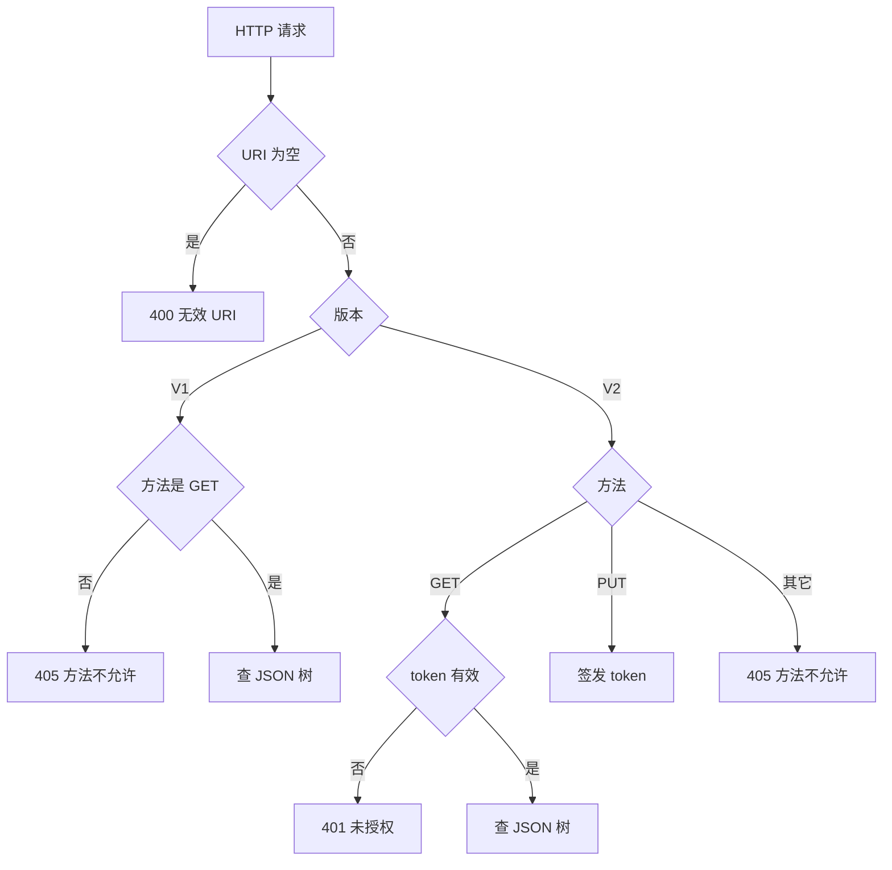

# 32 · MMDS：元数据服务与 token

> 一台 microVM 启动后要知道「我是谁」：沙箱 ID、日志收集端点、访问凭据的散列。这些数据不能写进模板镜像，
> 因为每台实例都不一样；也不方便走真实网络，因为那要给 guest 一条通往控制面的路。
> MMDS 的答案是在 VMM 进程里放一棵 JSON 树，让 guest 用普通的 HTTP 客户端去取。
>
> **读者**：系统工程师、平台工程师。
> **预备**：[第 30 篇 · virtio-net](30-virtio-net.md)、[第 31 篇 · dumbo](31-dumbo-tcpip-stack.md)。
> **代码**：`src/vmm/src/mmds/`（`mod.rs`、`data_store.rs`、`ns.rs`、`token.rs`、`token_headers.rs`、`persist.rs`）、
> `src/vmm/src/vmm_config/mmds.rs`、`src/vmm/src/resources.rs`、`src/firecracker/src/api_server/request/mmds.rs`

---

## 0. 本篇要回答的问题

1. 元数据服务（MMDS，microVM metadata service）解决的是什么问题，为什么不用真实网络或镜像里的配置文件？
2. 数据存储是什么结构，`PUT` 与 `PATCH` 的语义差别在哪里，大小限制怎么生效？
3. guest 发出的一个 HTTP 请求，经过哪些部件才变成一次 JSON 树查询？
4. V2 的 token 是怎么造出来的，为什么它不需要服务端保存任何表？V2 防的是什么？
5. 快照里保存了 MMDS 的哪些部分，哪些部分没有保存，调用方要为此做什么？

---

## 1. 问题：把一份只属于这台实例的数据交给 guest

把配置烘进 rootfs 模板不行：模板是共享的、只读的，而每台实例的 ID、端点、凭据都不同。
从宿主机挂一个配置盘也不划算：那要给每台实例准备一个额外的块设备，还要 guest 里有挂载逻辑。
让 guest 去连控制面的 HTTP 服务同样不合适：那等于给不可信的 guest 开一条通往控制面的网络路径，
还要在控制面上做一套认证。

MMDS 走的是第四条路：数据留在 VMM 进程的内存里，guest 通过**已有的那块虚拟网卡**去取，
但这些帧根本不会离开 Firecracker 进程 —— virtio-net 设备在发送路径上把目标地址是 MMDS 的帧截下来，
交给进程内的一个极小 TCP/IP 栈（dumbo，见[第 31 篇](31-dumbo-tcpip-stack.md)），
由它把 HTTP 请求交给 MMDS，再把响应沿原路注回接收队列。

这个选择的收益是 guest 侧零成本：任何能发 HTTP 的工具都能用，语义与云厂商的实例元数据服务一致，
现成的客户端库可以直接跑。代价有三条：Firecracker 必须自带一个 TCP/IP 实现，
从而要直接解析不可信 guest 送来的以太网帧；MMDS 的地址占用了 guest 的一个 link-local 地址；
以及这条路径上的每一跳都在 vCPU 触发的设备线程里同步执行。

---

## 2. 数据存储：一棵没有 schema 的 JSON 树

`src/vmm/src/mmds/data_store.rs` 的 `Mmds` 只有四个字段：一个 `serde_json::Value` 作为整棵树、
一个可选的 `TokenAuthority`、一个 `is_initialized` 标志、一个字节数上限 `data_store_limit`。
没有 schema，没有类型约束 —— 调用方放什么进去，guest 就能读到什么。

### 2.1 写：`put_data()` 与 `patch_data()`

控制面有两个写入口。`PUT /mmds` 走 `Mmds::put_data()`：序列化后与上限比较，超了返回
`DataStoreLimitExceeded`，没超就整棵树替换并置 `is_initialized`。它是覆盖语义，不做合并。

`PATCH /mmds` 走 `Mmds::patch_data()`：先要求 `is_initialized`（否则返回 `NotInitialized`），
再把整棵树 clone 一份，在副本上执行 `mod.rs` 的 `json_patch()`，检查副本大小，通过了才换上去。
`json_patch()` 实现的是 JSON Merge Patch（RFC 7396）：patch 里的对象逐键递归合并，
**值为 `null` 的键表示删除**，非对象的值整体替换目标。

先 clone 再检查的写法保证了「超限的 PATCH 不会留下半成品」这一原子性，
代价是一次 PATCH 的峰值内存是数据的两倍。数据本身受上限约束，所以这个代价有界。

上限默认 51200 字节，即 `src/vmm/src/lib.rs` 的 `HTTP_MAX_PAYLOAD_SIZE`；
命令行 `--mmds-size-limit` 可以单独调大，`src/firecracker/src/main.rs` 解析后传给 `VmResources`。
把它与 API 请求体上限分开，是为了让「元数据可以很大」与「控制面请求体要小」两件事互不牵制。

### 2.2 读：路径即 JSON 指针

`Mmds::get_value()` 把 URI 当作 JSON 指针（`serde_json` 的 `Value::pointer()`）用。
调用它之前，`mod.rs` 的 `sanitize_uri()` 反复把 `//` 折叠成 `/` 直到长度不再变化；
`get_value()` 自己再去掉结尾的 `/`。指针不命中就是 `NotFound`。

输出格式由请求的 `Accept` 头决定：`MediaType::ApplicationJson` 对应 `OutputFormat::Json`，
直接 `to_string()` 输出子树；`MediaType::PlainText` 对应 `OutputFormat::Imds`，
走 `Mmds::format_imds()` —— 对象输出每个键名一行，键对应的值还是对象时键名后面补一个 `/`；
字符串输出其内容本身。数字、布尔、数组这些既不是对象也不是字符串的叶子，
`format_imds()` 返回 `UnsupportedValueType`，HTTP 上表现为 501。

这套「目录像目录、叶子像文件」的文本格式是为了兼容云实例元数据服务的惯用法：
guest 里的脚本可以用 `curl` 一层层往下走。想拿结构化数据的客户端改用 `Accept: application/json` 即可。

状态码的对应关系集中在 `mod.rs` 的 `respond_to_get_request_unchecked()`：

| 数据层错误 | HTTP 状态码 | 触发条件 |
|---|---|---|
| `NotFound` | 404 | JSON 指针不命中 |
| `UnsupportedValueType` | 501 | 叶子不是对象也不是字符串，且要 IMDS 格式 |
| `DataStoreLimitExceeded` | 413 | 写入后超过 `data_store_limit` |
| 无（URI 为空） | 400 | `convert_to_response()` 的前置检查 |

---

## 3. 配置：把 MMDS 绑到哪块网卡上

MMDS 的数据存储是无条件存在的（`VmResources::mmds_or_default()` 按需创建），
但 guest 能不能访问它，取决于有没有网卡被绑定。绑定由 `PUT /mmds/config` 完成，
请求体是 `src/vmm/src/vmm_config/mmds.rs` 的 `MmdsConfig`：

```json
{
  "version": "V2",
  "network_interfaces": ["eth0"],
  "ipv4_address": "169.254.169.254"
}
```

`VmResources::set_mmds_config()` 做两件事，顺序是先绑网卡再设版本。
绑网卡在 `set_mmds_network_stack_config()` 里，三道检查：

1. `ipv4_address` 若给了，必须通过 `src/vmm/src/utils/net/ipv4addr.rs` 的 `is_link_local_valid()` ——
   限定在 169.254.0.0/16 内，且排除 169.254.0.0/24 与 169.254.255.0/24 这两个保留段；不给则用默认的 169.254.169.254。
2. `network_interfaces` 不能为空（`EmptyNetworkIfaceList`）。
3. 列表里的每个 ID 都要对应一块已配置的网卡（`InvalidNetworkInterfaceId`）。

通过之后，遍历所有网卡：在列表里的调 `Net::configure_mmds_network_stack()` 装上 `MmdsNetworkStack`，
不在列表里的调 `disable_mmds_network_stack()` 把它摘掉。这意味着**每次 `PUT /mmds/config` 都是全量覆盖**，
不是增量添加 —— 上一次绑过的网卡若不在这一次的列表里，会被解绑。

设版本在 `set_mmds_version()` 里：`Mmds::set_version()` 对 V1 把 `token_authority` 置 `None`，
对 V2 在其为 `None` 时创建一个新的；随后 `set_aad()` 把实例 ID 写进 token 的附加认证数据。
版本字段就是 `token_authority` 的有无：`Mmds::version()` 直接据此返回 V1 或 V2。

API 层还做了一件事：`src/firecracker/src/api_server/request/mmds.rs` 的 `parse_put_mmds_config()`
在版本为 V1 时给响应挂上弃用提示，并记一次 `deprecated_api` 指标。V1 仍然可用，但上游已经不推荐。

`MmdsNetworkStack` 自己的默认值在 `src/vmm/src/mmds/ns.rs`：MAC 地址 `06:01:23:45:67:01`、
TCP 端口 80、最多 30 条并发连接、最多 100 个待发 RST。这些都是编译期常量，不能通过 API 调整。

---

## 4. 一次请求走过的路

下面这张时序图描述 guest 里一次 `GET` 的完整往返。缩写：`G` 为 guest 用户态、`NET` 为 virtio-net 设备、
`NS` 为 `MmdsNetworkStack`、`TCP` 为 dumbo 的 TCP 处理器、`DS` 为数据存储。



拦截点在发送方向。`src/vmm/src/devices/virtio/net/device.rs` 的 `write_to_mmds_or_tap()`
先用 `MmdsNetworkStack::is_mmds_frame()` 看帧头：ARP 帧比对目标协议地址，IPv4 帧比对目的 IP，
两者都不是就落到 tap。命中了就调 `detour_frame()`，这一帧不写 tap。

`detour_frame()` 按以太类型分两路（`ns.rs`）。ARP 请求走 `detour_arp()`：
记下请求方的 MAC 与 IP，置 `pending_arp_reply_dest`，回包留到下一次发送机会。
IPv4 走 `detour_ipv4()`：解析 IP 包时**跳过校验和验证**（代码注释说明这是为了兼容把校验和卸载给别的实体的设备模型），
协议是 TCP 就交给 `TcpIPv4Handler::receive_packet()`，并传一个闭包 —— 闭包里调用
`mod.rs` 的 `convert_to_response()`，把完整的 HTTP 请求变成 HTTP 响应。非 TCP 的 IPv4 包计一次
`rx_accepted_unusual` 后丢弃。

回注在接收方向。`Net::read_from_mmds_or_tap()` 先问 `MmdsNetworkStack::write_next_frame()`：
有待发的 ARP 回复或 TCP 段就写进 RX 缓冲，没有才去读 tap。每次只拿一个帧，
而底下按「先清 `RST` 队列、再遍历活跃连接」的固定优先级挑出这一帧
（[第 31 篇 §5](31-dumbo-tcpip-stack.md#5-tcpipv4handler多条连接的调度)）。
`process_rx_for_mmds` 这个标志处理的是一种边界情况：TX 处理时若某帧被 MMDS 吃掉且 RX 缓冲里还没有数据，
就在 TX 处理结束后主动跑一次 RX，把回包尽快投出去，不必等 tap 那边有动静。

`convert_to_response()` 是整个服务的分发中心。它先拿数据存储的锁，读出版本，然后按版本分流：



V1 只接受 GET，其它方法返回 405 并在 `Allow` 头里写明只允许 GET。
V2 接受 GET 与 PUT：GET 必须带有效 token，PUT 只能指向 `/latest/api/token`，指向别处返回 404。
V2 的 PUT 还多一道检查：请求头里出现 `X-Forwarded-For`（`token_headers.rs` 的 `REJECTED_HEADER`）一律拒绝，返回 400。

---

## 5. V2 与 token：一个不需要状态表的凭据

V1 的模型是「能到达这个地址就能读」。问题出在 guest 里的应用可能被诱导去发一个它本不想发的请求 ——
典型的是服务端请求伪造：一个接受 URL 参数的服务被喂进 `http://169.254.169.254/...`，
于是把元数据当作普通网页内容回显给攻击者。这类攻击的关键是攻击者只能控制 URL，
控制不了请求方法与请求头。

V2 因此要求两步：先用 `PUT /latest/api/token` 拿 token，再在 `GET` 时用
`X-metadata-token` 头带上它。一次简单的 URL 注入满足不了这两条中的任何一条。

### 5.1 token 的构造

`src/vmm/src/mmds/token.rs` 的 `TokenAuthority` 在创建时打开 `/dev/urandom`，
读 32 字节作为 AES-256-GCM 的密钥（`create_cipher()`）。签发一个 token（`generate_token_secret()`）时：

1. `check_encryption_count()`：同一把密钥下签发的 token 数逼近 2^32 时换一把新密钥，
   并记一条 warn 日志。换密钥会让此前所有 token 立即失效，代码注释里把这当作可接受的结果 ——
   正常使用到不了这个量级，客户端本来就该有重试与重新取 token 的逻辑。
2. `create_token()`：校验 TTL 落在 `MIN_TOKEN_TTL_SECONDS`（1 秒）到 `MAX_TOKEN_TTL_SECONDS`（21600 秒，即 6 小时）之间；
   从 `/dev/urandom` 再读 12 字节作为 nonce；用 `get_time_ms(ClockType::Monotonic)` 加上 TTL 算出到期时刻。
3. `encrypt_expiry()`：以 nonce 为 IV、以 `aad`（格式为 `microvmid={instance_id}`）为附加认证数据，
   把 8 字节的到期时刻原地加密，得到 8 字节密文与 16 字节认证标签。
4. `Token { iv, payload, tag }` 用 bincode 定长编码后 base64 编码，作为响应体返回，内容类型是纯文本。

验证走 `is_valid()`：先看长度是否超过 `TOKEN_LENGTH_LIMIT`（70 字符，避免为超长输入做无谓的解密），
base64 解码、bincode 反序列化（带 `DESERIALIZATION_BYTES_LIMIT` 限制，防止在反序列化时分配过多内存），
解密出到期时刻，与当前单调时钟比较。

这套设计的核心是**服务端不保存任何已签发 token 的记录**。有效性完全编码在 token 自身里，
密钥是唯一的服务端状态。收益是 O(1) 的验证、零内存增长、不会因为 guest 疯狂签发而撑爆 VMM。
代价是无法吊销单个 token：一个 token 在到期前始终有效，想让它失效只能换密钥，而换密钥会连坐所有 token。
对一个生命周期以小时计、且只有本机 guest 能访问的服务来说，这是合理的取舍。

AAD 里放实例 ID 的作用是绑定：一台 microVM 签出的 token 拿到另一台去，解密会因为附加认证数据不匹配而失败。

### 5.2 V1 与 V2 的对照

| 维度 | V1 | V2 |
|---|---|---|
| 允许的方法 | 仅 GET | GET 与 PUT |
| 凭据 | 无 | `X-metadata-token` 头 |
| 签发 | 不适用 | `PUT /latest/api/token` 加 `X-metadata-token-ttl-seconds` 头 |
| 服务端状态 | 无 | 一把 AES-256-GCM 密钥与签发计数 |
| 拒绝的请求头 | 无 | PUT 带 `X-Forwarded-For` 时拒绝 |
| API 层提示 | 标记为弃用 | 推荐 |

`token_headers.rs` 的 `TokenHeaders::try_from()` 把请求头名统一转小写后再查找，
所以 guest 侧大小写怎么写都行；`X-metadata-token-ttl-seconds` 解析不成 `u32` 时直接返回头部错误，
在 HTTP 上是 400。

---

## 6. 快照里保存了什么

MMDS 的持久化被切成了两半，这一点在使用上有直接后果。

保存的部分：`src/vmm/src/mmds/persist.rs` 的 `MmdsNetworkStackState` 只有三个字段 ——
MAC 地址、IPv4 地址、TCP 端口。它挂在网卡状态里（`src/vmm/src/devices/virtio/net/persist.rs` 的
`NetState::mmds_ns`）。另外 `src/vmm/src/device_manager/persist.rs` 的 `DeviceStates` 有一个
`mmds_version` 字段：保存时从任意一块带 `mmds_ns` 的网卡上取出版本写入，恢复时调
`VmResources::set_mmds_version()` 复原。

没有保存的部分：**JSON 数据树本身**。`MmdsNetworkStackState` 里没有它，`MicrovmState` 里也没有。
恢复时 `MmdsNetworkStack::restore()` 拿到的是 `VmResources` 新建的一个空数据存储。

于是从快照恢复的实例，MMDS 是「结构在、内容空」：地址与版本对，`GET` 任何路径都是 404，
直到调用方重新写入。这个取舍是合理的 —— 元数据的内容恰恰是每台实例各不相同的那部分，
把它连同快照一起保存反而会让所有从同一份快照克隆出来的实例拿到同一份陈旧元数据。

还有一个连带后果：V2 的 `TokenAuthority` 是恢复时新建的，密钥是新从 `/dev/urandom` 读的，
快照前签发的 token 在恢复后全部失效。guest 里长期持有 token 的进程要能处理 401 并重新取 token。
另外到期时刻用的是单调时钟，而单调时钟在恢复后不与快照前连续，这使得旧 token 的到期判断也失去意义（推论）。

e2b 的调用方正是按这个模型工作的：它在配置网卡时把 MMDS 绑上去并固定用 V2，
而元数据的写入发生在加载快照并 resume 之后，内容是沙箱 ID、模板 ID、日志收集端点与访问令牌散列 ——
guest 内的 agent 从 MMDS 读到它们才知道自己服务于哪个沙箱。

---

## 7. 可观测

`src/vmm/src/logger/metrics.rs` 的 `MmdsMetrics` 有 11 个计数器，分三类。
分流相关：`rx_accepted`（被截走的帧数）、`rx_bad_eth`（解析不出以太帧）、
`rx_accepted_unusual`（发往 MMDS 地址但不是 TCP 的 IPv4 包）、`rx_accepted_err`。
发送相关：`tx_count`、`tx_frames`、`tx_bytes`、`tx_errors`。
连接相关：`connections_created`、`connections_destroyed`，在 `detour_ipv4()` 里按
dumbo 返回的 `RecvEvent` 递增 —— 注意 `NewConnectionReplacing` 会同时让两个计数器各加一，
因为它表示连接表满了、一条旧连接被顶掉。`rx_accepted_unusual` 持续增长通常意味着 guest 里有东西
在朝 MMDS 地址发 UDP 或 ICMP，值得排查。指标体系本身见[第 44 篇](44-logging-and-metrics.md)。

---

## 8. 小结

- MMDS 把每台实例专属的数据放在 VMM 进程内存里，用 guest 已有的网卡作为通道，帧不出进程。
  收益是 guest 侧零成本，代价是 Firecracker 要自带 TCP/IP 栈并解析不可信输入。
- 数据存储是一棵无 schema 的 JSON 树。`PUT` 覆盖，`PATCH` 按 RFC 7396 合并且 `null` 表示删除键；
  两者都在写入前检查序列化后的字节数，默认上限 51200，`--mmds-size-limit` 可调。
- 读取把 URI 当 JSON 指针，输出格式由 `Accept` 头选择；IMDS 文本格式只支持对象与字符串，
  其它叶子类型返回 501。
- `PUT /mmds/config` 是全量绑定：列表外的网卡会被解绑；IP 必须是 169.254.0.0/16 内的合法 link-local 地址。
  版本字段的实体就是 `token_authority` 的有无。
- V2 的 token 是一段用 AES-256-GCM 加密的到期时刻，服务端不保存任何 token 记录，
  实例 ID 作为附加认证数据把 token 绑在这台 microVM 上。代价是无法吊销单个 token。
- 快照保存网络栈参数与 MMDS 版本，**不保存数据树**。恢复后必须由调用方重新写入元数据，
  且此前签发的 token 全部失效。

## 延伸阅读 / 下一篇

- [第 31 篇 · dumbo：内建 TCP/IP 栈](31-dumbo-tcpip-stack.md)：本篇里 `TcpIPv4Handler` 那一跳的内部实现。
- [第 30 篇 · virtio-net](30-virtio-net.md)：`write_to_mmds_or_tap()` 与 `read_from_mmds_or_tap()` 所处的收发路径。
- [第 40 篇 · 设备状态的保存与恢复](40-device-persist.md)：`MmdsNetworkStackState` 与 `DeviceStates` 的全貌。
- 下一篇：[第 33 篇 · vsock](33-vsock.md)，另一条 guest 与宿主之间的通道，
  它不借用网卡，而是有自己的 virtio 设备与连接复用器。
- 上游文档 `docs/mmds/mmds-user-guide.md` 与 `docs/mmds/mmds-design.md` 可作为参考，以代码为准。
- [e2b 手册第 28 篇](../e2b-infra/28-firecracker-process-management.md) —— 调用方在什么时刻绑定 MMDS、写入哪些元数据。
