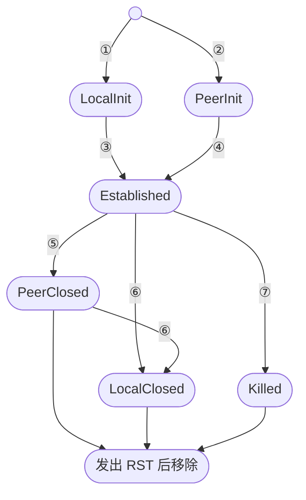
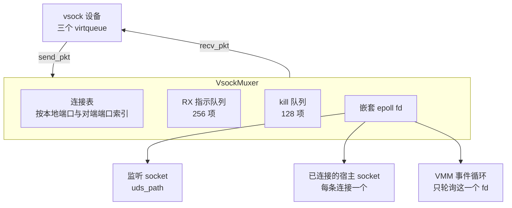

# 33 · vsock：设备、连接状态机与 unix muxer

> guest 与宿主之间常常需要一条控制通道：传命令、传日志、做健康探测。用网络做这件事要配地址、要防火墙、
> 要和用户自己的网络流量共存。vsock 给出另一条路 —— 一个不带路由、不带地址分配的点对点套接字族。
> Firecracker 在 VMM 进程里完整实现了它的设备侧，并把 guest 的每条 vsock 连接翻译成宿主上的一条 Unix socket。
>
> **读者**：系统工程师。
> **预备**：[第 25 篇 · virtio 设备模型](25-virtio-device-model-and-transport.md)、
> [第 26 篇 · virtqueue 实现](26-virtqueue-implementation.md)。
> **代码**：`src/vmm/src/devices/virtio/vsock/`（`mod.rs`、`device.rs`、`event_handler.rs`、`packet.rs`、
> `csm/`、`unix/`、`persist.rs`、`metrics.rs`）、`src/vmm/src/vmm_config/vsock.rs`

---

## 0. 本篇要回答的问题

1. vsock 提供的契约是什么？guest 与宿主各自看到什么，一个 Unix socket 路径怎么承载两个方向的连接？
2. 一条连接有哪些状态，状态之间因为什么迁移？为什么发送方向要缓冲而接收方向不用？
3. 流控是怎么做的？两端靠哪两个字段互相通报可用空间？
4. muxer 为什么要用一个嵌套的 epoll？RX 队列与 kill 队列为什么允许「失同步」？
5. 快照恢复后 guest 里的连接会怎样，设备为此做了什么？

---

## 1. 问题：一条不需要配置网络的通道

宿主要和 guest 里的 agent 说话，最直观的办法是给 guest 一个 IP，让 agent 监听一个端口。
这条路要付的代价是：宿主要为每台 microVM 准备网卡与地址、要配置转发规则、
要保证控制流量不被用户自己的网络配置影响 —— 而 guest 里的用户是有 root 权限的，
他可以改路由、改防火墙，甚至把网卡关掉。

vsock 换了一个模型：地址只有两个数字（CID 与端口），不做路由，只连本机的 hypervisor。
guest 侧是 `AF_VSOCK` 套接字，宿主侧在 Firecracker 里是 `AF_UNIX` 套接字。
这条通道不经过 guest 的网络栈配置，也不占用宿主的网络命名空间资源。

Linux 内核自带一个 vhost-vsock 后端，由内核完成转发。Firecracker 选择不用它，
在用户态实现整个设备模型（`src/vmm/src/devices/virtio/vsock/mod.rs` 的模块注释写明了这一点）。
收益是这条路径完全在 Firecracker 的 seccomp 与 jailer 边界内，不需要宿主内核加载额外模块，
也不需要给进程开放 `/dev/vhost-vsock`。代价是所有的包解析、连接管理与缓冲都要自己写，
并且数据在 guest 内存与宿主 socket 之间的搬运由 Firecracker 的事件循环线程承担。

---

## 2. 契约：CID、三个队列与一个包头

配置项在 `src/vmm/src/vmm_config/vsock.rs` 的 `VsockDeviceConfig`，只有三个字段：
`vsock_id`（只影响 API 表述）、`guest_cid`、`uds_path`。整个 microVM 只有一个 vsock 设备，
所以设备 ID 在 `mod.rs` 里被硬编码成常量 `VSOCK_DEV_ID`。

设备有三个 virtqueue，顺序固定（`device.rs` 的 `RXQ_INDEX`、`TXQ_INDEX`、`EVQ_INDEX`）：
RX（宿主到 guest）、TX（guest 到宿主）、event。协商的特性只有两个：
`VIRTIO_F_VERSION_1` 与 `VIRTIO_F_IN_ORDER`。

包的结构在 `packet.rs`：一个描述符链对应一个包，链头的描述符放 44 字节的定长包头，
可选的第二个描述符放数据。包头的字段是源 / 目的 CID 与端口、数据长度 `len`、
类型 `type`（只支持 `VSOCK_TYPE_STREAM`）、操作码 `op`、标志 `flags`，
以及流控用的 `buf_alloc` 与 `fwd_cnt`。操作码共七个：`REQUEST`、`RESPONSE`、`RST`、
`SHUTDOWN`、`RW`、`CREDIT_UPDATE`、`CREDIT_REQUEST`。

`VsockPacket` 不把数据复制到中间缓冲，而是用 `IoVecBuffer` 直接读写 guest 内存
（见[第 26 篇](26-virtqueue-implementation.md)）。单个包的数据上限是 `MAX_PKT_BUF_SIZE`，64 KiB。

### 2.1 宿主侧：一个路径，两个方向

`uds_path` 这一个路径要承载两个方向的连接，办法是路径的构成规则不同。

**guest 连宿主**：guest 里的程序连接 `(CID=2, port=P)`。muxer 收到 `VSOCK_OP_REQUEST` 后，
去连接宿主上的 `<uds_path>_
` 这个 Unix socket（`unix/muxer.rs` 的 `handle_peer_request_pkt()`
里的 `format!("{}_{}", self.host_sock_path, pkt.hdr.dst_port())`）。
宿主侧的服务要预先在这个带端口后缀的路径上监听。连不上就回一个 RST。

**宿主连 guest**：宿主程序连接 `uds_path` 本身，然后在这条流上发一行文本
`connect <port>\n`。muxer 的 `read_local_stream_port()` 解析这行命令 ——
先读固定的 10 字节（`b"connect 0\n".len()`），再逐字节读到换行为止，按空白切词，
第一个词必须是 `connect`（忽略大小写），第二个词解析成 `u32`。
握手成功、且 guest 侧确认连接后，muxer 会朝这条 Unix socket 回写一行 `OK <local_port>\n`
（`apply_conn_mutation()` 里那段 `send_bytes_raw()`）。

这套文本握手没有版本号也没有长度前缀，解析实现里的注释也承认它不够体面。
它的好处是用 `socat` 之类的通用工具就能接上，不需要专门的客户端。

宿主侧的本地端口由 muxer 自己分配：`allocate_local_port()` 从 `(1 << 30) - 1` 开始递增，
用位运算把结果限制在 2^30 及以上、2^31 以下的区间，并用一个 `HashSet` 排重。

---

## 3. 连接状态机

每条连接是一个 `VsockConnection`（`csm/connection.rs`），泛型参数是宿主侧的流；
Unix 后端把它实例化成 `VsockConnection<UnixStream>`。状态枚举 `ConnState` 在 `csm/mod.rs`。

| 编号 | 触发 | 代码位置 |
|---|---|---|
| ① | 宿主连上 `uds_path` 并发来合法的 `connect` 命令 | `VsockConnection::new_local_init()` |
| ② | guest 发来 `REQUEST`，且宿主上按端口的 socket 连接成功 | `new_peer_init()` |
| ③ | guest 回了 `RESPONSE` | `send_pkt()` 的 `LocalInit` 分支 |
| ④ | 连接产出 `RESPONSE` 包交给 guest | `recv_pkt()` 里移除 `PendingRx::Response` 时 |
| ⑤ | guest 发来 `SHUTDOWN`，携带收 / 发两个方向的意向位 | `send_pkt()` 的 `Established` 分支 |
| ⑥ | 从宿主流读到 0 字节，即对端关闭 | `recv_pkt()` 的 `read_cnt == 0` 分支 |
| ⑦ | 写宿主流失败、epoll 操作失败等不可恢复错误 | `VsockConnection::kill()` |

几点值得注意。

`PeerClosed` 带两个布尔量，分别记录 guest 声明的「不再收」与「不再发」。
多次 `SHUTDOWN` 的标志位是**或**上去的，意向一旦声明就不能撤回。两个方向都关闭时，
若 TX 缓冲已空就立刻排一个 RST；否则设一个 `CONN_SHUTDOWN_TIMEOUT_MS`（2000 ms）的定时器，
到点强制终止，不无限期等待缓冲排空。

宿主侧发起的连接如果迟迟等不到 guest 的 `RESPONSE`，同样有 `CONN_REQUEST_TIMEOUT_MS`（2000 ms）超时。

`Killed` 不是一个停留态：进入它的同时会排一个 `PendingRx::Rst`，
下一次 `recv_pkt()` 就产出 RST，muxer 在看到 RST 之后把连接从表里删掉。

### 3.1 为什么 TX 要缓冲而 RX 不用

`connection.rs` 顶部的注释把这个不对称说得很清楚。接收方向（宿主到 guest）不需要中间缓冲：
数据从宿主流直接 `read` 进 guest 提供的 RX 描述符，读多少算多少，读不完下次再读。

发送方向（guest 到宿主）不行。guest 一旦把数据放进 TX 队列并 kick，
设备就必须把这个描述符还回去 —— 队列不能被一个写不出去的包堵住。
可是宿主的 Unix socket 是非阻塞的，对端读得慢时 `write` 会返回 `EWOULDBLOCK`。
于是 `send_bytes()` 把写不出去的部分存进 `TxBuf`（`csm/txbuf.rs`）：
一个 64 KiB（`CONN_TX_BUF_SIZE`）的环形缓冲，底层数组在第一次写入时才分配。
缓冲非空时连接就向 epoll 注册 `EPOLLOUT`，等到可写再 `flush_to()`。

`TxBuf` 不会溢出，因为它的容量正是连接通报给 guest 的 `buf_alloc`：
`init_pkt_hdr()` 在每个出站包里都写上 `set_buf_alloc(CONN_TX_BUF_SIZE)`，
而 vsock 的流控要求发送方不得超发。guest 的驱动守规矩，缓冲就够用；不守规矩的行为在协议上是未定义的，
这份实现的做法是回 RST 把连接杀掉。

---

## 4. 流控：两个计数器

vsock 没有确认包，两端靠每个包头里带的两个字段互相通报缓冲情况：
`buf_alloc` 是本端为这条连接分配的接收缓冲总量，`fwd_cnt` 是本端已经从缓冲里搬走的累计字节数。
对端可用空间的算法是 `peer_buf_alloc - (已发给对端的字节数 - peer_fwd_cnt)`，
在 `connection.rs` 里就是 `peer_avail_credit()`。所有计数器都是 `Wrapping<u32>`，回绕本身是协议的一部分。

两个判定函数决定何时补发信用：

- `need_credit_update_from_peer()`：`peer_avail_credit() == 0`。这时不能再往 guest 发数据，
  于是 `recv_pkt()` 产出一个 `CREDIT_REQUEST` 而不是 `RW`。
- `peer_needs_credit_update()`：guest 以为的本端剩余空间低于 `CONN_CREDIT_UPDATE_THRESHOLD`（4 KiB）时为真，
  于是排一个 `PendingRx::CreditUpdate`。

注释里写明这份实现选的是**主动**通报而不是被动等对方来问。
主动通报的代价是多发一些没有载荷的包，收益是对端不必为了发数据而先等一个往返。
`recv_pkt()` 把 `CreditUpdate` 放在所有检查的最后，并且只在没有别的待发内容时才用掉一个 RX 描述符 ——
信用更新不应该挤占真正的数据。

`PendingRxSet` 是一个 `u16` 位集合（`csm/mod.rs`），五种待发指示各占一位：
`Request`、`Response`、`Rst`、`Rw`、`CreditUpdate`。`recv_pkt()` 按固定优先级依次检查，
`Rst` 最优先 —— 连接已经死了，别的都没有意义。

---

## 5. muxer：一个进程内的连接复用器

`unix/muxer.rs` 的 `VsockMuxer` 实现 `VsockBackend`，对设备只暴露三个方法：
`recv_pkt()`、`send_pkt()`、`has_pending_rx()`。它内部管的东西要多得多。

**连接表**是一个 `HashMap<ConnMapKey, MuxerConnection>`，键是（本地端口，对端端口）二元组。
上限 `MAX_CONNECTIONS` 为 1023。`send_pkt()` 拿包头里的目的端口与源端口组键去查表：
查不到而操作码是 `REQUEST`，就当作新连接请求处理；查不到又不是 `REQUEST`，回一个 RST。
类型不是 stream、或目的 CID 不是宿主 CID（2），也各有处理。

**嵌套 epoll** 是这个设计的关键一手。muxer 自己创建一个 epoll fd，把监听 socket 与每条连接的
Unix socket 都注册在它下面；对外，muxer 只把这**一个** epoll fd 交给 VMM 的事件循环。
这样上千条连接在主事件循环里只占一个 fd，muxer 被唤醒后再用零超时的 `epoll.wait()`
把事件分派给各个监听者（`notify()` 与 `handle_event()`）。

`apply_conn_mutation()` 是所有可能改变连接状态的操作的统一包装：调用传入的闭包之后，
它检查连接是否新产生了待发内容（加进 RX 指示队列）、是否新设了超时（加进 kill 队列）、
关心的 epoll 事件集合是否变了（`EPOLL_CTL_MOD`）、是否已经不需要任何通知（从 epoll 摘掉），
以及宿主侧发起的连接是否刚刚建立（回写 `OK` 那行）。把这些后置处理集中在一处，
调用点就不必各自记得做一遍。

### 5.1 「失同步」的队列

`MuxerRxQ`（`unix/muxer_rxq.rs`）记录的不是包，而是**产出包的指示**：
要么「找某条连接要一个包」，要么「造一个 RST」。它的容量是 256，远小于 1023 条连接。
装不下时队列被标记为 `synced = false`。

失同步的队列里的数据仍然有效，只是不完整。`has_pending_rx()` 因此写成
`!self.rxq.is_empty() || !self.rxq.is_synced()`：队列空但未同步，也要报告还有数据。
`recv_pkt()` 在这种情况下用 `MuxerRxQ::from_conn_map()` 走一遍整张连接表重建队列。

`MuxerKillQ`（`unix/muxer_killq.rs`）同理，容量 128，存的是（连接键，终止时刻）。
它按插入顺序就是按到期顺序排列，于是检查有无到期连接是常数时间的队头比较，
不必遍历连接表。失同步时同样靠 `from_conn_map()` 重建，重建会记一次 `killq_resync` 指标。

这是同一种取舍在两处的重复：用一个小而快的结构覆盖常见情况，
接受它偶尔装不下，代价是偶尔要付一次 O(连接数) 的重建。
反过来把队列做成和连接表一样大，则每条连接都要多占一份空间，而绝大多数时候用不上。

---

## 6. 设备侧：三个队列事件与一个后端事件

`event_handler.rs` 给设备注册了五个事件源：三个队列的 eventfd、后端（即 muxer 的嵌套 epoll fd）、
以及一个 `activate_evt`。最后这个的作用是把 `VirtioDevice::activate()` 转成一次事件循环里的读事件，
再在那次回调里注册其余事件源 —— 这样后端的 fd 不会在设备激活之前就开始持续触发。

处理逻辑有一条固定的模式：处理完 TX 之后顺手看一眼有没有待发的 RX。
`handle_txq_event()` 先 `process_tx()`，再在 `backend.has_pending_rx()` 为真时 `process_rx()`；
`notify_backend()` 把事件转给 muxer 之后，也是先 `process_tx()` 再按需 `process_rx()`。
原因是这条路径上很多 RX 内容正是 TX 引发的：一个 `REQUEST` 会引出 `RESPONSE`，
一个不合法的包会引出 `RST`，消费一批数据会引出 `CREDIT_UPDATE`。

`process_rx()` 与 `process_tx()`（`device.rs`）都用「取一个描述符链、处理、还回去」的循环，
并且都在后端拒绝时调 `queue.undo_pop()` 把刚取出的链退回去、跳出循环 ——
RX 方向是后端没有数据可填，TX 方向是后端暂时消费不了。退回而不是丢弃，
保证了描述符不会丢，下一次事件到来时从同一个位置继续。

event 队列在正常运行时不产生事件；`handle_evq_event()` 只是把 eventfd 读空。它的用途在下一节。

---

## 7. 快照：连接不可能被保存

看一眼 `persist.rs` 就知道保存了什么：`VsockFrontendState` 只有 CID 与通用的
`VirtioDeviceState`（特性位、队列状态、中断状态、是否激活）；`VsockUdsState` 只有 `uds_path` 一个字符串。
**连接一条都没有保存。**

这不是取巧。一条连接的宿主侧是一个已连接的 Unix socket，它的对端是宿主上的另一个进程；
快照恢复可能发生在几小时后、另一台机器上，那个进程不在了。恢复时
`VsockUnixBackend::restore()` 做的事和冷启动一样：在 `uds_path` 上重新 bind 一个监听 socket，
连接表是空的。

但 guest 里的 `AF_VSOCK` 套接字还以为自己连着。协议为这种情况留了一个出口：event 队列。
`device_manager/persist.rs` 在保存设备状态时，若 vsock 设备已激活，
就先调用 `Vsock::send_transport_reset_event()` 往 event 队列投递一个
`VIRTIO_VSOCK_EVENT_TRANSPORT_RESET`，然后**才**保存队列状态 ——
代码注释点明了这个顺序，为的是把投递带来的队列变化一并存进快照。
guest 驱动收到这个事件后会关闭所有已建立的连接，并重新读取 `guest_cid` 配置字段；
监听套接字保留，但 CID 会更新。

于是恢复出来的实例里，guest 侧的应用会看到自己的 vsock 连接全部断开，需要重连。
设计上把「通知 guest 连接失效」这件事交给协议本身，比让 VMM 假装连接还在要诚实得多。

e2b 没有用 vsock：orchestrator 的 Firecracker 客户端
（`packages/orchestrator/internal/sandbox/fc/`）从不调用 `PUT /vsock`，
guest 与宿主之间的控制通道走的是 tap 网卡加 MMDS（见[第 32 篇](32-mmds.md)）。
这一篇仍然值得读，一是因为 vsock 是 Firecracker 里唯一一个自带完整连接状态机的设备，
它的缓冲、流控与队列失同步处理是本书别处都会遇到的模式；
二是因为快照与 `TRANSPORT_RESET` 的关系是理解「哪些设备状态不可能被快照」的最好例子。

`metrics.rs` 的 `VsockDeviceMetrics` 有 20 个计数器，其中
`conns_added` / `conns_killed` / `conns_removed` 三者的差值反映连接表的实际占用，
`killq_resync` 记录 kill 队列的重建次数，`muxer_event_fails` 与 `conn_event_fails`
记录不该发生的事件分派情况。

---

## 8. 小结

- vsock 用（CID，端口）取代 IP 与路由，提供一条不受 guest 网络配置影响的点对点通道。
  Firecracker 在用户态实现全部设备逻辑，不依赖宿主的 vhost-vsock，代价是自己承担包解析与连接管理。
- 一个 `uds_path` 承载两个方向：guest 连宿主时 muxer 去连 `<uds_path>_<port>`；
  宿主连 guest 时先连 `uds_path` 再发一行 `connect <port>`，成功后收到 `OK <local_port>`。
- 连接状态机有六个状态。发送方向必须缓冲（因为 TX 描述符必须尽快归还），接收方向不必；
  TX 缓冲大小就是通报给 guest 的 `buf_alloc`，流控保证它不溢出。
- 流控靠每个包头里的 `buf_alloc` 与 `fwd_cnt`。这份实现主动通报信用，
  并把信用更新排在待发指示的最低优先级。
- muxer 用一个嵌套 epoll fd 把上千条连接对主事件循环收敛成一个 fd；
  RX 指示队列与 kill 队列都容许「失同步」，装不下时退化为一次全表扫描重建。
- 快照不保存任何连接，只保存 CID、virtio 状态与 `uds_path`。保存前设备会向 event 队列投递
  `VIRTIO_VSOCK_EVENT_TRANSPORT_RESET`，让恢复后的 guest 驱动主动断开所有旧连接。

## 延伸阅读 / 下一篇

- [第 25 篇 · virtio 设备模型与 MMIO 传输层](25-virtio-device-model-and-transport.md)：`activate_evt` 与设备激活流程。
- [第 40 篇 · 设备状态的保存与恢复](40-device-persist.md)：`VsockState` 在整份快照里的位置，以及保存顺序的约束。
- [第 32 篇 · MMDS](32-mmds.md)：另一条 guest 与宿主之间的通道，它借用网卡而不是独立设备。
- 下一篇：[第 34 篇 · balloon](34-balloon.md)，一个把 guest 内存还给宿主的设备，
  它同样有自己的队列与定时器，但要处理的是内存而不是字节流。
