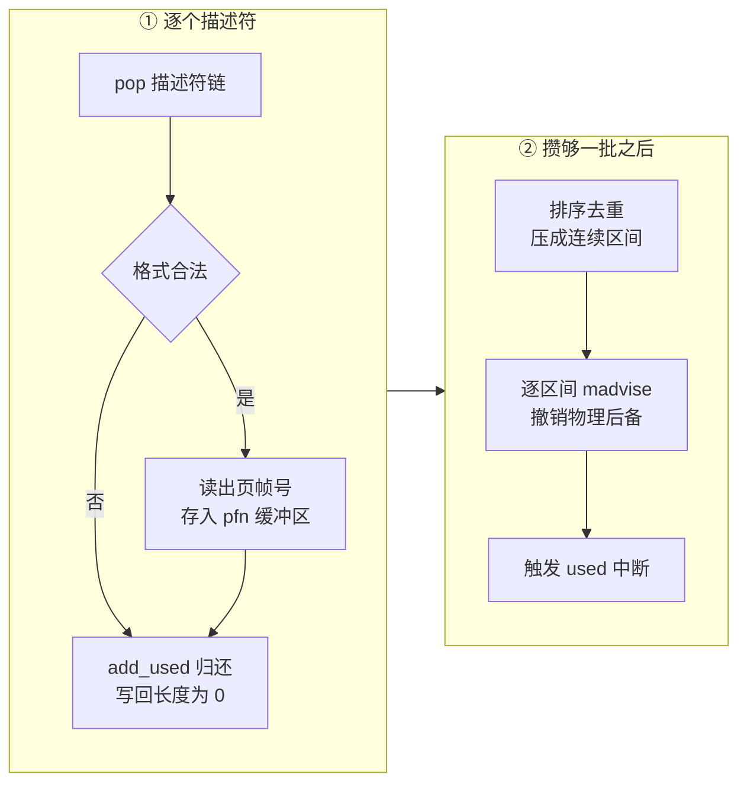

# 34 · balloon：气球、统计与 free page 汇报

> 一台 microVM 启动时就把配置的内存全部要走，之后无论 guest 用不用得上，宿主都很难把这块内存收回来。
> balloon 设备提供的办法是：让 guest 内核自己去申请一批页，把页号交给宿主，宿主随即把这些页的物理后备撤掉。
> 本篇讲这个「协作式回收」的契约、三个队列各自的协议、`madvise` 在恢复场景下为什么不够用，
> 以及为什么这条路径与大页、与快照都存在冲突。
>
> **读者**：系统工程师。　**预备**：[第 13 篇 · guest 内存](13-guest-memory.md)、
> [第 25 篇 · virtio 设备模型与 MMIO 传输层](25-virtio-device-model-and-transport.md)、
> [第 26 篇 · virtqueue 实现](26-virtqueue-implementation.md)。
> **代码**：`src/vmm/src/devices/virtio/balloon/`（`mod.rs`、`device.rs`、`event_handler.rs`、
> `util.rs`、`persist.rs`、`metrics.rs`）、`src/vmm/src/vmm_config/balloon.rs`、`src/vmm/src/resources.rs`、
> `src/vmm/src/device_manager/mmio.rs`

---

## 0. 本篇要回答的问题

1. 宿主为什么不能自己把 guest 不用的内存收回去，非要 guest 配合？
2. balloon 的三个队列分别由谁发起、传什么、谁负责回收描述符？
3. 从 guest 交上来的一串页号到宿主真正释放物理内存，中间经过哪几步处理？
4. 从快照恢复的实例为什么不能只靠 `madvise` 回收，多做了什么？
5. 统计数据为什么由设备保留一个描述符不还、等定时器到点再还？
6. 为什么 balloon 与大页互斥，与 Diff 快照又有什么张力？

---

## 1. 问题：内存一旦给出去就拿不回来

Firecracker 在构建 microVM 时按 `mem_size_mib` 建立若干内存区域，映射成 guest 物理地址空间，
再把每个区域作为一个 memslot 注册给 KVM。这些映射是 `MAP_PRIVATE | MAP_ANONYMOUS | MAP_NORESERVE`
（`src/vmm/src/vstate/memory.rs` 的 `anonymous()`），所以并不是一上来就占住物理内存：
页是 guest 第一次访问时才由宿主内核分配的。

问题出在另一头。guest 内核一旦碰过某一页，那一页就有了物理后备；即便 guest 内的进程随后把内存还给了
guest 的页分配器，guest 内核也只是把它挂回自己的空闲链表，不会通知宿主。
从宿主看，这台 microVM 的常驻集只增不减。高密度部署下，这意味着每台实例的峰值用量都要长期占着。

宿主当然可以强行 `madvise(MADV_DONTNEED)` 一段 guest 内存，但它无从判断哪一页是空闲的：
guest 的页分配器状态在 guest 内核里，宿主看到的只是一片匿名内存。猜错的后果是把 guest 正在用的数据抹成零。

balloon 把这个判断交回给 guest。设备向 guest 通报一个目标大小；guest 侧的驱动按目标向 guest 内核申请页
（这些页于是对 guest 内的其它用途不可用，像一只在 guest 内部膨胀的气球），
再把申请到的页的页帧号交给宿主。页号是 guest 自己选的，所以一定是空闲页；
宿主收到后撤掉这些页的物理后备，气球膨胀多少，宿主就收回多少。
反向操作叫 deflate：宿主调低目标，guest 驱动把气球里的页释放回 guest 内核。

代价写在契约里：**这是协作式的**。设备无法核实驱动说的是不是真的。上游文档
`docs/ballooning.md` 的 Security disclaimer 一节把这一点讲得很直接 —— 驱动被攻破后，
上面每一条承诺都不再成立，宿主必须准备好这个进程用满它启动时拿到的全部内存。
唯一的硬保证来自实现方式而不是信任：页号会被检查是否落在 guest 内存范围内，
撤掉后备用的是 `MADV_DONTNEED`，再次访问读到的是零，信息不会跨进程泄漏。

## 2. 契约：三个队列与一个八字节配置区

v1.12.1 的 balloon 有三个 virtqueue，`src/vmm/src/devices/virtio/balloon/mod.rs` 里定下索引：
`INFLATE_INDEX = 0`、`DEFLATE_INDEX = 1`、`STATS_INDEX = 2`，`BALLOON_NUM_QUEUES` 是 3。
virtio 规范后来加的 free page hinting 与 free page reporting 队列在这个版本里没有实现，
设备只做最基本的 inflate / deflate / stats。

配置区是 8 个字节，两个 `u32`（`device.rs` 的 `ConfigSpace`）：
`num_pages` 是宿主设定的目标大小，`actual_pages` 是驱动写回来的当前实际大小，单位都是 4 KiB 页。
注意这里的 4 KiB 是协议写死的（`MIB_TO_4K_PAGES = 256`、`VIRTIO_BALLOON_PFN_SHIFT = 12`），
与宿主的实际页大小无关 —— 这是第 6 节里 balloon 与大页互斥的原因之一。

特性位只用两个（`mod.rs`）：`VIRTIO_BALLOON_F_STATS_VQ` 与 `VIRTIO_BALLOON_F_DEFLATE_ON_OOM`。
它们不是无条件通报的，而是由配置推出来：`Balloon::new()` 里，`deflate_on_oom` 为真才加 OOM 位，
`stats_polling_interval_s > 0` 才加统计位；并且统计关闭时，构造函数会直接
`queues.remove(STATS_INDEX)` 把第三个队列摘掉 —— 按规范，统计不启用时这个队列根本不该存在。

三个队列的方向与驱动方各不相同：

| 队列 | 谁投递描述符 | 内容 | 谁回收 |
|---|---|---|---|
| inflate | guest 驱动 | 一串 `u32` 页帧号 | 设备处理完立即 `add_used` |
| deflate | guest 驱动 | 一串 `u32` 页帧号 | 设备立即 `add_used`，不看内容 |
| stats | guest 驱动 | 一串「16 位 tag + 64 位值」 | 设备扣住不还，定时器到点才还 |

## 3. inflate：从页号到 madvise

inflate 是唯一真正改变宿主内存占用的路径，也是这个设备里唯一复杂的一段代码。
`device.rs` 的 `process_inflate()` 做四件事：取描述符、读页号、把页号压成区间、按区间撤销后备。

几处细节值得单独说。

**描述符是被无条件回收的。** 无论页号读没读成功、描述符是不是合法，循环末尾都会
`queue.add_used(head.index, 0)`。写回长度是 0，因为设备没有往 guest 内存里写任何东西 ——
这条队列是纯输入方向。格式不合法的描述符（可写、或长度不是 4 的倍数、或页数超过 `MAX_PAGES_IN_DESC`）
只是不被解析，仍然归还。不归还会让 guest 驱动挂住。

**中间缓冲区决定了处理的粒度。** 设备有一个固定大小的 `pfn_buffer`（`MAX_PAGE_COMPACT_BUFFER = 2048` 个页号），
描述符里的页号先攒进这个缓冲区，攒满之前不做任何 `madvise`。装不下下一个描述符时调用 `queue.undo_pop()`
把它退回队列，跳出内循环，先把已攒的这批处理掉，再回来继续。
外层的 `while valid_descs_found` 循环因此可能跑很多轮。

**压成区间是为了少调几次系统调用。** `util.rs` 的 `compact_page_frame_numbers()` 把缓冲区里的页号
排序、跳过重复值、再把相邻的合并成 `(起始页号, 长度)` 对。guest 驱动交上来的页号往往是零散的，
一页一次 `madvise` 的开销远高于排序 2048 个 `u32` 的开销。函数注释也点明了这一层取舍：
因为一次最多只有 `MAX_PAGE_COMPACT_BUFFER` 个页号，这次排序不改变整体复杂度。

**撤销后备在 `util.rs` 的 `remove_range()` 里。** 它先 `find_region()` 定位区间所在的内存区域，
校验区间没有越过区域末端（越界返回 `MalformedRange`），再把 GPA 翻成 HVA，最后
`madvise(addr, len, MADV_DONTNEED)`。这一步之后，宿主内核就可以回收这些物理页；
guest 或 Firecracker 下次读到这个地址时，内核会给一张新的零页。
任何一个区间失败只打印错误、继续处理下一个，不中断整轮 inflate。

## 4. 恢复之后：为什么 madvise 不够

`remove_range()` 有第三个参数 `restored_from_file`，为真时先做一件多余的事：
用 `MAP_FIXED | MAP_ANONYMOUS | MAP_PRIVATE` 在原地重新 `mmap` 一遍这段区间，然后才 `madvise`。

原因在恢复路径的内存来源上。从快照恢复且用 File 后端时，guest 内存是把内存文件
`MAP_PRIVATE` 映射出来的（`src/vmm/src/vstate/memory.rs` 的 `snapshot_file()`）。
对文件私有映射做 `MADV_DONTNEED`，语义不是「清零」而是「丢弃私有副本、回到文件内容」——
下次访问会重新从内存文件里读回原来的数据。这与 balloon 要的效果正好相反：
它要的是那一页彻底没有内容，而不是回到快照时的内容。
代码注释直接写明了这一点：对这种情形没有可用的 `madvise` 标志，所以用匿名映射覆盖掉原映射，
把这段区间的后备从「文件」换成「匿名」，之后的 `madvise` 才是清零语义。

这个标志从哪来？`src/vmm/src/builder.rs` 的 `build_microvm_from_snapshot()` 在构造设备管理器参数时写
`restored_from_file: vmm.uffd.is_none()`。也就是说：用 uffd 后端恢复的实例，这个标志是假的 ——
uffd 场景下 guest 内存本来就是匿名映射（`memory::anonymous()`），`madvise` 的语义正确，不需要覆盖。
正常启动的实例由 `BalloonBuilder::set()` 传入 `false`，因为那条路径永远不是从快照来的。

uffd 场景还有另一半工作要做。`MADV_DONTNEED` 会在 userfaultfd 上产生一个 `UFFD_EVENT_REMOVE` 事件，
外部的缺页处理进程必须消费它、把这段范围记成「已移除」，否则它会在后续缺页时把旧内容重新填回去。
`src/vmm/src/persist.rs` 的 `guest_memory_from_uffd()` 因此无条件
`require_features(FeatureFlags::EVENT_REMOVE)`；注释说明了为什么不做成条件判断：
内核只在 `madvise` 的钩子里检查这个特性，没有 balloon 就不会有 `madvise`，开着也没有副作用。
处理进程一侧的做法见[第 39 篇 · userfaultfd 后端](39-uffd-backend.md)。

## 5. deflate 与 stats：两条不改内存的路径

**deflate 什么都不做。** `process_deflate_queue()` 的循环体只有一行 `add_used`，
连描述符里的页号都不读。这看着像遗漏，其实是对的：deflate 的含义是 guest 驱动把气球里的页
还给了 guest 内核，宿主不需要做任何事 —— 那些页的物理后备本来就已经撤掉了，
guest 下次访问时自然会缺页、拿到新的零页。宿主要做的只是确认收到，让驱动接着走。

**stats 是一条由设备发起的轮询。** 协议有点绕：guest 驱动往 stats 队列里放一个描述符就不管了，
设备把它读出来（`process_stats_queue()` 解析一串 `BalloonStat`，每个 10 字节：2 字节 tag + 8 字节值，
`#[repr(C, packed)]` 保证没有填充），把 tag 映射到 `BalloonStats` 的十个可选字段上，
然后**把描述符索引记进 `stats_desc_index`，不归还**。
真正的归还发生在 `trigger_stats_update()` 里：`stats_timer` 这个周期 timerfd 到点，
设备把扣住的描述符 `add_used` 并触发中断，驱动这才知道「宿主要一份新数据」，
于是刷新统计、再放一个描述符进来。

换句话说，扣住的那个描述符就是设备手里的「下一次提问权」。
如果驱动不守规矩、在设备还扣着一个描述符时又放进来一个，`process_stats_queue()` 会打错误日志
并把旧的那个还回去，只保留最新的。

十个统计字段（`BalloonStats`）都是 `Option`：swap 进出量、主次缺页数、空闲 / 总量 / 可用内存、
磁盘缓存、hugetlb 分配成功与失败次数。驱动只汇报它支持的 tag，没汇报的保持 `None`。
另外四个字段 `target_pages` / `actual_pages` / `target_mib` / `actual_mib` 不来自 guest，
是 `latest_stats()` 在返回前从配置区现算的。

事件注册在 `event_handler.rs`：设备激活后注册 inflate、deflate 两个队列 eventfd；
统计启用时再注册 stats 队列 eventfd 与 `stats_timer`。激活之前只注册 `activate_evt`，
这段之前收到的队列事件一律记一条警告丢掉。

## 6. 控制面：什么时候能配、什么时候能改

balloon 只能在启动前安装。`PUT /balloon` 走到 `src/vmm/src/resources.rs` 的 `set_balloon_device()`，
那里有两道拦截：目标大小不能大于等于 `mem_size_mib`（否则 `TooManyPagesRequested`），
并且只要 `huge_pages != HugePageConfig::None` 就直接拒绝（`BalloonConfigError::HugePages`）。
反向的检查也在：`update_machine_config()` 里，已经配了 balloon 再去改内存大小或改用大页，
分别返回 `IncompatibleBalloonSize` 与 `BalloonAndHugePages`。

与大页互斥的根子在第 2 节：协议里的页号单位是固定的 4 KiB。
guest 驱动按 4 KiB 页申请、按 4 KiB 页号汇报，而宿主侧一个 HugeTLB 页是 2 MiB；
对 HugeTLB 映射的一个 4 KiB 子区间做 `MADV_DONTNEED` 无法释放任何物理内存 ——
整张大页要么在要么不在。与其做一个悄悄失效的功能，不如在控制面直接拒绝。

运行时可改的只有两项，都在 `RuntimeApiController` 上：
`PATCH /balloon` 改目标大小，`PATCH /balloon/statistics` 改轮询间隔；
`GET /balloon` 与 `GET /balloon/statistics` 读回配置与最新统计。

`update_size()` 只在设备已激活时才允许：它写新的 `num_pages` 到配置区，然后触发一次
`IrqType::Config` 中断通知驱动读配置。设备未激活时返回 `DeviceNotActive`，
错误信息里直接提示「检查 guest 内核里的 balloon 驱动是否启用」—— 设备没被驱动激活，
往配置区写什么都没有意义。

`update_stats_polling_interval()` 允许改间隔，但不允许把统计从「开」改成「关」或反过来
（`StatisticsStateChange`）。原因还是队列数量：统计开关决定了队列有两个还是三个，
而队列数量是驱动在协商阶段就看到并据此配置的，运行中改不了。
间隔真的变了时，函数会先 `trigger_stats_update()` 把扣住的描述符还掉，再重设定时器周期。

## 7. 与快照、与脏页

`persist.rs` 保存的是 `stats_polling_interval_s`、扣住的 `stats_desc_index`、最新统计、
配置区两个字段，加上通用的 `VirtioDeviceState`。恢复时按保存的轮询间隔重建设备
（因而也就重建了正确的队列数量），回填特性位、中断状态与配置区，
设备原先是激活状态的话还要重新武装统计定时器、把 `stats_desc_index` 放回去。
`BalloonConstructorArgs` 的第二个字段正是第 4 节讲的 `restored_from_file`。

恢复并 resume 时，`src/vmm/src/lib.rs` 的 `resume_vm()` 会先调
`src/vmm/src/device_manager/mmio.rs` 的 `kick_devices()`。对 balloon 而言，
它调 `process_virtio_queues()`，也就是把 inflate 与 deflate 各处理一遍 ——
快照那一刻可能有已经投递但还没被 epoll 报出来的队列事件，这些事件没有进快照，
只能靠恢复后主动扫一遍队列补上。stats 队列不需要 kick，因为它由定时器驱动，不由事件驱动。

气球里的页在快照里怎么算，取决于快照类型。
Full 快照顺序读完整个 guest 内存（第 37 篇的 `dump()`），被 `madvise` 掉的页读回来是零，
所以它们在内存文件里是一段零 —— 写进去的是真实的零字节，不是文件空洞。

Diff 快照要小心。`MADV_DONTNEED` 既不会在 KVM 的脏位图上留痕，也不会碰用户态位图
（两张位图的来源见[第 14 篇 · 脏页跟踪](14-dirty-page-tracking.md)），
而 `dump_dirty()` 的判据正是这两张位图的并集。
**推论：** 一页被 inflate 撤掉后备、内容从有变零，这个变化不会被记为脏，
因此不会出现在 Diff 产物里；把这份 Diff 叠到基线内存文件上恢复出来的实例，
那一页读到的仍是旧内容。对 guest 通常无害 —— 那页归 guest 的 balloon 驱动所有，
deflate 回去之后按 guest 页分配器的惯例会先写后读 —— 但它确实意味着
「Diff 快照忠实记录了两次快照之间的全部内存变化」这句话在开了 balloon 时不成立。

## 8. 这一篇在本书里的位置

e2b 的 orchestrator 不配置 balloon：`packages/orchestrator/internal/sandbox/fc/` 下没有任何
balloon 相关代码，`packages/shared/pkg/fc/` 里那些 `BalloonStats` 结构是从 Firecracker 的
OpenAPI 描述整体生成的客户端模型，并没有被调用。这有其道理：
e2b 走的是快照 + uffd 的路线，沙箱的内存密度由「按需从内存文件里取页」保证，
而不是靠让 guest 主动交还页。启动即挂起、挂起即落盘的生命周期里，气球来不及膨胀。

那么这一篇为什么仍要读。第一，`restored_from_file` 与 `UFFD_EVENT_REMOVE` 这两处，
是整个代码库里为数不多的「恢复后的内存与正常启动的内存语义不同」的地方，
理解它们对读懂[第 38 篇 · 加载快照](38-snapshot-load.md)与[第 39 篇 · userfaultfd 后端](39-uffd-backend.md)有直接帮助。
第二，balloon 是本书里唯一一个宿主与 guest 就「内存归属」谈判的设备，
它把「协作式机制的信任边界在哪」这个问题摆得最清楚：
设备不能验证驱动，所以宿主侧的所有保证只能建立在内存映射的性质上，不能建立在驱动的行为上。

## 9. 小结

- guest 内核不会主动告诉宿主哪些页空了，宿主也无法自己判断；balloon 把这个判断交给 guest，
  代价是整套机制建立在驱动可信之上，而驱动运行在不可信的 guest 里。
- v1.12.1 只实现 inflate / deflate / stats 三个队列，没有 free page hinting 与 reporting；
  配置区是 `num_pages` 与 `actual_pages` 两个 `u32`，单位固定为 4 KiB 页。
- 特性位由配置反推：`deflate_on_oom` 与非零的统计间隔各自点亮一个位，
  统计关闭时第三个队列会被直接摘掉。
- inflate 把页号攒进固定缓冲区、排序去重压成区间，再逐区间 `MADV_DONTNEED`；
  描述符无论内容是否合法都立即归还，写回长度恒为 0。
- 从内存文件恢复的实例上，`MADV_DONTNEED` 的语义是「回到文件内容」而不是「清零」，
  所以要先用匿名映射原地覆盖；这个分支由「有没有 uffd」决定。
- deflate 不读内容也不做事，只归还描述符；stats 由设备扣住一个描述符、定时器到点才归还，
  这个描述符就是设备的提问权。
- balloon 与大页互斥，因为协议的页号单位写死为 4 KiB，对 HugeTLB 映射做子页 `madvise` 释放不了内存；
  控制面在配置与改配置两个方向上都做了拦截。
- 恢复后 `kick_devices()` 会把 inflate 与 deflate 各扫一遍，补上没进快照的队列事件。
- Full 快照把气球里的页记成零；Diff 快照不会记录这个变化，因为 `madvise` 不触碰任何一张脏位图。

---

## 延伸阅读 / 下一篇

- 下一篇：[第 35 篇 · entropy、vmgenid 与速率限制器](35-entropy-vmgenid-rate-limiter.md) ——
  设备部分的最后三样，其中 vmgenid 同样是「恢复之后要告诉 guest 一件事」。
- [第 13 篇 · guest 内存](13-guest-memory.md) —— 内存区域的建立方式与映射标志。
- [第 39 篇 · userfaultfd 后端与缺页处理](39-uffd-backend.md) —— `UFFD_EVENT_REMOVE` 在处理进程一侧怎么消费。
- [第 40 篇 · 设备状态的 Persist](40-device-persist.md) —— `BalloonState` 在整份快照里的位置。
- 上游文档 `docs/ballooning.md` —— 驱动侧行为与安全声明的原文。
