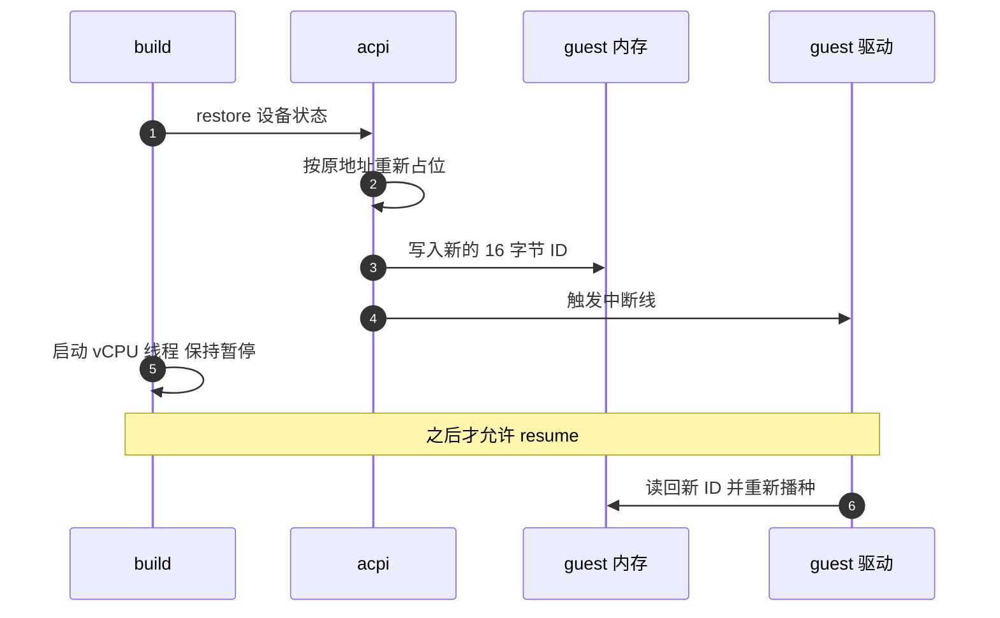
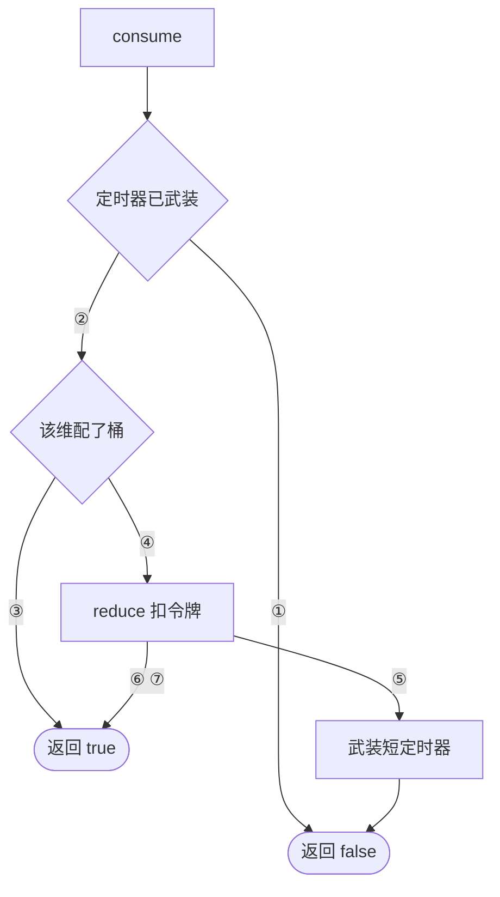

# 35 · entropy、vmgenid 与速率限制器

> 这一篇收三样小东西：一个把宿主随机数递给 guest 的 virtio 设备、一个只有 16 字节状态的通知设备、
> 一个被三类设备共用的令牌桶。它们的共同点不是尺寸，而是都为「同一份快照被恢复成很多台实例」这件事服务 ——
> 前两样负责让克隆出来的实例不要共享随机数状态，第三样负责让它们不要抢光同一台宿主的 I/O 带宽。
>
> **读者**：系统工程师。　**预备**：[第 25 篇 · virtio 设备模型与 MMIO 传输层](25-virtio-device-model-and-transport.md)、
> [第 23 篇 · 设备总线与 MMIO 设备管理器](23-bus-and-mmio-device-manager.md)。
> **代码**：`src/vmm/src/devices/virtio/rng/`（`device.rs`、`event_handler.rs`、`persist.rs`）、
> `src/vmm/src/devices/acpi/vmgenid.rs`、`src/vmm/src/device_manager/acpi.rs`、
> `src/vmm/src/arch/aarch64/fdt.rs`、`src/vmm/src/rate_limiter/`（`mod.rs`、`persist.rs`）、
> `src/vmm/src/vmm_config/entropy.rs`、`src/vmm/src/vmm_config/mod.rs`

---

## 0. 本篇要回答的问题

1. guest 自己就有随机数发生器，为什么还要一个 virtio-rng 设备？
2. 熵在快照克隆场景下的具体风险是什么，virtio-rng 与 vmgenid 各解决其中哪一半？
3. vmgenid 只有 16 字节状态，为什么两个架构要用完全不同的方式把它告诉 guest？
4. 恢复快照时新的 generation ID 在哪一步写进 guest 内存，为什么必须在 vCPU 恢复运行之前？
5. 令牌桶为什么要把容量与补充时间先约分一次，时间又是怎么进位的？
6. 限流器被挡住之后靠什么解除，快照里保存的是哪几个量？

---

## 1. virtio-rng：把宿主的熵递进去

guest 内核自己有随机数子系统，但它的输入来自 guest 内可观察到的事件：中断到达的时刻、
设备 I/O 的时序、如果 CPU 提供的话还有硬件随机数指令。刚启动的 microVM 这三样都很稀薄 ——
没有磁盘寻道抖动、没有键盘、中断源就那么几个。结果是 guest 内核的随机池初始化得很慢，
早期调用 `getrandom()` 的进程可能阻塞，或者拿到质量不确定的结果。

virtio-rng 给出的是一条直路：guest 驱动把一段缓冲区挂到队列上，设备用宿主的随机数填满它。
`src/vmm/src/devices/virtio/rng/device.rs` 的 `handle_one()` 调 `aws_lc_rs::rand::fill()`
生成与描述符链等长的字节，再用 `IoVecBufferMut::write_all_volatile_at()` 写进 guest 内存。
熵最终来自宿主内核，而宿主是一台长期运行、事件丰富的机器。

设备本身极简：一个队列（`RNG_NUM_QUEUES = 1`、`RNG_QUEUE = 0`），特性位只有 `VIRTIO_F_VERSION_1`，
没有配置区。`process_entropy_queue()` 的循环是「pop 一条描述符链 → 用
`IoVecBufferMut::load_descriptor_chain()` 把它变成可写的 iovec 数组 → 填随机数 →
`add_used(index, 写入字节数)`」，处理完一轮再触发一次 used 中断。
guest 给的缓冲区是空的（长度 0）就直接返回 0，不做任何事。

设备是可选的：只有 `PUT /entropy` 配置过，`src/vmm/src/builder.rs` 的
`build_microvm_for_boot()` 才会 `attach_entropy_device()`。配置体里只有一个字段 `rate_limiter`
（`src/vmm/src/vmm_config/entropy.rs` 的 `EntropyDeviceConfig`）。
与 block、net 不同，entropy 的限流器**没有**对应的运行时 PATCH 端点 ——
`rpc_interface.rs` 里只有 `SetEntropyDevice`，没有 update 动作。

为什么一个「生成随机数」的设备要限流。因为它是 guest 能直接驱动的宿主计算：
guest 驱动可以不停地投递大缓冲区，每一次都让 VMM 线程去做一次密码学随机数生成并写内存。
没有限流的话，一台恶意或失控的 guest 能用这条路径占住 VMM 线程。
限流的位置在 `process_entropy_queue()` 的中间：解析出描述符链、知道了要多少字节之后，
调 `rate_limit_request(len)`；拿不到预算就 `undo_pop()` 把描述符退回队列并跳出循环，
描述符留在 avail 环里等预算恢复。

这里有个成对扣费的小细节。`rate_limit_request()` 先扣一个 ops 令牌，再扣 `bytes` 个字节令牌；
字节不够时要把刚扣掉的那个 ops 令牌 `manual_replenish()` 还回去，否则被挡住的请求会白白消耗操作配额。
同理，`add_used()` 失败时也会把两种令牌都还回去。

## 2. 熵为什么是克隆问题

上面讲的是冷启动。真正棘手的是快照：一份快照被恢复成 N 台实例，这 N 台实例的 guest 内核
在恢复的那一刻拥有**完全相同的随机池状态**。如果它们随后生成会话密钥、TCP 初始序列号或 UUID，
就可能生成出相同的值。上游把这件事单独写了一份文档（`docs/snapshotting/random-for-clones.md`）。

Firecracker 侧的应对分成两半，正好是这一篇的前两个主题。

**virtio-rng 负责持续供给。** 恢复之后 guest 内核会继续从 virtio-rng 取熵，
而每台实例取到的都是宿主现场生成的、互不相同的字节。这是一条持续的、但被动的纠偏通道 ——
它要等 guest 内核主动来要。

**vmgenid 负责发出信号。** 光有新熵不够，guest 内核得知道「我刚刚被复制了，之前的随机池状态不可信」。
vmgenid 就是这个信号：一个 128 位的数字，每次实例从不同的配置或不同的快照启动时都不一样；
guest 内核里的 vmgenid 驱动看到它变了，就重新播种随机池，并通知内核里其它关心这件事的部分。

两者的关系是「通知」与「材料」：vmgenid 说明状态失效了，virtio-rng 提供重新播种的原料。
只配一个也能工作，但都配上才完整。

## 3. vmgenid：16 字节状态与一条中断线

`src/vmm/src/devices/acpi/vmgenid.rs` 的 `VmGenId` 只有四个字段：
当前的 `gen_id`（`u128`）、一个 `EventFdTrigger` 作中断线、generation ID 所在的 guest 物理地址、
以及分配到的 GSI 号。设备没有 MMIO 寄存器，没有队列，不占总线地址。

`VmGenId::new()` 做三件事：向资源分配器要一个 GSI，要 16 字节按 8 字节对齐的系统内存
（`AllocPolicy::LastMatch`，也就是从高地址往下找），然后进 `from_parts()` ——
生成一个 128 位随机数、用 `mem.write_slice()` 把它的小端字节写进那个地址。
`src/vmm/src/device_manager/acpi.rs` 的 `attach_vmgenid()` 再把中断 eventfd 用
`register_irqfd()` 挂到那个 GSI 上。之后 `notify_guest()` 只需要写一下 eventfd，
KVM 就会把中断投递给 guest。

与本书里别的设备不同，vmgenid 是**无条件安装**的：`builder.rs` 的 `build_microvm_for_boot()` 里，
`attach_vmgenid_device()` 不在任何 `if let` 分支下。没有 API 可以关掉它。

装它的是 `src/vmm/src/device_manager/acpi.rs` 的 `ACPIDeviceManager`。这个类型的名字容易误导：
它在两个架构上都编译，并且在 v1.12.1 里只放 vmgenid 这一个设备。
真正按架构切开的是 ACPI 表的生成代码 —— `src/vmm/src/acpi/` 整个模块带 `#[cfg(target_arch = "x86_64")]`，
aarch64 上不存在任何 ACPI 代码，那一侧靠 FDT 描述这个设备。

guest 怎么知道这块内存在哪、中断走哪条线？两个架构的答案完全不同，因为两个架构的固件模型不同。

- **x86_64 走 ACPI。** `ACPIDeviceManager` 实现 `Aml`（这个实现本身不带 cfg，但只有 x86_64 的建表流程会用到它），
  在有 vmgenid 时生成两段 AML：
  一个 GED 设备（`_HID` 为 `ACPI0013`，通用事件设备），它的 `_EVT` 方法判断中断号匹配时
  向 `\_SB_.VGEN` 发 `Notify(0x80)`；以及 VGEN 设备本身（`_HID` 为 `FCVMGID`、
  `_CID` 为 `VM_Gen_Counter`，`ADDR` 包里放 generation ID 地址的高低 32 位）。
  guest 的 ACPI 解释器执行这段 AML，把中断与地址都拿到。
- **aarch64 走设备树。** 没有 ACPI，`src/vmm/src/arch/aarch64/fdt.rs` 的 `create_vmgenid_node()`
  在 FDT 里加一个 `vmgenid` 节点：`compatible` 为 `microsoft,vmgenid`，
  `reg` 是地址与 `VMGENID_MEM_SIZE`，`interrupts` 是一条边沿触发的 SPI。

同一个设备结构体、同一条中断线、同一块内存，只是描述方式换了一套。
`MicrovmState` 里的 `acpi_dev_state` 字段在两个架构上都存在，名字是历史遗留，
实际保存的就是 `VMGenIDState { gsi, addr }` 两个数。

## 4. 恢复时的注入：新 ID 与通知的时序

恢复路径上的 vmgenid 比启动路径多做一件事：**换一个新的 generation ID 并通知 guest**。
下图里 `build` 指 `build_microvm_from_snapshot()` 这条恢复流程，`acpi` 指 `ACPIDeviceManager`。

图里的关键是最后两步的顺序。`src/vmm/src/builder.rs` 的 `build_microvm_from_snapshot()` 里，
`ACPIDeviceManager::restore()` 与随后的 `notify_vmgenid()` 都排在 `start_vcpus()` 之前，
代码注释写明了理由：要让 vCPU 恢复运行与驱动处理通知之间的间隔尽量短。
如果反过来，guest 会先跑上一段时间 —— 这段时间里它仍然以为自己的随机池是可信的。

新 ID 是怎么来的。`VmGenId` 的 `Persist::restore()` 只从状态里取回 `gsi` 与 `addr`，
先用 `AllocPolicy::ExactMatch(state.addr)` 在分配器里把原来那 16 字节重新占住，
然后调的是与启动路径**同一个** `from_parts()` —— 而 `from_parts()` 每次都 `make_genid()` 生成新的随机数并写进 guest 内存。
也就是说「换新 ID」不是一段专门的恢复逻辑，而是构造函数的固有行为。
地址必须精确复原，因为 guest 内存里的 ACPI 表或 FDT 是快照时就写好的，
里面记的还是旧地址；分配器只是要保证这块区域不被别的设备占用。

`notify_vmgenid()` 是幂等且宽容的：没有 vmgenid 设备就什么都不做。
它的注释也点明了通知的前提 —— 只有在 guest 内存里的 ID 确实改过之后发通知才有意义。

## 5. 速率限制器：一个令牌桶与一个 timerfd

`src/vmm/src/rate_limiter/mod.rs` 是全书复用度最高的一个小模块：block 设备、net 设备的收发两个方向、
以及上面的 entropy 设备都用它。它由两层组成。

### 5.1 TokenBucket：三个参数与一次约分

一个桶由三个配置量定义（`TokenBucketConfig`，`src/vmm/src/vmm_config/mod.rs`）：
`size` 是桶容量，`refill_time` 是从空到满所需的毫秒数，`one_time_burst` 是一次性的额外额度。
前两者共同定义了稳态速率，第三个只在开头用一次、用完不再补 —— 它的用途是允许一段启动期的突发。
`TokenBucket::new()` 里，`size` 或 `refill_time` 为零就返回 `None`，也就是这一维不限流。

补充是**被动**的：桶不靠定时器长跑，而是在每次要用令牌时才按流逝的时间算一次该补多少。
公式是 `补充量 = 时间差 × size / (refill_time × 1e6)`。分子上的乘法很容易在 64 位里溢出，
所以构造函数先用辗转相除求 `size` 与 `refill_time_ns` 的最大公约数，
把这个分数约成 `processed_capacity / processed_refill_time` 存下来，后面每次算都用约过的形式。

`auto_replenish()` 里还有一处容易被忽略的处理：整数除法算出的令牌数会丢掉小数部分，
如果每次都把 `last_update` 直接推到当前时刻，丢掉的那部分时间就永远拿不回来，
长跑下来实际速率会低于配置值。代码的做法是反过来算：由**实际发放的整数个令牌**反推它们需要多少时间，
只把 `last_update` 前推这么多（并且这个反推的除法向上取整，避免同一纳秒被用两次）。
没发完的时间余额留给下一次调用。

`reduce()` 的逻辑分三种结果（`BucketReduction`）：一次性额度够就直接从额度里扣；
预算够就扣预算；预算不够先补充一次再试。第三种情况里还有一个边界：
如果请求的令牌数比整个桶还大，那就把桶抽空、返回 `OverConsumption(超出的倍数)` —— 请求**放行**，
但要记账。

### 5.2 RateLimiter：两个桶共用一个定时器

`RateLimiter` 持有一个带宽桶（字节）与一个操作桶（次数），任一为 `None` 表示该维不限流，
外加一个 `timer_fd` 与一个布尔的 `timer_active`。

| 编号 | 条件 | 结果 |
|---|---|---|
| ① | `timer_active` 为真 | 两个维度一起被挡住，不扣任何令牌 |
| ② | 定时器未武装 | 继续判定 |
| ③ | 该维度没有桶 | 这一维不限流，一律放行 |
| ④ | 该维度配了桶 | 进入 `reduce()` |
| ⑤ | `Failure`：预算不够 | 武装 100 ms 单次定时器，返回失败 |
| ⑥ | `Success`：扣费成功 | 直接放行 |
| ⑦ | `OverConsumption`：请求大于整桶 | 抽空桶、武装「超出倍数 × 补满时间」的定时器，仍然放行 |

三条出口对应三种语义。扣不动时武装一个 100 ms 的单次定时器（`REFILL_TIMER_INTERVAL_MS`）并返回失败；
超额放行时武装一个按「超出倍数 × 补满时间」计算的定时器并返回成功 ——
这一笔已经借走的带宽要用一段禁言期还回来。定时器一旦武装，`timer_active` 为真，
后续所有 `consume()` **无条件失败**，两个维度一起被挡住。

解除靠外部。`RateLimiter` 实现 `AsRawFd`，返回的就是 `timer_fd`；
设备的事件处理器把它注册进事件循环，定时器到点时调 `event_handler()`，
后者读掉 timerfd 并把 `timer_active` 置回假。entropy 设备的做法可以当模板：
`process_rate_limiter_event()` 在解除阻塞之后立刻再跑一次 `process_entropy_queue()`，
把之前 `undo_pop()` 退回去的描述符接着处理。反过来，
`process_entropy_queue_event()` 在限流器仍被挡住时只记一个 metric 就返回 —— 队列事件留着不处理。

`RateLimiter::new()` 有一个与 seccomp 有关的设计：即便当前配置等于不限流，也照样创建 timerfd。
注释说明了原因 —— `update_buckets()` 可能在运行期把限流打开，而那时进程已经装上了 seccomp 过滤器，
`timerfd_create` 未必还被允许。资源在还能拿的时候先拿到手。

### 5.3 快照里的限流器

`persist.rs` 里，`TokenBucketState` 保存 `size`、`one_time_burst`、`refill_time`、当前 `budget`，
以及一个 `elapsed_ns`（保存时刻距 `last_update` 的纳秒数 —— `Instant` 是单调时钟的读数，
跨进程没有意义，只能存相对量）。恢复时用 `now - elapsed_ns` 还原 `last_update`，
于是「快照前积攒的那段补充时间」在恢复后仍然算数。

两处值得注意。其一，恢复出来的 `RateLimiter` 是 `timer_active: false`，
也就是一律处于**未阻塞**状态。这正是 `kick_devices()` 的注释所依据的前提：
恢复后不需要为限流器做任何补偿动作，快照那一刻在途的 timerfd 事件可以安全丢弃
（见[第 38 篇 · 加载快照](38-snapshot-load.md)）。
其二，`TokenBucket::restore()` 是拿保存下来的**剩余**一次性额度去调 `TokenBucket::new()` 的，
而 `new()` 会把这个值同时写进 `one_time_burst` 与 `initial_one_time_burst`。
`force_replenish()` 归还令牌时是以 `initial_one_time_burst` 为上限的，
所以恢复之后，一次性额度的天花板就从原始配置降到了快照时的剩余量。

`RateLimiterState` 本身不单独出现在快照里，它嵌在各设备的状态中：
`EntropyState`、`VirtioBlockState`、`NetState` 各持有自己的一份。

## 6. 后续各层的差异

ARM 适配版为原地回滚给 `VmGenId` 增加了 `refresh_generation()`：
把「生成新 ID、写进 guest 内存、发通知」三步合成一个方法，供不重建设备的回滚路径调用 ——
回滚之后 guest 内存被倒回到它已经经历过的一个时刻，generation ID 的变化就是它得知世界分叉了的依据。
同一层还给 `EntropyState` 加了一个读取内部 `VirtioDeviceState` 的访问函数，
让回滚能复用 entropy 的通用 virtio 状态而不必走完整的 `Persist::restore()`。
见[第 69 篇 · PUT /snapshot/rollback](69-rollback-api-and-phases.md)与[第 72 篇 · 回滚的设备状态](72-rollback-devices.md)。

## 7. 小结

- virtio-rng 解决的是「guest 早期熵不足」与「克隆实例需要新鲜熵」两件事，
  它把宿主的随机数经一条队列递进 guest，设备侧只有一个队列、没有配置区。
- entropy 也要限流，因为它是 guest 可以无限驱动的宿主计算；扣费是「先 ops 后 bytes」，
  任一步失败都要把已扣的还回去，描述符则 `undo_pop()` 退回队列等下一轮。
- vmgenid 与 virtio-rng 分工明确：前者发出「你被复制了」的信号，后者提供重新播种的材料。
- vmgenid 无条件安装，状态只有 GSI 与地址两个数；x86_64 用 ACPI 的 GED 加 VGEN 设备描述它，
  aarch64 用 FDT 的一个 `microsoft,vmgenid` 节点描述它。
- 恢复时的新 ID 不是专门的恢复逻辑，而是 `from_parts()` 每次都重新生成的结果；
  地址必须精确复原，因为 guest 内存里的表还记着旧地址。
- 通知排在启动 vCPU 线程之前，为的是压缩「已经在跑但还没收到通知」的窗口。
- 令牌桶被动补充，构造时先把容量与补充时间约分以避免溢出，补充时按整数令牌反推时间以免丢精度。
- 限流器被挡住后两个维度一起停，解除只能靠 timerfd 事件；快照恢复出来的限流器一律是未阻塞的，
  代价是一次性额度的上限会降到快照时的剩余量。

---

## 延伸阅读 / 下一篇

- 下一篇：[第 36 篇 · 快照总览](36-snapshot-overview-and-format.md) —— 这一篇反复提到的「快照」到底是哪两个文件。
- [第 30 篇 · virtio-net](30-virtio-net.md) —— 限流器在一条真正的数据面路径上的介入点。
- [第 27 篇 · virtio-block](27-virtio-block.md) —— 另一个限流器使用者，并且可以运行时 PATCH。
- [第 40 篇 · 设备状态的 Persist](40-device-persist.md) —— `EntropyState` 与 `RateLimiterState` 在整份快照里的位置。
- [第 17 篇 · x86_64 平台](17-x86-64-platform.md) 与 [第 19 篇 · aarch64 平台](19-aarch64-platform.md) ——
  ACPI 表与 FDT 分别在什么时候写进 guest 内存。
- 上游文档 `docs/snapshotting/random-for-clones.md` —— 克隆场景下随机数风险的完整讨论。
