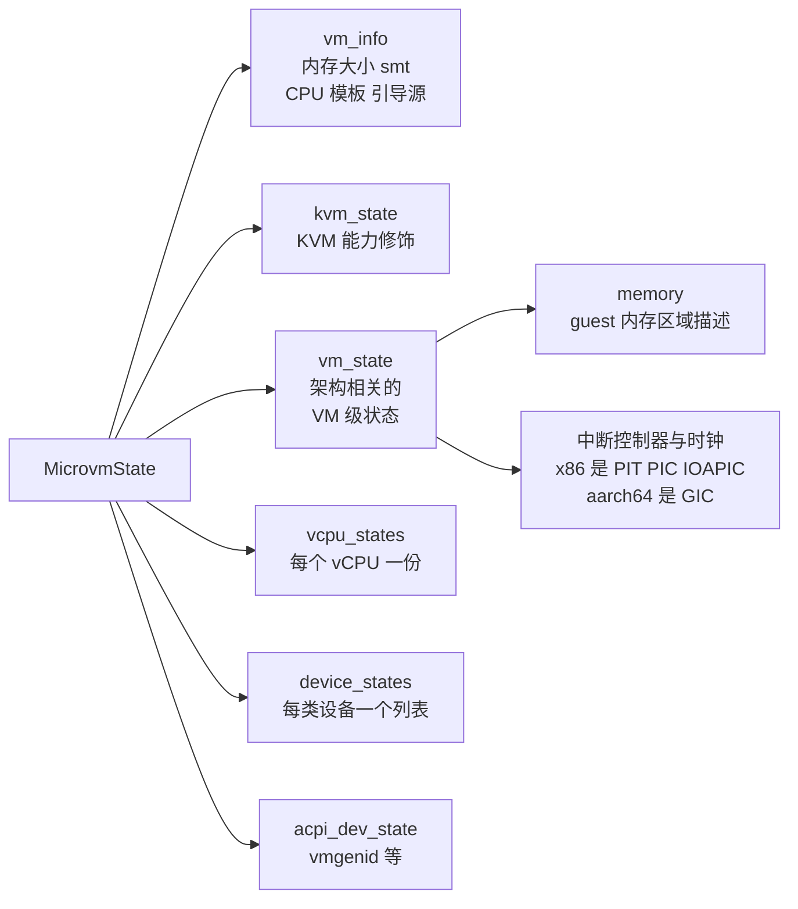

# 36 · 快照总览：文件、版本与 MicrovmState

> 快照是把一台运行中的 microVM 变成两个文件，再从这两个文件把它变回来。本篇讲这两个文件各装什么、
> vmstate 文件的字节布局长什么样、`MicrovmState` 这棵结构树由谁填、以及格式版本为什么与 Firecracker 版本分开编号。
> 创建与加载的具体步骤在后两篇，本篇只建立共同的词汇与边界。
>
> **读者**：系统工程师。　**预备**：[第 09 篇 · rpc_interface](09-rpc-interface.md)、
> [第 13 篇 · guest 内存](13-guest-memory.md)。　**代码**：`src/vmm/src/snapshot/mod.rs`、
> `src/vmm/src/snapshot/crc.rs`、`src/vmm/src/snapshot/persist.rs`、`src/vmm/src/persist.rs`、
> `src/vmm/src/vmm_config/snapshot.rs`

---

## 0. 本篇要回答的问题

1. 一次快照产出哪几个文件，每个文件里装的是什么，哪些东西不在里面？
2. vmstate 文件从第一个字节到最后一个字节是怎么排的，CRC 覆盖到哪里？
3. `MicrovmState` 有哪些字段，guest 内存的描述放在哪一层？
4. 快照格式版本为什么与 Firecracker 版本分开编号，加载时的兼容判据是什么？
5. Full 与 Diff 两种快照的区别是什么，Diff 的前提条件是什么？
6. 快照没有带走的状态有哪些，它们为什么会成为正确性问题？

---

## 1. 快照要保存什么

一台运行中的 microVM 的全部状态散落在四个地方：KVM 内核对象里（vCPU 寄存器、中断控制器、时钟）、
Firecracker 进程的用户态数据结构里（设备模型、队列指针、速率限制器的令牌）、guest 物理内存里、
以及进程之外（磁盘镜像文件、tap 网卡、vsock 的 Unix socket）。

快照要做的是把前三处固化下来，第四处只记住名字。这个切分决定了产物的形态：
**guest 内存单独一个文件**，因为它大、是纯数据、而且恢复时可以按需加载；
**其余状态合并成一个文件**，因为它小、结构复杂、必须一次性读完才能开始重建。
前者本书叫内存文件（memfile），后者叫状态文件（vmstate）。

磁盘不在快照里。`docs/snapshotting/snapshot-support.md` 明确写了：块设备的内容不属于状态，
需要使用者自己管理；创建快照时 Firecracker 也不会把磁盘内容显式刷到后备文件。
这是一个有代价的简化：使用者必须自己保证恢复时看到的磁盘镜像与创建快照那一刻一致，
否则 guest 文件系统会看到一个它认为不可能出现的状态。收益是 Firecracker 不必理解镜像格式，
也不必为磁盘设计增量方案。

两个文件的路径由 `PUT /snapshot/create` 的请求体给出，对应 `src/vmm/src/vmm_config/snapshot.rs` 的
`CreateSnapshotParams`：`snapshot_path`、`mem_file_path`，外加 `snapshot_type`。

---

## 2. vmstate 文件的布局

vmstate 文件的格式定义在 `src/vmm/src/snapshot/mod.rs`，只有四段：

```text
 偏移 0
 +-----------------------------------------------+
 | magic_id            u64, 小端固定宽度          |   区分架构的魔数
 +-----------------------------------------------+
 | version             长度前缀的 UTF-8 字符串    |   形如 "6.0.0"
 +-----------------------------------------------+
 | state               bincode blob               |   MicrovmState 的序列化结果
 |                     变长，占文件绝大部分       |
 +-----------------------------------------------+
 | crc64               u64                        |   覆盖上面三段的全部字节
 +-----------------------------------------------+
 文件末尾
```

魔数按架构取值：x86_64 是 `0x0710_1984_8664_0000`，aarch64 是 `0x0710_1984_AAAA_0000`
（`SNAPSHOT_MAGIC_ID`，两处 `#[cfg(target_arch = ...)]` 常量）。这样一个 aarch64 的快照送进
x86_64 的 Firecracker，在读完头 8 个字节时就被 `SnapshotError::InvalidMagic` 挡住，
不会一路解析到某个语义错误的寄存器值。

版本字段的类型是 `semver::Version`。semver 这个 crate 的 serde 实现把版本序列化成字符串，
所以在 bincode 的定宽整数配置下，它落到文件里是「8 字节长度 + 若干 ASCII 字节」，不是三个整数。
头部这两项合起来是 `SnapshotHdr`，由 `Snapshot::save_without_crc()` 先写，`Snapshot::unchecked_load()` 先读。

序列化用 bincode，配置写在 `BINCODE_CONFIG`：小端、定宽整数编码、并且带一个反序列化的内存上限
`DESERIALIZATION_BYTES_LIMIT`（10 MiB）。这个上限是防御性的：vmstate 文件被 Firecracker
的威胁模型当作可信输入，但一个被截断或损坏的文件仍可能让 bincode 读到一个巨大的长度前缀，
进而尝试分配同样巨大的缓冲区。上限把这种情况变成一个错误而不是一次 OOM。

CRC 的写法值得看一眼。`Snapshot::save()` 把写入端包进 `CRC64Writer`（`snapshot/crc.rs`），
写完头部与状态后取出校验和，再用同一个 writer 把它写进去 —— 注意最后这次写入本身也会更新 writer
内部的校验和，但那个值不再被使用，所以不影响结果。读的一侧是对称的：`Snapshot::load()`
先按「文件长度减 8」读出前三段并让 `CRC64Reader` 一路累积，取出计算值，再从同一个 reader
读出存储的校验和并比较。两条语句的顺序不能换，`mod.rs` 的注释专门说明了这一点。

还有一个实现上的后果：`Snapshot::load()` 为了算校验和，先把「文件长度减 8」这么多字节
读进一个 `Vec<u8>`，再从这个切片上做反序列化。也就是说 vmstate 文件会被整个读进内存一次。
这对 vmstate 是可以接受的 —— 它的量级是设备与 vCPU 状态，通常只有几十到几百 KiB；
但它也解释了为什么 guest 内存绝不能放进同一个文件。

CRC 只保护 vmstate。内存文件没有任何校验和，它太大，逐字节算一遍会把恢复延迟变成与内存成正比的量。
文档把这一点说成「只是针对意外损坏的部分措施」：它挡得住磁盘上的位翻转，挡不住有意的篡改，
也完全不覆盖内存文件与磁盘镜像。

---

## 3. MicrovmState：状态文件里的那棵树

`state` 段里装的是 `src/vmm/src/persist.rs` 的 `MicrovmState`。它有六个字段，
每个字段由系统的一个部分负责填：



几个容易误会的地方。

**guest 内存的描述不在顶层。** `MicrovmState` 里没有独立的内存字段；
描述区域的 `GuestMemoryState`（`src/vmm/src/vstate/memory.rs`）是各架构 `VmState` 的一个成员 ——
`src/vmm/src/arch/x86_64/vm.rs` 与 `src/vmm/src/arch/aarch64/vm.rs` 各自定义的 `VmState`
都以 `pub memory: GuestMemoryState` 打头。加载时的完整性检查
`snapshot_state_sanity_check()` 读的也是 `microvm_state.vm_state.memory.regions`。

**内存描述只有形状，没有内容。** `GuestMemoryState` 是一个 `Vec<GuestMemoryRegionState>`，
每项两个字段：`base_address`（区域的 GPA 起点）与 `size`。内容在内存文件里，按区域在这个
列表中的顺序首尾相接。这个隐含约定是后面两篇反复要用的：
**内存文件里的偏移 = 前面所有区域的大小之和 + 区域内偏移**。

**`kvm_state` 保存的不是 KVM 的内部状态，是能力协商的结果。** 它来自 `Kvm::save_state()`，
内容只有一项 `kvm_cap_modifiers`，即 CPU 模板额外要求启用的那些 KVM 能力。恢复时
`build_microvm_from_snapshot()` 把它传给 `create_vmm_and_vcpus()`，让新建的 KVM 实例
按同一组能力配置出来。真正的 vCPU 与中断控制器寄存器在 `vcpu_states` 与 `vm_state` 里。

**`acpi_dev_state` 不是 x86_64 专有的。** 这个字段没有任何 `#[cfg]`，两个架构的 `MicrovmState` 都有它，
装的是 `ACPIDeviceManagerState`，而 v1.12.1 里这个管理器只管 vmgenid 一个设备。
名字里的 ACPI 只反映 x86_64 上描述该设备的方式；aarch64 上同一个设备经 FDT 节点描述，状态照样存在这里
（见[第 35 篇 §3](35-entropy-vmgenid-rate-limiter.md#3-vmgenid16-字节状态与一条中断线)）。

**`vm_info` 不是 KVM 状态，是重建时要用的配置。** 它由 `From<&VmResources>` 从当前配置拷出来，
装的是内存大小、smt、静态 CPU 模板、引导源配置与大页配置。加载时 `restore_from_snapshot()`
拿它去回填 `MachineConfigUpdate`，这样恢复出来的实例不需要调用方重新配置一遍机器参数。

**每个设备自己负责自己的状态。** 这靠 `src/vmm/src/snapshot/persist.rs` 里的 `Persist` trait：
关联类型 `State`、`ConstructorArgs`、`Error`，方法 `save()` 与 `restore()`。
一个设备只要实现它，就能被设备管理器统一地存下与重建。逐设备的字段在
[第 40 篇 · 设备状态的 Persist](40-device-persist.md)。

---

## 4. 版本：为什么要两套编号

`SNAPSHOT_VERSION` 定义在 `src/vmm/src/persist.rs`，v1.12.1 的取值是 `6.0.0`。
它与 Firecracker 自己的版本号是两回事：一个 Firecracker 二进制声明它支持哪一个格式版本，
创建快照时写入这个版本，加载时检查文件里的版本是否兼容。

兼容判据写在 `Snapshot::load_with_version_check()`，只有一行条件：
文件的 `major` 必须等于本二进制的 `major`，且文件的 `minor` 不得大于本二进制的 `minor`。
换句话说，新版本能读旧的次版本，不能读任何别的主版本，也不能读比自己新的次版本。

主版本为什么容易跳？因为 bincode 的编码里没有字段名与标签，结构体就是字段按声明顺序紧密排列的字节。
往 `MicrovmState` 的任何一层加一个字段、改一个字段的类型、甚至改变枚举变体的顺序，
都会让旧文件的后半段整体错位。`docs/snapshotting/versioning.md` 承认了这个后果：
「实质上每一次 microVM 状态描述的改动都会导致格式主版本号上升」。
代价是跨版本迁移几乎不可能；收益是快照体积没有元数据开销、序列化与反序列化都只是一趟内存拷贝，
而恢复延迟正是这套设计最在意的指标。

两个命令行入口可以不启动 microVM 就问出版本信息（`src/firecracker/src/main.rs`）：
`--snapshot-version` 打印本二进制支持的格式版本；`--describe-snapshot <路径>`
调用 `print_snapshot_data_format()`，它只用 `Snapshot::get_format_version()` 读文件头，
不解析状态段，也不校验 CRC。运维上用它来判断一个快照能不能被某个二进制加载，成本只有一次
`open` 加几十字节的读。

---

## 5. 三个 API 与两种快照类型

快照相关的控制面只有三个端点，语义都很窄：

| 端点 | 方法 | 作用 | 前提 |
|---|---|---|---|
| `/vm` | PATCH | 在 `Paused` 与 `Resumed` 之间切换 | microVM 已启动 |
| `/snapshot/create` | PUT | 写出 vmstate 与 memfile | vCPU 处于 paused |
| `/snapshot/load` | PUT | 从两个文件重建一台 microVM | 本进程尚未配置引导资源 |

`PATCH /vm` 的请求体只有一个 `state` 字段，`src/firecracker/src/api_server/request/snapshot.rs`
的 `parse_patch_vm_state()` 把它翻译成 `VmmAction::Pause` 或 `VmmAction::Resume`。
真正的动作是给每个 vCPU 线程发一个事件并等回执，在 `src/vmm/src/lib.rs` 的 `pause_vm()` / `resume_vm()`。

`snapshot_type` 有 `Full` 与 `Diff` 两个取值，默认 `Full`。差别只体现在内存文件上：
Full 写出全部 guest 内存；Diff 只写出自上一次快照（或自 microVM 创建）以来被改写过的页，
产物是一个稀疏文件，干净页的位置是文件空洞。状态文件两种类型完全一样 —— 没有「增量的 vmstate」这回事。

Diff 有一个硬前提：脏页跟踪必须开着。`src/vmm/src/rpc_interface.rs` 的
`RuntimeApiController::create_snapshot()` 在动手之前检查 `snapshot_type == Diff &&
!machine_config.track_dirty_pages`，命中就返回 `VmmActionError::NotSupported`，
错误信息是「Diff snapshots are not allowed on uVMs with dirty page tracking disabled」。
它不会退化成 Full，因为静默退化会让调用方以为自己拿到的是增量、实际付出了全量的时间与空间。
开关本身在 `PUT /machine-config` 的 `track_dirty_pages`，或者 `PUT /snapshot/load`
的 `enable_diff_snapshots` —— 后者让一台从快照恢复出来的 microVM 继续具备做增量快照的能力。
两张位图与跟踪的代价在[第 14 篇 · 脏页跟踪](14-dirty-page-tracking.md)。

`PUT /snapshot/load` 的请求体里，内存后端有两种写法：`mem_file_path` 与 `mem_backend`。
前者已被标为 deprecated，解析时会记一次 `deprecated_http_api_calls` 并返回一条弃用提示；
两者只能给一个，都不给或都给都是 400。`mem_backend` 的 `backend_type` 取 `File` 或 `Uffd`，
分别对应「让内核按缺页从文件读」与「把缺页交给一个外部进程处理」，见
[第 38 篇 · 加载快照](38-snapshot-load.md)与[第 39 篇 · userfaultfd 后端](39-uffd-backend.md)。

---

## 6. 快照带不走的东西

快照的边界不是「保存了什么」，而是「没保存什么会出问题」。这里列出四类，后面各篇会分别展开。

**按名字引用的外部资源。** tap 设备存的是接口名，块设备存的是宿主文件路径，vsock 存的是
Unix socket 路径。恢复时这三样必须在原来的名字上、并且对新进程可访问。
名字冲突是多台克隆同时恢复时最常见的失败原因，所以 `PUT /snapshot/load` 提供了
`network_overrides` 在加载时替换 tap 名。

**运行期的配置。** 日志与 metrics 的配置不进快照，恢复后要重新配置。MMDS 的配置进快照，
但数据仓不进 —— 恢复出来的实例有 MMDS，里面是空的。

**唯一性。** 从同一份快照恢复出多台 microVM，它们的 guest 内核熵池、缓存的随机数、
会话标识与加密令牌是逐位相同的。上游把这一条列为快照功能仍处于开发者预览状态的原因。
缓解手段是 vmgenid 设备：恢复时 Firecracker 更新那个 16 字节的标识并在恢复 vCPU 之前注入通知，
Linux 5.18 及以后会据此重新播种内核 PRNG。它解决的是内核这一层，用户态自己缓存的随机性不在其列。

**连接状态。** vsock 在保存的时候就向 guest 驱动发了一次 `VIRTIO_VSOCK_EVENT_TRANSPORT_RESET`
（`src/vmm/src/device_manager/persist.rs` 的保存流程里，对已激活的 vsock 调用
`send_transport_reset_event()`），让驱动在恢复后主动关掉所有已建立的连接。
这是一个务实的取舍：与其保存一份必然与对端不一致的连接状态，不如让 guest 知道传输层重置了。

还有一层更硬的约束：宿主。同一台机器、同一个 CPU 型号、同一个宿主内核版本之间恢复是被支持的；
跨 CPU 厂商不支持；跨宿主内核版本被明确称为不稳定，因为保存下来的 KVM 状态在不同内核上可能有不同语义。
加载时 Firecracker 只做一个软检查：`validate_cpu_vendor()`（x86_64）或
`validate_cpu_manufacturer_id()`（aarch64）比较快照里第一个 vCPU 记录的厂商标识与宿主的，
不一致时只打一条 warn，不阻止加载。把这条 warn 当成错误处理是调用方的责任。

---

## 7. 后续各层的差异

e2b 定制版把 `CreateSnapshotParams::mem_file_path` 改成了 `Option<PathBuf>`，不传就不写内存文件，
只产出 vmstate；guest 内存由调用方通过新增的内存查询 API 自己取走。
见[第 54 篇 · 可选 memfile 的快照](54-optional-memfile-snapshot.md)。

ARM 适配版在这个参数上再加一个 `dirty_bitmap_path`，让 create 顺带写出一份位图 sidecar，
并新增了 `PUT /snapshot/rollback` 与 `PUT /snapshot/save-dirty-bitmap` 两个端点。
见[第 64 篇 · 扩展总览](64-checkpoint-extension-overview.md)与
[第 67 篇 · dirty_bitmap_path](67-dirty-bitmap-sidecar.md)。
状态文件的格式、`SNAPSHOT_VERSION` 与 `MicrovmState` 的字段在三层改动中都没有变。

---

## 8. 小结

- 一次快照产出两个文件：vmstate 装除 guest 内存以外的全部进程内状态，memfile 装 guest 内存。磁盘不在其中。
- vmstate 的布局是「魔数 + 版本字符串 + bincode 状态 + CRC64」，CRC 覆盖前三段，内存文件没有校验和。
- 魔数区分架构，所以跨架构的快照在读头 8 字节时就被拒绝。
- `MicrovmState` 有六个字段；guest 内存的区域描述嵌在架构相关的 `vm_state.memory` 里，只记录起点与大小。
- 内存文件里的偏移由区域顺序决定：前面所有区域的大小之和加区域内偏移。
- 格式版本独立编号，判据是主版本相等且次版本不超过；bincode 的紧密编码让几乎任何状态结构改动都要抬主版本。
- Full 与 Diff 只在内存文件上有区别；Diff 要求脏页跟踪已开启，否则报错而不是退化。
- 快照按名字引用 tap、块设备文件与 vsock socket，唯一性与连接状态需要调用方额外处理。

---

## 延伸阅读 / 下一篇

- 下一篇：[第 37 篇 · 创建快照](37-snapshot-create.md) —— save_state、内存导出与 Diff 的每一步。
- [第 14 篇 · 脏页跟踪](14-dirty-page-tracking.md) —— 两张位图的分工，Diff 的判据从哪来。
- [第 40 篇 · 设备状态的 Persist](40-device-persist.md) —— `Persist` trait 与逐设备的字段。
- [第 41 篇 · snapshot-editor、rebase-snap 与兼容性](41-snapshot-tools-and-compat.md) —— 工具与兼容矩阵。
- 上游文档：`docs/snapshotting/snapshot-support.md`、`docs/snapshotting/versioning.md`。
- [e2b 手册第 37 篇](../e2b-infra/37-pause-and-snapshot.md) —— 一个不让 Firecracker 写内存文件的调用方长什么样。
