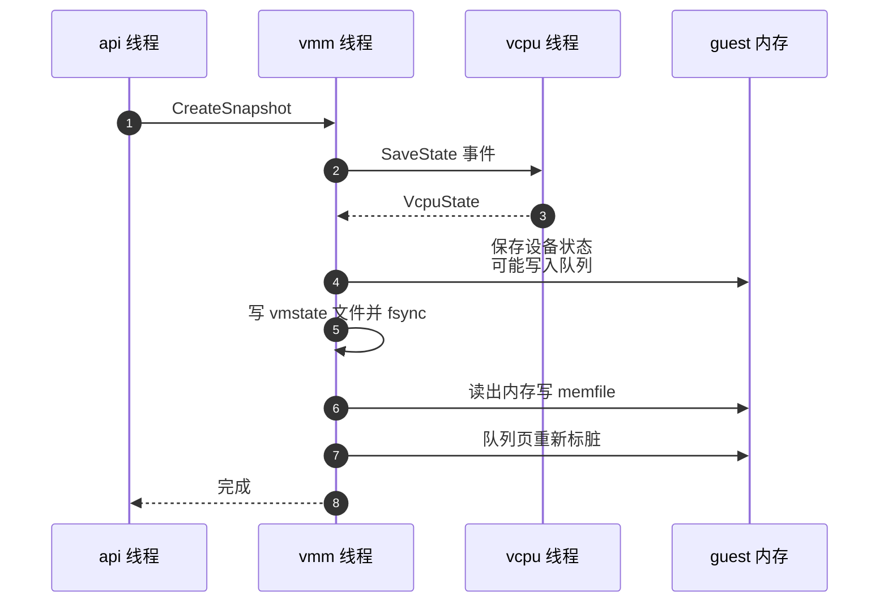
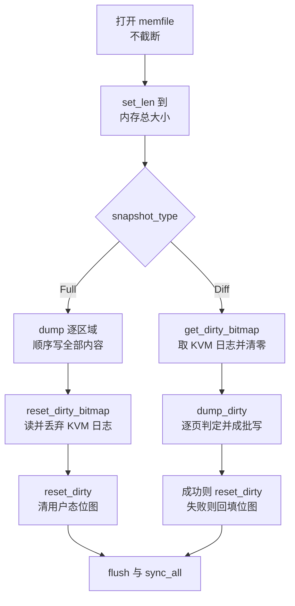

# 37 · 创建快照：save_state、内存导出与 Diff

> `PUT /snapshot/create` 的实现只有几十行，但每一行的位置都有理由：为什么必须先暂停、
> 为什么状态文件写在内存文件之前、为什么 Full 分支比 Diff 分支多两行清位图的代码、
> 为什么写完以后要把已激活设备的队列重新标脏。本篇把这条路径逐步走一遍。
>
> **读者**：系统工程师。　**预备**：[第 36 篇 · 快照总览](36-snapshot-overview-and-format.md)、
> [第 14 篇 · 脏页跟踪](14-dirty-page-tracking.md)、[第 15 篇 · vCPU 线程与状态机](15-vcpu-threads-and-state-machine.md)。
> **代码**：`src/vmm/src/persist.rs`、`src/vmm/src/lib.rs`、`src/vmm/src/vstate/vm.rs`、
> `src/vmm/src/vstate/memory.rs`、`src/vmm/src/rpc_interface.rs`

---

## 0. 本篇要回答的问题

1. 「创建快照前必须暂停」这条规则是由谁强制的，API 层真正检查了什么？
2. `save_state()` 按什么顺序收集状态，这个顺序为什么不能随便换？
3. 保存设备状态的过程会不会改动 guest 内存？如果会，为什么状态文件要写在内存文件之前？
4. Full 与 Diff 两个分支在写内存文件时分别做了什么，稀疏文件是怎么来的？
5. 两张脏位图分别在什么时候被清掉，写失败时脏信息会不会丢？
6. 为什么写完快照要把已激活设备的队列页重新标脏？

---

## 1. 前提：暂停由谁强制

上游文档写「**Prerequisites**: The microVM is `Paused`」，读代码会发现控制面并没有这条检查。
`src/vmm/src/rpc_interface.rs` 的 `RuntimeApiController::create_snapshot()` 只做一件校验：
`Diff` 类型遇上 `track_dirty_pages == false` 时返回 `NotSupported`。没有任何一行比较实例状态。

真正强制它的是 vCPU 的状态机（`src/vmm/src/vstate/vcpu.rs`）。收集状态时
`Vmm::save_vcpu_states()` 给每个 vCPU 线程发 `VcpuEvent::SaveState`。
处于 `running` 状态的 vCPU 收到这个事件时，回的是
`VcpuResponse::NotAllowed("save/restore unavailable while running")`；
只有 `paused` 状态才会执行 `KvmVcpu::save_state()` 并回一个 `SavedState`。
`Vmm::save_vcpu_states()` 把 `NotAllowed` 映射成 `MicrovmStateError::NotAllowed`，
整条调用链失败退出。

这是一个值得注意的设计选择：约束不写在入口，而是落在唯一能判断它的地方。
vCPU 线程自己知道自己有没有停在 `KVM_RUN` 之外；控制面线程去读一个共享的状态字段，
结论在读到的那一刻就可能过期。代价是错误信息离用户远了一层 —— 调用方看到的是
「Cannot save the microVM state」而不是「VM is running」。

暂停本身的语义要先说清。`PATCH /vm` 置 `Paused` 走 `Vmm::pause_vm()`，
它给每个 vCPU 发 `Pause` 并等 `Paused` 回执。回执到齐时，所有 vCPU 都已经退出 `KVM_RUN`
并阻塞在 `event_receiver.recv()` 上。guest 不再执行指令，guest 内存从此静止 ——
这是后面所有「拍一张一致的快照」的前提。但 VMM 线程与设备的 epoll 循环并没有停，
所以「静止」只对 guest 侧成立；VMM 自己稍后还会写 guest 内存，下一节就是例子。

---

## 2. 四步

`src/vmm/src/persist.rs` 的 `create_snapshot()` 只有四步，顺序即是全部内容：

用文字重述：

1. `vmm.save_state(vm_info)` 收集 `MicrovmState`；
2. `snapshot_state_to_file()` 把它序列化进 `snapshot_path`；
3. `vmm.vm.snapshot_memory_to_file()` 把 guest 内存写进 `mem_file_path`；
4. 遍历所有已激活的 virtio 设备，把它们的队列页重新标脏。

第 2 步与第 3 步的先后是有讲究的，下一节解释。第 4 步与本次快照无关，是给下一次快照留的，见第 6 节。

---

## 3. save_state：收集的顺序

`Vmm::save_state()` 在 `src/vmm/src/lib.rs`，收集顺序是：vCPU 状态 → `kvm_state` →
`vm_state`（架构相关）→ `device_states` → `acpi_dev_state`。

**vCPU 在最前面，是 aarch64 的要求。** x86_64 上 `self.vm.save_state()` 不带参数；
aarch64 上它的签名是 `save_state(&mpidrs)`，而 `mpidrs` 由 `construct_kvm_mpidrs(&vcpu_states)`
从刚拿到的 vCPU 状态里算出来。GIC 的重分发器状态按 MPIDR 索引，所以必须先有 vCPU 状态才能存 GIC。
这条依赖在[第 19 篇 · aarch64 平台](19-aarch64-platform.md)展开。

**保存设备状态会写 guest 内存。** 这是这一步里最容易被忽略的副作用，有两处：

- vsock：`src/vmm/src/device_manager/persist.rs` 的保存流程对已激活的 vsock 调用
  `send_transport_reset_event()`。这个函数从事件队列取一个描述符，
  往 guest 内存里写入 `VIRTIO_VSOCK_EVENT_TRANSPORT_RESET`，推进 used ring，然后触发一次中断。
  代码里紧接着的注释说明了为什么状态要在通知之后才保存：这样通知对队列造成的改动也会被存进快照。
- block：保存前先调 `prepare_save()`（`src/vmm/src/devices/virtio/block/virtio/device.rs`），
  它 `drain_and_flush()` 清空在途请求并刷盘，异步引擎还要 `process_async_completion_queue()`
  把完成项回填进 used ring。目的是让快照里不存在「已提交但未完成」的 I/O ——
  恢复出来的设备不需要重放任何在途请求。

这两处都改动了 guest 内存，也都改动了队列的 used ring。它们发生在内存文件被写出之前，
所以这些改动会出现在快照里 —— 这正是第 2 步与第 3 步顺序的理由。
如果先写内存文件再保存设备状态，快照里的设备状态会声称 used ring 已经推进，
而内存文件里的 used ring 还停在旧位置，恢复出来的 guest 驱动会读到不一致的索引。

**`snapshot_state_to_file()` 本身很简单。** `OpenOptions` 带 `create + write + truncate` 打开，
`Snapshot::save()` 写入，然后 `flush()` 加 `sync_all()`。`sync_all()` 是必要的：
调用方在 `PUT /snapshot/create` 返回后就可能把文件搬走或上传，
仅仅 `flush()` 只保证数据离开了进程的缓冲区，不保证落盘。

---

## 4. 写内存文件：先把文件调整到该有的大小

`Vm::snapshot_memory_to_file()`（`src/vmm/src/vstate/vm.rs`）在选择 Full 还是 Diff 之前，
先花了一半的篇幅处理文件长度，理由不直观。

它用 `create + write + truncate(false)` 打开文件 —— 注意**不截断**。
然后算出 `expected_size`：所有区域长度之和（`mem_size_mib()` 把它折成 MiB 再乘回去）。
如果文件原先就存在，比较实际长度与 `expected_size`，**只有不相等时才 `set_len(0)`**；
最后无论如何都 `set_len(expected_size)`。

不截断的理由写在代码注释里，是一个真实的自伤场景：这台 microVM 可能就是从这个内存文件恢复出来的。
`File` 后端恢复时 guest 内存是这个文件的 `MAP_PRIVATE` 映射（[第 38 篇](38-snapshot-load.md)），
对文件做 `truncate` 会让映射中尚未被写时复制的那部分页变成不可访问或者读到零 —— 也就是说，
一次「把快照写回原路径」的操作会在写之前先把自己的 guest 内存清空。
所以这里的规则是：大小对得上就原地覆盖，对不上才允许重建。

Diff 分支还依赖「不截断」的另一面：它要把新的脏页合并进已有的内存文件。
函数文档写得很直接 —— 如果是 Diff 类型、目标文件存在且大小匹配，差分就直接合并进这个文件。
这给了调用方两种用法：每次 Diff 写一个新文件（产物是一层薄的稀疏文件，事后要用
`rebase-snap` 合并，见[第 41 篇](41-snapshot-tools-and-compat.md)），
或者每次 Diff 都写回同一个全量文件（原地就地合并，省掉离线合并的一步，代价是丢掉了历史层次）。

---

## 5. 两个分支

**Full 分支**调 `GuestMemoryExtension::dump()`：按区域顺序，把每个区域的整块
`VolatileSlice` 写给文件。写完之后额外做两件事：`reset_dirty_bitmap()` 与 `reset_dirty()`。
前者遍历每个 memslot 调一次 `get_dirty_log()` 并丢掉结果 —— 目的不是读，是利用
`KVM_GET_DIRTY_LOG` 的副作用：KVM 在返回位图的同时清零脏位并重新写保护相应的页。
（Firecracker 没有启用 `KVM_CAP_MANUAL_DIRTY_LOG_PROTECT`，全仓库找不到相关调用，
所以取日志就等于清日志。）后者清空每个区域的用户态 `AtomicBitmap`。
两张位图都清干净之后，下一次 Diff 快照的「自上次以来」才是从这一刻算起。

**Diff 分支**没有这两行，因为清位图的动作已经内含在它的两步里：
`get_dirty_bitmap()` 逐 slot 调 `get_dirty_log()`，取走位图的同时就清了 KVM 侧；
`dump_dirty()` 在写成功之后自己调 `reset_dirty()` 清用户态侧。
这个不对称第一眼像是遗漏，实际是两条路径算出来的结果相同。

最后两行两个分支共享：`flush()` 与 `sync_all()`，理由与状态文件相同。

---

## 6. dump_dirty：逐页判定与成批写

`GuestMemoryExtension::dump_dirty()`（`src/vmm/src/vstate/memory.rs`）是 Diff 的核心，
它要回答的问题是「哪些页要写、写到文件的什么位置」。

判据是两张位图的并集。外层遍历区域，`slot` 与区域一一对应；
内层把 KVM 位图当作 `u64` 数组，对每个 bit 算出页在区域内的偏移 `page_offset`，
同时去问用户态位图 `firecracker_bitmap.dirty_at(page_offset)`，
只要 `is_kvm_page_dirty || is_firecracker_page_dirty` 为真，这一页就要写。
两张位图为什么缺一不可 —— guest 经 KVM 写的页只在前者，VMM 代表设备写的页只在后者 ——
是[第 14 篇](14-dirty-page-tracking.md)的题目。

写的方式不是一页一次。循环维护 `write_size` 与 `dirty_batch_start`：
遇到一页脏且当前没有在攒批次，就先 `seek` 到 `writer_offset + page_offset`
并记下批次起点；连续的脏页只累加 `write_size`；遇到第一页干净的时候，
把攒下的整段 `write_all_volatile()` 一次写出去。区域扫完还要补写最后一批。
`writer_offset` 在每个区域结束后加上该区域长度 —— 这就是[第 36 篇](36-snapshot-overview-and-format.md)
提到的「文件偏移 = 前面所有区域大小之和 + 区域内偏移」在代码里的样子。

稀疏由此而来：干净页的位置从来没有被写过，只是被 `seek` 跳过。
在支持稀疏的文件系统上这些位置是空洞，不占块。所以一个 Diff 内存文件的表观大小
等于整个 guest 内存，实际占用只等于脏页的量。代价是这个文件单独拿出来毫无意义 ——
空洞处读出来是零，不是旧内容。它必须叠回一个全量内存文件上才能用。

**写失败时脏信息不丢。** `dump_dirty()` 的收尾是一个二选一：
写出错就调 `store_dirty_bitmap(dirty_bitmap, page_size)`，把刚才从 KVM 取回来的位图
按位回填进用户态位图；写成功才调 `reset_dirty()`。
这一步是必要的，因为 `get_dirty_bitmap()` 已经不可逆地清空了 KVM 侧的记录：
如果失败时什么都不做，那些页在两张位图里都会显示为干净，下一次 Diff 会漏掉它们，
而漏掉一个被写过的页是静默的数据损坏。回填的代价是下一次快照会多写一些页，
方向是对的 —— 多写只是浪费，漏写是错误。

---

## 7. 队列为什么要重新标脏

`create_snapshot()` 的最后一步遍历所有已激活的 virtio 设备，
调 `VirtioDevice::mark_queue_memory_dirty()`。代码里的注释只有一句：
运行时不会为队列对象标脏。要理解它，得看队列是怎么访问 guest 内存的。

`src/vmm/src/devices/virtio/queue.rs` 的 `Queue::initialize()` 在设备激活时，
把描述符表、avail ring、used ring 三段的宿主地址取出来存成裸指针，
之后所有读写都走 `read_volatile()` / `write_volatile()`。
裸指针绕开了 `vm-memory` 的访问接口，而用户态脏位图正是挂在那个接口上的 ——
所以 Firecracker 每次推进 used ring、写回描述符，用户态位图都不会知道。
KVM 侧也不会知道，因为那是 VMM 进程在写，不是 guest 在写。

取指针的那个辅助函数 `get_slice_ptr()` 在返回指针之前会对这一段调一次
`bitmap().mark_dirty()`。也就是说，队列页只在两个时刻被标脏：设备激活时，
以及每次快照之后的这一步。这就形成了一个不变量：
**从任意一次快照结束到下一次快照，已激活设备的队列页始终处于脏状态。**
于是每一个 Diff 快照都必然包含完整的队列区域，不管期间队列有没有真的动过。

代价是每次 Diff 都会多写几页（三段的大小由队列长度决定，通常是几 KiB 到几十 KiB 一条队列）。
收益是不必在数据面的每一次 used ring 写入上都去更新位图 —— 那是 I/O 路径上的热点，
每个描述符链都要走一次。用一点固定的空间换掉热路径上的一次原子位操作，
对一个把每次 I/O 的开销看得很重的 VMM 来说是合理的取舍。

顺序也要对：这一步在写完内存文件之后。本次快照要保存的队列内容，
靠的是上一次快照结尾留下的那个「脏」标记（或者设备激活时留下的），已经被本次的 `dump_dirty()` 写出去了。
如果把标脏放在写文件之前，效果一样，但语义上就分不清这个标记是为谁准备的了。

---

## 8. 代价与边界

**暂停时长与脏页数成正比。** 从 `PATCH /vm` 置 Paused 到快照写完，guest 一直不执行指令。
这段时间里的大头是把内存写进文件：Full 是全部内存，Diff 是脏页。
上游为这两条路径分别记了 `vmm_full_create_snapshot` 与 `vmm_diff_create_snapshot`
两个延迟 metric（`src/vmm/src/rpc_interface.rs`），就是因为它们的量级不同。

**写的是同步 I/O。** `dump()` 与 `dump_dirty()` 都是在 VMM 线程里直接写文件并 `sync_all()`，
没有异步、没有后台线程。这让失败语义简单（返回错误即失败），
但也意味着暂停时长里包含了磁盘的写入与刷盘时间。

**Diff 产物不能单独使用。** 前面说过它是稀疏文件，必须叠在一个全量内存文件上。
第 41 篇的 `rebase-snap` 做的就是这件事。而状态文件每次都是完整的，
所以「一份全量 memfile + 一串 Diff memfile + 最后一份 vmstate」才是一套可用的产物。

**快照不改变 microVM 的状态。** 创建快照之后 microVM 仍然是 Paused，可以 Resume 继续跑。
但从第 36 篇的唯一性讨论可以推出：一旦原实例继续运行，它与从这份快照恢复出来的实例
就共享了同一份标识与随机性，两边都不再满足唯一性假设。

**失败的中间态。** `create_snapshot()` 不做回滚。如果状态文件写成功而内存文件写失败，
磁盘上会留下一个孤立的 vmstate 文件；上游文档承诺的「on failure: no side-effects」
指的是 microVM 的状态不受影响，不是文件系统。调用方需要自己清理。

---

## 9. 后续各层的差异

e2b 定制版把 `mem_file_path` 改成可选：不传路径时 `create_snapshot()` 跳过
`snapshot_memory_to_file()`，只写状态文件，队列重新标脏那一步照旧执行。
guest 内存由调用方通过新增的查询 API 自己取。见[第 54 篇 · 可选 memfile 的快照](54-optional-memfile-snapshot.md)。

ARM 适配版给 `snapshot_memory_to_file()` 加了第三个参数 `dirty_bitmap_path`，
让它在写完内存文件之后把「本次写了哪些页」序列化成一个 sidecar 文件；
脏页的来源也可以从 KVM 写保护换成硬件跟踪。见[第 65 篇 · 脏页跟踪后端](65-dirty-tracking-backend.md)
与[第 67 篇 · dirty_bitmap_path](67-dirty-bitmap-sidecar.md)。

---

## 10. 小结

- 「必须先暂停」不是 API 层的检查，是 vCPU 状态机在 `running` 时拒绝 `SaveState` 的结果；API 层只检查 Diff 是否开了脏页跟踪。
- `save_state()` 先收 vCPU 状态，因为 aarch64 的 GIC 保存需要由 vCPU 状态算出的 MPIDR。
- 保存设备状态会写 guest 内存：vsock 发传输层重置事件，block 排空并刷盘在途 I/O。
- 状态文件写在内存文件之前，正是为了让上面这些改动出现在内存文件里。
- Full 走 `dump()` 顺序写全部内存，随后显式清两张位图；Diff 走 `get_dirty_bitmap()` 加 `dump_dirty()`，清位图的动作内含其中。
- `dump_dirty()` 按「KVM 脏或用户态脏」逐页判定，把连续脏页攒成批次写，干净页用 `seek` 跳过，产物是稀疏文件。
- 写失败时把 KVM 位图回填进用户态位图，保证脏信息不会因为一次失败而丢失。
- 队列页在运行期经裸指针访问、不被标脏，所以每次快照之后要重新标脏，使其在两次快照之间恒为脏。
- 打开内存文件时不截断，既是为了避免破坏由该文件后备的 guest 内存，也是为了让 Diff 能就地合并。

---

## 延伸阅读 / 下一篇

- 下一篇：[第 38 篇 · 加载快照](38-snapshot-load.md) —— 这条路径的逆向。
- [第 14 篇 · 脏页跟踪](14-dirty-page-tracking.md) —— 两张位图各自覆盖哪些写路径。
- [第 26 篇 · virtqueue 实现](26-virtqueue-implementation.md) —— 队列的裸指针访问方式。
- [第 40 篇 · 设备状态的 Persist](40-device-persist.md) —— `save()` 在每个设备上具体做了什么。
- [第 41 篇 · snapshot-editor、rebase-snap 与兼容性](41-snapshot-tools-and-compat.md) —— Diff 产物怎么合并。
- [e2b 手册第 37 篇](../e2b-infra/37-pause-and-snapshot.md) —— 一个绕开内存导出的调用方。
