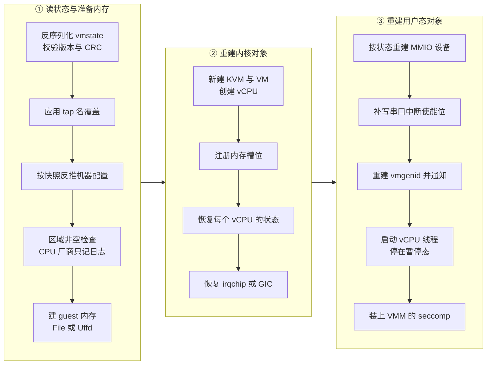

# 38 · 加载快照：restore、内存后端与设备重建

> 创建快照是把一个进程的状态拆成两个文件，加载快照是反过来：在一个**全新的**进程里重新申请
> KVM 的 fd、重新建立内存映射、重新造出每一个设备，再把保存下来的状态灌回去。
> 这条路径上每一步的先后都有约束 —— 内存要先于 vCPU，vCPU 要先于 GIC，设备要先于串口，
> seccomp 必须最后装。本篇把 `PUT /snapshot/load` 走到底，并说明哪些东西是重建的、哪些是恢复的、
> 哪些是既没恢复也不打算恢复的。

> **读者**：系统工程师。　**预备**：[第 36 篇 · 快照总览](36-snapshot-overview-and-format.md)、
> [第 37 篇 · 创建快照](37-snapshot-create.md)、[第 11 篇 · builder](11-builder.md)、
> [第 13 篇 · guest 内存](13-guest-memory.md)。
> **代码**：`src/vmm/src/persist.rs`、`src/vmm/src/builder.rs`、`src/vmm/src/rpc_interface.rs`、
> `src/vmm/src/vstate/memory.rs`、`src/vmm/src/vstate/vm.rs`、`src/vmm/src/device_manager/persist.rs`、
> `src/vmm/src/device_manager/mmio.rs`、`src/firecracker/src/api_server/request/snapshot.rs`

---

## 0. 本篇要回答的问题

1. `PUT /snapshot/load` 为什么只能在启动前发，发过一次之后这个进程还能做什么？
2. 机器配置（vCPU 数、内存大小、CPU 模板）是从请求里来的还是从快照里来的？
3. 两种内存后端各自建立什么样的映射，为什么大页快照必须用 uffd？
4. `build_microvm_from_snapshot()` 里十来个步骤的顺序由哪些依赖决定？
5. 设备是怎么「重建」的 —— 哪些东西从状态里来，哪些东西必须重新向内核申请？
6. 恢复出来的实例为什么是暂停的，`kick_devices()` 在补什么？

---

## 1. 入口：一个一次性的、preboot 的动作

`PUT /snapshot/load` 的请求体先由 `src/firecracker/src/api_server/request/snapshot.rs` 的
`parse_put_snapshot_load()` 解析。这里处理的是一段历史包袱：早期的字段是 `mem_file_path`，
后来换成了结构化的 `mem_backend`（`{backend_path, backend_type}`）。两个字段同时出现报
`TOO_MANY_FIELDS`，一个都没有报 `MISSING_FIELD`；只给 `mem_file_path` 时，
解析器帮你构造一个 `backend_type` 为 `File` 的 `MemBackendConfig`，同时记一次弃用计数
并在响应里附上弃用提示。

动作本身落在 `PrebootApiController` 上，也就是说它**只在 microVM 启动之前可用**。
`src/vmm/src/rpc_interface.rs` 的 `load_snapshot()` 第一句检查是 `if self.boot_path`：
只要之前发过任何一个会导致从头启动的配置请求（设置启动源、插块设备、插网卡、
设置 vsock / balloon / entropy、改机器配置、装 CPU 模板等，这些处理函数末尾都会把
`boot_path` 置真），加载快照就被拒绝。两条路互斥，不能一半配置一半恢复。

还有一条纪律写在错误处理里：`restore_from_snapshot()` 或随后的 `resume_vm()` 一旦失败，
控制器会把 `fatal_error` 置上。注释讲得很直白 —— 恢复到一半的进程「脏得没法收拾」。
之后这个进程不会再接受别的构建请求，只能退出重来。这是个务实的取舍：
恢复路径中途失败可能已经注册了 memslot、创建了 vCPU、占了地址区间，
要写出一套可靠的回滚逻辑，代价远高于让调用方换一个进程重试。

## 2. 第一步：读回状态并据此校正配置

`src/vmm/src/persist.rs` 的 `restore_from_snapshot()` 是这条路径的主干。

第一件事是 `snapshot_state_from_file()`：打开 vmstate 文件、取文件长度、
调 `Snapshot::load_with_version_check()` 反序列化出 `MicrovmState`。
魔数、格式版本与 CRC64 的校验都在这一步完成（见[第 36 篇 · 快照总览](36-snapshot-overview-and-format.md)）。

第二件事是应用 `network_overrides`。请求里可以带一组 `{iface_id, host_dev_name}`，
函数按 `iface_id` 在 `microvm_state.device_states.net_devices` 里找到对应设备，
把它的 `tap_if_name` 换成新名字。找不到就返回 `UnknownNetworkDevice`。
这个能力是给「一份快照恢复成很多台实例」准备的：快照里记着当初那台机器的 tap 名，
而宿主上同名的 tap 只能有一个，克隆时必须逐台改名。

第三件事最容易被误解：**机器配置不是从请求来的，是从快照反推的**。
函数构造一个 `MachineConfigUpdate` 塞给 `vm_resources.update_machine_config()`，
其中 `vcpu_count` 取自 `microvm_state.vcpu_states.len()`（快照里存了几份 vCPU 状态就是几个），
`mem_size_mib`、`smt`、`cpu_template`、`huge_pages` 取自 `microvm_state.vm_info`。
只有 `track_dirty_pages` 例外，它取自请求里的 `enable_diff_snapshots` ——
「恢复出来之后还要不要继续做 Diff 快照」是调用方此刻的决定，与快照里记的无关。

第四件事是 `snapshot_state_sanity_check()`。这个名字听起来很重，实际只有一条硬性检查：
`vm_state.memory.regions` 不能为空，否则返回 `NoMemory`。区域数量的上界不在这里查，
留给注册 memslot 时与 KVM 的 `max_memslots` 比较。
函数里另外调用的 `validate_cpu_vendor()`（x86_64）/ `validate_cpu_manufacturer_id()`（aarch64）
**不返回错误**：它们把宿主与快照的 CPU 厂商标识都打进日志，不一致时记一条 warn 就放行。
换句话说，跨厂商恢复在 Firecracker 这一层是允许的，能不能跑起来由 guest 自己承担。

## 3. 第二步：guest 内存的两种建法

内存必须在建 VM 之前准备好，因为后面要把它注册成 memslot。
`restore_from_snapshot()` 按 `mem_backend.backend_type` 分成两支。

**File 后端**走 `guest_memory_from_file()`：打开内存文件，调
`src/vmm/src/vstate/memory.rs` 的 `snapshot_file()`，后者用 `MAP_PRIVATE`
把文件按区域顺序映射出来 —— 每个区域拿到的 `FileOffset` 就是它前面所有区域的大小之和
（内存文件里的区域布局见第 36 篇）。映射是私有的，所以 guest 的写不会回到文件里，
同一个内存文件可以同时被多个实例只读地共享。

这条路上有一道硬性拒绝：快照的 `huge_pages` 不是 `None` 时直接返回 `HugetlbfsSnapshot`，
错误信息是「请改用 uffd」。原因是内存文件是一个普通文件，把它映射进来得到的是普通页；
而快照要求的是 HugeTLB 后备的内存，两者对不上。

**Uffd 后端**走 `guest_memory_from_uffd()`：先用 `memory::anonymous()` 建**匿名**映射
（带上大页对应的 mmap 标志），此时这块内存是空的；再建一个 userfaultfd 对象、
把每个区域注册进去；最后把每个区域的宿主虚拟地址、大小、在内存文件里的偏移与页大小
打包成一组 `GuestRegionUffdMapping`，连同 uffd 的 fd 一起经 Unix socket 发给外部的缺页处理进程。
从此以后，guest 第一次碰某一页时内核会把缺页事件交给那个进程，由它决定填什么进去。
握手协议与处理进程的写法在[第 39 篇 · userfaultfd 后端](39-uffd-backend.md)。

| 维度 | File 后端 | Uffd 后端 |
|---|---|---|
| 映射来源 | 内存文件的 `MAP_PRIVATE` 映射 | 匿名映射，内容由外部进程按需填 |
| 缺页由谁处理 | 宿主内核直接从文件读 | 外部进程经 userfaultfd 填 |
| 大页快照 | 拒绝 | 支持 |
| 外部依赖 | 无 | 一个必须先在 socket 上监听的进程 |
| 页内容的控制权 | 无 | 完全在外部进程手里 |

两支共用一个参数 `track_dirty_pages`。它为真时，`memory::create()` 会给每个区域挂一张
`AtomicBitmap`；而 `src/vmm/src/vstate/vm.rs` 的 `register_memory_region()` 正是看
「区域有没有位图」来决定注册 memslot 时要不要带 `KVM_MEM_LOG_DIRTY_PAGES` 标志。
一个请求参数就这样同时打开了用户态与 KVM 两侧的脏页跟踪（见[第 14 篇 · 脏页跟踪](14-dirty-page-tracking.md)）。

## 4. 第三步：build_microvm_from_snapshot 的顺序

内存备好之后，`src/vmm/src/builder.rs` 的 `build_microvm_from_snapshot()` 接手。
整条路径的形状如下。

每一段相邻步骤之间的依赖值得逐条说清。

**先有 VM 才有内存槽位。** `create_vmm_and_vcpus()` 新开 `/dev/kvm`、建 VM fd、
建 `vcpu_count` 个 vCPU fd，顺带在 x86_64 上把串口与 `PortIODeviceManager` 装好。
注意它传入的是 `microvm_state.kvm_state.kvm_cap_modifiers` —— 快照里记录了当初启用或关闭了哪些 KVM 能力，
恢复时照样设一遍。随后 `register_memory_regions()` 把上一节建好的区域逐个注册成 memslot；
`vmm.uffd = uffd` 把 uffd 对象挂在 `Vmm` 上，单纯为了让这个 fd 活到进程结束。

**vCPU 状态先于 GIC。** x86_64 上先做 TSC 频率对齐：快照里 `vcpu_states[0].tsc_khz` 有值
且宿主频率对不上时，给每个 vCPU 设一遍 TSC 缩放。接着逐个 `kvm_vcpu.restore_state()`
灌回寄存器、MSR、XSAVE、MP 状态等。然后才轮到 `vmm.vm.restore_state()` ——
在 aarch64 上，这一步需要先用 `construct_kvm_mpidrs()` 从已恢复的 vCPU 状态里算出 MPIDR 列表，
GIC 的状态恢复要靠它来定位每个 redistributor。这与创建快照时「先存 vCPU 后存 GIC」的顺序正好对称
（见[第 37 篇 · 创建快照](37-snapshot-create.md)）。

**设备先于串口。** `MMIODeviceManager::restore()` 把所有 MMIO 设备重建出来（下一节细说），
之后紧跟 `emulate_serial_init()`。后者做的事很小但很必要：往串口的 IER 寄存器写上 RDA 位。
因为串口设备的状态并不在快照里 —— 恢复出来的串口是全新的，
而 guest 侧的串口驱动早在快照之前就初始化过、不会再初始化一次，
于是「有数据可读时要中断我」这个位没人来设。代码注释承认这是权宜之计：
干净的做法是把串口状态也序列化进去。

**通知先于运行。** ACPI 设备管理器恢复出 vmgenid，紧接着 `notify_vmgenid()` 发中断，
然后才 `start_vcpus()`。理由在[第 35 篇 · entropy、vmgenid 与速率限制器](35-entropy-vmgenid-rate-limiter.md)。
`start_vcpus()` 把每个 vCPU 搬进自己的线程，线程起来后停在 Paused 状态，
并用一个 `Barrier` 等所有 vCPU 线程完成 TLS 初始化。

**seccomp 最后装。** 函数末尾才给 VMM 线程 `apply_filter()`，
注释明确写着「保持这一步是构建过程的最后一步」。前面的步骤要开文件、建 fd、做 ioctl，
过滤器一旦装上，这些系统调用未必还被允许。vCPU 线程的过滤器则在 `start_vcpus()` 时就一并传了进去。

## 5. 设备是怎么「重建」的

`src/vmm/src/device_manager/persist.rs` 里 `MMIODeviceManager` 的 `Persist::restore()`
按设备类型逐类走一遍：balloon、block、net、vsock、entropy，加上 aarch64 上的串口与 RTC。
每一类的形状都一样，只有构造参数不同：

1. 调该设备的 `Persist::restore()`，从设备状态造出设备对象（细节在[第 40 篇 · 设备状态的 Persist](40-device-persist.md)）。
2. 调 `vm_resources.update_from_restored_device()`，把这个对象塞回 `VmResources`，
   让恢复之后的 `GET /vm/config` 与运行时 PATCH 能找到它。
3. 调 `restore_helper()`，重建 MMIO 传输层、抢回地址、注册回内核、挂进事件循环。

`restore_helper()` 里有三处要点。

**地址必须精确复原。** `create_vmm_and_vcpus()` 建的是一个**全新的**空 `ResourceAllocator`，
所以每个设备都要用 `AllocPolicy::ExactMatch(device_info.addr)` 把自己原来那段 MMIO 窗口重新占住。
不这样做的话，重建顺序稍有不同就会分到不同的地址，而 guest 内核里的驱动记着旧地址。
相比之下，中断号的分配器状态**没有**恢复：IRQ 直接取自 `device_info.irq`，
分配器里的 id 计数从零开始。代码注释解释了原因 —— `IdAllocator` 没有「精确匹配」的接口，
而当前也不需要（没有热插拔），将来要支持热插拔时才需要把它的状态也存进快照。

**ioeventfd 与 irqfd 是重新注册的，不是恢复的。** `register_mmio_virtio()` 给设备的每个队列
注册一个落在 `NOTIFY_REG_OFFSET` 上的 ioeventfd（数据域是队列序号），
再用 `register_irqfd()` 把设备的中断 eventfd 挂到它的 IRQ 上。这些是内核对象，
快照里存的只是「该设备有几个队列、用哪个 IRQ」这样的描述，fd 本身必须新建。

**设备的激活状态来自 `VirtioDeviceState`。** 设备不会再走一遍 `activate()` 流程：
如果快照里记着它已激活，各设备的 `restore()` 会直接把 `device_state` 设成 `Activated(mem)`；
事件处理器的 `init()` 则据此决定注册运行期事件还是注册激活事件。

还有两件只在恢复路径上发生的事。其一，`restored_from_file` 这个布尔量沿着构造参数一路传给 balloon，
值是 `vmm.uffd.is_none()`，用途见[第 34 篇 · balloon](34-balloon.md)。
其二，balloon 的 `update_from_restored_device()` 分支里重做了一次「balloon 与大页互斥」的检查 ——
恢复路径没有经过 `PUT /balloon` 的那道拦截，所以在这里补上。

最后一个边界：**vhost-user 块设备不在快照里**。保存时 `save()` 遇到 `block.is_vhost_user()`
会打一条 warn 并跳过它，所以恢复时 `state.block_devices` 里根本不会有它。
带 vhost-user 后端的实例做快照，恢复出来就少一块盘。

### 5.1 恢复之后的配置视图

`VmResources` 是控制面看到的那份「这台机器是怎么配的」。恢复路径要把它填回去，
否则恢复出来的实例就没法再被运维接管。填的来源有三处：
机器配置来自第 2 节的 `update_machine_config()`；每个设备对象来自上面的
`update_from_restored_device()`；启动源（内核路径、initrd 路径、命令行）
则由 `build_microvm_from_snapshot()` 直接赋值 —— `vm_resources.boot_source.config`
取自 `microvm_state.vm_info.boot_source`。

即便如此，这份视图仍然不能当成与原实例等价。`rpc_interface.rs` 的 `GetFullVmConfig` 分支
在返回之前会先打一条 warn，说从快照恢复的实例上，启动源、`machine-config.smt` 与
`machine-config.cpu_template` 会是空的。对照 v1.12.1 的代码，这条提示比实际情况宽：
`VmInfo` 确实保存了 `boot_source` 与 `smt`，两者都被恢复了。
真正会失真的是 CPU 模板 —— `VmInfo::from(&VmResources)` 把它转成 `StaticCpuTemplate`，
自定义模板在这一步退化成「无模板」。读这条日志时要以代码为准。

MMDS 是另一个要专门接回来的东西。`DeviceStates` 里有一个可选的 `mmds_version`：
有值就照它初始化数据存储；没有值但至少有一个网卡带着 MMDS 网络栈，
说明快照来自一个还不保存 MMDS 版本的更早格式，这时按默认版本初始化。
这段兼容分支写在设备恢复的中间 —— 必须排在网卡重建之前，因为网卡的 `restore()`
要拿到 MMDS 的引用。

## 6. 恢复出来的是暂停的

`build_microvm_from_snapshot()` 返回时，vCPU 线程已经起来了，但停在 Paused；
实例状态也被 `start_vcpus()` 置成 `VmState::Paused`。
是否继续跑由请求里的 `resume_vm` 决定：为真时 `load_snapshot()` 接着调 `Vmm::resume_vm()`，
为假时调用方要自己再发一个 `PATCH /vm {"state": "Resumed"}`。

默认不自动 resume 是有道理的。恢复与继续运行之间往往还有事要做：
改 MMDS 内容、通过 `PATCH /drives/{id}` 换块设备后端文件、确认外部的 uffd 处理进程已经就位。
一旦 vCPU 跑起来，guest 就可能立刻读到尚未准备好的状态。
把这两件事拆成两个 API 调用，等于把「什么时候可以跑」的决定权交给调用方。

## 7. kick_devices：补上没进快照的事件

`src/vmm/src/lib.rs` 的 `resume_vm()` 第一件事不是给 vCPU 发 Resume，
而是调 `src/vmm/src/device_manager/mmio.rs` 的 `kick_devices()`。

要补的是这样一个缺口：guest 驱动往队列里放了描述符、写了通知寄存器，
ioeventfd 上因此有一个待处理的事件；但快照只保存了队列的索引，不保存 epoll 的就绪状态。
恢复之后 ioeventfd 是新建的，上面没有任何事件，那个描述符就会一直躺在 avail 环里没人理。
`kick_devices()` 的做法是：不管有没有事件，主动把每个已激活设备的队列扫一遍。

逐设备的动作各不相同，正好是对「哪些运行期状态没进快照」的一次清点：

| 设备 | 动作 | 说明 |
|---|---|---|
| balloon | `process_virtio_queues()` | 扫 inflate 与 deflate；stats 由定时器驱动，不需要 |
| block | `process_virtio_queues()` | 只对 virtio-block 做；vhost-user-block 无事可做 |
| net | `process_virtio_queues()` | 扫 RX 与 TX |
| vsock | `signal_used_queue()` | 不扫队列，只发一次中断 |
| entropy | `process_virtio_queues()` | 扫唯一那个队列 |

vsock 是特例。它的连接状态不可能跨快照保存，恢复出来是空的；
之所以还要 kick，只是为了让 guest 驱动去处理创建快照时投递进 event 队列的
`VIRTIO_VSOCK_EVENT_TRANSPORT_RESET`，从而主动断开所有旧连接（见[第 33 篇 · vsock](33-vsock.md)）。

限流器不需要任何补偿动作，因为它们恢复出来一律是未阻塞的，
快照那一刻在途的 timerfd 事件可以直接丢弃 —— 这是 `RateLimiter` 的 `Persist::restore()`
把 `timer_active` 写死为假换来的（见[第 35 篇](35-entropy-vmgenid-rate-limiter.md)）。
同理，在途的 io_uring 请求也不需要补，因为创建快照时 block 设备已经 `drain` 过一遍。

## 8. 后续各层的差异

e2b 定制版没有改动加载路径的主干，但改了它的一侧前提：`guest_memory_from_uffd()` 在注册
userfaultfd 时除 MISSING 之外还注册了 WRITE_PROTECT 模式，并在大页场景下当场把区域写保护起来。
这是为了让宿主侧能够判定哪些页在恢复之后被写过。见[第 53 篇 · uffd 写保护](53-uffd-write-protection.md)。

ARM 适配版在 `build_microvm_from_snapshot()` 的 `register_memory_regions()` 之后插了一句
`vm.setup_dirty_tracking()`，把脏页跟踪后端的选择（KVM 写保护或硬件跟踪）从「注册 memslot 时的标志」
里独立出来，成为一个显式步骤。见[第 65 篇 · 脏页跟踪后端](65-dirty-tracking-backend.md)。

## 9. 小结

- 加载快照是 preboot 控制器上的一次性动作：与任何从头启动的配置请求互斥，失败即把进程标为不可恢复。
- 请求体里的 `mem_file_path` 是弃用字段，解析层把它翻译成 `File` 类型的 `mem_backend` 并附弃用提示。
- 机器配置由快照反推，不由请求给定；唯一的例外是 `track_dirty_pages`，它来自请求的 `enable_diff_snapshots`。
- 「合法性检查」实际只有「至少有一个内存区域」这一条；CPU 厂商不匹配只记日志，不拦截。
- File 后端把内存文件 `MAP_PRIVATE` 映射进来，大页快照被直接拒绝；
  Uffd 后端建匿名映射并把区域描述与 fd 交给外部进程，页内容的控制权完全在进程外。
- 顺序由依赖决定：内存先于 VM 注册，vCPU 状态先于 GIC（aarch64 的 GIC 恢复需要 MPIDR），
  设备先于串口补位，vmgenid 通知先于 vCPU 起跑，seccomp 最后装。
- 设备是重建而非复活：MMIO 地址用精确匹配抢回原址，ioeventfd 与 irqfd 全部重新注册，
  中断号分配器的状态不恢复；vhost-user 块设备根本不在快照里。
- 串口状态不在快照里，所以恢复后要手工把 RDA 中断使能位补写回去。
- 恢复出来的实例是暂停的，`resume_vm` 为假时由调用方决定何时起跑；
  `resume_vm()` 的第一步是 `kick_devices()`，把没能随快照保存的队列事件补扫一遍。

---

## 延伸阅读 / 下一篇

- 下一篇：[第 39 篇 · userfaultfd 后端与缺页处理](39-uffd-backend.md) —— 本篇里一笔带过的握手与缺页协议。
- [第 37 篇 · 创建快照](37-snapshot-create.md) —— 这条路径的逆向，两篇的顺序约束互为镜像。
- [第 40 篇 · 设备状态的 Persist](40-device-persist.md) —— 每个设备的 `restore()` 具体做了什么。
- [第 11 篇 · builder](11-builder.md) —— 正常启动路径的构建顺序，与本篇对照着读。
- [第 41 篇 · snapshot-editor、rebase-snap 与兼容性](41-snapshot-tools-and-compat.md) —— 跨机器恢复的兼容性边界。
- [e2b 手册第 27 篇](../e2b-infra/27-resume-sandbox.md) —— 一个只用 Uffd 后端加 `resume_vm` 的调用方。
