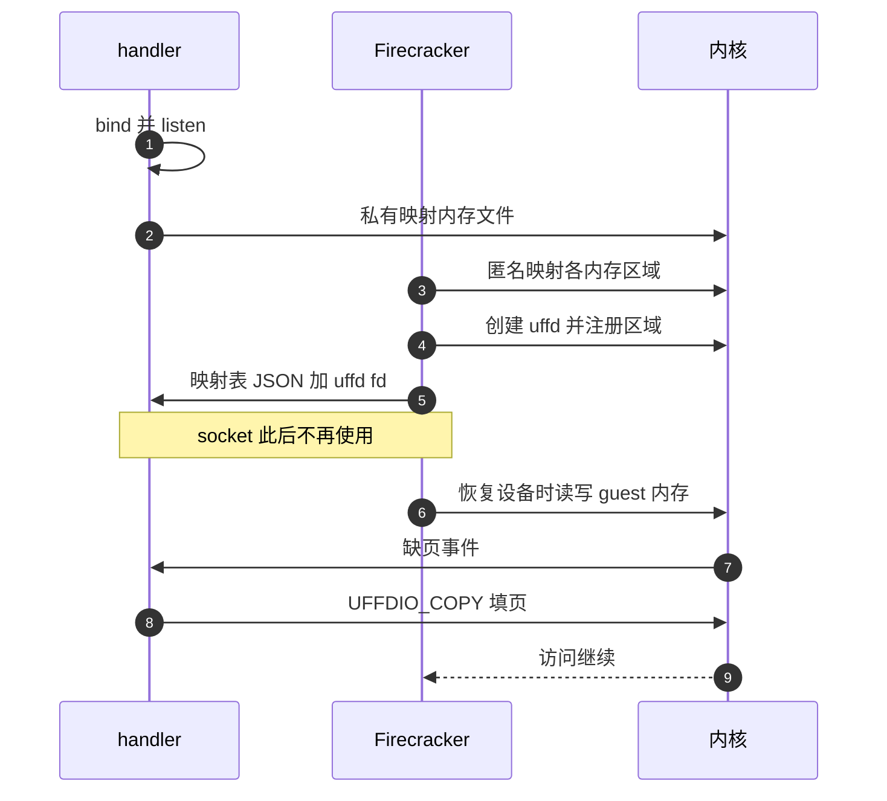
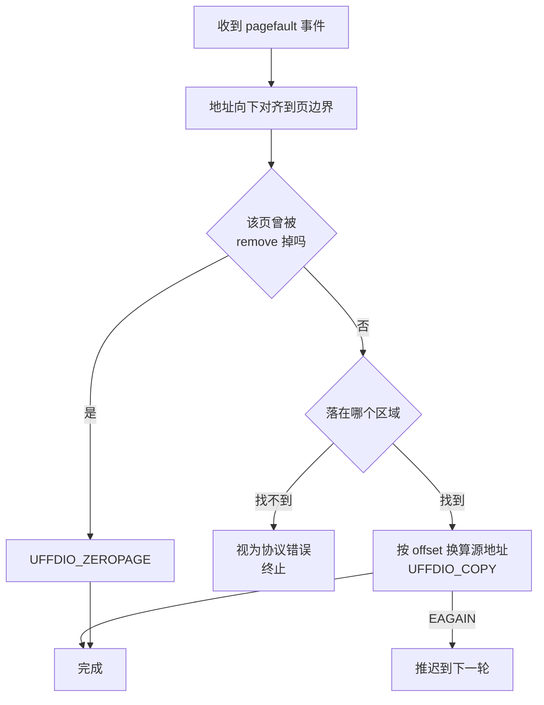

# 39 · userfaultfd 后端与缺页处理

> 从快照恢复时，guest 内存的内容要从某处搬回来。上游 v1.12.1 给了两条路：交给内核按文件映射按需读，
> 或者把每一次缺页都送给一个宿主侧的进程去回答。后一条路是 `Uffd` 后端。
> 本篇讲这条路上的三个角色怎么握手、缺页事件长什么样、谁在什么时候可能卡住。
>
> **读者**：系统工程师。　**预备**：[第 13 篇 · guest 内存](13-guest-memory.md)、
> [第 36 篇 · 快照总览](36-snapshot-overview-and-format.md)、[第 38 篇 · 加载快照](38-snapshot-load.md)。
> **代码**：`src/vmm/src/persist.rs`、`src/vmm/src/vstate/memory.rs`、
> `src/firecracker/examples/uffd/`、`src/vmm/src/devices/virtio/balloon/util.rs`

---

## 0. 本篇要回答的问题

1. `File` 后端已经能把内存文件按需读进来，为什么还要一个用户态缺页处理器？
2. Firecracker、缺页处理器与内核三方之间传的到底是什么，握手为什么只发生一次？
3. 注册用的是哪一种 uffd 模式，这个选择决定了处理器能看到什么、看不到什么？
4. 处理器收到一个缺页事件后，怎么从事件地址算出该填哪一段文件内容？
5. balloon 设备为什么会给这条路径带来第二种事件，处理器不处理会怎样？
6. 大页为什么只能走这条路？
7. 处理器崩溃时 Firecracker 会怎样，谁负责发现？

---

## 1. 两种后端，两种分工

`PUT /snapshot/load` 的请求体里有一个 `mem_backend`，`backend_type` 取 `File` 或 `Uffd`
（`src/vmm/src/vmm_config/snapshot.rs`）。两者在 `restore_from_snapshot()`
（`src/vmm/src/persist.rs`）里分岔，分岔之后建出来的 guest 内存映射性质完全不同。

`File` 走 `guest_memory_from_file()`，最终调到 `memory::snapshot_file()`：用 `MAP_PRIVATE`
把内存文件映射进来。guest 第一次读某一页时触发缺页，内核从页缓存或磁盘取页；
第一次写时触发写时复制，从此那一页变成进程私有的匿名页。整个过程 Firecracker 不参与，
也无从参与 —— 内核既不通知它，也不给它机会替换内容。

`Uffd` 走 `guest_memory_from_uffd()`，它调的是 `memory::anonymous()`：
`MAP_PRIVATE | MAP_ANONYMOUS`，没有任何文件在背后。刚建好时这片地址空间一页都没有实际内存。
随后 Firecracker 创建一个 userfaultfd 对象，把每个区域注册进去，再把这个文件描述符
连同区域的布局描述交给另一个进程。从此，这片内存上的每一次「这一页还不存在」都会变成一条事件，
送到那个进程手里由它来回答。

把责任挪到用户态换来了三件上游 `File` 后端给不了的事：内容可以不来自那一个文件
（可以是网络、可以是多层合并出来的结果）、可以在缺页时做别的事（统计、预取、按策略拒绝）、
以及唯一一条支持大页的恢复路径（第 6 节）。代价是多了一个必须一直活着的进程，
以及每一次首次访问都要跨进程往返一次。

---

## 2. 握手：一次性交出去的两样东西

`guest_memory_from_uffd()` 的参数里，`mem_backend.backend_path` 不再是内存文件，
而是一个 Unix domain socket 的路径 —— 缺页处理器提前 bind 并 listen 在那里。
Firecracker 是连接方，处理器是监听方，所以处理器必须先起来。

函数体只有四步：

1. `create_guest_memory()`：按 `GuestMemoryState` 里的区域描述建匿名映射，
   同时生成一份 `Vec<GuestRegionUffdMapping>`；
2. `UffdBuilder` 创建 uffd 对象，参数是 `close_on_exec(true)`、`non_blocking(true)`、
   `user_mode_only(false)`，并 `require_features(FeatureFlags::EVENT_REMOVE)`；
3. 对每个区域调 `uffd.register()`；
4. `send_uffd_handshake()`：把映射表序列化成 JSON，连同 uffd 的 fd 一起经 socket 发出去。

`GuestRegionUffdMapping` 是这条路径上唯一的协议，字段如下：

| 字段 | 含义 |
|---|---|
| `base_host_virt_addr` | 该区域在 Firecracker 进程里的起始宿主虚拟地址 |
| `size` | 区域长度（字节） |
| `offset` | 该区域内容在内存文件里的起始偏移 |
| `page_size` | 该区域的页大小（字节），由 `huge_pages` 配置决定 |
| `page_size_kib` | 已废弃字段，名字说是 KiB，存的其实是字节，与 `page_size` 同值 |

`offset` 由 `create_guest_memory()` 按区域顺序累加得出，也就是说内存文件是各区域内容的平铺拼接，
这与创建快照时的写法一致（[第 37 篇](37-snapshot-create.md)）。
最后一个字段是个值得记住的教训：字段名进了对外协议就改不动了，只能标废弃并留着占位。

几个细节值得单独说。`user_mode_only(false)` 是必须的：guest 内存不只被 guest 指令碰，
也被 KVM 在内核态代表 guest 访问，还被 Firecracker 自己的设备模拟代码碰，
把处理范围限死在用户态缺页上会让后两类访问失败。`non_blocking(true)` 让处理器可以在没有事件时
立刻拿到「暂时没有」而不是阻塞，从而能和 socket 一起放进一次 `poll`。

`send_uffd_handshake()` 结尾有一行 `forget(socket)`：故意不关闭 socket。
注释说明了原因 —— 如果连接关闭的消息比映射表先到达处理器，处理器就永远看不到映射表。
代价是这个文件描述符在 Firecracker 进程里一直泄漏着，直到进程退出。

握手之后，这条 socket 上不再有任何通信。Firecracker 继续走它的恢复流程，
读 vmstate、重建设备、恢复 vCPU；这些步骤里凡是触碰 guest 内存的，都已经开始产生缺页事件了。



---

## 3. 只注册 MISSING 模式

`uffd.register()` 是 `userfaultfd` crate 里的一个便捷方法，它固定用 `RegisterMode::MISSING`
调 `UFFDIO_REGISTER`。上游 v1.12.1 没有调用带模式参数的那个版本，
所以这条路径上只有一种事件来源：访问一个还没有实际内存的页。

这个选择决定了处理器能看到什么。一页被 `UFFDIO_COPY` 填上之后，
之后对它的读和写都不再产生任何事件 —— 内核已经有页了，没有理由通知谁。
换句话说，uffd 在这里只用于「把内容搬进来」，不用于「观察内容被改了什么」。

后者并不是不能做：userfaultfd 还有写保护模式，注册时加上 `UFFDIO_REGISTER_MODE_WP`
就能让已存在的页在被写时也产生事件。上游没有用它，因为上游跟踪脏页的手段是 KVM 的脏页日志
（[第 14 篇 · 脏页跟踪](14-dirty-page-tracking.md)），而那条路不依赖 uffd。
要把写保护用起来需要的改动不小，这是 e2b 定制版做的事，见第 8 节。

还有一个后果：注册是按区域整体做的，没有按页的粒度。区域内哪些页已经填过、哪些还没填，
内核自己清楚，处理器不需要维护这张表，也拿不到这张表。

---

## 4. 处理器一侧：一个 poll 循环加一次地址换算

上游在 `src/firecracker/examples/uffd/` 里给了三个示例处理器，共用 `uffd_utils.rs` 里的骨架。
它们是示例不是产品，但骨架部分说明了一个处理器最少要做什么。

`Runtime::new()` 先把内存文件用 `PROT_READ | MAP_PRIVATE` 映射进自己的地址空间，
得到 `backing_buffer`。`Runtime::run()` 是一个 `libc::poll` 循环，
同时盯着 socket 与已经收到的每个 uffd：socket 可读意味着来了一个新的 uffd，
构造一个 `UffdHandler` 并把它的 fd 加进轮询集合；某个 uffd 可读意味着有缺页事件要处理。
一个 Runtime 能同时服务多个 uffd，这样同一个处理器可以照看多个 microVM。

`UffdHandler::from_unix_stream()` 做接收侧的握手：`recv_with_fd()` 拿 JSON 与 fd，
反序列化成映射表，校验各区域大小之和等于内存文件长度，取第一个区域的 `page_size` 作为全局页大小。
`get_mappings_and_file()` 外面还包了一层最多五次、每次间隔 100 ms 的重试，
注释坦承不清楚为什么偶尔收不到 fd —— 这是一处如实存在的不确定性。

真正的换算在 `serve_pf()` 里，三行算术：

```text
fault_page_addr = addr 向下对齐到 page_size
offset_in_region = fault_page_addr - region.base_host_virt_addr
src = backing_buffer + region.offset + offset_in_region
```

然后 `populate_from_file()` 调 `uffd.copy()`（即 `UFFDIO_COPY`）把 `src` 处的 `len` 字节
搬到 `fault_page_addr`。示例的按需处理器每次只搬一页，`fault_all_handler.rs` 则在第一次缺页时
把所有区域整体搬完，用来测量一次性填满的代价。选哪种、搬多少，完全由处理器决定，
Firecracker 不知情也不关心。

两类错误要吞掉而不是崩溃：`Error::PartiallyCopied` 且已复制字节为 0 或为 `-EAGAIN`
（有 remove 事件卡在队列里，见下一节），此时返回 false 让调用者把事件推迟重试；
`Error::CopyFailed` 且 errno 为 `EEXIST`（这一页已经被别的线程填上了），直接当成功。



---

## 5. balloon 带来的第二种事件

`UffdBuilder` 那一行 `require_features(FeatureFlags::EVENT_REMOVE)` 是无条件的，
代码注释解释了为什么可以无条件：这个特性只在 `madvise` 的钩子里被检查，
不会主动改变 uffd 的行为；没有 balloon 设备时根本不会调 `madvise`，开着也没有代价。

有 balloon 设备时就不一样了。balloon 膨胀意味着 guest 把一段内存还给宿主，
`src/vmm/src/devices/virtio/balloon/util.rs` 的 `remove_range()` 对那段地址调
`madvise(MADV_DONTNEED)`。这条系统调用会让内核向 uffd 投一个 `UFFD_EVENT_REMOVE`。
被移除的地址范围仍然处在 uffd 的监视之下，所以 guest 之后再碰它还会缺页 ——
但此时正确的答案是一页零，不是内存文件里的旧内容，因为那段内容已经被 guest 主动放弃了。
处理器为此要维护一张「被移除过的页」的集合，命中时用 `UFFDIO_ZEROPAGE` 而不是 `UFFDIO_COPY`。

同一个 `restored_from_file` 标志在这里还有第二重作用。`build_microvm_from_snapshot()`
把它置为 `vmm.uffd.is_none()`，也就是「是不是走的 `File` 后端」。
`remove_range()` 看到它为真时，要先用 `MAP_FIXED` 的匿名映射覆盖那一段，
因为文件私有映射上没有一个 `madvise` 标志能真正打出一个洞。走 uffd 后端时这一步跳过 ——
本来就是匿名映射，`MADV_DONTNEED` 直接生效。

上游示例处理器在注释里用了很长一段说明这里的两个麻烦，并且明说自己没有解决其中之一：

- 只要 uffd 队列里还压着一个未读的 remove 事件，所有 ioctl 都返回 `EAGAIN`。
  所以不能一次读一个事件处理一个，必须先把队列里的事件全部预取出来，再回头逐个处理。
- 事件到达的顺序不一定是因果顺序。balloon 在 VMM 线程上处理，缺页从 vCPU 线程上的 KVM 里产生，
  于是「先 remove 后 pagefault」的一对事件可能以相反的次序被读到。
  示例处理器选择忽略这个问题（赌 guest 内核反正会把新拿到的页清零），
  并写明生产级的处理器应当保证同一段地址上的 remove 先于 pagefault 被处理。

---

## 6. 大页只有这一条路

`restore_from_snapshot()` 里，`File` 分支的第一件事是检查 `huge_pages.is_hugetlbfs()`，
为真就直接返回 `GuestMemoryFromFileError::HugetlbfsSnapshot`，错误文本写着「请使用 uffd」。
原因在映射方式上：`memory::snapshot_file()` 只传 `MAP_PRIVATE`，
没有也无法给一个普通文件加上 `MAP_HUGETLB`。而 `memory::anonymous()` 会把
`huge_pages.mmap_flags()` 拼进去，2 MiB 配置下就是 `MAP_HUGETLB | MAP_HUGE_2MB`。

于是大页 microVM 的快照恢复只能走 uffd 后端。协议里的 `page_size` 字段就是为此存在的：
`HugePageConfig::page_size()` 在 2 MiB 配置下返回 2 MiB，处理器据此对齐故障地址、
并且每次 `UFFDIO_COPY` 要搬满 2 MiB。代价是首次访问的粒度放大了 512 倍 ——
guest 碰一个字节，处理器就得搬 2 MiB。收益是页表项数量与 TLB 压力大幅下降。
这个取舍属于大页本身，不属于 uffd。

---

## 7. 失败模式

**处理器先死。** Firecracker 的缺页会一直等下去，因为内核就是这样设计的：
没有人回答 `UFFDIO_COPY`，缺页就不返回。表现是 guest 整体冻结，Firecracker 进程还在，
API 还能连上，但任何碰到未填页的操作都会挂住。上游文档明说这是用户自己要监控的事。
示例处理器用两个办法兜底：握手时用 `getsockopt(SO_PEERCRED)` 拿到对端也就是 Firecracker 的 PID，
再装一个 panic hook，自己 panic 时先 `kill` 掉 Firecracker。
`malicious_handler.rs` 就是把这条路径反过来演示一遍：收到缺页直接 panic。

**Firecracker 先死。** `send_uffd_handshake()` 的注释解释了为什么 Firecracker 自己也留着一份 uffd fd
（`Vmm` 结构体里的 `uffd: Option<Uffd>` 字段）：如果 Firecracker 把 fd 关掉，
处理器又恰好退出，这片内存会悄悄退化成普通匿名内存 —— 缺页由内核填零，
guest 读到的是全零而不是快照内容，错误是静默的。保留这份 fd 让 uffd 对象至少不会因为
Firecracker 一侧的关闭而失效。

**seccomp 与 uffd 的创建时机。** vmm 线程的 seccomp 过滤器
（[第 42 篇 · seccomp](42-seccomp.md)）是在 `build_microvm_from_snapshot()` 的最后一步才装上的，
而 uffd 的创建、注册与握手都发生在这之前。查一下 `resources/seccomp/` 里的表就能确认这一点：
`vmm` 线程的白名单里既没有 `userfaultfd` 系统调用，`ioctl` 也只放行了四个 tty / fd 控制类请求号
（`FIONBIO`、`TIOCGWINSZ`、`TCGETS`、`TCSETS`）加少数几个 KVM 请求号
（x86_64 表四个，aarch64 表三个），没有任何 `UFFDIO_*`。恢复完成之后，Firecracker 一侧不会再对 uffd 做任何操作，
所有 ioctl 都由处理器进程发出，而那个进程不在 Firecracker 的过滤器管辖范围内。

**uffd 对象从哪里来。** `userfaultfd` crate 优先打开 `/dev/userfaultfd`，
只在这个设备文件不存在时才退回到 `userfaultfd` 系统调用；设备存在但没有权限时直接失败，不再退回。
这决定了部署时的一个前提：宿主上有这个设备文件的话，Firecracker 进程必须对它有读写权限。
用 jailer 时 jailer 会把它带进 jail（[第 43 篇 · jailer](43-jailer.md)），不用 jailer 就得自己配。

---

## 8. 后续各层的差异

e2b 定制版改动了本篇讲的注册环节：它换用一个支持写保护的 `userfaultfd` crate 分叉，
在 `MISSING` 之外再加 `WRITE_PROTECT` 模式注册，为的是让宿主侧能按页判断哪些内存被写过。
这条改动与它服务的脏页判据在[第 53 篇 · uffd 写保护](53-uffd-write-protection.md)展开。
ARM 适配版又把这几处写保护代码按架构关掉，因为 aarch64 内核没有对应特性，
见[第 57 篇](57-which-fork-commit-and-uffd-wp.md)。

`src/firecracker/examples/uffd/` 里的示例处理器三层都没有动过。这一点在配套判据时要留意：
e2b 定制版把写保护注册加进了 Firecracker 一侧，示例处理器却不认识 `UFFDIO_WRITEPROTECT`
那一类事件，拿它去配 e2b 定制版的判据不会报错，只会静默地什么都判不出来。
本篇其余部分三层一致。

---

## 9. 小结

- `File` 后端把内存文件私有映射进来由内核填页；`Uffd` 后端建匿名映射，把每一次首次访问变成一条事件交给外部进程。
- 三方握手只发生一次，内容是一份 JSON 映射表加一个 uffd 文件描述符，此后 socket 闲置但故意不关。
- 映射表里每个区域给出宿主起始地址、长度、在内存文件里的偏移与页大小；内存文件是各区域内容的平铺拼接。
- 上游只用 `MISSING` 模式注册，因此处理器只能看见「这一页还不存在」，看不见任何写操作。
- 处理器的核心动作是把故障地址对齐、定位区域、按偏移换算出源地址，再 `UFFDIO_COPY` 一段过去。
- balloon 会带来 `UFFD_EVENT_REMOVE`：被移除的页要用零页回答，且 remove 事件会让所有 ioctl 暂时返回 `EAGAIN`。
- 大页 microVM 的快照只能用 uffd 恢复，因为文件私有映射加不上 `MAP_HUGETLB`；代价是缺页粒度放大到 2 MiB。
- 处理器崩溃时 guest 静默冻结，Firecracker 不会自救；发现与回收是调用方的责任。
- uffd 的创建与注册发生在 vmm 线程装 seccomp 过滤器之前，所以过滤器里看不到相关的系统调用与 ioctl。

---

## 延伸阅读 / 下一篇

- [第 38 篇 · 加载快照](38-snapshot-load.md)：`Uffd` 后端在整条恢复流程里的位置。
- [第 34 篇 · balloon](34-balloon.md)：`remove_range()` 与 `MADV_DONTNEED` 的来龙去脉。
- [第 53 篇 · uffd 写保护](53-uffd-write-protection.md)：在 `MISSING` 之上加写保护之后能做什么。
- [下一篇：第 40 篇 · 设备状态的 Persist](40-device-persist.md)。
- 上游文档 `docs/snapshotting/handling-page-faults-on-snapshot-resume.md`，以及 Linux 内核文档
  `admin-guide/mm/userfaultfd`。
- e2b 侧的缺页处理器实现在 orchestrator 里，见 [e2b 手册第 31 篇](../e2b-infra/31-uffd-memory-backend.md)。
